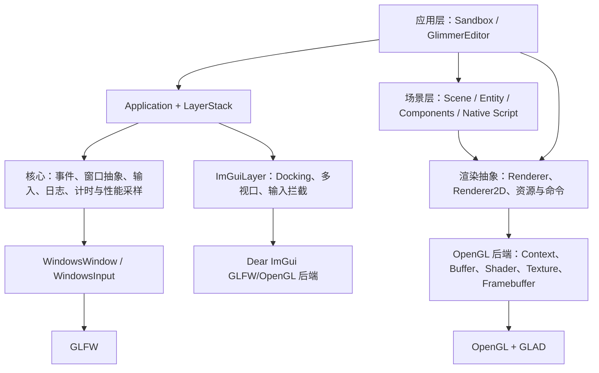
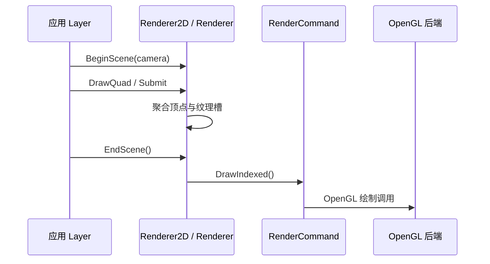

# Glimmer 项目架构说明

> 本文基于当前代码（2026-07-13）整理，描述已落地的实现，而非 README 中的规划清单。

## 1. 项目定位

Glimmer 是一个面向 Windows 的 C++17 图形/游戏引擎实验项目。它以 `Glimmer` 静态库提供核心能力，并由两个可执行程序承载具体使用场景：

- `Sandbox`：引擎功能验证与 2D 示例程序，也是 Premake 默认启动项目。
- `GlimmerEditor`：基于 Dear ImGui 的编辑器/渲染演示程序，包含停靠式界面、场景视口、帧缓冲和后处理。

当前渲染后端为 OpenGL；窗口与输入由 GLFW 提供。接口层已使用工厂和抽象类隔离部分平台、图形 API 细节，但尚未实现 Vulkan/DirectX 等其他后端。

## 2. 仓库组成

```text
.
├── Glimmer/                 # 引擎静态库
│   ├── src/Glimmer/         # 平台无关的核心、事件、渲染、场景、ImGui
│   ├── src/Platform/        # Windows 与 OpenGL 的具体实现
│   └── vendor/              # GLFW、GLAD、ImGui、GLM、EnTT、spdlog 等依赖
├── Sandbox/                 # 示例应用与 2D 测试资源
├── GlimmerEditor/           # 编辑器应用、着色器/模型/纹理资源
├── scripts/                 # Windows 工程生成脚本
├── vendor/bin/premake/      # Premake 可执行文件
├── premake5.lua             # 工作区与第三方依赖配置
└── README.md                # 学习过程与功能规划（部分内容超出当前实现）
```

## 3. 构建与产物

构建系统采用 Premake5，工作区名为 `GlimmerEngine`，目标架构是 `x64`，支持 `Debug`、`Release`、`Dist` 三种配置。

```text
Glimmer（StaticLib）
├── Sandbox（ConsoleApp，链接 Glimmer）
└── GlimmerEditor（ConsoleApp，链接 Glimmer）
```

在 Windows 下可运行 `scripts/Win-GenerateProject.bat` 生成 Visual Studio 2022 工程；生成后选择相应配置编译。可执行文件会输出至 `bin/<配置>-windows-x86_64/<项目名>/`，中间文件位于 `bin-int/`。

依赖关系如下：

- `GLFW`：窗口创建、事件轮询、OpenGL 上下文宿主。
- `GLAD`：OpenGL 函数加载。
- `Dear ImGui`：编辑器即时模式 UI，启用了 Docking 与多视口。
- `GLM`：向量、矩阵和相机计算。
- `EnTT`：场景 ECS 注册表。
- `spdlog`：日志。
- `stb_image`、`tinyobjloader`：纹理与 OBJ 模型加载。

注意：根 `premake5.lua` 还包含 `include "CGCourseProject"`，但当前仓库目录中未见该项目。若 Premake 生成失败，应先移除此 include，或补回对应目录；这不影响本文对现有三个项目的架构描述。

## 4. 分层架构



### 核心与应用生命周期

`Glimmer/Core/EntryPoint.h` 提供唯一的 `main()`：初始化日志，调用应用侧 `gl::CreateApplication()`，执行 `Application::Run()`，并在启动、运行、退出三个阶段写出 Chrome Trace 兼容的性能采样 JSON。

`Application` 是运行时协调器，负责：

1. 通过 `Window::Create` 创建窗口并注册统一事件回调。
2. 初始化 `Renderer`，再将 `ImGuiLayer` 作为 Overlay 压入层栈。
3. 在循环中计算 `Timestep`，依次调用各层 `OnUpdate`、启动 ImGui 帧、调用各层 `OnImGuiRender`、结束 ImGui 帧，再执行窗口的事件轮询与交换缓冲。
4. 接收窗口事件后，先处理应用级关闭事件，再以逆序把事件分发给 Layer；顶部 Overlay（通常是 ImGui）优先得到事件，已处理的事件停止继续传递。

`LayerStack` 将普通 `Layer` 放在前部，将 `Overlay` 放在尾部，提供更新顺序与事件优先级的基础。应用通过继承 `Application` 并实现 `CreateApplication()` 接入该生命周期。

## 5. 平台、窗口与事件

`Window` 是窗口接口；当前 Windows 实现是 `Platform/Windows/WindowsWindow`。它初始化 GLFW 窗口和 `OpenGLContext`，并把 GLFW 的窗口大小、关闭、键盘、字符、鼠标按键、滚轮与移动回调，转换为 `Glimmer/Events` 中的强类型事件。

事件系统由 `Event`、`EventDispatcher` 和分类位掩码构成。应用层使用 `Handled` 标记控制冒泡终止；`ImGuiLayer::BlockEvents` 会根据 ImGui 是否需要鼠标/键盘输入拦截对应事件。

## 6. 渲染架构

渲染公共接口位于 `Glimmer/Renderer`，后端实现位于 `Platform/OpenGL`。

| 层次 | 职责 | 当前实现 |
| --- | --- | --- |
| `RendererAPI` / `RenderCommand` | 清屏、绘制等低层命令抽象 | `OpenGLRendererAPI` |
| 资源抽象 | Buffer、VertexArray、Shader、Texture、Framebuffer | 对应的 `OpenGL*` 实现与工厂 `Create` |
| `Renderer` | 基础场景提交，上传 ViewProjection 和模型矩阵 | 适用于通用网格/3D 提交 |
| `Renderer2D` | Quad 批处理、纹理槽管理、全屏四边形和后处理 | 单批最多 20,000 个 Quad、32 个纹理槽 |

### 关键渲染链路



`Renderer2D` 在 CPU 端累积四边形顶点数据，在 `EndScene` 上传一次顶点缓冲并绘制；当 Quad 数或纹理槽超出上限时会 Flush 并开始下一批。它还提供全屏四边形绘制与以纹理 ID 为输入的后处理入口。

`Framebuffer` 抽象用于离屏渲染。编辑器先将画面绘制到主 FBO，按配置可再将颜色附件送入后处理 FBO，最终把颜色附件的 OpenGL 纹理 ID 显示在 ImGui Viewport 中。

## 7. 场景与 ECS

`Scene` 使用 EnTT 的 `registry` 存储实体和组件；`Entity` 是 `entt::entity` 与所属 `Scene` 的轻量包装。当前组件定义在 `Components.h`：

- `TagComponent`：实体名称。
- `TransformComponent`：平移、欧拉旋转、缩放，以及模型矩阵生成。
- `SpriteRendererComponent`：2D Quad 颜色。
- `CameraComponent`：`SceneCamera`、主相机标记、固定宽高比选项。
- `NativeScriptComponent`：通过模板 `Bind<T>()` 延迟实例化 C++ 脚本。

运行时更新先延迟创建并更新脚本，然后选择标记为 `Primary` 的相机，最后遍历带有 Transform 与 SpriteRenderer 的实体，交给 `Renderer2D` 绘制。视口尺寸变化会更新所有非固定比例相机。

## 8. 两个宿主程序

### Sandbox

`SandboxApp.cpp` 创建 `Sandbox` 应用并压入 `Sandbox2D`（可替换为 `ExampleLayer`）。它用于验证引擎层、2D 渲染、资源和输入等基础能力。

### GlimmerEditor

`EditorApp.cpp` 创建 `GlimmerEditor` 并压入 `EditorLayer`。该层在附加时加载着色器、纹理、OBJ 模型、双帧缓冲和示例场景；更新阶段执行背景全屏 Shader、3D 模型提交、ECS 场景 2D 绘制与可选后处理；ImGui 阶段提供 DockSpace、统计面板、Shader/光照设置及 Viewport。

编辑器以 `m_ViewportFocused` / `m_ViewportHovered` 决定相机控制器和 ImGui 输入拦截，避免编辑 UI 与场景操作相互干扰。

## 9. 资源、诊断与扩展边界

- 应用资源随宿主程序存放在各自的 `assets/` 目录，代码当前使用相对路径加载，因此运行时工作目录需要能解析这些路径。
- 日志由 `Log` 封装的 spdlog 提供；性能采样宏生成的 JSON 可导入 Chrome `chrome://tracing` 或兼容的 Trace 查看器。
- 新增图形后端需实现资源与命令抽象的工厂/接口，并调整 API 选择逻辑；当前 `RendererAPI::API` 仅枚举并使用 OpenGL。
- 新增应用通常只需链接 `Glimmer`、实现 `gl::CreateApplication()` 并压入业务 Layer；新增功能应尽量放在 Layer、Scene 或 Renderer 抽象层，而非直接耦合 `WindowsWindow` / `OpenGL*` 类。

## 10. 当前边界与待完善项

当前代码已经具备引擎循环、层栈、窗口事件、OpenGL 渲染、2D 批处理、基础 ECS、原生脚本和编辑器视口。但 README 中提到的场景层级面板、Inspector、Gizmo、多后端支持等，在当前源码中尚未形成完整实现；`SceneHierarchyPanel` 目前仅作为 `Scene` 的友元前置预留。使用或扩展该项目时，应以源码为准。
