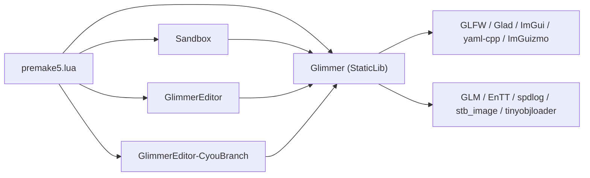
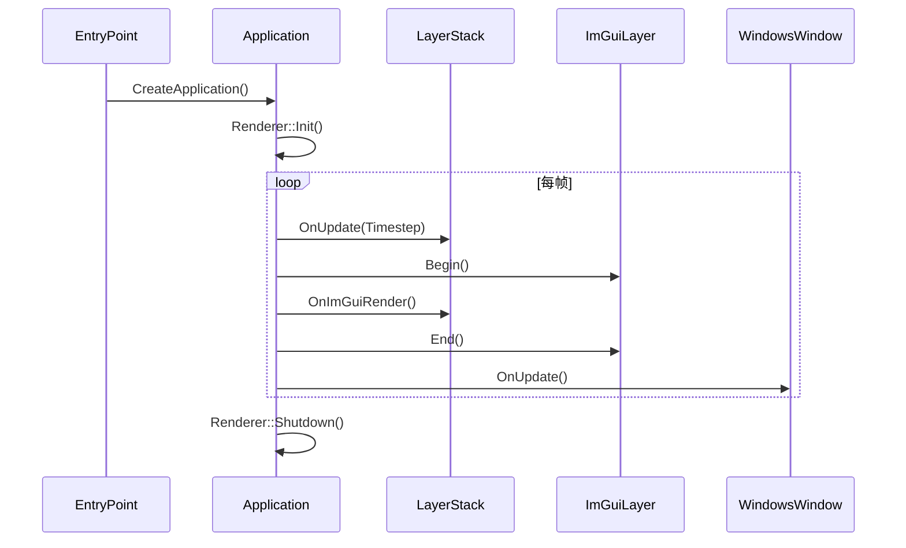
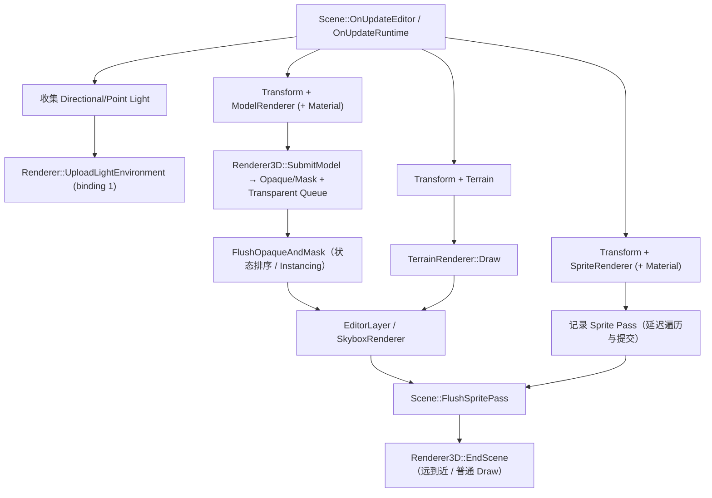
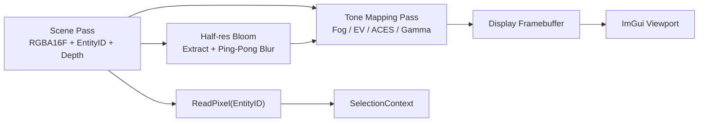
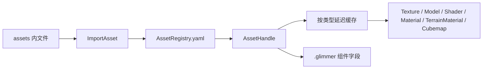
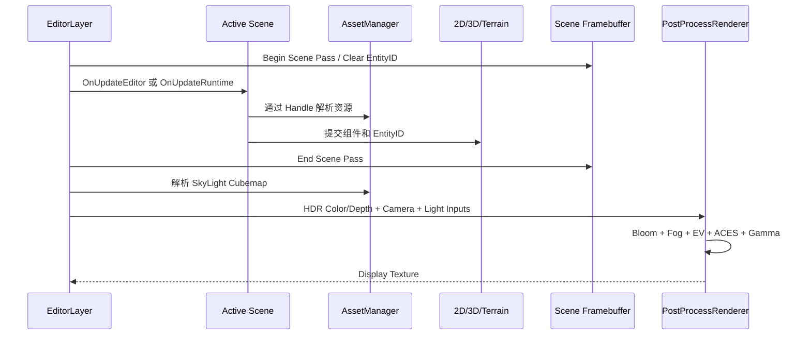
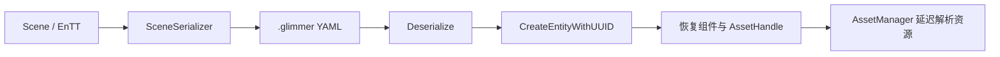

# Glimmer 项目架构说明

> 本文最近于 2026-08-18 对照当前源码同步，只描述已经落地的结构与数据流。
> 当前工作优先级、验收条件和技术债以 `Documents/PROJECT_STATUS.md` 为准；功能演进和实现笔记参见 `README.md`。

## 1. 项目定位与当前边界

Glimmer 是一个面向 Windows 的 C++17 图形/游戏引擎实验项目。核心引擎编译为 `Glimmer` 静态库，应用通过 `Application`、`Layer`、Scene/ECS、资产系统和渲染抽象使用引擎能力。

当前状态：

- 唯一可运行的图形后端是 OpenGL；Vulkan、SPIR-V 只完成枚举、接口和依赖预埋；
- 当前主要开发宿主是 `GlimmerEditor-CyouBranch`，它包含完整场景编辑、资产浏览、材质、地形和多 Pass 视口链路；
- `GlimmerEditor` 保留较早的编辑器/渲染演示实现，不代表当前完整编辑器架构；
- `Sandbox` 用于基础引擎与 Renderer2D 示例验证，也是 Premake 默认启动项目；
- 场景和资产以 YAML 描述文件持久化，实体与资产分别使用稳定 UUID/AssetHandle；
- 3D 模型按 Opaque/Mask/Blend 分类；Opaque/Mask 使用状态排序与 Instancing，Blend 在 Skybox 后按距离反向排序并普通绘制。

## 2. 仓库组成

```text
.
├── Glimmer/                         # 引擎静态库
│   ├── src/Glimmer/
│   │   ├── Asset/                   # AssetHandle、注册表、类型缓存
│   │   ├── Core/                    # Application、Window、Layer、输入、日志、UUID
│   │   ├── Events/                  # 强类型事件与分发
│   │   ├── ImGui/                   # ImGui 生命周期与输入拦截
│   │   ├── Renderer/                # 渲染抽象、2D/3D、材质、地形、天空盒
│   │   ├── Scene/                   # ECS、组件、场景复制与 YAML 序列化
│   │   ├── Simulation/              # GPU 读写纹理网格
│   │   ├── Terrain/                 # 程序化地形配置与生成
│   │   └── Utils/                   # 文件对话框等公共工具
│   ├── src/Platform/OpenGL/         # 当前图形后端
│   ├── src/Platform/Windows/        # GLFW 窗口、输入、原生文件对话框
│   └── vendor/                      # 第三方依赖
├── Sandbox/                         # 基础示例宿主
├── GlimmerEditor/                   # 较早编辑器宿主
├── GlimmerEditor-CyouBranch/        # 当前完整编辑器宿主
│   ├── src/Editor/                  # CommandHistory 与实体快照
│   ├── src/Panels/                  # Hierarchy、Inspector、Content、Shader、Terrain
│   └── src/Utils/                   # 编辑器资产创建辅助
├── resources/                       # 品牌资源与 Windows RC/ICO
├── scripts/                         # VS2022/VS2026 工程生成脚本
├── Documents/PROJECT_STATUS.md      # 跨设备长期工作状态
├── premake5.lua                     # 工作区与依赖入口
├── ARCHITECTURE.md                  # 当前架构事实
└── README.md                        # 功能演进、实现说明与 KB
```

各宿主拥有自己的 `assets/`。当前编辑器以工作目录下的 `assets` 初始化资产管理器，因此启动时的工作目录必须能正确解析相对资源路径。

## 3. 构建系统与项目图

构建系统采用 Premake5，工作区为 `GlimmerEngine`，架构为 `x64`，配置包括 `Debug`、`Release`、`Dist`。当前跨设备验证基线是 Visual Studio 2026、MSVC `v145`、`Debug | x64`；仓库仍保留 VS2022 生成脚本用于兼容性尝试，但不是当前验证基线。



工程生成入口：

- `scripts/Win-GenerateProject-vs2026.bat`：当前使用的 VS2026 工程；
- `scripts/Win-GenerateProject-vs2022.bat`：生成 VS2022 工程；
- 生成产物位于 `bin/<配置>-windows-x86_64/<项目名>/`；
- 中间产物位于 `bin-int/<配置>-windows-x86_64/<项目名>/`。

所有三个可执行宿主都编译共享的 `resources/windows/Glimmer.rc`，从 `resources/branding/Glimmer.ico` 获取 Windows 应用图标。

第三方项目由根 Premake 纳入 `Dependencies` 分组。SPIRV-Cross 的上游 Premake 会递归加入 samples/tests，根配置使用 `removefiles` 排除这些非引擎目标。

## 4. 应用生命周期、平台与事件

`Glimmer/Core/EntryPoint.h` 提供 Windows 程序入口。宿主实现 `gl::CreateApplication()`，创建自己的 `Application` 子类并压入业务 Layer。



核心职责：

- `Application`：窗口、主循环、LayerStack、Renderer 和 ImGuiLayer 的生命周期协调；
- `LayerStack`：普通 Layer 正序更新，Overlay 位于栈顶并优先接收逆序事件；
- `Window`：平台无关接口，当前工厂创建 `WindowsWindow`；
- `WindowsWindow`：创建 GLFW 窗口和 `OpenGLContext`，把 GLFW 回调转换为 Glimmer 事件；
- `EventDispatcher`：按事件类型分派并用 `Handled` 控制传播终止；
- `ImGuiLayer`：启用 Docking/多视口，并根据 ImGui 捕获状态拦截鼠标和键盘事件；
- `WindowsInput`：实现轮询式键盘、鼠标输入；
- `WindowsFileDialog`：实现场景和资产选择所需的原生打开/保存对话框。

日志由 spdlog 封装；`Instrumentor` 可输出 Chrome Trace 兼容的性能采样 JSON。

## 5. 渲染架构

### 5.1 抽象层与 OpenGL 后端

渲染公共接口位于 `Glimmer/Renderer`，OpenGL 实现位于 `Platform/OpenGL`。

| 层次 | 职责 | 当前实现 |
| --- | --- | --- |
| `RendererAPI` / `RenderCommand` | 清屏、视口、索引绘制与实例化索引绘制等低层命令 | `OpenGLRendererAPI` |
| GPU 资源抽象 | Buffer、VertexArray、Texture、Framebuffer、UniformBuffer、PixelBuffer | 对应的 `OpenGL*` 实现 |
| Shader 抽象 | 图形 Shader、Compute Shader、热重载结果 | GLSL/OpenGL Program |
| 场景渲染器 | `Renderer2D`、`Renderer3D`、`TerrainRenderer`、`SkyboxRenderer` | OpenGL 驱动的静态渲染器 |
| Pass 编排 | FBO 绑定、清理和结束生命周期 | `RenderPass` |

`Renderer::Init()` 依次初始化 `RenderCommand`、Renderer2D、Renderer3D、绑定点 1 的 Light UBO 和 SkyboxRenderer。资源对象通过静态 `Create` 工厂根据 `RendererAPI` 选择后端；目前选择 Vulkan 会触发“尚未实现”的断言。

### 5.2 场景渲染路径

Scene 负责从 ECS 收集可渲染组件，具体绘制由专用渲染器完成。



运行模式和编辑模式共享模型、地形、Sprite 与光照上传路径，区别在相机和脚本：

- 编辑模式由 `EditorCamera` 提供 ViewProjection 和相机位置，不运行 Native Script；
- 运行模式先创建/更新 Native Script，再查找 `Primary` SceneCamera；没有主相机时不执行场景绘制；
- `OnRuntimeStop()` 调用脚本 `OnDestroy()` 并释放运行时实例。

Renderer2D 在 CPU 侧聚合 Quad 顶点，管理最多 32 个纹理槽，在容量耗尽时 Flush；每个 Batch 显式启用标准 Alpha 混合，EndScene 后恢复禁用，避免依赖 OpenGL 全局状态。零索引 Batch 会在 `Renderer2D::Flush` 内直接结束，不能把 `DrawIndexed` 的零值“使用完整索引缓冲”语义误用于空 Sprite 帧。完整编辑器调用 Scene Update 时传入 `deferSpritePass=true`，Scene 只保存 ViewProjection 和待执行标记，不开始 Renderer2D Batch，也不遍历 Sprite；EditorLayer 绘制 Skybox 后调用 `Scene::FlushSpritePass`，此时才完成 Sprite 遍历、Begin/Submit/End 和所有实际 Draw。这样即使纹理槽或索引容量在提交中耗尽，自动 Flush 也只能发生在 Skybox 之后。默认参数为 false，因此不拥有 Skybox 编排的旧宿主仍在 Scene Update 内立即完成 Sprite Pass。Entity ID 写入独立整数附件以支持编辑器拾取。Sprite 可以使用自身纹理，也可以附带 Material/MaterialOverrides。

Renderer3D 在 `SubmitModel` 阶段解析 Model、Material 和 Shader，并通过 `(EntityID, MaterialHandle)` 缓存最终 MaterialProperties。缓存保存基础 MaterialState、MaterialOverrides、版本与最后使用帧；完整状态未变化时复用结果，变化时重新构造 MaterialInstance，长期未使用项会被回收。每个有效 Mesh 再展开为一个 RenderItem；BaseColor 纹理优先级为 Material、Mesh 自带纹理、白纹理回退，Normal/AO/Emissive 只使用 Material Handle，缺失时绑定白纹理但通过独立存在标记禁止采样。

提交时，Opaque 和 Mask 进入 OpaqueQueue，Blend 进入 TransparentQueue。`FlushOpaqueAndMask` 按 ShaderHandle、MaterialHandle、四组 Texture GPU ID、Mesh、完整最终材质位模式和 EntityID 排序；Mesh、Shader、全部纹理、最终 MaterialProperties 和纹理存在状态完全相同的连续项形成兼容 Batch。BaseColor、Normal、AO、Emissive 固定使用纹理单元 0～3，切换状态按 slot 独立缓存。支持实例化契约且 Batch 大于一项时上传最多 1024 项的动态 Instance Buffer 并调用 `DrawIndexedInstanced`；不同 Override 结果会拆批，不支持实例属性的 Shader 自动执行普通 Draw。

完整编辑器先完成 Opaque/Mask 和 Terrain，再绘制 Skybox，随后依次 Flush Sprite Batch 和调用 `Renderer3D::EndScene`。这保证 2D Alpha 与已经存在的 Skybox 颜色混合，而不是与 Scene Clear Color 混合。TransparentQueue 按实体 Transform 原点到相机的平方距离由远到近稳定排序，首版始终普通 Draw；它开启标准 SourceAlpha 混合、保留深度测试并关闭深度写入，结束后恢复 Blend 禁用、DepthWrite 启用和 Less 深度函数。较早编辑器宿主没有 Skybox 插入点，在 Scene 更新内立即 Flush Sprite，并在返回后结束透明队列。OpenGL `DrawIndexed` 不隐式解绑 Texture2D，纹理和 Pass 状态由上层渲染器维护。

BufferLayout 的元素带 `PerVertex / PerInstance` 输入频率；OpenGLVertexArray 持续分配属性位置，将 Mat3/Mat4 拆为列属性，并为实例元素设置 divisor 1。Shader 在初次链接和热重载后检查 `a_InstanceTransform`、`a_InstanceEntityData` 和 `u_UseInstancing`，由公共接口报告是否支持实例化，Renderer3D 不依赖 OpenGLShader 类型。

Renderer3D Statistics 除提交、跳过、DrawCall 和状态绑定外，还记录 Opaque/Mask/Transparent 项数、TransparentDrawCalls、BatchCount、InstanceCount、InstancedDrawCalls、IndividualDrawCalls、SavedDrawCalls 以及 Material Cache Hit/Miss。两个执行阶段结束后 RenderedItems 必须等于 SubmittedItems；一个实例化 DrawCall 可以对应多个 RenderItem。

### 5.3 Framebuffer、多 Pass 与拾取

Framebuffer 支持以下附件格式：

- `RGBA8`：普通 LDR 颜色；
- `RGBA16F`：线性 HDR 场景颜色；
- `RED_INTEGER`：实体 ID；
- `Depth24Stencil8`：深度/模板。

当前完整编辑器的视口链路为：



Scene Pass 开始时把 EntityID 附件清为 `-1`。模型、地形和 Sprite 写入自身 EnTT entity 整数 ID；视口将鼠标坐标转换到 Framebuffer 坐标后读取该附件，再由 Scene 反查实体。Mask 被 `discard` 的像素不写颜色、深度或 EntityID；Blend 的有效 Alpha 小于等于 `1/255` 时同样丢弃，其余透明片元按远到近顺序写入 EntityID。Skybox 使用只读深度和 LessEqual 在场景 Pass 内绘制，Tone Mapping 输出到单独 Display FBO。Overlay Pass 已留出结构但当前被注释，不属于已启用链路。

Scene Framebuffer 的第三个附件是可采样 `Depth24Stencil8`。引擎侧 `PostProcessRenderer` 持有 Display FBO、两张随视口缩放的半分辨率 `RGBA16F` Bloom FBO、ToneMapping/Bloom Shader 引用、`PostProcessSettings` 和完整后处理执行顺序；Shader 仍注册在编辑器共享的 `ShaderLibrary`，因此沿用现有热重载入口。EditorLayer 只提交 Scene Color/Depth、Camera Position、Inverse ViewProjection、SkyLight Texture/Intensity 和 DirectionalLight Color，不直接实现提取、模糊或显示映射算法。

Scene Color 先进行 Bloom 软阈值提取：根据 EV 后亮度决定贡献但保留未曝光 Radiance，5 权重高斯模糊以水平/垂直 Ping-Pong 迭代。ToneMapping Pass 同时读取 HDR Color、Bloom 与 Scene Depth；合成顺序固定为 Scene+Bloom、Distance/Height Fog、EV、ACES White Point、Gamma，因此 Bloom 不重复曝光且远处光晕受雾衰减。其采样器槽位由 PostProcessRenderer 每帧完整声明为 Scene Color=0、Scene Depth=1、Fog Cubemap=2、Bloom=3；即使某个效果关闭也不让不同 GLSL sampler 类型依赖默认 slot 0，避免跨驱动的 Program Texture Usage 非法状态。高度项沿 Camera→Fragment 射线解析积分指数密度，而非只采样终点高度。雾色可使用手动线性色、当前 SkyLight Cubemap 的方向性低 Mip 或首个启用 DirectionalLight 的 Color×Intensity；缺失来源回退手动色。天空深度被显式跳过。全部 Bloom/Fog/EV/White Point 参数只存在于 `PostProcessSettings` 运行时实例，并由 Editor Settings UI 编辑，不属于 Scene、Camera 或 Environment 序列化状态。

### 5.4 光照、PBR、天空盒与地形

Scene 每帧从第一个启用的 DirectionalLight、最多 16 个 PointLight 和第一个启用且拥有有效 Cubemap Handle 的 SkyLight 构造 `LightEnvironment`。Renderer 将方向光与点光转换为与 GLSL `std140` 对齐的 GPU 数据并上传到 binding 1 的 UBO；SkyLight Handle、Intensity 和启用状态交给 `EnvironmentLighting` 解析，不写入该 UBO。

第一个启用且开启 `CastShadows` 的 DirectionalLight 同时驱动 CSM Shadow Pass。Scene 在主颜色 Pass 前调用 `ShadowRenderer`：后者按序列化的 Resolution、Distance、Bias、Cascade Count、Split Lambda 与 Cascade Blend 创建或复用最多四个纯运行时 `Depth32F` Framebuffer，从 Camera View/Projection 重建世界空间视锥，并以 Practical Split 划分各级覆盖范围。每级使用包围球确定稳定正交范围并执行 Shadow Texel Snap；相邻级联再按较短区间的一定比例向 Split 两侧扩展，形成共同可采样的重叠区域。Mesh 在构造时缓存局部 AABB；ShadowRenderer 将 Model 子网格 Bounds 与 Terrain 的网格/高度 Bounds 变换到当前 Light VP Clip Space，执行保守六平面剔除后才提交深度 Draw。Terrain 先经 `TerrainRenderer::Prepare` 生成或复用 Height/派生 Runtime，因此首帧即可参与投影；全部级联完成后由 `RenderPass::RebindCurrentTarget` 恢复 Scene Framebuffer 与 Viewport。

PBRModel 与 Terrain 共用四组 Light VP、Cascade Split/Blend Width、Camera View、Bias 和 `3×3 PCF` 接收契约，并按片元视空间深度选择级联。Split 过渡区同时采样相邻级联并以 `smoothstep` 混合，区间外只采样当前级联。模型材质占用 0～3，级联图绑定到 slot 4～7，Diffuse Irradiance / Specular Prefilter / BRDF LUT 绑定到 slot 8/9/10；Terrain 已占用 0～15，级联图绑定到 slot 16～19，三张环境资源绑定到 slot 20/21/22。`ShadowRenderer` 还持有不参与 `Disable` 帧重置的运行时级联可视化开关，并在 Lighting Bind 时统一上传；PBRModel 与 Terrain 以固定色覆盖部分最终线性颜色，重叠区复用同一 Blend 权重，因此不改变 Shadow Depth、Alpha 或 Entity ID。Scene 向 Model Shadow Submit 传递 MaterialHandle 与实体 Overrides，ShadowRenderer 通过 MaterialInstance 得到最终 Alpha 状态；Opaque 与 Mask 进入 Shadow Queue，Blend 在提交边界被跳过，避免半透明表面生成错误的实心轮廓。Mask 在 ShadowDepth Fragment 中以 BaseColor Alpha、BaseColor Texture Alpha、TilingFactor 和 AlphaCutoff 执行与颜色 Pass 相同的裁剪。每个级联内，Model 子网格在 Frustum 剔除后进入 Shadow Queue，并按 Mesh 与最终 Mask 状态排序；兼容批次使用最多 1024 项的动态 Transform Buffer 执行 Instanced Draw，Mask 的贴图、Base Alpha、Cutoff 或 Tiling 不同都会拆批。ShadowRenderer 为每个源 Mesh 缓存独立 Shadow VAO，只复制 PerVertex Buffer 并将 Shadow Instance Transform 放在 location 4～7，从而不依赖或覆盖 Renderer3D 已挂到源 VAO 的 Transform/EntityID Instance Buffer。ShadowDepth 将模型 UV 固定在 location 3，并保留 Terrain Height UV 的 location 1；Terrain 当前仍独立绘制。Shadow Framebuffer、深度纹理、Light VP、Split、Blend Width、队列、实例缓冲、Shadow VAO 缓存与调试开关均不序列化，DirectionalLight 只持久化重建所需设置。

`GPUTimer` 是 Renderer 层的可选计时资源；OpenGL 后端以四个 `GL_TIME_ELAPSED` Query 轮转，Begin/End 只提交时间范围，`TryGetElapsedMilliseconds` 仅在 `GL_QUERY_RESULT_AVAILABLE` 为真时读取，禁止为调试 UI 强制等待 GPU。ShadowRenderer 在第一条 Cascade GPU 命令前开始、最后一个 Cascade 结束后停止；TerrainRenderer 以 BeginScene/EndScene 包围 Terrain Color Pass。两者都只在 Statistics 中保存最近可用耗时和单调递增样本号，不序列化。Vulkan 当前返回空 Timer，调用方必须允许计时不可用。

当前 3D Material 参数包括 BaseColor/BaseColorTexture、NormalTexture/NormalScale、AOTexture/AOStrength、EmissiveTexture/EmissiveColor/EmissiveStrength、TilingFactor、Metallic、Roughness、AlphaMode 和 AlphaCutoff。PBRModel 使用基础 Cook–Torrance PBR：切线空间 Normal 修改 BRDF 法线，AO 只调制环境光项，Emissive 在线性 HDR 结果中累加；BaseColor Alpha 与纹理 Alpha 的乘积继续驱动 Mask/Blend。模型加载阶段按 UV 梯度生成 Tangent，退化 UV 或无有效累积切线时建立稳定正交基，避免 Normal Mapping 产生 NaN。

`SkyLightComponent` 引用 Cubemap 资产。Cubemap 可以是保存六面 LDR 图片路径的 `.glsky`，也可以是直接导入的 Radiance `.hdr`；`.glsky` 还可通过 `Source` 引用相对路径的等距柱状 HDR，并用 `Resolution` 指定目标面尺寸。AssetManager 缓存 `Cubemap` Runtime；后者记录实际环境源路径、HDR 标记和成功 Reload 后递增的资源版本。SkyboxRenderer 使用去除平移的视图方向绘制同一 Runtime 的可见背景。

`EnvironmentMapLoader` 属于 Renderer 核心层，负责将等距柱状浮点图按统一 `+X/-X/+Y/-Y/+Z/-Z` 方向约定双线性转换为六面数据；经度循环、纬度钳制，避免接缝和极点越界。转换结果以线性 `RGBA16F TextureCube` 上传并生成完整至 `1×1` 的 Mip Chain。TextureCube 抽象拥有 Mip 数、逐级面上传和生成 Mip 接口，OpenGL 只实现存储与传输，不拥有环境资产解析算法。当前这些 Mip 仍是普通下采样链，不等同于 Specular Prefilter。

`EnvironmentLighting` 管理当前 SkyLight 和进程内派生环境缓存。首次缺少任一派生图时，它通过 TextureCube 的后端无关浮点面读回取得一次线性源数据；sRGB 六面源在 CPU 侧解码，HDR 源保持线性。EnvironmentMapLoader 使用确定性 Hammersley 序列：余弦重要性采样默认生成 `32×32 RGBA16F`、每像素 64 样本的 Diffuse Irradiance；GGX 半程向量重要性采样生成 `64×64 RGBA16F`、64 样本、完整 7 层的 Specular Prefilter，Mip 0 直接保留源环境，后续层按 Roughness 扩散。统一缓存键为 `Source Handle + Cubemap Runtime Version + Derived Map Type + Resolution + Sample Count`，因此 Diffuse 与 Specular 可独立命中或失效；活动键正常帧不读回、不卷积，Reload 时移除同一源的旧版本项。与具体环境无关的 Split-Sum BRDF LUT 在 Renderer 初始化时由同一数学模块预积分为共享 `64×64 RG16F` Texture2D，每像素 128 样本，使用 ClampToEdge 与双线性采样且不随 SkyLight 切换重建。以上缓存当前只在进程内存中存在，尚无磁盘派生资产或 LRU 预算。

PBRModel 与 Terrain 对 Irradiance 使用相同的 Fresnel-Schlick-Roughness 与 `(1-F) × (1-metallic)` 漫反射权重，并乘以 AO 和 SkyLight Intensity；镜面环境项按反射方向和 `roughness × maxLod` 读取 Prefilter，再以 `normalDotView / roughness` 采样 BRDF LUT，应用 `Prefilter × (F0 × scale + bias)`。没有有效派生环境图时保留方向光 Ambient 回退。当前 IBL 只反射 SkyLight 环境，不包含场景实体；局部 Reflection Probe、SSR 或平面反射尚未实现。

地形实体由 `TerrainComponent` 保存可序列化的 `TerrainSpecification`，运行时 GPU 对象放在不持久化的 `TerrainRuntime` 中：

- `TerrainGenerator` 依次执行 GenerateFBM、有限次 Thermal Erosion 与 Derive Maps；GenerateFBM 可按序列化的 GeologyBlend 选择性叠加 Worley 地质块、陡峭区遮罩、裂谷和大尺度趋势，Blend 为 0 时保持原生成公式；
- Height 使用 R32F `SimulationGrid` Ping-Pong；侵蚀每轮只读 ReadTexture、只写 WriteTexture，Barrier 后交换，禁止同纹理读写；
- 派生阶段从最终 Height 生成三张 RGBA16F Runtime 纹理：Normal/Slope、Curvature/Flow Potential、Grass/Soil/Rock/Snow Material Weights；
- Custom、Alpine、Plateau、Rolling Hills、Volcanic、Eroded Valley 预设属于可序列化规格，手动修改预设参数后转为 Custom；
- 也可引用导入的高度图 Texture Asset；
- `TerrainMesh` 生成规则表面与四条重复边界 Skirt；`TerrainChunkLayout` 以纯 CPU 数据固定描述 `3×3` Chunk 的全局 UV、局部 XZ、世界尺寸、三档 LOD 分辨率及相邻级差约束；
- `TerrainRenderer` 延迟创建/重建运行时资源并完成地形绘制；Runtime 持有按 `ceil(MeshResolution / 3)`、约二分之一和约四分之一建立的 LOD0/1/2 三份共享 Chunk Mesh，九块区域共用 Height/派生纹理和材质绑定，并通过逐块 Uniform 恢复完整覆盖；Color Pass 先执行 Camera Frustum 剔除，再按 Chunk 世界中心距离选择 LOD，复用上帧级别施加 5 单位迟滞，并把四方向相邻级差限制为 1；程序化路径使用派生法线和归一化四层权重，外部高度图保持即时法线回退；
- `TerrainSpecification::TerrainMaterialHandle` 引用独立 `.glterrainmat`；Handle 为 0 时 TerrainRenderer 使用内建四层颜色/PBR 参数且不加载具体层纹理，有效 Handle 才从 AssetManager 缓存解析四层参数，并使用纹理单元 4～15 绑定每层 Albedo/Normal/AO；
- Terrain Shader 以世界坐标对 XY/XZ/YZ 三个平面采样并按法线方向混合，避免陡坡沿网格 UV 拉伸；派生权重再叠加高度、坡度、曲率和 Flow/低地湿度修正，最后进入 Cook–Torrance 直接光与线性 HDR 输出；
- TerrainRenderer 的采样质量是纯运行时全局状态：Full-4 保留完整基线，Top-2 在最终权重确定后裁剪低贡献层，Dominant Detail 只为主导层读取 Normal/AO，Auto Distance 在近景 Top-2 与远景 Dominant Detail 间平滑衰减次要层细节；默认使用 Full-4，以完整保留四层连续权重和每层 Albedo/Normal/AO 过渡，Auto 的距离阈值仍为 80 世界单位。采样设置、GPU Timer 与 Statistics 不进入 Scene YAML；
- TerrainRenderer 另持有纯运行时 LOD 可视化开关；Color Pass 在正常 PBR 与级联调试结果之后，以红/绿/蓝覆盖 LOD0/1/2。DebugPanel 和 `GLIMMER_TERRAIN_LOD_VISUALIZE` 只控制该开关，不改变 LOD 选择、Shadow LOD0 路径或 Scene YAML；
- 参数、Compute Shader 或资源变化时通过 `Invalidate` 使 Runtime 失效。正常帧只采样缓存结果；生成、有限次侵蚀与派生只在 Dirty 或显式 Regenerate 时 Dispatch。

Color Pass 和 ShadowRenderer 都使用同一个 `TerrainChunkLayout`，按每个 Chunk 的局部 XZ 范围与 Terrain HeightScale 构造独立 AABB，再通过共用的 `FrustumCulling` 八角点算法连同实体 Transform 投入 Camera 或 Light Clip Space。只有八个角点全部位于同一平面外才剔除，因此跨越视锥边界的 Chunk 保守保留；通过测试后才上传 Chunk Uniform 并提交 Draw。Color Pass 使用距离 LOD，Shadow Pass 固定使用 `TerrainRuntime::Mesh` 指向的 LOD0；两条路径都在顶点阶段把 Skirt 标记顶点下移，遮盖不同分辨率的接缝。Chunk 布局、LOD 历史、统计和共享 Mesh 都是运行时状态，不进入 Scene YAML。

`tmp/tmpTerrain` 的水流、泥沙、蒸发和气象 HLSL 仅作为后续算法参考，不属于当前运行链路。运行时水文仍必须遵守 SimulationGrid 的 Ping-Pong 所有权和跨 Dispatch 全局 Barrier；禁止在单个 Workgroup Barrier 后读取其它 Workgroup 尚未完成的输出。

P13A～P13C 的纯 CPU `TerrainHydrologyRuntime` 是 GPU 数值基线。它持有独立的 Height 初始快照，以及 Water、四方向 Flux、二维 Velocity 和 Sediment；Sediment 表示单位地表面积上的悬浮质量。该运行时由 `TerrainRuntime::Hydrology` 独立拥有，默认可为空，不随 TerrainComponent 复制或序列化，也不复用 `TerrainGenerator` 的 Height Ping-Pong。每个固定步先从同一旧状态计算四邻域水出流并按可用水量缩放；再以旧 Sediment 质量除以当前可用水体积得到浓度，用同一四向 Water Flux 计算泥沙质量流率，并按可用泥沙质量二次限幅；最后统一汇总邻格入流和自身出流。完成输运状态更新后，CPU 由 `CapacityScale × WaterDepth × Speed` 派生 Capacity，并由 `Sediment / Capacity` 派生 Saturation。

CPU P13C 源项在派生 Capacity 后执行局部 Height/Sediment 交换，再重算诊断场。Height 通过 `TerrainDensity` 转换为单位面积等效质量：欠饱和格按容量缺口和 ErosionRate 将地形质量转入 Sediment，过饱和格按容量超额和 DepositionRate 将 Sediment 转回 Height；两条路径都受单步最大 Height 变化限制，侵蚀额外受相对初始 Height 的 MaximumErosionDepth 限制，沉积额外受当前可用 Sediment 限制。默认两项速率为 0。统计分别保留 Sediment 单项误差和 Terrain+Sediment 组合质量误差，并记录累计侵蚀/沉积质量；Reset 恢复 Height/Water/Sediment 初始快照和预算。CPU 实例当前只用于无窗口参考测试，不与场景 GPU Height 做逐帧同步。

GPU 路径由同一 `TerrainRuntime` 独占一个 `TerrainHydrologyGPU`。Water、Sediment 和 Runtime Height 分别使用 `R32F` Ping-Pong，四向 Flux 与二维 Velocity 分别使用 `RGBA16F` Ping-Pong；程序化 Terrain 的生成器 Height 保持不可变，只在运行时创建或生成版本变化时读回一次作为两张 Runtime Height 的初始数据和侵蚀下界。每个固定步先 Dispatch `HydrologyFlux.comp` 并交换 Flux，再由 `HydrologyUpdate.comp` 写新 Water/Velocity；`SedimentTransport.comp` 在交换 Water 前读取旧 Water、当前 Flux 与旧 Sediment，按照浓度和可用质量限幅计算邻格质量交换，只写新 Sediment。交换 Water、Velocity 和 Sediment 后，`SedimentCapacity.comp` 写出只读 Capacity/Saturation；`ErosionDeposition.comp` 再读取初始/当前 Height、Sediment 与 Capacity，同时写入下一张 Height 和 Sediment，Barrier 后统一交换二者并重算诊断场。每个 Pass 后都执行全局 Barrier；任何阶段都不在同一 Dispatch 中读写同一纹理或读取其它 Workgroup 尚未完成的输出。五个 Compute Shader 均由 TerrainRenderer 在正常 Prepare 中轮询事务式热重载。Terrain 生成版本改变时整个 GPU 水文状态重建，Reset 从缓存的初始 Height 恢复两张 Runtime Height 并清空其它状态；TerrainComponent 复制和 Scene YAML 均不携带这些纹理。

`Scene` 将帧 `Timestep` 传给 `TerrainRenderer::BeginScene`。Shadow Pass 可以调用 `Prepare` 创建资源，但只有 BeginScene/EndScene 之间的 Color Pass 首次 Prepare 会消费固定步累加器、Single Step、Reset、Sediment Seed 或 Readback 请求，避免同一帧因阴影和九个 Chunk 重复推进。DebugPanel 通过 TerrainRenderer 的纯运行时全局入口控制 Play、Single Step、Reset、Rainfall、Capacity、Erosion/Deposition Rate、Terrain Density、侵蚀深度、单步 Height 上限、一次性 Sediment 初始密度和诊断模式；手动 Readback 才同步读取 Runtime Height 与五个水文场并计算体积、质量误差、范围和有限性，普通帧不做 GPU Readback。独立 GPU Contract 除 P13B 的 `3×1` 输运盆地外，还创建侵蚀/沉积用临时状态，用同一实例经 Reset 分别执行 `0.04×25` 与 `0.01×100` 帧划分，同时检查组合质量、侵蚀下界、沉积方向、确定性和恢复；它只由 Debug 请求或 `GLIMMER_HYDROLOGY_VALIDATE=1` 触发，完成后释放临时资源。Terrain Color/Shadow 顶点阶段统一读取 Runtime Height；Fragment Shader 固定从 slot 23～27 读取 Water/Velocity/Sediment/Capacity/Saturation 并提供五种互斥诊断模式。当前 Normal/Slope、Analysis 和 MaterialWeight 仍由生成器 Height 派生，运行时 Height 改变后不会自动刷新，这是 P13C 收口前必须消除的几何—着色边界。

`.glterrainmat` 与普通 `.glmat` 是两个注册表类型和两套 YAML 根。TerrainMaterial 固定拥有 Grass、Soil、Rock、Snow 四层；每层保存颜色、Albedo/Normal/AO Handle、Tiling、Metallic、Roughness、NormalScale 和 AOStrength，资产级参数控制三平面锐度与高度/坡度/曲率/湿度混合强度。缺失纹理时使用层颜色、几何法线和 AO=1；存在纹理必须分别满足 sRGB Color、Linear Normal、Linear Data 语义。TerrainMaterial 保存也采用临时文件替换，但不进入 MaterialInstance 或实体 MaterialOverrides 链路。

### 5.5 Shader、Compute 与数据读回

图形 Shader 支持单文件 `#type` 分段格式，`ShaderLibrary` 按名称管理并支持轮询热重载。OpenGL Shader 采用事务式 Program 替换：新源码完整编译/链接成功后才替换旧 Program，失败时保留上一有效版本并返回 `ShaderReloadResult`。

Compute Shader 提供 Dispatch、MemoryBarrier 和同样的文件轮询重载能力。图形/计算 Shader 读取源码时都会剥离 UTF-8 BOM，避免严格 OpenGL 驱动把 `EF BB BF` 识别为非法 GLSL 字符。

同步纹理读回由 Texture 接口提供；`PixelBuffer` 封装 PBO，用于异步双缓冲读回。Framebuffer 的整数像素读取是编辑器拾取的独立同步路径。

## 6. Scene、Entity 与 ECS

`Scene` 持有 EnTT `registry`；`Entity` 是 `entt::entity` 与所属 Scene 的轻量包装。每个实体创建时至少包含：

- `IDComponent`：稳定 UUID，用于序列化、复制、Undo/Redo 和跨重载查找；
- `TagComponent`：显示名称；
- `TransformComponent`：平移、欧拉旋转、缩放并生成模型矩阵。

可选组件：

| 组件 | 作用 |
| --- | --- |
| `SpriteRendererComponent` | 颜色、Texture AssetHandle、TilingFactor |
| `ModelRendererComponent` | Model AssetHandle |
| `MaterialComponent` | Material AssetHandle 与实体局部 Overrides |
| `TerrainComponent` | 地形规格与非序列化 Runtime |
| `DirectionalLightComponent` | 方向光颜色、强度、环境强度、启用状态 |
| `PointLightComponent` | 点光颜色、强度、范围、启用状态 |
| `SkyLightComponent` | Cubemap AssetHandle、强度、启用状态 |
| `CameraComponent` | SceneCamera、Primary、固定宽高比 |
| `NativeScriptComponent` | C++ 脚本实例化/销毁函数指针与运行时实例 |

Scene 维护 `UUID -> entt::entity` 映射，提供按 UUID 和临时 EnTT ID 查找。`Scene::Copy()` 保留 UUID 并复制所有已支持组件，用于 Edit/Play 隔离。`TerrainComponent` 的复制构造与复制赋值都只保留 Specification 并清空 Runtime，强制目标 Scene 或命令恢复后的组件独立重建 GPU 资源。

## 7. 资产系统与材质继承

### 7.1 AssetRegistry

`AssetHandle` 是 UUID。`AssetManager::Initialize("assets")` 加载 `assets/AssetRegistry.yaml`，注册表保存 Handle、类型、相对路径以及纹理颜色空间/语义。资产必须位于项目资产目录内；导入目录外文件会被拒绝。

支持的资产类型：

- Texture2D；
- Model；
- Shader；
- Material（`.glmat`）；
- TerrainMaterial（`.glterrainmat`）；
- Cubemap（`.glsky`、Radiance `.hdr`）。

AssetManager 按规范化相对路径去重导入，并分别维护 Texture、Model、Shader、Material、TerrainMaterial、Cubemap 缓存。`.hdr` 与 `.glsky` 都注册为 Cubemap，但前者直接作为浮点环境源加载。Texture 元数据区分 Linear/sRGB 与 Color/Normal/Data/Height 语义，修改元数据时清除对应缓存并重写注册表。PBR 约定 BaseColor/Emissive 为 sRGB Color，Normal 为 Linear Normal，AO 为 Linear Data（Height 也可作为线性单通道数据）；Renderer3D 与 TerrainRenderer 只解析符合 slot 契约的 Texture Handle，不在绘制阶段改写注册表。



### 7.2 Model 源文件导入边界

模型源文件解析与 GPU 资源创建已经分离。`ModelImporter` 按扩展名选择具体 importer：`ObjModelImporter` 使用 tinyobjloader 解析 OBJ/MTL，`AssimpModelImporter` 使用 Assimp 解析静态 FBX；两者都只输出纯 CPU `MeshSource`。`MeshSource` 由 `SubmeshSource`、`MeshVertex` 和 `MeshMaterialSource` 组成，不持有 VertexArray、Buffer、Texture 或 OpenGL 对象；Assimp 的 `aiScene`、`aiMesh` 与 `aiMaterial` 仅存在于 importer 私有实现中，不进入 Renderer、Scene、组件或公共 Model API。

静态 FBX 导入会三角化、合并重复顶点、生成缺失法线/切线、改善索引局部性，并通过 `aiProcess_PreTransformVertices` 把节点变换烘焙到顶点。当前不保留节点层级、骨骼、动画、Morph Target 或嵌入纹理，也没有额外执行单位归一化；导入结果使用 Assimp 输出的坐标与单位。`MeshMaterialSource` 可描述 BaseColor、Normal、Metallic、Roughness、AO、Emissive 路径与基础因子。若 FBX 只引用 BaseColor，importer 会在模型相邻、`Textures` 和 `Textures/Raw` 目录内按受限的 `_N/_M/_R/_AO` 约定补全外部贴图。

`Model` 只消费有效 MeshSource，为各 Submesh 创建 GPU `Mesh`，并按 MaterialIndex 共享解码后的导入纹理。Renderer3D 先使用实体 `.glmat`/MaterialInstance 的 BaseColor、Normal、AO、Emissive 通道，缺失时回退到 Mesh 导入通道；导入 Metallic/Roughness 使用独立采样器。材质纹理占 0～3，CSM 占 4～7，IBL 占 8～10，导入 Metallic/Roughness 固定占 11～12，避免 sampler 类型或用途冲突。导入纹理目前仍是 Model 持有的运行时 Texture2D，不是 AssetHandle，也不会自动生成 `.glmat`，属于后续 `.glmesh`/材质烘焙要收口的边界。

官方 Assimp `v6.0.5` 以 `Glimmer/vendor/assimp` Git 子模块存在，不作为 Premake 源码项目编译。`scripts/Win-BuildAssimp-vs2026.bat` 通过 `vswhere` 限定选择 VS 18.x/2026 和 v145，并使用上游 CMake 在 x64 开发者环境中生成独立 `/MT` 静态库，只启用 OBJ、FBX 和 glTF importer；MSVC 构建显式禁用 Assimp 的 ccache。生成的 `config.h`、静态库、CMake Cache 与 Glimmer 构建指纹都位于被忽略的 `vendor/assimp-build/vs2026-<Configuration>`。Premake 的 Debug 链接 Debug 产物，Release/Dist 链接 Release 产物；基于 `$(ProjectDir)` 的 Glimmer PreBuildEvent 调用快速 Ensure，按产物、配置 Schema、Assimp 子模块提交和 ccache 状态判断是否重建，因此解决方案与单项目构建共用同一依赖边界。AssetManager 当前注册 `.obj` 与 `.fbx` 为 Model；`.gltf`、`.glb` 和内部 `.glmesh` 尚未开放。

### 7.3 Material 与 MaterialInstance

`.glmat` 是共享 Material Asset，保存 ShaderHandle 与 `MaterialProperties`。`MaterialState` 可以一次捕获或恢复两者，供共享资产编辑事务使用。保存时先写临时文件，再通过备份和替换更新目标；替换失败会恢复原文件并向调用方返回失败。

实体不复制整份材质，而由 `MaterialComponent` 保存 MaterialHandle 和 `MaterialOverrides` 位掩码。

`MaterialInstance` 在提交时以共享 Material 为基础，仅替换启用的字段：

```text
最终属性 = MaterialProperties + MaterialOverrides(Mask, Values)
```

这使多个实体可以继承同一 `.glmat`，同时覆盖 BaseColor、四类纹理、TilingFactor、Metallic/Roughness、NormalScale、AOStrength、EmissiveColor/Strength、AlphaMode 或 AlphaCutoff。Material 和 MaterialOverrides 均维护运行期 version/Dirty；Inspector 的连续属性修改和离散开关都会推进版本。Renderer3D 缓存最终解析结果，同时比较完整基础状态与 Overrides，因此 Undo/Redo 恢复旧版本号或某条写入路径遗漏 Dirty 时也不会复用不匹配结果。旧 `.glmat` 或场景 Override 缺少扩展字段时使用结构默认值，仍默认 Opaque/0.5、无附加纹理和零 Emissive 输出。

## 8. 场景序列化

`SceneSerializer` 使用 yaml-cpp 读写 `.glimmer` 文件。实体记录稳定 UUID，并序列化当前支持的 Tag、Transform、SpriteRenderer、ModelRenderer、Material、Terrain、DirectionalLight、PointLight、SkyLight 和 Camera 组件。

持久化规则：

- 资源引用一律保存 AssetHandle，不保存运行时指针或 OpenGL ID；
- Material Overrides 保存 Mask 和 Values，使禁用字段仍可保留编辑值；
- Terrain 只保存 Specification，包括 Preset、Noise、Authoring Erosion、Compute Shader Handle 与 TerrainMaterialHandle；Height 和三张派生纹理加载后按需重建，不写入 YAML；
- NativeScript 包含函数指针，当前不参与场景序列化；
- 反序列化使用 `CreateEntityWithUUID` 恢复稳定身份；
- Scene 复制、保存/加载、Edit/Play 都以组件值为边界，不共享运行时脚本实例。

### 8.1 无窗口回归边界

`GlimmerRegressionTests` 是独立 ConsoleApp，链接 Glimmer 静态库但不创建 Application、Window、Renderer 或 OpenGL Context。它直接覆盖纯数据和持久化边界：Material/TerrainMaterial YAML、MaterialInstance Override 合并、OBJ/FBX 到 MeshSource 的 CPU 导入、固定 UUID Scene YAML 与 `FindEntityByUUID` 索引恢复，以及 Terrain Specification（含 TerrainMaterialHandle）往返、Runtime 非持久化、实体/Scene 复制隔离、CommandHistory Undo/Redo 和五类 Terrain Preset 的确定性/参数边界。测试目标直接编译编辑器的 `EditorCommand.cpp` 以复用真实命令栈实现，但不引入 EditorLayer 或面板运行时。通常测试文件只创建在系统临时目录并由进程生命周期清理；Cerberus FBX 测试会向上查找仓库根并使用版本化 `assets/models/Cerberus` 样本，缺失时明确失败，不再依赖或静默跳过本机 `tmp`。测试 Debug 配置关闭增量链接，避免静态依赖更新后复用损坏的 `.ilk`。

根 Premake 将该目标与编辑器、Sandbox 一同写入 VS2026 `GlimmerEngine.slnx`。`scripts/Verify-Windows.bat` 是无暂停入口，使用显式 ExecutionPolicy 调用 `Verify-Windows.ps1`；PowerShell 实现负责检查已初始化的递归子模块、重新生成工程、构建完整 `Debug | x64` 解决方案并执行测试二进制。测试执行器聚合断言并以进程退出码表达结果，因此调用脚本和后续 CI 不需要解析编辑器日志即可判断成功或失败；`--force-failure` 只用于验证非零退出传播。

该目标不替代需要 GPU/窗口的 DebugPanel Lab。Instancing/PBR 等 Lab 继续验证真实渲染统计和 Shader 行为，并保持临时 Scene 不写入 `m_EditorScene`；无窗口目标只承担可确定、无需图形上下文的状态与序列化回归。

## 9. 当前编辑器架构

### 9.1 EditorLayer 编排

`GlimmerEditor-CyouBranch/src/EditorLayer` 是当前完整编辑器协调层，持有：

- `m_EditorScene`：可编辑的源场景；
- `m_RuntimeScene`：进入 Play 时复制出的运行时场景；
- `m_ActiveScene`：面板和渲染当前使用的场景；
- `EditorCamera`、Scene Framebuffer 与一个引擎侧 `PostProcessRenderer` 实例；
- `SelectionContext`、`EditorCommandHistory`；
- Hierarchy、Inspector、ContentBrowser、ShaderPanel、DebugPanel。

新建编辑器会话的默认内存 Scene 创建 Sun、Point Light、Sky Light 和一个 Alpine 程序化 Terrain。默认 Terrain 持有图形/Compute Shader Handle，但 `TerrainMaterialHandle` 为 0，因此会生成高度及派生 Runtime，而不解析 `.glterrainmat` 或加载四层具体材质纹理。Add Component、高度图拖入与 TerrainMaterial 拖入仍可创建其它 Terrain。

进入 Play 时，EditorLayer 清理选择，复制 EditorScene 为 RuntimeScene，切换所有面板上下文并禁用编辑命令历史；停止时销毁运行时脚本，丢弃 RuntimeScene，再切回 EditorScene。运行时修改不会写回编辑场景。

DebugPanel 是编辑器诊断工具的长期宿主，目前包含 Renderer3D/Terrain Overview、`InstancingLabTool`、`PBRMaterialLabTool` 与 `TerrainSamplingBenchmarkTool`。Terrain Overview 还提供 LOD0/1/2 统计、距离阈值和运行时调试着色。前两类 Lab 创建真实 ECS 临时内存 Scene，EditorLayer 只通过受控回调切换 `m_ActiveScene`，不替换 `m_EditorScene`，并保证同一时刻只有一个临时工具占用场景；退出 Lab、切换场景、进入 Play 或关闭编辑器时恢复原场景。Lab 激活期间 CommandHistory 和场景保存被禁用，Hierarchy 不枚举临时实体。PBR Lab 生成六个材质球验证纹理通道和 Metallic/Roughness 标量组合，并可通过环境变量自动运行临时 `.glmat`/Scene YAML 往返；测试场景和临时文件不持久化为项目内容。Terrain Sampling Benchmark 不创建或持有 Scene，只读取 TerrainRenderer Statistics 并切换纯运行时采样档位；手动入口要求当前 Terrain 已绑定具体纹理。

Instancing Lab 同时托管 Shadow Benchmark 状态机和 Shadow Visual Validation 预设。Benchmark 只修改 Lab 自己的 DirectionalLight，在固定的 9 组 Cascade/Resolution 配置间轮换，并在每次切换后先预热再采样。`ShadowRenderer::Statistics::GpuTimingSample` 是跨帧单调递增的 Query 结果序号；状态机仅在序号变化时接收耗时，因而不会把非阻塞计时器保留的上一结果重复计入平均值。DebugPanel 在窗口可见性判断之前推进状态机，使页签切换或关闭面板不会暂停测试；结果只保存在工具运行时内存中。Visual Validation 复用相同临时 Scene 边界，生成 Opaque、Mask、Blend 三种投影策略对照和四级深度标记，通过 EditorLayer 提供的受控相机框选回调调用 `EditorCamera::SetView`，提供级联全景与投影物近景两种构图；它只调整临时方向光和纯运行时级联调试开关，不污染正式 Scene。

EditorLayer 识别 `GLIMMER_SHADOW_BENCHMARK_AUTORUN` 后，通过 DebugPanel 的受控接口生成固定 2500 实体的 Maximum Instancing Lab 并启动相同状态机。完成时 InstancingLabTool 将 9 组统计写入日志，EditorLayer 再请求 Application 正常关闭；`GLIMMER_SHADOW_VISUAL_AUTORUN` 使用同一边界生成视觉场景，`GLIMMER_SHADOW_VISUALIZE_CASCADES` 与 `GLIMMER_SHADOW_VISUAL_CLOSEUP` 分别选择级联着色和投影物近景。自动入口不绕过临时 Scene 隔离，也不另建第二套阴影逻辑。

`GLIMMER_TERRAIN_SAMPLING_BENCHMARK_AUTORUN` 仅在诊断运行中为默认 Terrain 分配 DefaultTerrain 资产、固定 EditorCamera，并启动与手动入口相同的 TerrainSamplingBenchmarkTool；三档完成后由 EditorLayer 请求正常退出。`GLIMMER_TERRAIN_SAMPLING_VISUAL_MODE=0..3` 使用同一固定场景边界选择单档供截图检查。这些入口不改变默认内存 Scene 仍保持 TerrainMaterialHandle=0 的启动契约，也不保存任何场景或采样设置。

### 9.2 选择与面板职责

`SelectionContext` 是实体选择和资产选择的互斥联合状态：选择资产会清除实体，选择实体会清除资产。

| 面板 | 当前职责 |
| --- | --- |
| `SceneHierarchyPanel` | 枚举 Scene 实体、选择、创建/复制/删除入口 |
| `InspectorPanel` | 根据 SelectionType 绘制 Entity Components 或 Asset 属性；TerrainMaterial 提供四层贴图/PBR/混合参数及显式保存/重载 |
| `ContentBrowserPanel` | 目录树、文件网格、资产选择、拖放和双击打开 |
| `ShaderPanel` | ShaderLibrary 自动/手动重载与结果显示 |
| `DebugPanel` | 通用诊断入口；展示 Renderer3D 概览并托管可扩展的临时测试工具 |
| `InstancingLabTool` | 生成隔离 ECS 压力/阴影视觉场景，对照 Renderer3D 统计；自动轮换 CSM 配置并汇总唯一 GPU Timer 样本；管理相机框选、代表实体选择和清理 |
| `PBRMaterialLabTool` | 生成六球材质通道对照场景，验证 PBR 纹理语义、渲染项完整性及 Material/Scene YAML 往返 |

Hierarchy 和 Inspector 通过 Scene、SelectionContext、CommandHistory 接入，不直接拥有编辑器 Scene 生命周期。

### 9.3 CommandHistory 与当前覆盖范围

编辑器命令实现返回成功状态的 `IEditorCommand::Execute/Undo`；`EditorCommandHistory` 只在操作成功后移动 Undo/Redo 栈，新命令成功执行后才清空 Redo 栈。`LambdaEditorCommand` 用于不会失败的轻量操作，`ValueEditorCommand<T>` 保存修改前后值并允许 Apply 返回失败，`EditorValueTransaction<T>` 负责连续控件的激活快照。`EntitySnapshot` 捕获 UUID 和可复制组件，用于实体删除、恢复等生命周期命令。

当前已经接入：

- 实体创建、删除、复制；
- 组件添加、移除、重置；
- Transform 连续拖动压缩为单次 Undo；
- Terrain、Directional/Point/Sky Light 与 Camera 连续属性按控件激活/释放压缩为单次 Undo；
- Terrain HeightMap 与 SkyLight Cubemap 的离散替换；
- TerrainMaterial 的组件拖入/清除；
- MaterialHandle、MaterialOverrides 的开关、数值、纹理和 Reset；
- 共享 Material Asset 的完整状态、磁盘保存和失败回滚；
- Edit 模式快捷键 Undo/Redo。

当前尚未统一接入：

- Tag、SpriteRenderer、ModelRenderer 等部分组件属性；
- Material 以外 Asset 的统一 Dirty、保存失败反馈和退出提示。

TerrainMaterial Asset 当前支持实时编辑、显式保存和磁盘重载，但资产字段尚未进入 CommandHistory；这仍属于上述统一 Asset Command 边界，而不是已具备的 Undo 保证。

共享 Material 在 Play 模式下只读，避免运行时编辑写回磁盘；实体组件编辑发生在 RuntimeScene 副本中，停止播放后丢弃。以上未实现部分属于 `Documents/PROJECT_STATUS.md` 中的后续技术债，不应视为现有保证。

## 10. 关键跨层数据流

### 编辑器场景帧



### 场景保存与恢复



## 11. 扩展约束与近期演进方向

新增功能应遵守以下边界：

- 平台代码放入 `Platform/Windows` 或新的平台目录，不让 Scene/Renderer 直接依赖 Win32；
- 图形 API 资源通过 Renderer 抽象和工厂创建，不在编辑器中直接构造 `OpenGL*` 对象；公共 Renderer、Scene、Asset 和 Editor 接口不得暴露 `GLuint`、`GLenum` 等 OpenGL 类型；
- Scene 组件和 Asset 描述只保存可复制、可序列化的业务状态与 Handle；GPU Runtime、Framebuffer、派生纹理和后端对象放入运行时结构或资产缓存，不写入场景文件；
- 持久资源使用 AssetHandle，实体长期身份使用 UUID，临时 EnTT ID 只用于当前 Scene 与拾取；
- 正式场景参数应组件化或资源化；编辑器面板通过上下文和命令接口修改数据，不拥有 Application/Scene 生命周期，独立测试 Panel 仅用于诊断；
- `EditorLayer` 只负责 Scene、Scene Framebuffer、Camera、后处理输入和面板的生命周期编排，不承载 Bloom/Tone Mapping、Terrain、IBL 或环境模拟算法及其正式业务状态；
- 新的编辑器属性修改应同时考虑 Undo/Redo、Edit/Play 隔离、序列化和保存失败路径；
- 新增 3D Shader 必须遵守 `Opaque / Mask / Blend` 契约；若声明支持 AlphaMode，需要消费 `u_AlphaMode`、`u_AlphaCutoff` 并保持 Mask/Blend 的深度和 EntityID 语义。透明对象仍不得进入现有 Opaque Instancing；
- 已实现的有限次 Authoring Erosion 只由 Terrain Dirty/Regenerate 触发；P13A～P13C CPU/GPU Hydrology 使用独立状态集、固定步长调度器、GPU Height/Water/Sediment Ping-Pong、只读 Capacity/Saturation 派生场和局部质量交换。Runtime Height 不序列化、不隐式 Bake，也不能复用或隐式推进 Authoring 管线；
- IBL 源环境、Diffuse Irradiance 和 Specular Prefilter 已按 Handle、Cubemap Runtime Version、派生图类型与生成参数进入内存派生缓存；BRDF LUT 作为环境无关的进程级共享资源只在初始化或参数变化时生成，禁止逐帧积分，磁盘缓存需另行定义版本化格式；
- GPU 环境模拟应使用固定时间步和明确的 Ping-Pong 资源所有权，禁止无保护地读写同一纹理，也不得依赖每帧 GPU Readback 驱动主流程；
- README 记录功能建设过程，ARCHITECTURE 记录当前事实，PROJECT_STATUS 记录下一步执行顺序，三者不要互相替代。

近期架构演进顺序以 `Documents/PROJECT_STATUS.md` 为唯一来源。3D Instancing、MaterialInstance 缓存、Transparent RenderQueue、AlphaMode、PBR Normal/AO/Emissive 通道、无窗口回归入口、Terrain 生命周期/Inspector 事务、山脉生成/派生图/有限次 Authoring Erosion、TerrainMaterial 四层 Triplanar PBR、Terrain Top-2/距离质量采样，带平滑过渡、保守剔除、运行时调试着色、Alpha Mask、Model Instancing、GPU 计时和明确 Blend 跳过策略的 1～4 级方向光 CSM，以及 HDR 环境 Cubemap、完整普通 Mip Chain、Diffuse Irradiance、Specular Prefilter 和 BRDF LUT 已经落地；Terrain 固定 `3×3` Chunk、Color/Shadow Chunk 剔除、三档距离 LOD、迟滞、相邻级差约束和 Skirt 遮缝已完成 P11；Depth 重建的距离/高度雾、环境关联雾色、EV/ACES White Point 与半分辨率 Bloom 已完成 P12，并由 P12.1 收拢到引擎侧 `PostProcessRenderer`。P13A 的 CPU/GPU Water/Flux/Velocity、固定步调度、诊断覆盖和受控 GPU 合约验证已经完成；P13B 的 CPU/GPU 无源 Sediment 守恒输运、Capacity/Saturation 派生场、Readback 与五态诊断覆盖已经完成。P13C 已完成 CPU/GPU Runtime Erosion/Deposition、Height/Sediment Ping-Pong、组合质量统计、Reset 和受控 GPU Contract，运行时派生图刷新与显式 Bake 工作流仍未实现。Metallic/Roughness Texture/ORM、局部场景反射、连续几何 Morph、动态 Chunk 层级和环境模拟目前同样是未实现或未完整实现的后续能力。TAA 尚未实现：当前没有投影 Jitter、Previous ViewProjection、Velocity Attachment、Previous Transform、HDR History、Disocclusion/Clamp 或 Reactive Mask；不得把单纯历史颜色混合描述为已支持。Vulkan 后端继续保持接口预埋状态，不阻塞当前 OpenGL 主线。

## 12. 文档同步边界

项目使用三份互补文档维持跨设备和跨会话一致性：

| 文档 | 记录内容 | 不负责记录 |
| --- | --- | --- |
| `Documents/PROJECT_STATUS.md` | 当前任务、优先级、验收、完成记录与技术债 | 详细架构和长篇实现教程 |
| `ARCHITECTURE.md` | 已实现架构、模块所有权、依赖、数据流与当前边界 | 尚未落地的规划清单 |
| `README.md` | 功能行为、建设过程、使用/维护方式、验证和 KB | 当前任务排期 |

完成任何代码、资源、构建或工作流任务时都必须审查三份文档。只有对应事实发生变化时才修改 ARCHITECTURE 或 README，但 PROJECT_STATUS 必须反映任务结果、验证证据与下一步。若文档与源码冲突，以源码为准，并在同一任务内修正文档。
