# Glimmer

目标技术栈

1. **核心语言**：Modern C++（大量使用 C++11/14/17 的智能指针、Lambda、模板元编程）。
2. **构建系统**：**Premake**（用于一键生成 Visual Studio 或 Xcode 的工程文件，比 CMake 更适合游戏引擎）。
3. **窗口与输入**：**GLFW**（跨平台的窗口创建库，处理键盘/鼠标/手柄输入，行业标配）。
4. **图形 API**：**OpenGL**（主要教学用，后期架构设计为随时可无缝切换到 Vulkan 或 DirectX 11/12）。
5. **数学库**：**GLM** (OpenGL Mathematics)（处理 Vector3、四元数、矩阵乘法，和 Unity 的 Mathf、Vector3 用法非常像）。
6. **UI 库（极度重要）**：**Dear ImGui**（C++ 界最著名的即时渲染 UI 库，Hazel Editor 的所有面板、按钮、节点连线全是用它画出来的）。
7. **日志系统**：**spdlog**（极速的多线程 C++ 日志库，用于在控制台输出带颜色的 Debug 信息）。
8. **事件系统**：自定义的宏定义与事件总线（Event Bus，处理窗口缩放、按键按下等底层事件）。

目标流程

阶段一：奠基（架构与核心层构建）

- **目标**：搭好骨架，让引擎能跨平台运行（Windows/Mac），并能弹出一个黑色的窗口。
- **关键内容**：搭建 Premake 构建系统（这是大型 C++ 项目的基础，不用手动去配置几百个包含目录）。设计引擎的“入口点（Entry Point）”，隐藏 C++ 原生的 main() 函数，让用户只需要继承 Application 类就能跑起游戏。引入 spdlog，打造一个带颜色、能分类过滤的核心日志系统。设计事件系统（Event System）：使用阻塞（Blocking）和分发（Dispatcher）机制，处理鼠标点击、窗口拖拽。集成 GLFW 库，成功弹出一个窗口！实现 Layer（图层）机制，分离游戏逻辑层和 UI 叠加层（Overlay）。

阶段二：点亮屏幕（图形学与渲染架构）

- **目标**：不仅能画出三角形，还要设计一套**与具体图形 API（OpenGL/Vulkan）解耦**的高级渲染架构。
- **关键内容**：集成 ImGui，终于能在黑色窗口上画出调试按钮和性能监控面板了。数学基础：引入 GLM，学习正交摄像机（Orthographic Camera）和透视摄像机（Perspective Camera）的矩阵推导（投影矩阵 * 视图矩阵 * 模型矩阵）。编写 Shader 类：从硬盘读取 .glsl 文件，编译并绑定到显卡。**架构神来之笔**：抽象出 RendererAPI、VertexArray、Buffer 等基类。这意味着上层写游戏逻辑时完全不知道底层是 OpenGL 还是 DX，这叫“渲染器后端解耦（Render Backend Agnostic）”。最终：在屏幕上成功画出一个贴着木箱子纹理的旋转正方形！

阶段三：起飞（2D 批处理渲染器 Batch Renderer）

- **目标**：性能优化！从“画一个正方形”进化到“一帧瞬间画出 10000 个精灵图且完全不卡”。
- **关键内容**：如果不做批处理，画 10000 棵草需要向显卡发送 10000 次渲染指令（Draw Call），游戏直接卡死。Cherno 手写了一个非常硬核的 **2D 批处理渲染器（Batch Renderer 2D）**。原理：在内存中把这 10000 棵草的顶点数据拼成一个超级巨大的数组（Buffer），然后只用 **1 次 Draw Call** 发送给显卡！这极大提升了引擎性能。实现纹理槽位（Texture Slots）管理：一次 Draw Call 最多绑定 32 张不同的贴图。

阶段四：灵魂注入（实体组件系统 ECS 与场景管理）

- **目标**：抛弃 Hardcode（硬编码），让引擎像 Unity 一样好用，拥有 GameObject 和挂载脚本的能力。

- **关键内容**：

  不再使用传统的面向对象继承（OOP），而是引入 **ECS（Entity-Component-System）** 架构。

  使用第三方神库 **EnTT** 作为底层的 ECS 管理器。实现 Scene（场景类）和 Entity（实体类）。

  实现各种核心组件：TransformComponent（位置、旋转、缩放）、SpriteRendererComponent（图片渲染）、CameraComponent（摄像机属性）。此时，引擎内部终于有了“往场景里添加一个物体，然后给它挂组件”的概念。

阶段五：惊艳亮相（Hazel Editor 可视化编辑器）

- **目标**：打造一个长得极像 Unity 的独立编辑器软件！

- **关键内容**：

  使用 ImGui 的高级功能（Docking 停靠分支），实现编辑器窗口的拖拽、吸附。

  **Viewport（视口）面板**：把 OpenGL 渲染出的游戏画面，映射到一个 UI 窗口里（Framebuffer 技术），并在上面覆盖网格线（Grid）。

  **Scene Hierarchy（层级面板）**：显示场景里所有的 Entity，点击可以选中。

  **Inspector（属性面板）**：选中 Entity 后，利用 C++ 的反射/宏魔法，在面板上自动生成 Transform 的 XYZ 滑动条、颜色选择器、添加组件按钮。

  **Gizmos（小部件）**：集成 ImGuizmo 库，实现像 Unity 那样的拖拽箭头移动/旋转/缩放物体的功能！

## Hello World!

在 Glimmer/src 文件夹下，右键新建一个类 Application.h 和 Application.cpp。

```
// Application.h
namespace gl { // 属于 Glimmer 引擎的命名空间
    class Application {
    public:
        Application();
        virtual ~Application();
        void Run();
    };
    // 提供给外部创建应用的接口
    Application* CreateApplication(); 
}
```

```
// Application.cpp
#include "Application.h"
#include <iostream>

namespace gl {
    Application::Application() {}
    Application::~Application() {}

    void Application::Run() {
        while (true) {
            // 这里将是未来游戏的心脏：Game Loop
        }
    }
}
```

在 Sandbox/src 下新建一个 SandboxApp.cpp。这是用引擎写的“第一款游戏”：

```
// SandboxApp.cpp
#include <Application.h>
#include <iostream>

// 继承 Glimmer 的引擎基类
class Sandbox : public gl::Application {
public:
    Sandbox() {
        std::cout << "Glimmer Engine Initialized! Hello World!" << std::endl;
    }
    ~Sandbox() {}
};

// 告诉引擎，我要启动这个沙盒游戏
gl::Application* gl::CreateApplication() {
    return new Sandbox();
}

// 真正的入口点！
int main() {
    gl::Application* app = gl::CreateApplication();
    app->Run();
    delete app;
    return 0;
}
```

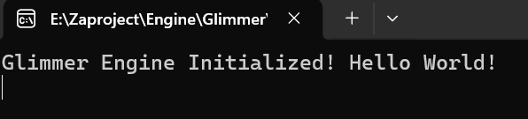

当我们按下 F5 时，C++ 编译器到底干了什么？

1. **编译引擎 (Build Glimmer)**：编译器首先来到 Glimmer 项目。它读取了 Application.cpp，把里面的 C++ 源码翻译成计算机认识的机器码。因为我们在 premake5.lua 中把 Glimmer 设置为了 kind "StaticLib"（静态库）。所以，编译器并没有生成一个可以双击运行的 .exe 程序，而是把所有机器码打包压缩成了一个 **Glimmer.lib** 文件（放在了隐藏的 bin 目录下）。*这就好比 Unity 官方写好了引擎的底层代码，打包成了一个巨大的 UnityEngine.dll 供你调用。*
2. **编译游戏 (Build Sandbox)**：接着，编译器来到 Sandbox 项目。它读取了 SandboxApp.cpp。当编译器看到 #include <Application.h> 时，它会去 Glimmer/src 目录下找到这个头文件（因为我们在 Premake 里配置了 includedirs）。头文件就像一本“说明书”，告诉 Sandbox：“Glimmer 引擎里确实有一个叫 Application 的类，你可以用它。”
3. **最终链接 (Linking)**：Sandbox 的代码编译完后，它只是知道了引擎长什么样，但**没有引擎的实际运行逻辑**。这时候，**链接器（Linker）**出场了！因为我们在 Premake 中写了 links { "Glimmer" }。链接器把刚刚生成的 Glimmer.lib（引擎的肉体）和 Sandbox 编译出的机器码死死地缝合在一起！最后，生成了一个完整的、包含引擎所有底层的 **Sandbox.exe**。你双击运行的，正是这个文件。

代码逻辑层面（控制权反转）

这是引擎开发中最精妙、最核心的架构设计思想：**控制反转（Inversion of Control, IoC）**。

```
// 在 SandboxApp.cpp 中 (游戏的入口点)

int main() {
    // 1. 游戏向引擎请求：给我创建一个应用实例！
    gl::Application* app = gl::CreateApplication(); 
    
    // 2. 游戏把控制权交还给引擎的 Run() 函数！
    app->Run(); 
    
    // 3. 游戏结束，清理内存
    delete app;
    return 0;
}
```

多态的威力（虚函数与指针）

```
// SandboxApp.cpp 中
gl::Application* gl::CreateApplication() {
    return new Sandbox(); // 返回的竟然是 Sandbox！
}
```

- CreateApplication 是定义在 Glimmer 引擎里的函数。它规定：**必须返回一个 gl::Application 类型的指针。**
- 但是，我们在 Sandbox 里实现这个函数时，new 出来的却是 Sandbox 类！
- **为什么可以这样？** 因为 class Sandbox : public gl::Application（Sandbox 继承了 Application）。
- 这就是 C++ 的多态性（Polymorphism）。引擎拿到这个指针后，以为自己在操作一个普通的 Application，但实际上它在操作你写的 Sandbox 游戏！这就允许引擎在未来去调用 Sandbox 重写的那些虚函数（比如 virtual void OnUpdate()）。

**引擎被打包成了库 -> 游戏链接了这个库 -> 游戏在** **main** **函数里把控制权上交给了引擎 -> 引擎开始死循环接管世界！**

## 入口点

目前的 main 函数写在 SandboxApp.cpp 里，这意味着用户（游戏开发者）必须知道怎么初始化引擎、怎么调用 Run()，但是这都是可以再次简化的，所以创建EntryPoint.h，这个文件将包含真正的 int main()。

```
#pragma once

#ifdef GL_PLATFORM_WINDOWS

extern gl::Application* gl::CreateApplication();

int main(int argc, char** argv)
{
    auto app = gl::CreateApplication();

    app->Run();

    delete app;
}

#endif
```

以及最重要的注入宏定义，不然等于没写，可以在visual studio每个项目加入预处理器定义，这里我采用在premake.lua脚本添加

```
workspace "GlimmerEngine"
    -- ... (前面的配置不变) ...

-- 1. 引擎项目
project "Glimmer"
    -- ... (前面的配置不变) ...

    -- 【新增】：告诉编译器，如果我们是在 Windows 上编译，就定义 GL_PLATFORM_WINDOWS
    filter "system:windows"
        systemversion "latest"
        defines {
            "GL_PLATFORM_WINDOWS",
            "GL_BUILD_DLL" -- 预留，虽然我们现在是静态库
        }

-- 2. 沙盒项目
project "Sandbox"
    -- ... (前面的配置不变) ...

    -- 【新增】：沙盒也需要知道自己是在 Windows 上
    filter "system:windows"
        systemversion "latest"
        defines {
            "GL_PLATFORM_WINDOWS"
        }
```

## 日志系统

首先引入子模块

```
git submodule add https://github.com/gabime/spdlog.git Glimmer/vendor/spdlog
```

然后告诉premake引擎现在需要包含这个新文件夹

```
project "Glimmer"
    -- ... 其他配置不变 ...
    includedirs {
        "%{prj.name}/src",
        "%{prj.name}/vendor/spdlog/include" -- 新增这一行
    }
    
        includedirs {
        "Glimmer/src", -- 沙盒需要引用引擎的代码
        "Glimmer/vendor/spdlog/include"
    }
```

新建 Log.h 和 Log.cpp

```
#pragma once
#include "spdlog/spdlog.h"
#include <memory>

namespace gl {
	class Log
	{
    public:
        static void Init();
        inline static std::shared_ptr<spdlog::logger>& GetCoreLogger() { return s_CoreLogger; }
        inline static std::shared_ptr<spdlog::logger>& GetClientLogger() { return s_ClientLogger; }
    private:
        static std::shared_ptr<spdlog::logger> s_CoreLogger;
        static std::shared_ptr<spdlog::logger> s_ClientLogger;
	};
};

```

https://github.com/gabime/spdlog/wiki/Custom-formatting在wiki中可以查看格式设置

```
#include "Log.h"
#include "spdlog/sinks/stdout_color_sinks.h"

namespace gl {
    std::shared_ptr<spdlog::logger> Log::s_CoreLogger;
    std::shared_ptr<spdlog::logger> Log::s_ClientLogger;

    void Log::Init() {
        spdlog::set_pattern("%^[%T] %n: %v%$"); // 设置日志格式：时间-名称-内容
        s_CoreLogger = spdlog::stdout_color_mt("GLIMMER");
        s_CoreLogger->set_level(spdlog::level::trace);

        s_ClientLogger = spdlog::stdout_color_mt("APP");
        s_ClientLogger->set_level(spdlog::level::trace);
    }
}
```

出现'Unicode support requires compiling with /utf-8'报错

这是因为中文版 Windows 的 Visual Studio (MSVC) 使用的是 GBK（或者叫 System Codepage）编码。当 spdlog 发现你没有开启 UTF-8 支持时，它就会通过 static_assert 故意让编译失败，以防你的日志输出变成乱码。

修改 **premake5.lua**

```
workspace "GlimmerEngine"
    -- ... (之前的配置) ...

    -- 【新增】：为 MSVC 编译器开启 UTF-8 支持
    filter "system:windows"
        buildoptions { "/utf-8" } -- 这一行是解决报错的关键
        systemversion "latest"
        defines {
            "GL_PLATFORM_WINDOWS"
        }
```

测试

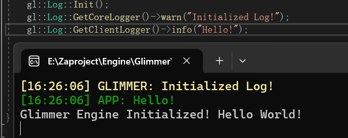

在Log.h中定义新的宏

```
// 引擎层日志宏 (Core)
#define GL_CORE_ERROR(...)  ::gl::Log::GetCoreLogger()->error(__VA_ARGS__)
#define GL_CORE_WARN(...)   ::gl::Log::GetCoreLogger()->warn(__VA_ARGS__)
#define GL_CORE_INFO(...)   ::gl::Log::GetCoreLogger()->info(__VA_ARGS__)

// 游戏层日志宏 (Client)
#define GL_ERROR(...)       ::gl::Log::GetClientLogger()->error(__VA_ARGS__)
#define GL_INFO(...)        ::gl::Log::GetClientLogger()->info(__VA_ARGS__)
```

在Log.cpp加入

```
        GL_CORE_INFO(R"(
 ****** ****** ****** ****** ****** ****** ****** ****** ****** ****** 
////// ////// ////// ////// ////// ////// ////// ////// ////// //////                                                                        
                                                                       
   ********  **       ** ****     **** ****     **** ******** *******  
  **//////**/**      /**/**/**   **/**/**/**   **/**/**///// /**////** 
 **      // /**      /**/**//** ** /**/**//** ** /**/**      /**   /** 
/**         /**      /**/** //***  /**/** //***  /**/******* /*******  
/**    *****/**      /**/**  //*   /**/**  //*   /**/**////  /**///**  
//**  ////**/**      /**/**   /    /**/**   /    /**/**      /**  //** 
 //******** /********/**/**        /**/**        /**/********/**   //**
  ////////  //////// // //         // //         // //////// //     //                                                                       
                                                                       
 ****** ****** ****** ****** ****** ****** ****** ****** ****** ****** 
////// ////// ////// ////// ////// ////// ////// ////// ////// ////// 
)");
```

这样就可以实现立体艺术字

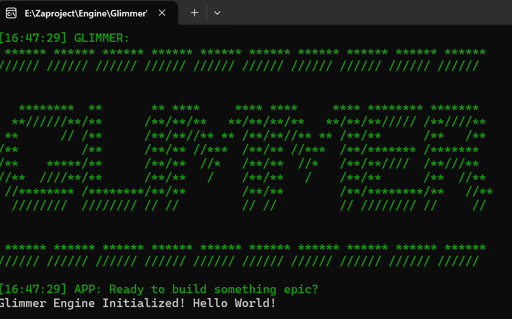

##  事件系统

在游戏引擎架构中，**事件系统（Event System）** 被称为引擎的“神经系统”。

它的核心作用是**解耦（Decoupling）**：让底层的窗口（如 GLFW 窗口）在发生动作（点击、缩放）时，不需要知道谁在处理这些动作，只需要把“信号”发出去，让上层的游戏逻辑（Sandbox）去监听并执行。

###  核心组成部分

- **EventType (枚举)**：定义具体的事件类型（如 KeyPressed, MouseButtonPressed, WindowClose）。
- **EventCategory (位掩码枚举)**：将事件分类（如 Keyboard, Mouse, Input）。一个事件可以属于多个分类（例如“按下鼠标”既属于 Mouse 也属于 Input）。
- **Event (基类)**：所有事件的祖先，定义了获取类型、分类、是否被处理（Handled）的接口。
- **EventDispatcher (分发器)**：核心逻辑。它像一个过滤器，根据事件的类型，把它交给正确的函数去处理

```
#pragma once
#include "Core.h"  // 我们需要在这里定义位操作宏

namespace gl {

    // 事件类型枚举
    enum class EventType {
        None = 0,
        WindowClose, WindowResize, WindowFocus, WindowLostFocus, WindowMoved,
        AppTick, AppUpdate, AppRender,
        KeyPressed, KeyReleased, KeyTyped,
        MouseButtonPressed, MouseButtonReleased, MouseMoved, MouseScrolled
    };

    // 事件分类（使用位移操作，方便一个事件属于多个分类）
    enum EventCategory {
        None = 0,
        EventCategoryApplication = BIT(0),
        EventCategoryInput = BIT(1),
        EventCategoryKeyboard = BIT(2),
        EventCategoryMouse = BIT(3),
        EventCategoryMouseDevice = BIT(4)
    };

    // 为了方便子类实现，定义的辅助宏
#define EVENT_CLASS_TYPE(type) static EventType GetStaticType() { return EventType::##type; }\
                               virtual EventType GetEventType() const override { return GetStaticType(); }\
                               virtual const char* GetName() const override { return #type; }

#define EVENT_CLASS_CATEGORY(category) virtual int GetCategoryFlags() const override { return category; }

    // 事件基类
    class Event {
    public:
        bool Handled = false; // 如果被处理了，就不再传给下一层

        virtual EventType GetEventType() const = 0;
        virtual const char* GetName() const = 0;
        virtual int GetCategoryFlags() const = 0;
        virtual std::string ToString() const { return GetName(); }

        // 检查该事件是否属于某个分类
        inline bool IsInCategory(EventCategory category) {
            return GetCategoryFlags() & category;
        }
    };

    // 事件分发器：根据类型执行对应的函数
    class EventDispatcher {
        template<typename T>
        using EventFn = std::function<bool(T&)>;
    public:
        EventDispatcher(Event& event) : m_Event(event) {}

        template<typename T>
        bool Dispatch(EventFn<T> func) {
            if (m_Event.GetEventType() == T::GetStaticType()) {
                m_Event.Handled = func(*(T*)&m_Event);
                return true;
            }
            return false;
        }
    private:
        Event& m_Event;
    };

    // 方便 spdlog 直接打印事件对象
    inline std::ostream& operator<<(std::ostream& os, const Event& e) {
        return os << e.ToString();
    }
}
```

 Core.h，用来放引擎最基础的宏定义

```
#pragma once

// BIT(x) 宏： 1 << 0 = 1, 1 << 1 = 2, 1 << 2 = 4...
// 用于 EventCategory 的位掩码判定
#define BIT(x) (1 << x)
```

同理编写各种事件，目前包含KeyEvent、MoudeEvent、ApplicationEvent，这里需要注意头文件的作用情况

```
#pragma once
#include "Glimmer/Events/Event.h"

namespace gl {

    class KeyEvent : public Event {
    public:
        inline int GetKeyCode() const { return m_KeyCode; }
        EVENT_CLASS_CATEGORY(EventCategoryKeyboard | EventCategoryInput)
    protected:
        KeyEvent(int keycode) : m_KeyCode(keycode) {}
        int m_KeyCode;
    };

    class KeyPressedEvent : public KeyEvent {
    public:
        KeyPressedEvent(int keycode, int repeatCount)
            : KeyEvent(keycode), m_RepeatCount(repeatCount) {}

        inline int GetRepeatCount() const { return m_RepeatCount; }

        std::string ToString() const override {
            std::stringstream ss;
            ss << "KeyPressedEvent: " << m_KeyCode << " (" << m_RepeatCount << " repeats)";
            return ss.str();
        }

        EVENT_CLASS_TYPE(KeyPressed)
    private:
        int m_RepeatCount;
    };
}#pragma once
#include "Glimmer/Events/Event.h"

namespace gl {

    class KeyEvent : public Event {
    public:
        inline int GetKeyCode() const { return m_KeyCode; }
        EVENT_CLASS_CATEGORY(EventCategoryKeyboard | EventCategoryInput)
    protected:
        KeyEvent(int keycode) : m_KeyCode(keycode) {}
        int m_KeyCode;
    };

    class KeyPressedEvent : public KeyEvent {
    public:
        KeyPressedEvent(int keycode, int repeatCount)
            : KeyEvent(keycode), m_RepeatCount(repeatCount) {}

        inline int GetRepeatCount() const { return m_RepeatCount; }

        std::string ToString() const override {
            std::stringstream ss;
            ss << "KeyPressedEvent: " << m_KeyCode << " (" << m_RepeatCount << " repeats)";
            return ss.str();
        }

        EVENT_CLASS_TYPE(KeyPressed)
    private:
        int m_RepeatCount;
    };
}
```

最后尝试在Application调试

```
    void Application::Run() {

        WindowResizeEvent e(1920, 1080);
        GL_TRACE("{0}", e);

        while (true) {
            // 这里将是未来游戏的心脏：Game Loop
        }
    }
```

但是出现报错

```
1>E:\Zaproject\Engine\Glimmer\Glimmer\vendor\spdlog\include\spdlog\fmt\bundled\base.h(2310,45): error C2079: “_”使用未定义的 struct“fmt::v12::detail::type_is_unformattable_for<T,char>”
1>        with
1>        [
1>            T=gl::WindowResizeEvent
1>        ]
```

回头检查了很多次，很奇怪，宏就是无法识别e作为传输对象，只有加上ToString才可以通过

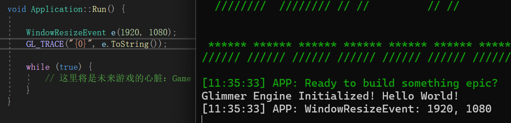

查了一些资料，找到了原因：fmt 12+（新版）不认识你的 Event 类，不知道怎么格式化它

需要**在 Event.h 末尾**加一段 fmt 格式化支持代码

```
#include <spdlog/fmt/fmt.h>

template<typename T>
struct fmt::formatter<T, std::enable_if_t<std::is_base_of_v<gl::Event, T>, char>>
    : fmt::formatter<std::string>
{
    auto format(const T& e, format_context& ctx) const
    {
        return formatter<std::string>::format(e.ToString(), ctx);
    }
};
```

之后就不会进行报错

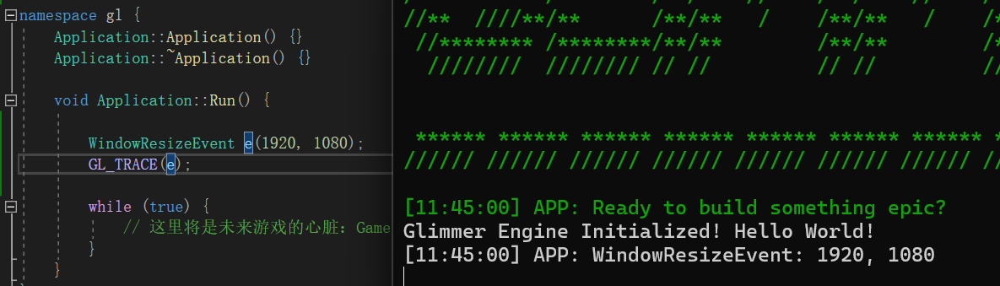

## 预编译头文件 (PCH)

在上一节的事件系统可以看到，如果你使用了某个标准库的功能（比如 std::function）却没有包含对应的头文件（<functional>），编译器会变得非常混乱。它不认识 std::function，导致后面的**模板解析全部失败**，进而引发了一连串莫名其妙的错误（甚至连 spdlog 和系统的 <ratio> 库都会跟着报废）。这在之后模块越来越多的情况下是难以进行管理的，因此为了彻底解决“漏掉头文件”的问题并大幅提升编译速度，正式引入“预编译头文件 (PCH)”

在 Glimmer/src 下创建 glpch.h。把所有常用的标准库全放进去。

```
#pragma once

#include <iostream>
#include <memory>
#include <utility>
#include <algorithm>
#include <functional>

#include <string>
#include <sstream>
#include <vector>
#include <unordered_map>
#include <unordered_set>

#ifdef GL_PLATFORM_WINDOWS
#include <Windows.h>
#endif
```

在 Glimmer/src 下创建 glpch.cpp。
*(注意：这是给 Visual Studio 用的，它需要一个空的源文件来触发编译 PCH)*。

```
#include "glpch.h"
```

修改 premake5.lua 启用 PCH，需要告诉 Premake 哪个是 PCH 文件。

```
project "Glimmer"
    -- ... 之前的配置 ...

    pchheader "glpch.h" -- 告诉编译器 PCH 的名字
    pchsource "Glimmer/src/glpch.cpp" -- 只有 Glimmer 项目需要这个源文件

    files {
        "%{prj.name}/src/**.h",
        "%{prj.name}/src/**.cpp",
    }
    -- ...
```

**所有属于 Glimmer 项目内部的 .cpp 源文件**（即 Glimmer/src 下的所有文件），都**必须**在第一行写上 #include "glpch.h"。

- **原因**：你在 Premake 里为 Glimmer 项目开启了 PCH。如果编译器在 Glimmer 项目的 .cpp 文件里第一行没看到这个头文件，它就会报错（报错代码通常是 C1010）。

**绝对不要包含 glpch.h 的文件**

1. 引擎内部的 .h 头文件 (重要！)

   **永远不要在 .h 文件里 #include "glpch.h"。**

   **原因**：头文件是被别人引用的。如果你在 Event.h 里写了 glpch.h，而外部的 Sandbox 项目引用了 Event.h，但 Sandbox 没有配置这个 PCH，它就会报错找不到 glpch.h。

   **做法**：在 .h 里，如果你需要 std::string，就直接包含 #include <string>。

2. Sandbox 项目的所有文件

   **绝对不要在 Sandbox 里的任何文件包含 glpch.h。**

   **原因**：glpch.h 是属于 Glimmer 引擎项目的内部私有财产。Sandbox 是另一个独立的工程，它有自己的编译环境。它甚至不需要 PCH，或者它可能有自己的一套 sandpch.h。

启用过后编译速度真起飞了

## 窗口和GLFW

引入 **GLFW** 是 Glimmer 引擎从“控制台黑框框”向“真正的图形化软件”跨越的关键一步。

我们将遵循工业级引擎的开发模式：**不要直接在 Application 里写 GLFW 代码**，而是先建立一个**窗口抽象层（Window Abstraction）**。这样未来你想把底层换成 DirectX 或支持手机端时，只需要增加一个实现类，而不需要改动引擎核心逻辑。

添加子模块

```
git submodule add https://github.com/glfw/glfw.git .\Glimmer\vendor\GLFW
```

在 **Glimmer/vendor/GLFW/** 目录下新建文件 **premake5.lua**：


**修改 premake5.lua**：
我们需要告诉 Glimmer 项目去哪里找 GLFW。

```
-- Glimmer 项目配置中增加：
project "Glimmer"
    -- ...
    includedirs {
        "%{prj.name}/src",
        "%{prj.name}/vendor/spdlog/include",
        "%{prj.name}/vendor/GLFW/include" -- 新增
    }

    filter "system:windows"
        systemversion "latest"
        defines { "GL_PLATFORM_WINDOWS" }
        
        -- 新增链接项
        links { 
            "GLFW", 
            "opengl32.lib" -- Windows 自带的 OpenGL 驱动库
        }

        libdirs {
            "Glimmer/vendor/GLFW/lib" -- 告诉 Premake 去哪里找 glfw3.lib
        }
```

定义窗口接口 (Window.h)

在 Glimmer/src/Glimmer 下创建 Window.h。这是一个纯虚基类，定义了所有平台窗口都必须有的功能。

**Glimmer/src/Glimmer/Window.h**:


Windows 平台的具体实现 (WindowsWindow.h/cpp)

我们在 Glimmer/src/Platform/Windows 目录下专门存放 Windows 特有的代码。

**Glimmer/src/Platform/Windows/WindowsWindow.h**:


实现窗口初始化 (WindowsWindow.cpp)

在这里，我们将调用 GLFW 的 API 来真正弹出一个窗口，并设置 **VSync（垂直同步）**。

**Glimmer/src/Platform/Windows/WindowsWindow.cpp**:


在 Application 中接入窗口

**Glimmer/src/Glimmer/Application.h**:

```
    private:
        std::unique_ptr<Window> m_Window; // 引擎持有的窗口指针
        bool m_Running = true;
```

**Glimmer/src/Glimmer/Application.cpp**:

```
// Application.cpp
#include "glpch.h"
#include "Application.h"

namespace gl {
    Application::Application() {
        m_Window = std::unique_ptr<Window>(Window::Create());
    }
    Application::~Application() {}

    void Application::Run() {

        while (m_Running) {
            m_Window->OnUpdate();
        }
    }
}
```

现在运行可以生成一个全黑的窗口了！

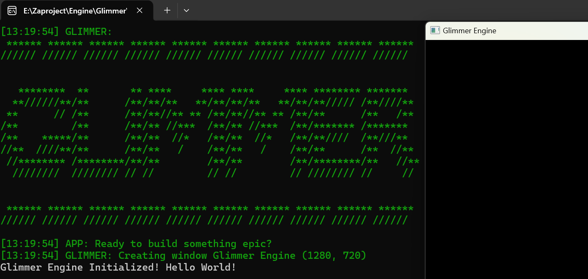

## 窗口事件

目前窗口虽然能弹出来，但它就像一个植物人，对外界的点击、缩放、关闭毫无反应。我们要利用 GLFW 的**回调（Callbacks）**机制，将系统的原生消息转化为我们之前写好的 Event 类，并传回给 Application。

在 WindowsWindow.cpp 中绑定 GLFW 回调

这是最关键的一步。GLFW 是 C 语言写的，它使用全局函数作为回调，而我们的引擎是 C++ 面向对象的。我们利用 glfwSetWindowUserPointer 将我们的 WindowData 结构体塞进 GLFW 窗口里。

修改 **WindowsWindow.cpp** 的 Init 函数：

引入三类事件文件

```
// 设置窗口缩放回调
glfwSetWindowSizeCallback(m_Window, [](GLFWwindow* window, int width, int height) {
    // 从“口袋”里掏出我们的 Data
    WindowData& data = *(WindowData*)glfwGetWindowUserPointer(window);
    data.Width = width;
    data.Height = height;

    WindowResizeEvent event(width, height);
    data.EventCallback(event); // 触发回调！
    });
```

（我们在之后通过 glfwSetWindowUserPointer 和 glfwGetWindowUserPointer 获取了 m_Data,并将其复制到一个名为data的引用上：WindowData& data = *(WindowData*)glfwGetWindowUserPointer(window); ） 

调用出来的 OnEvent( ) 就相当于 data.EventCallback( )，然而 OnEvent 在定义上是需要参数的，所以 data.EventCallback(event) == OnEvent(event) ,这个 event ，就是我们用占位符延缓的参数（ 这个参数被标明会在后续使用） 

在使用 Event 对象作为 OnEvent 的参数填入之后，event这个参数参与到 OnEvent 函数体内的操作中去，完成我们定义的操作。

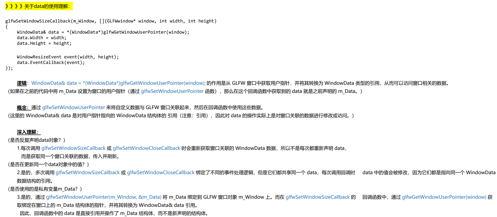

其余同理

在 Application 中接收事件

现在 WindowsWindow 会疯狂地向外发送事件，我们需要在 Application 里接住它们并决定如何处理。

**Application.h**:

```
class Application {
    public:
        // ...
        void OnEvent(Event& e); // 处理事件的中心枢纽
    private:
        bool OnWindowClose(WindowCloseEvent& e); // 专门处理关闭的逻辑
        // ...
    };
```

**Application.cpp**:

```
// 在构造函数里绑定回调
Application::Application() {
    m_Window = std::unique_ptr<Window>(Window::Create());
    
    // 使用 Lambda 表达式把事件传给 OnEvent
    m_Window->SetEventCallback([this](Event& e) {
        this->OnEvent(e);
    });
}

void Application::OnEvent(Event& e) {
    // 1. 打印所有事件（调试用）
    GL_CORE_TRACE("{0}", e.ToString());

    // 2. 使用分发器处理特定事件
    EventDispatcher dispatcher(e);
    // 如果是关闭窗口事件，就执行 OnWindowClose 函数
    dispatcher.Dispatch<WindowCloseEvent>([this](WindowCloseEvent& event) {
        return this->OnWindowClose(event);
    });
}

bool Application::OnWindowClose(WindowCloseEvent& e) {
    m_Running = false; // 停止 while 循环，优雅退出
    return true;
}
```

```
m_Window->SetEventCallback([this](Event& e) {
    this->OnEvent(e);
});
```

- **原理**：编译器会为你自动生成一个匿名的“闭包”类。[this] 表示通过值捕获当前对象的指针，使得 Lambda 内部可以访问成员函数。

  **性能更好**：编译器更容易对 Lambda 进行内联（Inline）优化。它不涉及复杂的包装转换，几乎没有额外开销。

  **更直观**：代码一眼就能看出逻辑——“当事件 e 发生时，执行 this->OnEvent(e)”。

  **调试友好**：在断点调试时，堆栈信息比 std::bind 简单得多。

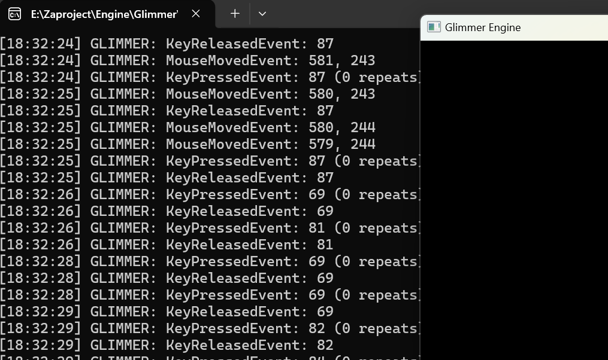

## 图层(Layer)

在游戏引擎开发中，**图层（Layer）** 是组织游戏逻辑的核心架构。

想象一下：你的游戏有背景地图、玩家角色、敌人、以及顶层的 UI 菜单和调试信息。如果不分层，所有的代码都会堆在 Application::Run 的死循环里，变得无法维护。

**图层系统的目的：** 把引擎的一帧拆解成多个有序的步骤，并让事件（如鼠标点击）能从上往下传递（UI 层先接住，如果 UI 没拦截，再传给游戏层）。

定义图层基类 (Layer.h)

在 Glimmer/src/Glimmer 下创建 Layer.h。

**Layer.h**:

```
#pragma once

#include "Glimmer/Core.h"
#include "Glimmer/Events/Event.h"

namespace gl {

    class Layer {
    public:
        Layer(const std::string& name = "Layer");
        virtual ~Layer();

        virtual void OnAttach() {}    // 当图层被推入引擎时调用（类似 Start）
        virtual void OnDetach() {}    // 当图层被移除时调用
        virtual void OnUpdate() {}    // 每帧调用（类似 Update）
        virtual void OnEvent(Event& event) {} // 当事件发生时调用

        inline const std::string& GetName() const { return m_DebugName; }
    protected:
        std::string m_DebugName; // 用于调试的名字
    };

}
```

**Layer.cpp**:

```
#include "glpch.h"
#include "Layer.h"

namespace gl {
    Layer::Layer(const std::string& name) : m_DebugName(name) {}
    Layer::~Layer() {}
}
```

实现图层栈 (LayerStack.h/cpp)

图层栈负责管理图层的顺序。在 Glimmer 中，我们把图层分为两类：

1. **普通图层 (Layers)**：放在栈的前半部分（如关卡、背景）。
2. **覆盖层 (Overlays)**：永远放在栈的最后面（如 UI、控制台），保证它们始终在最上层。

**LayerStack.h**:

```
#pragma once

#include "glpch.h"
#include "Layer.h"

namespace gl {

    class LayerStack {
    public:
        LayerStack();
        ~LayerStack();

        void PushLayer(Layer* layer);
        void PushOverlay(Layer* overlay);
        void PopLayer(Layer* layer);
        void PopOverlay(Layer* overlay);

        // 为了方便循环遍历
        std::vector<Layer*>::iterator begin() { return m_Layers.begin(); }
        std::vector<Layer*>::iterator end() { return m_Layers.end(); }
    private:
        std::vector<Layer*> m_Layers;
        unsigned int m_LayerInsertIndex = 0; // 用于追踪普通图层应该插在哪里
    };

}
```

**LayerStack.cpp**:

```
#include "glpch.h"
#include "LayerStack.h"

namespace gl {

    LayerStack::LayerStack() {}

    LayerStack::~LayerStack() {
        for (Layer* layer : m_Layers)
            delete layer;
    }

    void LayerStack::PushLayer(Layer* layer) {
        // 普通图层插入到 Index 位置，Index 后移
        m_Layers.emplace(m_Layers.begin() + m_LayerInsertIndex, layer);
        m_LayerInsertIndex++;
    }

    void LayerStack::PushOverlay(Layer* overlay) {
        // 覆盖层直接插在末尾
        m_Layers.emplace_back(overlay);
    }

    void LayerStack::PopLayer(Layer* layer) {
        auto it = std::find(m_Layers.begin(), m_Layers.end(), layer);
        if (it != m_Layers.end()) {
            m_Layers.erase(it);
            m_LayerInsertIndex--;
        }
    }

    void LayerStack::PopOverlay(Layer* overlay) {
        auto it = std::find(m_Layers.begin(), m_Layers.end(), overlay);
        if (it != m_Layers.end())
            m_Layers.erase(it);
    }
}
```

在 Application 中集成

现在我们要让 Application 拥有这个栈，并在每帧去更新它，在每个事件去分发它。

**Application.h**:

```
// ... 增加引用 ...
#include "Glimmer/LayerStack.h"

    class Application {
    public:
        void PushLayer(Layer* layer);
        void PushOverlay(Layer* overlay);
        // ...
    private:
        LayerStack m_LayerStack;
        // ...
    };
```

随后在**Application.cpp**:实现函数

注意顺序

```
// 核心逻辑：事件倒序分发
// 为什么要倒序？因为最上层（UI）在 vector 的末尾，它们应该先处理事件
for (auto it = m_LayerStack.end(); it != m_LayerStack.begin(); ) {
    (*--it)->OnEvent(e);
    if (e.Handled) // 如果事件被某一层拦截了，直接停止传递
        break;
}
```

```
void Application::Run() {

    while (m_Running) {
        // 核心逻辑：正序更新
        // 先渲染背景，再渲染玩家，最后渲染 UI
        for (Layer* layer : m_LayerStack)
            layer->OnUpdate();

        m_Window->OnUpdate();
    }
}
```

在 Sandbox 中测试

在 SandboxApp.cpp 里创建一个测试图层：

```
class ExampleLayer : public gl::Layer {
public:
    ExampleLayer() : Layer("Example") {}

    void OnUpdate() override {
         GL_INFO("ExampleLayer::Update");
    }

    void OnEvent(gl::Event& event) override {
        GL_TRACE("{0}", event.ToString());
    }
};

class Sandbox : public gl::Application {
public:
    Sandbox() {
        std::cout << "Glimmer Engine Initialized! Hello World!" << std::endl;
        //在这里激活
        PushLayer(new ExampleLayer());
    }
    ~Sandbox() {}
};
```

运行可以看到，Example层一直在更新，但同时也会监听其他操作

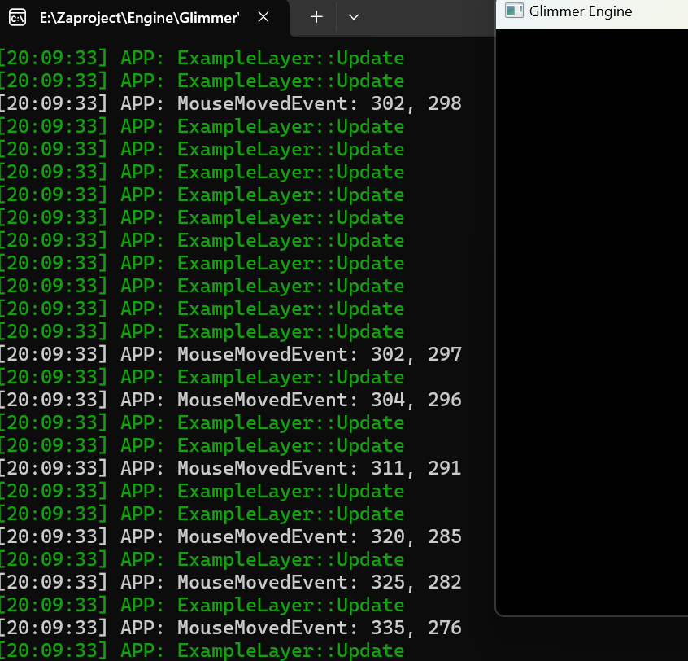

## Glad

**GLAD** 是 Glimmer 引擎与显卡驱动之间的“翻译官”。OpenGL 的函数实现是在显卡驱动里的，C++ 默认找不到它们。GLAD 的作用就是**加载所有 OpenGL 函数的指针**，让你能写出 glClear、glDrawArrays 这些指令。

我们要遵循**高度解耦**的架构：创建一个 GraphicsContext（图形上下文）接口。这样以后如果你想把 OpenGL 换成 Vulkan，只需要换一个 Context 实现，而不必拆掉整个窗口系统。

**获取 GLAD 源代码**

1. 访问 [GLAD 在线生成器](https://glad.dav1d.de/)。
2. **Language**: C/C++
3. **API**: gl Version **4.6** (或者 4.5，确保选 **Core** 模式)。
4. 点击 **Generate**，下载生成的 ZIP 包。
5. **物理存放**：将 include/glad 和 include/KHR 文件夹放入 Glimmer/vendor/Glad/include。将 src/glad.c 放入 Glimmer/vendor/Glad/src。

**为 Glad 编写 Premake 脚本**

因为 Glad 包含一个 .c 文件，我们需要把它编译进引擎。

在 **Glimmer/vendor/Glad/** 目录下新建 **premake5.lua**：

```
project "Glad"
    kind "StaticLib"
    language "C"
    staticruntime "on"

    targetdir ("bin/" .. outputdir .. "/%{prj.name}")
    objdir ("bin-int/" .. outputdir .. "/%{prj.name}")

    files {
        "include/glad/glad.h",
        "include/KHR/khrplatform.h",
        "src/glad.c"
    }

    includedirs {
        "include"
    }

    filter "system:windows"
        systemversion "latest"
```

修改根目录的 **premake5.lua**：

1. 在 include "Glimmer/vendor/GLFW" 下面增加 include "Glimmer/vendor/Glad"。
2. 在 Glimmer 项目的 includedirs 中增加 "%{prj.name}/vendor/Glad/include"。
3. 在 Glimmer 项目的 links 中增加 "Glad"。

**运行 GenerateProject.bat。**

修改WindowsWindow.cpp进行测试

在WindowsWindow更新了

```
m_Window = glfwCreateWindow((int)props.Width, (int)props.Height, m_Data.Title.c_str(), nullptr, nullptr);
glfwMakeContextCurrent(m_Window);
int status = gladLoadGLLoader((GLADloadproc)glfwGetProcAddress);

glfwSetWindowUserPointer(m_Window, &m_Data);
SetVSync(true);
```

报错1>E:\Zaproject\Engine\Glimmer\Glimmer\vendor\Glad\include\glad\glad.h(27,1): fatal  error C1189: #error:  OpenGL header already included, remove this include, glad already provides it

**报错原因**：
GLAD 和 GLFW 都在争夺对 OpenGL 头文件的控制权。

1. GLAD 必须在**最前面**被包含，因为它定义了所有的 OpenGL 函数。
2. GLFW 默认也会自动包含一个标准的 GL.h。
3. 如果你先包含了 GLFW/glfw3.h 再包含 glad/glad.h，或者在同一个文件里它们顺序反了，就会触发 GLAD 源码里的那个 #error 保护机制。

可以

```
// WindowsWindow.h 或 WindowsWindow.cpp 的顶部
#include <glad/glad.h>   // 1. GLAD 永远在第一位
#define GLFW_INCLUDE_NONE // 2. 告诉 GLFW 别带上默认的 OpenGL 头文件
#include <GLFW/glfw3.h>  // 3. 然后再包含 GLFW
```

不加宏定义也行，只是要保证顺序

断点调试结果保证正常运行

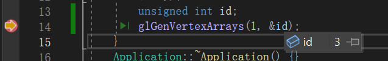

## ImGui

集成 **Dear ImGui** 是 Glimmer 引擎开发中里程碑式的一步。它不仅能让你画出各种调试滑块、性能图表，更是未来**可视化编辑器**的基石。

按照 Glimmer 的架构，我们将 ImGui 作为一个特殊的 **Overlay（覆盖层）** 插入图层栈。这样它就能永远显示在游戏画面最顶端，并且优先拦截鼠标/键盘事件。

```
git submodule add -b docking https://github.com/ocornut/imgui.git Glimmer/vendor/imgui
```

> *-b docking* *分支。这个分支支持“窗口停靠”和“多视图”功能，是做引擎编辑器的标准选择。*

为 ImGui 编写 Premake 脚本

ImGui 本身只是源码，我们需要告诉 Premake 如何编译它的核心代码以及对应的 **GLFW** 和 **OpenGL3** 后端。

在 **Glimmer/vendor/imgui/** 目录下新建 **premake5.lua**：

并**修改根目录的 premake5.lua：**

1. 在 include "Glimmer/vendor/Glad" 下增加 include "Glimmer/vendor/imgui"。
2. 在 Glimmer 项目的 includedirs 中增加 "%{prj.name}/vendor/imgui" 和 "%{prj.name}/vendor/imgui/backends"。
3. 在 Glimmer 项目的 links 中增加 "ImGui"。

**运行 GenerateProject.bat。**


**在 Application 中渲染 ImGui**

现代引擎通常不在 Layer::OnUpdate 里直接画 UI，而是在主循环里专门留出一个位置。

**Application.cpp 改动**：


为了让 ImGuiLayer 能顺利初始化，我们需要让它能访问到全局的 Application 实例，以及底层的 GLFWwindow 指针。

1. 修改 Window.h (暴露原生窗口指针)

   ```
   // Glimmer/src/Glimmer/Window.h
   namespace gl {
       // ...
       class Window {
       public:
           // ... 其他虚函数
           virtual void* GetNativeWindow() const = 0; // 【新增】：返回底层窗口句柄
       };
   }
   ```

2. 修改 WindowsWindow.h (实现接口)

   ```
   // Glimmer/src/Platform/Windows/WindowsWindow.h
   namespace gl {
       class WindowsWindow : public Window {
       public:
           // ...
           inline virtual void* GetNativeWindow() const override { return m_Window; } // 【新增】
       };
   }
   ```

3. 修改 Application.h (实现单例模式)

4. 修改 Application.cpp (初始化单例)

   ```
   namespace gl {
       Application* Application::s_Instance = nullptr; // 【新增】：定义静态变量
   
       Application::Application() {
           GL_CORE_ASSERT(!s_Instance, "Application already exists!"); // 防止实例化多次
           s_Instance = this; // 【新增】：把自己存入单例
   ```

**编写 ImGuiLayer (完整的 UI 渲染层)**

在 Glimmer/src/Glimmer/ImGui 目录下创建这两个文件。

1. ImGuiLayer.h，为了给cpp调用，需要重载Layer里的函数

   ```
   #pragma once
   #include "Glimmer/Layer.h"
   
   namespace gl {
       class ImGuiLayer : public Layer {
       public:
           ImGuiLayer();
           ~ImGuiLayer();
   
           virtual void OnAttach() override;
           virtual void OnDetach() override;
           virtual void OnUpdate() override;
           virtual void OnEvent(Event& event) override;
   
           virtual void OnImGuiRender() override;
   
           void Begin(); // 每帧开始前呼叫
           void End();   // 每帧结束后呼叫
       private:
           float m_Time = 0.0f;
       };
   }
   ```

2. cpp代码过长，简要说明：代码实现了一个 ImGui 的引擎层封装（ImGuiLayer），把 Dear ImGui 完整接入到你的引擎生命周期中。核心逻辑是：在 `OnAttach` 中创建 ImGui 上下文并开启键盘控制、Docking 和多窗口 Viewport 等高级功能，同时通过 GLFW 获取原生窗口并初始化 ImGui 的 GLFW + OpenGL 后端；在每一帧通过 `Begin` 和 `End` 控制 ImGui 的更新与渲染流程，其中 `End` 负责将 UI 绘制数据提交给 OpenGL，并在开启多窗口时处理额外的平台窗口渲染和上下文切换；在 `OnDetach` 中则完整释放 ImGui 相关资源。整体上，这段代码把 UI 系统封装成引擎的一个独立 Layer，使 UI 渲染流程与游戏逻辑解耦，并为后续实现类似 Unity 的编辑器（可拖拽面板、多窗口界面）提供基础。

最后打开 SandboxApp.cpp，在 ExampleLayer 中重写 OnImGuiRender：


回头来看全过程：

我们将 ImGui 的集成分为 **资源导入、项目构建、层级集成、渲染循环** 四个阶段：

1. **资源获取（Submodule）**：
   使用 Git 子模块拉取 ImGui 的 docking 分支。这个分支不仅支持窗口停靠，还支持 **Viewports**（允许 UI 拖出主窗口），是做现代引擎编辑器的必备选择。
2. **项目构建（Premake）**：
   由于 ImGui 是以源代码形式分发的，我们编写了一个专门的 premake5.lua。关键点在于包含 backends 文件夹下的 imgui_impl_glfw.cpp 和 imgui_impl_opengl3.cpp，并将它们编译成一个静态库（StaticLib），链接到我们的 Glimmer 引擎中。
3. **图层抽象（ImGuiLayer）**：
   我们创建了一个 ImGuiLayer 类，继承自引擎的 Layer 基类。**OnAttach**：执行 ImGui 的初始化（创建上下文、开启 Docking/Viewports 标志位、初始化 GLFW 和 OpenGL 后端）。**OnDetach**：执行清理工作。
4. **渲染管线集成（The Loop）**：
   在 Application::Run 的主循环中，我们将 UI 渲染独立出来。每帧执行：m_ImGuiLayer->Begin()：开启 ImGui 新帧，处理输入轮询。调用所有 Layer 的 OnImGuiRender()：让每个游戏模块能在此处编写自己的调试 UI。m_ImGuiLayer->End()：执行渲染并将数据交给 GPU，同时处理 **Multi-Viewport** 的上下文切换（Context Switching），保证弹出窗口的正确渲染。

相关机制

- **架构层面的解耦设计**
  “在集成过程中，我采用了 **Backend-Agnostic（后端无关）** 的设计思路。ImGui 的核心代码与具体的图形 API 是分离的。虽然我目前使用的是 GLFW 和 OpenGL3 组合，但我将其封装在 ImGuiLayer 中，并通过 Application::Get().GetWindow().GetNativeWindow() 获取原生句柄。这种设计保证了如果未来将 Glimmer 升级到 Vulkan 或 DX12，我只需要更换 ImGuiLayer 内部的实现细节，而不需要触动任何上层 UI 代码。”
- **针对多视口（Viewports）的特殊处理**
  “为了实现类似 Unity 那种可以将窗口拖出主程序的体验，我开启了 ImGuiConfigFlags_ViewportsEnable。这引入了一个难点：**OpenGL 上下文管理**。在 End() 函数中，ImGui 需要在多个 OS 窗口间切换渲染上下文。我实现的逻辑是：在处理完额外视口后，必须通过 glfwMakeContextCurrent 强制将 Context 还原回引擎主窗口，否则主循环后续的 SwapBuffers 会作用在错误窗口导致崩溃。这体现了对图形 API 状态机机制的理解。”
- **事件系统与 UI 的冲突处理（劫持机制）**
  “目前我正在完善 UI 对事件的**拦截机制**。即当鼠标悬浮在 ImGui 窗口上时，通过检查 io.WantCaptureMouse 标志位，由 ImGuiLayer 设置 Event.Handled = true。这样可以确保玩家在点击 UI 按钮时，不会误触发背后游戏世界的攻击动作。这证明了我对引擎内‘从顶层向底层分发事件’这一流向的准确控制。”

## 接入ImGui事件

接入 ImGui 事件是让引擎从“只能看”变成“能交互”的关键。

目前，你的 WindowsWindow 捕获了系统事件并分发给了 Application。但 ImGui 作为一个独立的库，它也需要知道鼠标在哪、哪个键按下了。

最重要的是，我们要实现 **“事件拦截（Event Blocking）”**：当点击 ImGui 的按钮时，鼠标点击事件应该在 UI 层就被消耗掉，不应该传给底层的游戏角色

BIND_EVENT_FN

这个宏的作用是简化 std::bind 的写法，让你在绑定事件函数时不需要每次都写那长长的一串。

**请在 Glimmer/src/Glimmer/Core.h 中添加如下代码：**

```
#pragma once

#include <memory>

// ... 之前的 BIT(x) 和断言宏 ...

// ✨ 添加这个宏定义
#define BIND_EVENT_FN(x) std::bind(&x, this, std::placeholders::_1)

// ...
```

我们需要利用 EventDispatcher 将 Glimmer 的事件转化为 ImGui 的输入状态。

修改 **Glimmer/src/Glimmer/ImGui/ImGuiLayer.cpp** 的 OnEvent 函数及其配套的处理函数：

```
void ImGuiLayer::OnEvent(Event& event)
{
    // 如果你希望 UI 拦截所有事件，可以在这里根据 ImGui 的状态设置 event.Handled
    ImGuiIO& io = ImGui::GetIO();
    
    // 核心逻辑：如果 ImGui 想要捕获鼠标/键盘，就标记事件已处理
    // 这样事件就不会传给下层的 GameLayer 了
    event.Handled |= event.IsInCategory(EventCategoryMouse) & io.WantCaptureMouse;
    event.Handled |= event.IsInCategory(EventCategoryKeyboard) & io.WantCaptureKeyboard;

    // 以下是手动将 Glimmer 事件喂给 ImGui 的逻辑（如果你使用的是手动对接模式）
    EventDispatcher dispatcher(event);
    dispatcher.Dispatch<MouseButtonPressedEvent>(BIND_EVENT_FN(ImGuiLayer::OnMouseButtonPressedEvent));
    dispatcher.Dispatch<MouseButtonReleasedEvent>(BIND_EVENT_FN(ImGuiLayer::OnMouseButtonReleasedEvent));
    dispatcher.Dispatch<MouseMovedEvent>(BIND_EVENT_FN(ImGuiLayer::OnMouseMovedEvent));
    dispatcher.Dispatch<MouseScrolledEvent>(BIND_EVENT_FN(ImGuiLayer::OnMouseScrolledEvent));
    dispatcher.Dispatch<KeyPressedEvent>(BIND_EVENT_FN(ImGuiLayer::OnKeyPressedEvent));
    dispatcher.Dispatch<KeyReleasedEvent>(BIND_EVENT_FN(ImGuiLayer::OnKeyReleasedEvent));
    dispatcher.Dispatch<KeyTypedEvent>(BIND_EVENT_FN(ImGuiLayer::OnKeyTypedEvent));
    dispatcher.Dispatch<WindowResizeEvent>(BIND_EVENT_FN(ImGuiLayer::OnWindowResizeEvent));
}

// --- 以下是具体的转换函数示例 ---

bool ImGuiLayer::OnMouseButtonPressedEvent(MouseButtonPressedEvent& e)
{
    ImGuiIO& io = ImGui::GetIO();
    io.MouseDown[e.GetMouseButton()] = true;
    return false; // 返回 false 表示不强制拦截，交给上面的 WantCapture 逻辑判断
}

bool ImGuiLayer::OnMouseMovedEvent(MouseMovedEvent& e)
{
    ImGuiIO& io = ImGui::GetIO();
    io.MousePos = ImVec2(e.GetX(), e.GetY());
    return false;
}

// ... 同理实现 KeyPressed (io.KeysDown[e.GetKeyCode()] = true) 
// ... 和 MouseScrolled (io.MouseWheel += e.GetYOffset())
```

**配置 KeyMap（在 OnAttach 中）**

为了让 ImGui 认识你的按键编号（GLFW 的编号），需要在初始化时建立映射关系。

**ImGuiLayer.cpp (OnAttach)**:

```
void ImGuiLayer::OnAttach() {
    // ... 之前的初始化代码 ...
    
    ImGuiIO& io = ImGui::GetIO();
    // 建立 KeyMap：把 ImGui 的索引映射到 GLFW 的键码
    io.KeyMap[ImGuiKey_Tab] = GLFW_KEY_TAB;
```

过程中发现这段代码io.KeysDown不能用了，找了很久方法

```
	bool ImGuiLayer::OnKeyPressedEvent(KeyPressedEvent& e)
	{
		ImGuiIO& io = ImGui::GetIO();
		io.KeysDown[e.GetKeyCode()] = true;

		io.KeyCtrl = io.KeysDown[GLFW_KEY_LEFT_CONTROL] || io.KeysDown[GLFW_KEY_RIGHT_CONTROL];
		io.KeyShift = io.KeysDown[GLFW_KEY_LEFT_SHIFT] || io.KeysDown[GLFW_KEY_RIGHT_SHIFT];
		io.KeyAlt = io.KeysDown[GLFW_KEY_LEFT_ALT] || io.KeysDown[GLFW_KEY_RIGHT_ALT];
		io.KeySuper = io.KeysDown[GLFW_KEY_LEFT_SUPER] || io.KeysDown[GLFW_KEY_RIGHT_SUPER];
		return false;
	}
```

但最后得知如果你在 OnAttach 里调用了 ImGui_ImplGlfw_InitForOpenGL(window, true)，**这里的 true 表示 ImGui 会自己去钩住 GLFW 的回调**。这样你根本不需要在 OnEvent 里手动写 OnKeyPressedEvent 这些函数。ImGui 自己会偷偷处理好一切。


WindowsWindow.cpp加入

- **KeyPressedEvent**：捕捉的是**物理按键**。比如你按下 Shift + A，它收到的是 Shift 键按下和 A 键按下。它不知道你想输入的是大写的 A。
- **KeyTypedEvent**：捕捉的是**文本输入**。它由操作系统处理，直接告诉你用户输入了字符 A。它会自动处理输入法、大小写、特殊符号。

如果你以后在引擎里想做一个**文本输入框**（比如给物体改名字、写控制台指令），没有 KeyTypedEvent 的话，你的退格键、大小写、甚至是中文输入都会出大问题。

```
glfwSetCharCallback(m_Window, [](GLFWwindow* window, unsigned int keycode)
{
    WindowData& data = *(WindowData*)glfwGetWindowUserPointer(window);

    KeyTypedEvent event(keycode);
    data.EventCallback(event);
});
```

## 输入轮询

在 Glimmer 引擎中实现**输入轮询（Input Polling）**，标志着你终于可以像在 Unity 里写 Input.GetKey(KeyCode.W) 那样，随时随地获取按键状态了。

目前你的事件系统是“被动”的（只有按键时才发通知），而输入轮询是“主动”的（随时询问状态）。这在处理角色移动等需要连续输入的场景中是必不可少的。

**创建输入抽象接口 (Input.h)**

在 Glimmer/src/Glimmer 下创建 Input.h。我们使用**单例模式（Singleton）**，但通过静态方法暴露接口，保证调用最整洁。

**Input.h**:

```
#pragma once

#include "Glimmer/Core.h"

namespace gl {

    class Input {
    public:
        // 静态接口：外部直接调用 Input::IsKeyPressed(key)
        inline static bool IsKeyPressed(int keycode) { return s_Instance->IsKeyPressedImpl(keycode); }

        inline static bool IsMouseButtonPressed(int button) { return s_Instance->IsMouseButtonPressedImpl(button); }
        inline static std::pair<float, float> GetMousePosition() { return s_Instance->GetMousePositionImpl(); }
        inline static float GetMouseX() { return s_Instance->GetMouseXImpl(); }
        inline static float GetMouseY() { return s_Instance->GetMouseYImpl(); }

    protected:
        // 由不同平台实现的受保护虚函数 (Impl = Implementation)
        virtual bool IsKeyPressedImpl(int keycode) = 0;
        virtual bool IsMouseButtonPressedImpl(int button) = 0;
        virtual std::pair<float, float> GetMousePositionImpl() = 0;
        virtual float GetMouseXImpl() = 0;
        virtual float GetMouseYImpl() = 0;

    private:
        // 静态单例指针
        static Input* s_Instance;
    };
}
```

**Windows 平台的具体实现 (WindowsInput.cpp)**

在 Glimmer/src/Platform/Windows 目录下创建 WindowsInput.h/cpp。它将直接调用 **GLFW** 的 API 来查询状态。

对外提供一个统一的 `Input` 静态接口（比如 `Input::IsKeyPressed`），但内部并不直接实现，而是通过一个静态单例指针 `s_Instance` 转发到具体平台（这里是 `WindowsInput`）去执行。也就是说，上层代码只依赖 `Input` 这个抽象接口，而真正调用的是底层用 GLFW 实现的 `WindowsInput`，例如在 `IsKeyPressedImpl` 里通过 `glfwGetKey` 轮询当前键盘状态。这样一来，你的引擎逻辑层完全不需要关心是 Windows、Mac 还是 Linux，只需要调用统一接口即可，实现了**平台解耦**。

同时，这套设计本质上是一个“**静态接口 + 单例 + 虚函数分发**”的组合：

- 静态函数保证调用方便（不用到处传对象）
- 单例保证全局唯一输入系统
- 虚函数保证不同平台可以替换实现

最终效果就是：

> 上层写 `Input::IsKeyPressed(W)`，底层自动走到 GLFW（Windows）实现，实现了干净的分层。

**在 Application 中测试**

现在，可以在任何 Layer 的 OnUpdate 中，极其方便地检测输入了。

```
    void Application::Run() {

        while (m_Running) {
            // 1. 游戏逻辑更新 (清除屏幕、移动角色等)
            for (Layer* layer : m_LayerStack)
                layer->OnUpdate();

            // 2. UI 渲染 (极其重要：必须在 Begin 和 End 之间)
            m_ImGuiLayer->Begin();
            for (Layer* layer : m_LayerStack)
                layer->OnImGuiRender(); // 调用每个图层的 UI 绘制函数
            m_ImGuiLayer->End();

            // 检测按键
            if (gl::Input::IsKeyPressed(GLFW_KEY_TAB))
                GL_TRACE("TAB 键正被按住！");

            // 检测鼠标
            if (gl::Input::IsMouseButtonPressed(0)) {
                auto [x, y] = gl::Input::GetMousePosition();
                GL_TRACE("鼠标左键点击坐标: {0}, {1}", x, y);
            }

            // 3. 交换缓冲区
            m_Window->OnUpdate();
        }
    }
```

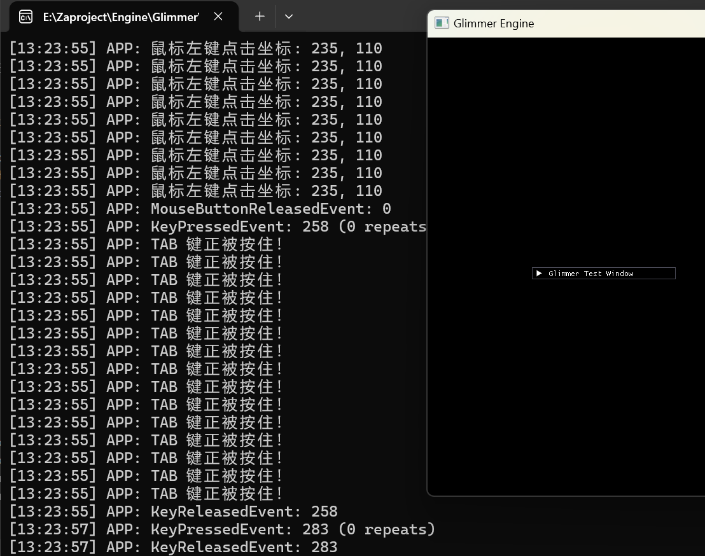

## 按键与鼠标码解耦

现在的 Sandbox 如果想判断按键，必须 #include <GLFW/glfw3.h> 并使用 GLFW_KEY_A。这违反了**依赖倒置原则**——上层游戏逻辑不应该依赖底层的实现库。

在 Glimmer/src/Glimmer 下创建 KeyCodes.h 和 MouseCodes.h。

**KeyCodes.h (部分示例)：**

```
#pragma once

// 这里的数值完全参照 GLFW，但名字变成了我们引擎自己的前缀
#define GL_KEY_SPACE           32
#define GL_KEY_APOSTROPHE      39  /* ' */
#define GL_KEY_A               65
#define GL_KEY_W               87
#define GL_KEY_S               83
#define GL_KEY_D               68
// ... (你可以从 GLFW 源码拷贝剩下的并替换前缀)
```

**MouseButtonCodes**

```
#pragma once

// From glfw3.h
#define GL_MOUSE_BUTTON_1         0
#define GL_MOUSE_BUTTON_2         1
#define GL_MOUSE_BUTTON_3         2
#define GL_MOUSE_BUTTON_4         3
#define GL_MOUSE_BUTTON_5         4
#define GL_MOUSE_BUTTON_6         5
#define GL_MOUSE_BUTTON_7         6
#define GL_MOUSE_BUTTON_8         7
#define GL_MOUSE_BUTTON_LAST      GL_MOUSE_BUTTON_8
#define GL_MOUSE_BUTTON_LEFT      GL_MOUSE_BUTTON_1
#define GL_MOUSE_BUTTON_RIGHT     GL_MOUSE_BUTTON_2
#define GL_MOUSE_BUTTON_MIDDLE    GL_MOUSE_BUTTON_3
```

**更新引擎“全家桶”头文件 (Glimmer.h)**

**作用：** 在 Unity 里，你只需要 using UnityEngine;。我们也要给 Glimmer 做一个“出口”，让用户只需要 #include <Glimmer.h> 就能用到引擎的所有核心功能。

在 Glimmer/src 下创建 **Glimmer.h**：

```
#pragma once

// 供客户端（Sandbox）使用的总头文件
#include "Glimmer/Application.h"
#include "Glimmer/Layer.h"
#include "Glimmer/Log.h"

#include "Glimmer/Input.h"
#include "Glimmer/KeyCodes.h"
#include "Glimmer/MouseButtonCodes.h"

#include "imgui.h"

// --- 入口点 (EntryPoint) ---
#include "Glimmer/EntryPoint.h"
// ----------------------------
```

SandBox

```
    void OnUpdate() override {
        // 使用我们自己的键码判断移动
        if (gl::Input::IsKeyPressed(GL_KEY_W))
            GL_TRACE("向北前进!");

    }
```

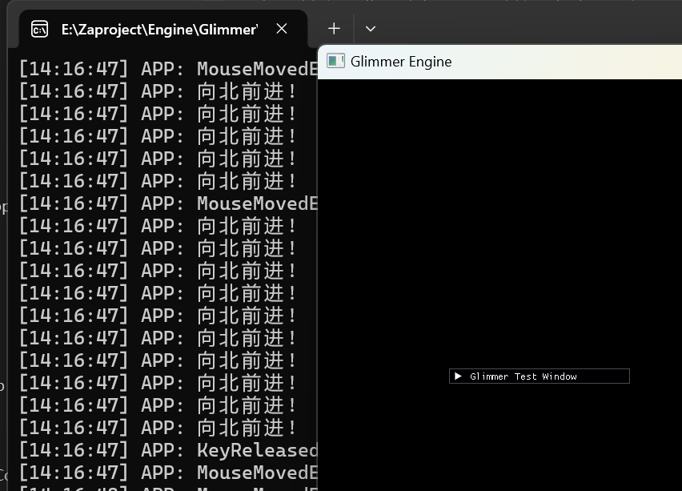

## GLM

在底层 C++ 开发中，这些数学类型都需要我们自己找库。**GLM** 是工业界的绝对标准，它的设计几乎完全模仿 **GLSL**（OpenGL 着色语言），让你在 C++ 里写数学逻辑和在 Shader 里写起来一模一样。

```
git submodule add https://github.com/g-truc/glm.git Glimmer/vendor/glm
```

**修改 Premake 配置**

由于 GLM 只是头文件，我们不需要为它写 premake5.lua 脚本，只需要把它的路径加入到 **Engine** 和 **Sandbox** 的包含目录中。

修改根目录的 **premake5.lua**：includedirs 两个项目

在Application中进行测试

```
#include <glm/vec3.hpp> // glm::vec3
#include <glm/vec4.hpp> // glm::vec4
#include <glm/mat4x4.hpp> // glm::mat4
#include <glm/gtc/matrix_transform.hpp> // glm::translate, glm::rotate, glm::scale, glm::perspective
namespace gl {
    Application* Application::s_Instance = nullptr;

    Application::Application() {
        GL_CORE_ASSERT(!s_Instance, "Application already exists!"); // 防止实例化多次
        s_Instance = this; // 【新增】：把自己存入单例
        m_Window = std::unique_ptr<Window>(Window::Create());
        // 使用 Lambda 表达式把事件传给 OnEvent
        m_Window->SetEventCallback([this](Event& e) {
            this->OnEvent(e);
            });

        m_ImGuiLayer = new ImGuiLayer();
        PushOverlay(m_ImGuiLayer); // 【新增】：把 ImGuiLayer 作为覆盖层推入栈顶

        // --- GLM 数学测试 ---
        glm::vec4 vector(1.0f, 1.0f, 1.0f, 1.0f);

        // 创建一个平移矩阵，让坐标向右移动 2 个单位
        glm::mat4 trans = glm::translate(glm::mat4(1.0f), glm::vec3(2.0f, 0.0f, 0.0f));

        // 矩阵乘法
        auto result = trans * vector;

        GL_CORE_INFO("GLM Math Test: Result X = {0}", result.x); // 应该输出 3.0
    }
```

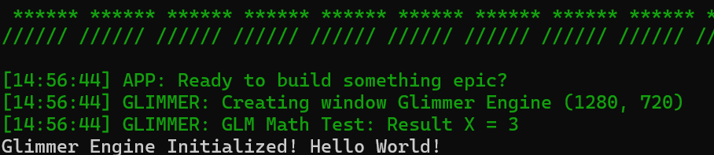

##  渲染上下文

WindowsWindow 承担了太多的责任：它既要负责打开窗口，又要负责初始化 OpenGL（调用 Glad）。

按照工业级引擎的**“解耦”**原则，我们需要引入 **渲染上下文 (Rendering Context)** 抽象层。

为什么需要这一步？

- **职责分离**：窗口只负责和操作系统（Windows/Linux）打交道；上下文只负责和图形显卡（OpenGL/Vulkan）打交道。
- **跨平台/多 API 支持**：未来如果你想支持 DirectX 或 Vulkan，你只需要增加一个新的 Context 实现类，而不需要修改 WindowsWindow.cpp。

**定义抽象基类 (GraphicsContext.h)**

在 Glimmer/src/Glimmer/Renderer 下创建 GraphicsContext.h。

**GraphicsContext.h**:

```
#pragma once

namespace gl {

    // 这是一个纯虚接口，定义了所有图形 API 上下文必须具备的功能
    class GraphicsContext {
    public:
        virtual ~GraphicsContext() = default;

        virtual void Init() = 0;        // 初始化（加载驱动函数指针）
        virtual void SwapBuffers() = 0; // 交换缓冲区（将画面呈现到屏幕）
    };

}
```

**实现 OpenGL 具体上下文 (OpenGLContext.cpp)**

在 Glimmer/src/Platform/OpenGL 下创建 OpenGLContext.h 和 OpenGLContext.cpp。

**OpenGLContext.h**:

```
#pragma once
#include "Glimmer/Renderer/GraphicsContext.h"

struct GLFWwindow; // 前向声明，减少头文件包含

namespace gl {

    class OpenGLContext : public GraphicsContext {
    public:
        OpenGLContext(GLFWwindow* windowHandle);

        virtual void Init() override;
        virtual void SwapBuffers() override;
    private:
        GLFWwindow* m_WindowHandle;
    };

}
```

**OpenGLContext.cpp**:

```
#include "glpch.h"
#include "OpenGLContext.h"

#include <glad/glad.h>
#include <GLFW/glfw3.h>

namespace gl {

    OpenGLContext::OpenGLContext(GLFWwindow* windowHandle)
        : m_WindowHandle(windowHandle)
    {
        GL_CORE_ASSERT(windowHandle, "Window handle is null!")
    }

    void OpenGLContext::Init()
    {
        // 1. 将该窗口设为当前的 OpenGL 上下文
        glfwMakeContextCurrent(m_WindowHandle);

        // 2. 使用 Glad 加载 OpenGL 函数指针
        int status = gladLoadGLLoader((GLADloadproc)glfwGetProcAddress);
        GL_CORE_ASSERT(status, "Failed to initialize Glad!");

        // 打印 GPU 信息（面试加分项）
        GL_CORE_INFO("OpenGL Info:");
        GL_CORE_INFO("  Vendor: {0}", (const char*)glGetString(GL_VENDOR));
        GL_CORE_INFO("  Renderer: {0}", (const char*)glGetString(GL_RENDERER));
        GL_CORE_INFO("  Version: {0}", (const char*)glGetString(GL_VERSION));
    }

    void OpenGLContext::SwapBuffers()
    {
        // 交换前后缓冲区
        glfwSwapBuffers(m_WindowHandle);
    }
}
```

在 `Init()` 中先通过 `glfwMakeContextCurrent` 将当前窗口绑定为 OpenGL 的上下文，然后使用 Glad 加载所有 OpenGL 函数指针（因为 OpenGL 本身是动态函数，需要运行时获取），接着打印显卡厂商、渲染器和版本信息用于调试；而 `SwapBuffers()` 则负责在每一帧结束时调用 `glfwSwapBuffers` 进行前后缓冲区交换，把渲染结果真正显示到屏幕上。整体上，这个类把“平台窗口（GLFW）”和“图形 API（OpenGL）”连接起来，是渲染系统启动的第一步。

**重构 WindowsWindow 接入上下文**

现在我们要把 WindowsWindow 里的“脏活累活”交给 OpenGLContext。

**WindowsWindow.h**:

```
#include "Glimmer/Renderer/GraphicsContext.h" // 包含接口

// ...
private:
    GLFWwindow* m_Window;
    GraphicsContext* m_Context; // ✨ 增加成员变量
// ...
```

WindowsWindow.cpp

```
void WindowsWindow::Init(const WindowProps& props)
{
    // ... glfwCreateWindow 的代码 ...

    // 核心重构：创建并初始化上下文
    m_Context = new OpenGLContext(m_Window);
    m_Context->Init(); 

    // ... 设置回调的代码 ...
}

void WindowsWindow::OnUpdate()
{
    glfwPollEvents();
    // 核心重构：不再调用 glfwSwapBuffers，而是调用上下文的交换
    m_Context->SwapBuffers(); 
}
```

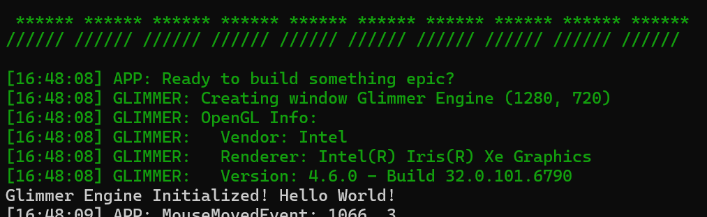

## 首个三角形

要在屏幕上画出一个三角形，我们需要打通 **CPU（你的代码）** 与 **GPU（显卡）** 之间的通道。这涉及到三个核心概念：

1. **VBO (顶点缓冲区)**：在显存里开辟一块地，把三角形的坐标存进去。
2. **VAO (顶点数组对象)**：告诉显卡怎么阅读这块地里的坐标（每隔几个字节是一个点）。
3. **Shader (着色器)**：写两段运行在显卡上的小程序，一段算位置，一段算颜色。

**在 Application.cpp 中编写三角形逻辑**

我们将直接在 Application 类里加入这些 OpenGL 原生调用。别担心，之后我们会把它们封装成漂亮的类。

修改 **Glimmer/src/Glimmer/Application.cpp**：

```
    glGenVertexArrays(1, &m_VertexArray);
    glBindVertexArray(m_VertexArray);

    glGenBuffers(1, &m_VertexBuffer);
    glBindBuffer(GL_ARRAY_BUFFER, m_VertexBuffer);

    float vertices[3 * 3] = {
        -0.5f, -0.5f, 0.0f,
         0.5f, -0.5f, 0.0f,
         0.0f,  0.5f, 0.0f
    };

    glBufferData(GL_ARRAY_BUFFER, sizeof(vertices), vertices, GL_STATIC_DRAW);

    glEnableVertexAttribArray(0);
    glVertexAttribPointer(0, 3, GL_FLOAT, GL_FALSE, 3 * sizeof(float), nullptr);

    glGenBuffers(1, &m_IndexBuffer);
    glBindBuffer(GL_ELEMENT_ARRAY_BUFFER, m_IndexBuffer);

    unsigned int indices[3] = { 0, 1, 2 };
    glBufferData(GL_ELEMENT_ARRAY_BUFFER, sizeof(indices), indices, GL_STATIC_DRAW);
```

**把一个三角形的顶点数据上传到 GPU，并配置好如何解析这些数据，从而让显卡能够正确绘制它**。流程是先创建并绑定一个 VAO（顶点数组对象）来记录所有顶点相关状态，然后创建 VBO（顶点缓冲）并把三角形的顶点坐标传到显存中；接着通过 `glVertexAttribPointer` 告诉 OpenGL：这些数据是按每 3 个 float 表示一个顶点位置（对应 shader 里的 layout location = 0）；最后创建 EBO（索引缓冲），用索引 `{0,1,2}` 指定绘制顺序。这样一套下来，GPU 就知道“从哪里读数据、怎么读、按什么顺序画”，后面只需要一次 DrawCall 就能把这个三角形画出来。

- **以前 (无索引)**：glDrawArrays(GL_TRIANGLES, 0, 3);
- **现在 (有索引)**：使用 **glDrawElements**。

在 Application::Run 中修改：

```
// 绑定 VAO（它会自动关联之前绑定的 VBO 和 IBO）
glBindVertexArray(m_VertexArray);

// 参数：模式, 索引数量, 索引类型, 偏移量
glDrawElements(GL_TRIANGLES, 3, GL_UNSIGNED_INT, nullptr);
```

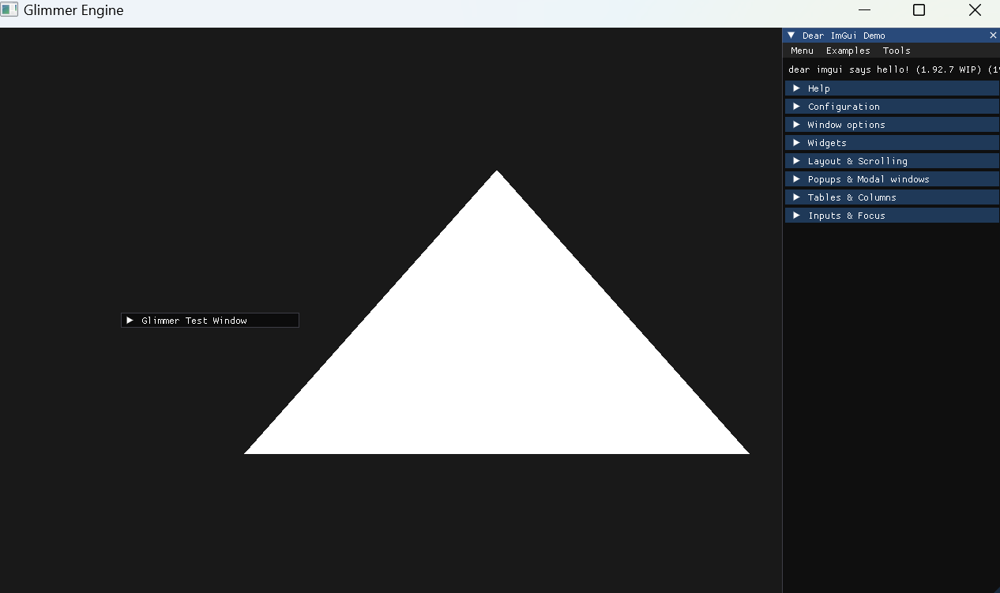

## Shader

Shader 是运行在显卡（GPU）上的小程序，通常使用 **GLSL** (OpenGL Shading Language) 编写

**创建 Shader 接口类 (Shader.h)**

在 Glimmer/src/Glimmer/Renderer 目录下创建。

**Shader.h**:

```
#pragma once
#include <string>

namespace gl {

    class Shader {
    public:
        Shader(const std::string& vertexSrc, const std::string& fragmentSrc);
        ~Shader();

        void Bind() const;   // 对应 glUseProgram(id)
        void Unbind() const; // 对应 glUseProgram(0)

    private:
        uint32_t m_RendererID; // 显卡返回的程序 ID
    };

}
```

**实现 Shader 类逻辑 (Shader.cpp)**

这一步最核心的工作是**错误检查**。如果 Shader 写错了，我们必须让引擎在控制台报错，而不是默默黑屏。

**Shader.cpp**:源代码过长，具体逻辑如下：

**把顶点着色器和片元着色器从源码编译、链接成一个 GPU 可执行的渲染程序（Shader Program），并提供绑定/解绑接口供渲染时使用**。流程上先分别创建**顶点**和**片元**着色器对象，将传入的 GLSL 源码提交给 OpenGL 编译，并在每一步严格**检查编译错误**；接着把两个着色器附加到同一个 Program 上进行**链接**，生成最终的 Shader Program（`m_RendererID`），链接完成后再将中间的 Shader 对象解绑（释放依赖）；最后**通过 `Bind/Unbind` 控制当前使用的 Shader**。整体上，这个类把原本繁琐的 OpenGL Shader 流程封装起来，让上层只需要关心“用哪个 Shader”，而不用关心底层细节。

**在 Application 中使用封装后的类**

重构你的 Application.cpp：在缓冲区下加入shader

这段代码的核心是在**定义一套最基础的 Shader（顶点 + 片元），并创建对应的 GPU 渲染程序**。具体来说，`vertexSrc` 定义了顶点着色器：它接收每个顶点的位置 `a_Position`，一方面直接传给 `gl_Position` 用于最终的屏幕变换，另一方面通过 `v_Position` 传递给后续阶段；而 `fragmentSrc` 定义了片元着色器：它接收从顶点阶段插值过来的 `v_Position`，并通过简单的数学变换（`*0.5 + 0.5`）把原本范围在 [-1,1] 的坐标映射到 [0,1]，最终作为颜色输出。最后通过 `m_Shader.reset(new Shader(...))` 创建 Shader 对象并交给智能指针管理，实现自动生命周期控制。整体效果就是：**根据顶点位置生成一个渐变颜色的三角形**。

```glsl
    glBindBuffer(GL_ELEMENT_ARRAY_BUFFER, m_IndexBuffer);

    unsigned int indices[3] = { 0, 1, 2 };
    glBufferData(GL_ELEMENT_ARRAY_BUFFER, sizeof(indices), indices, GL_STATIC_DRAW);


    std::string vertexSrc = R"(
        #version 330 core

        layout(location = 0) in vec3 a_Position;

        out vec3 v_Position;

        void main()
        {
            v_Position = a_Position;
            gl_Position = vec4(a_Position, 1.0);	
        }
    )";

    std::string fragmentSrc = R"(
        #version 330 core

        layout(location = 0) out vec4 color;

        in vec3 v_Position;

        void main()
        {
            color = vec4(v_Position * 0.5 + 0.5, 1.0);
        }
    )";

    m_Shader.reset(new Shader(vertexSrc, fragmentSrc));
```

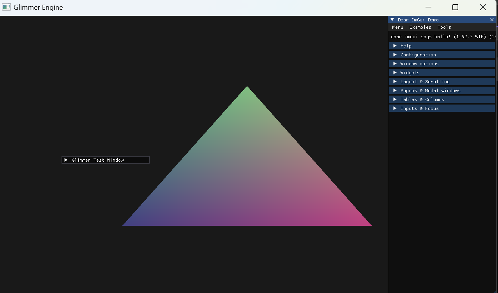

与之相对，固定RGB写法

这两段 Shader 的本质区别在于：**第一段是“基于顶点位置生成颜色的动态渐变”，第二段是“固定颜色输出”**。具体来说，第一段在顶点着色器中把顶点位置通过 `v_Position` 传递到片元着色器，并利用 GPU 的插值机制在三角形内部自动插值，最终在片元阶段根据位置计算颜色（`v_Position * 0.5 + 0.5`），所以整个三角形会呈现渐变效果；而第二段完全没有数据传递，片元着色器直接输出一个固定的 RGBA 值，因此整个三角形是纯色的，没有任何变化。

```
// 顶点着色器：负责把 3D 坐标转换到屏幕上
std::string vertexSrc = R"(
    #version 330 core
    
    layout(location = 0) in vec3 a_Position; // 对应刚才指定的 AttribPointer 0

    void main()
    {
        gl_Position = vec4(a_Position, 1.0);
    }
)";

// 片元着色器：负责给像素上色
std::string fragmentSrc = R"(
    #version 330 core
    
    layout(location = 0) out vec4 color;

    void main()
    {
        color = vec4(0.8, 0.2, 0.3, 1.0); // 橘红色 (RGBA)
    }
)";
```

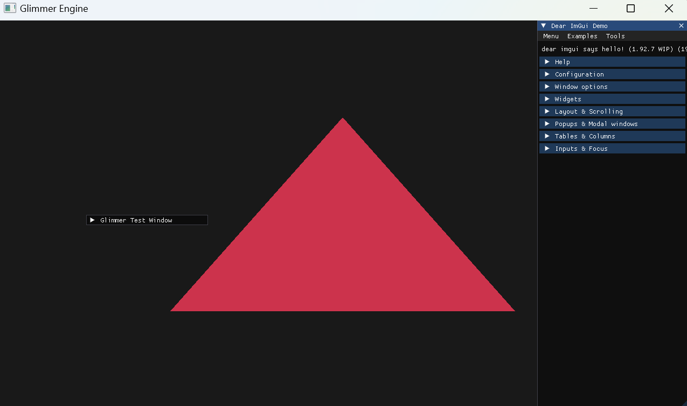

## Uniform 上传

实现 **Uniform 上传** 是让 Shader 从“静态图片”变成“动态特效”的关键，也是 CPU 指挥 GPU 的核心手段。

为了让 Glimmer 引擎能够方便地传递时间、颜色、甚至是变换矩阵，我们需要在 Shader 类中封装一系列 UploadUniform 函数。

**扩展 Shader.h 接口**

我们需要支持多种数据类型。虽然你现在只需要 float 传时间，但以后一定会用到 vec3 传颜色和 mat4 传位置。

**Glimmer/src/Glimmer/Renderer/Shader.h**:

```
#include <glm/glm.hpp> // 确保包含了 GLM 数学库

namespace gl {
    class Shader {
    public:
        // ... 原有构造、析构、Bind ...

        // ✨ 新增一系列上传 Uniform 的接口
        void UploadUniformInt(const std::string& name, int value);

        void UploadUniformFloat(const std::string& name, float value);
        void UploadUniformFloat2(const std::string& name, const glm::vec2& value);
        void UploadUniformFloat3(const std::string& name, const glm::vec3& value);
        void UploadUniformFloat4(const std::string& name, const glm::vec4& value);

        void UploadUniformMat4(const std::string& name, const glm::mat4& matrix);

    private:
        uint32_t m_RendererID;
    };
}
```

**实现 Shader.cpp 中的上传逻辑**

在 OpenGL 中，上传数据的标准流程是：**获取位置 (Location) -> 调用对应的 glUniform 函数**。

**Glimmer/src/Glimmer/Renderer/Shader.cpp**:

```
    void Shader::UploadUniformInt(const std::string& name, int value) {
        GLint location = glGetUniformLocation(m_RendererID, name.c_str());
        glUniform1i(location, value);
    }

    void Shader::UploadUniformFloat(const std::string& name, float value) {
        GLint location = glGetUniformLocation(m_RendererID, name.c_str());
        glUniform1f(location, value);
    }
    //其余同理
```

 **在渲染循环中注入时间**

修改 Application::Run：

```
void Application::Run() {
    while (m_Running) {
        glClearColor(0.1f, 0.1f, 0.1f, 1);
        glClear(GL_COLOR_BUFFER_BIT);

        m_Shader->Bind();
        
        // 每帧获取当前时间并上传给显卡
        float time = (float)glfwGetTime(); 
        m_Shader->UploadUniformFloat("u_Time", time);

        glBindVertexArray(m_VertexArray);
        glDrawElements(GL_TRIANGLES, 3, GL_UNSIGNED_INT, nullptr);

        m_Window->OnUpdate();
    }
}
```

动态shader

```
std::string fragmentSrc = R"(
    #version 330 core
    layout(location = 0) out vec4 color;
    in vec3 v_Position;
    
    uniform float u_Time; // 接收外部注入的时间

    void main() {
        // 让颜色随时间和位置发生偏移
        vec3 col = 0.5 + 0.5 * cos(u_Time + v_Position.xyx + vec3(3,1,4));
        color = vec4(col, 1.0);
    }
)";
```

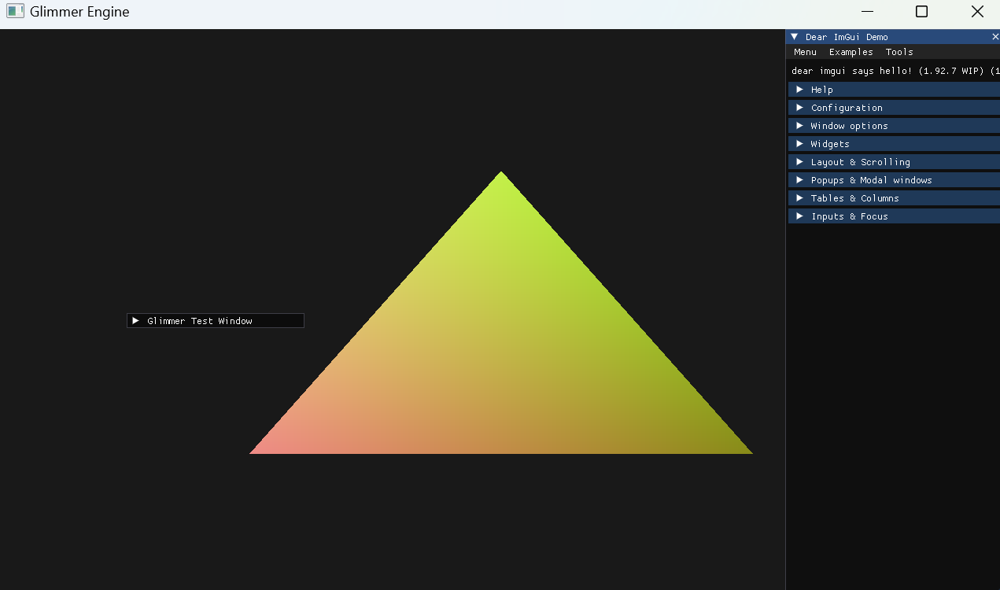

**顶点动画**

使得三角形有旋转的动感

```
std::string vertexSrc = R"(
#version 330 core

layout(location = 0) in vec3 a_Position;
out vec3 v_Position;
uniform float u_Time;

void main()
{
    vec3 pos = a_Position;
    pos.y += sin(pos.x * 5.0 + u_Time) * 0.1; // 新增
    v_Position = pos;
    gl_Position = vec4(pos, 1.0);
}
)";
```

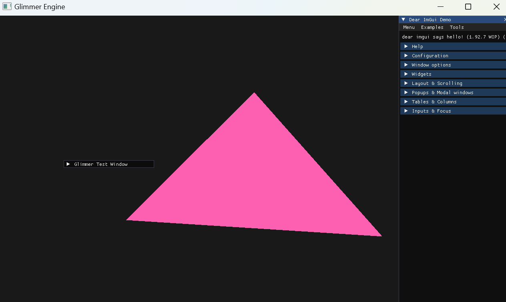

extra：

**迷幻彩虹 (Psychedelic Flow)**

颜色不再是静态的，而是像液体一样在三角形表面流动。

**特色**：在颜色空间中引入正弦波震荡。

```
// Fragment Shader
#version 330 core

layout(location = 0) out vec4 color;
in vec3 v_Position;
uniform float u_Time;

void main()
{
    vec3 col;
    // 使用三角函数让 R, G, B 三个通道随位置和时间发生不同的相位偏移
    col.r = sin(v_Position.x * 3.0 + u_Time) * 0.5 + 0.5;
    col.g = sin(v_Position.y * 3.0 + u_Time + 2.0) * 0.5 + 0.5;
    col.b = sin((v_Position.x + v_Position.y) * 3.0 + u_Time + 4.0) * 0.5 + 0.5;
    
    color = vec4(col, 1.0);
}
```

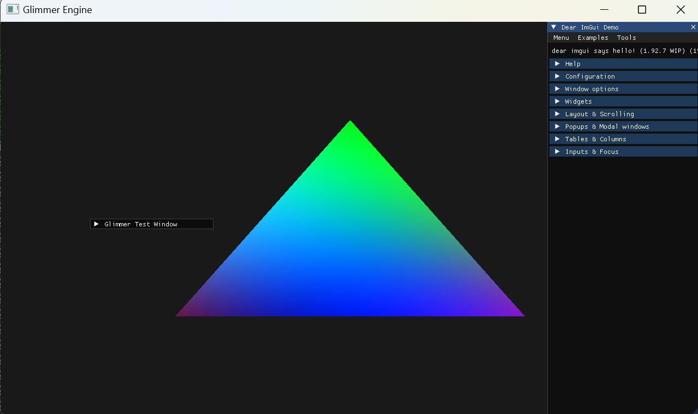

同时应用顶点变换和颜色变换小bug：没有更新顶点的out v_Position赋值，导致颜色变换的计算是基于原坐标而不是变换坐标

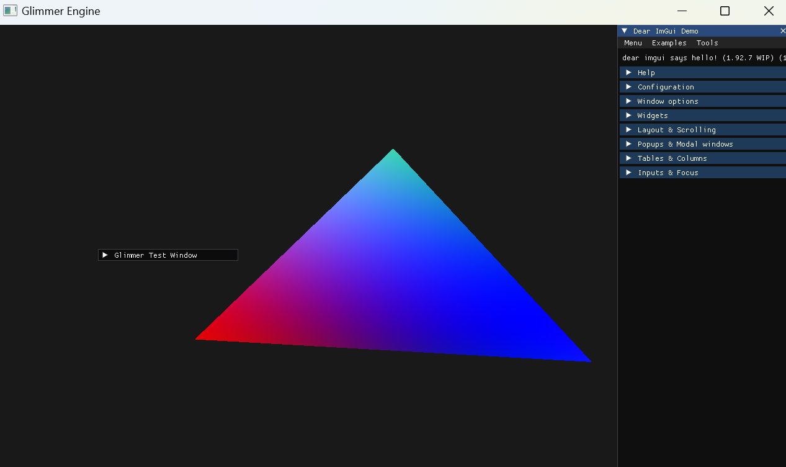

测试shader留档

```
        // Shader 代码
        std::string vertexSrc = R"(
		#version 330 core
		layout(location = 0) in vec3 a_Position;
        uniform mat4 u_ViewProjection;
		out vec3 v_Position;
        uniform float u_Time;
		void main()
		{
            vec3 pos = a_Position;
            pos.y += sin(pos.x * 5.0 + u_Time) * 0.1;
            v_Position = pos;
            gl_Position = u_ViewProjection * vec4(pos, 1.0); 
		}
	)";
        std::string fragmentSrc = R"(
		#version 330 core
		layout(location = 0) out vec4 color;
		in vec3 v_Position;
        uniform float u_Time;
		void main()
		{
            vec3 col;
            // 使用三角函数让 R, G, B 三个通道随位置和时间发生不同的相位偏移
            col.r = sin(v_Position.x * 3.0 + u_Time) * 0.5 + 0.5;
            col.g = sin(v_Position.y * 3.0 + u_Time + 2.0) * 0.5 + 0.5;
            col.b = sin((v_Position.x + v_Position.y) * 3.0 + u_Time + 4.0) * 0.5 + 0.5;
            color = vec4(col, 1.0);
		}
	)";
```


## Buffer 抽象

接入 **Buffer（缓冲区）抽象** 是 Glimmer 引擎迈向**多图形 API 支持**（如未来支持 DX12/Vulkan）最关键的一步。

目前我们在 Application.cpp 里直接调用 glGenBuffers 和 glBindBuffer，这让代码充满了“OpenGL 味儿”。我们要把它封装成通用的 C++ 接口。

我们将实现三个核心类：

1. **VertexBuffer** (顶点缓冲区)：存坐标、颜色。
2. **IndexBuffer** (索引缓冲区)：存画图顺序。
3. **BufferLayout** (布局)：**这是重中之重！** 它将彻底消灭难看的 glVertexAttribPointer。

**定义抽象接口 (Buffer.h)**

在 Glimmer/src/Glimmer/Renderer 下创建。

**Buffer.h**:

```
#pragma once

namespace gl {

    class VertexBuffer {
    public:
        virtual ~VertexBuffer() {}

        virtual void Bind() const = 0;
        virtual void Unbind() const = 0;

        static VertexBuffer* Create(float* vertices, uint32_t size);
    };

    class IndexBuffer {
    public:
        virtual ~IndexBuffer() {}

        virtual void Bind() const = 0;
        virtual void Unbind() const = 0;

        virtual uint32_t GetCount() const = 0; // 拿到有多少个索引点

        static IndexBuffer* Create(uint32_t* indices, uint32_t count);
    };

}
```

**实现 OpenGL 版本的 Buffer (OpenGLBuffer.cpp)**

在 Glimmer/src/Platform/OpenGL 下创建。

**OpenGLBuffer.h**:

定义了 OpenGL 渲染后端的两个核心缓冲区类：`OpenGLVertexBuffer` 和 `OpenGLIndexBuffer`，它们分别实现了引擎抽象的顶点缓冲和索引缓冲接口。`OpenGLVertexBuffer` 接收顶点数据，在构造时生成 GPU 上的 VBO 并通过 `m_RendererID` 管理，`Bind` 和 `Unbind` 用于在渲染时切换当前缓冲区，而析构函数负责释放 GPU 内存。`OpenGLIndexBuffer` 同样管理索引数据，保存索引数量 `m_Count`，通过绑定和解绑操作配合 `glDrawElements` 使用，实现顶点复用以减少渲染开销。这种设计的核心价值在于接口与实现分离，上层渲染逻辑无需关心 OpenGL 细节，只通过统一接口操作缓冲区，从而保证了渲染器后端的可替换性。

```
#pragma once
#include "Glimmer/Renderer/Buffer.h"

namespace gl {

    class OpenGLVertexBuffer : public VertexBuffer {
    public:
        OpenGLVertexBuffer(float* vertices, uint32_t size);
        virtual ~OpenGLVertexBuffer();

        virtual void Bind() const override;
        virtual void Unbind() const override;
    private:
        uint32_t m_RendererID;
    };

    class OpenGLIndexBuffer : public IndexBuffer {
    public:
        OpenGLIndexBuffer(uint32_t* indices, uint32_t count);
        virtual ~OpenGLIndexBuffer();

        virtual void Bind() const override;
        virtual void Unbind() const override;

        virtual uint32_t GetCount() const override { return m_Count; }
    private:
        uint32_t m_RendererID;
        uint32_t m_Count;
    };
}
```

**OpenGLBuffer.cpp**: (核心逻辑，把 gl 函数包起来)

`OpenGLBuffer.cpp` 代码实现了前面头文件中声明的 `OpenGLVertexBuffer` 和 `OpenGLIndexBuffer`，核心作用是把顶点和索引数据上传到 GPU 并管理它们的生命周期，从而支持高效渲染。具体来说，`OpenGLVertexBuffer` 构造时通过 `glGenBuffers` 创建一个 VBO，并用 `glBufferData` 将顶点数组传入 GPU 内存，绑定和解绑方法用于在渲染时切换当前缓冲区，析构函数负责释放 GPU 资源，保证内存安全；`OpenGLIndexBuffer` 类似地创建 EBO 管理索引数据，`m_Count` 记录索引数量方便后续渲染调用 `glDrawElements`，绑定解绑控制当前索引缓冲对象。整体逻辑体现了 **RAII 风格的资源管理**、**接口抽象与实现分离**，上层渲染系统只需通过统一接口操作缓冲区而无需关心 OpenGL 的底层细节，实现了渲染器后端解耦。

**实现工厂方法 (Buffer.cpp)**

这一步是为了让 Application 只需要调用 Create 就能自动根据平台返回正确的 Buffer。

**Glimmer/src/Glimmer/Renderer/Buffer.cpp**:

```
#include "glpch.h"
#include "Buffer.h"
#include "Platform/OpenGL/OpenGLBuffer.h"

namespace gl {

    VertexBuffer* VertexBuffer::Create(float* vertices, uint32_t size) {
        // 未来可以在这里写 switch(Renderer::GetAPI()) 来切换平台
        return new OpenGLVertexBuffer(vertices, size);
    }

    IndexBuffer* IndexBuffer::Create(uint32_t* indices, uint32_t count) {
        return new OpenGLIndexBuffer(indices, count);
    }

}
```

**在 Application 中使用封装后的 Buffer**

重构你的 Application.cpp。你会发现原生 gl 调用正在消失：

## 缓冲区布局与顶点数组封装

**实现 BufferLayout (缓冲区布局)**

我们要让引擎自动计算“步长（Stride）”和“偏移量（Offset）”。

定义数据类型与布局类

在 Buffer.h 中添加以下代码（放在命名空间内）：

**Glimmer/src/Glimmer/Renderer/Buffer.h** (新增部分):

代码过长：首先定义了 `ShaderDataType` 枚举，表示顶点属性可能的数据类型（浮点、整型、矩阵、布尔），并通过 `ShaderDataTypeSize` 函数计算每种类型在内存中的字节大小，这对于后续缓冲区偏移计算非常关键。

`BufferElement` 结构体描述单个顶点属性，包括名称、类型、大小、偏移量以及是否归一化，同时提供 `GetComponentCount` 方法返回该属性的分量数量（例如 `Float3` 是 3 个分量），便于在 OpenGL 中调用 `glVertexAttribPointer` 时指定每个顶点属性的维度。

`BufferLayout` 类则管理一组 `BufferElement`，在构造时接受初始化列表并调用 `CalculateOffsetsAndStride` 计算每个属性在顶点结构体中的 **内存偏移** 和 **顶点总字节数（Stride）**，保证 GPU 能按正确顺序读取数据。通过提供 `begin()` 和 `end()`，支持范围循环遍历每个属性，方便绑定到渲染管线。

同时，给 VertexBuffer 类增加设置布局的虚接口：

```
class VertexBuffer {
public:
    // ... 原有函数 ...
    virtual void SetLayout(const BufferLayout& layout) = 0;
    virtual const BufferLayout& GetLayout() const = 0;
};
```

**更新 OpenGLBuffer.h/cpp**

你需要实现刚才在接口里增加的 GetLayout 和 SetLayout。

```
		virtual const BufferLayout& GetLayout() const override { return m_Layout; }
		virtual void SetLayout(const BufferLayout& layout) override { m_Layout = layout; }
	private:
		uint32_t m_RendererID;
		BufferLayout m_Layout;
```

**实现 VertexArray (顶点数组对象)**

定义抽象接口 (VertexArray.h)

```
#pragma once
#include "Glimmer/Renderer/Buffer.h"
#include <memory>

namespace gl {
    class VertexArray {
    public:
        virtual ~VertexArray() {}
        virtual void Bind() const = 0;
        virtual void Unbind() const = 0;

        virtual void AddVertexBuffer(const std::shared_ptr<VertexBuffer>& vertexBuffer) = 0;
        virtual void SetIndexBuffer(const std::shared_ptr<IndexBuffer>& indexBuffer) = 0;

        virtual const std::vector<std::shared_ptr<VertexBuffer>>& GetVertexBuffers() const = 0;
        virtual const std::shared_ptr<IndexBuffer>& GetIndexBuffer() const = 0;

        static VertexArray* Create();
    };
}
```

**实现 OpenGL 版本的 VertexArray**

这里是最精彩的：它会自动读取 VertexBuffer 里的 Layout，并自动调用 glVertexAttribPointer。

**文件路径：Glimmer/src/Platform/OpenGL/OpenGLVertexArray.h**

```
#pragma once
#include "Glimmer/Renderer/VertexArray.h"

namespace gl {

	class OpenGLVertexArray : public VertexArray
	{
	public:
		OpenGLVertexArray();
		virtual ~OpenGLVertexArray();

		virtual void Bind() const override;
		virtual void Unbind() const override;

		virtual void AddVertexBuffer(const std::shared_ptr<VertexBuffer>& vertexBuffer) override;
		virtual void SetIndexBuffer(const std::shared_ptr<IndexBuffer>& indexBuffer) override;

		virtual const std::vector<std::shared_ptr<VertexBuffer>>& GetVertexBuffers() const override { return m_VertexBuffers; }
		virtual const std::shared_ptr<IndexBuffer>& GetIndexBuffer() const override { return m_IndexBuffer; }
	private:
		uint32_t m_RendererID;
		std::vector<std::shared_ptr<VertexBuffer>> m_VertexBuffers;
		std::shared_ptr<IndexBuffer> m_IndexBuffer;
	};

}
```

文件路径：**Glimmer/src/Platform/OpenGL/OpenGLVertexArray.cpp**

它的核心作用是：**把“顶点数据 + 顶点布局描述”绑定在一起，让 GPU 知道如何解析一段连续内存中的顶点结构**，从而完成真正的渲染输入配置。

从整体流程来看，这个类在构造时通过 `glGenVertexArrays` 创建一个 VAO，在 `Bind/Unbind` 中切换当前 VAO；真正的关键逻辑在 `AddVertexBuffer`：它先检查传入的 `VertexBuffer` 是否有布局（这是非常重要的安全校验），然后绑定 VAO 和 VBO，接着遍历 `BufferLayout` 中的每个 `BufferElement`，调用 `glEnableVertexAttribArray` 和 `glVertexAttribPointer`，把“顶点数据如何解释”（比如位置是3个float、颜色是4个float）逐个告诉 GPU，其中 `ShaderDataTypeToOpenGLBaseType` 负责把引擎抽象的数据类型映射为 OpenGL 类型（如 GL_FLOAT）。同时通过 `stride` 和 `offset` 指定每个属性在内存中的步长和偏移，这一步本质上就是在描述“一个顶点在内存中的结构”。最后把这个 VBO 存入列表，保证生命周期和后续使用。

`SetIndexBuffer` 则负责绑定索引缓冲（EBO），并保存引用，这样 VAO 就同时记录了“顶点数据 + 索引数据”的完整状态，之后渲染时只需要 Bind VAO，就能恢复全部输入配置。

**VertexArray 的工厂方法**

**文件路径：Glimmer/src/Glimmer/Renderer/VertexArray.cpp**

```
#include "glpch.h"
#include "VertexArray.h"
#include "Platform/OpenGL/OpenGLVertexArray.h"

namespace gl {

	VertexArray* VertexArray.Create()
	{
		// 暂时直接返回 OpenGL 版本
		return new OpenGLVertexArray();
	}

}
```

## Render类

接入 **Renderer（渲染器）** 类是 Glimmer 引擎从“OpenGL 包装盒”进化为“真正的渲染引擎”的决定性一步。

目前的 Application.cpp 依然在亲手处理 glClear 和 glDrawElements。**Renderer 类存在的意义，就是彻底剥离这些底层细节。**

我们将建立一个三层架构：

1. **RendererAPI**：抽象基类，定义“画画”和“清屏”的动作。
2. **RenderCommand**：静态中转站，负责呼叫当前的 API。
3. **Renderer**：最高级层，负责场景管理（比如：开始场景、提交模型、结束场景）。

**API 抽象层 (RendererAPI & RenderCommand)**

定义 API 接口 (RendererAPI.h)，这是所有图形 API（OpenGL, Vulkan, DX12）必须实现的“动作清单”。

在 Glimmer/src/Glimmer/Renderer 下创建。

**Glimmer/src/Glimmer/Renderer/RendererAPI.h**

```
#pragma once
#include <glm/glm.hpp>
#include "VertexArray.h"

namespace gl {
    class RendererAPI {
    public:
        enum class API { None = 0, OpenGL = 1 };
    public:
        virtual void SetClearColor(const glm::vec4& color) = 0;
        virtual void Clear() = 0;
        virtual void DrawIndexed(const std::shared_ptr<VertexArray>& vertexArray) = 0;

        inline static API GetAPI() { return s_API; }
    private:
        static API s_API;
    };
}
```

**Glimmer/src/Glimmer/Renderer/RendererAPI.cpp**

```
#include "glpch.h"
#include "RendererAPI.h"

namespace gl {

	RendererAPI::API RendererAPI::s_API = RendererAPI::API::OpenGL;

}
```

**实现 OpenGL 的具体指令 (OpenGLRendererAPI.h/cpp)**

在这里，我们将抽象接口翻译成真实的 OpenGL 代码。

```
#pragma once
#include "Glimmer/Renderer/RendererAPI.h"

namespace gl {

	class OpenGLRendererAPI : public RendererAPI
	{
	public:
		virtual void SetClearColor(const glm::vec4& color) override;
		virtual void Clear() override;

		virtual void DrawIndexed(const std::shared_ptr<VertexArray>& vertexArray) override;
	};

}
```

```
#include "glpch.h"
#include "OpenGLRendererAPI.h"
#include <glad/glad.h>

namespace gl {

	void OpenGLRendererAPI::SetClearColor(const glm::vec4& color)
	{
		glClearColor(color.r, color.g, color.b, color.a);
	}

	void OpenGLRendererAPI::Clear()
	{
		glClear(GL_COLOR_BUFFER_BIT | GL_DEPTH_BUFFER_BIT);
	}

	void OpenGLRendererAPI::DrawIndexed(const std::shared_ptr<VertexArray>& vertexArray)
	{
		glDrawElements(GL_TRIANGLES, vertexArray->GetIndexBuffer()->GetCount(), GL_UNSIGNED_INT, nullptr);
	}

}
```

**建立命令中转站 (RenderCommand.h/cpp)**

它的作用是提供一组全局静态方法，方便我们随时随地“发号施令”。

**文件路径：Glimmer/src/Glimmer/Renderer/RenderCommand.h**

```
#pragma once
#include "RendererAPI.h"

namespace gl {

	class RenderCommand
	{
	public:
		inline static void SetClearColor(const glm::vec4& color)
		{
			s_RendererAPI->SetClearColor(color);
		}

		inline static void Clear()
		{
			s_RendererAPI->Clear();
		}

		inline static void DrawIndexed(const std::shared_ptr<VertexArray>& vertexArray)
		{
			s_RendererAPI->DrawIndexed(vertexArray);
		}
	private:
		static RendererAPI* s_RendererAPI;
	};

}
```

文件路径：**Glimmer/src/Glimmer/Renderer/RenderCommand.cpp**

```
#include "glpch.h"
#include "RenderCommand.h"
#include "Platform/OpenGL/OpenGLRendererAPI.h"

namespace gl {

	// 核心：在这里决定到底用哪个 API 实例
	RendererAPI* RenderCommand::s_RendererAPI = new OpenGLRendererAPI();

}
```

**实现高层渲染器 (Renderer.h/cpp)**

这是开发者最终打交道的类。它负责“提交（Submit）”各种模型和 Shader。

**文件路径：Glimmer/src/Glimmer/Renderer/Renderer.h**

```
#pragma once
#include "RenderCommand.h"
#include "Shader.h"

namespace gl {

	class Renderer
	{
	public:
		static void BeginScene();
		static void EndScene();

		static void Submit(const std::shared_ptr<Shader>& shader, const std::shared_ptr<VertexArray>& vertexArray);

		inline static RendererAPI::API GetAPI() { return RendererAPI::GetAPI(); }
	};

}
```

```
#include "glpch.h"
#include "Renderer.h"

namespace gl {

	void Renderer::BeginScene()
	{
		// 以后这里会接收摄像机，并计算 View-Projection 矩阵
	}

	void Renderer::EndScene()
	{
	}

	void Renderer::Submit(const std::shared_ptr<Shader>& shader, const std::shared_ptr<VertexArray>& vertexArray)
	{
		shader->Bind();
		vertexArray->Bind();
		RenderCommand::DrawIndexed(vertexArray);
	}

}
```

## 正交摄像机

现在所有的渲染底层组件（Buffer, VertexArray, Renderer API）都已经封装完毕。目前的三角形是**死死固定在屏幕中心**的（处于 -1 到 1 的标准化设备坐标系中）。

下一步我们要引入 **正交摄像机 (Orthographic Camera)**。

**这一步的作用：**

1. **建立世界坐标系**：你可以定义一个 16:9 的世界，而不是死板的 -1 到 1。
2. **场景漫游**：通过移动摄像机，实现 2D 游戏的画面滚动（比如主角走，镜头跟）。
3. **数学联动**：这是你第一次真正大规模使用 GLM 矩阵运算（View-Projection 矩阵）。

**创建摄像机类 (OrthographicCamera.h/cpp)**

**文件路径：Glimmer/src/Glimmer/Renderer/OrthographicCamera.h**

```
#pragma once
#include <glm/glm.hpp>

namespace gl {

	class OrthographicCamera
	{
	public:
		OrthographicCamera(float left, float right, float bottom, float top);

		const glm::vec3& GetPosition() const { return m_Position; }
		void SetPosition(const glm::vec3& position) { m_Position = position; RecalculateViewMatrix(); }

		float GetRotation() const { return m_Rotation; }
		void SetRotation(float rotation) { m_Rotation = rotation; RecalculateViewMatrix(); }

		const glm::mat4& GetProjectionMatrix() const { return m_ProjectionMatrix; }
		const glm::mat4& GetViewMatrix() const { return m_ViewMatrix; }
		const glm::mat4& GetViewProjectionMatrix() const { return m_ViewProjectionMatrix; }
	private:
		void RecalculateViewMatrix();
	private:
		glm::mat4 m_ProjectionMatrix;
		glm::mat4 m_ViewMatrix;
		glm::mat4 m_ViewProjectionMatrix;

		glm::vec3 m_Position = { 0.0f, 0.0f, 0.0f };
		float m_Rotation = 0.0f;
	};

}
```

**Glimmer/src/Glimmer/Renderer/OrthographicCamera.cpp**

```
#include "glpch.h"
#include "OrthographicCamera.h"
#include <glm/gtc/matrix_transform.hpp>

namespace gl {

	OrthographicCamera::OrthographicCamera(float left, float right, float bottom, float top)
		: m_ProjectionMatrix(glm::ortho(left, right, bottom, top, -1.0f, 1.0f)), m_ViewMatrix(1.0f)
	{
		m_ViewProjectionMatrix = m_ProjectionMatrix * m_ViewMatrix;
	}

	void OrthographicCamera::RecalculateViewMatrix()
	{
		// 计算 View 矩阵：先平移再旋转，最后取逆
		// 在 2D 中，摄像机往左移，物体看起来就往右移
		glm::mat4 transform = glm::translate(glm::mat4(1.0f), m_Position) *
			glm::rotate(glm::mat4(1.0f), glm::radians(m_Rotation), glm::vec3(0, 0, 1));

		m_ViewMatrix = glm::inverse(transform);
		m_ViewProjectionMatrix = m_ProjectionMatrix * m_ViewMatrix;
	}

}
```

**更新渲染器以支持摄像机 (Renderer.h/cpp)**

渲染器现在需要接收摄像机的矩阵，并把它传给每一帧绘制的 Shader。

**文件路径：Glimmer/src/Glimmer/Renderer/Renderer.h**

```
#pragma once
#include "RenderCommand.h"
#include "OrthographicCamera.h"
#include "Shader.h"

namespace gl {

	class Renderer
	{
	public:
		// 修改：BeginScene 现在需要传入摄像机
		static void BeginScene(OrthographicCamera& camera);
		static void EndScene();

		static void Submit(const std::shared_ptr<Shader>& shader, const std::shared_ptr<VertexArray>& vertexArray);

		inline static RendererAPI::API GetAPI() { return RendererAPI::GetAPI(); }

	private:
		struct SceneData
		{
			glm::mat4 ViewProjectionMatrix;
		};

		static SceneData* s_SceneData;
	};

}
```

**Glimmer/src/Glimmer/Renderer/Renderer.cpp**

```
#include "glpch.h"
#include "Renderer.h"

namespace gl {

	Renderer::SceneData* Renderer::s_SceneData = new Renderer::SceneData;

	void Renderer::BeginScene(OrthographicCamera& camera)
	{
		// 记录摄像机的 View-Projection 矩阵
		s_SceneData->ViewProjectionMatrix = camera.GetViewProjectionMatrix();
	}

	void Renderer::EndScene()
	{
	}

	void Renderer::Submit(const std::shared_ptr<Shader>& shader, const std::shared_ptr<VertexArray>& vertexArray)
	{
		shader->Bind();
		// 自动向 Shader 上传矩阵变量，名字定为 "u_ViewProjection"
		shader->UploadUniformMat4("u_ViewProjection", s_SceneData->ViewProjectionMatrix);

		vertexArray->Bind();
		RenderCommand::DrawIndexed(vertexArray);
	}

}
```

**重构 Application.cpp**

现在我们要修改 Shader 源码，并让摄像机动起来。

**修改 Application.cpp 中的部分逻辑：**

```
		// ---------------------------------------------------------
		// 1. 摄像机初始化 (16:9 比例)
		// ---------------------------------------------------------
		m_Camera.reset(new OrthographicCamera(-1.6f, 1.6f, -0.9f, 0.9f));

		// ---------------------------------------------------------
		// 2. 顶点数据与 VertexArray 封装
		// ---------------------------------------------------------
		m_VertexArray.reset(VertexArray::Create());

		float vertices[3 * 3] = {
			-0.5f, -0.5f, 0.0f, // 左下
			 0.5f, -0.5f, 0.0f, // 右下
			 0.0f,  0.5f, 0.0f  // 顶
		};

		std::shared_ptr<VertexBuffer> vertexBuffer;
		vertexBuffer.reset(VertexBuffer::Create(vertices, sizeof(vertices)));

		// 使用声明式布局 (BufferLayout)
		vertexBuffer->SetLayout({
			{ ShaderDataType::Float3, "a_Position" }
		});
		m_VertexArray->AddVertexBuffer(vertexBuffer);

		uint32_t indices[3] = { 0, 1, 2 };
		std::shared_ptr<IndexBuffer> indexBuffer;
		indexBuffer.reset(IndexBuffer::Create(indices, 3));
		m_VertexArray->SetIndexBuffer(indexBuffer);

		// ---------------------------------------------------------
		// 3. Shader 源码 (必须乘以 u_ViewProjection 矩阵)
		// ---------------------------------------------------------
		std::string vertexSrc = R"(
			#version 330 core
			
			layout(location = 0) in vec3 a_Position;

			uniform mat4 u_ViewProjection; // 接收摄像机矩阵

			out vec3 v_Position;

			void main()
			{
				v_Position = a_Position;
				gl_Position = u_ViewProjection * vec4(a_Position, 1.0);	
			}
		)";
```

```
void Application::Run()
{
    while (m_Running)
    {
        // ---------------------------------------------------------
        // A. 摄像机控制逻辑 (Input Polling)
        // ---------------------------------------------------------
        float moveSpeed = 0.01f;
        if (Input::IsKeyPressed(GL_KEY_A))
            m_Camera->SetPosition({ m_Camera->GetPosition().x - moveSpeed, m_Camera->GetPosition().y, 0.0f });
        else if (Input::IsKeyPressed(GL_KEY_D))
            m_Camera->SetPosition({ m_Camera->GetPosition().x + moveSpeed, m_Camera->GetPosition().y, 0.0f });

        if (Input::IsKeyPressed(GL_KEY_W))
            m_Camera->SetPosition({ m_Camera->GetPosition().x, m_Camera->GetPosition().y + moveSpeed, 0.0f });
        else if (Input::IsKeyPressed(GL_KEY_S))
            m_Camera->SetPosition({ m_Camera->GetPosition().x, m_Camera->GetPosition().y - moveSpeed, 0.0f });

        // ---------------------------------------------------------
        // B. 渲染执行
        // ---------------------------------------------------------
        RenderCommand::SetClearColor({ 0.1f, 0.1f, 0.1f, 1 });
        RenderCommand::Clear();

        // 1. 开启场景渲染 (传入当前摄像机)
        Renderer::BeginScene(*m_Camera);

        // 2. 更新 Shader 中的时间 Uniform
        m_Shader->Bind();
        m_Shader->UploadUniformFloat("u_Time", (float)glfwGetTime());

        // 3. 提交物体进行渲染
        Renderer::Submit(m_Shader, m_VertexArray);

        // 4. 结束渲染
        Renderer::EndScene();

        // ---------------------------------------------------------
        // C. 层级更新与 UI 渲染
        // ---------------------------------------------------------
        for (Layer* layer : m_LayerStack)
            layer->OnUpdate();

        m_ImGuiLayer->Begin();
        for (Layer* layer : m_LayerStack)
            layer->OnImGuiRender();
        m_ImGuiLayer->End();

        m_Window->OnUpdate();
    }
}
```

这部分要改的东西很多，之后还需要再次回顾加深理解

现在的三角形可以WASD控制移动

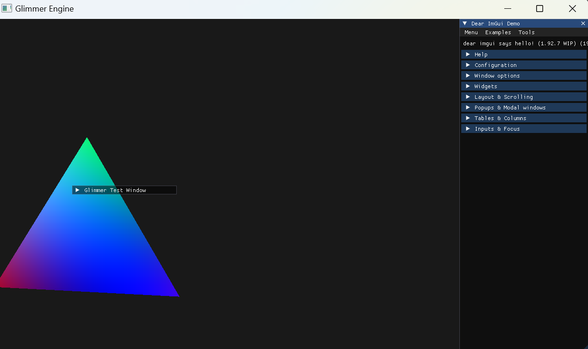

感觉比例好像变了？这是因为正交摄像机，**在没有加入摄像机之前，你的三角形是被拉伸的；加入摄像机后，它的比例才是正确的。**

重新修改顶点，以至于匹配正交摄像机后的画面

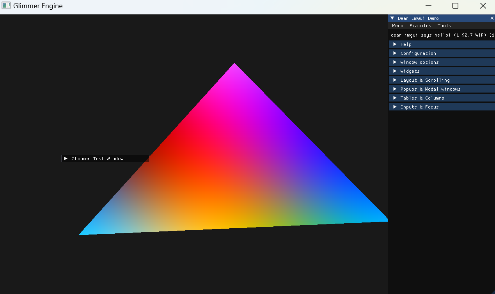 

## Timestep

引入时间步这一机制，首先要明白，什么是时间步？

我们之前也写过关于shader的时间u_Time

**运行总时间 (u_Time) 的职责**

你现在在 Shader 里写：sin(u_Time + v_Position.x)。

- **它的强项**：处理**周期性、持续性**的视觉效果。波浪起伏（水面、草地摆动）。颜色循环（彩虹特效）。纹理滚动（流光效果）。
- **为什么用它？** 因为显卡非常擅长计算数学函数。通过给它一个单增的时间值，它可以瞬间算出这一帧每一个像素应该在什么相位。

**时间步 (Timestep / DeltaTime) 的职责**

你在 Application::Run 算出的 timestep = time - lastFrameTime。

- **它的强项**：处理**位移、速度和变化率**。摄像机移动：pos += velocity * timestep。角色跳跃、物理模拟。
- **为什么用它？（帧率无关性）**如果你不用 timestep，直接 pos += 0.01f。在 60 帧的电脑上，每秒移动 0.6 单位。在 144 帧的电竞屏上，每秒移动 1.44 单位。**用了 timestep，无论电脑多快，大家每秒移动的距离都完全一样。**

**为什么不建议在 Shader 里用 Timestep 来累加时间？**

有些新手会想：我能不能每帧传一个 u_DeltaTime 给 Shader，让 Shader 内部自己加出一个总时间？
**答案：绝对不要这样做。**

- **精度灾难（Floating Point Drift）**：
  Shader 内部使用的是 float（单精度浮点数）。如果你每帧加一个很小的数（比如 0.016s），运行几十分钟后，浮点数的舍入误差会越来越大，导致你的彩虹特效开始闪烁、跳变甚至停滞。
- **CPU 的优势**：
  CPU 可以使用 double（双精度）甚至高精度的计时器来追踪总时间，然后在传给 Uniform 时转成 float。这样每一帧 Shader 拿到的都是一个经过校准的、绝对准确的时间点。

**创建 Timestep 包装类**

在 Glimmer/src/Glimmer/Core 下创建 Timestep.h。我们不直接用 float，而是封装一个类，这样可以方便地在秒和毫秒之间切换。

**文件路径：Glimmer/src/Glimmer/Core/Timestep.h**

```
#pragma once

namespace gl {

	class Timestep
	{
	public:
		Timestep(float time = 0.0f)
			: m_Time(time)
		{
		}

		// 允许像 float 一样直接使用： float s = ts;
		operator float() const { return m_Time; }

		float GetSeconds() const { return m_Time; }
		float GetMilliseconds() const { return m_Time * 1000.0f; }
	private:
		float m_Time;
	};

}
```

**修改 Layer.h 接口**

所有的图层更新都必须感知到时间的流逝。

**文件路径：Glimmer/src/Glimmer/Layer.h**

```
#include "Glimmer/Core/Timestep.h" // ✨ 包含头文件

namespace gl {
	class Layer {
	public:
		// ... 
		virtual void OnUpdate(Timestep ts) {} // ✨ 修改：增加参数
		// ...
	};
}
```

**在 Application 中计算 Delta Time**

我们需要在主循环中对比“这一帧的时间”和“上一帧的时间”。

**文件路径：Glimmer/src/Glimmer/Application.h**

```
private:
    // ... 其他成员 ...
    float m_LastFrameTime = 0.0f; // ✨ 记录上一帧的时间点
```

文件路径：**Glimmer/src/Glimmer/Application.cpp**

```
void Application::Run()
{
    while (m_Running)
    {
        // 1. ✨ 计算增量时间 (Delta Time)
        // glfwGetTime 返回的是从启动到现在的总秒数
        float time = (float)glfwGetTime(); 
        Timestep timestep = time - m_LastFrameTime;
        m_LastFrameTime = time;

        // 2. 渲染清屏
        RenderCommand::SetClearColor({ 0.1f, 0.1f, 0.1f, 1 });
        RenderCommand::Clear();

        // 3. 更新图层逻辑 (传入 timestep)
        for (Layer* layer : m_LayerStack)
            layer->OnUpdate(timestep);

        // 4. ImGui 渲染 (UI 通常不需要按 timestep 移动)
        m_ImGuiLayer->Begin();
        for (Layer* layer : m_LayerStack)
            layer->OnImGuiRender();
        m_ImGuiLayer->End();

        m_Window->OnUpdate();
    }
}
```

**在 Sandbox 中应用（真正解决移动问题）**

现在我们可以把摄像机的移动速度定义为 **“每秒移动多少单位”**，而不是“每帧移动多少”。

**修改 SandboxApp.cpp 里的 OnUpdate：**

```
void OnUpdate(gl::Timestep ts) override 
{
    // 定义移动速度：每秒 2.0 个世界单位
    float moveSpeed = 2.0f; 

    // ✨ 核心公式：位移 = 速度 * 时间
    // 无论帧率高低，相乘后的结果都能保证每一秒钟移动的距离是恒定的
    if (gl::Input::IsKeyPressed(GL_KEY_A))
        m_Camera->SetPosition(m_Camera->GetPosition() + glm::vec3(-moveSpeed * ts, 0, 0));
    else if (gl::Input::IsKeyPressed(GL_KEY_D))
        m_Camera->SetPosition(m_Camera->GetPosition() + glm::vec3(moveSpeed * ts, 0, 0));

    if (gl::Input::IsKeyPressed(GL_KEY_W))
        m_Camera->SetPosition(m_Camera->GetPosition() + glm::vec3(0, moveSpeed * ts, 0));
    else if (gl::Input::IsKeyPressed(GL_KEY_S))
        m_Camera->SetPosition(m_Camera->GetPosition() + glm::vec3(0, -moveSpeed * ts, 0));
}
```

同时，将Application中的渲染逻辑全部迁移

```
class ExampleLayer : public gl::Layer {
public:
    ExampleLayer() :Layer("Example"), m_Camera(-1.6f, 1.6f, -0.9f, 0.9f)
    {
        // 1. 创建顶点数组
        m_VertexArray.reset(gl::VertexArray::Create());

        // 2. 准备数据
        float vertices[3 * 3] = {
            -1.0f, -0.5f, 0.0f,
             1.0f, -0.5f, 0.0f,
             0.0f,  0.5f, 0.0f
        };

        std::shared_ptr<gl::VertexBuffer> vertexBuffer;
        vertexBuffer.reset(gl::VertexBuffer::Create(vertices, sizeof(vertices)));
// ... 同之前Application ...
```

并且修改u_Time

我们要在 Application 里提供一个统一的时间入口，让 Sandbox 能拿到时间，但不需要知道 GLFW 的存在。

**第一步：在 Application 中暴露时间接口**

修改 **Glimmer/src/Glimmer/Application.h** 和 **Application.cpp**：

```
// Application.h
public:
    // 供外部获取从引擎启动至今的总时间（秒）
    inline float GetTime() { return (float)glfwGetTime(); }

// ... 保持单例模式 ...
```

**第二步：在 Sandbox 中优雅地使用**

现在，**SandboxApp.cpp** 不再需要 #include <GLFW/glfw3.h>，也不需要改 Premake，直接找引擎要时间：

```
void ExampleLayer::OnUpdate(gl::Timestep ts) override {
    // ... 摄像机控制逻辑 ...

    // --- 渲染部分 ---
    gl::RenderCommand::SetClearColor({ 0.1f, 0.1f, 0.1f, 1 });
    gl::RenderCommand::Clear();

    gl::Renderer::BeginScene(m_Camera);

    m_Shader->Bind();
    
    // ✨ 重点：通过 Application 单例获取时间，彻底告别 GLFW
    float time = gl::Application::Get().GetTime();
    m_Shader->UploadUniformFloat("u_Time", time); 

    gl::Renderer::Submit(m_Shader, m_VertexArray);

    gl::Renderer::EndScene();
}
```

最终修复大大小小的简单报错，可以WASD移动，变色，动态顶点且在SandBox实现的三角形，诞生

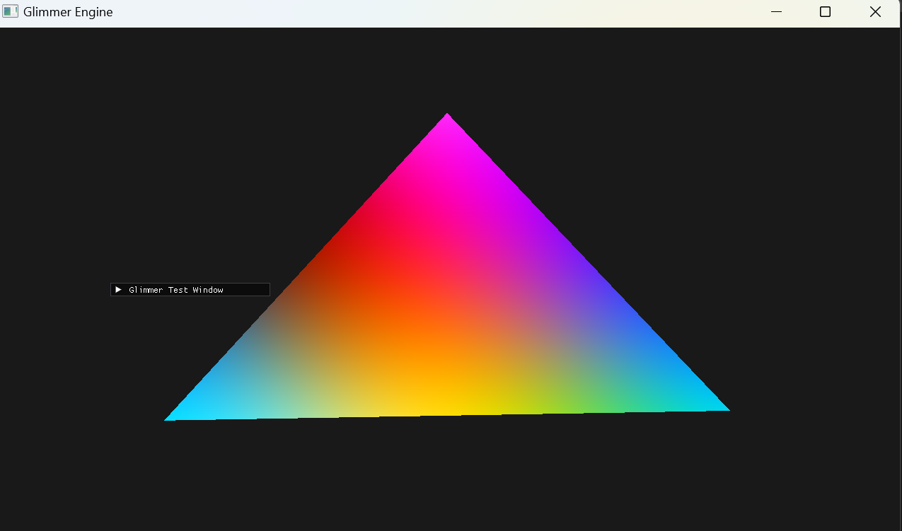

## 变换矩阵

这一步的作用是实现 **“物体级变换”**：让你可以通过代码让三角形（或正方形）在世界空间里**移动、旋转、缩放**，而不需要去动那块冰冷的顶点缓冲区

**修改 Shader 支持变换矩阵**

我们需要在顶点着色器中增加一个 u_Transform 变量。

**修改 SandboxApp.cpp 里的 vertexSrc：**

```
std::string vertexSrc = R"(
    #version 330 core
    
    layout(location = 0) in vec3 a_Position;

    uniform mat4 u_ViewProjection;
    uniform mat4 u_Transform; // ✨ 新增：模型变换矩阵

    out vec3 v_Position;
    uniform float u_Time;

    void main()
    {
        vec3 pos = a_Position;
        pos.y += sin(pos.x * 5.0 + u_Time) * 0.1;
        v_Position = pos;
        // ✨ 计算顺序：投影 * 视图 * 模型 * 原始坐标
        gl_Position = u_ViewProjection * u_Transform * vec4(pos, 1.0);
    }
)";
```

**升级渲染器接口 (Renderer.h/cpp)**

渲染器现在不仅要管摄像机，还要管每个物体的“位姿”。

**文件路径：Glimmer/src/Glimmer/Renderer/Renderer.h**

```
// 修改 Submit 函数签名，增加 transform 参数
static void Submit(const std::shared_ptr<Shader>& shader, 
                  const std::shared_ptr<VertexArray>& vertexArray, 
                  const glm::mat4& transform = glm::mat4(1.0f)); // ✨ 默认是单位矩阵
```

**Glimmer/src/Glimmer/Renderer/Renderer.cpp**

```
void Renderer::Submit(const std::shared_ptr<Shader>& shader, 
                     const std::shared_ptr<VertexArray>& vertexArray, 
                     const glm::mat4& transform)
{
    shader->Bind();
    // 1. 上传场景矩阵 (PV)
    shader->UploadUniformMat4("u_ViewProjection", s_SceneData->ViewProjectionMatrix);
    // 2. 上传物体变换矩阵 (M)
    shader->UploadUniformMat4("u_Transform", transform);

    vertexArray->Bind();
    RenderCommand::DrawIndexed(vertexArray);
}
```

**在 Sandbox 中画一个“正方形网格”**

现在我们要展示变换矩阵的威力。我们不再画三角形，而是画一个**正方形**，并且利用循环画出一堆小方块。

**修改 SandboxApp.cpp 构造函数（定义正方形）：**

```
// 1. 定义 4 个顶点
float vertices[4 * 3] = {
    -0.5f, -0.5f, 0.0f,
     0.5f, -0.5f, 0.0f,
     0.5f,  0.5f, 0.0f,
    -0.5f,  0.5f, 0.0f
};
// 2. 定义索引 (两个三角形拼成正方形)
uint32_t indices[6] = { 0, 1, 2, 2, 3, 0 };

// ... 初始化 vertexBuffer (Layout依然是 Float3) ...
// ... 初始化 m_VertexArray ...
```

**修改** **SandboxApp.cpp** **的** **OnUpdate**（动画逻辑）：

```
void OnUpdate(gl::Timestep ts) override {
    // ... 摄像机控制代码 ...

    gl::RenderCommand::SetClearColor({ 0.1f, 0.1f, 0.1f, 1 });
    gl::RenderCommand::Clear();

    gl::Renderer::BeginScene(m_Camera);

    // ✨ 准备一个基础的比例矩阵（让方块变小一点）
    glm::mat4 scale = glm::scale(glm::mat4(1.0f), glm::vec3(0.1f));

    m_Shader->Bind();
    m_Shader->UploadUniformFloat("u_Time", gl::Application::Get().GetTime());

    // ✨ 渲染一个 20x20 的方块阵列
    for (int y = 0; y < 20; y++) {
        for (int x = 0; x < 20; x++) {
            // 计算每个方块的位置
            glm::vec3 pos(x * 0.11f, y * 0.11f, 0.0f);
            glm::mat4 transform = glm::translate(glm::mat4(1.0f), pos) * scale;
            
            // 提交给渲染器，每个方块用不同的 transform
            gl::Renderer::Submit(m_Shader, m_VertexArray, transform);
        }
    }

    gl::Renderer::EndScene();
}
```

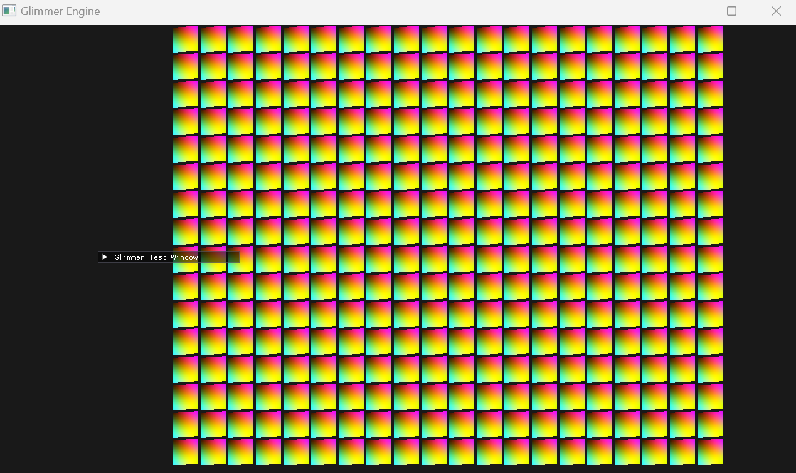

给每个方块加一点旋转:

```
float time = gl::Application::Get().GetTime();

for (int y = 0; y < 20; y++) {
    for (int x = 0; x < 20; x++) {
        glm::vec3 pos(x * 0.11f, y * 0.11f, 0.0f);
        
        // ✨ 让每个方块根据位置和时间，产生不同的旋转角度
        float rotation = time * 20.0f + (x + y) * 10.0f;
        
        glm::mat4 transform = glm::translate(glm::mat4(1.0f), pos) * 
                             glm::rotate(glm::mat4(1.0f), glm::radians(rotation), {0, 0, 1}) * 
                             scale;
        
        gl::Renderer::Submit(m_Shader, m_VertexArray, transform);
    }
}
```

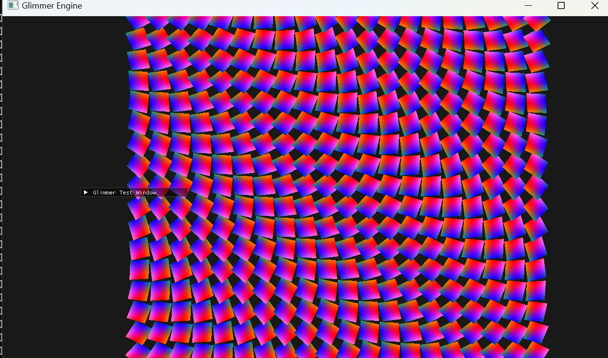

## 纹理

加入纹理（Texture）是引擎开发从“简笔画”向“真实画面”跨越的关键一步。

为了实现纹理，我们需要：

1. **图像加载库**：引入 stb_image（工业标准）。
2. **纹理抽象层**：定义 Texture 和 Texture2D 接口。
3. **OpenGL 实现**：编写 OpenGLTexture2D 类。
4. **管线升级**：让顶点数据支持 **UV 坐标**，并在 Shader 里使用采样器。

**集成图像加载库 stb_image**

stb_image 是一个极其轻量级的纯头文件 C 库。

1. **下载**：前往 [stb_image.h](https://github.com/nothings/stb/blob/master/stb_image.h) 下载该文件。

2. **物理存放**：放入 Glimmer/vendor/stb_image 目录下。

3. **实现文件**：在同目录下创建一个 stb_image.cpp（这是 C 库的要求）：

   ```
   #include "glpch.h"
   
   #define STB_IMAGE_IMPLEMENTATION
   #include "stb_image.h"
   ```

4. **修改 Premake**：将 vendor/stb_image 加入包含路径，并把这个 .cpp 编译进项目。

**定义纹理接口 (Texture.h)**

**文件路径：Glimmer/src/Glimmer/Renderer/Texture.h**

```
#pragma once
#include <string>
#include "Glimmer/Core.h"

namespace gl {

	class Texture
	{
	public:
		virtual ~Texture() = default;

		virtual uint32_t GetWidth() const = 0;
		virtual uint32_t GetHeight() const = 0;

		// slot 代表纹理单元（0-31），显卡可以同时绑定多个纹理
		virtual void Bind(uint32_t slot = 0) const = 0;
	};

	class Texture2D : public Texture
	{
	public:
		// 静态工厂方法，传入图片路径创建纹理
		static std::shared_ptr<Texture2D> Create(const std::string& path);
	};

}
```

**实现工厂方法 (Texture.cpp)**

**文件作用**：根据当前选用的图形 API（目前只有 OpenGL），返回具体的对象实例。
**Glimmer/src/Glimmer/Renderer/Texture.cpp**：

```
#include "glpch.h"
#include "Texture.h"

#include "Platform/OpenGL/OpenGLTexture2D.h"
#include "Glimmer/Renderer/Renderer.h"

namespace gl {

	std::shared_ptr<Texture2D> Texture2D::Create(const std::string& path)
	{
		// 以后这里可以根据 Renderer::GetAPI() 进行分支切换
		return std::make_shared<OpenGLTexture2D>(path);
	}

}
```

**实现 OpenGL 版本的纹理类**

这里是真正与显卡和驱动打交道的地方。

**文件路径说明**：

- .h 负责定义 OpenGL 专属的私有变量（如 m_RendererID）。
- .cpp 负责加载图片、配置显卡过滤参数、上传像素数据。

**Glimmer/src/Platform/OpenGL/OpenGLTexture2D.h**：

```
#pragma once
#include "Glimmer/Renderer/Texture.h"

namespace gl {

	class OpenGLTexture2D : public Texture2D
	{
	public:
		OpenGLTexture2D(const std::string& path);
		virtual ~OpenGLTexture2D();

		virtual uint32_t GetWidth() const override { return m_Width; }
		virtual uint32_t GetHeight() const override { return m_Height; }

		virtual void Bind(uint32_t slot = 0) const override;
	private:
		std::string m_Path;
		uint32_t m_Width, m_Height;
		uint32_t m_RendererID; // GPU 端的资源 ID
	};

}
```

**Glimmer/src/Platform/OpenGL/OpenGLTexture2D.cpp**：

这个类在构造时先通过 `stb_image` 从硬盘读取图片数据，然后根据图片通道数选择合适的 OpenGL 格式（RGB/RGBA），接着在 GPU 中创建纹理对象并分配显存，通过 `glTexImage2D` 把像素数据上传到显卡，最后设置采样方式（过滤），这样这张图片就变成了可以在 Shader 中使用的纹理；`Bind` 函数则负责把这个纹理绑定到指定的纹理槽位，供渲染时采样使用。

**升级 Sandbox 渲染管线 (支持 UV)**

要显示贴图，你的顶点必须知道图片上的哪个点对应模型上的哪个点（UV 坐标）。

**修改 Sandbox 顶点数据**：

```
float vertices[4 * 5] = {
    // X, Y, Z          // U, V (0-1范围)
    -0.5f, -0.5f, 0.0f,  0.0f, 0.0f, // 左下
     0.5f, -0.5f, 0.0f,  1.0f, 0.0f, // 右下
     0.5f,  0.5f, 0.0f,  1.0f, 1.0f, // 右上
    -0.5f,  0.5f, 0.0f,  0.0f, 1.0f  // 左上
};
```

**更新布局 (Layout)**：

```
vertexBuffer->SetLayout({
    { gl::ShaderDataType::Float3, "a_Position" },
    { gl::ShaderDataType::Float2, "a_TexCoord" } // 👈 新增 UV 属性
});
```

**更新 Shader 代码**：

```
// 顶点着色器
layout(location = 1) in vec2 a_TexCoord; 
out vec2 v_TexCoord;
void main() {
    v_TexCoord = a_TexCoord;
    gl_Position = u_ViewProjection * u_Transform * vec4(a_Position, 1.0);
}

// 片元着色器
uniform sampler2D u_Texture; // 👈 采样器
void main() {
    color = texture(u_Texture, v_TexCoord);
}
```

之后更换相关变量，并加入

```
    m_TextureShader.reset(gl::Shader::Create(vertexSrc, fragmentSrc));
    m_Texture = gl::Texture2D::Create("assets/textures/Henry.jpg");

    std::dynamic_pointer_cast<gl::OpenGLShader>(m_TextureShader)->Bind();
    std::dynamic_pointer_cast<gl::OpenGLShader>(m_TextureShader)->UploadUniformInt("u_Texture", 0);
```

若要混合颜色和纹理，将两者相乘

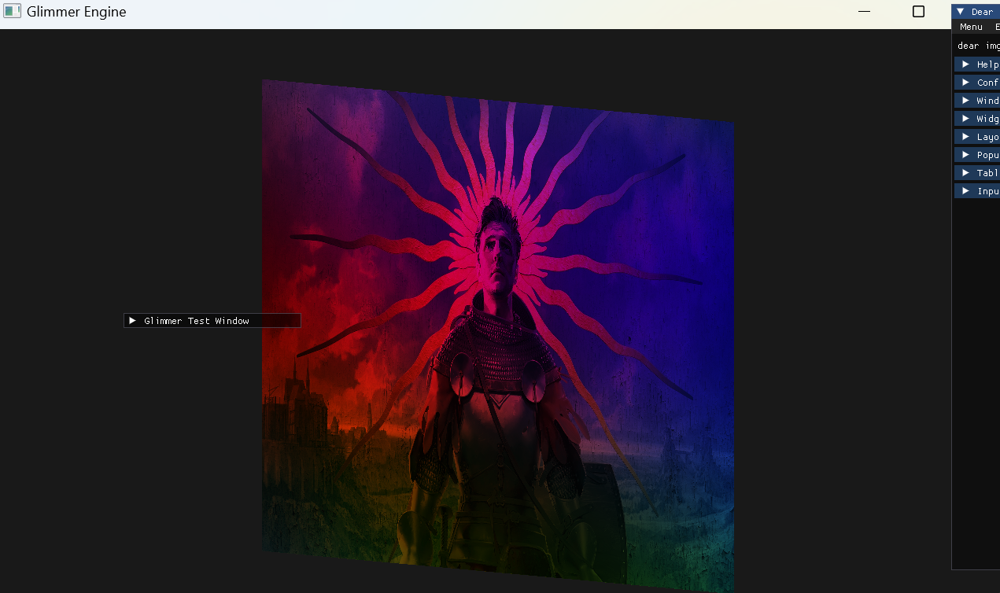

## Alpha 混合

现在加载的纹理，如果是透明的 .png 图片（比如一个带圆角的按钮或一个角色小人），你会发现透明的地方变成了**纯黑色**。
这是因为 OpenGL 默认是直接“覆盖”像素的。你需要告诉显卡：请根据图片的 Alpha 通道进行混合。

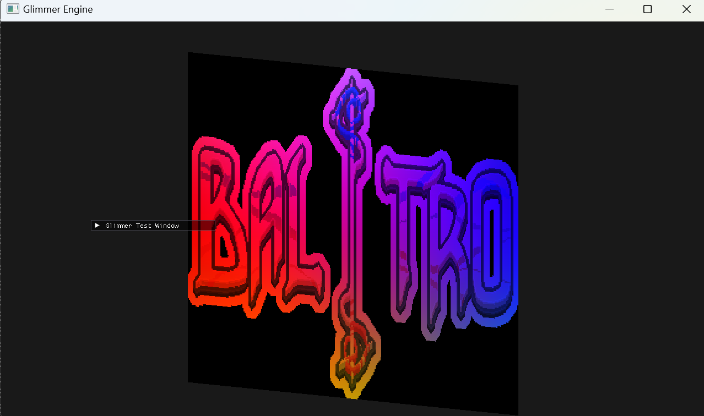

在 OpenGLRendererAPI.cpp 的 Init 函数中加入：

```
glEnable(GL_BLEND);
glBlendFunc(GL_SRC_ALPHA, GL_ONE_MINUS_SRC_ALPHA);
```

并在下列文件声明Init()函数

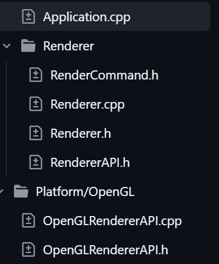

最后在Application启用

```
Renderer::Init();
```

如今的png透明已经去除黑边

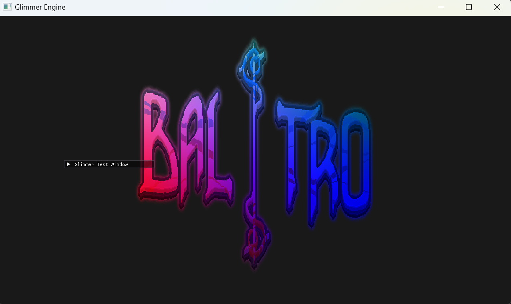

## 单文件多着色器模式

将 Shader 从 C++ 字符串搬迁到外部文件（.glsl 或 .hlsl）是引擎开发的必经之路。这不仅能让代码更整洁，还能让你利用 VS Code 等工具的插件实现 **GLSL 语法高亮**。

我们将实现一种**“单文件多着色器”**模式：即一个 .glsl 文件里同时包含顶点（Vertex）和片元（Fragment）代码，通过特殊的标签（如 #type vertex）来区分。

**准备外部 Shader 文件**

在你的项目目录下创建 assets/shaders/Texture.glsl 文件，内容如下：

**assets/shaders/Texture.glsl**:

```
#type vertex
#version 330 core

layout(location = 0) in vec3 a_Position;
layout(location = 1) in vec2 a_TexCoord;

uniform mat4 u_ViewProjection;
uniform mat4 u_Transform;
uniform float u_Time;

out vec3 v_Position;
out vec2 v_TexCoord;

void main()
{
    v_TexCoord = a_TexCoord;
    vec3 pos = a_Position;
    pos.y += sin(pos.x * 5.0 + u_Time) * 0.1;
    v_Position = pos;
    gl_Position = u_ViewProjection * u_Transform * vec4(pos, 1.0);
}

#type fragment
#version 330 core

layout(location = 0) out vec4 color;

in vec3 v_Position;
in vec2 v_TexCoord;

uniform sampler2D u_Texture;
uniform float u_Time;

void main()
{
    vec3 col;
    // 使用三角函数让 R, G, B 三个通道随位置和时间发生不同的相位偏移
    col.r = sin(v_Position.x * 3.0 + u_Time) * 0.5 + 0.5;
    col.g = sin(v_Position.y * 3.0 + u_Time + 2.0) * 0.5 + 0.5;
    col.b = sin((v_Position.x + v_Position.y) * 3.0 + u_Time + 4.0) * 0.5 + 0.5;
    color = vec4(col, 1.0);
    color *= texture(u_Texture, v_TexCoord);
}
```

**扩展 Shader.h 接口**

我们需要增加一个接收“文件路径”的工厂方法。

**Glimmer/src/Glimmer/Renderer/Shader.h**:

```
static Shader* Create(const std::string& filepath);
```

```
	Shader* Shader::Create(const std::string& filepath)
	{
		return new OpenGLShader(filepath);
	}
```

**在 OpenGLShader 中实现文件读取与解析**

我们需要增加两个核心私有方法：ReadFile（读文件）和 PreProcess（解析标签）。

**Glimmer/src/Platform/OpenGL/OpenGLShader.h**:

```
class OpenGLShader : public Shader {
public:
    OpenGLShader(const std::string& filepath); // ✨ 新构造函数
    // ...
private:
    std::string ReadFile(const std::string& filepath);
    std::unordered_map<GLenum, std::string> PreProcess(const std::string& source);
    void Compile(const std::unordered_map<GLenum, std::string>& shaderSources);
private:
    uint32_t m_RendererID;
    std::string m_Name; // 用于 Shader 库标识
};
```

核心分割算法：**把一个“合并写在一起的 shader 文件”，按 `#type` 标签拆分成多个独立的着色器源码（vertex / fragment）**，并用 `unordered_map` 存起来，方便后续编译。

函数一开始创建了一个 `unordered_map<GLenum, std::string>`，用于存储“着色器类型 → 对应源码”的映射关系，比如：

```
GL_VERTEX_SHADER   -> 顶点着色器源码
GL_FRAGMENT_SHADER -> 片元着色器源码
```

接着它在整段字符串 `source` 里查找 `#type` 这个标记（比如 `#type vertex`），一旦找到，就说明接下来是一段新的 shader。它先找到这一行的结尾（`\n`），然后从 `#type` 后面截取出类型字符串（例如 `"vertex"` 或 `"fragment"`），再通过 `ShaderTypeFromString` 转换成 OpenGL 能识别的枚举（如 `GL_VERTEX_SHADER`）。

然后关键来了：它会找到**下一行真正 shader 代码开始的位置**，并继续往后找下一个 `#type`，这样就可以确定“当前 shader 代码的范围”，最后用 `substr` 把这一段源码切出来，存进 map 里。

这个过程会循环执行，直到把整个文件里的所有 shader 都拆完。

```
	std::unordered_map<GLenum, std::string> OpenGLShader::PreProcess(const std::string& source)
	{
		std::unordered_map<GLenum, std::string> shaderSources;

		const char* typeToken = "#type";
		size_t typeTokenLength = strlen(typeToken);
		size_t pos = source.find(typeToken, 0);
		while (pos != std::string::npos)
		{
			size_t eol = source.find_first_of("\r\n", pos);
			GL_CORE_ASSERT(eol != std::string::npos, "Syntax error");
			size_t begin = pos + typeTokenLength + 1;
			std::string type = source.substr(begin, eol - begin);
			GL_CORE_ASSERT(ShaderTypeFromString(type), "Invalid shader type specified");

			size_t nextLinePos = source.find_first_not_of("\r\n", eol);
			pos = source.find(typeToken, nextLinePos);
			shaderSources[ShaderTypeFromString(type)] = source.substr(nextLinePos, pos - (nextLinePos == std::string::npos ? source.size() - 1 : nextLinePos));
		}

		return shaderSources;
	}
```

```
	static GLenum ShaderTypeFromString(const std::string& type)
	{
		if (type == "vertex") return GL_VERTEX_SHADER;
		if (type == "fragment" || type == "pixel") return GL_FRAGMENT_SHADER;

		GL_CORE_ASSERT(false, "Unknown shader type!");
		return 0;
	}
```

**制作新shader：小丑牌背景**

要实现那种“红蓝颜料交替的黏稠漩涡感”，我们需要在 Fragment Shader 中完成以下逻辑：

1. **坐标归一化**：将 UV 映射到中心点。
2. **极坐标转换**：将直角坐标转为角度和半径，实现基础旋转。
3. **多层噪声 (FBM)**：制造不规则的颜料团块感。
4. **领域扭曲**：用噪声去偏移噪声的坐标，产生“液体搅拌”的效果。

```
#type vertex
#version 330 core

layout(location = 0) in vec3 a_Position;
uniform mat4 u_ViewProjection;
uniform mat4 u_Transform;

out vec2 v_Position;

void main()
{
	v_Position = a_Position.xy;
	gl_Position = u_ViewProjection * u_Transform * vec4(a_Position, 1.0);
}

#type fragment
#version 330 core

layout(location = 0) out vec4 color;
in vec2 v_Position;

uniform float u_Time;

// 基础噪声函数：制造随机感
float hash(vec2 p) {
	p = fract(p * vec2(123.34, 456.21));
	p += dot(p, p + 45.32);
	return fract(p.x * p.y);
}

// 简单的平滑噪声
float noise(vec2 p) {
	vec2 i = floor(p);
	vec2 f = fract(p);
	float a = hash(i);
	float b = hash(i + vec2(1.0, 0.0));
	float c = hash(i + vec2(0.0, 1.0));
	float d = hash(i + vec2(1.0, 1.0));
	vec2 u = f * f * (3.0 - 2.0 * f);
	return mix(a, b, u.x) + (c - a) * u.y * (1.0 - u.x) + (d - b) * u.x * u.y;
}

// 分形布朗运动 (FBM)：叠加强度不同的噪声，产生细节
float fbm(vec2 p) {
	float v = 0.0;
	float a = 0.5;
	mat2 rot = mat2(1.6, 1.2, -1.2, 1.6); // 每一层旋转一下，打乱方向
	for (int i = 0; i < 5; i++) {
		v += a * noise(p);
		p = rot * p * 2.0;
		a *= 0.5;
	}
	return v;
}

void main()
{
	vec2 uv = v_Position; // 假设传入的是 -0.5 到 0.5 的坐标

	// 1. 基础极坐标变换 (产生漩涡核心)
	float r = length(uv);
	float angle = atan(uv.y, uv.x);

	// 2. 漩涡扭曲：距离中心越近，旋转越快
	// u_Time 控制总速度，1.0/r 产生漩涡拉扯
	float strength = 1.5;
	float swirl = angle + (strength / (r + 0.15)) * (u_Time * 0.5);

	// 3. 领域扭曲 (Domain Warping)：让颜料看起来“不规则”的关键
	// 我们用 FBM 产生的数值去偏移坐标
	vec2 warpUV = vec2(cos(swirl) * r, sin(swirl) * r);
	float n = fbm(warpUV * 3.0 + u_Time * 0.2);

	float m = fbm(warpUV * 2.0 + n + u_Time * 0.1);

	// 4. 颜色调色板 (经典的红蓝交替)
	vec3 colorRed = vec3(0.8, 0.1, 0.2);   // 深红
	vec3 colorBlue = vec3(0.1, 0.2, 0.7);  // 深蓝
	vec3 colorHighlight = vec3(0.9, 0.8, 1.0); // 亮色边缘

	// 用最终的噪声值 m 来在红蓝之间混合
	vec3 finalCol = mix(colorRed, colorBlue, m);

	// 叠加一些高光效果，增加颜料的质感
	finalCol += smoothstep(0.7, 1.0, m) * 0.3;

	// 边缘暗角处理
	finalCol *= smoothstep(1.5, 0.3, r);

	color = vec4(finalCol, 1.0);
}
```

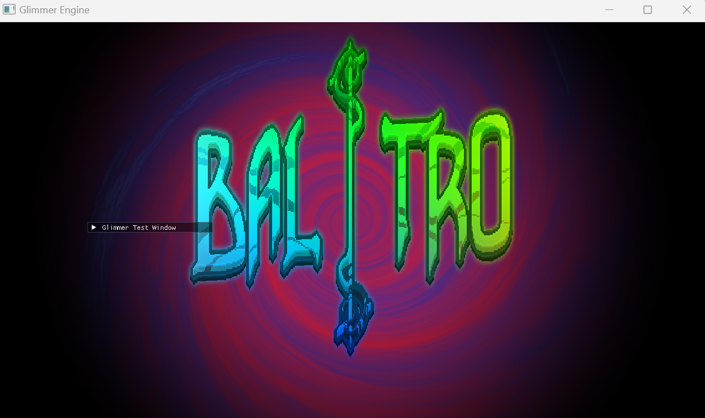

通过解包小丑牌的源代码发现，原效果用到了`uniform float u_VortexAmt; // 对应 vortex_amt 强度`这种的思路，所以需要通过时间来获取强度变化

```
    // ✨ 重点：让扭曲强度随时间正弦波动 (从 -2 到 2 循环拧)
    float vortexStrength = sin(time) * 2.0f; 
    m_VortexShader->UploadUniformFloat("u_VortexAmt", vortexStrength);
```

```
void main()
{
	// 1. 获取基础坐标 (假设 v_Position 是相对于中心的)
	vec2 uv = v_Position;
	float r = length(uv);
	float angle = atan(uv.y, uv.x);

	// 2. 融合：第二段代码的 Smoothstep 扭曲逻辑
	// 控制旋转半径和角度
	float effectRadius = 2.0;
	float twist = u_VortexAmt * smoothstep(effectRadius, 0.0, r);

	// 3. 加入“不规则正弦”效果 (波浪抖动)
	// 利用 sin 让漩涡边缘产生不规则的起伏
	float wobble = sin(r * 10.0 - u_Time * 2.0) * 0.05;

	// 最终角度 = 原始角度 + 强度扭曲 + 动态旋转 + 波浪抖动
	float finalAngle = angle + twist + (u_Time * 0.2) + wobble;

	// 4. 将扭曲后的极坐标转回平面坐标，作为颜料噪声的输入
	vec2 twistedUV = vec2(cos(finalAngle), sin(finalAngle)) * r;

	// 5. 领域扭曲 (Balatro 核心颜料算法)
	float n = fbm(twistedUV * 3.0 + u_Time * 0.1);
	float m = fbm(twistedUV * 2.0 + n + u_Time * 0.05);

	// 6. 颜色混合 (红蓝艺术配色)
	vec3 colorRed = vec3(0.85, 0.15, 0.2);   // 鲜亮红
	vec3 colorBlue = vec3(0.1, 0.25, 0.75);  // 宝石蓝
	vec3 darkColor = vec3(0.1, 0.05, 0.15);
	vec3 darkRed = vec3(0.2, 0.0, 0.0);   // 偏黑红
	vec3 darkBlue = vec3(0.0, 0.0, 0.2);  // 偏黑蓝
	vec3 darkGreen = vec3(0.0, 0.2, 0.0); // 偏黑绿
	vec3 deepBlue = vec3(0.05, 0.05, 0.3); // 深蓝，略带一点暗

	// 用最终噪声值 m 混合，并加入高光亮边
	vec3 finalCol = mix(colorRed, colorBlue, m);
	finalCol += smoothstep(0.75, 1.0, m) * 0.25; // 增加白色颜料反光

	// 7. 边缘压暗 (Vignette)
	finalCol *= smoothstep(1.8, 0.5, r);

	color = vec4(finalCol, 1.0);
}
```

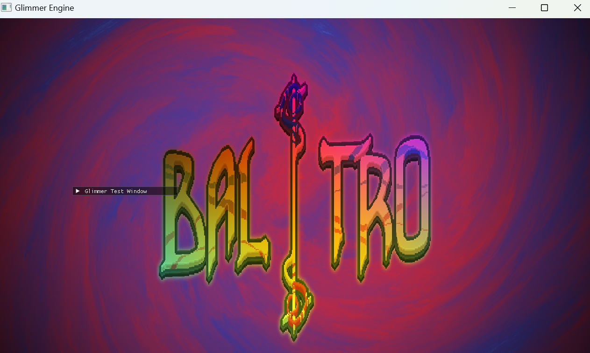

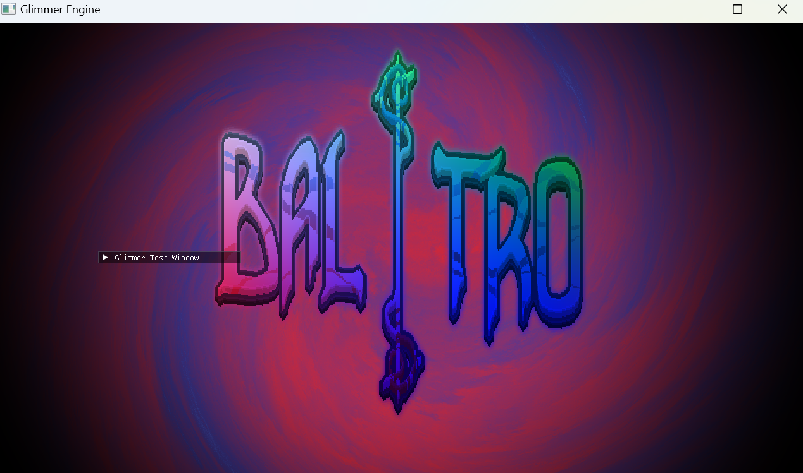

对比了下游戏效果感觉差远了，特意从shadertoy上扒了大手子复刻的源码进行Glimmer的适配，并学习实现步骤

```
#type vertex
#version 330 core

layout(location = 0) in vec3 a_Position;
uniform mat4 u_ViewProjection;
uniform mat4 u_Transform;

void main()
{
    gl_Position = u_ViewProjection * u_Transform * vec4(a_Position, 1.0);
}

#type fragment
#version 330 core

layout(location = 0) out vec4 color;

uniform float u_Time;
uniform vec2 u_Resolution;

// --- 原版配置参数 ---
#define SPIN_ROTATION -2.0
#define SPIN_SPEED 7.0
#define OFFSET vec2(0.0)
#define COLOUR_1 vec4(0.871, 0.267, 0.231, 1.0)
#define COLOUR_2 vec4(0.0, 0.42, 0.706, 1.0)
#define COLOUR_3 vec4(0.086, 0.137, 0.145, 1.0)
#define CONTRAST 3.5
#define LIGTHING 0.4
#define SPIN_AMOUNT 0.25
#define PIXEL_FILTER 745.0
#define SPIN_EASE 1.0
#define IS_ROTATE false
#define PI 3.14159265359

vec4 effect(vec2 screenSize, vec2 screen_coords) {
    // 1. 像素化逻辑：产生小丑牌特有的复古感
    float pixel_size = length(screenSize.xy) / PIXEL_FILTER;
    vec2 uv = (floor(screen_coords.xy * (1./pixel_size)) * pixel_size - 0.5 * screenSize.xy) / length(screenSize.xy) - OFFSET;
    float uv_len = length(uv);
    
    // 2. 旋转逻辑
    float speed = (SPIN_ROTATION * SPIN_EASE * 0.2);
    if(IS_ROTATE){
       speed = u_Time * speed;
    }
    speed += 302.2;
    float new_pixel_angle = atan(uv.y, uv.x) + speed - SPIN_EASE * 20. * (1. * SPIN_AMOUNT * uv_len + (1. - 1. * SPIN_AMOUNT));
    vec2 mid = (screenSize.xy / length(screenSize.xy)) / 2.;
    uv = (vec2((uv_len * cos(new_pixel_angle) + mid.x), (uv_len * sin(new_pixel_angle) + mid.y)) - mid);
    
    // 3. 核心扰动循环：产生黏稠的液体感
    uv *= 30.;
    float time_speed = u_Time * (SPIN_SPEED);
    vec2 uv2 = vec2(uv.x + uv.y);
    
    for(int i=0; i < 5; i++) {
        uv2 += sin(max(uv.x, uv.y)) + uv;
        uv  += 0.5 * vec2(cos(5.1123314 + 0.353 * uv2.y + time_speed * 0.131121), sin(uv2.x - 0.113 * time_speed));
        uv  -= 1.0 * cos(uv.x + uv.y) - 1.0 * sin(uv.x * 0.711 - uv.y);
    }
    
    // 4. 颜色与光照计算
    float contrast_mod = (0.25 * CONTRAST + 0.5 * SPIN_AMOUNT + 1.2);
    float paint_res = min(2., max(0., length(uv) * (0.035) * contrast_mod));
    float c1p = max(0., 1. - contrast_mod * abs(1. - paint_res));
    float c2p = max(0., 1. - contrast_mod * abs(paint_res));
    float c3p = 1. - min(1., c1p + c2p);
    float light = (LIGTHING - 0.2) * max(c1p * 5. - 4., 0.) + LIGTHING * max(c2p * 5. - 4., 0.);
    
    return (0.3 / CONTRAST) * COLOUR_1 + (1. - 0.3 / CONTRAST) * (COLOUR_1 * c1p + COLOUR_2 * c2p + vec4(c3p * COLOUR_3.rgb, c3p * COLOUR_1.a)) + light;
}

void main() {
    // 使用内置 gl_FragCoord 配合 u_Resolution 还原 Shadertoy 的渲染环境
    color = effect(u_Resolution, gl_FragCoord.xy);
}
```

这段 shader 的整体思路可以概括为：**把屏幕空间的像素坐标（gl_FragCoord）转成一个“可操作的 UV 空间”，然后通过“像素化 → 极坐标旋转 → 多次扰动 → 颜色混合”这一连串变换，生成一种动态的流体/漩涡视觉效果**。具体来说，先利用 `u_Resolution` 把屏幕坐标归一化并做一次 `floor` 量化，制造出复古的“像素块”质感；接着把 UV 转成极坐标（用 `atan` 和长度），在角度上叠加一个与半径相关的旋转偏移，从而形成整体的旋转/扭曲结构；然后进入核心的 for 循环，通过多次 sin/cos 非线性扰动不断“搅动”坐标，让原本规则的空间变得像流体一样粘稠、混乱，这一步是视觉复杂度的来源；最后根据扰动后的坐标长度计算权重（c1p、c2p、c3p），在三种预设颜色之间做混合，并叠加一点类似高光的亮度计算，从而得到具有层次感的红蓝主色调效果，最终输出到屏幕上。

## 着色器库

加入 **ShaderLibrary（着色器库）** 是引擎资源管理系统的开端。

目前，在 ExampleLayer 的构造函数里手动 reset 每一个 Shader，这会导致：

1. **代码臃肿**：加载 10 个 Shader 就要写 10 行几乎重复的代码。
2. **内存浪费**：如果两个图层都用到同一个 Shader，你会重复加载并编译两次。
3. **管理困难**：你必须时刻持有 Shader 的指针才能使用它。

**ShaderLibrary 的目标**：让你通过 m_ShaderLib.Get("Balatro") 这种字符串方式，随时随地在任何地方调用已加载的资源。

**修改 Shader.h 接口**

为了让库能识别 Shader，我们需要给 Shader 增加一个“名字”属性。

**Glimmer/src/Glimmer/Renderer/Shader.h**:

```
namespace gl {
    class Shader {
    public:
        virtual ~Shader() = default;
        // ... 原有虚函数 ...

        // ✨ 新增：获取 Shader 名字
        virtual const std::string& GetName() const = 0;

        static Ref<Shader> Create(const std::string& filepath);
        static Ref<Shader> Create(const std::string& name, const std::string& vertexSrc, const std::string& fragmentSrc);
    };

    // ✨ 新增：ShaderLibrary 类
    class ShaderLibrary {
    public:
        // 手动添加已创建的 Shader 对象
        void Add(const std::string& name, const Ref<Shader>& shader);
        void Add(const Ref<Shader>& shader);

        // 直接从文件加载并存入库
        Ref<Shader> Load(const std::string& filepath);
        Ref<Shader> Load(const std::string& name, const std::string& filepath);

        // 获取资源
        Ref<Shader> Get(const std::string& name);

        bool Exists(const std::string& name) const;
    private:
        std::unordered_map<std::string, Ref<Shader>> m_Shaders;
    };
}
```

**修改 OpenGLShader 记录名字**

确保 m_Name 在构造时被正确赋值（我们在之前的“文件读取”步骤中已经预留了此逻辑）。

**Glimmer/src/Platform/OpenGL/OpenGLShader.h**:

```
class OpenGLShader : public Shader {
public:
    // ...
    virtual const std::string& GetName() const override { return m_Name; }
private:
    std::string m_Name;
    uint32_t m_RendererID;
};
```

cpp构造函数

```
	OpenGLShader::OpenGLShader(const std::string& filepath)
	{
		std::string source = ReadFile(filepath);
		auto shaderSources = PreProcess(source);
		Compile(shaderSources);

		// Extract name from filepath
		auto lastSlash = filepath.find_last_of("/\\");
		lastSlash = lastSlash == std::string::npos ? 0 : lastSlash + 1;
		auto lastDot = filepath.rfind('.');
		auto count = lastDot == std::string::npos ? filepath.size() - lastSlash : lastDot - lastSlash;
		m_Name = filepath.substr(lastSlash, count);
	}
```

**实现 ShaderLibrary 逻辑**

**Glimmer/src/Glimmer/Renderer/Shader.cpp** (在文件末尾添加)：函数实现

修改Create

```
	Ref<Shader> Shader::Create(const std::string& filepath)
	{
		return std::make_shared<OpenGLShader>(filepath);
	}

	Ref<Shader> Shader::Create(const std::string& name, const std::string& vertexSrc, const std::string& fragmentSrc)
	{
		return std::make_shared<OpenGLShader>(name, vertexSrc, fragmentSrc);
    }
```

以及其余函数逻辑

```
	// --- ShaderLibrary 实现 ---

	void ShaderLibrary::Add(const std::string& name, const Ref<Shader>& shader)
	{
		GL_CORE_ASSERT(!Exists(name), "Shader already exists!");
		m_Shaders[name] = shader;
	}

	void ShaderLibrary::Add(const Ref<Shader>& shader)
	{
		auto& name = shader->GetName();
		Add(name, shader);
	}
	// 。。。
```

**在 Sandbox 中优雅地重构**

现在，你的 ExampleLayer 构造函数和渲染逻辑会变得极其干净。

**SandboxApp.cpp**:

```
class ExampleLayer : public gl::Layer {
public:
    ExampleLayer() : Layer("Example")
    {
        // ✨ 批量加载，不需要自己管理指针了
        m_ShaderLib.Load("assets/shaders/Texture.glsl");
        m_ShaderLib.Load("assets/shaders/BalatroVortex.glsl");
        m_ShaderLib.Load("assets/shaders/Octgrams.glsl");
        
        m_Texture = gl::Texture2D::Create("assets/textures/Balatro.png");
    }

    void OnUpdate(gl::Timestep ts) override {
        // ... 
        
        // ✨ 使用时直接通过名字取
        auto textureShader = m_ShaderLib.Get("Texture");
        textureShader->Bind();
        m_Texture->Bind();
        gl::Renderer::Submit(textureShader, m_VertexArray);
        
        // 如果想换背景，一句话切换
        auto bgShader = m_ShaderLib.Get("BalatroVortex");
        gl::Renderer::Submit(bgShader, m_bg_vortexVertexArray);
    }

private:
    gl::ShaderLibrary m_ShaderLib; // ✨ 库对象
    gl::Ref<gl::VertexArray> m_VertexArray;
    gl::Ref<gl::Texture2D> m_Texture;
    // ... 不再需要定义一堆 m_Shader1, m_Shader2 ...
};
```

清理Sandbox多余注释

## 正交摄像机控制器

加入 **OrthographicCameraController（正交摄像机控制器）** 是为了将“摄像机硬件”与“用户交互”彻底解耦。

**现状**：你之前的 WASD 逻辑写在 ExampleLayer 里。如果以后有多个关卡或编辑器模式，你需要重复写这些逻辑，且窗口拉伸时画面会变形。
**目标**：封装一个控制器，让它自动处理 **移动、旋转、缩放（滚轮）** 以及 **分辨率自适应**。

**第一步：创建控制器类 (OrthographicCameraController.h/cpp)**

这个类将包裹 OrthographicCamera，并负责监听事件。

**文件路径：Glimmer/src/Glimmer/Renderer/OrthographicCameraController.h**

```
#pragma once

#include "Glimmer/Renderer/OrthographicCamera.h"
#include "Glimmer/Core/Timestep.h"

#include "Glimmer/Events/ApplicationEvent.h"
#include "Glimmer/Events/MouseEvent.h"

namespace gl {

	class OrthographicCameraController
	{
	public:
		OrthographicCameraController(float aspectRatio, bool rotation = false);

		void OnUpdate(Timestep ts);
		void OnEvent(Event& e);

		OrthographicCamera& GetCamera() { return m_Camera; }
		const OrthographicCamera& GetCamera() const { return m_Camera; }

		float GetZoomLevel() const { return m_ZoomLevel; }
		void SetZoomLevel(float level) { m_ZoomLevel = level; CalculateView(); }
	private:
		bool OnMouseScrolled(MouseScrolledEvent& e);
		bool OnWindowResized(WindowResizeEvent& e);
		void CalculateView();
	private:
		float m_AspectRatio;
		float m_ZoomLevel = 1.0f;
		OrthographicCamera m_Camera;

		bool m_Rotation;
		glm::vec3 m_CameraPosition = { 0.0f, 0.0f, 0.0f };
		float m_CameraRotation = 0.0f; // 角度单位
		float m_CameraTranslationSpeed = 5.0f, m_CameraRotationSpeed = 180.0f;
	};

}
```

cpp负责“根据输入实时更新相机的 Position / Rotation / Projection”，从而控制你看到的画面（移动、旋转、缩放、窗口自适应）

整个类本质是一个“相机驱动器”：在 `OnUpdate` 里读取键盘输入（WASD 控平移，QE 控旋转），不断修改 `m_CameraPosition` 和 `m_CameraRotation`，再同步到 `m_Camera`；同时用 `m_ZoomLevel` 控制缩放，并把它反过来影响移动速度（缩得越近移动越慢，手感更自然）。在 `OnEvent` 里则监听事件系统：鼠标滚轮改变 `ZoomLevel` 实现缩放，窗口大小变化时更新 `AspectRatio`，然后统一通过 `CalculateView()` 重新计算正交投影矩阵，保证画面不会被拉伸。最终结果就是——无论是输入还是窗口变化，都会实时影响“你看到的世界范围”。

**修改 OrthographicCamera.h 增加 SetProjection**

你需要让摄像机能够中途修改它的投影范围。

```
// OrthographicCamera.h 中增加
void SetProjection(float left, float right, float bottom, float top);

// OrthographicCamera.cpp 实现
void OrthographicCamera::SetProjection(float left, float right, float bottom, float top)
{
    m_ProjectionMatrix = glm::ortho(left, right, bottom, top, -1.0f, 1.0f);
    m_ViewProjectionMatrix = m_ProjectionMatrix * m_ViewMatrix;
}
```

**在 Sandbox 中重构**

现在的 Sandbox 代码将变得极其整洁，所有的 WASD 逻辑全部消失！

**SandboxApp.cpp**:

```
class ExampleLayer : public gl::Layer {
public:
    ExampleLayer() 
        : Layer("Example"), 
          m_CameraController(1280.0f / 720.0f, true) // ✨ 初始化控制器
    {
        // ... 加载数据逻辑不变 ...
    }

    void OnUpdate(gl::Timestep ts) override {
        // 1. ✨ 只要这一行，移动、缩放、旋转全搞定！
        m_CameraController.OnUpdate(ts);

        // 2. 渲染指令
        gl::RenderCommand::SetClearColor({ 0.1f, 0.1f, 0.1f, 1 });
        gl::RenderCommand::Clear();

        // 3. ✨ 从控制器拿摄像机
        gl::Renderer::BeginScene(m_CameraController.GetCamera());
        
        // ... 执行 Submit ...
        
        gl::Renderer::EndScene();
    }

    void OnEvent(gl::Event& e) override {
        // ✨ 将事件转发给控制器
        m_CameraController.OnEvent(e);
    }

private:
    gl::OrthographicCameraController m_CameraController; // ✨ 控制器成员
    // ... 其他变量 ...
};
```

## Renderer2D

目前的渲染方式是：
gl::Renderer::Submit(m_Shader, m_VertexArray, transform);
这要求开发者在 Sandbox 里自己管理 VAO、VBO 和 Shader。

**Renderer2D 的目标是：** 建立一套极其简化的 **2D 绘图指令集**。你只需要告诉引擎：*“在 (1,1) 位置画一个红色的方块”* 或者 *“在 (0,0) 位置画一个带贴图的方块”*。

并且考虑是否将SandboxApp分离出 Sandbox.h/cpp

**即使现在已经进行了shader库的编写，并可以从硬盘读glsl，但是sandboxapp仍有VAO、VBO的绑定等冗余代码，故抽离出Sandbox2D，以后想做一个主菜单层、一个游戏关卡层、一个结算层。每个层都应该是独立的 .h/cpp 文件。**

1. 新建 Sandbox2D.h 和 Sandbox2D.cpp。
2. 将 ExampleLayer 的逻辑全部搬进去，改名叫 Sandbox2D。
3. 在 SandboxApp.cpp 里的 Sandbox 构造函数中：PushLayer(new Sandbox2D());。

在 Glimmer 引擎的架构中，EntryPoint.h 包含了真正的 int main() 函数。

- **真相是：** 在 SandboxApp.cpp 里包含了 #include <Glimmer.h>（或者直接包含了 EntryPoint.h），同时在 Sandbox2D.cpp 里也包含了它。
- **结果：** 编译器在编译这两个文件时，分别都在里面发现了一个 main 函数。当链接器（Linker）最后要把这两个文件拼成一个 .exe 时，它发现有两个入口，于是就崩溃了。

**这样** **SandboxApp.cpp** **以后就只剩下几行代码，专门负责“创建游戏应用”，而真正的游戏内容全部都在** **Sandbox2D.cpp** **里了。**

这套代码实现了 **2D 渲染器的第一阶段：封装 API 调用**。它引入了“白贴图”技术，让你可以用同一个接口画**纯色方块和带贴图的方块**。

Glimmer/src/Glimmer/Renderer/Renderer2D.h

```
#pragma once

#include "Glimmer/Renderer/OrthographicCamera.h"
#include "Glimmer/Renderer/Texture.h"

namespace gl {

	class Renderer2D
	{
	public:
		static void Init();
		static void Shutdown();

		static void BeginScene(const OrthographicCamera& camera);
		static void EndScene();

		// --- 基础绘图接口 (Quads) ---

		// 纯色方块 (Vector2 & Vector3 坐标支持)
		static void DrawQuad(const glm::vec2& position, const glm::vec2& size, const glm::vec4& color);
		static void DrawQuad(const glm::vec3& position, const glm::vec2& size, const glm::vec4& color);

		// 贴图方块
		static void DrawQuad(const glm::vec2& position, const glm::vec2& size, const Ref<Texture2D>& texture);
		static void DrawQuad(const glm::vec3& position, const glm::vec2& size, const Ref<Texture2D>& texture);

	};
}
```

**Glimmer/src/Glimmer/Renderer/Renderer2D.cpp**

在初始化阶段创建并保存一个通用的四边形（Quad）顶点数据（包含位置和纹理坐标）、对应的顶点数组对象（VAO）和索引缓冲，同时加载两种 Shader（纯色和纹理）；在 `BeginScene` 时将相机的视图投影矩阵和当前时间统一传入 Shader 作为全局状态；随后通过多个 `DrawQuad` 重载函数，根据传入的位置、大小以及颜色或纹理，动态构建模型变换矩阵（平移 + 缩放），绑定对应 Shader 和资源（颜色或纹理），最终复用同一个 Quad 网格调用底层 `RenderCommand::DrawIndexed` 完成绘制；整体设计上通过一个全局静态结构集中管理渲染资源，实现了“一个四边形 + 不同参数 = 渲染任意 2D 图元”的高效复用机制。

现在可以在Sandbox2D里这样绘制

```
	gl::Renderer2D::DrawQuad({ -1.0f, 0.0f }, { 0.8f, 0.8f }, { 0.8f, 0.2f, 0.3f, 1.0f });
	gl::Renderer2D::DrawQuad({ 0.5f, -0.5f }, { 0.5f, 0.75f }, { 0.2f, 0.3f, 0.8f, 1.0f });
	gl::Renderer2D::DrawQuad({ 0.0f, 0.0f, -0.1f }, { 1.0f, 1.0f }, m_Texture); // 背景图
```

需要让 Application 在启动时初始化这个 Renderer2D。Renderer.cpp更新Init函数

```
	void Renderer::Init()
	{
		RenderCommand::Init();
		Renderer2D::Init();
	}
```

**Renderer2D的具体作用，所有shader都要用Renderer2D处理吗，有没有必须在Sandbox2D处理的？**

- **渲染器 (Renderer2D)** 负责**机制 (Mechanisms)**：它负责顶点数据的布局、批处理算法的实现、以及图形 API 的底层封装。它是一个‘无状态’或‘全局状态’的处理器。
- **游戏逻辑层 (Sandbox)** 负责**策略 (Policies)**：它决定渲染什么内容、使用哪个 Shader、以及如何配置特定的 Uniform 材质参数。

> 一、 Renderer2D 的具体作用是什么？
>
> 你可以把 Renderer2D 想象成一个**“专业的物流中心”**。它的核心作用有三点：
>
> 1. **极简化接口 (Simplicity)**：
>    它把复杂的 OpenGL 流程（生成 VBO、绑定 VAO、设置 Layout、激活 Shader）封装成一句话：DrawQuad。
> 2. **批处理优化 (Batching) —— 它的终极价值**：
>    这是你下一步要做的。当你调用 1000 次 DrawQuad 时，Renderer2D 不会立刻画，而是把 1000 个方块的顶点攒在一起，最后只用**一个 Draw Call** 发给显卡。这是 Sandbox 无法高效完成的任务。
> 3. **状态管理 (State Management)**：
>    它记录了当前的摄像机、当前的时间，并确保每次绘图时这些全局信息能准确“注入”到显卡。
>
> 二、 所有 Shader 都要用 Renderer2D 处理吗？
>
> **答案是：不。**
>
> 在引擎架构中，Shader 分为两类，处理方式完全不同：
>
> 1. 通用 Shader (Standard Shaders) —— **Renderer2D 管**
>
> - **例子**：FlatColor (纯色)、Texture (普通贴图)、Sprite (带动画的图集)。
> - **特点**：它们使用的顶点数据结构完全一样（都是 4 个点的正方形）。
> - **做法**：这些 Shader 应该内置在 Renderer2D 内部。Sandbox 只需要传个颜色或图片指针进来，剩下的细节（Bind, Upload）都由引擎底层自动化。
>
> 2. 特效/特定逻辑 Shader (Custom/Post-Process Shaders) —— **Renderer2D 配合管**
>
> - **例子**：你的 BalatroVortex (漩涡)、GaussianBlur (模糊)、ShieldEffect (护盾特效)。
> - **特点**：它们需要一些奇奇怪怪的参数（如 u_VortexAmt），Renderer2D 根本不知道这些参数的存在。
> - **做法**：你需要给 Renderer2D 一个重载函数，允许 Sandbox 把“自定义 Shader”传进去。Renderer2D 只负责提供“肉体”（VAO 和变换矩阵），Sandbox 负责提供“灵魂参数”。
>
> 三、 有没有必须在 Sandbox2D 处理的部分？
>
> **有的。** 即使引擎再强大，以下三件事也必须留在 Sandbox2D（逻辑层）：
>
> 1. **特殊 Uniform 的赋值**：
>    比如你之前的 u_VortexAmt。引擎底层不应该知道什么叫“漩涡强度”。codeC++`// 必须在 Sandbox2D 做： auto shader = m_ShaderLib.Get("Vortex"); shader->UploadUniformFloat("u_VortexAmt", value); // 引擎管不了这个`
> 2. **资源的生命周期决定权**：
>    Sandbox 决定什么时候加载“草地贴图”，什么时候卸载“雪地贴图”。引擎只提供加载工具（Texture::Create）。
> 3. **渲染顺序（层级逻辑）**：
>    Sandbox 决定谁先画、谁后画（决定 Z-Index）。codeC++`// Sandbox 决定了背景在第一行，玩家在最后一行 Renderer2D::DrawQuad(bg_pos, ...);  Renderer2D::DrawQuad(player_pos, ...);`

现在在Renderer2D初步测试，如果引入Time接口会怎么样，用Appilication单例，需要调用对应头

```
// tmp 用于单例上传时间
#include "Glimmer/Core/Application.h"

	void Renderer2D::BeginScene(const OrthographicCamera& camera)
	{
		s_Data->SceneTime = gl::Application::Get().GetTime();

		s_Data->FlatColorShader->Bind();
		s_Data->FlatColorShader->UploadUniformMat4("u_ViewProjection", camera.GetViewProjectionMatrix());

		s_Data->TextureShader->Bind();
		s_Data->TextureShader->UploadUniformFloat("u_Time", s_Data->SceneTime);
		s_Data->TextureShader->UploadUniformMat4("u_ViewProjection", camera.GetViewProjectionMatrix());
	}
```

```
// Sandbox2D::OnAttach
m_Texture = gl::Texture2D::Create("assets/textures/Balatro.png");

// Sandbox2D::OnUpdate
gl::Renderer2D::DrawQuad({ -1.0f, 0.0f }, { 0.8f, 0.8f }, { 0.8f, 0.2f, 0.3f, 1.0f });
gl::Renderer2D::DrawQuad({ 0.5f, -0.5f }, { 0.5f, 0.75f }, { 0.2f, 0.3f, 0.8f, 1.0f });
gl::Renderer2D::DrawQuad({ 0.0f, 0.0f, -0.1f }, { 1.0f, 1.0f }, m_Texture); // 背景图
```

成功引入了时间变量，有了shader里的动态效果

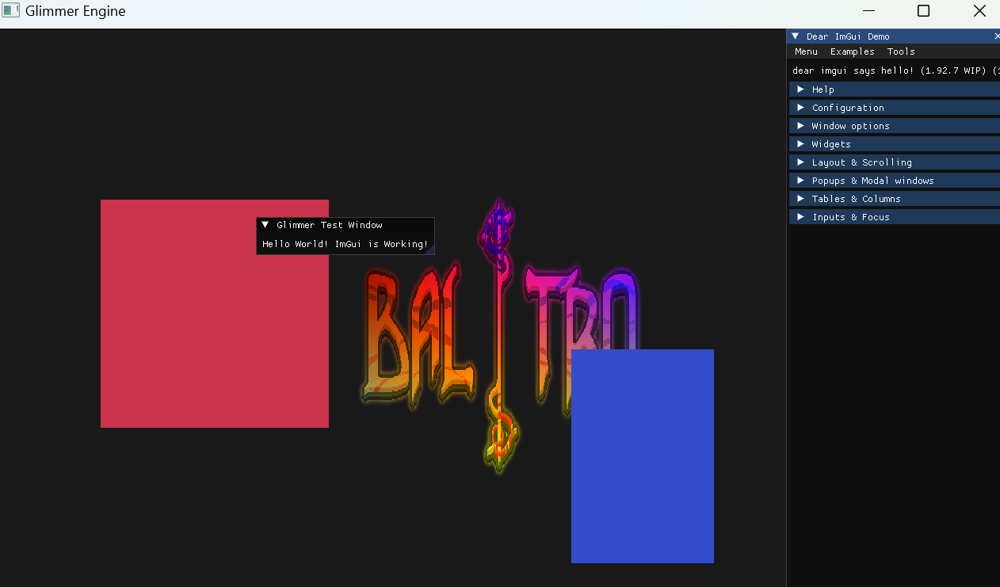

## Uniform解耦/全屏shader接口

> 下面一段话是废话，理论设想，最终还是集成到了Renderer2D保持Sandbox2D的极简调用

由上一部分可知，Renderer2D实际上的作用只是封装一些简单图形API的调用和部分Uniform上传，但部分shader需要另外上传时间、强度等自定义Uniform变量，因此对于这些shader我们需要在Sandbox2D调用DrawQuad()时单独声明。

目前的 Renderer2D 只能画“颜色”和“贴图”。我们需要增加一个重载函数，允许它使用**自定义 Shader** 来画方块。此外，我们需要在底层自动上传 u_Resolution，因为大部分背景特效都需要这个。

Renderer2D.h 增加函数声明：

```
// 在 Renderer2D 类中增加
#include "Glimmer/Renderer/Shader.h"
static void DrawQuad(const glm::vec2& position, const glm::vec2& size, const Ref<Shader>& shader);
static void DrawQuad(const glm::vec3& position, const glm::vec2& size, const Ref<Shader>& shader);
```

```
// 在 Glimmer/src/Glimmer/Renderer/Renderer2D.cpp 中添加：

// 1. vec2 重载版本（调用 vec3 版本）
void Renderer2D::DrawQuad(const glm::vec2& position, const glm::vec2& size, const Ref<Shader>& shader)
{
    DrawQuad({ position.x, position.y, 0.0f }, size, shader);
}

// 2. vec3 核心实现版本
void Renderer2D::DrawQuad(const glm::vec3& position, const glm::vec2& size, const Ref<Shader>& shader)
{
    // 这里的逻辑是：给自定义 Shader 提供引擎管辖的基础数据
    shader->Bind();
    
    // A. 自动上传当前的 View-Projection 矩阵
    // 注意：s_Data 里的 ViewProjectionMatrix 必须在 BeginScene 里存好了
    shader->UploadUniformMat4("u_ViewProjection", s_Data->ViewProjectionMatrix);

    // B. 计算并上传物体的 Transform 矩阵
    glm::mat4 transform = glm::translate(glm::mat4(1.0f), position)
        * glm::scale(glm::mat4(1.0f), { size.x, size.y, 1.0f });
    shader->UploadUniformMat4("u_Transform", transform);

    // C. 绘制
    s_Data->QuadVertexArray->Bind();
    RenderCommand::DrawIndexed(s_Data->QuadVertexArray);
}
```

初步发现分辨率对不上，且改参数无作用

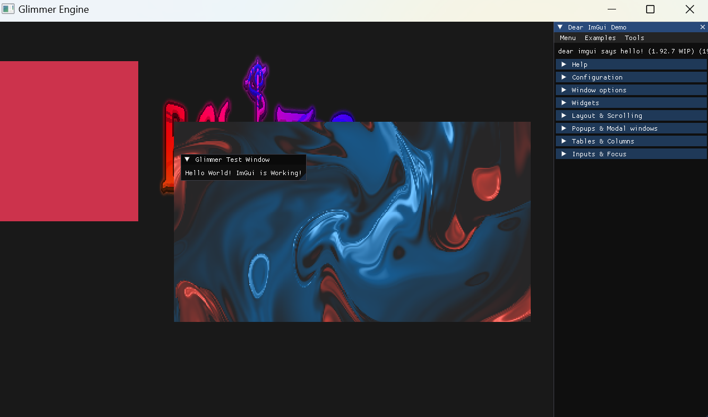

这就遇到了一个问题，因为原本这个全屏背景shader我就没有传变换矩阵，所以原始Draw传入size对其是没有作用的。并且考虑到有挺多这种全屏shader的应用场景的，比如滤镜啥的，于是新定义接口

```
// 增加一个全屏绘制函数，不需要位置和尺寸，只需要 Shader
static void DrawFullscreenQuad(const Ref<Shader>& shader);
```

简单实现后，发现即使先写背景shader，依然覆盖了所有对象，才想起来开启了深度测试，物体层级是由z值决定的，因此改动接口

```
static void DrawFullscreenQuad(const Ref<Shader>& shader, float depth = 0.0f);
```

在计算 u_Transform 矩阵时，我们将 depth 应用到位移向量的 Z 分量上。

```
// Glimmer/src/Glimmer/Renderer/Renderer2D.cpp
void Renderer2D::DrawFullscreenQuad(const Ref<Shader>& shader, float depth)
{
    shader->Bind();
    
    glm::mat4 identity = glm::mat4(1.0f);
    shader->UploadUniformMat4("u_ViewProjection", identity);
    
    // 核心修改：将深度值应用到 translate 中
    // 注意：顺序必须是 先平移(translate) 后缩放(scale)
    glm::mat4 transform = glm::translate(identity, { 0.0f, 0.0f, depth }) 
                        * glm::scale(identity, glm::vec3(2.0f));
    
    shader->UploadUniformMat4("u_Transform", transform);

    // 自动上传时间、分辨率等基础参数 (保持不变)
    shader->UploadUniformFloat("u_Time", s_Data->SceneTime);
    auto& window = gl::Application::Get().GetWindow();
    shader->UploadUniformFloat2("u_Resolution", { (float)window.GetWidth(), (float)window.GetHeight() });

    s_Data->QuadVertexArray->Bind();
    RenderCommand::DrawIndexed(s_Data->QuadVertexArray);
}
```

更改Sandbax2D

```
    auto bgShader = m_ShaderLib.Get("BalatroVortex");
    gl::Renderer2D::DrawFullscreenQuad(bgShader, 0.9f); 
```

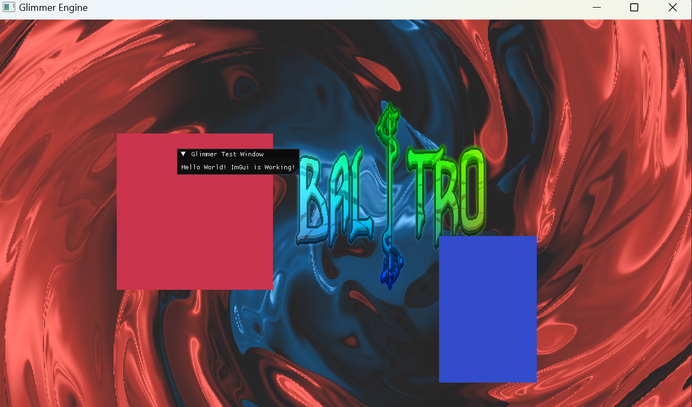

```
	gl::Renderer2D::DrawQuad({ 0.5f, -0.5f, -0.1f }, { 0.5f, 0.75f }, { 0.2f, 0.3f, 0.8f, 1.0f });
	gl::Renderer2D::DrawQuad({ -1.0f, 0.0f, 0.0f }, { 1.0f, 1.0f }, m_Texture);
	gl::Renderer2D::DrawQuad({ 1.0f, 0.0f, 0.0f }, { 1.0f, 1.0f }, m_STSTexture);
```

添加image像呼吸一样简单了

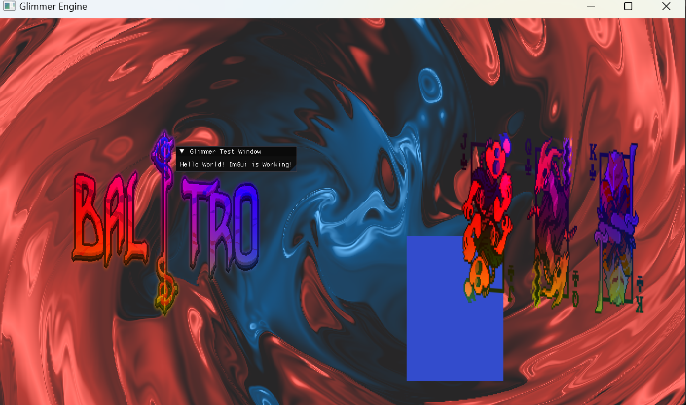

为什么DrawQuad的深度和DrawFullscreenQuad好像基准不一样？

> 是由于 **世界空间（World Space）** 与 **NDC 空间（归一化设备坐标）** 之间的转换逻辑导致的。
>
> **1. 深度基准的本质区别**
>
> - **DrawFullscreenQuad (基准：NDC 空间)**
>   由于你传的是**单位矩阵 (Identity Matrix)**，它的 Z 轴直接就是 OpenGL 的标准数值。范围：**-1.0 (最近/最前) 到 1.0 (最远/最后)**。这是一个绝对值。不管你相机在哪，depth = 0.9 永远代表“贴在屏幕背景墙上”。
> - **DrawQuad (基准：世界空间 + 相机转换)**
>   它经过了 u_ViewProjection 的洗礼。**相机位移的影响**：如果你的相机位置是 (0, 0, 5)，那么在世界坐标里 Z=0 的物体，相对于相机来说深度就是 5。**投影矩阵的映射**：你在创建 OrthographicCamera 时设置过 Near 和 Far（比如 -1.0 到 1.0）。这个矩阵会把这个世界范围内的 Z 轴强行“挤”进 NDC 的 -1 到 1 之间。**计算结果**：如果你的相机在移动，或者 Near/Far 设置不是 -1 到 1，那么 DrawQuad 传进去的 Z 值经过计算后，在显卡看来可能已经变成了 0.2 或 0.8。
>
> **2. 为什么它们会“打架”？**
>
> 想象你在拍戏：
>
> - DrawFullscreenQuad 是在**镜头玻璃**上贴了一层保鲜膜（不管摄像机怎么动，保鲜膜就在那）。
> - DrawQuad 是在**舞台**上放了一个道具。
>
> 当你问“谁在前面”时，GPU 会看最终算出来的 gl_Position.z。
> 如果相机往后退了（Z 增加了），舞台上的道具在 GPU 眼里就会变远（Z 变大）。但镜头玻璃上的保鲜膜 Z 值是写死的，于是原本在道具后面的背景，可能由于道具往后退，突然就跑到了道具前面。
>
> **3. 如何统一标准？（架构建议）**
>
> 要解决这个问题，让背景永远在最底层，建议采用以下 **方案 A**。
>
> 方案 A：关闭深度写入（最推荐的做法）
>
> 既然背景是“全屏特效”，它就不应该参与物体的深度竞争。我们让它在渲染时**不写深度缓冲区**，只管涂颜色。这样，无论后面的方块 Z 是多少，背景都会被视为“最远”。
>
> **修改 Sandbox2D.cpp 渲染顺序：**
>
> ```
> void Sandbox2D::OnUpdate(gl::Timestep ts) {
>     gl::RenderCommand::Clear();
> 
>     // 1. 渲染背景前，暂时禁用深度测试（或仅禁用深度写入）
>     glDisable(GL_DEPTH_TEST); 
>     
>     auto bgShader = m_ShaderLib.Get("BalatroVortex");
>     gl::Renderer2D::DrawFullscreenQuad(bgShader, 0.0f); // 深度填多少都无所谓了
> 
>     // 2. 重新开启深度测试，给游戏世界用
>     glEnable(GL_DEPTH_TEST); 
> 
>     gl::Renderer::BeginScene(m_CameraController.GetCamera());
>     // 这里的物体会根据彼此的 Z 轴正常排序
>     gl::Renderer2D::DrawQuad({0, 0, 0.0f}, {1, 1}, m_Texture); 
>     gl::Renderer::EndScene();
> }
> ```

## 白贴图模式

引入**白贴图（White Texture）模式**是 2D 渲染器的一次重要进化。它的核心逻辑是：**将“纯色”和“贴图”渲染逻辑统一到一个 Shader 中**。

当你画纯色方块时，引擎会自动绑定一张 $1 \times 1$ 的纯白色贴图。因为任何颜色乘以白色（1.0, 1.0, 1.0, 1.0）都等于它本身，所以我们可以只用一套代码管所有 2D 绘图。

---

文件 1：`Glimmer/src/Glimmer/Renderer/Texture.h`

我们需要增加手动设置像素数据的能力，以便创建 1x1 的白色纹理。

```cpp
namespace gl {
    class Texture2D : public Texture {
    public:
        // ✨ 新增：支持指定宽高的工厂方法
        static Ref<Texture2D> Create(uint32_t width, uint32_t height);
        static Ref<Texture2D> Create(const std::string& path);

        // ✨ 新增：手动上传像素数据的方法
        virtual void SetData(void* data, uint32_t size) = 0;
    };
}
```

---

文件 2：`Glimmer/src/Platform/OpenGL/OpenGLTexture2D.h/cpp`

实现上面新增的接口。

**OpenGLTexture2D.h**
```cpp
class OpenGLTexture2D : public Texture2D {
public:
    OpenGLTexture2D(uint32_t width, uint32_t height); // ✨ 新构造函数
    // ...
    virtual void SetData(void* data, uint32_t size) override;
private:
    uint32_t m_Width, m_Height;
    uint32_t m_RendererID;
    GLenum m_InternalFormat, m_DataFormat; // 记录格式信息
};
```

**OpenGLTexture2D.cpp**
```cpp
OpenGLTexture2D::OpenGLTexture2D(uint32_t width, uint32_t height)
    : m_Width(width), m_Height(height)
    {
        m_InternalFormat = GL_RGBA8;
        m_DataFormat = GL_RGBA;

        glCreateTextures(GL_TEXTURE_2D, 1, &m_RendererID);
        glTextureStorage2D(m_RendererID, 1, m_InternalFormat, m_Width, m_Height);

        glTextureParameteri(m_RendererID, GL_TEXTURE_MIN_FILTER, GL_LINEAR);
        glTextureParameteri(m_RendererID, GL_TEXTURE_MAG_FILTER, GL_NEAREST);

        glTextureParameteri(m_RendererID, GL_TEXTURE_WRAP_S, GL_REPEAT);
        glTextureParameteri(m_RendererID, GL_TEXTURE_WRAP_T, GL_REPEAT);
    }

void OpenGLTexture2D::SetData(void* data, uint32_t size)
{
    uint32_t bpp = m_DataFormat == GL_RGBA ? 4 : 3;
    GL_CORE_ASSERT(size == m_Width * m_Height * bpp, "Data must be entire texture!");
    glTexImage2D(GL_TEXTURE_2D, 0, m_InternalFormat, m_Width, m_Height, 0, m_DataFormat, GL_UNSIGNED_BYTE, data);
}
```
*(注意：别忘了在 `Texture.cpp` 里实现 `Texture2D::Create(width, height)` 指向这个类)*。

---

文件 3：`Glimmer/src/Glimmer/Renderer/Renderer2D.cpp`

这是重头戏。我们**删除 `FlatColorShader`**，引入 `WhiteTexture`。

```cpp
namespace gl {

    struct Renderer2DStorage {
        Ref<VertexArray> QuadVertexArray;
        Ref<Shader> TextureShader; // ✨ 只需要这一个 Shader
        Ref<Texture2D> WhiteTexture; // ✨ 引入白贴图

        glm::mat4 ViewProjectionMatrix;
        float SceneTime = 0.0f;
    };

    static Renderer2DStorage* s_Data;

    void Renderer2D::Init() {
        s_Data = new Renderer2DStorage();
        // ... (VAO/VBO/IBO 设置保持不变) ...

        // ✨ 核心逻辑 1：创建 1x1 纯白贴图
        s_Data->WhiteTexture = Texture2D::Create(1, 1);
        uint32_t whiteTextureData = 0xffffffff; // 纯白色
        s_Data->WhiteTexture->SetData(&whiteTextureData, sizeof(uint32_t));

        // ✨ 核心逻辑 2：只加载 TextureShader
        s_Data->TextureShader = Shader::Create("assets/shaders/Texture.glsl");
        s_Data->TextureShader->Bind();
        s_Data->TextureShader->UploadUniformInt("u_Texture", 0);
    }

    void Renderer2D::BeginScene(const OrthographicCamera& camera) {
        s_Data->SceneTime = Application::Get().GetTime();
        s_Data->ViewProjectionMatrix = camera.GetViewProjectionMatrix();

        s_Data->TextureShader->Bind();
        s_Data->TextureShader->UploadUniformMat4("u_ViewProjection", s_Data->ViewProjectionMatrix);
        s_Data->TextureShader->UploadUniformFloat("u_Time", s_Data->SceneTime);
    }

    // --- 修改纯色 DrawQuad ---
    void Renderer2D::DrawQuad(const glm::vec3& position, const glm::vec2& size, const glm::vec4& color) {
        s_Data->TextureShader->Bind();
        s_Data->TextureShader->UploadUniformFloat4("u_Color", color); // 设置目标颜色
        s_Data->WhiteTexture->Bind(); // ✨ 绑定白色贴图，让 Shader 采样出 1.0

        glm::mat4 transform = glm::translate(glm::mat4(1.0f), position) 
                            * glm::scale(glm::mat4(1.0f), { size.x, size.y, 1.0f });
        s_Data->TextureShader->UploadUniformMat4("u_Transform", transform);

        s_Data->QuadVertexArray->Bind();
        RenderCommand::DrawIndexed(s_Data->QuadVertexArray);
    }

    // --- 修改贴图 DrawQuad ---
    void Renderer2D::DrawQuad(const glm::vec3& position, const glm::vec2& size, const Ref<Texture2D>& texture) {
        s_Data->TextureShader->Bind();
        s_Data->TextureShader->UploadUniformFloat4("u_Color", glm::vec4(1.0f)); // ✨ 设为白色，不改变贴图原色
        texture->Bind(); // 绑定真实贴图

        glm::mat4 transform = glm::translate(glm::mat4(1.0f), position) 
                            * glm::scale(glm::mat4(1.0f), { size.x, size.y, 1.0f });
        s_Data->TextureShader->UploadUniformMat4("u_Transform", transform);

        s_Data->QuadVertexArray->Bind();
        RenderCommand::DrawIndexed(s_Data->QuadVertexArray);
    }
}
```

---

文件 4：`assets/shaders/Texture.glsl`

由于现在所有的方块（纯色或贴图）都用这一个 Shader，必须确保它的计算公式包含 `u_Color`。

```glsl
#type fragment
#version 330 core

layout(location = 0) out vec4 color;

in vec2 v_TexCoord;
uniform sampler2D u_Texture;
uniform vec4 u_Color; // 接收 C++ 传来的颜色

void main() {
    // ✨ 核心公式：采样出的贴图颜色 * 外部颜色
    // 对于纯色块：采样出 (1,1,1,1) * u_Color = u_Color
    // 对于贴图：采样出 ImageColor * (1,1,1,1) = ImageColor (如果外部传白)
    color = texture(u_Texture, v_TexCoord) * u_Color;
}
```

---

为什么要这么做？

1.  **性能优化**：通过统一 Shader，我们减少了 GPU 的 **状态切换（State Change）**。在 OpenGL 中，切换 Shader 程序是非常昂贵的。
2.  **灵活性**：现在的贴图方块也支持变色了！你可以给 `m_Texture` 版的 `DrawQuad` 传一个红色，原本的图片就会被染上一层红色的阴影（Tinting），这在实现“受击变红”等特效时极其方便。
3.  **批处理（Batching）的前奏**：这是最重要的原因。批处理要求一组物体共用同一个 Shader 和贴图。有了白贴图，纯色方块现在在显卡眼里也是“带贴图的方块”了，未来它们可以完美地合并成一个 Draw Call 发送出去。

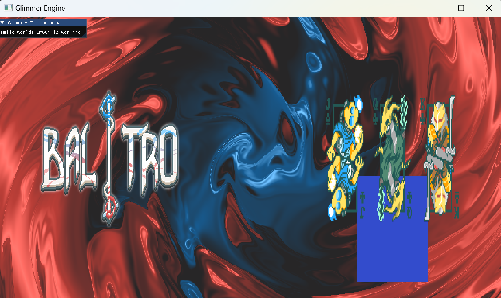

## 仪器测量

为了让你的 **Glimmer Engine** 从“能跑”进化到“高性能工业级”水平，我们必须建立一套科学的性能观测体系。

我将这个过程分为两个大的阶段：
1.  **仪器测量（Instrumentation）**：在 CPU 层面追踪每个函数的耗时，并生成可视化报告。
2.  **渲染器统计与批处理（Renderer2D Evolution）**：实时监测 Draw Call 次数，并进化到批处理模式。

本篇对话我们先攻克 **“第一阶段：全引擎性能剖析器（Profiler）”**。

---

**第一阶段：全引擎仪器测量 (Instrumentation)**

我们要实现一套类似 Chrome 的性能追踪工具。它能生成一个 `.json` 文件，你只需在 Chrome 浏览器打开 `chrome://tracing` 就能看到类似电影剪辑软件那样的全引擎时间轴。

创建性能监测核心类 (`Instrumentor.h`)

在 `Glimmer/src/Glimmer/Debug` 目录下创建。这个类负责将每个函数的开始和结束时间记录到文件中。

**文件：`Glimmer/src/Glimmer/Debug/Instrumentor.h`**

```cpp
#pragma once
#include <string>
#include <chrono>
#include <algorithm>
#include <fstream>
#include <thread>

namespace gl {

	struct ProfileResult {
		std::string Name;
		long long Start, End;
		uint32_t ThreadID;
	};

	struct InstrumentationSession {
		std::string Name;
	};

	class Instrumentor
	{
	private:
		InstrumentationSession* m_CurrentSession;
		std::ofstream m_OutputStream;
		int m_ProfileCount;
	public:
		Instrumentor() : m_CurrentSession(nullptr), m_ProfileCount(0) {}

		void BeginSession(const std::string& name, const std::string& filepath = "results.json")
		{
			m_OutputStream.open(filepath);
			WriteHeader();
			m_CurrentSession = new InstrumentationSession{ name };
		}

		void EndSession()
		{
			WriteFooter();
			m_OutputStream.close();
			delete m_CurrentSession;
			m_CurrentSession = nullptr;
			m_ProfileCount = 0;
		}

		void WriteProfile(const ProfileResult& result)
		{
			if (m_ProfileCount++ > 0) m_OutputStream << ",";

			std::string name = result.Name;
			std::replace(name.begin(), name.end(), '"', '\'');

			m_OutputStream << "{";
			m_OutputStream << "\"cat\":\"function\",";
			m_OutputStream << "\"dur\":" << (result.End - result.Start) << ',';
			m_OutputStream << "\"name\":\"" << name << "\",";
			m_OutputStream << "\"ph\":\"X\",";
			m_OutputStream << "\"pid\":1,";
			m_OutputStream << "\"tid\":" << result.ThreadID << ",";
			m_OutputStream << "\"ts\":" << result.Start;
			m_OutputStream << "}";

			m_OutputStream.flush();
		}

		static Instrumentor& Get() {
			static Instrumentor instance;
			return instance;
		}

	private:
		void WriteHeader() { m_OutputStream << "{\"otherData\": {},\"traceEvents\":["; m_OutputStream.flush(); }
		void WriteFooter() { m_OutputStream << "]}"; m_OutputStream.flush(); }
	};

	// 专门负责自动结束计时的计时器
	class InstrumentationTimer
	{
	public:
		InstrumentationTimer(const char* name)
			: m_Name(name), m_Stopped(false)
		{
			m_StartTimepoint = std::chrono::high_resolution_clock::now();
		}

		~InstrumentationTimer() { if (!m_Stopped) Stop(); }

		void Stop()
		{
			auto endTimepoint = std::chrono::high_resolution_clock::now();

			long long start = std::chrono::time_point_cast<std::chrono::microseconds>(m_StartTimepoint).time_since_epoch().count();
			long long end = std::chrono::time_point_cast<std::chrono::microseconds>(endTimepoint).time_since_epoch().count();

			uint32_t threadID = std::hash<std::thread::id>{}(std::this_thread::get_id());
			Instrumentor::Get().WriteProfile({ m_Name, start, end, threadID });

			m_Stopped = true;
		}
	private:
		const char* m_Name;
		std::chrono::time_point<std::chrono::high_resolution_clock> m_StartTimepoint;
		bool m_Stopped;
	};
}
```

---

在 `Core.h` 中添加便捷宏

为了不破坏代码美感，我们用宏来封装调用。

**文件：`Glimmer/src/Glimmer/Core.h`**
```cpp
// ... 之前的宏 ...

#define GL_PROFILE 1
#if GL_PROFILE
	#define GL_PROFILE_BEGIN_SESSION(name, filepath) ::gl::Instrumentor::Get().BeginSession(name, filepath)
	#define GL_PROFILE_END_SESSION() ::gl::Instrumentor::Get().EndSession()
    // ✨ 核心宏：放在函数第一行即可追踪整个函数
	#define GL_PROFILE_FUNCTION() GL_PROFILE_SCOPE(__FUNCSIG__)
	#define GL_PROFILE_SCOPE(name) ::gl::InstrumentationTimer timer##__LINE__(name)
#else
	#define GL_PROFILE_BEGIN_SESSION(name, filepath)
	#define GL_PROFILE_END_SESSION()
	#define GL_PROFILE_FUNCTION()
	#define GL_PROFILE_SCOPE(name)
#endif
```

---

如何使用？(以 Sandbox2D 为例)

你只需要在想要观察的函数第一行加上 `GL_PROFILE_FUNCTION();`。

**文件：`Sandbox2D.cpp`**
```cpp
void Sandbox2D::OnUpdate(gl::Timestep ts)
{
    GL_PROFILE_FUNCTION(); // ✨ 自动计时

    {
        GL_PROFILE_SCOPE("CameraController::OnUpdate"); // ✨ 追踪特定代码块
        m_CameraController.OnUpdate(ts);
    }

    // ... 渲染代码 ...
}
```

同时，在 `Application.cpp` 的生命周期中开启会话：
```cpp
void Application::Run() {
    GL_PROFILE_BEGIN_SESSION("Runtime", "GlimmerProfile-Runtime.json");
    
    while (m_Running) { ... }
    
    GL_PROFILE_END_SESSION();
}
```

在EntryPoint继承

```
int main(int argc, char** argv)
{
    gl::Log::Init();

    GL_INFO("Ready to build something epic?");

	GL_PROFILE_BEGIN_SESSION("Runtime", "GlimmerProfile-Startup.json");
    auto app = gl::CreateApplication();
	GL_PROFILE_END_SESSION();

	GL_PROFILE_BEGIN_SESSION("Runtime", "GlimmerProfile-Runtime.json");
    app->Run();
	GL_PROFILE_END_SESSION();

	GL_PROFILE_BEGIN_SESSION("Runtime", "GlimmerProfile-Shutdown.json");
    delete app;
	GL_PROFILE_END_SESSION();
}
```

---

为什么用 Chrome Tracing？

**为什么不直接在 ImGui 里画个简单的毫秒数，非要搞这个 JSON 导出报告？**
“ImGui 的实时数值只能看到**‘现状’**，而不能分析**‘因果’**。
通过 `Instrumentor` 生成的 Chrome Tracing 报告，我可以清晰地看到：

1. **函数调用链**：哪个底层 gl 函数被哪个高级渲染指令调用。
2. **多线程瓶颈**：如果未来引入渲染线程，我可以直观地看到 CPU 逻辑线程是在等待 GPU 提交，还是在等待 IO 读取。
3. **微小的抖动（Jitter）**：有些 Bug 是偶发的（比如每 100 帧卡一下），实时数值很难捕捉。通过时间轴回放，我可以精准定位到那一帧里到底是哪个函数突然耗时暴增。
这套体系让性能优化从‘拍脑袋猜’变成了‘数据驱动决策’，是专业引擎开发的基石。”

---

🚀 接下来的操作流程：

1.  **配置 `Instrumentor.h`**。
2.  **修改 `Application.cpp`**：在 `Run` 的开头加 `BEGIN_SESSION`，结尾加 `END_SESSION`。
3.  **大面积撒网**：在你的 `Renderer2D::DrawQuad`、`OpenGLShader::Bind`、`WindowsWindow::OnUpdate` 等函数里全部加上 `GL_PROFILE_FUNCTION()`。
4.  **运行并查看**：运行几秒后关闭。在你的项目根目录找到 `GlimmerProfile-Runtime.json`，打开 Chrome 浏览器，输入 `chrome://tracing`，把文件拖进去。

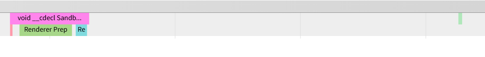

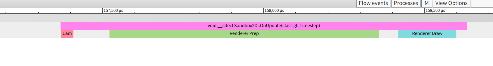

在函数入口加入`GL_PROFILE_FUNCTION()`

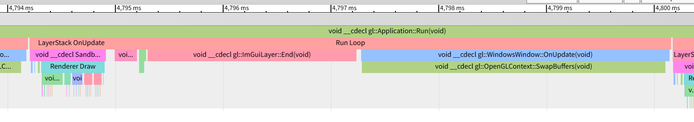

## Renderer2D升级

为 Renderer2D 增加旋转支持、颜色染色（Tinting）以及纹理平铺（Tiling）

需要在 Shader 中增加 u_TilingFactor（平铺系数）的计算。

新增接口

```
// Glimmer/src/Glimmer/Renderer/Renderer2D.h
namespace gl {
    class Renderer2D {
    public:
        // ... Init, BeginScene, EndScene ...

        // 1. 基础 DrawQuad (带平铺和染色)
        static void DrawQuad(const glm::vec2& position, const glm::vec2& size, const Ref<Texture2D>& texture, float tilingFactor = 1.0f, const glm::vec4& tintColor = glm::vec4(1.0f));
        static void DrawQuad(const glm::vec3& position, const glm::vec2& size, const Ref<Texture2D>& texture, float tilingFactor = 1.0f, const glm::vec4& tintColor = glm::vec4(1.0f));

        // 2. 旋转 DrawQuad (纯色)
        static void DrawRotatedQuad(const glm::vec2& position, const glm::vec2& size, float rotation, const glm::vec4& color);
        static void DrawRotatedQuad(const glm::vec3& position, const glm::vec2& size, float rotation, const glm::vec4& color);

        // 3. 旋转 DrawQuad (贴图 + 平铺 + 染色)
        static void DrawRotatedQuad(const glm::vec2& position, const glm::vec2& size, float rotation, const Ref<Texture2D>& texture, float tilingFactor = 1.0f, const glm::vec4& tintColor = glm::vec4(1.0f));
        static void DrawRotatedQuad(const glm::vec3& position, const glm::vec2& size, float rotation, const Ref<Texture2D>& texture, float tilingFactor = 1.0f, const glm::vec4& tintColor = glm::vec4(1.0f));
    };
}
```

实现 Renderer2D.cpp 逻辑

这里最核心的变化是变换矩阵的计算顺序：**平移 -> 旋转 -> 缩放**。

2D/3D 渲染中关于 **“深度缓冲区（Depth Buffer）”与“透明度（Alpha）”** 的核心矛盾。

看到的“透明背景挡住下面物体”，在图形学中被称为 **“深度遮挡（Depth Occlusion）”**。

> 在 OpenGL 中，当你开启了 GL_DEPTH_TEST（深度测试）后，显卡的工作逻辑是这样的：
>
> 1. **计算位置**：显卡画出一个方块（Quad），确定它在屏幕上的位置和深度（Z=0.0）。
> 2. **深度测试**：显卡检查这个位置的“深度记录”。如果现在的 Z 值小于或等于记录值，就允许画。
> 3. **写入深度**：**重点来了！** 只要方块在这个像素点上有任何输出（即使是 100% 透明的像素），它都会把自己的 Z 值（0.0）写进深度缓冲区。
> 4. **后续判定**：当你画第二个方块（RotatedQuad）时，它也在 Z=0.0。由于深度缓冲区里已经有一个 0.0 的记录了，显卡会认为：“这里已经有东西占位了，而且离我一样近（或更近）”，于是**直接丢弃**了后面那个方块的像素。
>
> **结果**：第一个方块的“透明边框”虽然看不见颜色，但它在深度图里占了坑，导致后面重叠的物体被“空气”挡住了。

在 Shader 中开启 discard

这是解决 2D 透明物体遮挡问题的标准做法。我们告诉显卡：如果这个像素的透明度很低，就**彻底丢弃它，不要写深度缓存**。

**修改 assets/shaders/Texture.glsl：**

```
void main() {
    vec4 texColor = texture(u_Texture, v_TexCoord * u_TilingFactor) * u_Color;
    
    // ✨ 核心修复：如果透明度低于一个很小的阈值，直接扔掉这个像素
    // 这样它就不会去更新深度缓冲区了
    if (texColor.a < 0.1)
        discard;

    color = texColor;
}
```

效果如图

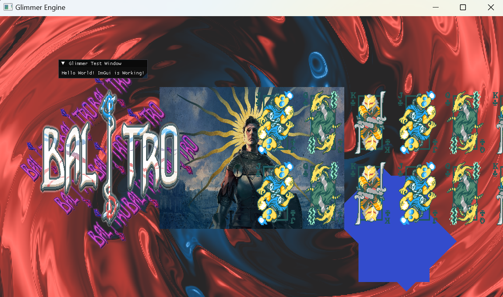

### 为什么不用动态库？

如果用动态链接库，将会出现每次生成解决方案都要手动复制一遍dll文件的情况

#### 1. 什么是 StaticLib (静态库 .lib)？

**通俗比喻**：相当于你把 Glimmer 引擎所有的代码（碰撞、渲染、数学库）**打印成了一本厚厚的实体书**。

- **工作原理**：当编译 Sandbox 游戏时，链接器（Linker）会把这本 Glimmer.lib 里的**所有内容**，直接“抄”一份，**死死地缝合（打包）进最终的 Sandbox.exe 文件里**。
- **结果**：你最终只得到一个胖胖的 Sandbox.exe。你只需要把这个 .exe 发给玩家，玩家双击就能直接玩！
- **优点**：**极度省事**：不需要管环境变量，不需要把一堆 .dll 文件和 .exe 放在同一个目录下，玩家绝不会遇到恶心的“找不到 xxxx.dll”报错。**运行极快**：因为所有的代码都在一个 .exe 的内存空间里，函数调用的速度是最快的（编译器甚至能做极致的跨文件内联优化）。
- **为什么目前用它？**：在引擎开发的初期，代码量很少，编译速度极快。用静态库可以让你少踩无数个“DLL 导出宏（__declspec(dllexport)）”的坑。

#### 2. 什么是 SharedLib (动态链接库 .dll)？

**通俗比喻**：相当于你把 Glimmer 引擎做成了一个**在线的云文档**。

- **工作原理**：当编译 Sandbox 游戏时，它只会生成一个极小的 Sandbox.exe 和一个小小的引导文件（通常也叫 .lib，但只是个空壳目录）。真正的核心代码全都在独立生成的 **Glimmer.dll** 里。

- **结果**：你必须把 Sandbox.exe 和 Glimmer.dll 放在同一个文件夹里发给玩家。当玩家双击 .exe 时，程序会在运行时（Run-time）动态地去旁边寻找并加载这个 .dll。

- **优点**：**内存共享**：如果玩家电脑上同时运行了三个用 Glimmer 引擎做的游戏，它们可以共享内存中的同一个 Glimmer.dll，极大地节省了系统内存。**热更新（极度高级）**：你可以只替换掉玩家目录下的 Glimmer.dll 来修复引擎的 Bug，而不需要重新让玩家下载整个几 GB 的 Sandbox.exe 游戏本体！

- **为什么现在不用它？**：
  要写出一个能完美跨平台（Windows 用 .dll，Mac 用 .dylib，Linux 用 .so）的动态库引擎，你需要在所有的类和函数前面加上恶心至极的导出宏：

  ```
  // 如果用 DLL，你的代码得写成这样： 
  #ifdef GLIMMER_BUILD_DLL    
  	#define GLIMMER_API __declspec(dllexport) 
  #else    
  	#define GLIMMER_API __declspec(dllimport) 
  #endif class GLIMMER_API Application { ... };
  ```

  这对于刚起步的引擎来说，纯粹是自找麻烦。

### 什么是“静态链接（Static Link）”下的入口点冲突？

**如果你在引擎的头文件里定义了 int main()，而用户在两个不同的 .cpp 文件里都包含了这个头文件，会发生什么？**

- **标准答案**：会触发**重定义错误（Multiple Definition Error）**。
- **如何规避？**：**约定俗成**：明确告知开发者，EntryPoint.h 只能在一个项目中有且仅有一个 .cpp 文件包含（通常是主程序入口）。**强制唯一性**：通过条件编译或特定的架构设计，确保 main 函数所在的翻译单元是唯一的。

### **为什么我们要自己定义 GL_PLATFORM_WINDOWS，而不是直接用微软自带的 _WIN32？**

- **标准答案（显摆你的架构思维）**：

  **命名空间保护**：\_WIN32 是编译器厂商提供的宏。如果以后我们要支持 Android、iOS，每个平台都有自己乱七八糟的内置宏。使用 GL_ 前缀的宏（如 GL_PLATFORM_WINDOWS、GL_PLATFORM_LINUX），可以统一我们引擎自己的逻辑，**代码更干净，且不依赖于特定编译器。**

  **灵活控制**：有时候我们可能在 Windows 上模拟 Linux 的运行逻辑。如果使用自己的宏，我们可以通过 Premake 脚本随时开启或关闭，而内置宏是没法手动关掉的。

### **为什么在开发跨平台引擎时，我们倾向于强制开启** **/utf-8** **标志？**

- **标准答案**：**一致性**：不同国家的开发者、不同操作系统的默认编码（Windows 的 GBK, Linux 的 UTF-8）各不相同。如果不统一，你的代码里写了一句中文注释，发给国外的合作伙伴，他的电脑打开可能全是乱码，甚至导致编译失败。
- **现代标准**：C++11 之后，像 spdlog、fmt、yaml-cpp 等现代库都遵循 UTF-8 标准。
- **运行环境**：设置 /utf-8 会同时设置**源代码字符集**和**执行字符集**。这意味着你在代码里写的 "你好"，在运行时输出到控制台时，编译器会确保它以 UTF-8 的形式正确呈现，而不是变成 ?? 或 锟斤拷。

### **在 C++ 中，如果你要输出一段包含大量换行、反斜杠（\）或引号的字符串，你该怎么做？**

- **标准答案**：使用 **C++11 引入的原始字符串字面量 (Raw String Literals)**，语法为 R"(字符串内容)"。
- **为什么要用它？**：**无需转义**：在普通字符串里，你需要写 \\ 来代表一个 \，这在画 ASCII 艺术字时简直是噩梦。在 R"(...)" 中，你看到什么，输出就是什么。**支持多行**：它允许直接在代码里换行，非常适合写 Shader 源码、JSON 模板或艺术字 Logo。

### **为什么在事件系统中，EventCategory **要使用 **BIT(x)** **位移操作，而不是简单的 1, 2, 3 数字？**

- **标准答案**：**多重归属（Multiple Categories）**：使用位掩码（Bitmask）可以允许一个事件同时属于多个分类。例如，MouseButtonPressedEvent 的分类标志可以是 EventCategoryMouse | EventCategoryInput（结果是二进制的 1010）。
- **高效查询**：检查一个事件是否属于某个分类只需要一次位运算（&），速度极快，这在每秒产生成千上万个事件的引擎中至关重要。

### **Glimmer 现在的事件系统是“阻塞式（Blocking）”的，这有什么优缺点？**

- **标准答案**：

  **优点**：实现简单，逻辑直观。事件一发生立即处理，不需要额外的内存缓冲区。

  **缺点**：如果处理某个事件（如复杂计算）太耗时，会直接卡住主循环，导致掉帧。

  **未来优化**：后续可以引入“事件队列（Event Queue）”，将不紧急的事件存起来，在下一帧统筹处理。

### **为什么大型 C++ 项目一定要用 PCH？它的原理是什么？**

- **标准答案**：

  **原理**：C++ 的 #include 是简单的文本拷贝。如果你有 1000 个文件都包含了 <Windows.h>（约 10 万行代码），编译器就要处理 1 亿行代码。PCH 的做法是**将这些头文件预先编译成二进制格式**。

  **作用**：后续编译其他源文件时，编译器直接加载二进制缓存，不再重复解析。

  **结果**：可以把数分钟的编译时间缩短到几秒钟，显著提升开发效率。

### **为什么在 Window::Create 中使用静态工厂方法，而不是直接 new WindowsWindow？**

- **标准答案**：
  为了实现**跨平台隐藏**。在 Application.cpp 中，我们只需要包含通用的 Window.h，而不需要知道 WindowsWindow.h 的存在。这样在编译 Linux 版时，Window::Create 会返回 LinuxWindow，而 Application 的逻辑代码一行都不用改。这符合设计模式中的**工厂模式**和**依赖倒置原则**。

### **什么是 VSync（垂直同步）？它的底层原理是什么？**

- **标准答案**：
  VSync 用于将显示器的刷新率（如 60Hz）与 GPU 的渲染帧率同步。
  **原理**：GPU 有两个缓冲区（Front Buffer 和 Back Buffer）。当开启 VSync 时，GPU 会等待显示器的 **垂直空白间隙 (Vertical Blanking Interval)** 信号，才执行 **双缓冲交换 (Buffer Swapping)**。这能有效防止画面撕裂（Screen Tearing），但可能会增加微小的输入延迟。

### **在处理 GLFW 回调时，为什么不能直接在回调里写 Application::OnEvent(...)？**

- **标准答案**：**语法限制**：GLFW 的回调是 C 风格的函数指针，它无法直接调用 C++ 对象的成员函数（因为没有 this 指针）。

  **解耦原则**：底层的窗口模块不应该知道上层的 Application 是谁。

  **解决方案**：使用 glfwSetWindowUserPointer。这是一个极其经典的 C/C++ 混编技巧。它允许我们将一个自定义对象的地址存在 C 库持有的句柄里，在回调触发时再强转回来。这本质上是在为 C 语言的回调函数提供“上下文”。

### **如果我想在引擎里加一个“性能监控面板（FPS计数器）”，我该怎么做？**

- **标准答案**：我会创建一个专门的 **Overlay（覆盖层）**。把它放在 LayerStack 的最顶端（最后面）。在 OnUpdate 中计算 FPS 并使用渲染指令画在屏幕顶端。因为它处于最顶层，所以无论游戏层怎么渲染，性能面板永远不会被遮挡，且它通常不拦截鼠标事件（Handled = false），保证不影响玩家玩游戏。

### **为什么 OpenGL 需要 Glad 或 Glew 这样的加载库？直接调用不行吗？**

- **标准答案**：

  **动态寻址**：OpenGL 函数实现在 GPU 驱动里。驱动版本不同，函数的内存地址也不同。

  **跨平台限制**：Windows 只默认支持 OpenGL 1.1。所有更高版本的函数（如 Shader 相关函数）必须在运行时动态获取地址。

  **Glad 的工作**：它通过调用 OS 提供的接口（如 Windows 上的 wglGetProcAddress）把这些深藏在驱动里的函数地址一个一个抠出来，赋值给 C++ 指针，我们才能正常调用。

### **什么是“双缓冲（Double Buffering）”？为什么要 SwapBuffers？**

- **标准答案**：
  为了防止画面闪烁。

  **后缓冲区（Back Buffer）**：GPU 在后台静静地画图。

  **前缓冲区（Front Buffer）**：显示器当前显示的图。

  **SwapBuffers**：当后缓冲区画好了，瞬间把它和前缓冲区交换。玩家看到的就是完整的画面，而不是 GPU 正在涂色的过程。

### **ImGui 层应该由客户端（Sandbox）手动挂载，还是由引擎自动集成？**

“这取决于引擎的定位。

**手动挂载（Hazel 早期）\**遵循了\**组合优于继承**的原则，具有极高的灵活性。如果应用是一个不需要交互的后台程序或纯性能演示，可以完全剥离 UI 模块，减少内存和渲染开销。

**自动集成（我目前的做法）\**则是将 ImGui 视为\**引擎的基础设施（Infrastructure）**。
首先，它统一了**渲染序列**。由于 ImGui 需要每帧执行 Begin/End 上下文设置，由引擎持有 m_ImGuiLayer 指针可以确保 UI 渲染逻辑始终包裹在所有图层的 OnImGuiRender 之外。
其次，它提升了**开发效率**。开发者在创建新的 Sandbox 游戏或新的 Layer 时，无需关心 UI 环境的初始化，可以直接通过重写 OnImGuiRender 来实现调试工具的快速开发。
这实际上是向**‘编辑器驱动’**的架构演进，因为未来的引擎编辑器本身就是建立在这个自动集成的 ImGui 层之上的。”

### **你是如何处理 UI 事件与游戏场景事件冲突的？**

“在 Glimmer 引擎中，我通过 **ImGuiIO 标志位** 与 **图层事件拦截机制** 的结合来解决这个问题。

首先，事件在引擎中是**倒序分发**的，即位于栈顶的 ImGuiLayer 会最先收到事件。
在 ImGuiLayer::OnEvent 函数中，我会查询 ImGui 内部的两个状态位：io.WantCaptureMouse 和 io.WantCaptureKeyboard。

- 当鼠标悬浮在任何 ImGui 窗口上时，ImGui 会自动将 WantCaptureMouse 设为 true。
- 此时，ImGuiLayer 会在处理完该事件后，将 Event::Handled 属性设为 true。

由于我们在 Application::OnEvent 中实现了拦截逻辑：一旦某个 Layer 处理了事件并标记为 Handled，循环就会立即中断，事件不再传递给下层的 GameLayer。这保证了玩家在点击 UI 按钮时，场景里的角色不会同时发射子弹或移动。”

### 为什么要这么费劲手动映射？

你会发现 ImGui_ImplGlfw_InitForOpenGL(window, true) 的第二个参数如果传 true，ImGui 其实会自动帮你安装 GLFW 回调。

**但是，为什么在写引擎时我们要手动映射（传 false 或者像我们这样自己写 OnEvent）？**

1. **控制权**：作为引擎开发者，我们希望**所有的**系统事件（从 GLFW 来的）都必须先经过我们的 Application::OnEvent 统一调度。如果让 ImGui 直接去钩住 GLFW，我们的事件系统就会被架空。
2. **平台无关性**：如果我们未来支持手机端，手机端没有 GLFW。通过手动映射，我们可以把触摸事件转化为 ImGui 的鼠标点击，而底层的 ImGui 逻辑完全不需要修改。

### **为什么要把 GLFW 的键码重定义一遍？直接在游戏里用 GLFW 的宏不是更快吗？**

- **标准答案**：

  **屏蔽实现细节**：如果明年我想把底层库从 GLFW 换成 SDL，或者要在手机上跑（手机没键盘，只有触摸），如果我用了 GLFW_KEY_A，我得改掉成百上千个游戏逻辑文件。

  **二进制兼容性**：作为引擎开发者，我希望暴露给用户的 API 是**绝对稳定**的。通过重定义，我可以保证 GL_KEY_A 永远代表 A，而不受底层第三方库版本更新（比如宏改名）的影响。

### **GLM 使用的是“行优先 (Row-major)”还是“列优先 (Column-major)”存储？这有什么影响？**

- **标准答案**：

  **GLM 是列优先 (Column-major)**。这与 OpenGL 的标准保持一致。

  **影响**：

  - **内存排列**：一个 4x4 矩阵，在内存里是先存第一列，再存第二列。
  - **乘法顺序**：在代码里我们要写 Matrix * Vector。如果你用的是行优先的库（如 DirectX 数学库），乘法顺序通常是 Vector * Matrix。
  - **传参**：当你使用 glUniformMatrix4fv 把矩阵传给显卡时，不需要进行转置处理，因为内存结构和 OpenGL 驱动预期的完全一致。

### **为什么我们要在引擎初始化阶段编译 Shader，而不是在每一帧渲染时编译？**

- **标准答案**：

  **开销极大**：Shader 编译涉及字符串解析、驱动程序的底层代码优化（JIT），这在 CPU 上非常耗时。

  **管线停顿 (Pipeline Stall)**：如果在 Run 循环里编译，每一帧都会产生巨大的卡顿，帧率会掉到个位数。

  **状态对象**：在 OpenGL 中，编译后的程序是一个数字 ID（Handle），它存在显存中。我们只需要在渲染前通过 glUseProgram(ID) 切换状态，这个动作几乎是瞬时完成的。

### **为什么在类里要把程序句柄起名叫 m_RendererID 而不是 m_ShaderID？**

- **标准答案**：
  这是一种**架构习惯**。在 OpenGL 中，最终起作用的是 **Program（程序对象）**，它是由 Vertex Shader 和 Fragment Shader 链接而成的。对于渲染器来说，它只需要知道这个“渲染程序的 ID”。未来我们在封装 Texture、Buffer 时，也会用 m_RendererID 来代表 GPU 端的资源句柄，保持命名的一致性。

### **glDetachShader 的作用是什么？不写会怎么样？**

- **标准答案**：
  glDetachShader 是将着色器对象从程序对象中“解绑”。
  **原因**：一旦 glLinkProgram 成功，程序对象就已经包含了所需的二进制指令。此时如果不 Detach 就直接 glDeleteShader，着色器对象并不会被真正删除，而是被标记为“待删除”，直到程序对象被销毁。Detach 之后再 Delete，可以更早地释放显存空间，是良好的资源管理习惯。

### **glGetUniformLocation 这个函数有什么性能问题吗？你会如何优化它？**

- **标准答案**：

  **性能损耗**：glGetUniformLocation 是一个相对“昂贵”的操作，因为它涉及到字符串匹配。如果在每一帧中对大量的 Uniform 调用这个函数，会显著降低 CPU 性能。

  **优化方案（Uniform 缓存）**：在 Shader 类中建立一个 **std::unordered_map<std::string, int>**。当第一次上传某个 Uniform 时，查询 Location 并存入 Map。下次上传时，直接从内存里的 Map 读取，避免调用 OpenGL 底层查询指令。

  **高级方案**：在现代 OpenGL（4.3+）中，可以使用 layout(location = x) 直接在 Shader 里给 Uniform 指定位置，彻底省去查询过程。

### **为什么要把 VertexBuffer::Create 定义为静态工厂方法，而不是直接 new OpenGLVertexBuffer？**

- **标准答案**：
  这是**依赖倒置原则（DIP）**的体现。Application 属于高级逻辑层，它应该依赖于抽象接口 VertexBuffer，而不是具体的 OpenGL 实现。通过这种方式，我们可以实现“编译时隔离”：如果你正在开发手机端的 Vulkan 版本，只需让 Create 返回 VulkanVertexBuffer 即可，**业务层的代码一行都不用改**。

### **为什么我们要把 View 和 Projection 矩阵乘在一起传给 Shader，而不是分开传？**

- **标准答案**：

  **减少计算量**：对于一个模型的所有顶点（可能有几万个），它们使用的 `VV` 和 `PP` 矩阵都是一样的。在 CPU 算好乘积 `VPVP` 只需一次 4x4 矩阵乘法；如果传给 Shader，GPU 就要对每个顶点都算一遍乘法。这极大地节省了 GPU 的计算资源。

  **管线优化**：这是标准做法。`P×V×MP×V×M` 构成了物体的最终屏幕位置。将 `PVPV` 视为“场景状态”，`MM` 视为“物体状态”，符合逻辑上的分层。

### **正交投影 (Orthographic) 和 透视投影 (Perspective) 的区别？**

- **标准答案**：

  **正交投影**：物体无论远近，大小看起来都一样。适合 2D 游戏、UI、CAD 软件。

  **透视投影**：近大远小。适合 3D 游戏，因为它模拟了人眼的成像规律。

### **在顶点着色器里，为什么矩阵相乘的顺序是** $P×V×M×pos$

- **标准答案**：

  **数学约定**：OpenGL 和 GLM 默认使用**列优先 (Column-major)** 存储，数学计算上遵循从右向左的变换顺序。

  **物理含义**：

  - `MM` (Model)：将顶点从**局部空间**转到**世界空间**（决定物体在哪）。
  - `VV` (View)：将顶点从**世界空间**转到**观察空间**（决定相机在哪看）。
  - `PP` (Projection)：将顶点从**观察空间**转到**裁剪空间**（决定哪些东西在屏幕内）。
  - **结论**：顶点必须先被物体变换，再被相机变换，最后被投影变换。顺序反了，渲染结果就会彻底错误。

### **你把 Shader 改成了虚基类，每一帧调用 Bind() 都会经过虚函数表（V-Table），这会产生严重的性能损耗吗？**

- **标准答案**：
  “虚函数确实存在一次间接寻址的开销，但在 **Shader 绑定**这种级别的操作中，这种损耗是**微不足道**的。

  **调用频率**：通常我们每一帧只绑定几次或几十次 Shader（取决于材质数量）。相比于 GPU 每秒处理的数百万个顶点，CPU 端这几十次虚函数调用完全不是瓶颈。

  **架构收益**：这种设计换取了极强的**跨平台能力**。在没有引入这个重构前，我们的 Application 被迫了解 OpenGL 的细节。现在，整个 Renderer 子系统完全由接口驱动，我们可以无缝接入 Vulkan 或 Metal，这种架构的健壮性远比节省那几纳秒的性能更重要。”

### **在渲染器抽象中，你如何处理特定 API（如 OpenGL）才有的 Uniform 上传功能？**

“起初我尝试在 Renderer 中使用 dynamic_pointer_cast 将通用的 Shader 指针转为 OpenGLShader。但我意识到这会导致 **‘编译时依赖耦合’**，使得通用的渲染层感知到了具体的图形后端，违背了开闭原则（OCP）。

因此，我采用了 **接口多态化** 的方案。我将常用的 Uniform 上传操作抽象到了 Shader 基类接口中。
对于 OpenGL 后端，它会实现这些虚函数并调用 glUniform。
对于未来可能的其他后端（如 Vulkan），它可以通过推送常量（Push Constants）或描述符集（Descriptor Sets）来实现这些接口。
这样 Renderer 类就实现了完全的 **后端无关性（Backend-Agnostic）**，提升了引擎的可扩展性。”

### **纹理 Slot (或者叫 Texture Unit) 是干什么的？**

- **你的回答**：
  “它是 GPU 上的‘插槽’。现代显卡通常有 16 到 32 个插槽。通过这个机制，我们可以在单次绘制（Draw Call）中同时使用多张贴图（比如：一张反射贴图，一张法线贴图）。我们在 C++ 中通过 glActiveTexture 选择插槽，并在 Shader 中通过 Uniform 变量告诉采样器它该读取哪个插槽。”

### **为什么在引擎里要提供 ShaderLibrary 这种管理器？**

**你的回答：**
“这主要涉及 **资源生命周期管理 (Resource Lifecycle Management)** 和 **降低运行时开销** 两个方面。
第一，**避免重复加载**。通过 unordered_map 的映射机制，我们可以确保同一个 Shader 文件在整个应用程序生命周期内只被编译和链接一次，节省了宝贵的初始化时间和显存。
第二，**解耦逻辑与资源引用**。在复杂的场景中，不同的图层（Layer）可能需要共享同一个 Shader。通过库，我们不再需要在图层之间互相传递脆弱的原始指针，而是通过统一的‘键值（Key）’来获取资源，这极大地增强了代码的模块化和健壮性。
第三，**集中式优化**。有了 Library 这一层，未来我们可以轻松实现‘热重载（Hot Reloading）’。即当开发者在外部修改了 .glsl 文件后，Library 可以自动重新编译对应 Shader，而无需重启游戏，从而提升开发效率。”

### **我看你在纹理上传时使用了 glTextureSubImage2D，为什么不使用传统的 glTexImage2D？**

**你的回答：**
“我选择了 **DSA (Direct State Access)** 模式。
传统的 OpenGL API 强依赖于‘绑定-编辑（Bind-to-Edit）’模型，这在大型引擎开发中会导致两个严重问题：

1. **状态污染**：频繁的 Bind/Unbind 容易导致不可预见的渲染错误。
2. **性能开销**：为了确保操作正确，开发者往往需要不断查询或重置全局绑定状态，增加了驱动程序的开销。

通过使用以 glTexture... 开头的 DSA 函数，我可以绕过上下文绑定点，直接通过 **Object Handle（资源句柄）** 操作 GPU 资源。这不仅使代码更加**线程安全**且逻辑清晰，还减少了驱动层的状态验证次数。这在我的 Glimmer 引擎中是迈向高性能、现代化渲染管线的重要一步。”