# Glimmer

目标技术栈

1. **核心语言**：Modern C++（大量使用 C++11/14/17 的智能指针、Lambda、模板元编程）。
2. **构建系统**：**Premake**（用于一键生成 Visual Studio 或 Xcode 的工程文件，比 CMake 更适合游戏引擎）。
3. **窗口与输入**：**GLFW**（跨平台的窗口创建库，处理键盘/鼠标/手柄输入，行业标配）。
4. **图形 API**：**OpenGL**（主要教学用，后期架构设计为随时可无缝切换到 Vulkan 或 DirectX 11/12）。
5. **数学库**：**GLM** (OpenGL Mathematics)（处理 Vector3、四元数、矩阵乘法，和 Unity 的 Mathf、Vector3 用法非常像）。
6. **UI 库（极度重要）**：**Dear ImGui**（C++ 界最著名的即时渲染 UI 库，Hazel Editor 的所有面板、按钮、节点连线全是用它画出来的）。
7. **日志系统**：**spdlog**（极速的多线程 C++ 日志库，用于在控制台输出带颜色的 Debug 信息）。
8. **事件系统**：自定义的宏定义与事件总线（Event Bus，处理窗口缩放、按键按下等底层事件）。

目标流程

阶段一：奠基（架构与核心层构建）

- **目标**：搭好骨架，让引擎能跨平台运行（Windows/Mac），并能弹出一个黑色的窗口。
- **关键内容**：搭建 Premake 构建系统（这是大型 C++ 项目的基础，不用手动去配置几百个包含目录）。设计引擎的“入口点（Entry Point）”，隐藏 C++ 原生的 main() 函数，让用户只需要继承 Application 类就能跑起游戏。引入 spdlog，打造一个带颜色、能分类过滤的核心日志系统。设计事件系统（Event System）：使用阻塞（Blocking）和分发（Dispatcher）机制，处理鼠标点击、窗口拖拽。集成 GLFW 库，成功弹出一个窗口！实现 Layer（图层）机制，分离游戏逻辑层和 UI 叠加层（Overlay）。

阶段二：点亮屏幕（图形学与渲染架构）

- **目标**：不仅能画出三角形，还要设计一套**与具体图形 API（OpenGL/Vulkan）解耦**的高级渲染架构。
- **关键内容**：集成 ImGui，终于能在黑色窗口上画出调试按钮和性能监控面板了。数学基础：引入 GLM，学习正交摄像机（Orthographic Camera）和透视摄像机（Perspective Camera）的矩阵推导（投影矩阵 * 视图矩阵 * 模型矩阵）。编写 Shader 类：从硬盘读取 .glsl 文件，编译并绑定到显卡。**架构神来之笔**：抽象出 RendererAPI、VertexArray、Buffer 等基类。这意味着上层写游戏逻辑时完全不知道底层是 OpenGL 还是 DX，这叫“渲染器后端解耦（Render Backend Agnostic）”。最终：在屏幕上成功画出一个贴着木箱子纹理的旋转正方形！

阶段三：起飞（2D 批处理渲染器 Batch Renderer）

- **目标**：性能优化！从“画一个正方形”进化到“一帧瞬间画出 10000 个精灵图且完全不卡”。
- **关键内容**：如果不做批处理，画 10000 棵草需要向显卡发送 10000 次渲染指令（Draw Call），游戏直接卡死。Cherno 手写了一个非常硬核的 **2D 批处理渲染器（Batch Renderer 2D）**。原理：在内存中把这 10000 棵草的顶点数据拼成一个超级巨大的数组（Buffer），然后只用 **1 次 Draw Call** 发送给显卡！这极大提升了引擎性能。实现纹理槽位（Texture Slots）管理：一次 Draw Call 最多绑定 32 张不同的贴图。

阶段四：灵魂注入（实体组件系统 ECS 与场景管理）

- **目标**：抛弃 Hardcode（硬编码），让引擎像 Unity 一样好用，拥有 GameObject 和挂载脚本的能力。

- **关键内容**：

  不再使用传统的面向对象继承（OOP），而是引入 **ECS（Entity-Component-System）** 架构。

  使用第三方神库 **EnTT** 作为底层的 ECS 管理器。实现 Scene（场景类）和 Entity（实体类）。

  实现各种核心组件：TransformComponent（位置、旋转、缩放）、SpriteRendererComponent（图片渲染）、CameraComponent（摄像机属性）。此时，引擎内部终于有了”往场景里添加一个物体，然后给它挂组件”的概念。

阶段五：惊艳亮相（Hazel Editor 可视化编辑器）

- **目标**：打造一个长得极像 Unity 的独立编辑器软件！

- **关键内容**：

  使用 ImGui 的高级功能（Docking 停靠分支），实现编辑器窗口的拖拽、吸附。

  **Viewport（视口）面板**：把 OpenGL 渲染出的游戏画面，映射到一个 UI 窗口里（Framebuffer 技术），并在上面覆盖网格线（Grid）。

  **Scene Hierarchy（层级面板）**：显示场景里所有的 Entity，点击可以选中。

  **Inspector（属性面板）**：选中 Entity 后，利用 C++ 的反射/宏魔法，在面板上自动生成 Transform 的 XYZ 滑动条、颜色选择器、添加组件按钮。

  **Gizmos（小部件）**：集成 ImGuizmo 库，实现像 Unity 那样的拖拽箭头移动/旋转/缩放物体的功能！

## Hello World!

在 Glimmer/src 文件夹下，右键新建一个类 Application.h 和 Application.cpp。

```
// Application.h
namespace gl { // 属于 Glimmer 引擎的命名空间
    class Application {
    public:
        Application();
        virtual ~Application();
        void Run();
    };
    // 提供给外部创建应用的接口
    Application* CreateApplication(); 
}
```

```
// Application.cpp
#include "Application.h"
#include <iostream>

namespace gl {
    Application::Application() {}
    Application::~Application() {}

    void Application::Run() {
        while (true) {
            // 这里将是未来游戏的心脏：Game Loop
        }
    }
}
```

在 Sandbox/src 下新建一个 SandboxApp.cpp。这是用引擎写的“第一款游戏”：

```
// SandboxApp.cpp
#include <Application.h>
#include <iostream>

// 继承 Glimmer 的引擎基类
class Sandbox : public gl::Application {
public:
    Sandbox() {
        std::cout << "Glimmer Engine Initialized! Hello World!" << std::endl;
    }
    ~Sandbox() {}
};

// 告诉引擎，我要启动这个沙盒游戏
gl::Application* gl::CreateApplication() {
    return new Sandbox();
}

// 真正的入口点！
int main() {
    gl::Application* app = gl::CreateApplication();
    app->Run();
    delete app;
    return 0;
}
```

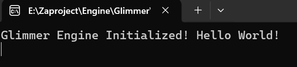

当我们按下 F5 时，C++ 编译器到底干了什么？

1. **编译引擎 (Build Glimmer)**：编译器首先来到 Glimmer 项目。它读取了 Application.cpp，把里面的 C++ 源码翻译成计算机认识的机器码。因为我们在 premake5.lua 中把 Glimmer 设置为了 kind "StaticLib"（静态库）。所以，编译器并没有生成一个可以双击运行的 .exe 程序，而是把所有机器码打包压缩成了一个 **Glimmer.lib** 文件（放在了隐藏的 bin 目录下）。*这就好比 Unity 官方写好了引擎的底层代码，打包成了一个巨大的 UnityEngine.dll 供你调用。*
2. **编译游戏 (Build Sandbox)**：接着，编译器来到 Sandbox 项目。它读取了 SandboxApp.cpp。当编译器看到 #include <Application.h> 时，它会去 Glimmer/src 目录下找到这个头文件（因为我们在 Premake 里配置了 includedirs）。头文件就像一本“说明书”，告诉 Sandbox：“Glimmer 引擎里确实有一个叫 Application 的类，你可以用它。”
3. **最终链接 (Linking)**：Sandbox 的代码编译完后，它只是知道了引擎长什么样，但**没有引擎的实际运行逻辑**。这时候，**链接器（Linker）**出场了！因为我们在 Premake 中写了 links { "Glimmer" }。链接器把刚刚生成的 Glimmer.lib（引擎的肉体）和 Sandbox 编译出的机器码死死地缝合在一起！最后，生成了一个完整的、包含引擎所有底层的 **Sandbox.exe**。你双击运行的，正是这个文件。

代码逻辑层面（控制权反转）

这是引擎开发中最精妙、最核心的架构设计思想：**控制反转（Inversion of Control, IoC）**。

```
// 在 SandboxApp.cpp 中 (游戏的入口点)

int main() {
    // 1. 游戏向引擎请求：给我创建一个应用实例！
    gl::Application* app = gl::CreateApplication(); 
    
    // 2. 游戏把控制权交还给引擎的 Run() 函数！
    app->Run(); 
    
    // 3. 游戏结束，清理内存
    delete app;
    return 0;
}
```

多态的威力（虚函数与指针）

```
// SandboxApp.cpp 中
gl::Application* gl::CreateApplication() {
    return new Sandbox(); // 返回的竟然是 Sandbox！
}
```

- CreateApplication 是定义在 Glimmer 引擎里的函数。它规定：**必须返回一个 gl::Application 类型的指针。**
- 但是，我们在 Sandbox 里实现这个函数时，new 出来的却是 Sandbox 类！
- **为什么可以这样？** 因为 class Sandbox : public gl::Application（Sandbox 继承了 Application）。
- 这就是 C++ 的多态性（Polymorphism）。引擎拿到这个指针后，以为自己在操作一个普通的 Application，但实际上它在操作你写的 Sandbox 游戏！这就允许引擎在未来去调用 Sandbox 重写的那些虚函数（比如 virtual void OnUpdate()）。

**引擎被打包成了库 -> 游戏链接了这个库 -> 游戏在** **main** **函数里把控制权上交给了引擎 -> 引擎开始死循环接管世界！**

## 入口点

目前的 main 函数写在 SandboxApp.cpp 里，这意味着用户（游戏开发者）必须知道怎么初始化引擎、怎么调用 Run()，但是这都是可以再次简化的，所以创建EntryPoint.h，这个文件将包含真正的 int main()。

```
#pragma once

#ifdef GL_PLATFORM_WINDOWS

extern gl::Application* gl::CreateApplication();

int main(int argc, char** argv)
{
    auto app = gl::CreateApplication();

    app->Run();

    delete app;
}

#endif
```

以及最重要的注入宏定义，不然等于没写，可以在visual studio每个项目加入预处理器定义，这里我采用在premake.lua脚本添加

```
workspace "GlimmerEngine"
    -- ... (前面的配置不变) ...

-- 1. 引擎项目
project "Glimmer"
    -- ... (前面的配置不变) ...

    -- 【新增】：告诉编译器，如果我们是在 Windows 上编译，就定义 GL_PLATFORM_WINDOWS
    filter "system:windows"
        systemversion "latest"
        defines {
            "GL_PLATFORM_WINDOWS",
            "GL_BUILD_DLL" -- 预留，虽然我们现在是静态库
        }

-- 2. 沙盒项目
project "Sandbox"
    -- ... (前面的配置不变) ...

    -- 【新增】：沙盒也需要知道自己是在 Windows 上
    filter "system:windows"
        systemversion "latest"
        defines {
            "GL_PLATFORM_WINDOWS"
        }
```

## 日志系统

首先引入子模块

```
git submodule add https://github.com/gabime/spdlog.git Glimmer/vendor/spdlog
```

然后告诉premake引擎现在需要包含这个新文件夹

```
project "Glimmer"
    -- ... 其他配置不变 ...
    includedirs {
        "%{prj.name}/src",
        "%{prj.name}/vendor/spdlog/include" -- 新增这一行
    }
    
        includedirs {
        "Glimmer/src", -- 沙盒需要引用引擎的代码
        "Glimmer/vendor/spdlog/include"
    }
```

新建 Log.h 和 Log.cpp

```
#pragma once
#include "spdlog/spdlog.h"
#include <memory>

namespace gl {
	class Log
	{
    public:
        static void Init();
        inline static std::shared_ptr<spdlog::logger>& GetCoreLogger() { return s_CoreLogger; }
        inline static std::shared_ptr<spdlog::logger>& GetClientLogger() { return s_ClientLogger; }
    private:
        static std::shared_ptr<spdlog::logger> s_CoreLogger;
        static std::shared_ptr<spdlog::logger> s_ClientLogger;
	};
};

```

https://github.com/gabime/spdlog/wiki/Custom-formatting在wiki中可以查看格式设置

```
#include "Log.h"
#include "spdlog/sinks/stdout_color_sinks.h"

namespace gl {
    std::shared_ptr<spdlog::logger> Log::s_CoreLogger;
    std::shared_ptr<spdlog::logger> Log::s_ClientLogger;

    void Log::Init() {
        spdlog::set_pattern("%^[%T] %n: %v%$"); // 设置日志格式：时间-名称-内容
        s_CoreLogger = spdlog::stdout_color_mt("GLIMMER");
        s_CoreLogger->set_level(spdlog::level::trace);

        s_ClientLogger = spdlog::stdout_color_mt("APP");
        s_ClientLogger->set_level(spdlog::level::trace);
    }
}
```

出现'Unicode support requires compiling with /utf-8'报错

这是因为中文版 Windows 的 Visual Studio (MSVC) 使用的是 GBK（或者叫 System Codepage）编码。当 spdlog 发现你没有开启 UTF-8 支持时，它就会通过 static_assert 故意让编译失败，以防你的日志输出变成乱码。

修改 **premake5.lua**

```
workspace "GlimmerEngine"
    -- ... (之前的配置) ...

    -- 【新增】：为 MSVC 编译器开启 UTF-8 支持
    filter "system:windows"
        buildoptions { "/utf-8" } -- 这一行是解决报错的关键
        systemversion "latest"
        defines {
            "GL_PLATFORM_WINDOWS"
        }
```

测试

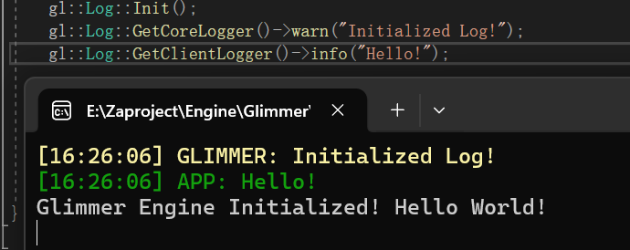

在Log.h中定义新的宏

```
// 引擎层日志宏 (Core)
#define GL_CORE_ERROR(...)  ::gl::Log::GetCoreLogger()->error(__VA_ARGS__)
#define GL_CORE_WARN(...)   ::gl::Log::GetCoreLogger()->warn(__VA_ARGS__)
#define GL_CORE_INFO(...)   ::gl::Log::GetCoreLogger()->info(__VA_ARGS__)

// 游戏层日志宏 (Client)
#define GL_ERROR(...)       ::gl::Log::GetClientLogger()->error(__VA_ARGS__)
#define GL_INFO(...)        ::gl::Log::GetClientLogger()->info(__VA_ARGS__)
```

在Log.cpp加入

```
        GL_CORE_INFO(R"(
 ****** ****** ****** ****** ****** ****** ****** ****** ****** ****** 
////// ////// ////// ////// ////// ////// ////// ////// ////// //////                                                                        
                                                                       
   ********  **       ** ****     **** ****     **** ******** *******  
  **//////**/**      /**/**/**   **/**/**/**   **/**/**///// /**////** 
 **      // /**      /**/**//** ** /**/**//** ** /**/**      /**   /** 
/**         /**      /**/** //***  /**/** //***  /**/******* /*******  
/**    *****/**      /**/**  //*   /**/**  //*   /**/**////  /**///**  
//**  ////**/**      /**/**   /    /**/**   /    /**/**      /**  //** 
 //******** /********/**/**        /**/**        /**/********/**   //**
  ////////  //////// // //         // //         // //////// //     //                                                                       
                                                                       
 ****** ****** ****** ****** ****** ****** ****** ****** ****** ****** 
////// ////// ////// ////// ////// ////// ////// ////// ////// ////// 
)");
```

这样就可以实现立体艺术字

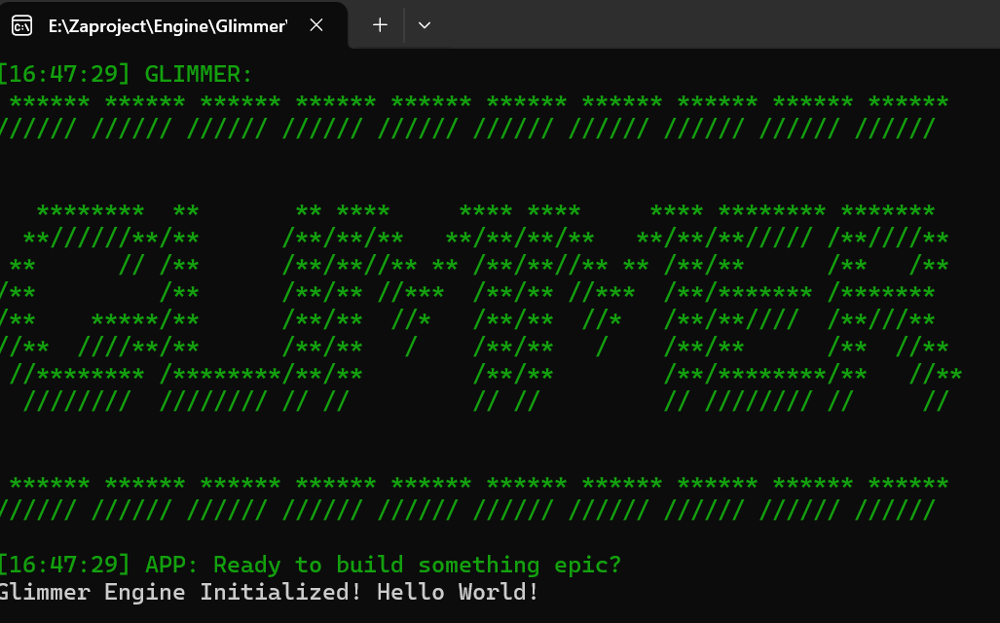

##  事件系统

在游戏引擎架构中，**事件系统（Event System）** 被称为引擎的“神经系统”。

它的核心作用是**解耦（Decoupling）**：让底层的窗口（如 GLFW 窗口）在发生动作（点击、缩放）时，不需要知道谁在处理这些动作，只需要把“信号”发出去，让上层的游戏逻辑（Sandbox）去监听并执行。

###  核心组成部分

- **EventType (枚举)**：定义具体的事件类型（如 KeyPressed, MouseButtonPressed, WindowClose）。
- **EventCategory (位掩码枚举)**：将事件分类（如 Keyboard, Mouse, Input）。一个事件可以属于多个分类（例如“按下鼠标”既属于 Mouse 也属于 Input）。
- **Event (基类)**：所有事件的祖先，定义了获取类型、分类、是否被处理（Handled）的接口。
- **EventDispatcher (分发器)**：核心逻辑。它像一个过滤器，根据事件的类型，把它交给正确的函数去处理

```
#pragma once
#include "Core.h"  // 我们需要在这里定义位操作宏

namespace gl {

    // 事件类型枚举
    enum class EventType {
        None = 0,
        WindowClose, WindowResize, WindowFocus, WindowLostFocus, WindowMoved,
        AppTick, AppUpdate, AppRender,
        KeyPressed, KeyReleased, KeyTyped,
        MouseButtonPressed, MouseButtonReleased, MouseMoved, MouseScrolled
    };

    // 事件分类（使用位移操作，方便一个事件属于多个分类）
    enum EventCategory {
        None = 0,
        EventCategoryApplication = BIT(0),
        EventCategoryInput = BIT(1),
        EventCategoryKeyboard = BIT(2),
        EventCategoryMouse = BIT(3),
        EventCategoryMouseDevice = BIT(4)
    };

    // 为了方便子类实现，定义的辅助宏
#define EVENT_CLASS_TYPE(type) static EventType GetStaticType() { return EventType::##type; }\
                               virtual EventType GetEventType() const override { return GetStaticType(); }\
                               virtual const char* GetName() const override { return #type; }

#define EVENT_CLASS_CATEGORY(category) virtual int GetCategoryFlags() const override { return category; }

    // 事件基类
    class Event {
    public:
        bool Handled = false; // 如果被处理了，就不再传给下一层

        virtual EventType GetEventType() const = 0;
        virtual const char* GetName() const = 0;
        virtual int GetCategoryFlags() const = 0;
        virtual std::string ToString() const { return GetName(); }

        // 检查该事件是否属于某个分类
        inline bool IsInCategory(EventCategory category) {
            return GetCategoryFlags() & category;
        }
    };

    // 事件分发器：根据类型执行对应的函数
    class EventDispatcher {
        template<typename T>
        using EventFn = std::function<bool(T&)>;
    public:
        EventDispatcher(Event& event) : m_Event(event) {}

        template<typename T>
        bool Dispatch(EventFn<T> func) {
            if (m_Event.GetEventType() == T::GetStaticType()) {
                m_Event.Handled = func(*(T*)&m_Event);
                return true;
            }
            return false;
        }
    private:
        Event& m_Event;
    };

    // 方便 spdlog 直接打印事件对象
    inline std::ostream& operator<<(std::ostream& os, const Event& e) {
        return os << e.ToString();
    }
}
```

 Core.h，用来放引擎最基础的宏定义

```
#pragma once

// BIT(x) 宏： 1 << 0 = 1, 1 << 1 = 2, 1 << 2 = 4...
// 用于 EventCategory 的位掩码判定
#define BIT(x) (1 << x)
```

同理编写各种事件，目前包含KeyEvent、MoudeEvent、ApplicationEvent，这里需要注意头文件的作用情况

```
#pragma once
#include "Glimmer/Events/Event.h"

namespace gl {

    class KeyEvent : public Event {
    public:
        inline int GetKeyCode() const { return m_KeyCode; }
        EVENT_CLASS_CATEGORY(EventCategoryKeyboard | EventCategoryInput)
    protected:
        KeyEvent(int keycode) : m_KeyCode(keycode) {}
        int m_KeyCode;
    };

    class KeyPressedEvent : public KeyEvent {
    public:
        KeyPressedEvent(int keycode, int repeatCount)
            : KeyEvent(keycode), m_RepeatCount(repeatCount) {}

        inline int GetRepeatCount() const { return m_RepeatCount; }

        std::string ToString() const override {
            std::stringstream ss;
            ss << "KeyPressedEvent: " << m_KeyCode << " (" << m_RepeatCount << " repeats)";
            return ss.str();
        }

        EVENT_CLASS_TYPE(KeyPressed)
    private:
        int m_RepeatCount;
    };
}#pragma once
#include "Glimmer/Events/Event.h"

namespace gl {

    class KeyEvent : public Event {
    public:
        inline int GetKeyCode() const { return m_KeyCode; }
        EVENT_CLASS_CATEGORY(EventCategoryKeyboard | EventCategoryInput)
    protected:
        KeyEvent(int keycode) : m_KeyCode(keycode) {}
        int m_KeyCode;
    };

    class KeyPressedEvent : public KeyEvent {
    public:
        KeyPressedEvent(int keycode, int repeatCount)
            : KeyEvent(keycode), m_RepeatCount(repeatCount) {}

        inline int GetRepeatCount() const { return m_RepeatCount; }

        std::string ToString() const override {
            std::stringstream ss;
            ss << "KeyPressedEvent: " << m_KeyCode << " (" << m_RepeatCount << " repeats)";
            return ss.str();
        }

        EVENT_CLASS_TYPE(KeyPressed)
    private:
        int m_RepeatCount;
    };
}
```

最后尝试在Application调试

```
    void Application::Run() {

        WindowResizeEvent e(1920, 1080);
        GL_TRACE("{0}", e);

        while (true) {
            // 这里将是未来游戏的心脏：Game Loop
        }
    }
```

但是出现报错

```
1>E:\Zaproject\Engine\Glimmer\Glimmer\vendor\spdlog\include\spdlog\fmt\bundled\base.h(2310,45): error C2079: “_”使用未定义的 struct“fmt::v12::detail::type_is_unformattable_for<T,char>”
1>        with
1>        [
1>            T=gl::WindowResizeEvent
1>        ]
```

回头检查了很多次，很奇怪，宏就是无法识别e作为传输对象，只有加上ToString才可以通过

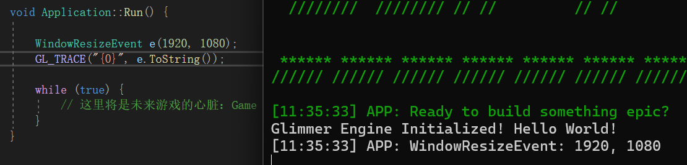

查了一些资料，找到了原因：fmt 12+（新版）不认识你的 Event 类，不知道怎么格式化它

需要**在 Event.h 末尾**加一段 fmt 格式化支持代码

```
#include <spdlog/fmt/fmt.h>

template<typename T>
struct fmt::formatter<T, std::enable_if_t<std::is_base_of_v<gl::Event, T>, char>>
    : fmt::formatter<std::string>
{
    auto format(const T& e, format_context& ctx) const
    {
        return formatter<std::string>::format(e.ToString(), ctx);
    }
};
```

之后就不会进行报错

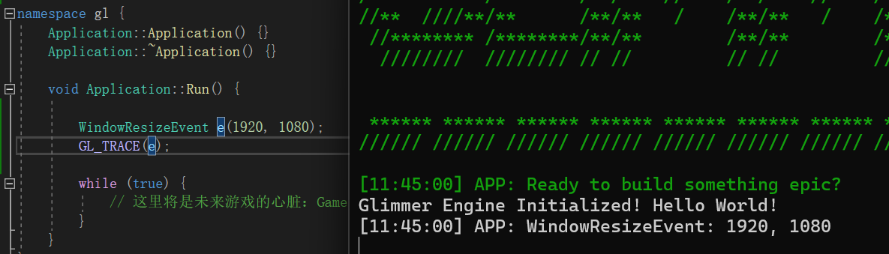

## 预编译头文件 (PCH)

在上一节的事件系统可以看到，如果你使用了某个标准库的功能（比如 std::function）却没有包含对应的头文件（<functional>），编译器会变得非常混乱。它不认识 std::function，导致后面的**模板解析全部失败**，进而引发了一连串莫名其妙的错误（甚至连 spdlog 和系统的 <ratio> 库都会跟着报废）。这在之后模块越来越多的情况下是难以进行管理的，因此为了彻底解决“漏掉头文件”的问题并大幅提升编译速度，正式引入“预编译头文件 (PCH)”

在 Glimmer/src 下创建 glpch.h。把所有常用的标准库全放进去。

```
#pragma once

#include <iostream>
#include <memory>
#include <utility>
#include <algorithm>
#include <functional>

#include <string>
#include <sstream>
#include <vector>
#include <unordered_map>
#include <unordered_set>

#ifdef GL_PLATFORM_WINDOWS
#include <Windows.h>
#endif
```

在 Glimmer/src 下创建 glpch.cpp。
*(注意：这是给 Visual Studio 用的，它需要一个空的源文件来触发编译 PCH)*。

```
#include "glpch.h"
```

修改 premake5.lua 启用 PCH，需要告诉 Premake 哪个是 PCH 文件。

```
project "Glimmer"
    -- ... 之前的配置 ...

    pchheader "glpch.h" -- 告诉编译器 PCH 的名字
    pchsource "Glimmer/src/glpch.cpp" -- 只有 Glimmer 项目需要这个源文件

    files {
        "%{prj.name}/src/**.h",
        "%{prj.name}/src/**.cpp",
    }
    -- ...
```

**所有属于 Glimmer 项目内部的 .cpp 源文件**（即 Glimmer/src 下的所有文件），都**必须**在第一行写上 #include "glpch.h"。

- **原因**：你在 Premake 里为 Glimmer 项目开启了 PCH。如果编译器在 Glimmer 项目的 .cpp 文件里第一行没看到这个头文件，它就会报错（报错代码通常是 C1010）。

**绝对不要包含 glpch.h 的文件**

1. 引擎内部的 .h 头文件 (重要！)

   **永远不要在 .h 文件里 #include "glpch.h"。**

   **原因**：头文件是被别人引用的。如果你在 Event.h 里写了 glpch.h，而外部的 Sandbox 项目引用了 Event.h，但 Sandbox 没有配置这个 PCH，它就会报错找不到 glpch.h。

   **做法**：在 .h 里，如果你需要 std::string，就直接包含 #include <string>。

2. Sandbox 项目的所有文件

   **绝对不要在 Sandbox 里的任何文件包含 glpch.h。**

   **原因**：glpch.h 是属于 Glimmer 引擎项目的内部私有财产。Sandbox 是另一个独立的工程，它有自己的编译环境。它甚至不需要 PCH，或者它可能有自己的一套 sandpch.h。

启用过后编译速度真起飞了

## 窗口和GLFW

引入 **GLFW** 是 Glimmer 引擎从“控制台黑框框”向“真正的图形化软件”跨越的关键一步。

我们将遵循工业级引擎的开发模式：**不要直接在 Application 里写 GLFW 代码**，而是先建立一个**窗口抽象层（Window Abstraction）**。这样未来你想把底层换成 DirectX 或支持手机端时，只需要增加一个实现类，而不需要改动引擎核心逻辑。

添加子模块

```
git submodule add https://github.com/glfw/glfw.git .\Glimmer\vendor\GLFW
```

在 **Glimmer/vendor/GLFW/** 目录下新建文件 **premake5.lua**：


**修改 premake5.lua**：
我们需要告诉 Glimmer 项目去哪里找 GLFW。

```
-- Glimmer 项目配置中增加：
project "Glimmer"
    -- ...
    includedirs {
        "%{prj.name}/src",
        "%{prj.name}/vendor/spdlog/include",
        "%{prj.name}/vendor/GLFW/include" -- 新增
    }

    filter "system:windows"
        systemversion "latest"
        defines { "GL_PLATFORM_WINDOWS" }
        
        -- 新增链接项
        links { 
            "GLFW", 
            "opengl32.lib" -- Windows 自带的 OpenGL 驱动库
        }

        libdirs {
            "Glimmer/vendor/GLFW/lib" -- 告诉 Premake 去哪里找 glfw3.lib
        }
```

定义窗口接口 (Window.h)

在 Glimmer/src/Glimmer 下创建 Window.h。这是一个纯虚基类，定义了所有平台窗口都必须有的功能。

**Glimmer/src/Glimmer/Window.h**:


Windows 平台的具体实现 (WindowsWindow.h/cpp)

我们在 Glimmer/src/Platform/Windows 目录下专门存放 Windows 特有的代码。

**Glimmer/src/Platform/Windows/WindowsWindow.h**:


实现窗口初始化 (WindowsWindow.cpp)

在这里，我们将调用 GLFW 的 API 来真正弹出一个窗口，并设置 **VSync（垂直同步）**。

**Glimmer/src/Platform/Windows/WindowsWindow.cpp**:


在 Application 中接入窗口

**Glimmer/src/Glimmer/Application.h**:

```
    private:
        std::unique_ptr<Window> m_Window; // 引擎持有的窗口指针
        bool m_Running = true;
```

**Glimmer/src/Glimmer/Application.cpp**:

```
// Application.cpp
#include "glpch.h"
#include "Application.h"

namespace gl {
    Application::Application() {
        m_Window = std::unique_ptr<Window>(Window::Create());
    }
    Application::~Application() {}

    void Application::Run() {

        while (m_Running) {
            m_Window->OnUpdate();
        }
    }
}
```

现在运行可以生成一个全黑的窗口了！

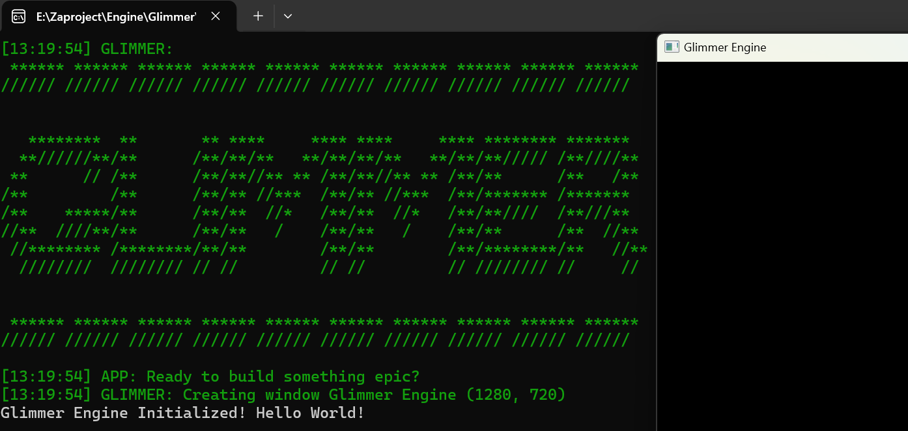

## 窗口事件

目前窗口虽然能弹出来，但它就像一个植物人，对外界的点击、缩放、关闭毫无反应。我们要利用 GLFW 的**回调（Callbacks）**机制，将系统的原生消息转化为我们之前写好的 Event 类，并传回给 Application。

在 WindowsWindow.cpp 中绑定 GLFW 回调

这是最关键的一步。GLFW 是 C 语言写的，它使用全局函数作为回调，而我们的引擎是 C++ 面向对象的。我们利用 glfwSetWindowUserPointer 将我们的 WindowData 结构体塞进 GLFW 窗口里。

修改 **WindowsWindow.cpp** 的 Init 函数：

引入三类事件文件

```
// 设置窗口缩放回调
glfwSetWindowSizeCallback(m_Window, [](GLFWwindow* window, int width, int height) {
    // 从“口袋”里掏出我们的 Data
    WindowData& data = *(WindowData*)glfwGetWindowUserPointer(window);
    data.Width = width;
    data.Height = height;

    WindowResizeEvent event(width, height);
    data.EventCallback(event); // 触发回调！
    });
```

（我们在之后通过 glfwSetWindowUserPointer 和 glfwGetWindowUserPointer 获取了 m_Data,并将其复制到一个名为data的引用上：WindowData& data = *(WindowData*)glfwGetWindowUserPointer(window); ） 

调用出来的 OnEvent( ) 就相当于 data.EventCallback( )，然而 OnEvent 在定义上是需要参数的，所以 data.EventCallback(event) == OnEvent(event) ,这个 event ，就是我们用占位符延缓的参数（ 这个参数被标明会在后续使用） 

在使用 Event 对象作为 OnEvent 的参数填入之后，event这个参数参与到 OnEvent 函数体内的操作中去，完成我们定义的操作。

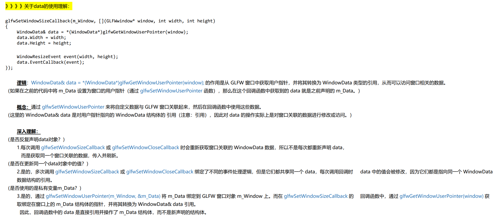

其余同理

在 Application 中接收事件

现在 WindowsWindow 会疯狂地向外发送事件，我们需要在 Application 里接住它们并决定如何处理。

**Application.h**:

```
class Application {
    public:
        // ...
        void OnEvent(Event& e); // 处理事件的中心枢纽
    private:
        bool OnWindowClose(WindowCloseEvent& e); // 专门处理关闭的逻辑
        // ...
    };
```

**Application.cpp**:

```
// 在构造函数里绑定回调
Application::Application() {
    m_Window = std::unique_ptr<Window>(Window::Create());
    
    // 使用 Lambda 表达式把事件传给 OnEvent
    m_Window->SetEventCallback([this](Event& e) {
        this->OnEvent(e);
    });
}

void Application::OnEvent(Event& e) {
    // 1. 打印所有事件（调试用）
    GL_CORE_TRACE("{0}", e.ToString());

    // 2. 使用分发器处理特定事件
    EventDispatcher dispatcher(e);
    // 如果是关闭窗口事件，就执行 OnWindowClose 函数
    dispatcher.Dispatch<WindowCloseEvent>([this](WindowCloseEvent& event) {
        return this->OnWindowClose(event);
    });
}

bool Application::OnWindowClose(WindowCloseEvent& e) {
    m_Running = false; // 停止 while 循环，优雅退出
    return true;
}
```

```
m_Window->SetEventCallback([this](Event& e) {
    this->OnEvent(e);
});
```

- **原理**：编译器会为你自动生成一个匿名的“闭包”类。[this] 表示通过值捕获当前对象的指针，使得 Lambda 内部可以访问成员函数。

  **性能更好**：编译器更容易对 Lambda 进行内联（Inline）优化。它不涉及复杂的包装转换，几乎没有额外开销。

  **更直观**：代码一眼就能看出逻辑——“当事件 e 发生时，执行 this->OnEvent(e)”。

  **调试友好**：在断点调试时，堆栈信息比 std::bind 简单得多。

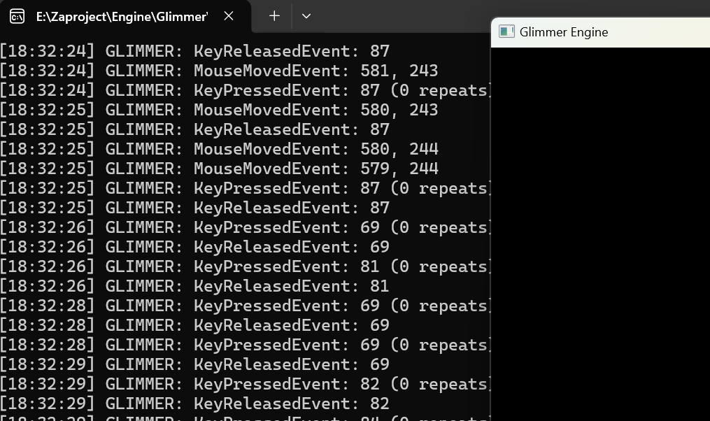

## 图层(Layer)

在游戏引擎开发中，**图层（Layer）** 是组织游戏逻辑的核心架构。

想象一下：你的游戏有背景地图、玩家角色、敌人、以及顶层的 UI 菜单和调试信息。如果不分层，所有的代码都会堆在 Application::Run 的死循环里，变得无法维护。

**图层系统的目的：** 把引擎的一帧拆解成多个有序的步骤，并让事件（如鼠标点击）能从上往下传递（UI 层先接住，如果 UI 没拦截，再传给游戏层）。

定义图层基类 (Layer.h)

在 Glimmer/src/Glimmer 下创建 Layer.h。

**Layer.h**:

```
#pragma once

#include "Glimmer/Core.h"
#include "Glimmer/Events/Event.h"

namespace gl {

    class Layer {
    public:
        Layer(const std::string& name = "Layer");
        virtual ~Layer();

        virtual void OnAttach() {}    // 当图层被推入引擎时调用（类似 Start）
        virtual void OnDetach() {}    // 当图层被移除时调用
        virtual void OnUpdate() {}    // 每帧调用（类似 Update）
        virtual void OnEvent(Event& event) {} // 当事件发生时调用

        inline const std::string& GetName() const { return m_DebugName; }
    protected:
        std::string m_DebugName; // 用于调试的名字
    };

}
```

**Layer.cpp**:

```
#include "glpch.h"
#include "Layer.h"

namespace gl {
    Layer::Layer(const std::string& name) : m_DebugName(name) {}
    Layer::~Layer() {}
}
```

实现图层栈 (LayerStack.h/cpp)

图层栈负责管理图层的顺序。在 Glimmer 中，我们把图层分为两类：

1. **普通图层 (Layers)**：放在栈的前半部分（如关卡、背景）。
2. **覆盖层 (Overlays)**：永远放在栈的最后面（如 UI、控制台），保证它们始终在最上层。

**LayerStack.h**:

```
#pragma once

#include "glpch.h"
#include "Layer.h"

namespace gl {

    class LayerStack {
    public:
        LayerStack();
        ~LayerStack();

        void PushLayer(Layer* layer);
        void PushOverlay(Layer* overlay);
        void PopLayer(Layer* layer);
        void PopOverlay(Layer* overlay);

        // 为了方便循环遍历
        std::vector<Layer*>::iterator begin() { return m_Layers.begin(); }
        std::vector<Layer*>::iterator end() { return m_Layers.end(); }
    private:
        std::vector<Layer*> m_Layers;
        unsigned int m_LayerInsertIndex = 0; // 用于追踪普通图层应该插在哪里
    };

}
```

**LayerStack.cpp**:

```
#include "glpch.h"
#include "LayerStack.h"

namespace gl {

    LayerStack::LayerStack() {}

    LayerStack::~LayerStack() {
        for (Layer* layer : m_Layers)
            delete layer;
    }

    void LayerStack::PushLayer(Layer* layer) {
        // 普通图层插入到 Index 位置，Index 后移
        m_Layers.emplace(m_Layers.begin() + m_LayerInsertIndex, layer);
        m_LayerInsertIndex++;
    }

    void LayerStack::PushOverlay(Layer* overlay) {
        // 覆盖层直接插在末尾
        m_Layers.emplace_back(overlay);
    }

    void LayerStack::PopLayer(Layer* layer) {
        auto it = std::find(m_Layers.begin(), m_Layers.end(), layer);
        if (it != m_Layers.end()) {
            m_Layers.erase(it);
            m_LayerInsertIndex--;
        }
    }

    void LayerStack::PopOverlay(Layer* overlay) {
        auto it = std::find(m_Layers.begin(), m_Layers.end(), overlay);
        if (it != m_Layers.end())
            m_Layers.erase(it);
    }
}
```

在 Application 中集成

现在我们要让 Application 拥有这个栈，并在每帧去更新它，在每个事件去分发它。

**Application.h**:

```
// ... 增加引用 ...
#include "Glimmer/LayerStack.h"

    class Application {
    public:
        void PushLayer(Layer* layer);
        void PushOverlay(Layer* overlay);
        // ...
    private:
        LayerStack m_LayerStack;
        // ...
    };
```

随后在**Application.cpp**:实现函数

注意顺序

```
// 核心逻辑：事件倒序分发
// 为什么要倒序？因为最上层（UI）在 vector 的末尾，它们应该先处理事件
for (auto it = m_LayerStack.end(); it != m_LayerStack.begin(); ) {
    (*--it)->OnEvent(e);
    if (e.Handled) // 如果事件被某一层拦截了，直接停止传递
        break;
}
```

```
void Application::Run() {

    while (m_Running) {
        // 核心逻辑：正序更新
        // 先渲染背景，再渲染玩家，最后渲染 UI
        for (Layer* layer : m_LayerStack)
            layer->OnUpdate();

        m_Window->OnUpdate();
    }
}
```

在 Sandbox 中测试

在 SandboxApp.cpp 里创建一个测试图层：

```
class ExampleLayer : public gl::Layer {
public:
    ExampleLayer() : Layer("Example") {}

    void OnUpdate() override {
         GL_INFO("ExampleLayer::Update");
    }

    void OnEvent(gl::Event& event) override {
        GL_TRACE("{0}", event.ToString());
    }
};

class Sandbox : public gl::Application {
public:
    Sandbox() {
        std::cout << "Glimmer Engine Initialized! Hello World!" << std::endl;
        //在这里激活
        PushLayer(new ExampleLayer());
    }
    ~Sandbox() {}
};
```

运行可以看到，Example层一直在更新，但同时也会监听其他操作

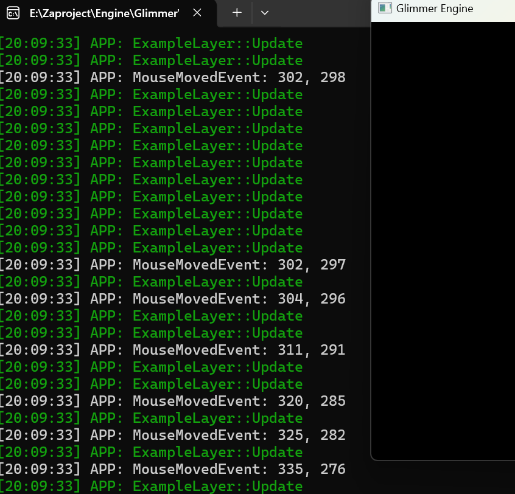

## Glad

**GLAD** 是 Glimmer 引擎与显卡驱动之间的“翻译官”。OpenGL 的函数实现是在显卡驱动里的，C++ 默认找不到它们。GLAD 的作用就是**加载所有 OpenGL 函数的指针**，让你能写出 glClear、glDrawArrays 这些指令。

我们要遵循**高度解耦**的架构：创建一个 GraphicsContext（图形上下文）接口。这样以后如果你想把 OpenGL 换成 Vulkan，只需要换一个 Context 实现，而不必拆掉整个窗口系统。

**获取 GLAD 源代码**

1. 访问 [GLAD 在线生成器](https://glad.dav1d.de/)。
2. **Language**: C/C++
3. **API**: gl Version **4.6** (或者 4.5，确保选 **Core** 模式)。
4. 点击 **Generate**，下载生成的 ZIP 包。
5. **物理存放**：将 include/glad 和 include/KHR 文件夹放入 Glimmer/vendor/Glad/include。将 src/glad.c 放入 Glimmer/vendor/Glad/src。

**为 Glad 编写 Premake 脚本**

因为 Glad 包含一个 .c 文件，我们需要把它编译进引擎。

在 **Glimmer/vendor/Glad/** 目录下新建 **premake5.lua**：

```
project "Glad"
    kind "StaticLib"
    language "C"
    staticruntime "on"

    targetdir ("bin/" .. outputdir .. "/%{prj.name}")
    objdir ("bin-int/" .. outputdir .. "/%{prj.name}")

    files {
        "include/glad/glad.h",
        "include/KHR/khrplatform.h",
        "src/glad.c"
    }

    includedirs {
        "include"
    }

    filter "system:windows"
        systemversion "latest"
```

修改根目录的 **premake5.lua**：

1. 在 include "Glimmer/vendor/GLFW" 下面增加 include "Glimmer/vendor/Glad"。
2. 在 Glimmer 项目的 includedirs 中增加 "%{prj.name}/vendor/Glad/include"。
3. 在 Glimmer 项目的 links 中增加 "Glad"。

**运行 GenerateProject.bat。**

修改WindowsWindow.cpp进行测试

在WindowsWindow更新了

```
m_Window = glfwCreateWindow((int)props.Width, (int)props.Height, m_Data.Title.c_str(), nullptr, nullptr);
glfwMakeContextCurrent(m_Window);
int status = gladLoadGLLoader((GLADloadproc)glfwGetProcAddress);

glfwSetWindowUserPointer(m_Window, &m_Data);
SetVSync(true);
```

报错1>E:\Zaproject\Engine\Glimmer\Glimmer\vendor\Glad\include\glad\glad.h(27,1): fatal  error C1189: #error:  OpenGL header already included, remove this include, glad already provides it

**报错原因**：
GLAD 和 GLFW 都在争夺对 OpenGL 头文件的控制权。

1. GLAD 必须在**最前面**被包含，因为它定义了所有的 OpenGL 函数。
2. GLFW 默认也会自动包含一个标准的 GL.h。
3. 如果你先包含了 GLFW/glfw3.h 再包含 glad/glad.h，或者在同一个文件里它们顺序反了，就会触发 GLAD 源码里的那个 #error 保护机制。

可以

```
// WindowsWindow.h 或 WindowsWindow.cpp 的顶部
#include <glad/glad.h>   // 1. GLAD 永远在第一位
#define GLFW_INCLUDE_NONE // 2. 告诉 GLFW 别带上默认的 OpenGL 头文件
#include <GLFW/glfw3.h>  // 3. 然后再包含 GLFW
```

不加宏定义也行，只是要保证顺序

断点调试结果保证正常运行

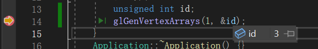

## ImGui

集成 **Dear ImGui** 是 Glimmer 引擎开发中里程碑式的一步。它不仅能让你画出各种调试滑块、性能图表，更是未来**可视化编辑器**的基石。

按照 Glimmer 的架构，我们将 ImGui 作为一个特殊的 **Overlay（覆盖层）** 插入图层栈。这样它就能永远显示在游戏画面最顶端，并且优先拦截鼠标/键盘事件。

```
git submodule add -b docking https://github.com/ocornut/imgui.git Glimmer/vendor/imgui
```

> *-b docking* *分支。这个分支支持“窗口停靠”和“多视图”功能，是做引擎编辑器的标准选择。*

为 ImGui 编写 Premake 脚本

ImGui 本身只是源码，我们需要告诉 Premake 如何编译它的核心代码以及对应的 **GLFW** 和 **OpenGL3** 后端。

在 **Glimmer/vendor/imgui/** 目录下新建 **premake5.lua**：

并**修改根目录的 premake5.lua：**

1. 在 include "Glimmer/vendor/Glad" 下增加 include "Glimmer/vendor/imgui"。
2. 在 Glimmer 项目的 includedirs 中增加 "%{prj.name}/vendor/imgui" 和 "%{prj.name}/vendor/imgui/backends"。
3. 在 Glimmer 项目的 links 中增加 "ImGui"。

**运行 GenerateProject.bat。**


**在 Application 中渲染 ImGui**

现代引擎通常不在 Layer::OnUpdate 里直接画 UI，而是在主循环里专门留出一个位置。

**Application.cpp 改动**：


为了让 ImGuiLayer 能顺利初始化，我们需要让它能访问到全局的 Application 实例，以及底层的 GLFWwindow 指针。

1. 修改 Window.h (暴露原生窗口指针)

   ```
   // Glimmer/src/Glimmer/Window.h
   namespace gl {
       // ...
       class Window {
       public:
           // ... 其他虚函数
           virtual void* GetNativeWindow() const = 0; // 【新增】：返回底层窗口句柄
       };
   }
   ```

2. 修改 WindowsWindow.h (实现接口)

   ```
   // Glimmer/src/Platform/Windows/WindowsWindow.h
   namespace gl {
       class WindowsWindow : public Window {
       public:
           // ...
           inline virtual void* GetNativeWindow() const override { return m_Window; } // 【新增】
       };
   }
   ```

3. 修改 Application.h (实现单例模式)

4. 修改 Application.cpp (初始化单例)

   ```
   namespace gl {
       Application* Application::s_Instance = nullptr; // 【新增】：定义静态变量
   
       Application::Application() {
           GL_CORE_ASSERT(!s_Instance, "Application already exists!"); // 防止实例化多次
           s_Instance = this; // 【新增】：把自己存入单例
   ```

**编写 ImGuiLayer (完整的 UI 渲染层)**

在 Glimmer/src/Glimmer/ImGui 目录下创建这两个文件。

1. ImGuiLayer.h，为了给cpp调用，需要重载Layer里的函数

   ```
   #pragma once
   #include "Glimmer/Layer.h"
   
   namespace gl {
       class ImGuiLayer : public Layer {
       public:
           ImGuiLayer();
           ~ImGuiLayer();
   
           virtual void OnAttach() override;
           virtual void OnDetach() override;
           virtual void OnUpdate() override;
           virtual void OnEvent(Event& event) override;
   
           virtual void OnImGuiRender() override;
   
           void Begin(); // 每帧开始前呼叫
           void End();   // 每帧结束后呼叫
       private:
           float m_Time = 0.0f;
       };
   }
   ```

2. cpp代码过长，简要说明：代码实现了一个 ImGui 的引擎层封装（ImGuiLayer），把 Dear ImGui 完整接入到你的引擎生命周期中。核心逻辑是：在 `OnAttach` 中创建 ImGui 上下文并开启键盘控制、Docking 和多窗口 Viewport 等高级功能，同时通过 GLFW 获取原生窗口并初始化 ImGui 的 GLFW + OpenGL 后端；在每一帧通过 `Begin` 和 `End` 控制 ImGui 的更新与渲染流程，其中 `End` 负责将 UI 绘制数据提交给 OpenGL，并在开启多窗口时处理额外的平台窗口渲染和上下文切换；在 `OnDetach` 中则完整释放 ImGui 相关资源。整体上，这段代码把 UI 系统封装成引擎的一个独立 Layer，使 UI 渲染流程与游戏逻辑解耦，并为后续实现类似 Unity 的编辑器（可拖拽面板、多窗口界面）提供基础。

最后打开 SandboxApp.cpp，在 ExampleLayer 中重写 OnImGuiRender：


回头来看全过程：

我们将 ImGui 的集成分为 **资源导入、项目构建、层级集成、渲染循环** 四个阶段：

1. **资源获取（Submodule）**：
   使用 Git 子模块拉取 ImGui 的 docking 分支。这个分支不仅支持窗口停靠，还支持 **Viewports**（允许 UI 拖出主窗口），是做现代引擎编辑器的必备选择。
2. **项目构建（Premake）**：
   由于 ImGui 是以源代码形式分发的，我们编写了一个专门的 premake5.lua。关键点在于包含 backends 文件夹下的 imgui_impl_glfw.cpp 和 imgui_impl_opengl3.cpp，并将它们编译成一个静态库（StaticLib），链接到我们的 Glimmer 引擎中。
3. **图层抽象（ImGuiLayer）**：
   我们创建了一个 ImGuiLayer 类，继承自引擎的 Layer 基类。**OnAttach**：执行 ImGui 的初始化（创建上下文、开启 Docking/Viewports 标志位、初始化 GLFW 和 OpenGL 后端）。**OnDetach**：执行清理工作。
4. **渲染管线集成（The Loop）**：
   在 Application::Run 的主循环中，我们将 UI 渲染独立出来。每帧执行：m_ImGuiLayer->Begin()：开启 ImGui 新帧，处理输入轮询。调用所有 Layer 的 OnImGuiRender()：让每个游戏模块能在此处编写自己的调试 UI。m_ImGuiLayer->End()：执行渲染并将数据交给 GPU，同时处理 **Multi-Viewport** 的上下文切换（Context Switching），保证弹出窗口的正确渲染。

相关机制

- **架构层面的解耦设计**
  “在集成过程中，我采用了 **Backend-Agnostic（后端无关）** 的设计思路。ImGui 的核心代码与具体的图形 API 是分离的。虽然我目前使用的是 GLFW 和 OpenGL3 组合，但我将其封装在 ImGuiLayer 中，并通过 Application::Get().GetWindow().GetNativeWindow() 获取原生句柄。这种设计保证了如果未来将 Glimmer 升级到 Vulkan 或 DX12，我只需要更换 ImGuiLayer 内部的实现细节，而不需要触动任何上层 UI 代码。”
- **针对多视口（Viewports）的特殊处理**
  “为了实现类似 Unity 那种可以将窗口拖出主程序的体验，我开启了 ImGuiConfigFlags_ViewportsEnable。这引入了一个难点：**OpenGL 上下文管理**。在 End() 函数中，ImGui 需要在多个 OS 窗口间切换渲染上下文。我实现的逻辑是：在处理完额外视口后，必须通过 glfwMakeContextCurrent 强制将 Context 还原回引擎主窗口，否则主循环后续的 SwapBuffers 会作用在错误窗口导致崩溃。这体现了对图形 API 状态机机制的理解。”
- **事件系统与 UI 的冲突处理（劫持机制）**
  “目前我正在完善 UI 对事件的**拦截机制**。即当鼠标悬浮在 ImGui 窗口上时，通过检查 io.WantCaptureMouse 标志位，由 ImGuiLayer 设置 Event.Handled = true。这样可以确保玩家在点击 UI 按钮时，不会误触发背后游戏世界的攻击动作。这证明了我对引擎内‘从顶层向底层分发事件’这一流向的准确控制。”

## 接入ImGui事件

接入 ImGui 事件是让引擎从“只能看”变成“能交互”的关键。

目前，你的 WindowsWindow 捕获了系统事件并分发给了 Application。但 ImGui 作为一个独立的库，它也需要知道鼠标在哪、哪个键按下了。

最重要的是，我们要实现 **“事件拦截（Event Blocking）”**：当点击 ImGui 的按钮时，鼠标点击事件应该在 UI 层就被消耗掉，不应该传给底层的游戏角色

BIND_EVENT_FN

这个宏的作用是简化 std::bind 的写法，让你在绑定事件函数时不需要每次都写那长长的一串。

**请在 Glimmer/src/Glimmer/Core.h 中添加如下代码：**

```
#pragma once

#include <memory>

// ... 之前的 BIT(x) 和断言宏 ...

// ✨ 添加这个宏定义
#define BIND_EVENT_FN(x) std::bind(&x, this, std::placeholders::_1)

// ...
```

我们需要利用 EventDispatcher 将 Glimmer 的事件转化为 ImGui 的输入状态。

修改 **Glimmer/src/Glimmer/ImGui/ImGuiLayer.cpp** 的 OnEvent 函数及其配套的处理函数：

```
void ImGuiLayer::OnEvent(Event& event)
{
    // 如果你希望 UI 拦截所有事件，可以在这里根据 ImGui 的状态设置 event.Handled
    ImGuiIO& io = ImGui::GetIO();
    
    // 核心逻辑：如果 ImGui 想要捕获鼠标/键盘，就标记事件已处理
    // 这样事件就不会传给下层的 GameLayer 了
    event.Handled |= event.IsInCategory(EventCategoryMouse) & io.WantCaptureMouse;
    event.Handled |= event.IsInCategory(EventCategoryKeyboard) & io.WantCaptureKeyboard;

    // 以下是手动将 Glimmer 事件喂给 ImGui 的逻辑（如果你使用的是手动对接模式）
    EventDispatcher dispatcher(event);
    dispatcher.Dispatch<MouseButtonPressedEvent>(BIND_EVENT_FN(ImGuiLayer::OnMouseButtonPressedEvent));
    dispatcher.Dispatch<MouseButtonReleasedEvent>(BIND_EVENT_FN(ImGuiLayer::OnMouseButtonReleasedEvent));
    dispatcher.Dispatch<MouseMovedEvent>(BIND_EVENT_FN(ImGuiLayer::OnMouseMovedEvent));
    dispatcher.Dispatch<MouseScrolledEvent>(BIND_EVENT_FN(ImGuiLayer::OnMouseScrolledEvent));
    dispatcher.Dispatch<KeyPressedEvent>(BIND_EVENT_FN(ImGuiLayer::OnKeyPressedEvent));
    dispatcher.Dispatch<KeyReleasedEvent>(BIND_EVENT_FN(ImGuiLayer::OnKeyReleasedEvent));
    dispatcher.Dispatch<KeyTypedEvent>(BIND_EVENT_FN(ImGuiLayer::OnKeyTypedEvent));
    dispatcher.Dispatch<WindowResizeEvent>(BIND_EVENT_FN(ImGuiLayer::OnWindowResizeEvent));
}

// --- 以下是具体的转换函数示例 ---

bool ImGuiLayer::OnMouseButtonPressedEvent(MouseButtonPressedEvent& e)
{
    ImGuiIO& io = ImGui::GetIO();
    io.MouseDown[e.GetMouseButton()] = true;
    return false; // 返回 false 表示不强制拦截，交给上面的 WantCapture 逻辑判断
}

bool ImGuiLayer::OnMouseMovedEvent(MouseMovedEvent& e)
{
    ImGuiIO& io = ImGui::GetIO();
    io.MousePos = ImVec2(e.GetX(), e.GetY());
    return false;
}

// ... 同理实现 KeyPressed (io.KeysDown[e.GetKeyCode()] = true) 
// ... 和 MouseScrolled (io.MouseWheel += e.GetYOffset())
```

**配置 KeyMap（在 OnAttach 中）**

为了让 ImGui 认识你的按键编号（GLFW 的编号），需要在初始化时建立映射关系。

**ImGuiLayer.cpp (OnAttach)**:

```
void ImGuiLayer::OnAttach() {
    // ... 之前的初始化代码 ...
    
    ImGuiIO& io = ImGui::GetIO();
    // 建立 KeyMap：把 ImGui 的索引映射到 GLFW 的键码
    io.KeyMap[ImGuiKey_Tab] = GLFW_KEY_TAB;
```

过程中发现这段代码io.KeysDown不能用了，找了很久方法

```
	bool ImGuiLayer::OnKeyPressedEvent(KeyPressedEvent& e)
	{
		ImGuiIO& io = ImGui::GetIO();
		io.KeysDown[e.GetKeyCode()] = true;

		io.KeyCtrl = io.KeysDown[GLFW_KEY_LEFT_CONTROL] || io.KeysDown[GLFW_KEY_RIGHT_CONTROL];
		io.KeyShift = io.KeysDown[GLFW_KEY_LEFT_SHIFT] || io.KeysDown[GLFW_KEY_RIGHT_SHIFT];
		io.KeyAlt = io.KeysDown[GLFW_KEY_LEFT_ALT] || io.KeysDown[GLFW_KEY_RIGHT_ALT];
		io.KeySuper = io.KeysDown[GLFW_KEY_LEFT_SUPER] || io.KeysDown[GLFW_KEY_RIGHT_SUPER];
		return false;
	}
```

但最后得知如果你在 OnAttach 里调用了 ImGui_ImplGlfw_InitForOpenGL(window, true)，**这里的 true 表示 ImGui 会自己去钩住 GLFW 的回调**。这样你根本不需要在 OnEvent 里手动写 OnKeyPressedEvent 这些函数。ImGui 自己会偷偷处理好一切。


WindowsWindow.cpp加入

- **KeyPressedEvent**：捕捉的是**物理按键**。比如你按下 Shift + A，它收到的是 Shift 键按下和 A 键按下。它不知道你想输入的是大写的 A。
- **KeyTypedEvent**：捕捉的是**文本输入**。它由操作系统处理，直接告诉你用户输入了字符 A。它会自动处理输入法、大小写、特殊符号。

如果你以后在引擎里想做一个**文本输入框**（比如给物体改名字、写控制台指令），没有 KeyTypedEvent 的话，你的退格键、大小写、甚至是中文输入都会出大问题。

```
glfwSetCharCallback(m_Window, [](GLFWwindow* window, unsigned int keycode)
{
    WindowData& data = *(WindowData*)glfwGetWindowUserPointer(window);

    KeyTypedEvent event(keycode);
    data.EventCallback(event);
});
```

## 输入轮询

在 Glimmer 引擎中实现**输入轮询（Input Polling）**，标志着你终于可以像在 Unity 里写 Input.GetKey(KeyCode.W) 那样，随时随地获取按键状态了。

目前你的事件系统是“被动”的（只有按键时才发通知），而输入轮询是“主动”的（随时询问状态）。这在处理角色移动等需要连续输入的场景中是必不可少的。

**创建输入抽象接口 (Input.h)**

在 Glimmer/src/Glimmer 下创建 Input.h。我们使用**单例模式（Singleton）**，但通过静态方法暴露接口，保证调用最整洁。

**Input.h**:

```
#pragma once

#include "Glimmer/Core.h"

namespace gl {

    class Input {
    public:
        // 静态接口：外部直接调用 Input::IsKeyPressed(key)
        inline static bool IsKeyPressed(int keycode) { return s_Instance->IsKeyPressedImpl(keycode); }

        inline static bool IsMouseButtonPressed(int button) { return s_Instance->IsMouseButtonPressedImpl(button); }
        inline static std::pair<float, float> GetMousePosition() { return s_Instance->GetMousePositionImpl(); }
        inline static float GetMouseX() { return s_Instance->GetMouseXImpl(); }
        inline static float GetMouseY() { return s_Instance->GetMouseYImpl(); }

    protected:
        // 由不同平台实现的受保护虚函数 (Impl = Implementation)
        virtual bool IsKeyPressedImpl(int keycode) = 0;
        virtual bool IsMouseButtonPressedImpl(int button) = 0;
        virtual std::pair<float, float> GetMousePositionImpl() = 0;
        virtual float GetMouseXImpl() = 0;
        virtual float GetMouseYImpl() = 0;

    private:
        // 静态单例指针
        static Input* s_Instance;
    };
}
```

**Windows 平台的具体实现 (WindowsInput.cpp)**

在 Glimmer/src/Platform/Windows 目录下创建 WindowsInput.h/cpp。它将直接调用 **GLFW** 的 API 来查询状态。

对外提供一个统一的 `Input` 静态接口（比如 `Input::IsKeyPressed`），但内部并不直接实现，而是通过一个静态单例指针 `s_Instance` 转发到具体平台（这里是 `WindowsInput`）去执行。也就是说，上层代码只依赖 `Input` 这个抽象接口，而真正调用的是底层用 GLFW 实现的 `WindowsInput`，例如在 `IsKeyPressedImpl` 里通过 `glfwGetKey` 轮询当前键盘状态。这样一来，你的引擎逻辑层完全不需要关心是 Windows、Mac 还是 Linux，只需要调用统一接口即可，实现了**平台解耦**。

同时，这套设计本质上是一个“**静态接口 + 单例 + 虚函数分发**”的组合：

- 静态函数保证调用方便（不用到处传对象）
- 单例保证全局唯一输入系统
- 虚函数保证不同平台可以替换实现

最终效果就是：

> 上层写 `Input::IsKeyPressed(W)`，底层自动走到 GLFW（Windows）实现，实现了干净的分层。

**在 Application 中测试**

现在，可以在任何 Layer 的 OnUpdate 中，极其方便地检测输入了。

```
    void Application::Run() {

        while (m_Running) {
            // 1. 游戏逻辑更新 (清除屏幕、移动角色等)
            for (Layer* layer : m_LayerStack)
                layer->OnUpdate();

            // 2. UI 渲染 (极其重要：必须在 Begin 和 End 之间)
            m_ImGuiLayer->Begin();
            for (Layer* layer : m_LayerStack)
                layer->OnImGuiRender(); // 调用每个图层的 UI 绘制函数
            m_ImGuiLayer->End();

            // 检测按键
            if (gl::Input::IsKeyPressed(GLFW_KEY_TAB))
                GL_TRACE("TAB 键正被按住！");

            // 检测鼠标
            if (gl::Input::IsMouseButtonPressed(0)) {
                auto [x, y] = gl::Input::GetMousePosition();
                GL_TRACE("鼠标左键点击坐标: {0}, {1}", x, y);
            }

            // 3. 交换缓冲区
            m_Window->OnUpdate();
        }
    }
```

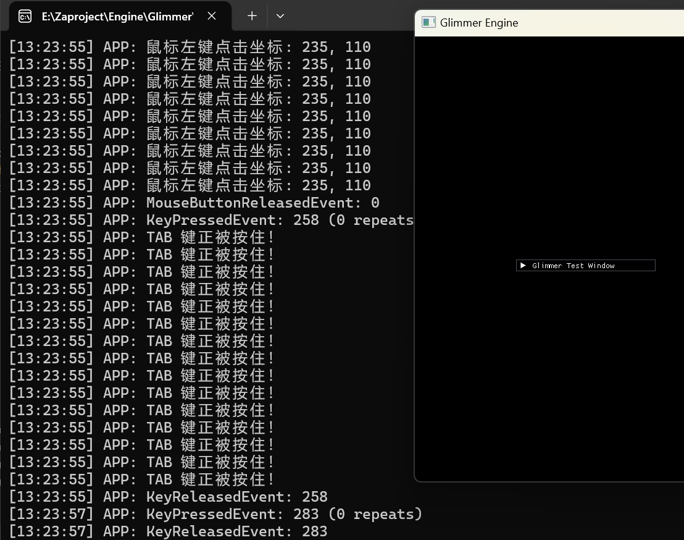

## 按键与鼠标码解耦

现在的 Sandbox 如果想判断按键，必须 #include <GLFW/glfw3.h> 并使用 GLFW_KEY_A。这违反了**依赖倒置原则**——上层游戏逻辑不应该依赖底层的实现库。

在 Glimmer/src/Glimmer 下创建 KeyCodes.h 和 MouseCodes.h。

**KeyCodes.h (部分示例)：**

```
#pragma once

// 这里的数值完全参照 GLFW，但名字变成了我们引擎自己的前缀
#define GL_KEY_SPACE           32
#define GL_KEY_APOSTROPHE      39  /* ' */
#define GL_KEY_A               65
#define GL_KEY_W               87
#define GL_KEY_S               83
#define GL_KEY_D               68
// ... (你可以从 GLFW 源码拷贝剩下的并替换前缀)
```

**MouseButtonCodes**

```
#pragma once

// From glfw3.h
#define GL_MOUSE_BUTTON_1         0
#define GL_MOUSE_BUTTON_2         1
#define GL_MOUSE_BUTTON_3         2
#define GL_MOUSE_BUTTON_4         3
#define GL_MOUSE_BUTTON_5         4
#define GL_MOUSE_BUTTON_6         5
#define GL_MOUSE_BUTTON_7         6
#define GL_MOUSE_BUTTON_8         7
#define GL_MOUSE_BUTTON_LAST      GL_MOUSE_BUTTON_8
#define GL_MOUSE_BUTTON_LEFT      GL_MOUSE_BUTTON_1
#define GL_MOUSE_BUTTON_RIGHT     GL_MOUSE_BUTTON_2
#define GL_MOUSE_BUTTON_MIDDLE    GL_MOUSE_BUTTON_3
```

**更新引擎“全家桶”头文件 (Glimmer.h)**

**作用：** 在 Unity 里，你只需要 using UnityEngine;。我们也要给 Glimmer 做一个“出口”，让用户只需要 #include <Glimmer.h> 就能用到引擎的所有核心功能。

在 Glimmer/src 下创建 **Glimmer.h**：

```
#pragma once

// 供客户端（Sandbox）使用的总头文件
#include "Glimmer/Application.h"
#include "Glimmer/Layer.h"
#include "Glimmer/Log.h"

#include "Glimmer/Input.h"
#include "Glimmer/KeyCodes.h"
#include "Glimmer/MouseButtonCodes.h"

#include "imgui.h"

// --- 入口点 (EntryPoint) ---
#include "Glimmer/EntryPoint.h"
// ----------------------------
```

SandBox

```
    void OnUpdate() override {
        // 使用我们自己的键码判断移动
        if (gl::Input::IsKeyPressed(GL_KEY_W))
            GL_TRACE("向北前进!");

    }
```

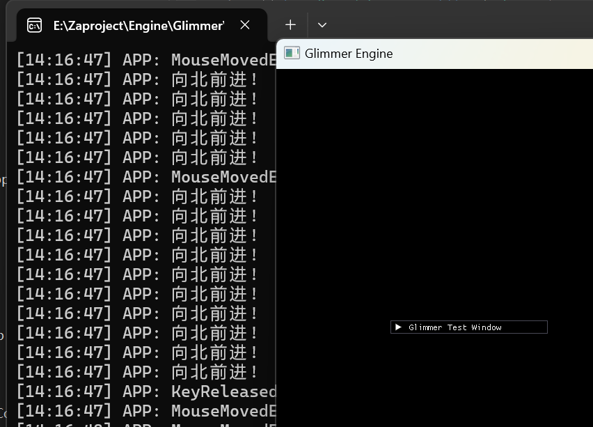

## GLM

在底层 C++ 开发中，这些数学类型都需要我们自己找库。**GLM** 是工业界的绝对标准，它的设计几乎完全模仿 **GLSL**（OpenGL 着色语言），让你在 C++ 里写数学逻辑和在 Shader 里写起来一模一样。

```
git submodule add https://github.com/g-truc/glm.git Glimmer/vendor/glm
```

**修改 Premake 配置**

由于 GLM 只是头文件，我们不需要为它写 premake5.lua 脚本，只需要把它的路径加入到 **Engine** 和 **Sandbox** 的包含目录中。

修改根目录的 **premake5.lua**：includedirs 两个项目

在Application中进行测试

```
#include <glm/vec3.hpp> // glm::vec3
#include <glm/vec4.hpp> // glm::vec4
#include <glm/mat4x4.hpp> // glm::mat4
#include <glm/gtc/matrix_transform.hpp> // glm::translate, glm::rotate, glm::scale, glm::perspective
namespace gl {
    Application* Application::s_Instance = nullptr;

    Application::Application() {
        GL_CORE_ASSERT(!s_Instance, "Application already exists!"); // 防止实例化多次
        s_Instance = this; // 【新增】：把自己存入单例
        m_Window = std::unique_ptr<Window>(Window::Create());
        // 使用 Lambda 表达式把事件传给 OnEvent
        m_Window->SetEventCallback([this](Event& e) {
            this->OnEvent(e);
            });

        m_ImGuiLayer = new ImGuiLayer();
        PushOverlay(m_ImGuiLayer); // 【新增】：把 ImGuiLayer 作为覆盖层推入栈顶

        // --- GLM 数学测试 ---
        glm::vec4 vector(1.0f, 1.0f, 1.0f, 1.0f);

        // 创建一个平移矩阵，让坐标向右移动 2 个单位
        glm::mat4 trans = glm::translate(glm::mat4(1.0f), glm::vec3(2.0f, 0.0f, 0.0f));

        // 矩阵乘法
        auto result = trans * vector;

        GL_CORE_INFO("GLM Math Test: Result X = {0}", result.x); // 应该输出 3.0
    }
```

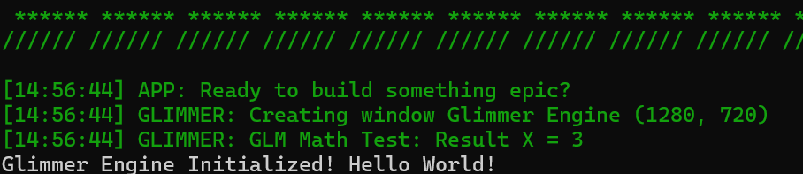

##  渲染上下文

WindowsWindow 承担了太多的责任：它既要负责打开窗口，又要负责初始化 OpenGL（调用 Glad）。

按照工业级引擎的**“解耦”**原则，我们需要引入 **渲染上下文 (Rendering Context)** 抽象层。

为什么需要这一步？

- **职责分离**：窗口只负责和操作系统（Windows/Linux）打交道；上下文只负责和图形显卡（OpenGL/Vulkan）打交道。
- **跨平台/多 API 支持**：未来如果你想支持 DirectX 或 Vulkan，你只需要增加一个新的 Context 实现类，而不需要修改 WindowsWindow.cpp。

**定义抽象基类 (GraphicsContext.h)**

在 Glimmer/src/Glimmer/Renderer 下创建 GraphicsContext.h。

**GraphicsContext.h**:

```
#pragma once

namespace gl {

    // 这是一个纯虚接口，定义了所有图形 API 上下文必须具备的功能
    class GraphicsContext {
    public:
        virtual ~GraphicsContext() = default;

        virtual void Init() = 0;        // 初始化（加载驱动函数指针）
        virtual void SwapBuffers() = 0; // 交换缓冲区（将画面呈现到屏幕）
    };

}
```

**实现 OpenGL 具体上下文 (OpenGLContext.cpp)**

在 Glimmer/src/Platform/OpenGL 下创建 OpenGLContext.h 和 OpenGLContext.cpp。

**OpenGLContext.h**:

```
#pragma once
#include "Glimmer/Renderer/GraphicsContext.h"

struct GLFWwindow; // 前向声明，减少头文件包含

namespace gl {

    class OpenGLContext : public GraphicsContext {
    public:
        OpenGLContext(GLFWwindow* windowHandle);

        virtual void Init() override;
        virtual void SwapBuffers() override;
    private:
        GLFWwindow* m_WindowHandle;
    };

}
```

**OpenGLContext.cpp**:

```
#include "glpch.h"
#include "OpenGLContext.h"

#include <glad/glad.h>
#include <GLFW/glfw3.h>

namespace gl {

    OpenGLContext::OpenGLContext(GLFWwindow* windowHandle)
        : m_WindowHandle(windowHandle)
    {
        GL_CORE_ASSERT(windowHandle, "Window handle is null!")
    }

    void OpenGLContext::Init()
    {
        // 1. 将该窗口设为当前的 OpenGL 上下文
        glfwMakeContextCurrent(m_WindowHandle);

        // 2. 使用 Glad 加载 OpenGL 函数指针
        int status = gladLoadGLLoader((GLADloadproc)glfwGetProcAddress);
        GL_CORE_ASSERT(status, "Failed to initialize Glad!");

        // 打印 GPU 信息（面试加分项）
        GL_CORE_INFO("OpenGL Info:");
        GL_CORE_INFO("  Vendor: {0}", (const char*)glGetString(GL_VENDOR));
        GL_CORE_INFO("  Renderer: {0}", (const char*)glGetString(GL_RENDERER));
        GL_CORE_INFO("  Version: {0}", (const char*)glGetString(GL_VERSION));
    }

    void OpenGLContext::SwapBuffers()
    {
        // 交换前后缓冲区
        glfwSwapBuffers(m_WindowHandle);
    }
}
```

在 `Init()` 中先通过 `glfwMakeContextCurrent` 将当前窗口绑定为 OpenGL 的上下文，然后使用 Glad 加载所有 OpenGL 函数指针（因为 OpenGL 本身是动态函数，需要运行时获取），接着打印显卡厂商、渲染器和版本信息用于调试；而 `SwapBuffers()` 则负责在每一帧结束时调用 `glfwSwapBuffers` 进行前后缓冲区交换，把渲染结果真正显示到屏幕上。整体上，这个类把“平台窗口（GLFW）”和“图形 API（OpenGL）”连接起来，是渲染系统启动的第一步。

**重构 WindowsWindow 接入上下文**

现在我们要把 WindowsWindow 里的“脏活累活”交给 OpenGLContext。

**WindowsWindow.h**:

```
#include "Glimmer/Renderer/GraphicsContext.h" // 包含接口

// ...
private:
    GLFWwindow* m_Window;
    GraphicsContext* m_Context; // ✨ 增加成员变量
// ...
```

WindowsWindow.cpp

```
void WindowsWindow::Init(const WindowProps& props)
{
    // ... glfwCreateWindow 的代码 ...

    // 核心重构：创建并初始化上下文
    m_Context = new OpenGLContext(m_Window);
    m_Context->Init(); 

    // ... 设置回调的代码 ...
}

void WindowsWindow::OnUpdate()
{
    glfwPollEvents();
    // 核心重构：不再调用 glfwSwapBuffers，而是调用上下文的交换
    m_Context->SwapBuffers(); 
}
```

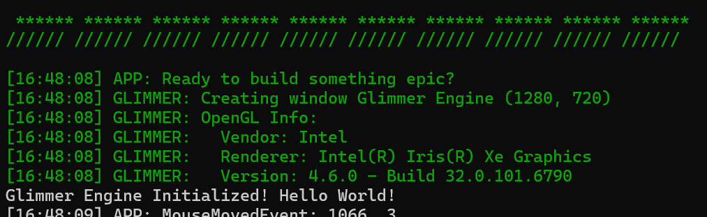

## 首个三角形

要在屏幕上画出一个三角形，我们需要打通 **CPU（你的代码）** 与 **GPU（显卡）** 之间的通道。这涉及到三个核心概念：

1. **VBO (顶点缓冲区)**：在显存里开辟一块地，把三角形的坐标存进去。
2. **VAO (顶点数组对象)**：告诉显卡怎么阅读这块地里的坐标（每隔几个字节是一个点）。
3. **Shader (着色器)**：写两段运行在显卡上的小程序，一段算位置，一段算颜色。

**在 Application.cpp 中编写三角形逻辑**

我们将直接在 Application 类里加入这些 OpenGL 原生调用。别担心，之后我们会把它们封装成漂亮的类。

修改 **Glimmer/src/Glimmer/Application.cpp**：

```
    glGenVertexArrays(1, &m_VertexArray);
    glBindVertexArray(m_VertexArray);

    glGenBuffers(1, &m_VertexBuffer);
    glBindBuffer(GL_ARRAY_BUFFER, m_VertexBuffer);

    float vertices[3 * 3] = {
        -0.5f, -0.5f, 0.0f,
         0.5f, -0.5f, 0.0f,
         0.0f,  0.5f, 0.0f
    };

    glBufferData(GL_ARRAY_BUFFER, sizeof(vertices), vertices, GL_STATIC_DRAW);

    glEnableVertexAttribArray(0);
    glVertexAttribPointer(0, 3, GL_FLOAT, GL_FALSE, 3 * sizeof(float), nullptr);

    glGenBuffers(1, &m_IndexBuffer);
    glBindBuffer(GL_ELEMENT_ARRAY_BUFFER, m_IndexBuffer);

    unsigned int indices[3] = { 0, 1, 2 };
    glBufferData(GL_ELEMENT_ARRAY_BUFFER, sizeof(indices), indices, GL_STATIC_DRAW);
```

**把一个三角形的顶点数据上传到 GPU，并配置好如何解析这些数据，从而让显卡能够正确绘制它**。流程是先创建并绑定一个 VAO（顶点数组对象）来记录所有顶点相关状态，然后创建 VBO（顶点缓冲）并把三角形的顶点坐标传到显存中；接着通过 `glVertexAttribPointer` 告诉 OpenGL：这些数据是按每 3 个 float 表示一个顶点位置（对应 shader 里的 layout location = 0）；最后创建 EBO（索引缓冲），用索引 `{0,1,2}` 指定绘制顺序。这样一套下来，GPU 就知道“从哪里读数据、怎么读、按什么顺序画”，后面只需要一次 DrawCall 就能把这个三角形画出来。

- **以前 (无索引)**：glDrawArrays(GL_TRIANGLES, 0, 3);
- **现在 (有索引)**：使用 **glDrawElements**。

在 Application::Run 中修改：

```
// 绑定 VAO（它会自动关联之前绑定的 VBO 和 IBO）
glBindVertexArray(m_VertexArray);

// 参数：模式, 索引数量, 索引类型, 偏移量
glDrawElements(GL_TRIANGLES, 3, GL_UNSIGNED_INT, nullptr);
```

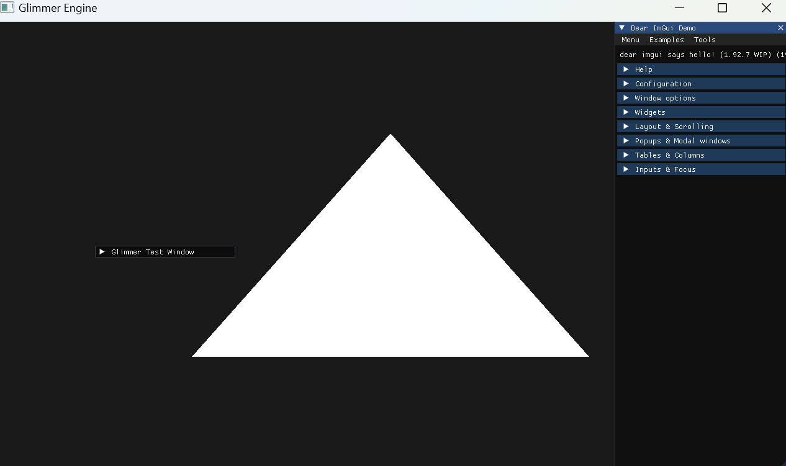

## Shader

Shader 是运行在显卡（GPU）上的小程序，通常使用 **GLSL** (OpenGL Shading Language) 编写

**创建 Shader 接口类 (Shader.h)**

在 Glimmer/src/Glimmer/Renderer 目录下创建。

**Shader.h**:

```
#pragma once
#include <string>

namespace gl {

    class Shader {
    public:
        Shader(const std::string& vertexSrc, const std::string& fragmentSrc);
        ~Shader();

        void Bind() const;   // 对应 glUseProgram(id)
        void Unbind() const; // 对应 glUseProgram(0)

    private:
        uint32_t m_RendererID; // 显卡返回的程序 ID
    };

}
```

**实现 Shader 类逻辑 (Shader.cpp)**

这一步最核心的工作是**错误检查**。如果 Shader 写错了，我们必须让引擎在控制台报错，而不是默默黑屏。

**Shader.cpp**:源代码过长，具体逻辑如下：

**把顶点着色器和片元着色器从源码编译、链接成一个 GPU 可执行的渲染程序（Shader Program），并提供绑定/解绑接口供渲染时使用**。流程上先分别创建**顶点**和**片元**着色器对象，将传入的 GLSL 源码提交给 OpenGL 编译，并在每一步严格**检查编译错误**；接着把两个着色器附加到同一个 Program 上进行**链接**，生成最终的 Shader Program（`m_RendererID`），链接完成后再将中间的 Shader 对象解绑（释放依赖）；最后**通过 `Bind/Unbind` 控制当前使用的 Shader**。整体上，这个类把原本繁琐的 OpenGL Shader 流程封装起来，让上层只需要关心“用哪个 Shader”，而不用关心底层细节。

**在 Application 中使用封装后的类**

重构你的 Application.cpp：在缓冲区下加入shader

这段代码的核心是在**定义一套最基础的 Shader（顶点 + 片元），并创建对应的 GPU 渲染程序**。具体来说，`vertexSrc` 定义了顶点着色器：它接收每个顶点的位置 `a_Position`，一方面直接传给 `gl_Position` 用于最终的屏幕变换，另一方面通过 `v_Position` 传递给后续阶段；而 `fragmentSrc` 定义了片元着色器：它接收从顶点阶段插值过来的 `v_Position`，并通过简单的数学变换（`*0.5 + 0.5`）把原本范围在 [-1,1] 的坐标映射到 [0,1]，最终作为颜色输出。最后通过 `m_Shader.reset(new Shader(...))` 创建 Shader 对象并交给智能指针管理，实现自动生命周期控制。整体效果就是：**根据顶点位置生成一个渐变颜色的三角形**。

```glsl
    glBindBuffer(GL_ELEMENT_ARRAY_BUFFER, m_IndexBuffer);

    unsigned int indices[3] = { 0, 1, 2 };
    glBufferData(GL_ELEMENT_ARRAY_BUFFER, sizeof(indices), indices, GL_STATIC_DRAW);


    std::string vertexSrc = R"(
        #version 330 core

        layout(location = 0) in vec3 a_Position;

        out vec3 v_Position;

        void main()
        {
            v_Position = a_Position;
            gl_Position = vec4(a_Position, 1.0);	
        }
    )";

    std::string fragmentSrc = R"(
        #version 330 core

        layout(location = 0) out vec4 color;

        in vec3 v_Position;

        void main()
        {
            color = vec4(v_Position * 0.5 + 0.5, 1.0);
        }
    )";

    m_Shader.reset(new Shader(vertexSrc, fragmentSrc));
```

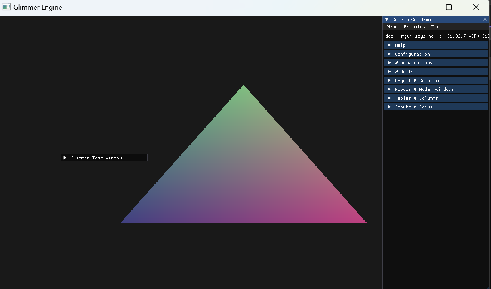

与之相对，固定RGB写法

这两段 Shader 的本质区别在于：**第一段是“基于顶点位置生成颜色的动态渐变”，第二段是“固定颜色输出”**。具体来说，第一段在顶点着色器中把顶点位置通过 `v_Position` 传递到片元着色器，并利用 GPU 的插值机制在三角形内部自动插值，最终在片元阶段根据位置计算颜色（`v_Position * 0.5 + 0.5`），所以整个三角形会呈现渐变效果；而第二段完全没有数据传递，片元着色器直接输出一个固定的 RGBA 值，因此整个三角形是纯色的，没有任何变化。

```
// 顶点着色器：负责把 3D 坐标转换到屏幕上
std::string vertexSrc = R"(
    #version 330 core
    
    layout(location = 0) in vec3 a_Position; // 对应刚才指定的 AttribPointer 0

    void main()
    {
        gl_Position = vec4(a_Position, 1.0);
    }
)";

// 片元着色器：负责给像素上色
std::string fragmentSrc = R"(
    #version 330 core
    
    layout(location = 0) out vec4 color;

    void main()
    {
        color = vec4(0.8, 0.2, 0.3, 1.0); // 橘红色 (RGBA)
    }
)";
```

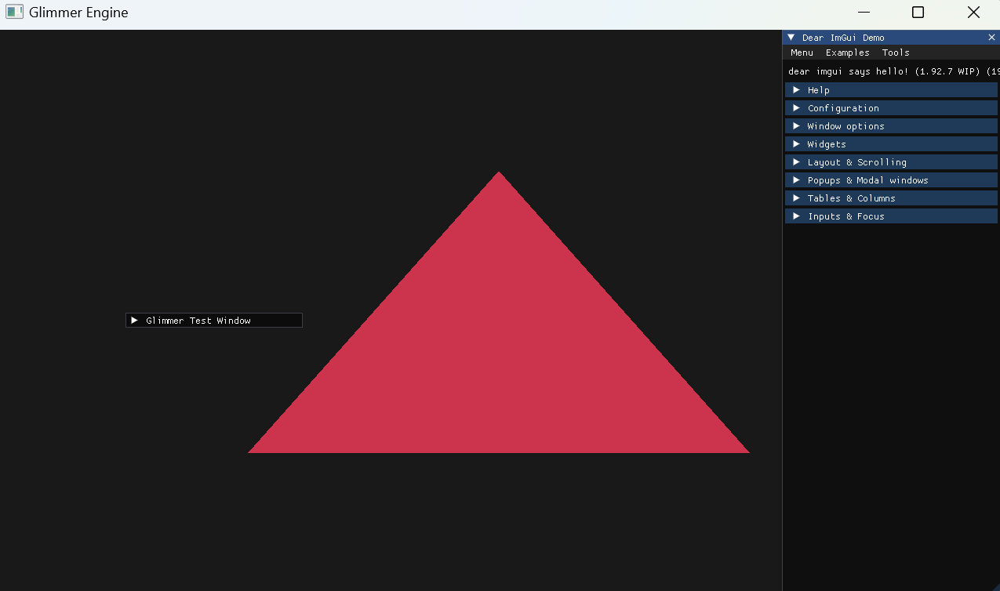

## Uniform 上传

实现 **Uniform 上传** 是让 Shader 从“静态图片”变成“动态特效”的关键，也是 CPU 指挥 GPU 的核心手段。

为了让 Glimmer 引擎能够方便地传递时间、颜色、甚至是变换矩阵，我们需要在 Shader 类中封装一系列 UploadUniform 函数。

**扩展 Shader.h 接口**

我们需要支持多种数据类型。虽然你现在只需要 float 传时间，但以后一定会用到 vec3 传颜色和 mat4 传位置。

**Glimmer/src/Glimmer/Renderer/Shader.h**:

```
#include <glm/glm.hpp> // 确保包含了 GLM 数学库

namespace gl {
    class Shader {
    public:
        // ... 原有构造、析构、Bind ...

        // ✨ 新增一系列上传 Uniform 的接口
        void UploadUniformInt(const std::string& name, int value);

        void UploadUniformFloat(const std::string& name, float value);
        void UploadUniformFloat2(const std::string& name, const glm::vec2& value);
        void UploadUniformFloat3(const std::string& name, const glm::vec3& value);
        void UploadUniformFloat4(const std::string& name, const glm::vec4& value);

        void UploadUniformMat4(const std::string& name, const glm::mat4& matrix);

    private:
        uint32_t m_RendererID;
    };
}
```

**实现 Shader.cpp 中的上传逻辑**

在 OpenGL 中，上传数据的标准流程是：**获取位置 (Location) -> 调用对应的 glUniform 函数**。

**Glimmer/src/Glimmer/Renderer/Shader.cpp**:

```
    void Shader::UploadUniformInt(const std::string& name, int value) {
        GLint location = glGetUniformLocation(m_RendererID, name.c_str());
        glUniform1i(location, value);
    }

    void Shader::UploadUniformFloat(const std::string& name, float value) {
        GLint location = glGetUniformLocation(m_RendererID, name.c_str());
        glUniform1f(location, value);
    }
    //其余同理
```

 **在渲染循环中注入时间**

修改 Application::Run：

```
void Application::Run() {
    while (m_Running) {
        glClearColor(0.1f, 0.1f, 0.1f, 1);
        glClear(GL_COLOR_BUFFER_BIT);

        m_Shader->Bind();
        
        // 每帧获取当前时间并上传给显卡
        float time = (float)glfwGetTime(); 
        m_Shader->UploadUniformFloat("u_Time", time);

        glBindVertexArray(m_VertexArray);
        glDrawElements(GL_TRIANGLES, 3, GL_UNSIGNED_INT, nullptr);

        m_Window->OnUpdate();
    }
}
```

动态shader

```
std::string fragmentSrc = R"(
    #version 330 core
    layout(location = 0) out vec4 color;
    in vec3 v_Position;
    
    uniform float u_Time; // 接收外部注入的时间

    void main() {
        // 让颜色随时间和位置发生偏移
        vec3 col = 0.5 + 0.5 * cos(u_Time + v_Position.xyx + vec3(3,1,4));
        color = vec4(col, 1.0);
    }
)";
```

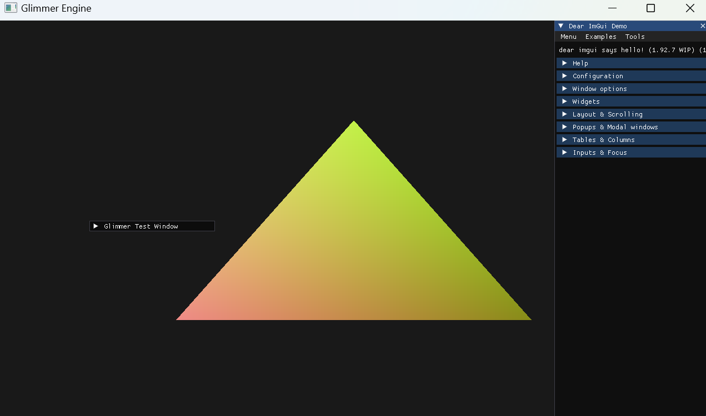

**顶点动画**

使得三角形有旋转的动感

```
std::string vertexSrc = R"(
#version 330 core

layout(location = 0) in vec3 a_Position;
out vec3 v_Position;
uniform float u_Time;

void main()
{
    vec3 pos = a_Position;
    pos.y += sin(pos.x * 5.0 + u_Time) * 0.1; // 新增
    v_Position = pos;
    gl_Position = vec4(pos, 1.0);
}
)";
```

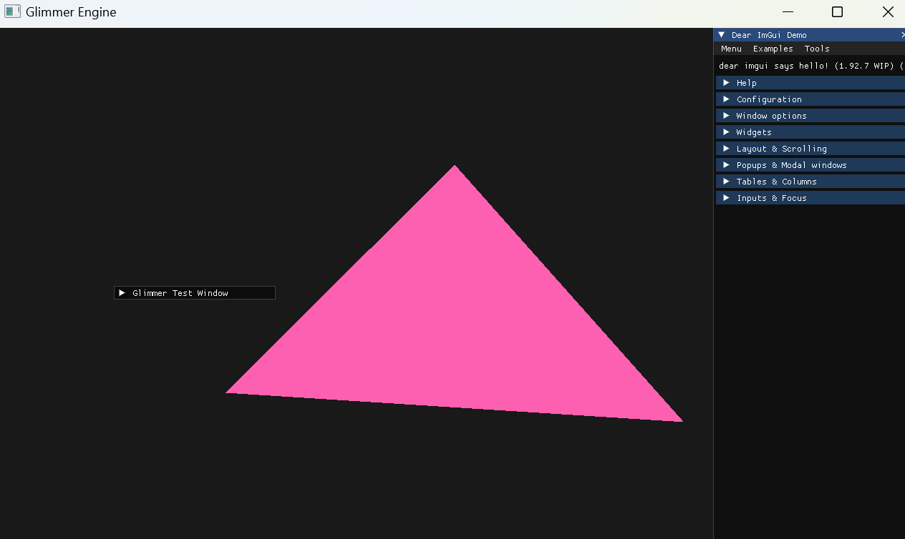

extra：

**迷幻彩虹 (Psychedelic Flow)**

颜色不再是静态的，而是像液体一样在三角形表面流动。

**特色**：在颜色空间中引入正弦波震荡。

```
// Fragment Shader
#version 330 core

layout(location = 0) out vec4 color;
in vec3 v_Position;
uniform float u_Time;

void main()
{
    vec3 col;
    // 使用三角函数让 R, G, B 三个通道随位置和时间发生不同的相位偏移
    col.r = sin(v_Position.x * 3.0 + u_Time) * 0.5 + 0.5;
    col.g = sin(v_Position.y * 3.0 + u_Time + 2.0) * 0.5 + 0.5;
    col.b = sin((v_Position.x + v_Position.y) * 3.0 + u_Time + 4.0) * 0.5 + 0.5;
    
    color = vec4(col, 1.0);
}
```

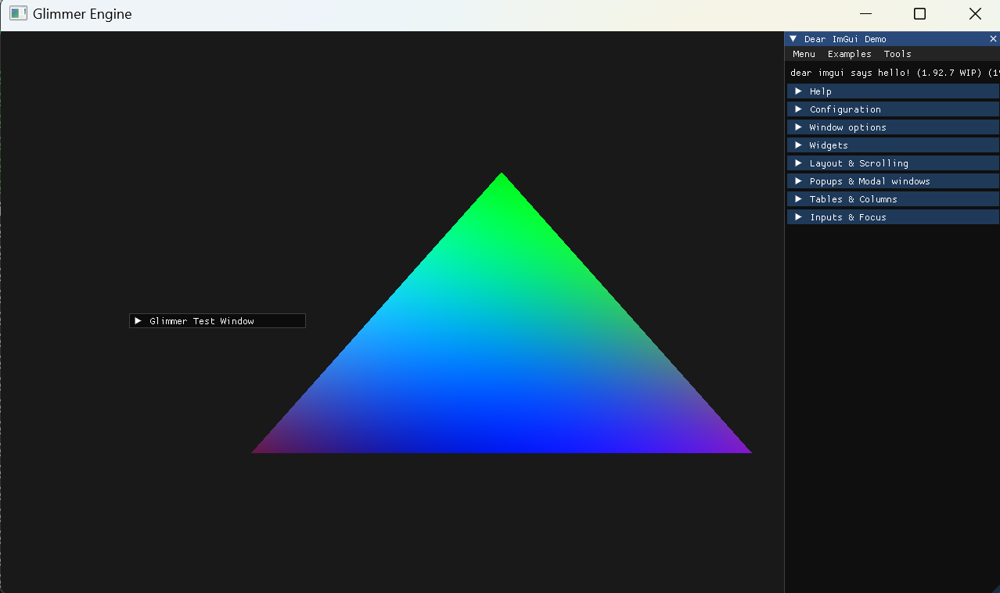

同时应用顶点变换和颜色变换小bug：没有更新顶点的out v_Position赋值，导致颜色变换的计算是基于原坐标而不是变换坐标

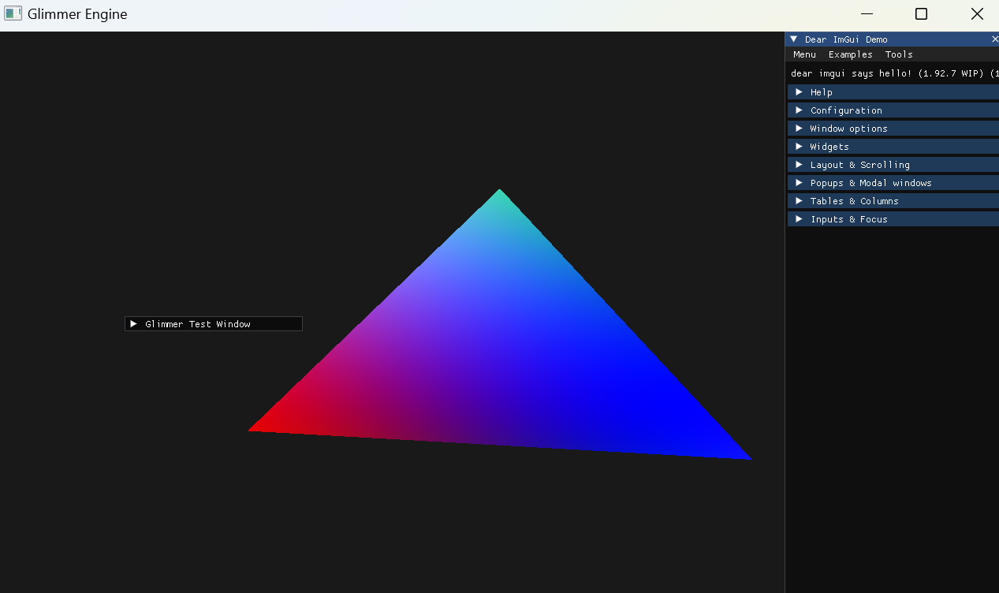

测试shader留档

```
        // Shader 代码
        std::string vertexSrc = R"(
		#version 330 core
		layout(location = 0) in vec3 a_Position;
        uniform mat4 u_ViewProjection;
		out vec3 v_Position;
        uniform float u_Time;
		void main()
		{
            vec3 pos = a_Position;
            pos.y += sin(pos.x * 5.0 + u_Time) * 0.1;
            v_Position = pos;
            gl_Position = u_ViewProjection * vec4(pos, 1.0); 
		}
	)";
        std::string fragmentSrc = R"(
		#version 330 core
		layout(location = 0) out vec4 color;
		in vec3 v_Position;
        uniform float u_Time;
		void main()
		{
            vec3 col;
            // 使用三角函数让 R, G, B 三个通道随位置和时间发生不同的相位偏移
            col.r = sin(v_Position.x * 3.0 + u_Time) * 0.5 + 0.5;
            col.g = sin(v_Position.y * 3.0 + u_Time + 2.0) * 0.5 + 0.5;
            col.b = sin((v_Position.x + v_Position.y) * 3.0 + u_Time + 4.0) * 0.5 + 0.5;
            color = vec4(col, 1.0);
		}
	)";
```


## Buffer 抽象

接入 **Buffer（缓冲区）抽象** 是 Glimmer 引擎迈向**多图形 API 支持**（如未来支持 DX12/Vulkan）最关键的一步。

目前我们在 Application.cpp 里直接调用 glGenBuffers 和 glBindBuffer，这让代码充满了“OpenGL 味儿”。我们要把它封装成通用的 C++ 接口。

我们将实现三个核心类：

1. **VertexBuffer** (顶点缓冲区)：存坐标、颜色。
2. **IndexBuffer** (索引缓冲区)：存画图顺序。
3. **BufferLayout** (布局)：**这是重中之重！** 它将彻底消灭难看的 glVertexAttribPointer。

**定义抽象接口 (Buffer.h)**

在 Glimmer/src/Glimmer/Renderer 下创建。

**Buffer.h**:

```
#pragma once

namespace gl {

    class VertexBuffer {
    public:
        virtual ~VertexBuffer() {}

        virtual void Bind() const = 0;
        virtual void Unbind() const = 0;

        static VertexBuffer* Create(float* vertices, uint32_t size);
    };

    class IndexBuffer {
    public:
        virtual ~IndexBuffer() {}

        virtual void Bind() const = 0;
        virtual void Unbind() const = 0;

        virtual uint32_t GetCount() const = 0; // 拿到有多少个索引点

        static IndexBuffer* Create(uint32_t* indices, uint32_t count);
    };

}
```

**实现 OpenGL 版本的 Buffer (OpenGLBuffer.cpp)**

在 Glimmer/src/Platform/OpenGL 下创建。

**OpenGLBuffer.h**:

定义了 OpenGL 渲染后端的两个核心缓冲区类：`OpenGLVertexBuffer` 和 `OpenGLIndexBuffer`，它们分别实现了引擎抽象的顶点缓冲和索引缓冲接口。`OpenGLVertexBuffer` 接收顶点数据，在构造时生成 GPU 上的 VBO 并通过 `m_RendererID` 管理，`Bind` 和 `Unbind` 用于在渲染时切换当前缓冲区，而析构函数负责释放 GPU 内存。`OpenGLIndexBuffer` 同样管理索引数据，保存索引数量 `m_Count`，通过绑定和解绑操作配合 `glDrawElements` 使用，实现顶点复用以减少渲染开销。这种设计的核心价值在于接口与实现分离，上层渲染逻辑无需关心 OpenGL 细节，只通过统一接口操作缓冲区，从而保证了渲染器后端的可替换性。

```
#pragma once
#include "Glimmer/Renderer/Buffer.h"

namespace gl {

    class OpenGLVertexBuffer : public VertexBuffer {
    public:
        OpenGLVertexBuffer(float* vertices, uint32_t size);
        virtual ~OpenGLVertexBuffer();

        virtual void Bind() const override;
        virtual void Unbind() const override;
    private:
        uint32_t m_RendererID;
    };

    class OpenGLIndexBuffer : public IndexBuffer {
    public:
        OpenGLIndexBuffer(uint32_t* indices, uint32_t count);
        virtual ~OpenGLIndexBuffer();

        virtual void Bind() const override;
        virtual void Unbind() const override;

        virtual uint32_t GetCount() const override { return m_Count; }
    private:
        uint32_t m_RendererID;
        uint32_t m_Count;
    };
}
```

**OpenGLBuffer.cpp**: (核心逻辑，把 gl 函数包起来)

`OpenGLBuffer.cpp` 代码实现了前面头文件中声明的 `OpenGLVertexBuffer` 和 `OpenGLIndexBuffer`，核心作用是把顶点和索引数据上传到 GPU 并管理它们的生命周期，从而支持高效渲染。具体来说，`OpenGLVertexBuffer` 构造时通过 `glGenBuffers` 创建一个 VBO，并用 `glBufferData` 将顶点数组传入 GPU 内存，绑定和解绑方法用于在渲染时切换当前缓冲区，析构函数负责释放 GPU 资源，保证内存安全；`OpenGLIndexBuffer` 类似地创建 EBO 管理索引数据，`m_Count` 记录索引数量方便后续渲染调用 `glDrawElements`，绑定解绑控制当前索引缓冲对象。整体逻辑体现了 **RAII 风格的资源管理**、**接口抽象与实现分离**，上层渲染系统只需通过统一接口操作缓冲区而无需关心 OpenGL 的底层细节，实现了渲染器后端解耦。

**实现工厂方法 (Buffer.cpp)**

这一步是为了让 Application 只需要调用 Create 就能自动根据平台返回正确的 Buffer。

**Glimmer/src/Glimmer/Renderer/Buffer.cpp**:

```
#include "glpch.h"
#include "Buffer.h"
#include "Platform/OpenGL/OpenGLBuffer.h"

namespace gl {

    VertexBuffer* VertexBuffer::Create(float* vertices, uint32_t size) {
        // 未来可以在这里写 switch(Renderer::GetAPI()) 来切换平台
        return new OpenGLVertexBuffer(vertices, size);
    }

    IndexBuffer* IndexBuffer::Create(uint32_t* indices, uint32_t count) {
        return new OpenGLIndexBuffer(indices, count);
    }

}
```

**在 Application 中使用封装后的 Buffer**

重构你的 Application.cpp。你会发现原生 gl 调用正在消失：

## 缓冲区布局与顶点数组封装

**实现 BufferLayout (缓冲区布局)**

我们要让引擎自动计算“步长（Stride）”和“偏移量（Offset）”。

定义数据类型与布局类

在 Buffer.h 中添加以下代码（放在命名空间内）：

**Glimmer/src/Glimmer/Renderer/Buffer.h** (新增部分):

代码过长：首先定义了 `ShaderDataType` 枚举，表示顶点属性可能的数据类型（浮点、整型、矩阵、布尔），并通过 `ShaderDataTypeSize` 函数计算每种类型在内存中的字节大小，这对于后续缓冲区偏移计算非常关键。

`BufferElement` 结构体描述单个顶点属性，包括名称、类型、大小、偏移量以及是否归一化，同时提供 `GetComponentCount` 方法返回该属性的分量数量（例如 `Float3` 是 3 个分量），便于在 OpenGL 中调用 `glVertexAttribPointer` 时指定每个顶点属性的维度。

`BufferLayout` 类则管理一组 `BufferElement`，在构造时接受初始化列表并调用 `CalculateOffsetsAndStride` 计算每个属性在顶点结构体中的 **内存偏移** 和 **顶点总字节数（Stride）**，保证 GPU 能按正确顺序读取数据。通过提供 `begin()` 和 `end()`，支持范围循环遍历每个属性，方便绑定到渲染管线。

同时，给 VertexBuffer 类增加设置布局的虚接口：

```
class VertexBuffer {
public:
    // ... 原有函数 ...
    virtual void SetLayout(const BufferLayout& layout) = 0;
    virtual const BufferLayout& GetLayout() const = 0;
};
```

**更新 OpenGLBuffer.h/cpp**

你需要实现刚才在接口里增加的 GetLayout 和 SetLayout。

```
		virtual const BufferLayout& GetLayout() const override { return m_Layout; }
		virtual void SetLayout(const BufferLayout& layout) override { m_Layout = layout; }
	private:
		uint32_t m_RendererID;
		BufferLayout m_Layout;
```

**实现 VertexArray (顶点数组对象)**

定义抽象接口 (VertexArray.h)

```
#pragma once
#include "Glimmer/Renderer/Buffer.h"
#include <memory>

namespace gl {
    class VertexArray {
    public:
        virtual ~VertexArray() {}
        virtual void Bind() const = 0;
        virtual void Unbind() const = 0;

        virtual void AddVertexBuffer(const std::shared_ptr<VertexBuffer>& vertexBuffer) = 0;
        virtual void SetIndexBuffer(const std::shared_ptr<IndexBuffer>& indexBuffer) = 0;

        virtual const std::vector<std::shared_ptr<VertexBuffer>>& GetVertexBuffers() const = 0;
        virtual const std::shared_ptr<IndexBuffer>& GetIndexBuffer() const = 0;

        static VertexArray* Create();
    };
}
```

**实现 OpenGL 版本的 VertexArray**

这里是最精彩的：它会自动读取 VertexBuffer 里的 Layout，并自动调用 glVertexAttribPointer。

**文件路径：Glimmer/src/Platform/OpenGL/OpenGLVertexArray.h**

```
#pragma once
#include "Glimmer/Renderer/VertexArray.h"

namespace gl {

	class OpenGLVertexArray : public VertexArray
	{
	public:
		OpenGLVertexArray();
		virtual ~OpenGLVertexArray();

		virtual void Bind() const override;
		virtual void Unbind() const override;

		virtual void AddVertexBuffer(const std::shared_ptr<VertexBuffer>& vertexBuffer) override;
		virtual void SetIndexBuffer(const std::shared_ptr<IndexBuffer>& indexBuffer) override;

		virtual const std::vector<std::shared_ptr<VertexBuffer>>& GetVertexBuffers() const override { return m_VertexBuffers; }
		virtual const std::shared_ptr<IndexBuffer>& GetIndexBuffer() const override { return m_IndexBuffer; }
	private:
		uint32_t m_RendererID;
		std::vector<std::shared_ptr<VertexBuffer>> m_VertexBuffers;
		std::shared_ptr<IndexBuffer> m_IndexBuffer;
	};

}
```

文件路径：**Glimmer/src/Platform/OpenGL/OpenGLVertexArray.cpp**

它的核心作用是：**把“顶点数据 + 顶点布局描述”绑定在一起，让 GPU 知道如何解析一段连续内存中的顶点结构**，从而完成真正的渲染输入配置。

从整体流程来看，这个类在构造时通过 `glGenVertexArrays` 创建一个 VAO，在 `Bind/Unbind` 中切换当前 VAO；真正的关键逻辑在 `AddVertexBuffer`：它先检查传入的 `VertexBuffer` 是否有布局（这是非常重要的安全校验），然后绑定 VAO 和 VBO，接着遍历 `BufferLayout` 中的每个 `BufferElement`，调用 `glEnableVertexAttribArray` 和 `glVertexAttribPointer`，把“顶点数据如何解释”（比如位置是3个float、颜色是4个float）逐个告诉 GPU，其中 `ShaderDataTypeToOpenGLBaseType` 负责把引擎抽象的数据类型映射为 OpenGL 类型（如 GL_FLOAT）。同时通过 `stride` 和 `offset` 指定每个属性在内存中的步长和偏移，这一步本质上就是在描述“一个顶点在内存中的结构”。最后把这个 VBO 存入列表，保证生命周期和后续使用。

`SetIndexBuffer` 则负责绑定索引缓冲（EBO），并保存引用，这样 VAO 就同时记录了“顶点数据 + 索引数据”的完整状态，之后渲染时只需要 Bind VAO，就能恢复全部输入配置。

**VertexArray 的工厂方法**

**文件路径：Glimmer/src/Glimmer/Renderer/VertexArray.cpp**

```
#include "glpch.h"
#include "VertexArray.h"
#include "Platform/OpenGL/OpenGLVertexArray.h"

namespace gl {

	VertexArray* VertexArray.Create()
	{
		// 暂时直接返回 OpenGL 版本
		return new OpenGLVertexArray();
	}

}
```

## Render类

接入 **Renderer（渲染器）** 类是 Glimmer 引擎从“OpenGL 包装盒”进化为“真正的渲染引擎”的决定性一步。

目前的 Application.cpp 依然在亲手处理 glClear 和 glDrawElements。**Renderer 类存在的意义，就是彻底剥离这些底层细节。**

我们将建立一个三层架构：

1. **RendererAPI**：抽象基类，定义“画画”和“清屏”的动作。
2. **RenderCommand**：静态中转站，负责呼叫当前的 API。
3. **Renderer**：最高级层，负责场景管理（比如：开始场景、提交模型、结束场景）。

**API 抽象层 (RendererAPI & RenderCommand)**

定义 API 接口 (RendererAPI.h)，这是所有图形 API（OpenGL, Vulkan, DX12）必须实现的“动作清单”。

在 Glimmer/src/Glimmer/Renderer 下创建。

**Glimmer/src/Glimmer/Renderer/RendererAPI.h**

```
#pragma once
#include <glm/glm.hpp>
#include "VertexArray.h"

namespace gl {
    class RendererAPI {
    public:
        enum class API { None = 0, OpenGL = 1 };
    public:
        virtual void SetClearColor(const glm::vec4& color) = 0;
        virtual void Clear() = 0;
        virtual void DrawIndexed(const std::shared_ptr<VertexArray>& vertexArray) = 0;

        inline static API GetAPI() { return s_API; }
    private:
        static API s_API;
    };
}
```

**Glimmer/src/Glimmer/Renderer/RendererAPI.cpp**

```
#include "glpch.h"
#include "RendererAPI.h"

namespace gl {

	RendererAPI::API RendererAPI::s_API = RendererAPI::API::OpenGL;

}
```

**实现 OpenGL 的具体指令 (OpenGLRendererAPI.h/cpp)**

在这里，我们将抽象接口翻译成真实的 OpenGL 代码。

```
#pragma once
#include "Glimmer/Renderer/RendererAPI.h"

namespace gl {

	class OpenGLRendererAPI : public RendererAPI
	{
	public:
		virtual void SetClearColor(const glm::vec4& color) override;
		virtual void Clear() override;

		virtual void DrawIndexed(const std::shared_ptr<VertexArray>& vertexArray) override;
	};

}
```

```
#include "glpch.h"
#include "OpenGLRendererAPI.h"
#include <glad/glad.h>

namespace gl {

	void OpenGLRendererAPI::SetClearColor(const glm::vec4& color)
	{
		glClearColor(color.r, color.g, color.b, color.a);
	}

	void OpenGLRendererAPI::Clear()
	{
		glClear(GL_COLOR_BUFFER_BIT | GL_DEPTH_BUFFER_BIT);
	}

	void OpenGLRendererAPI::DrawIndexed(const std::shared_ptr<VertexArray>& vertexArray)
	{
		glDrawElements(GL_TRIANGLES, vertexArray->GetIndexBuffer()->GetCount(), GL_UNSIGNED_INT, nullptr);
	}

}
```

**建立命令中转站 (RenderCommand.h/cpp)**

它的作用是提供一组全局静态方法，方便我们随时随地“发号施令”。

**文件路径：Glimmer/src/Glimmer/Renderer/RenderCommand.h**

```
#pragma once
#include "RendererAPI.h"

namespace gl {

	class RenderCommand
	{
	public:
		inline static void SetClearColor(const glm::vec4& color)
		{
			s_RendererAPI->SetClearColor(color);
		}

		inline static void Clear()
		{
			s_RendererAPI->Clear();
		}

		inline static void DrawIndexed(const std::shared_ptr<VertexArray>& vertexArray)
		{
			s_RendererAPI->DrawIndexed(vertexArray);
		}
	private:
		static RendererAPI* s_RendererAPI;
	};

}
```

文件路径：**Glimmer/src/Glimmer/Renderer/RenderCommand.cpp**

```
#include "glpch.h"
#include "RenderCommand.h"
#include "Platform/OpenGL/OpenGLRendererAPI.h"

namespace gl {

	// 核心：在这里决定到底用哪个 API 实例
	RendererAPI* RenderCommand::s_RendererAPI = new OpenGLRendererAPI();

}
```

**实现高层渲染器 (Renderer.h/cpp)**

这是开发者最终打交道的类。它负责“提交（Submit）”各种模型和 Shader。

**文件路径：Glimmer/src/Glimmer/Renderer/Renderer.h**

```
#pragma once
#include "RenderCommand.h"
#include "Shader.h"

namespace gl {

	class Renderer
	{
	public:
		static void BeginScene();
		static void EndScene();

		static void Submit(const std::shared_ptr<Shader>& shader, const std::shared_ptr<VertexArray>& vertexArray);

		inline static RendererAPI::API GetAPI() { return RendererAPI::GetAPI(); }
	};

}
```

```
#include "glpch.h"
#include "Renderer.h"

namespace gl {

	void Renderer::BeginScene()
	{
		// 以后这里会接收摄像机，并计算 View-Projection 矩阵
	}

	void Renderer::EndScene()
	{
	}

	void Renderer::Submit(const std::shared_ptr<Shader>& shader, const std::shared_ptr<VertexArray>& vertexArray)
	{
		shader->Bind();
		vertexArray->Bind();
		RenderCommand::DrawIndexed(vertexArray);
	}

}
```

## 正交摄像机

现在所有的渲染底层组件（Buffer, VertexArray, Renderer API）都已经封装完毕。目前的三角形是**死死固定在屏幕中心**的（处于 -1 到 1 的标准化设备坐标系中）。

下一步我们要引入 **正交摄像机 (Orthographic Camera)**。

**这一步的作用：**

1. **建立世界坐标系**：你可以定义一个 16:9 的世界，而不是死板的 -1 到 1。
2. **场景漫游**：通过移动摄像机，实现 2D 游戏的画面滚动（比如主角走，镜头跟）。
3. **数学联动**：这是你第一次真正大规模使用 GLM 矩阵运算（View-Projection 矩阵）。

**创建摄像机类 (OrthographicCamera.h/cpp)**

**文件路径：Glimmer/src/Glimmer/Renderer/OrthographicCamera.h**

```
#pragma once
#include <glm/glm.hpp>

namespace gl {

	class OrthographicCamera
	{
	public:
		OrthographicCamera(float left, float right, float bottom, float top);

		const glm::vec3& GetPosition() const { return m_Position; }
		void SetPosition(const glm::vec3& position) { m_Position = position; RecalculateViewMatrix(); }

		float GetRotation() const { return m_Rotation; }
		void SetRotation(float rotation) { m_Rotation = rotation; RecalculateViewMatrix(); }

		const glm::mat4& GetProjectionMatrix() const { return m_ProjectionMatrix; }
		const glm::mat4& GetViewMatrix() const { return m_ViewMatrix; }
		const glm::mat4& GetViewProjectionMatrix() const { return m_ViewProjectionMatrix; }
	private:
		void RecalculateViewMatrix();
	private:
		glm::mat4 m_ProjectionMatrix;
		glm::mat4 m_ViewMatrix;
		glm::mat4 m_ViewProjectionMatrix;

		glm::vec3 m_Position = { 0.0f, 0.0f, 0.0f };
		float m_Rotation = 0.0f;
	};

}
```

**Glimmer/src/Glimmer/Renderer/OrthographicCamera.cpp**

```
#include "glpch.h"
#include "OrthographicCamera.h"
#include <glm/gtc/matrix_transform.hpp>

namespace gl {

	OrthographicCamera::OrthographicCamera(float left, float right, float bottom, float top)
		: m_ProjectionMatrix(glm::ortho(left, right, bottom, top, -1.0f, 1.0f)), m_ViewMatrix(1.0f)
	{
		m_ViewProjectionMatrix = m_ProjectionMatrix * m_ViewMatrix;
	}

	void OrthographicCamera::RecalculateViewMatrix()
	{
		// 计算 View 矩阵：先平移再旋转，最后取逆
		// 在 2D 中，摄像机往左移，物体看起来就往右移
		glm::mat4 transform = glm::translate(glm::mat4(1.0f), m_Position) *
			glm::rotate(glm::mat4(1.0f), glm::radians(m_Rotation), glm::vec3(0, 0, 1));

		m_ViewMatrix = glm::inverse(transform);
		m_ViewProjectionMatrix = m_ProjectionMatrix * m_ViewMatrix;
	}

}
```

**更新渲染器以支持摄像机 (Renderer.h/cpp)**

渲染器现在需要接收摄像机的矩阵，并把它传给每一帧绘制的 Shader。

**文件路径：Glimmer/src/Glimmer/Renderer/Renderer.h**

```
#pragma once
#include "RenderCommand.h"
#include "OrthographicCamera.h"
#include "Shader.h"

namespace gl {

	class Renderer
	{
	public:
		// 修改：BeginScene 现在需要传入摄像机
		static void BeginScene(OrthographicCamera& camera);
		static void EndScene();

		static void Submit(const std::shared_ptr<Shader>& shader, const std::shared_ptr<VertexArray>& vertexArray);

		inline static RendererAPI::API GetAPI() { return RendererAPI::GetAPI(); }

	private:
		struct SceneData
		{
			glm::mat4 ViewProjectionMatrix;
		};

		static SceneData* s_SceneData;
	};

}
```

**Glimmer/src/Glimmer/Renderer/Renderer.cpp**

```
#include "glpch.h"
#include "Renderer.h"

namespace gl {

	Renderer::SceneData* Renderer::s_SceneData = new Renderer::SceneData;

	void Renderer::BeginScene(OrthographicCamera& camera)
	{
		// 记录摄像机的 View-Projection 矩阵
		s_SceneData->ViewProjectionMatrix = camera.GetViewProjectionMatrix();
	}

	void Renderer::EndScene()
	{
	}

	void Renderer::Submit(const std::shared_ptr<Shader>& shader, const std::shared_ptr<VertexArray>& vertexArray)
	{
		shader->Bind();
		// 自动向 Shader 上传矩阵变量，名字定为 "u_ViewProjection"
		shader->UploadUniformMat4("u_ViewProjection", s_SceneData->ViewProjectionMatrix);

		vertexArray->Bind();
		RenderCommand::DrawIndexed(vertexArray);
	}

}
```

**重构 Application.cpp**

现在我们要修改 Shader 源码，并让摄像机动起来。

**修改 Application.cpp 中的部分逻辑：**

```
		// ---------------------------------------------------------
		// 1. 摄像机初始化 (16:9 比例)
		// ---------------------------------------------------------
		m_Camera.reset(new OrthographicCamera(-1.6f, 1.6f, -0.9f, 0.9f));

		// ---------------------------------------------------------
		// 2. 顶点数据与 VertexArray 封装
		// ---------------------------------------------------------
		m_VertexArray.reset(VertexArray::Create());

		float vertices[3 * 3] = {
			-0.5f, -0.5f, 0.0f, // 左下
			 0.5f, -0.5f, 0.0f, // 右下
			 0.0f,  0.5f, 0.0f  // 顶
		};

		std::shared_ptr<VertexBuffer> vertexBuffer;
		vertexBuffer.reset(VertexBuffer::Create(vertices, sizeof(vertices)));

		// 使用声明式布局 (BufferLayout)
		vertexBuffer->SetLayout({
			{ ShaderDataType::Float3, "a_Position" }
		});
		m_VertexArray->AddVertexBuffer(vertexBuffer);

		uint32_t indices[3] = { 0, 1, 2 };
		std::shared_ptr<IndexBuffer> indexBuffer;
		indexBuffer.reset(IndexBuffer::Create(indices, 3));
		m_VertexArray->SetIndexBuffer(indexBuffer);

		// ---------------------------------------------------------
		// 3. Shader 源码 (必须乘以 u_ViewProjection 矩阵)
		// ---------------------------------------------------------
		std::string vertexSrc = R"(
			#version 330 core
			
			layout(location = 0) in vec3 a_Position;

			uniform mat4 u_ViewProjection; // 接收摄像机矩阵

			out vec3 v_Position;

			void main()
			{
				v_Position = a_Position;
				gl_Position = u_ViewProjection * vec4(a_Position, 1.0);	
			}
		)";
```

```
void Application::Run()
{
    while (m_Running)
    {
        // ---------------------------------------------------------
        // A. 摄像机控制逻辑 (Input Polling)
        // ---------------------------------------------------------
        float moveSpeed = 0.01f;
        if (Input::IsKeyPressed(GL_KEY_A))
            m_Camera->SetPosition({ m_Camera->GetPosition().x - moveSpeed, m_Camera->GetPosition().y, 0.0f });
        else if (Input::IsKeyPressed(GL_KEY_D))
            m_Camera->SetPosition({ m_Camera->GetPosition().x + moveSpeed, m_Camera->GetPosition().y, 0.0f });

        if (Input::IsKeyPressed(GL_KEY_W))
            m_Camera->SetPosition({ m_Camera->GetPosition().x, m_Camera->GetPosition().y + moveSpeed, 0.0f });
        else if (Input::IsKeyPressed(GL_KEY_S))
            m_Camera->SetPosition({ m_Camera->GetPosition().x, m_Camera->GetPosition().y - moveSpeed, 0.0f });

        // ---------------------------------------------------------
        // B. 渲染执行
        // ---------------------------------------------------------
        RenderCommand::SetClearColor({ 0.1f, 0.1f, 0.1f, 1 });
        RenderCommand::Clear();

        // 1. 开启场景渲染 (传入当前摄像机)
        Renderer::BeginScene(*m_Camera);

        // 2. 更新 Shader 中的时间 Uniform
        m_Shader->Bind();
        m_Shader->UploadUniformFloat("u_Time", (float)glfwGetTime());

        // 3. 提交物体进行渲染
        Renderer::Submit(m_Shader, m_VertexArray);

        // 4. 结束渲染
        Renderer::EndScene();

        // ---------------------------------------------------------
        // C. 层级更新与 UI 渲染
        // ---------------------------------------------------------
        for (Layer* layer : m_LayerStack)
            layer->OnUpdate();

        m_ImGuiLayer->Begin();
        for (Layer* layer : m_LayerStack)
            layer->OnImGuiRender();
        m_ImGuiLayer->End();

        m_Window->OnUpdate();
    }
}
```

这部分要改的东西很多，之后还需要再次回顾加深理解

现在的三角形可以WASD控制移动

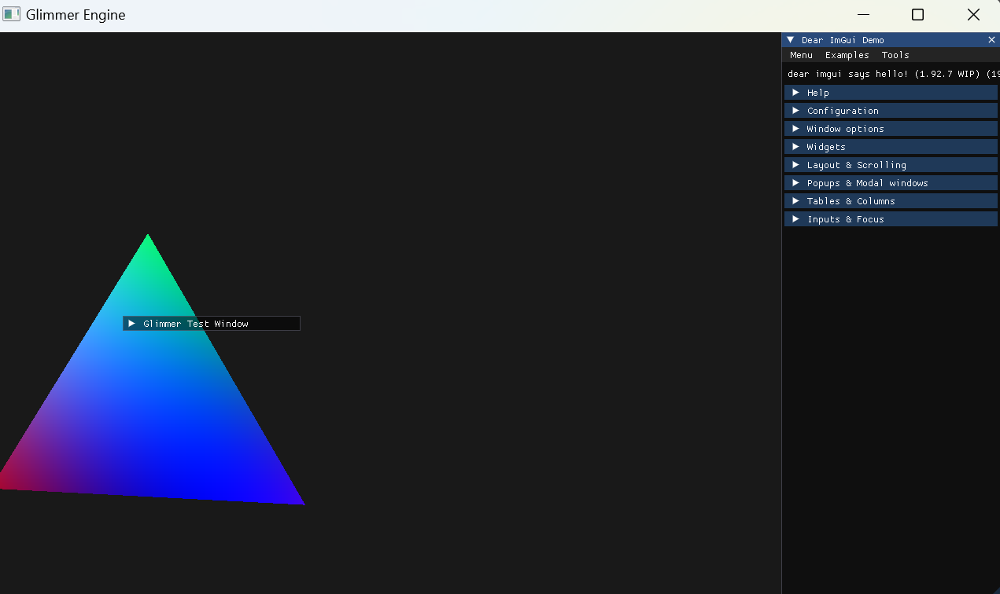

感觉比例好像变了？这是因为正交摄像机，**在没有加入摄像机之前，你的三角形是被拉伸的；加入摄像机后，它的比例才是正确的。**

重新修改顶点，以至于匹配正交摄像机后的画面

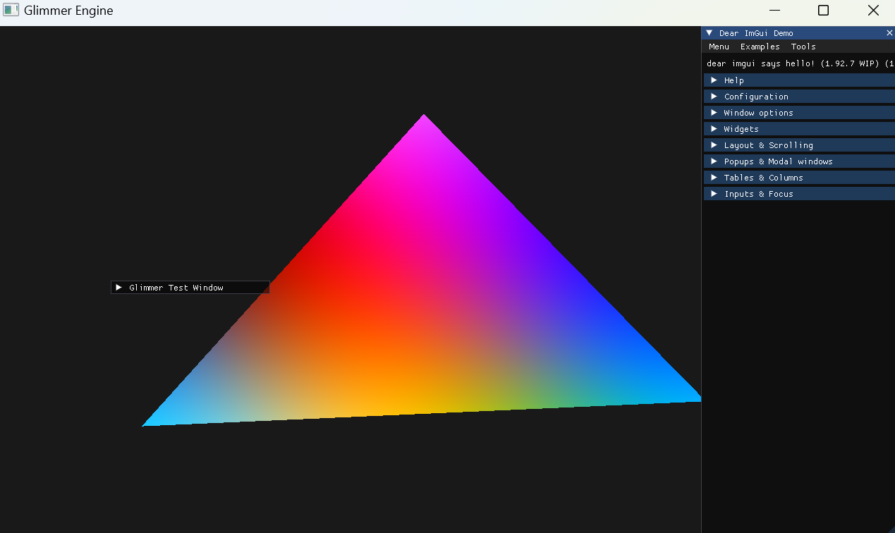 

## Timestep

引入时间步这一机制，首先要明白，什么是时间步？

我们之前也写过关于shader的时间u_Time

**运行总时间 (u_Time) 的职责**

你现在在 Shader 里写：sin(u_Time + v_Position.x)。

- **它的强项**：处理**周期性、持续性**的视觉效果。波浪起伏（水面、草地摆动）。颜色循环（彩虹特效）。纹理滚动（流光效果）。
- **为什么用它？** 因为显卡非常擅长计算数学函数。通过给它一个单增的时间值，它可以瞬间算出这一帧每一个像素应该在什么相位。

**时间步 (Timestep / DeltaTime) 的职责**

你在 Application::Run 算出的 timestep = time - lastFrameTime。

- **它的强项**：处理**位移、速度和变化率**。摄像机移动：pos += velocity * timestep。角色跳跃、物理模拟。
- **为什么用它？（帧率无关性）**如果你不用 timestep，直接 pos += 0.01f。在 60 帧的电脑上，每秒移动 0.6 单位。在 144 帧的电竞屏上，每秒移动 1.44 单位。**用了 timestep，无论电脑多快，大家每秒移动的距离都完全一样。**

**为什么不建议在 Shader 里用 Timestep 来累加时间？**

有些新手会想：我能不能每帧传一个 u_DeltaTime 给 Shader，让 Shader 内部自己加出一个总时间？
**答案：绝对不要这样做。**

- **精度灾难（Floating Point Drift）**：
  Shader 内部使用的是 float（单精度浮点数）。如果你每帧加一个很小的数（比如 0.016s），运行几十分钟后，浮点数的舍入误差会越来越大，导致你的彩虹特效开始闪烁、跳变甚至停滞。
- **CPU 的优势**：
  CPU 可以使用 double（双精度）甚至高精度的计时器来追踪总时间，然后在传给 Uniform 时转成 float。这样每一帧 Shader 拿到的都是一个经过校准的、绝对准确的时间点。

**创建 Timestep 包装类**

在 Glimmer/src/Glimmer/Core 下创建 Timestep.h。我们不直接用 float，而是封装一个类，这样可以方便地在秒和毫秒之间切换。

**文件路径：Glimmer/src/Glimmer/Core/Timestep.h**

```
#pragma once

namespace gl {

	class Timestep
	{
	public:
		Timestep(float time = 0.0f)
			: m_Time(time)
		{
		}

		// 允许像 float 一样直接使用： float s = ts;
		operator float() const { return m_Time; }

		float GetSeconds() const { return m_Time; }
		float GetMilliseconds() const { return m_Time * 1000.0f; }
	private:
		float m_Time;
	};

}
```

**修改 Layer.h 接口**

所有的图层更新都必须感知到时间的流逝。

**文件路径：Glimmer/src/Glimmer/Layer.h**

```
#include "Glimmer/Core/Timestep.h" // ✨ 包含头文件

namespace gl {
	class Layer {
	public:
		// ... 
		virtual void OnUpdate(Timestep ts) {} // ✨ 修改：增加参数
		// ...
	};
}
```

**在 Application 中计算 Delta Time**

我们需要在主循环中对比“这一帧的时间”和“上一帧的时间”。

**文件路径：Glimmer/src/Glimmer/Application.h**

```
private:
    // ... 其他成员 ...
    float m_LastFrameTime = 0.0f; // ✨ 记录上一帧的时间点
```

文件路径：**Glimmer/src/Glimmer/Application.cpp**

```
void Application::Run()
{
    while (m_Running)
    {
        // 1. ✨ 计算增量时间 (Delta Time)
        // glfwGetTime 返回的是从启动到现在的总秒数
        float time = (float)glfwGetTime(); 
        Timestep timestep = time - m_LastFrameTime;
        m_LastFrameTime = time;

        // 2. 渲染清屏
        RenderCommand::SetClearColor({ 0.1f, 0.1f, 0.1f, 1 });
        RenderCommand::Clear();

        // 3. 更新图层逻辑 (传入 timestep)
        for (Layer* layer : m_LayerStack)
            layer->OnUpdate(timestep);

        // 4. ImGui 渲染 (UI 通常不需要按 timestep 移动)
        m_ImGuiLayer->Begin();
        for (Layer* layer : m_LayerStack)
            layer->OnImGuiRender();
        m_ImGuiLayer->End();

        m_Window->OnUpdate();
    }
}
```

**在 Sandbox 中应用（真正解决移动问题）**

现在我们可以把摄像机的移动速度定义为 **“每秒移动多少单位”**，而不是“每帧移动多少”。

**修改 SandboxApp.cpp 里的 OnUpdate：**

```
void OnUpdate(gl::Timestep ts) override 
{
    // 定义移动速度：每秒 2.0 个世界单位
    float moveSpeed = 2.0f; 

    // ✨ 核心公式：位移 = 速度 * 时间
    // 无论帧率高低，相乘后的结果都能保证每一秒钟移动的距离是恒定的
    if (gl::Input::IsKeyPressed(GL_KEY_A))
        m_Camera->SetPosition(m_Camera->GetPosition() + glm::vec3(-moveSpeed * ts, 0, 0));
    else if (gl::Input::IsKeyPressed(GL_KEY_D))
        m_Camera->SetPosition(m_Camera->GetPosition() + glm::vec3(moveSpeed * ts, 0, 0));

    if (gl::Input::IsKeyPressed(GL_KEY_W))
        m_Camera->SetPosition(m_Camera->GetPosition() + glm::vec3(0, moveSpeed * ts, 0));
    else if (gl::Input::IsKeyPressed(GL_KEY_S))
        m_Camera->SetPosition(m_Camera->GetPosition() + glm::vec3(0, -moveSpeed * ts, 0));
}
```

同时，将Application中的渲染逻辑全部迁移

```
class ExampleLayer : public gl::Layer {
public:
    ExampleLayer() :Layer("Example"), m_Camera(-1.6f, 1.6f, -0.9f, 0.9f)
    {
        // 1. 创建顶点数组
        m_VertexArray.reset(gl::VertexArray::Create());

        // 2. 准备数据
        float vertices[3 * 3] = {
            -1.0f, -0.5f, 0.0f,
             1.0f, -0.5f, 0.0f,
             0.0f,  0.5f, 0.0f
        };

        std::shared_ptr<gl::VertexBuffer> vertexBuffer;
        vertexBuffer.reset(gl::VertexBuffer::Create(vertices, sizeof(vertices)));
// ... 同之前Application ...
```

并且修改u_Time

我们要在 Application 里提供一个统一的时间入口，让 Sandbox 能拿到时间，但不需要知道 GLFW 的存在。

**第一步：在 Application 中暴露时间接口**

修改 **Glimmer/src/Glimmer/Application.h** 和 **Application.cpp**：

```
// Application.h
public:
    // 供外部获取从引擎启动至今的总时间（秒）
    inline float GetTime() { return (float)glfwGetTime(); }

// ... 保持单例模式 ...
```

**第二步：在 Sandbox 中优雅地使用**

现在，**SandboxApp.cpp** 不再需要 #include <GLFW/glfw3.h>，也不需要改 Premake，直接找引擎要时间：

```
void ExampleLayer::OnUpdate(gl::Timestep ts) override {
    // ... 摄像机控制逻辑 ...

    // --- 渲染部分 ---
    gl::RenderCommand::SetClearColor({ 0.1f, 0.1f, 0.1f, 1 });
    gl::RenderCommand::Clear();

    gl::Renderer::BeginScene(m_Camera);

    m_Shader->Bind();
    
    // ✨ 重点：通过 Application 单例获取时间，彻底告别 GLFW
    float time = gl::Application::Get().GetTime();
    m_Shader->UploadUniformFloat("u_Time", time); 

    gl::Renderer::Submit(m_Shader, m_VertexArray);

    gl::Renderer::EndScene();
}
```

最终修复大大小小的简单报错，可以WASD移动，变色，动态顶点且在SandBox实现的三角形，诞生

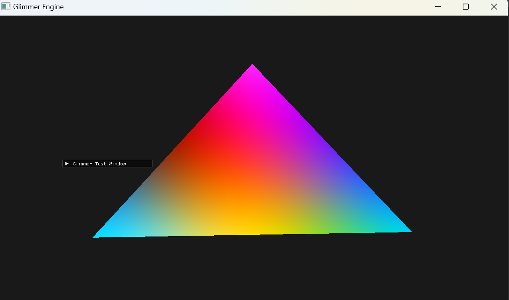

## 变换矩阵

这一步的作用是实现 **“物体级变换”**：让你可以通过代码让三角形（或正方形）在世界空间里**移动、旋转、缩放**，而不需要去动那块冰冷的顶点缓冲区

**修改 Shader 支持变换矩阵**

我们需要在顶点着色器中增加一个 u_Transform 变量。

**修改 SandboxApp.cpp 里的 vertexSrc：**

```
std::string vertexSrc = R"(
    #version 330 core
    
    layout(location = 0) in vec3 a_Position;

    uniform mat4 u_ViewProjection;
    uniform mat4 u_Transform; // ✨ 新增：模型变换矩阵

    out vec3 v_Position;
    uniform float u_Time;

    void main()
    {
        vec3 pos = a_Position;
        pos.y += sin(pos.x * 5.0 + u_Time) * 0.1;
        v_Position = pos;
        // ✨ 计算顺序：投影 * 视图 * 模型 * 原始坐标
        gl_Position = u_ViewProjection * u_Transform * vec4(pos, 1.0);
    }
)";
```

**升级渲染器接口 (Renderer.h/cpp)**

渲染器现在不仅要管摄像机，还要管每个物体的“位姿”。

**文件路径：Glimmer/src/Glimmer/Renderer/Renderer.h**

```
// 修改 Submit 函数签名，增加 transform 参数
static void Submit(const std::shared_ptr<Shader>& shader, 
                  const std::shared_ptr<VertexArray>& vertexArray, 
                  const glm::mat4& transform = glm::mat4(1.0f)); // ✨ 默认是单位矩阵
```

**Glimmer/src/Glimmer/Renderer/Renderer.cpp**

```
void Renderer::Submit(const std::shared_ptr<Shader>& shader, 
                     const std::shared_ptr<VertexArray>& vertexArray, 
                     const glm::mat4& transform)
{
    shader->Bind();
    // 1. 上传场景矩阵 (PV)
    shader->UploadUniformMat4("u_ViewProjection", s_SceneData->ViewProjectionMatrix);
    // 2. 上传物体变换矩阵 (M)
    shader->UploadUniformMat4("u_Transform", transform);

    vertexArray->Bind();
    RenderCommand::DrawIndexed(vertexArray);
}
```

**在 Sandbox 中画一个“正方形网格”**

现在我们要展示变换矩阵的威力。我们不再画三角形，而是画一个**正方形**，并且利用循环画出一堆小方块。

**修改 SandboxApp.cpp 构造函数（定义正方形）：**

```
// 1. 定义 4 个顶点
float vertices[4 * 3] = {
    -0.5f, -0.5f, 0.0f,
     0.5f, -0.5f, 0.0f,
     0.5f,  0.5f, 0.0f,
    -0.5f,  0.5f, 0.0f
};
// 2. 定义索引 (两个三角形拼成正方形)
uint32_t indices[6] = { 0, 1, 2, 2, 3, 0 };

// ... 初始化 vertexBuffer (Layout依然是 Float3) ...
// ... 初始化 m_VertexArray ...
```

**修改** **SandboxApp.cpp** **的** **OnUpdate**（动画逻辑）：

```
void OnUpdate(gl::Timestep ts) override {
    // ... 摄像机控制代码 ...

    gl::RenderCommand::SetClearColor({ 0.1f, 0.1f, 0.1f, 1 });
    gl::RenderCommand::Clear();

    gl::Renderer::BeginScene(m_Camera);

    // ✨ 准备一个基础的比例矩阵（让方块变小一点）
    glm::mat4 scale = glm::scale(glm::mat4(1.0f), glm::vec3(0.1f));

    m_Shader->Bind();
    m_Shader->UploadUniformFloat("u_Time", gl::Application::Get().GetTime());

    // ✨ 渲染一个 20x20 的方块阵列
    for (int y = 0; y < 20; y++) {
        for (int x = 0; x < 20; x++) {
            // 计算每个方块的位置
            glm::vec3 pos(x * 0.11f, y * 0.11f, 0.0f);
            glm::mat4 transform = glm::translate(glm::mat4(1.0f), pos) * scale;
            
            // 提交给渲染器，每个方块用不同的 transform
            gl::Renderer::Submit(m_Shader, m_VertexArray, transform);
        }
    }

    gl::Renderer::EndScene();
}
```

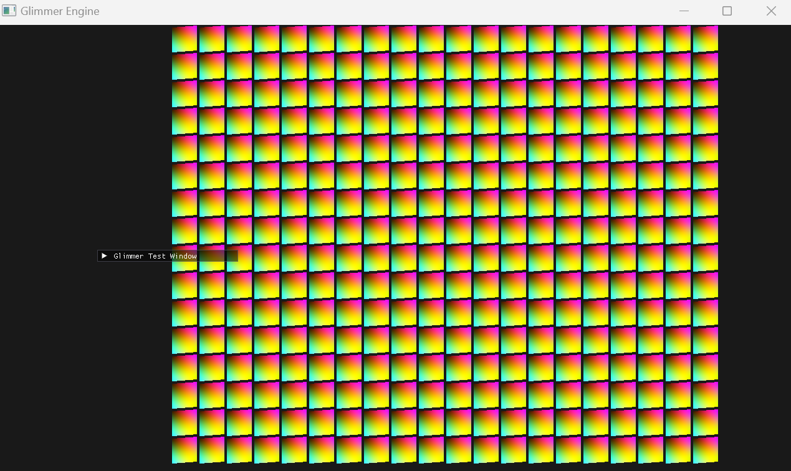

给每个方块加一点旋转:

```
float time = gl::Application::Get().GetTime();

for (int y = 0; y < 20; y++) {
    for (int x = 0; x < 20; x++) {
        glm::vec3 pos(x * 0.11f, y * 0.11f, 0.0f);
        
        // ✨ 让每个方块根据位置和时间，产生不同的旋转角度
        float rotation = time * 20.0f + (x + y) * 10.0f;
        
        glm::mat4 transform = glm::translate(glm::mat4(1.0f), pos) * 
                             glm::rotate(glm::mat4(1.0f), glm::radians(rotation), {0, 0, 1}) * 
                             scale;
        
        gl::Renderer::Submit(m_Shader, m_VertexArray, transform);
    }
}
```

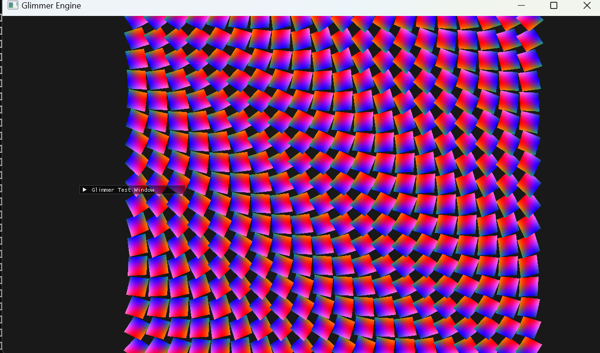

## 纹理

加入纹理（Texture）是引擎开发从“简笔画”向“真实画面”跨越的关键一步。

为了实现纹理，我们需要：

1. **图像加载库**：引入 stb_image（工业标准）。
2. **纹理抽象层**：定义 Texture 和 Texture2D 接口。
3. **OpenGL 实现**：编写 OpenGLTexture2D 类。
4. **管线升级**：让顶点数据支持 **UV 坐标**，并在 Shader 里使用采样器。

**集成图像加载库 stb_image**

stb_image 是一个极其轻量级的纯头文件 C 库。

1. **下载**：前往 [stb_image.h](https://github.com/nothings/stb/blob/master/stb_image.h) 下载该文件。

2. **物理存放**：放入 Glimmer/vendor/stb_image 目录下。

3. **实现文件**：在同目录下创建一个 stb_image.cpp（这是 C 库的要求）：

   ```
   #include "glpch.h"
   
   #define STB_IMAGE_IMPLEMENTATION
   #include "stb_image.h"
   ```

4. **修改 Premake**：将 vendor/stb_image 加入包含路径，并把这个 .cpp 编译进项目。

**定义纹理接口 (Texture.h)**

**文件路径：Glimmer/src/Glimmer/Renderer/Texture.h**

```
#pragma once
#include <string>
#include "Glimmer/Core.h"

namespace gl {

	class Texture
	{
	public:
		virtual ~Texture() = default;

		virtual uint32_t GetWidth() const = 0;
		virtual uint32_t GetHeight() const = 0;

		// slot 代表纹理单元（0-31），显卡可以同时绑定多个纹理
		virtual void Bind(uint32_t slot = 0) const = 0;
	};

	class Texture2D : public Texture
	{
	public:
		// 静态工厂方法，传入图片路径创建纹理
		static std::shared_ptr<Texture2D> Create(const std::string& path);
	};

}
```

**实现工厂方法 (Texture.cpp)**

**文件作用**：根据当前选用的图形 API（目前只有 OpenGL），返回具体的对象实例。
**Glimmer/src/Glimmer/Renderer/Texture.cpp**：

```
#include "glpch.h"
#include "Texture.h"

#include "Platform/OpenGL/OpenGLTexture2D.h"
#include "Glimmer/Renderer/Renderer.h"

namespace gl {

	std::shared_ptr<Texture2D> Texture2D::Create(const std::string& path)
	{
		// 以后这里可以根据 Renderer::GetAPI() 进行分支切换
		return std::make_shared<OpenGLTexture2D>(path);
	}

}
```

**实现 OpenGL 版本的纹理类**

这里是真正与显卡和驱动打交道的地方。

**文件路径说明**：

- .h 负责定义 OpenGL 专属的私有变量（如 m_RendererID）。
- .cpp 负责加载图片、配置显卡过滤参数、上传像素数据。

**Glimmer/src/Platform/OpenGL/OpenGLTexture2D.h**：

```
#pragma once
#include "Glimmer/Renderer/Texture.h"

namespace gl {

	class OpenGLTexture2D : public Texture2D
	{
	public:
		OpenGLTexture2D(const std::string& path);
		virtual ~OpenGLTexture2D();

		virtual uint32_t GetWidth() const override { return m_Width; }
		virtual uint32_t GetHeight() const override { return m_Height; }

		virtual void Bind(uint32_t slot = 0) const override;
	private:
		std::string m_Path;
		uint32_t m_Width, m_Height;
		uint32_t m_RendererID; // GPU 端的资源 ID
	};

}
```

**Glimmer/src/Platform/OpenGL/OpenGLTexture2D.cpp**：

这个类在构造时先通过 `stb_image` 从硬盘读取图片数据，然后根据图片通道数选择合适的 OpenGL 格式（RGB/RGBA），接着在 GPU 中创建纹理对象并分配显存，通过 `glTexImage2D` 把像素数据上传到显卡，最后设置采样方式（过滤），这样这张图片就变成了可以在 Shader 中使用的纹理；`Bind` 函数则负责把这个纹理绑定到指定的纹理槽位，供渲染时采样使用。

**升级 Sandbox 渲染管线 (支持 UV)**

要显示贴图，你的顶点必须知道图片上的哪个点对应模型上的哪个点（UV 坐标）。

**修改 Sandbox 顶点数据**：

```
float vertices[4 * 5] = {
    // X, Y, Z          // U, V (0-1范围)
    -0.5f, -0.5f, 0.0f,  0.0f, 0.0f, // 左下
     0.5f, -0.5f, 0.0f,  1.0f, 0.0f, // 右下
     0.5f,  0.5f, 0.0f,  1.0f, 1.0f, // 右上
    -0.5f,  0.5f, 0.0f,  0.0f, 1.0f  // 左上
};
```

**更新布局 (Layout)**：

```
vertexBuffer->SetLayout({
    { gl::ShaderDataType::Float3, "a_Position" },
    { gl::ShaderDataType::Float2, "a_TexCoord" } // 👈 新增 UV 属性
});
```

**更新 Shader 代码**：

```
// 顶点着色器
layout(location = 1) in vec2 a_TexCoord; 
out vec2 v_TexCoord;
void main() {
    v_TexCoord = a_TexCoord;
    gl_Position = u_ViewProjection * u_Transform * vec4(a_Position, 1.0);
}

// 片元着色器
uniform sampler2D u_Texture; // 👈 采样器
void main() {
    color = texture(u_Texture, v_TexCoord);
}
```

之后更换相关变量，并加入

```
    m_TextureShader.reset(gl::Shader::Create(vertexSrc, fragmentSrc));
    m_Texture = gl::Texture2D::Create("assets/textures/Henry.jpg");

    std::dynamic_pointer_cast<gl::OpenGLShader>(m_TextureShader)->Bind();
    std::dynamic_pointer_cast<gl::OpenGLShader>(m_TextureShader)->UploadUniformInt("u_Texture", 0);
```

若要混合颜色和纹理，将两者相乘

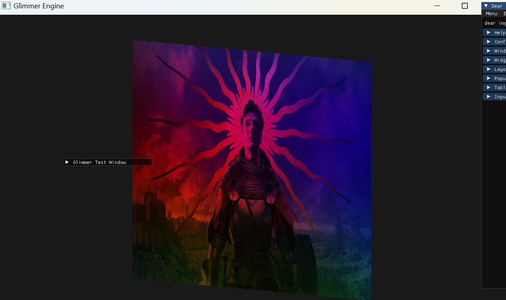

## Alpha 混合

现在加载的纹理，如果是透明的 .png 图片（比如一个带圆角的按钮或一个角色小人），你会发现透明的地方变成了**纯黑色**。
这是因为 OpenGL 默认是直接“覆盖”像素的。你需要告诉显卡：请根据图片的 Alpha 通道进行混合。

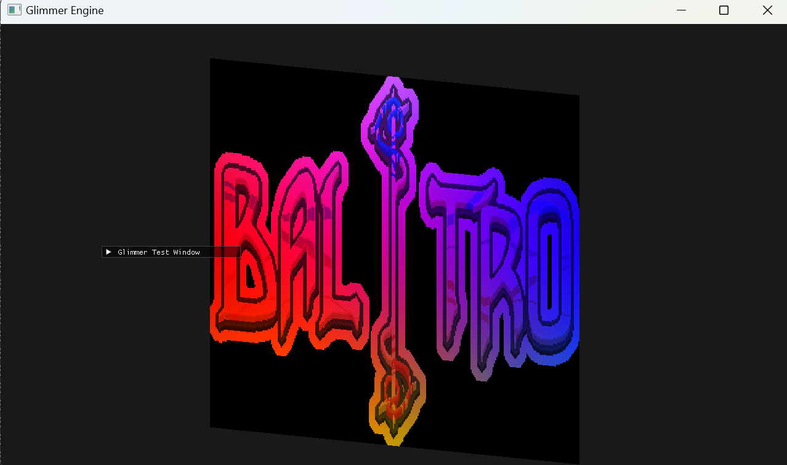

在 OpenGLRendererAPI.cpp 的 Init 函数中加入：

```
glEnable(GL_BLEND);
glBlendFunc(GL_SRC_ALPHA, GL_ONE_MINUS_SRC_ALPHA);
```

并在下列文件声明Init()函数

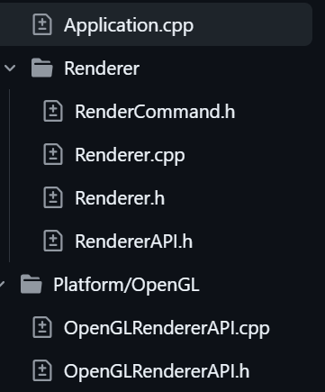

最后在Application启用

```
Renderer::Init();
```

如今的png透明已经去除黑边

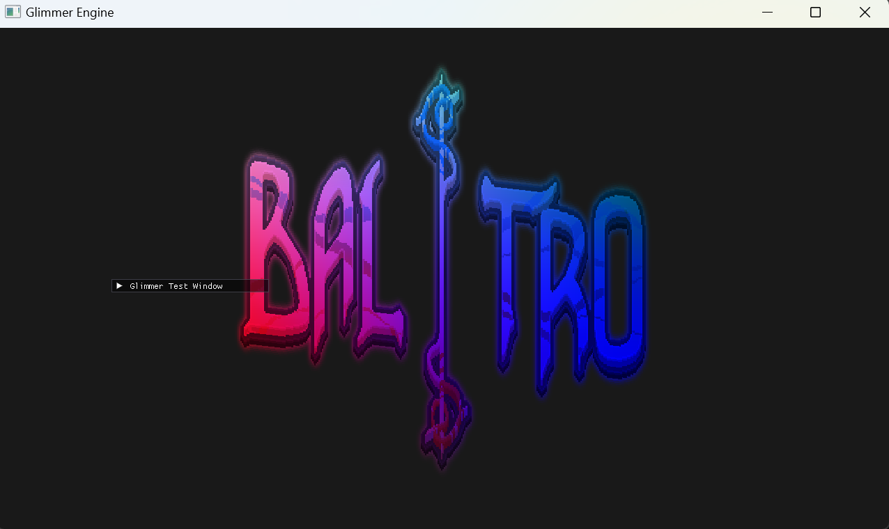

## 单文件多着色器模式

将 Shader 从 C++ 字符串搬迁到外部文件（.glsl 或 .hlsl）是引擎开发的必经之路。这不仅能让代码更整洁，还能让你利用 VS Code 等工具的插件实现 **GLSL 语法高亮**。

我们将实现一种**“单文件多着色器”**模式：即一个 .glsl 文件里同时包含顶点（Vertex）和片元（Fragment）代码，通过特殊的标签（如 #type vertex）来区分。

**准备外部 Shader 文件**

在你的项目目录下创建 assets/shaders/Texture.glsl 文件，内容如下：

**assets/shaders/Texture.glsl**:

```
#type vertex
#version 330 core

layout(location = 0) in vec3 a_Position;
layout(location = 1) in vec2 a_TexCoord;

uniform mat4 u_ViewProjection;
uniform mat4 u_Transform;
uniform float u_Time;

out vec3 v_Position;
out vec2 v_TexCoord;

void main()
{
    v_TexCoord = a_TexCoord;
    vec3 pos = a_Position;
    pos.y += sin(pos.x * 5.0 + u_Time) * 0.1;
    v_Position = pos;
    gl_Position = u_ViewProjection * u_Transform * vec4(pos, 1.0);
}

#type fragment
#version 330 core

layout(location = 0) out vec4 color;

in vec3 v_Position;
in vec2 v_TexCoord;

uniform sampler2D u_Texture;
uniform float u_Time;

void main()
{
    vec3 col;
    // 使用三角函数让 R, G, B 三个通道随位置和时间发生不同的相位偏移
    col.r = sin(v_Position.x * 3.0 + u_Time) * 0.5 + 0.5;
    col.g = sin(v_Position.y * 3.0 + u_Time + 2.0) * 0.5 + 0.5;
    col.b = sin((v_Position.x + v_Position.y) * 3.0 + u_Time + 4.0) * 0.5 + 0.5;
    color = vec4(col, 1.0);
    color *= texture(u_Texture, v_TexCoord);
}
```

**扩展 Shader.h 接口**

我们需要增加一个接收“文件路径”的工厂方法。

**Glimmer/src/Glimmer/Renderer/Shader.h**:

```
static Shader* Create(const std::string& filepath);
```

```
	Shader* Shader::Create(const std::string& filepath)
	{
		return new OpenGLShader(filepath);
	}
```

**在 OpenGLShader 中实现文件读取与解析**

我们需要增加两个核心私有方法：ReadFile（读文件）和 PreProcess（解析标签）。

**Glimmer/src/Platform/OpenGL/OpenGLShader.h**:

```
class OpenGLShader : public Shader {
public:
    OpenGLShader(const std::string& filepath); // ✨ 新构造函数
    // ...
private:
    std::string ReadFile(const std::string& filepath);
    std::unordered_map<GLenum, std::string> PreProcess(const std::string& source);
    void Compile(const std::unordered_map<GLenum, std::string>& shaderSources);
private:
    uint32_t m_RendererID;
    std::string m_Name; // 用于 Shader 库标识
};
```

核心分割算法：**把一个“合并写在一起的 shader 文件”，按 `#type` 标签拆分成多个独立的着色器源码（vertex / fragment）**，并用 `unordered_map` 存起来，方便后续编译。

函数一开始创建了一个 `unordered_map<GLenum, std::string>`，用于存储“着色器类型 → 对应源码”的映射关系，比如：

```
GL_VERTEX_SHADER   -> 顶点着色器源码
GL_FRAGMENT_SHADER -> 片元着色器源码
```

接着它在整段字符串 `source` 里查找 `#type` 这个标记（比如 `#type vertex`），一旦找到，就说明接下来是一段新的 shader。它先找到这一行的结尾（`\n`），然后从 `#type` 后面截取出类型字符串（例如 `"vertex"` 或 `"fragment"`），再通过 `ShaderTypeFromString` 转换成 OpenGL 能识别的枚举（如 `GL_VERTEX_SHADER`）。

然后关键来了：它会找到**下一行真正 shader 代码开始的位置**，并继续往后找下一个 `#type`，这样就可以确定“当前 shader 代码的范围”，最后用 `substr` 把这一段源码切出来，存进 map 里。

这个过程会循环执行，直到把整个文件里的所有 shader 都拆完。

```
	std::unordered_map<GLenum, std::string> OpenGLShader::PreProcess(const std::string& source)
	{
		std::unordered_map<GLenum, std::string> shaderSources;

		const char* typeToken = "#type";
		size_t typeTokenLength = strlen(typeToken);
		size_t pos = source.find(typeToken, 0);
		while (pos != std::string::npos)
		{
			size_t eol = source.find_first_of("\r\n", pos);
			GL_CORE_ASSERT(eol != std::string::npos, "Syntax error");
			size_t begin = pos + typeTokenLength + 1;
			std::string type = source.substr(begin, eol - begin);
			GL_CORE_ASSERT(ShaderTypeFromString(type), "Invalid shader type specified");

			size_t nextLinePos = source.find_first_not_of("\r\n", eol);
			pos = source.find(typeToken, nextLinePos);
			shaderSources[ShaderTypeFromString(type)] = source.substr(nextLinePos, pos - (nextLinePos == std::string::npos ? source.size() - 1 : nextLinePos));
		}

		return shaderSources;
	}
```

```
	static GLenum ShaderTypeFromString(const std::string& type)
	{
		if (type == "vertex") return GL_VERTEX_SHADER;
		if (type == "fragment" || type == "pixel") return GL_FRAGMENT_SHADER;

		GL_CORE_ASSERT(false, "Unknown shader type!");
		return 0;
	}
```

**制作新shader：小丑牌背景**

要实现那种“红蓝颜料交替的黏稠漩涡感”，我们需要在 Fragment Shader 中完成以下逻辑：

1. **坐标归一化**：将 UV 映射到中心点。
2. **极坐标转换**：将直角坐标转为角度和半径，实现基础旋转。
3. **多层噪声 (FBM)**：制造不规则的颜料团块感。
4. **领域扭曲**：用噪声去偏移噪声的坐标，产生“液体搅拌”的效果。

```
#type vertex
#version 330 core

layout(location = 0) in vec3 a_Position;
uniform mat4 u_ViewProjection;
uniform mat4 u_Transform;

out vec2 v_Position;

void main()
{
	v_Position = a_Position.xy;
	gl_Position = u_ViewProjection * u_Transform * vec4(a_Position, 1.0);
}

#type fragment
#version 330 core

layout(location = 0) out vec4 color;
in vec2 v_Position;

uniform float u_Time;

// 基础噪声函数：制造随机感
float hash(vec2 p) {
	p = fract(p * vec2(123.34, 456.21));
	p += dot(p, p + 45.32);
	return fract(p.x * p.y);
}

// 简单的平滑噪声
float noise(vec2 p) {
	vec2 i = floor(p);
	vec2 f = fract(p);
	float a = hash(i);
	float b = hash(i + vec2(1.0, 0.0));
	float c = hash(i + vec2(0.0, 1.0));
	float d = hash(i + vec2(1.0, 1.0));
	vec2 u = f * f * (3.0 - 2.0 * f);
	return mix(a, b, u.x) + (c - a) * u.y * (1.0 - u.x) + (d - b) * u.x * u.y;
}

// 分形布朗运动 (FBM)：叠加强度不同的噪声，产生细节
float fbm(vec2 p) {
	float v = 0.0;
	float a = 0.5;
	mat2 rot = mat2(1.6, 1.2, -1.2, 1.6); // 每一层旋转一下，打乱方向
	for (int i = 0; i < 5; i++) {
		v += a * noise(p);
		p = rot * p * 2.0;
		a *= 0.5;
	}
	return v;
}

void main()
{
	vec2 uv = v_Position; // 假设传入的是 -0.5 到 0.5 的坐标

	// 1. 基础极坐标变换 (产生漩涡核心)
	float r = length(uv);
	float angle = atan(uv.y, uv.x);

	// 2. 漩涡扭曲：距离中心越近，旋转越快
	// u_Time 控制总速度，1.0/r 产生漩涡拉扯
	float strength = 1.5;
	float swirl = angle + (strength / (r + 0.15)) * (u_Time * 0.5);

	// 3. 领域扭曲 (Domain Warping)：让颜料看起来“不规则”的关键
	// 我们用 FBM 产生的数值去偏移坐标
	vec2 warpUV = vec2(cos(swirl) * r, sin(swirl) * r);
	float n = fbm(warpUV * 3.0 + u_Time * 0.2);

	float m = fbm(warpUV * 2.0 + n + u_Time * 0.1);

	// 4. 颜色调色板 (经典的红蓝交替)
	vec3 colorRed = vec3(0.8, 0.1, 0.2);   // 深红
	vec3 colorBlue = vec3(0.1, 0.2, 0.7);  // 深蓝
	vec3 colorHighlight = vec3(0.9, 0.8, 1.0); // 亮色边缘

	// 用最终的噪声值 m 来在红蓝之间混合
	vec3 finalCol = mix(colorRed, colorBlue, m);

	// 叠加一些高光效果，增加颜料的质感
	finalCol += smoothstep(0.7, 1.0, m) * 0.3;

	// 边缘暗角处理
	finalCol *= smoothstep(1.5, 0.3, r);

	color = vec4(finalCol, 1.0);
}
```

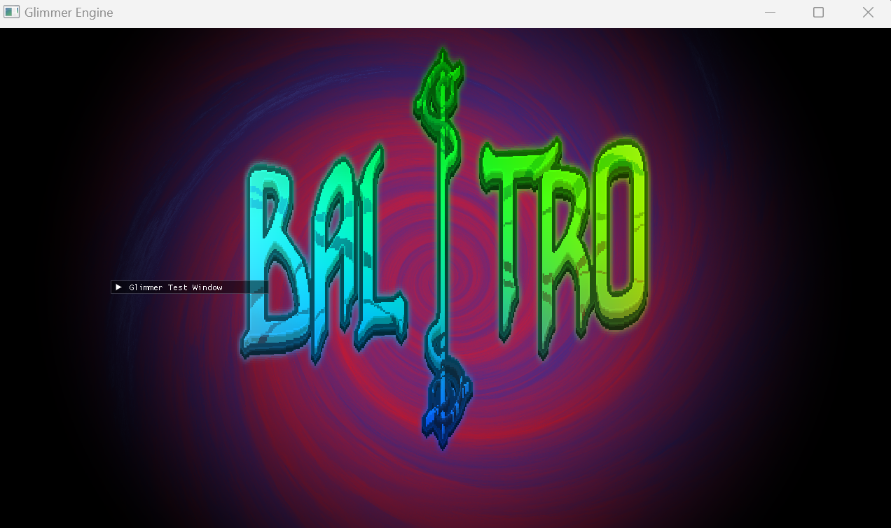

通过解包小丑牌的源代码发现，原效果用到了`uniform float u_VortexAmt; // 对应 vortex_amt 强度`这种的思路，所以需要通过时间来获取强度变化

```
    // ✨ 重点：让扭曲强度随时间正弦波动 (从 -2 到 2 循环拧)
    float vortexStrength = sin(time) * 2.0f; 
    m_VortexShader->UploadUniformFloat("u_VortexAmt", vortexStrength);
```

```
void main()
{
	// 1. 获取基础坐标 (假设 v_Position 是相对于中心的)
	vec2 uv = v_Position;
	float r = length(uv);
	float angle = atan(uv.y, uv.x);

	// 2. 融合：第二段代码的 Smoothstep 扭曲逻辑
	// 控制旋转半径和角度
	float effectRadius = 2.0;
	float twist = u_VortexAmt * smoothstep(effectRadius, 0.0, r);

	// 3. 加入“不规则正弦”效果 (波浪抖动)
	// 利用 sin 让漩涡边缘产生不规则的起伏
	float wobble = sin(r * 10.0 - u_Time * 2.0) * 0.05;

	// 最终角度 = 原始角度 + 强度扭曲 + 动态旋转 + 波浪抖动
	float finalAngle = angle + twist + (u_Time * 0.2) + wobble;

	// 4. 将扭曲后的极坐标转回平面坐标，作为颜料噪声的输入
	vec2 twistedUV = vec2(cos(finalAngle), sin(finalAngle)) * r;

	// 5. 领域扭曲 (Balatro 核心颜料算法)
	float n = fbm(twistedUV * 3.0 + u_Time * 0.1);
	float m = fbm(twistedUV * 2.0 + n + u_Time * 0.05);

	// 6. 颜色混合 (红蓝艺术配色)
	vec3 colorRed = vec3(0.85, 0.15, 0.2);   // 鲜亮红
	vec3 colorBlue = vec3(0.1, 0.25, 0.75);  // 宝石蓝
	vec3 darkColor = vec3(0.1, 0.05, 0.15);
	vec3 darkRed = vec3(0.2, 0.0, 0.0);   // 偏黑红
	vec3 darkBlue = vec3(0.0, 0.0, 0.2);  // 偏黑蓝
	vec3 darkGreen = vec3(0.0, 0.2, 0.0); // 偏黑绿
	vec3 deepBlue = vec3(0.05, 0.05, 0.3); // 深蓝，略带一点暗

	// 用最终噪声值 m 混合，并加入高光亮边
	vec3 finalCol = mix(colorRed, colorBlue, m);
	finalCol += smoothstep(0.75, 1.0, m) * 0.25; // 增加白色颜料反光

	// 7. 边缘压暗 (Vignette)
	finalCol *= smoothstep(1.8, 0.5, r);

	color = vec4(finalCol, 1.0);
}
```

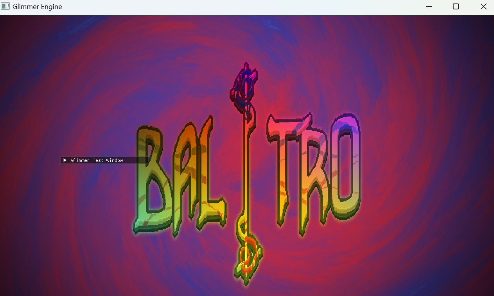

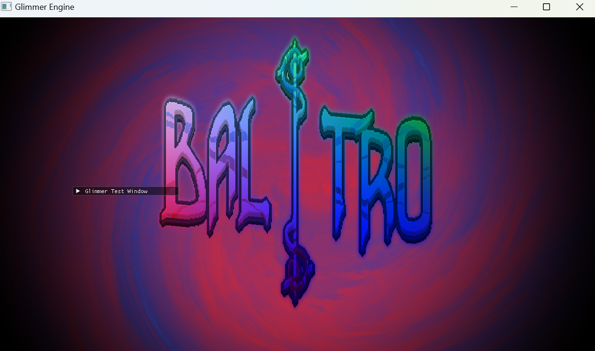

对比了下游戏效果感觉差远了，特意从shadertoy上扒了大手子复刻的源码进行Glimmer的适配，并学习实现步骤

```
#type vertex
#version 330 core

layout(location = 0) in vec3 a_Position;
uniform mat4 u_ViewProjection;
uniform mat4 u_Transform;

void main()
{
    gl_Position = u_ViewProjection * u_Transform * vec4(a_Position, 1.0);
}

#type fragment
#version 330 core

layout(location = 0) out vec4 color;

uniform float u_Time;
uniform vec2 u_Resolution;

// --- 原版配置参数 ---
#define SPIN_ROTATION -2.0
#define SPIN_SPEED 7.0
#define OFFSET vec2(0.0)
#define COLOUR_1 vec4(0.871, 0.267, 0.231, 1.0)
#define COLOUR_2 vec4(0.0, 0.42, 0.706, 1.0)
#define COLOUR_3 vec4(0.086, 0.137, 0.145, 1.0)
#define CONTRAST 3.5
#define LIGTHING 0.4
#define SPIN_AMOUNT 0.25
#define PIXEL_FILTER 745.0
#define SPIN_EASE 1.0
#define IS_ROTATE false
#define PI 3.14159265359

vec4 effect(vec2 screenSize, vec2 screen_coords) {
    // 1. 像素化逻辑：产生小丑牌特有的复古感
    float pixel_size = length(screenSize.xy) / PIXEL_FILTER;
    vec2 uv = (floor(screen_coords.xy * (1./pixel_size)) * pixel_size - 0.5 * screenSize.xy) / length(screenSize.xy) - OFFSET;
    float uv_len = length(uv);
    
    // 2. 旋转逻辑
    float speed = (SPIN_ROTATION * SPIN_EASE * 0.2);
    if(IS_ROTATE){
       speed = u_Time * speed;
    }
    speed += 302.2;
    float new_pixel_angle = atan(uv.y, uv.x) + speed - SPIN_EASE * 20. * (1. * SPIN_AMOUNT * uv_len + (1. - 1. * SPIN_AMOUNT));
    vec2 mid = (screenSize.xy / length(screenSize.xy)) / 2.;
    uv = (vec2((uv_len * cos(new_pixel_angle) + mid.x), (uv_len * sin(new_pixel_angle) + mid.y)) - mid);
    
    // 3. 核心扰动循环：产生黏稠的液体感
    uv *= 30.;
    float time_speed = u_Time * (SPIN_SPEED);
    vec2 uv2 = vec2(uv.x + uv.y);
    
    for(int i=0; i < 5; i++) {
        uv2 += sin(max(uv.x, uv.y)) + uv;
        uv  += 0.5 * vec2(cos(5.1123314 + 0.353 * uv2.y + time_speed * 0.131121), sin(uv2.x - 0.113 * time_speed));
        uv  -= 1.0 * cos(uv.x + uv.y) - 1.0 * sin(uv.x * 0.711 - uv.y);
    }
    
    // 4. 颜色与光照计算
    float contrast_mod = (0.25 * CONTRAST + 0.5 * SPIN_AMOUNT + 1.2);
    float paint_res = min(2., max(0., length(uv) * (0.035) * contrast_mod));
    float c1p = max(0., 1. - contrast_mod * abs(1. - paint_res));
    float c2p = max(0., 1. - contrast_mod * abs(paint_res));
    float c3p = 1. - min(1., c1p + c2p);
    float light = (LIGTHING - 0.2) * max(c1p * 5. - 4., 0.) + LIGTHING * max(c2p * 5. - 4., 0.);
    
    return (0.3 / CONTRAST) * COLOUR_1 + (1. - 0.3 / CONTRAST) * (COLOUR_1 * c1p + COLOUR_2 * c2p + vec4(c3p * COLOUR_3.rgb, c3p * COLOUR_1.a)) + light;
}

void main() {
    // 使用内置 gl_FragCoord 配合 u_Resolution 还原 Shadertoy 的渲染环境
    color = effect(u_Resolution, gl_FragCoord.xy);
}
```

这段 shader 的整体思路可以概括为：**把屏幕空间的像素坐标（gl_FragCoord）转成一个“可操作的 UV 空间”，然后通过“像素化 → 极坐标旋转 → 多次扰动 → 颜色混合”这一连串变换，生成一种动态的流体/漩涡视觉效果**。具体来说，先利用 `u_Resolution` 把屏幕坐标归一化并做一次 `floor` 量化，制造出复古的“像素块”质感；接着把 UV 转成极坐标（用 `atan` 和长度），在角度上叠加一个与半径相关的旋转偏移，从而形成整体的旋转/扭曲结构；然后进入核心的 for 循环，通过多次 sin/cos 非线性扰动不断“搅动”坐标，让原本规则的空间变得像流体一样粘稠、混乱，这一步是视觉复杂度的来源；最后根据扰动后的坐标长度计算权重（c1p、c2p、c3p），在三种预设颜色之间做混合，并叠加一点类似高光的亮度计算，从而得到具有层次感的红蓝主色调效果，最终输出到屏幕上。

## 着色器库

加入 **ShaderLibrary（着色器库）** 是引擎资源管理系统的开端。

目前，在 ExampleLayer 的构造函数里手动 reset 每一个 Shader，这会导致：

1. **代码臃肿**：加载 10 个 Shader 就要写 10 行几乎重复的代码。
2. **内存浪费**：如果两个图层都用到同一个 Shader，你会重复加载并编译两次。
3. **管理困难**：你必须时刻持有 Shader 的指针才能使用它。

**ShaderLibrary 的目标**：让你通过 m_ShaderLib.Get("Balatro") 这种字符串方式，随时随地在任何地方调用已加载的资源。

**修改 Shader.h 接口**

为了让库能识别 Shader，我们需要给 Shader 增加一个“名字”属性。

**Glimmer/src/Glimmer/Renderer/Shader.h**:

```
namespace gl {
    class Shader {
    public:
        virtual ~Shader() = default;
        // ... 原有虚函数 ...

        // ✨ 新增：获取 Shader 名字
        virtual const std::string& GetName() const = 0;

        static Ref<Shader> Create(const std::string& filepath);
        static Ref<Shader> Create(const std::string& name, const std::string& vertexSrc, const std::string& fragmentSrc);
    };

    // ✨ 新增：ShaderLibrary 类
    class ShaderLibrary {
    public:
        // 手动添加已创建的 Shader 对象
        void Add(const std::string& name, const Ref<Shader>& shader);
        void Add(const Ref<Shader>& shader);

        // 直接从文件加载并存入库
        Ref<Shader> Load(const std::string& filepath);
        Ref<Shader> Load(const std::string& name, const std::string& filepath);

        // 获取资源
        Ref<Shader> Get(const std::string& name);

        bool Exists(const std::string& name) const;
    private:
        std::unordered_map<std::string, Ref<Shader>> m_Shaders;
    };
}
```

**修改 OpenGLShader 记录名字**

确保 m_Name 在构造时被正确赋值（我们在之前的“文件读取”步骤中已经预留了此逻辑）。

**Glimmer/src/Platform/OpenGL/OpenGLShader.h**:

```
class OpenGLShader : public Shader {
public:
    // ...
    virtual const std::string& GetName() const override { return m_Name; }
private:
    std::string m_Name;
    uint32_t m_RendererID;
};
```

cpp构造函数

```
	OpenGLShader::OpenGLShader(const std::string& filepath)
	{
		std::string source = ReadFile(filepath);
		auto shaderSources = PreProcess(source);
		Compile(shaderSources);

		// Extract name from filepath
		auto lastSlash = filepath.find_last_of("/\\");
		lastSlash = lastSlash == std::string::npos ? 0 : lastSlash + 1;
		auto lastDot = filepath.rfind('.');
		auto count = lastDot == std::string::npos ? filepath.size() - lastSlash : lastDot - lastSlash;
		m_Name = filepath.substr(lastSlash, count);
	}
```

**实现 ShaderLibrary 逻辑**

**Glimmer/src/Glimmer/Renderer/Shader.cpp** (在文件末尾添加)：函数实现

修改Create

```
	Ref<Shader> Shader::Create(const std::string& filepath)
	{
		return std::make_shared<OpenGLShader>(filepath);
	}

	Ref<Shader> Shader::Create(const std::string& name, const std::string& vertexSrc, const std::string& fragmentSrc)
	{
		return std::make_shared<OpenGLShader>(name, vertexSrc, fragmentSrc);
    }
```

以及其余函数逻辑

```
	// --- ShaderLibrary 实现 ---

	void ShaderLibrary::Add(const std::string& name, const Ref<Shader>& shader)
	{
		GL_CORE_ASSERT(!Exists(name), "Shader already exists!");
		m_Shaders[name] = shader;
	}

	void ShaderLibrary::Add(const Ref<Shader>& shader)
	{
		auto& name = shader->GetName();
		Add(name, shader);
	}
	// 。。。
```

**在 Sandbox 中优雅地重构**

现在，你的 ExampleLayer 构造函数和渲染逻辑会变得极其干净。

**SandboxApp.cpp**:

```
class ExampleLayer : public gl::Layer {
public:
    ExampleLayer() : Layer("Example")
    {
        // ✨ 批量加载，不需要自己管理指针了
        m_ShaderLib.Load("assets/shaders/Texture.glsl");
        m_ShaderLib.Load("assets/shaders/BalatroVortex.glsl");
        m_ShaderLib.Load("assets/shaders/Octgrams.glsl");
        
        m_Texture = gl::Texture2D::Create("assets/textures/Balatro.png");
    }

    void OnUpdate(gl::Timestep ts) override {
        // ... 
        
        // ✨ 使用时直接通过名字取
        auto textureShader = m_ShaderLib.Get("Texture");
        textureShader->Bind();
        m_Texture->Bind();
        gl::Renderer::Submit(textureShader, m_VertexArray);
        
        // 如果想换背景，一句话切换
        auto bgShader = m_ShaderLib.Get("BalatroVortex");
        gl::Renderer::Submit(bgShader, m_bg_vortexVertexArray);
    }

private:
    gl::ShaderLibrary m_ShaderLib; // ✨ 库对象
    gl::Ref<gl::VertexArray> m_VertexArray;
    gl::Ref<gl::Texture2D> m_Texture;
    // ... 不再需要定义一堆 m_Shader1, m_Shader2 ...
};
```

清理Sandbox多余注释

## 正交摄像机控制器

加入 **OrthographicCameraController（正交摄像机控制器）** 是为了将“摄像机硬件”与“用户交互”彻底解耦。

**现状**：你之前的 WASD 逻辑写在 ExampleLayer 里。如果以后有多个关卡或编辑器模式，你需要重复写这些逻辑，且窗口拉伸时画面会变形。
**目标**：封装一个控制器，让它自动处理 **移动、旋转、缩放（滚轮）** 以及 **分辨率自适应**。

**第一步：创建控制器类 (OrthographicCameraController.h/cpp)**

这个类将包裹 OrthographicCamera，并负责监听事件。

**文件路径：Glimmer/src/Glimmer/Renderer/OrthographicCameraController.h**

```
#pragma once

#include "Glimmer/Renderer/OrthographicCamera.h"
#include "Glimmer/Core/Timestep.h"

#include "Glimmer/Events/ApplicationEvent.h"
#include "Glimmer/Events/MouseEvent.h"

namespace gl {

	class OrthographicCameraController
	{
	public:
		OrthographicCameraController(float aspectRatio, bool rotation = false);

		void OnUpdate(Timestep ts);
		void OnEvent(Event& e);

		OrthographicCamera& GetCamera() { return m_Camera; }
		const OrthographicCamera& GetCamera() const { return m_Camera; }

		float GetZoomLevel() const { return m_ZoomLevel; }
		void SetZoomLevel(float level) { m_ZoomLevel = level; CalculateView(); }
	private:
		bool OnMouseScrolled(MouseScrolledEvent& e);
		bool OnWindowResized(WindowResizeEvent& e);
		void CalculateView();
	private:
		float m_AspectRatio;
		float m_ZoomLevel = 1.0f;
		OrthographicCamera m_Camera;

		bool m_Rotation;
		glm::vec3 m_CameraPosition = { 0.0f, 0.0f, 0.0f };
		float m_CameraRotation = 0.0f; // 角度单位
		float m_CameraTranslationSpeed = 5.0f, m_CameraRotationSpeed = 180.0f;
	};

}
```

cpp负责“根据输入实时更新相机的 Position / Rotation / Projection”，从而控制你看到的画面（移动、旋转、缩放、窗口自适应）

整个类本质是一个“相机驱动器”：在 `OnUpdate` 里读取键盘输入（WASD 控平移，QE 控旋转），不断修改 `m_CameraPosition` 和 `m_CameraRotation`，再同步到 `m_Camera`；同时用 `m_ZoomLevel` 控制缩放，并把它反过来影响移动速度（缩得越近移动越慢，手感更自然）。在 `OnEvent` 里则监听事件系统：鼠标滚轮改变 `ZoomLevel` 实现缩放，窗口大小变化时更新 `AspectRatio`，然后统一通过 `CalculateView()` 重新计算正交投影矩阵，保证画面不会被拉伸。最终结果就是——无论是输入还是窗口变化，都会实时影响“你看到的世界范围”。

**修改 OrthographicCamera.h 增加 SetProjection**

你需要让摄像机能够中途修改它的投影范围。

```
// OrthographicCamera.h 中增加
void SetProjection(float left, float right, float bottom, float top);

// OrthographicCamera.cpp 实现
void OrthographicCamera::SetProjection(float left, float right, float bottom, float top)
{
    m_ProjectionMatrix = glm::ortho(left, right, bottom, top, -1.0f, 1.0f);
    m_ViewProjectionMatrix = m_ProjectionMatrix * m_ViewMatrix;
}
```

**在 Sandbox 中重构**

现在的 Sandbox 代码将变得极其整洁，所有的 WASD 逻辑全部消失！

**SandboxApp.cpp**:

```
class ExampleLayer : public gl::Layer {
public:
    ExampleLayer() 
        : Layer("Example"), 
          m_CameraController(1280.0f / 720.0f, true) // ✨ 初始化控制器
    {
        // ... 加载数据逻辑不变 ...
    }

    void OnUpdate(gl::Timestep ts) override {
        // 1. ✨ 只要这一行，移动、缩放、旋转全搞定！
        m_CameraController.OnUpdate(ts);

        // 2. 渲染指令
        gl::RenderCommand::SetClearColor({ 0.1f, 0.1f, 0.1f, 1 });
        gl::RenderCommand::Clear();

        // 3. ✨ 从控制器拿摄像机
        gl::Renderer::BeginScene(m_CameraController.GetCamera());
        
        // ... 执行 Submit ...
        
        gl::Renderer::EndScene();
    }

    void OnEvent(gl::Event& e) override {
        // ✨ 将事件转发给控制器
        m_CameraController.OnEvent(e);
    }

private:
    gl::OrthographicCameraController m_CameraController; // ✨ 控制器成员
    // ... 其他变量 ...
};
```

## Renderer2D

目前的渲染方式是：
gl::Renderer::Submit(m_Shader, m_VertexArray, transform);
这要求开发者在 Sandbox 里自己管理 VAO、VBO 和 Shader。

**Renderer2D 的目标是：** 建立一套极其简化的 **2D 绘图指令集**。你只需要告诉引擎：*“在 (1,1) 位置画一个红色的方块”* 或者 *“在 (0,0) 位置画一个带贴图的方块”*。

并且考虑是否将SandboxApp分离出 Sandbox.h/cpp

**即使现在已经进行了shader库的编写，并可以从硬盘读glsl，但是sandboxapp仍有VAO、VBO的绑定等冗余代码，故抽离出Sandbox2D，以后想做一个主菜单层、一个游戏关卡层、一个结算层。每个层都应该是独立的 .h/cpp 文件。**

1. 新建 Sandbox2D.h 和 Sandbox2D.cpp。
2. 将 ExampleLayer 的逻辑全部搬进去，改名叫 Sandbox2D。
3. 在 SandboxApp.cpp 里的 Sandbox 构造函数中：PushLayer(new Sandbox2D());。

在 Glimmer 引擎的架构中，EntryPoint.h 包含了真正的 int main() 函数。

- **真相是：** 在 SandboxApp.cpp 里包含了 #include <Glimmer.h>（或者直接包含了 EntryPoint.h），同时在 Sandbox2D.cpp 里也包含了它。
- **结果：** 编译器在编译这两个文件时，分别都在里面发现了一个 main 函数。当链接器（Linker）最后要把这两个文件拼成一个 .exe 时，它发现有两个入口，于是就崩溃了。

**这样** **SandboxApp.cpp** **以后就只剩下几行代码，专门负责“创建游戏应用”，而真正的游戏内容全部都在** **Sandbox2D.cpp** **里了。**

这套代码实现了 **2D 渲染器的第一阶段：封装 API 调用**。它引入了“白贴图”技术，让你可以用同一个接口画**纯色方块和带贴图的方块**。

Glimmer/src/Glimmer/Renderer/Renderer2D.h

```
#pragma once

#include "Glimmer/Renderer/OrthographicCamera.h"
#include "Glimmer/Renderer/Texture.h"

namespace gl {

	class Renderer2D
	{
	public:
		static void Init();
		static void Shutdown();

		static void BeginScene(const OrthographicCamera& camera);
		static void EndScene();

		// --- 基础绘图接口 (Quads) ---

		// 纯色方块 (Vector2 & Vector3 坐标支持)
		static void DrawQuad(const glm::vec2& position, const glm::vec2& size, const glm::vec4& color);
		static void DrawQuad(const glm::vec3& position, const glm::vec2& size, const glm::vec4& color);

		// 贴图方块
		static void DrawQuad(const glm::vec2& position, const glm::vec2& size, const Ref<Texture2D>& texture);
		static void DrawQuad(const glm::vec3& position, const glm::vec2& size, const Ref<Texture2D>& texture);

	};
}
```

**Glimmer/src/Glimmer/Renderer/Renderer2D.cpp**

在初始化阶段创建并保存一个通用的四边形（Quad）顶点数据（包含位置和纹理坐标）、对应的顶点数组对象（VAO）和索引缓冲，同时加载两种 Shader（纯色和纹理）；在 `BeginScene` 时将相机的视图投影矩阵和当前时间统一传入 Shader 作为全局状态；随后通过多个 `DrawQuad` 重载函数，根据传入的位置、大小以及颜色或纹理，动态构建模型变换矩阵（平移 + 缩放），绑定对应 Shader 和资源（颜色或纹理），最终复用同一个 Quad 网格调用底层 `RenderCommand::DrawIndexed` 完成绘制；整体设计上通过一个全局静态结构集中管理渲染资源，实现了“一个四边形 + 不同参数 = 渲染任意 2D 图元”的高效复用机制。

现在可以在Sandbox2D里这样绘制

```
	gl::Renderer2D::DrawQuad({ -1.0f, 0.0f }, { 0.8f, 0.8f }, { 0.8f, 0.2f, 0.3f, 1.0f });
	gl::Renderer2D::DrawQuad({ 0.5f, -0.5f }, { 0.5f, 0.75f }, { 0.2f, 0.3f, 0.8f, 1.0f });
	gl::Renderer2D::DrawQuad({ 0.0f, 0.0f, -0.1f }, { 1.0f, 1.0f }, m_Texture); // 背景图
```

需要让 Application 在启动时初始化这个 Renderer2D。Renderer.cpp更新Init函数

```
	void Renderer::Init()
	{
		RenderCommand::Init();
		Renderer2D::Init();
	}
```

**Renderer2D的具体作用，所有shader都要用Renderer2D处理吗，有没有必须在Sandbox2D处理的？**

- **渲染器 (Renderer2D)** 负责**机制 (Mechanisms)**：它负责顶点数据的布局、批处理算法的实现、以及图形 API 的底层封装。它是一个‘无状态’或‘全局状态’的处理器。
- **游戏逻辑层 (Sandbox)** 负责**策略 (Policies)**：它决定渲染什么内容、使用哪个 Shader、以及如何配置特定的 Uniform 材质参数。

> 一、 Renderer2D 的具体作用是什么？
>
> 你可以把 Renderer2D 想象成一个**“专业的物流中心”**。它的核心作用有三点：
>
> 1. **极简化接口 (Simplicity)**：
>    它把复杂的 OpenGL 流程（生成 VBO、绑定 VAO、设置 Layout、激活 Shader）封装成一句话：DrawQuad。
> 2. **批处理优化 (Batching) —— 它的终极价值**：
>    这是你下一步要做的。当你调用 1000 次 DrawQuad 时，Renderer2D 不会立刻画，而是把 1000 个方块的顶点攒在一起，最后只用**一个 Draw Call** 发给显卡。这是 Sandbox 无法高效完成的任务。
> 3. **状态管理 (State Management)**：
>    它记录了当前的摄像机、当前的时间，并确保每次绘图时这些全局信息能准确“注入”到显卡。
>
> 二、 所有 Shader 都要用 Renderer2D 处理吗？
>
> **答案是：不。**
>
> 在引擎架构中，Shader 分为两类，处理方式完全不同：
>
> 1. 通用 Shader (Standard Shaders) —— **Renderer2D 管**
>
> - **例子**：FlatColor (纯色)、Texture (普通贴图)、Sprite (带动画的图集)。
> - **特点**：它们使用的顶点数据结构完全一样（都是 4 个点的正方形）。
> - **做法**：这些 Shader 应该内置在 Renderer2D 内部。Sandbox 只需要传个颜色或图片指针进来，剩下的细节（Bind, Upload）都由引擎底层自动化。
>
> 2. 特效/特定逻辑 Shader (Custom/Post-Process Shaders) —— **Renderer2D 配合管**
>
> - **例子**：你的 BalatroVortex (漩涡)、GaussianBlur (模糊)、ShieldEffect (护盾特效)。
> - **特点**：它们需要一些奇奇怪怪的参数（如 u_VortexAmt），Renderer2D 根本不知道这些参数的存在。
> - **做法**：你需要给 Renderer2D 一个重载函数，允许 Sandbox 把“自定义 Shader”传进去。Renderer2D 只负责提供“肉体”（VAO 和变换矩阵），Sandbox 负责提供“灵魂参数”。
>
> 三、 有没有必须在 Sandbox2D 处理的部分？
>
> **有的。** 即使引擎再强大，以下三件事也必须留在 Sandbox2D（逻辑层）：
>
> 1. **特殊 Uniform 的赋值**：
>    比如你之前的 u_VortexAmt。引擎底层不应该知道什么叫“漩涡强度”。codeC++`// 必须在 Sandbox2D 做： auto shader = m_ShaderLib.Get("Vortex"); shader->UploadUniformFloat("u_VortexAmt", value); // 引擎管不了这个`
> 2. **资源的生命周期决定权**：
>    Sandbox 决定什么时候加载“草地贴图”，什么时候卸载“雪地贴图”。引擎只提供加载工具（Texture::Create）。
> 3. **渲染顺序（层级逻辑）**：
>    Sandbox 决定谁先画、谁后画（决定 Z-Index）。codeC++`// Sandbox 决定了背景在第一行，玩家在最后一行 Renderer2D::DrawQuad(bg_pos, ...);  Renderer2D::DrawQuad(player_pos, ...);`

现在在Renderer2D初步测试，如果引入Time接口会怎么样，用Appilication单例，需要调用对应头

```
// tmp 用于单例上传时间
#include "Glimmer/Core/Application.h"

	void Renderer2D::BeginScene(const OrthographicCamera& camera)
	{
		s_Data->SceneTime = gl::Application::Get().GetTime();

		s_Data->FlatColorShader->Bind();
		s_Data->FlatColorShader->UploadUniformMat4("u_ViewProjection", camera.GetViewProjectionMatrix());

		s_Data->TextureShader->Bind();
		s_Data->TextureShader->UploadUniformFloat("u_Time", s_Data->SceneTime);
		s_Data->TextureShader->UploadUniformMat4("u_ViewProjection", camera.GetViewProjectionMatrix());
	}
```

```
// Sandbox2D::OnAttach
m_Texture = gl::Texture2D::Create("assets/textures/Balatro.png");

// Sandbox2D::OnUpdate
gl::Renderer2D::DrawQuad({ -1.0f, 0.0f }, { 0.8f, 0.8f }, { 0.8f, 0.2f, 0.3f, 1.0f });
gl::Renderer2D::DrawQuad({ 0.5f, -0.5f }, { 0.5f, 0.75f }, { 0.2f, 0.3f, 0.8f, 1.0f });
gl::Renderer2D::DrawQuad({ 0.0f, 0.0f, -0.1f }, { 1.0f, 1.0f }, m_Texture); // 背景图
```

成功引入了时间变量，有了shader里的动态效果

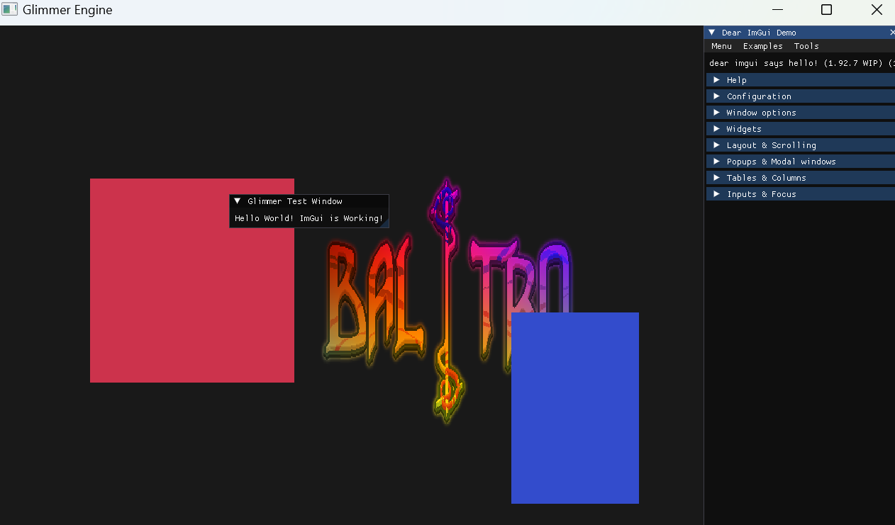

## Uniform解耦/全屏shader接口

> 下面一段话是废话，理论设想，最终还是集成到了Renderer2D保持Sandbox2D的极简调用

由上一部分可知，Renderer2D实际上的作用只是封装一些简单图形API的调用和部分Uniform上传，但部分shader需要另外上传时间、强度等自定义Uniform变量，因此对于这些shader我们需要在Sandbox2D调用DrawQuad()时单独声明。

目前的 Renderer2D 只能画“颜色”和“贴图”。我们需要增加一个重载函数，允许它使用**自定义 Shader** 来画方块。此外，我们需要在底层自动上传 u_Resolution，因为大部分背景特效都需要这个。

Renderer2D.h 增加函数声明：

```
// 在 Renderer2D 类中增加
#include "Glimmer/Renderer/Shader.h"
static void DrawQuad(const glm::vec2& position, const glm::vec2& size, const Ref<Shader>& shader);
static void DrawQuad(const glm::vec3& position, const glm::vec2& size, const Ref<Shader>& shader);
```

```
// 在 Glimmer/src/Glimmer/Renderer/Renderer2D.cpp 中添加：

// 1. vec2 重载版本（调用 vec3 版本）
void Renderer2D::DrawQuad(const glm::vec2& position, const glm::vec2& size, const Ref<Shader>& shader)
{
    DrawQuad({ position.x, position.y, 0.0f }, size, shader);
}

// 2. vec3 核心实现版本
void Renderer2D::DrawQuad(const glm::vec3& position, const glm::vec2& size, const Ref<Shader>& shader)
{
    // 这里的逻辑是：给自定义 Shader 提供引擎管辖的基础数据
    shader->Bind();
    
    // A. 自动上传当前的 View-Projection 矩阵
    // 注意：s_Data 里的 ViewProjectionMatrix 必须在 BeginScene 里存好了
    shader->UploadUniformMat4("u_ViewProjection", s_Data->ViewProjectionMatrix);

    // B. 计算并上传物体的 Transform 矩阵
    glm::mat4 transform = glm::translate(glm::mat4(1.0f), position)
        * glm::scale(glm::mat4(1.0f), { size.x, size.y, 1.0f });
    shader->UploadUniformMat4("u_Transform", transform);

    // C. 绘制
    s_Data->QuadVertexArray->Bind();
    RenderCommand::DrawIndexed(s_Data->QuadVertexArray);
}
```

初步发现分辨率对不上，且改参数无作用

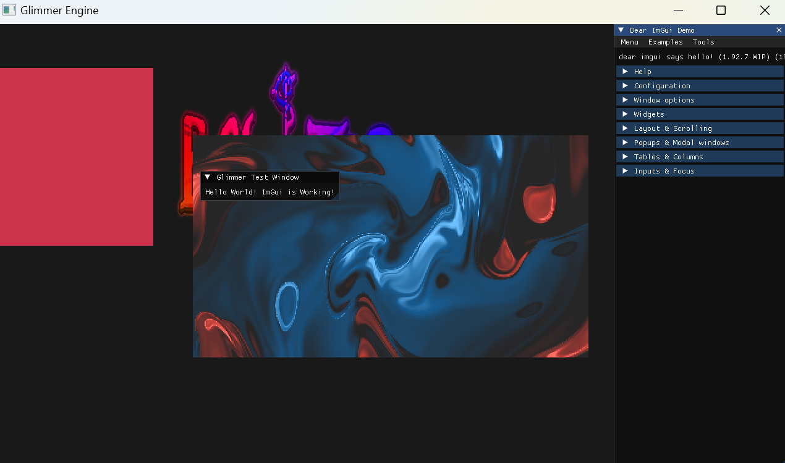

这就遇到了一个问题，因为原本这个全屏背景shader我就没有传变换矩阵，所以原始Draw传入size对其是没有作用的。并且考虑到有挺多这种全屏shader的应用场景的，比如滤镜啥的，于是新定义接口

```
// 增加一个全屏绘制函数，不需要位置和尺寸，只需要 Shader
static void DrawFullscreenQuad(const Ref<Shader>& shader);
```

简单实现后，发现即使先写背景shader，依然覆盖了所有对象，才想起来开启了深度测试，物体层级是由z值决定的，因此改动接口

```
static void DrawFullscreenQuad(const Ref<Shader>& shader, float depth = 0.0f);
```

在计算 u_Transform 矩阵时，我们将 depth 应用到位移向量的 Z 分量上。

```
// Glimmer/src/Glimmer/Renderer/Renderer2D.cpp
void Renderer2D::DrawFullscreenQuad(const Ref<Shader>& shader, float depth)
{
    shader->Bind();
    
    glm::mat4 identity = glm::mat4(1.0f);
    shader->UploadUniformMat4("u_ViewProjection", identity);
    
    // 核心修改：将深度值应用到 translate 中
    // 注意：顺序必须是 先平移(translate) 后缩放(scale)
    glm::mat4 transform = glm::translate(identity, { 0.0f, 0.0f, depth }) 
                        * glm::scale(identity, glm::vec3(2.0f));
    
    shader->UploadUniformMat4("u_Transform", transform);

    // 自动上传时间、分辨率等基础参数 (保持不变)
    shader->UploadUniformFloat("u_Time", s_Data->SceneTime);
    auto& window = gl::Application::Get().GetWindow();
    shader->UploadUniformFloat2("u_Resolution", { (float)window.GetWidth(), (float)window.GetHeight() });

    s_Data->QuadVertexArray->Bind();
    RenderCommand::DrawIndexed(s_Data->QuadVertexArray);
}
```

更改Sandbax2D

```
    auto bgShader = m_ShaderLib.Get("BalatroVortex");
    gl::Renderer2D::DrawFullscreenQuad(bgShader, 0.9f); 
```

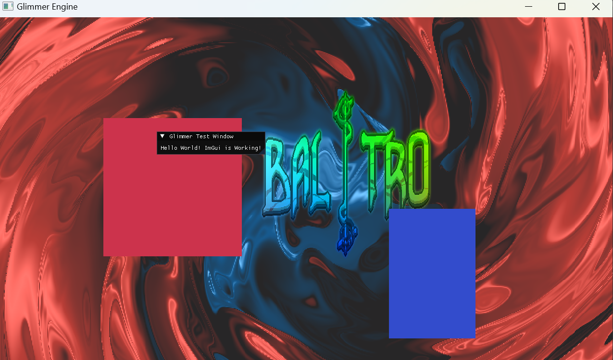

```
	gl::Renderer2D::DrawQuad({ 0.5f, -0.5f, -0.1f }, { 0.5f, 0.75f }, { 0.2f, 0.3f, 0.8f, 1.0f });
	gl::Renderer2D::DrawQuad({ -1.0f, 0.0f, 0.0f }, { 1.0f, 1.0f }, m_Texture);
	gl::Renderer2D::DrawQuad({ 1.0f, 0.0f, 0.0f }, { 1.0f, 1.0f }, m_STSTexture);
```

添加image像呼吸一样简单了

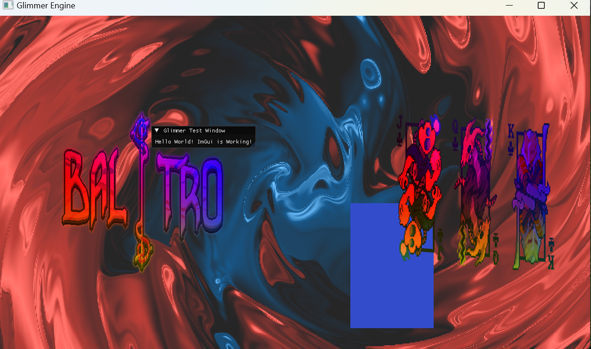

为什么DrawQuad的深度和DrawFullscreenQuad好像基准不一样？

> 是由于 **世界空间（World Space）** 与 **NDC 空间（归一化设备坐标）** 之间的转换逻辑导致的。
>
> **1. 深度基准的本质区别**
>
> - **DrawFullscreenQuad (基准：NDC 空间)**
>   由于你传的是**单位矩阵 (Identity Matrix)**，它的 Z 轴直接就是 OpenGL 的标准数值。范围：**-1.0 (最近/最前) 到 1.0 (最远/最后)**。这是一个绝对值。不管你相机在哪，depth = 0.9 永远代表“贴在屏幕背景墙上”。
> - **DrawQuad (基准：世界空间 + 相机转换)**
>   它经过了 u_ViewProjection 的洗礼。**相机位移的影响**：如果你的相机位置是 (0, 0, 5)，那么在世界坐标里 Z=0 的物体，相对于相机来说深度就是 5。**投影矩阵的映射**：你在创建 OrthographicCamera 时设置过 Near 和 Far（比如 -1.0 到 1.0）。这个矩阵会把这个世界范围内的 Z 轴强行“挤”进 NDC 的 -1 到 1 之间。**计算结果**：如果你的相机在移动，或者 Near/Far 设置不是 -1 到 1，那么 DrawQuad 传进去的 Z 值经过计算后，在显卡看来可能已经变成了 0.2 或 0.8。
>
> **2. 为什么它们会“打架”？**
>
> 想象你在拍戏：
>
> - DrawFullscreenQuad 是在**镜头玻璃**上贴了一层保鲜膜（不管摄像机怎么动，保鲜膜就在那）。
> - DrawQuad 是在**舞台**上放了一个道具。
>
> 当你问“谁在前面”时，GPU 会看最终算出来的 gl_Position.z。
> 如果相机往后退了（Z 增加了），舞台上的道具在 GPU 眼里就会变远（Z 变大）。但镜头玻璃上的保鲜膜 Z 值是写死的，于是原本在道具后面的背景，可能由于道具往后退，突然就跑到了道具前面。
>
> **3. 如何统一标准？（架构建议）**
>
> 要解决这个问题，让背景永远在最底层，建议采用以下 **方案 A**。
>
> 方案 A：关闭深度写入（最推荐的做法）
>
> 既然背景是“全屏特效”，它就不应该参与物体的深度竞争。我们让它在渲染时**不写深度缓冲区**，只管涂颜色。这样，无论后面的方块 Z 是多少，背景都会被视为“最远”。
>
> **修改 Sandbox2D.cpp 渲染顺序：**
>
> ```
> void Sandbox2D::OnUpdate(gl::Timestep ts) {
>     gl::RenderCommand::Clear();
> 
>     // 1. 渲染背景前，暂时禁用深度测试（或仅禁用深度写入）
>     glDisable(GL_DEPTH_TEST); 
>     
>     auto bgShader = m_ShaderLib.Get("BalatroVortex");
>     gl::Renderer2D::DrawFullscreenQuad(bgShader, 0.0f); // 深度填多少都无所谓了
> 
>     // 2. 重新开启深度测试，给游戏世界用
>     glEnable(GL_DEPTH_TEST); 
> 
>     gl::Renderer::BeginScene(m_CameraController.GetCamera());
>     // 这里的物体会根据彼此的 Z 轴正常排序
>     gl::Renderer2D::DrawQuad({0, 0, 0.0f}, {1, 1}, m_Texture); 
>     gl::Renderer::EndScene();
> }
> ```

## 白贴图模式

引入**白贴图（White Texture）模式**是 2D 渲染器的一次重要进化。它的核心逻辑是：**将“纯色”和“贴图”渲染逻辑统一到一个 Shader 中**。

当你画纯色方块时，引擎会自动绑定一张 $1 \times 1$ 的纯白色贴图。因为任何颜色乘以白色（1.0, 1.0, 1.0, 1.0）都等于它本身，所以我们可以只用一套代码管所有 2D 绘图。

---

文件 1：`Glimmer/src/Glimmer/Renderer/Texture.h`

我们需要增加手动设置像素数据的能力，以便创建 1x1 的白色纹理。

```cpp
namespace gl {
    class Texture2D : public Texture {
    public:
        // ✨ 新增：支持指定宽高的工厂方法
        static Ref<Texture2D> Create(uint32_t width, uint32_t height);
        static Ref<Texture2D> Create(const std::string& path);

        // ✨ 新增：手动上传像素数据的方法
        virtual void SetData(void* data, uint32_t size) = 0;
    };
}
```

---

文件 2：`Glimmer/src/Platform/OpenGL/OpenGLTexture2D.h/cpp`

实现上面新增的接口。

**OpenGLTexture2D.h**
```cpp
class OpenGLTexture2D : public Texture2D {
public:
    OpenGLTexture2D(uint32_t width, uint32_t height); // ✨ 新构造函数
    // ...
    virtual void SetData(void* data, uint32_t size) override;
private:
    uint32_t m_Width, m_Height;
    uint32_t m_RendererID;
    GLenum m_InternalFormat, m_DataFormat; // 记录格式信息
};
```

**OpenGLTexture2D.cpp**
```cpp
OpenGLTexture2D::OpenGLTexture2D(uint32_t width, uint32_t height)
    : m_Width(width), m_Height(height)
    {
        m_InternalFormat = GL_RGBA8;
        m_DataFormat = GL_RGBA;

        glCreateTextures(GL_TEXTURE_2D, 1, &m_RendererID);
        glTextureStorage2D(m_RendererID, 1, m_InternalFormat, m_Width, m_Height);

        glTextureParameteri(m_RendererID, GL_TEXTURE_MIN_FILTER, GL_LINEAR);
        glTextureParameteri(m_RendererID, GL_TEXTURE_MAG_FILTER, GL_NEAREST);

        glTextureParameteri(m_RendererID, GL_TEXTURE_WRAP_S, GL_REPEAT);
        glTextureParameteri(m_RendererID, GL_TEXTURE_WRAP_T, GL_REPEAT);
    }

void OpenGLTexture2D::SetData(void* data, uint32_t size)
{
    uint32_t bpp = m_DataFormat == GL_RGBA ? 4 : 3;
    GL_CORE_ASSERT(size == m_Width * m_Height * bpp, "Data must be entire texture!");
    glTexImage2D(GL_TEXTURE_2D, 0, m_InternalFormat, m_Width, m_Height, 0, m_DataFormat, GL_UNSIGNED_BYTE, data);
}
```
*(注意：别忘了在 `Texture.cpp` 里实现 `Texture2D::Create(width, height)` 指向这个类)*。

---

文件 3：`Glimmer/src/Glimmer/Renderer/Renderer2D.cpp`

这是重头戏。我们**删除 `FlatColorShader`**，引入 `WhiteTexture`。

```cpp
namespace gl {

    struct Renderer2DStorage {
        Ref<VertexArray> QuadVertexArray;
        Ref<Shader> TextureShader; // ✨ 只需要这一个 Shader
        Ref<Texture2D> WhiteTexture; // ✨ 引入白贴图

        glm::mat4 ViewProjectionMatrix;
        float SceneTime = 0.0f;
    };

    static Renderer2DStorage* s_Data;

    void Renderer2D::Init() {
        s_Data = new Renderer2DStorage();
        // ... (VAO/VBO/IBO 设置保持不变) ...

        // ✨ 核心逻辑 1：创建 1x1 纯白贴图
        s_Data->WhiteTexture = Texture2D::Create(1, 1);
        uint32_t whiteTextureData = 0xffffffff; // 纯白色
        s_Data->WhiteTexture->SetData(&whiteTextureData, sizeof(uint32_t));

        // ✨ 核心逻辑 2：只加载 TextureShader
        s_Data->TextureShader = Shader::Create("assets/shaders/Texture.glsl");
        s_Data->TextureShader->Bind();
        s_Data->TextureShader->UploadUniformInt("u_Texture", 0);
    }

    void Renderer2D::BeginScene(const OrthographicCamera& camera) {
        s_Data->SceneTime = Application::Get().GetTime();
        s_Data->ViewProjectionMatrix = camera.GetViewProjectionMatrix();

        s_Data->TextureShader->Bind();
        s_Data->TextureShader->UploadUniformMat4("u_ViewProjection", s_Data->ViewProjectionMatrix);
        s_Data->TextureShader->UploadUniformFloat("u_Time", s_Data->SceneTime);
    }

    // --- 修改纯色 DrawQuad ---
    void Renderer2D::DrawQuad(const glm::vec3& position, const glm::vec2& size, const glm::vec4& color) {
        s_Data->TextureShader->Bind();
        s_Data->TextureShader->UploadUniformFloat4("u_Color", color); // 设置目标颜色
        s_Data->WhiteTexture->Bind(); // ✨ 绑定白色贴图，让 Shader 采样出 1.0

        glm::mat4 transform = glm::translate(glm::mat4(1.0f), position) 
                            * glm::scale(glm::mat4(1.0f), { size.x, size.y, 1.0f });
        s_Data->TextureShader->UploadUniformMat4("u_Transform", transform);

        s_Data->QuadVertexArray->Bind();
        RenderCommand::DrawIndexed(s_Data->QuadVertexArray);
    }

    // --- 修改贴图 DrawQuad ---
    void Renderer2D::DrawQuad(const glm::vec3& position, const glm::vec2& size, const Ref<Texture2D>& texture) {
        s_Data->TextureShader->Bind();
        s_Data->TextureShader->UploadUniformFloat4("u_Color", glm::vec4(1.0f)); // ✨ 设为白色，不改变贴图原色
        texture->Bind(); // 绑定真实贴图

        glm::mat4 transform = glm::translate(glm::mat4(1.0f), position) 
                            * glm::scale(glm::mat4(1.0f), { size.x, size.y, 1.0f });
        s_Data->TextureShader->UploadUniformMat4("u_Transform", transform);

        s_Data->QuadVertexArray->Bind();
        RenderCommand::DrawIndexed(s_Data->QuadVertexArray);
    }
}
```

---

文件 4：`assets/shaders/Texture.glsl`

由于现在所有的方块（纯色或贴图）都用这一个 Shader，必须确保它的计算公式包含 `u_Color`。

```glsl
#type fragment
#version 330 core

layout(location = 0) out vec4 color;

in vec2 v_TexCoord;
uniform sampler2D u_Texture;
uniform vec4 u_Color; // 接收 C++ 传来的颜色

void main() {
    // ✨ 核心公式：采样出的贴图颜色 * 外部颜色
    // 对于纯色块：采样出 (1,1,1,1) * u_Color = u_Color
    // 对于贴图：采样出 ImageColor * (1,1,1,1) = ImageColor (如果外部传白)
    color = texture(u_Texture, v_TexCoord) * u_Color;
}
```

---

为什么要这么做？

1.  **性能优化**：通过统一 Shader，我们减少了 GPU 的 **状态切换（State Change）**。在 OpenGL 中，切换 Shader 程序是非常昂贵的。
2.  **灵活性**：现在的贴图方块也支持变色了！你可以给 `m_Texture` 版的 `DrawQuad` 传一个红色，原本的图片就会被染上一层红色的阴影（Tinting），这在实现“受击变红”等特效时极其方便。
3.  **批处理（Batching）的前奏**：这是最重要的原因。批处理要求一组物体共用同一个 Shader 和贴图。有了白贴图，纯色方块现在在显卡眼里也是“带贴图的方块”了，未来它们可以完美地合并成一个 Draw Call 发送出去。

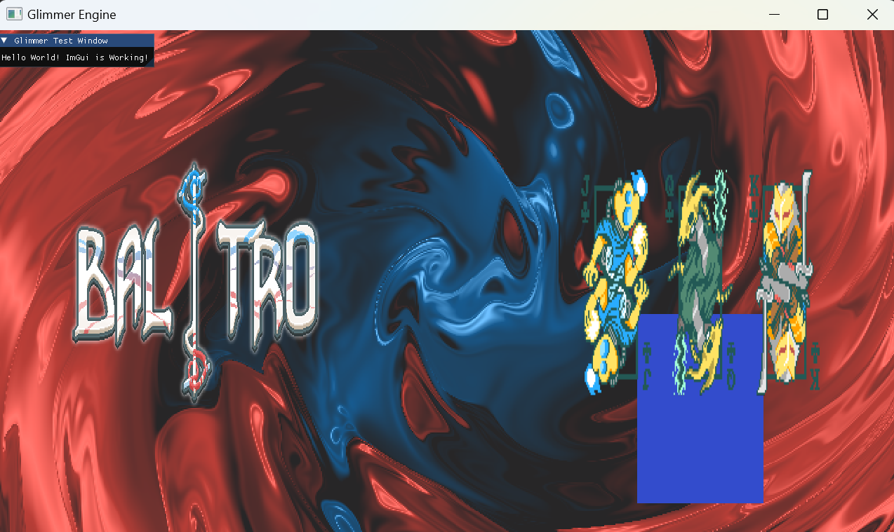

## 仪器测量

为了让你的 **Glimmer Engine** 从“能跑”进化到“高性能工业级”水平，我们必须建立一套科学的性能观测体系。

我将这个过程分为两个大的阶段：
1.  **仪器测量（Instrumentation）**：在 CPU 层面追踪每个函数的耗时，并生成可视化报告。
2.  **渲染器统计与批处理（Renderer2D Evolution）**：实时监测 Draw Call 次数，并进化到批处理模式。

本篇对话我们先攻克 **“第一阶段：全引擎性能剖析器（Profiler）”**。

---

**第一阶段：全引擎仪器测量 (Instrumentation)**

我们要实现一套类似 Chrome 的性能追踪工具。它能生成一个 `.json` 文件，你只需在 Chrome 浏览器打开 `chrome://tracing` 就能看到类似电影剪辑软件那样的全引擎时间轴。

创建性能监测核心类 (`Instrumentor.h`)

在 `Glimmer/src/Glimmer/Debug` 目录下创建。这个类负责将每个函数的开始和结束时间记录到文件中。

**文件：`Glimmer/src/Glimmer/Debug/Instrumentor.h`**

```cpp
#pragma once
#include <string>
#include <chrono>
#include <algorithm>
#include <fstream>
#include <thread>

namespace gl {

	struct ProfileResult {
		std::string Name;
		long long Start, End;
		uint32_t ThreadID;
	};

	struct InstrumentationSession {
		std::string Name;
	};

	class Instrumentor
	{
	private:
		InstrumentationSession* m_CurrentSession;
		std::ofstream m_OutputStream;
		int m_ProfileCount;
	public:
		Instrumentor() : m_CurrentSession(nullptr), m_ProfileCount(0) {}

		void BeginSession(const std::string& name, const std::string& filepath = "results.json")
		{
			m_OutputStream.open(filepath);
			WriteHeader();
			m_CurrentSession = new InstrumentationSession{ name };
		}

		void EndSession()
		{
			WriteFooter();
			m_OutputStream.close();
			delete m_CurrentSession;
			m_CurrentSession = nullptr;
			m_ProfileCount = 0;
		}

		void WriteProfile(const ProfileResult& result)
		{
			if (m_ProfileCount++ > 0) m_OutputStream << ",";

			std::string name = result.Name;
			std::replace(name.begin(), name.end(), '"', '\'');

			m_OutputStream << "{";
			m_OutputStream << "\"cat\":\"function\",";
			m_OutputStream << "\"dur\":" << (result.End - result.Start) << ',';
			m_OutputStream << "\"name\":\"" << name << "\",";
			m_OutputStream << "\"ph\":\"X\",";
			m_OutputStream << "\"pid\":1,";
			m_OutputStream << "\"tid\":" << result.ThreadID << ",";
			m_OutputStream << "\"ts\":" << result.Start;
			m_OutputStream << "}";

			m_OutputStream.flush();
		}

		static Instrumentor& Get() {
			static Instrumentor instance;
			return instance;
		}

	private:
		void WriteHeader() { m_OutputStream << "{\"otherData\": {},\"traceEvents\":["; m_OutputStream.flush(); }
		void WriteFooter() { m_OutputStream << "]}"; m_OutputStream.flush(); }
	};

	// 专门负责自动结束计时的计时器
	class InstrumentationTimer
	{
	public:
		InstrumentationTimer(const char* name)
			: m_Name(name), m_Stopped(false)
		{
			m_StartTimepoint = std::chrono::high_resolution_clock::now();
		}

		~InstrumentationTimer() { if (!m_Stopped) Stop(); }

		void Stop()
		{
			auto endTimepoint = std::chrono::high_resolution_clock::now();

			long long start = std::chrono::time_point_cast<std::chrono::microseconds>(m_StartTimepoint).time_since_epoch().count();
			long long end = std::chrono::time_point_cast<std::chrono::microseconds>(endTimepoint).time_since_epoch().count();

			uint32_t threadID = std::hash<std::thread::id>{}(std::this_thread::get_id());
			Instrumentor::Get().WriteProfile({ m_Name, start, end, threadID });

			m_Stopped = true;
		}
	private:
		const char* m_Name;
		std::chrono::time_point<std::chrono::high_resolution_clock> m_StartTimepoint;
		bool m_Stopped;
	};
}
```

---

在 `Core.h` 中添加便捷宏

为了不破坏代码美感，我们用宏来封装调用。

**文件：`Glimmer/src/Glimmer/Core.h`**
```cpp
// ... 之前的宏 ...

#define GL_PROFILE 1
#if GL_PROFILE
	#define GL_PROFILE_BEGIN_SESSION(name, filepath) ::gl::Instrumentor::Get().BeginSession(name, filepath)
	#define GL_PROFILE_END_SESSION() ::gl::Instrumentor::Get().EndSession()
    // ✨ 核心宏：放在函数第一行即可追踪整个函数
	#define GL_PROFILE_FUNCTION() GL_PROFILE_SCOPE(__FUNCSIG__)
	#define GL_PROFILE_SCOPE(name) ::gl::InstrumentationTimer timer##__LINE__(name)
#else
	#define GL_PROFILE_BEGIN_SESSION(name, filepath)
	#define GL_PROFILE_END_SESSION()
	#define GL_PROFILE_FUNCTION()
	#define GL_PROFILE_SCOPE(name)
#endif
```

---

如何使用？(以 Sandbox2D 为例)

你只需要在想要观察的函数第一行加上 `GL_PROFILE_FUNCTION();`。

**文件：`Sandbox2D.cpp`**
```cpp
void Sandbox2D::OnUpdate(gl::Timestep ts)
{
    GL_PROFILE_FUNCTION(); // ✨ 自动计时

    {
        GL_PROFILE_SCOPE("CameraController::OnUpdate"); // ✨ 追踪特定代码块
        m_CameraController.OnUpdate(ts);
    }

    // ... 渲染代码 ...
}
```

同时，在 `Application.cpp` 的生命周期中开启会话：
```cpp
void Application::Run() {
    GL_PROFILE_BEGIN_SESSION("Runtime", "GlimmerProfile-Runtime.json");
    
    while (m_Running) { ... }
    
    GL_PROFILE_END_SESSION();
}
```

在EntryPoint继承

```
int main(int argc, char** argv)
{
    gl::Log::Init();

    GL_INFO("Ready to build something epic?");

	GL_PROFILE_BEGIN_SESSION("Runtime", "GlimmerProfile-Startup.json");
    auto app = gl::CreateApplication();
	GL_PROFILE_END_SESSION();

	GL_PROFILE_BEGIN_SESSION("Runtime", "GlimmerProfile-Runtime.json");
    app->Run();
	GL_PROFILE_END_SESSION();

	GL_PROFILE_BEGIN_SESSION("Runtime", "GlimmerProfile-Shutdown.json");
    delete app;
	GL_PROFILE_END_SESSION();
}
```

---

为什么用 Chrome Tracing？

**为什么不直接在 ImGui 里画个简单的毫秒数，非要搞这个 JSON 导出报告？**
“ImGui 的实时数值只能看到**‘现状’**，而不能分析**‘因果’**。
通过 `Instrumentor` 生成的 Chrome Tracing 报告，我可以清晰地看到：

1. **函数调用链**：哪个底层 gl 函数被哪个高级渲染指令调用。
2. **多线程瓶颈**：如果未来引入渲染线程，我可以直观地看到 CPU 逻辑线程是在等待 GPU 提交，还是在等待 IO 读取。
3. **微小的抖动（Jitter）**：有些 Bug 是偶发的（比如每 100 帧卡一下），实时数值很难捕捉。通过时间轴回放，我可以精准定位到那一帧里到底是哪个函数突然耗时暴增。
这套体系让性能优化从‘拍脑袋猜’变成了‘数据驱动决策’，是专业引擎开发的基石。”

---

🚀 接下来的操作流程：

1.  **配置 `Instrumentor.h`**。
2.  **修改 `Application.cpp`**：在 `Run` 的开头加 `BEGIN_SESSION`，结尾加 `END_SESSION`。
3.  **大面积撒网**：在你的 `Renderer2D::DrawQuad`、`OpenGLShader::Bind`、`WindowsWindow::OnUpdate` 等函数里全部加上 `GL_PROFILE_FUNCTION()`。
4.  **运行并查看**：运行几秒后关闭。在你的项目根目录找到 `GlimmerProfile-Runtime.json`，打开 Chrome 浏览器，输入 `chrome://tracing`，把文件拖进去。

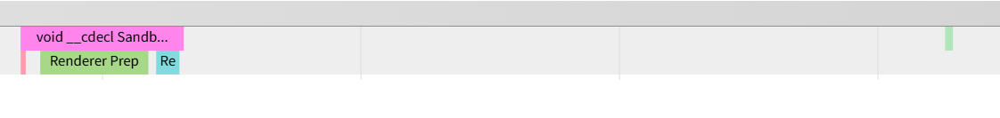

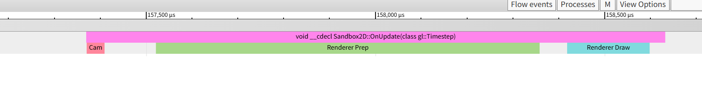

在函数入口加入`GL_PROFILE_FUNCTION()`

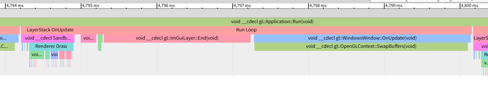

## Renderer2D升级

为 Renderer2D 增加旋转支持、颜色染色（Tinting）以及纹理平铺（Tiling）

需要在 Shader 中增加 u_TilingFactor（平铺系数）的计算。

新增接口

```
// Glimmer/src/Glimmer/Renderer/Renderer2D.h
namespace gl {
    class Renderer2D {
    public:
        // ... Init, BeginScene, EndScene ...

        // 1. 基础 DrawQuad (带平铺和染色)
        static void DrawQuad(const glm::vec2& position, const glm::vec2& size, const Ref<Texture2D>& texture, float tilingFactor = 1.0f, const glm::vec4& tintColor = glm::vec4(1.0f));
        static void DrawQuad(const glm::vec3& position, const glm::vec2& size, const Ref<Texture2D>& texture, float tilingFactor = 1.0f, const glm::vec4& tintColor = glm::vec4(1.0f));

        // 2. 旋转 DrawQuad (纯色)
        static void DrawRotatedQuad(const glm::vec2& position, const glm::vec2& size, float rotation, const glm::vec4& color);
        static void DrawRotatedQuad(const glm::vec3& position, const glm::vec2& size, float rotation, const glm::vec4& color);

        // 3. 旋转 DrawQuad (贴图 + 平铺 + 染色)
        static void DrawRotatedQuad(const glm::vec2& position, const glm::vec2& size, float rotation, const Ref<Texture2D>& texture, float tilingFactor = 1.0f, const glm::vec4& tintColor = glm::vec4(1.0f));
        static void DrawRotatedQuad(const glm::vec3& position, const glm::vec2& size, float rotation, const Ref<Texture2D>& texture, float tilingFactor = 1.0f, const glm::vec4& tintColor = glm::vec4(1.0f));
    };
}
```

实现 Renderer2D.cpp 逻辑

这里最核心的变化是变换矩阵的计算顺序：**平移 -> 旋转 -> 缩放**。

2D/3D 渲染中关于 **“深度缓冲区（Depth Buffer）”与“透明度（Alpha）”** 的核心矛盾。

看到的“透明背景挡住下面物体”，在图形学中被称为 **“深度遮挡（Depth Occlusion）”**。

> 在 OpenGL 中，当你开启了 GL_DEPTH_TEST（深度测试）后，显卡的工作逻辑是这样的：
>
> 1. **计算位置**：显卡画出一个方块（Quad），确定它在屏幕上的位置和深度（Z=0.0）。
> 2. **深度测试**：显卡检查这个位置的“深度记录”。如果现在的 Z 值小于或等于记录值，就允许画。
> 3. **写入深度**：**重点来了！** 只要方块在这个像素点上有任何输出（即使是 100% 透明的像素），它都会把自己的 Z 值（0.0）写进深度缓冲区。
> 4. **后续判定**：当你画第二个方块（RotatedQuad）时，它也在 Z=0.0。由于深度缓冲区里已经有一个 0.0 的记录了，显卡会认为：“这里已经有东西占位了，而且离我一样近（或更近）”，于是**直接丢弃**了后面那个方块的像素。
>
> **结果**：第一个方块的“透明边框”虽然看不见颜色，但它在深度图里占了坑，导致后面重叠的物体被“空气”挡住了。

在 Shader 中开启 discard

这是解决 2D 透明物体遮挡问题的标准做法。我们告诉显卡：如果这个像素的透明度很低，就**彻底丢弃它，不要写深度缓存**。

**修改 assets/shaders/Texture.glsl：**

```
void main() {
    vec4 texColor = texture(u_Texture, v_TexCoord * u_TilingFactor) * u_Color;
    
    // ✨ 核心修复：如果透明度低于一个很小的阈值，直接扔掉这个像素
    // 这样它就不会去更新深度缓冲区了
    if (texColor.a < 0.1)
        discard;

    color = texColor;
}
```

效果如图

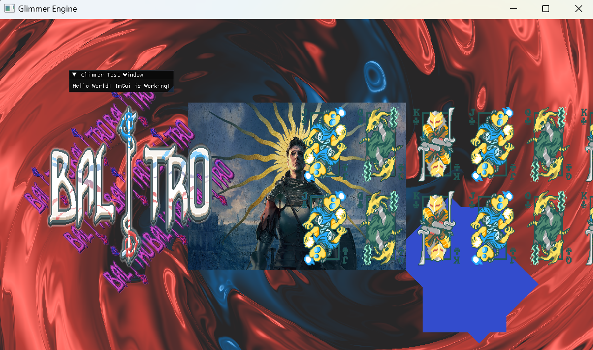

## 2D 批处理渲染

在 Glimmer 引擎的批渲染（Batch Rendering）第一阶段重构中，我们完成了从**“即时模式（一物一画）”**到**“缓冲模式（攒够再画）”**的底层逻辑转型。以下是这一阶段的核心工作梳理与架构思考：

### 纯色方块

**第一步：定义顶点数据契约 (The Data Contract)**

在批处理中，CPU 与 GPU 的沟通不再通过离散的 glUniform，而是通过一块连续的内存。我们定义了 **QuadVertex** 结构体，它将每个顶点的“坐标、颜色、纹理坐标”打包在一起。

```
	struct QuadVertex
	{
		glm::vec3 Position;
		glm::vec4 Color;
		glm::vec2 TexCoord;
	};
```

**第二步：显存空间的预留与索引复用 (Resource Pre-allocation)**

在 Init 函数中，我们不再根据单个物体的顶点来创建缓冲区，而是直接预申请了足以容纳 **10,000 个方块** 的显存额度。同时，由于所有 2D 方块的拓扑结构（即由两个三角形拼成，索引顺序为 0,1,2, 2,3,0）是恒定不变的，我们预先计算并填充了整个 **IndexBuffer**。

```
void Renderer2D::Init()
{
	GL_PROFILE_FUNCTION();

	s_Data.QuadVertexArray = VertexArray::Create();

	s_Data.QuadVertexBuffer = VertexBuffer::Create(s_Data.MaxVertices * sizeof(QuadVertex));
	s_Data.QuadVertexBuffer->SetLayout({
		{ ShaderDataType::Float3, "a_Position" },
		{ ShaderDataType::Float4, "a_Color" },
		{ ShaderDataType::Float2, "a_TexCoord" }
		});
	s_Data.QuadVertexArray->AddVertexBuffer(s_Data.QuadVertexBuffer);

	s_Data.QuadVertexBufferBase = new QuadVertex[s_Data.MaxVertices];

	// 预计算所有索引
	uint32_t* quadIndices = new uint32_t[s_Data.MaxIndices];
	uint32_t offset = 0;
	for (uint32_t i = 0; i < s_Data.MaxIndices; i += 6) {
		quadIndices[i + 0] = offset + 0;
		quadIndices[i + 1] = offset + 1;
		quadIndices[i + 2] = offset + 2;
		quadIndices[i + 3] = offset + 2;
		quadIndices[i + 4] = offset + 3;
		quadIndices[i + 5] = offset + 0;
		offset += 4;
	}

	Ref<IndexBuffer> quadIB = IndexBuffer::Create(quadIndices, s_Data.MaxIndices);
	s_Data.QuadVertexArray->SetIndexBuffer(quadIB);
	delete[] quadIndices;

	s_Data.WhiteTexture = Texture2D::Create(1, 1);
	uint32_t whiteTextureData = 0xffffffff;
	s_Data.WhiteTexture->SetData(&whiteTextureData, sizeof(uint32_t));

	s_Data.TextureShader = Shader::Create("assets/shaders/Texture.glsl");
	s_Data.TextureShader->Bind();
	s_Data.TextureShader->UploadUniformInt("u_Texture", 0);

}
```

索引缓冲区的复用是性能优化的关键。无论我们画多少个方块，索引的逻辑排列是重复的，这种“一次计算，终身使用”的方法极大地节省了运行时的 CPU 开销。

**第三步：建立 CPU 端的“内存草稿本” (Memory Scratchpad)**

我们在 Renderer2DData 中分配了一块和显存等大的 CPU 内存（QuadVertexBase）。

```
	struct Renderer2DData
	{
		const uint32_t MaxQuads = 10000;
		const uint32_t MaxVertices = MaxQuads * 4;
		const uint32_t MaxIndices = MaxQuads * 6;

		Ref<VertexArray> QuadVertexArray;
		Ref<VertexBuffer> QuadVertexBuffer;
		Ref<Shader> TextureShader;
		Ref<Texture2D> WhiteTexture;

		uint32_t QuadIndexCount = 0;
		QuadVertex* QuadVertexBufferBase = nullptr;
		QuadVertex* QuadVertexBufferPtr = nullptr;
		float SceneTime = 0.0f;
	};
```

之所以不直接往 GPU 写数据，是因为 CPU 内存的随机读写速度远快于跨总线操作 GPU 显存。我们引入了 QuadVertexBufferPtr 指针，它像一个画笔的笔尖，随着 DrawQuad 的调用在草稿本上不断向后移动，记录数据。

**第四步：重构渲染生命周期 (The Lifecycle Transformation)**

我们重写了 BeginScene 和 EndScene。

1. **BeginScene**：将指针重置到草稿本的起始位置，宣告新一轮“数据采集”开始。
2. **EndScene**：计算这一帧指针移动的总距离，通过 SetData（底层为 glBufferSubData）将整个草稿本一次性“拍”给 GPU。
3. **Flush**：执行最终的 DrawCall。

- 这种模式将原本分散在 10,000 次绘图中的 CPU-GPU 通讯压力，压缩到了 EndScene 中的那一次提交。这便是批处理性能飞跃的根本原因。

**第五步：将几何变换从 GPU 回收至 CPU (Coordinate Transformation)**

这是最显着的改变。在旧代码中，我们把 Model Matrix 传给 Shader 算位置。而在第一阶段批处理中，我们在 DrawQuad 里手动计算了四个顶点的世界坐标（例如 position.x + size.x）。

由于 GPU 在一个 Draw Call 中只能接收一组 Uniform 矩阵，我们无法为 10,000 个物体传 10,000 个矩阵。因此，我们将“矩阵乘法”的工作收回到 CPU 完成。虽然这增加了 CPU 的浮点运算量，但相比于频繁切换渲染状态带来的指令开销，这是极度划算的交换。

**第六步：Shader 的解耦与简化 (Shader Simplification)**

为了配合批处理，我们的 **Texture.glsl** 发生了质变。顶点着色器现在直接接收处理好的 a_Position（世界坐标）和 a_Color，而不再依赖 u_Transform。

Shader 变得更加“通用化”。它不再关心物体是怎么移动的，它只负责把传进来的颜色和坐标正确地投射到屏幕上。

**阶段总结**：
第一阶段完成后，你的引擎已经实现了**“纯色方块”的批处理**。目前即使在屏幕上画 10,000 个变色方块，也只会产生 **1 个 Draw Call**。这是你的 Glimmer 引擎从“业余框架”迈向“专业渲染器”的里程碑。

**下一步挑战**：目前的批处理还不能处理不同的纹理（一旦切换纹理，批处理就会中断）。我们需要在下一阶段引入 **纹理插槽（Texture Slots）** 数组，让显卡能在一通指令里识别出不同的图片。

### 纹理绑定

**第一步：扩展顶点数据结构以承载纹理元数据**

为了让 GPU 知道每个方块该贴哪张图，我们必须在顶点结构 QuadVertex 中新增两个属性。

- **TexIndex (纹理索引)**：这是一个浮点数，代表该顶点指向纹理数组中的哪一个位置。
- **TilingFactor (平铺系数)**：控制纹理的重复频率。
- 在 BufferLayout 中，这两个属性被定义为 Float。虽然索引本质上是整数，但在顶点属性传输中统一使用浮点数能简化数据对齐，并允许 Shader 在插值后通过 int() 强制转换回索引，这是批处理的通用做法。

**第二步：构建纹理插槽状态池**

由于显卡单次绘制支持的纹理绑定数量有限（通常为 32 个），我们在 Renderer2DData 中建立了一个**纹理插槽数组** TextureSlots。

- **白贴图占位**：在 Init 中将 TextureSlots[0] 固定为 WhiteTexture。
- **动态计数器**：引入 TextureSlotIndex。在每一帧 BeginScene 时，除了重置顶点指针，还需要将该索引重置为 1。
- **思考**：这相当于在 CPU 端维护了一个“显存插槽预览图”。我们不再即时绑定纹理，而是记录下“谁将要在哪个位置被绑定”。

**第三步：建立 GPU 采样器阵列映射**

在 Init 函数中，我们不再是简单的 UploadUniformInt("u_Texture", 0)，而是创建了一个包含 0 到 31 的整数数组。

- **一次性注入**：通过 UploadUniformIntArray("u_Textures", samplers, 32)，一次性告知 Shader：数组中的 0 号元素对应 0 号槽位，1 号对应 1 号，依此类推。
- **思考**：这一步打通了 Shader 内部 uniform sampler2D u_Textures[32] 的寻址链路。自此，Shader 具备了在一次绘制中“挑选”图片的能力。

**第四步：实现纹理重用与动态分配算法**

这是 DrawQuad 实现中最核心的逻辑改进。当 Sandbox 传入一张贴图时，引擎不再盲目绑定，而是执行以下操作：

1. **线性搜索**：遍历当前已登记的 TextureSlots，检查这张贴图是否已经“排队”了。
2. **命中重用**：如果找到了，直接复用其索引（textureIndex）。
3. **新增分配**：如果没有找到，则将其放入下一个可用的插槽，并递增 TextureSlotIndex。
4. **思考**：这套逻辑极大地优化了渲染开销。如果你的场景里有 1000 个方块共用 1 张背景图，引擎只会占用 1 个插槽，并且在数据填充阶段赋予它们完全相同的 textureIndex，完美符合批处理的特征。

**第五步：实现延迟绑定与最终 Flush**

这是纹理出现在屏幕上的最后一公里。在旧的渲染模式下，Bind() 是在 DrawQuad 里立即发生的；而在批处理模式下，绑定动作被推迟到了 Flush。

- **集中绑定**：在 Flush 内部，通过一个循环 TextureSlots[i]->Bind(i)，将这一批次积累的所有贴图依次插入显卡的物理插槽。
- **思考**：这种“延迟绑定”策略确保了所有贴图在 GPU 执行 glDrawElements 的那一刻都在其位，解决了“一物一绑”带来的管线停顿问题。

**第六步：Shader 端的采样逻辑适配**

配合 C++ 端的改动，GLSL 里的 main 函数不再采样单一对象，而是根据 v_TexIndex 进行索引。

- **动态索引采样**：texture(u_Textures[int(v_TexIndex)], v_TexCoord * v_TilingFactor)。
- **思考**：通过将顶点属性传入的 float 转回 int 作为数组下标，我们实现了在 GPU 端的动态分发。至此，即使是不同图片的方块，也能在同一个批次内被正确涂色。

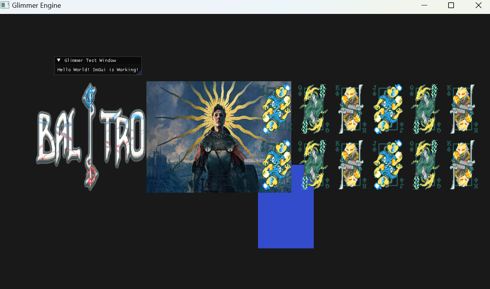

### 融入全屏shader

现在的DrawFullScreenQuad接口是实现批处理渲染之前的版本，无法起效。这是因为原版绑定了 s_Data.QuadVertexArray。但是，这个 VAO 对应的是那个巨大的、空的动态缓冲区。现在没有向这个缓冲区里填入全屏的 4 个顶点，也没有调用 SetData 把数据发给显卡。且批处理通过 s_Data.QuadIndexCount 来记录画了多少个索引。但在 DrawFullscreenQuad 中，直接调用了底层的 DrawIndexed。如果此时还没画任何批处理方块，索引数可能是 0，显卡就什么都不画。

在引擎开发中，全屏 Pass 通常不和普通的批处理混在一起。最好的做法是在 Init 时准备一个专门的、**静态的**单位矩形（Unit Quad），专门给全屏 Shader 使用。

**修改 Renderer2DData 结构**

增加一个专门存放全屏矩形（-1 到 1）的 VAO。

```
struct Renderer2DData {
    // ... 原有成员 ...
    Ref<VertexArray> FullscreenVertexArray; // ✨ 新增：专门给全屏/后处理用的静态VAO
};
```

**在 Init() 中初始化静态全屏矩形**

这个矩形永远不变，所以我们不需要每帧更新它

```
void Renderer2D::Init() {
    // ... 原有批处理初始化代码 ...

    // ✨ 初始化全屏专用资源
    s_Data.FullscreenVertexArray = VertexArray::Create();

    // 定义覆盖全屏（NDC空间 -1 到 1）的顶点
    float fullscreenVertices[5 * 4] = {
        -1.0f, -1.0f, 0.0f, 0.0f, 0.0f,
         1.0f, -1.0f, 0.0f, 1.0f, 0.0f,
         1.0f,  1.0f, 0.0f, 1.0f, 1.0f,
        -1.0f,  1.0f, 0.0f, 0.0f, 1.0f
    };

    auto fVBO = VertexBuffer::Create(fullscreenVertices, sizeof(fullscreenVertices));
    fVBO->SetLayout({
        { ShaderDataType::Float3, "a_Position" },
        { ShaderDataType::Float2, "a_TexCoord" }
    });
    s_Data.FullscreenVertexArray->AddVertexBuffer(fVBO);

    uint32_t fIndices[6] = { 0, 1, 2, 2, 3, 0 };
    auto fIBO = IndexBuffer::Create(fIndices, 6);
    s_Data.FullscreenVertexArray->SetIndexBuffer(fIBO);
}
```

**修改 DrawFullscreenQuad 函数**

逻辑调整：**在画全屏之前，先清空当前的批处理队列（Flush），然后切换到静态 VAO 进行绘制。**

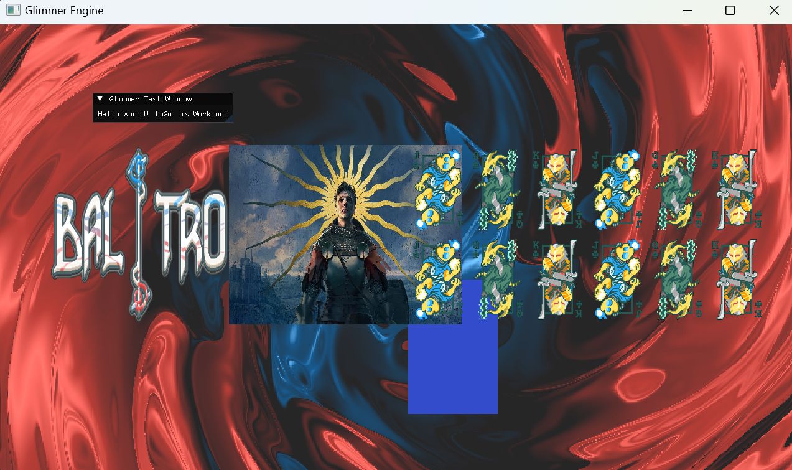

### 更新旋转绘图接口

将旧版本的DrawRotateQuad()绘图接口更新至批处理渲染版本

**第一步：建立局部空间“顶点模板” (The Vertex Template)**

在 `Renderer2DData` 结构体中，新增了 `glm::vec4 QuadVertexPositions[4]`。
*   **做法**：在 `Init()` 函数里，预先定义了一个中心在原点、边长为 1.0 的标准正方形四个角的坐标。
*   **思考**：这是实现旋转的基石。在之前的非批处理版本中，这些坐标是写死在 VBO 里的。现在我们将它们存为 CPU 内存中的常量，作为所有方块的“原始形状”。使用 `vec4` 而不是 `vec3` 是为了方便后续直接与 4x4 变换矩阵进行数学运算。

**第二步：计算完整的变换矩阵 (Matrix Composition)**

在 `DrawRotatedQuad` 内部，不再依赖 Shader 里的 `u_Transform`。
*   **做法**：利用 GLM 构造一个复合矩阵：`Translate * Rotate * Scale`。
*   **思考**：注意矩阵乘法的顺序。在 GLM 中，变换是从右向左应用的。这个顺序（平移 * 旋转 * 缩放）确保了物体首先在局部空间缩放，然后在原点自转，最后被平移到世界空间的指定位置。如果顺序反了，方块会绕着世界中心旋转。

**第三步：坐标空间的物理迁移 (CPU-Side Transformation)**

这是批渲染中最核心的代码改动。
*   **做法**：在填充缓冲区前，执行 `transform * s_Data.QuadVertexPositions[i]`。
*   **思考**：我们将原本属于显卡的“几何变换”工作收回到了 CPU 端的 `DrawRotatedQuad` 函数中。
    *   **原因**：批处理的一个 Draw Call 只能对应一个 Uniform。如果有 100 个方块旋转角度各不相同，我们无法传 100 个不同的 `u_Transform` 给 Shader。
    *   **结果**：通过 CPU 预计算，我们直接把计算好的、处于**世界空间**的最终坐标存入 `QuadVertex` 结构体。对于 GPU 来说，它只需要机械地画出你给它的坐标，而不需要关心这些点是否经过了旋转。

**第四步：顶点属性的线性填充 (Sequential Buffer Filling)**

改动了数据存入方式，不再调用任何 OpenGL 绑定指令。
*   **做法**：通过 `s_Data.QuadVertexBufferPtr` 指针，将计算好的 `Position`、`Color`、`TexCoord` 以及新增的 `TexIndex` 等连贯地写入内存。
*   **思考**：每调用一次 `DrawRotatedQuad`，指针就向后移动 4 个 `QuadVertex` 的跨度。这种内存操作极快，远胜于频繁的 `glUniform` 调用。

**第五步：纹理插槽的动态匹配 (Texture Slot Mapping)**

为了让旋转的带贴图方块也能批处理，代码引入了纹理搜索逻辑。
*   **做法**：遍历 `TextureSlots` 数组，查找当前传入的纹理是否已在槽位中。若不在，则占用一个新的槽位。
*   **思考**：这一步保证了即使旋转方块和普通方块交替绘制，只要它们共用贴图，就能保持在同一个批次内，不会触发 `Flush`。

**第六步：Shader 的极简适配 (Shader Stripping)**

由于位置已经在 CPU 算好了，`Texture.glsl` 发生了对应的“瘦身”。
*   **做法**：顶点着色器（Vertex Shader）中删除了 `u_Transform` 矩阵，直接使用 `u_ViewProjection * vec4(a_Position, 1.0)`。
*   **思考**：Shader 变得极其纯粹，它只负责摄像机视角的转换。这让渲染管线变得异常稳健。

**总结与思考**

实现 `DrawRotatedQuad` 的过程，本质上是**将 GPU 的计算压力部分转移给 CPU，以换取 CPU 与 GPU 通讯频率的大幅降低**。

阴间bug：实现具体DrawRotatedQuad时，屏幕会出现一个彩色正方形，且即便不调用 DrawRotatedQuad，屏幕上也会出现一个正方形，这说明**批处理缓冲区（Buffer）里有脏数据**。

这样，我新建一个ExampleLayer，逐行测试我的接口问题

测试结果：

只启用DrawFullscreenQuad，结果正常；

只启用DrawRotatedQuad纯色，出现彩色正方形(bug)；

只启用DrawQuad纯色，出现彩色正方形(bug)；

其余接口全部bug，但修改DrawRotatedQuad前正常，推测1.BeginScene问题；2.DrawRotatedQuad问题

尝试回调DrawRotatedQuad纯色

回调为原版之后，全部正常加载，无彩色正方形

```
		s_Data.TextureShader->Bind();
		s_Data.TextureShader->UploadUniformFloat4("u_Color", color);
		s_Data.TextureShader->UploadUniformFloat("u_TilingFactor", 1.0f);
		s_Data.WhiteTexture->Bind();

		glm::mat4 transform = glm::translate(glm::mat4(1.0f), position)
			* glm::rotate(glm::mat4(1.0f), glm::radians(rotation), { 0.0f, 0.0f, 1.0f })
			* glm::scale(glm::mat4(1.0f), { size.x, size.y, 1.0f });

		s_Data.TextureShader->UploadUniformMat4("u_Transform", transform);

		s_Data.QuadVertexArray->Bind();
		RenderCommand::DrawIndexed(s_Data.QuadVertexArray);
```

为何新版会导致接口全部bug？

```
		//const float textureIndex = 0.0f; // White Texture
		//const float tilingFactor = 1.0f;

		//glm::mat4 transform = glm::translate(glm::mat4(1.0f), position)
		//	* glm::rotate(glm::mat4(1.0f), glm::radians(rotation), { 0.0f, 0.0f, 1.0f })
		//	* glm::scale(glm::mat4(1.0f), { size.x, size.y, 1.0f });

		//for (int i = 0; i < 4; i++)
		//{
		//	// 关键点：矩阵 * 局部坐标 = 旋转后的世界坐标
		//	s_Data.QuadVertexBufferPtr->Position = transform * s_Data.QuadVertexPositions[i];
		//	s_Data.QuadVertexBufferPtr->Color = color;
		//	s_Data.QuadVertexBufferPtr->TexCoord = { (i == 1 || i == 2) ? 1.0f : 0.0f, (i >= 2) ? 1.0f : 0.0f };
		//	s_Data.QuadVertexBufferPtr->TexIndex = textureIndex;
		//	s_Data.QuadVertexBufferPtr->TilingFactor = tilingFactor;
		//	s_Data.QuadVertexBufferPtr++;
		//}

		//s_Data.QuadIndexCount += 6;
```

依旧未解决，择日再战

终于发现了，原因在于Flush中为了防止其他 Shader 的干扰，一定要重新 Bind 自己的 VAO

```
	void Renderer2D::Flush()
	{
		// Bind textures
		for (uint32_t i = 0; i < s_Data.TextureSlotIndex; i++)
			s_Data.TextureSlots[i]->Bind(i);

		s_Data.QuadVertexArray->Bind();
		RenderCommand::DrawIndexed(s_Data.QuadVertexArray, s_Data.QuadIndexCount);
	}
```

```
s_Data.QuadVertexArray->Bind();
```

DrawIndexed接口内

```
	void OpenGLRendererAPI::DrawIndexed(const Ref<VertexArray>& vertexArray, uint32_t indexCount)
	{
		uint32_t count = indexCount ? vertexArray->GetIndexBuffer()->GetCount() : indexCount;
		glDrawElements(GL_TRIANGLES, count, GL_UNSIGNED_INT, nullptr);
		glBindTexture(GL_TEXTURE_2D, 0);
	}
```

glBindTexture(GL_TEXTURE_2D, 0);解绑当前绑定到 `GL_TEXTURE_2D` 目标的纹理

`glBindTexture(GL_TEXTURE_2D, 0)` 的作用是：**解绑当前 2D 纹理，防止后续操作误作用到之前的纹理对象。**

有一个原因说法：我的全屏shader：s_Data.FullscreenVertexArray->Bind(); // 这里把状态改了！！同时又因为我的旋转接口是最后一个修改批处理的对象，所以导致整个流程只有全屏shader进行过bind

所以也可以在Draw里进行bind，经检验效果一样

```
	void OpenGLRendererAPI::DrawIndexed(const Ref<VertexArray>& vertexArray, uint32_t indexCount)
	{
		vertexArray->Bind();
		uint32_t count = indexCount ? vertexArray->GetIndexBuffer()->GetCount() : indexCount;
		glDrawElements(GL_TRIANGLES, count, GL_UNSIGNED_INT, nullptr);
		glBindTexture(GL_TEXTURE_2D, 0);
	}
```

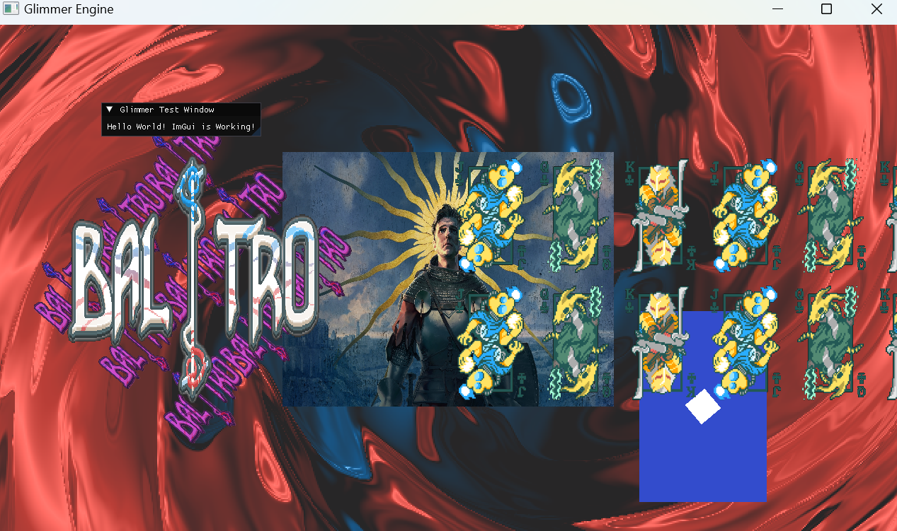

## 加载obj文件

在我的CG课程中呢，已经学习了如何使用OpenGL渲染obj文件，当时是采用手写解析函数进行加载的，但实际引擎其实需要满足更多要求，比如：如果用这个函数去加载从 Blender、Maya 或网上下载的专业模型，会有大概率报错或显示乱码。原因如下：

- **多边形限制**：很多 .obj 文件包含**四边形面（Quads）**。你的代码遇到四边形会直接报错退出（redundency.length() >= 5 那段逻辑）。
- **缺失材质支持**：.obj 文件通常配有一个 .mtl 文件来描述颜色、反光等。你的代码完全忽略了材质系统。
- **格式容错率低**：如果文件里有注释（#）、空格不规范、或者使用了组（g）、平滑组（s）等高级指令，你的 file >> lineHeader 逻辑就会错位。
- **只有 OBJ**：现实中的模型更多是 .fbx（带骨骼动画）、.gltf（现代网页标准）、.stl（工业模具）。手写这些二进制格式的解析器需要消耗数月时间。

因此，我决定集成第三方库 **Assimp (Open Asset Import Library)**。它可以处理 .obj, .fbx, .gltf 等几十种格式，并将其统一转换为引擎易于读取的数据结构。

```
git submodule add https://github.com/assimp/assimp.git Glimmer/vendor/assimp
```

**修改 Premake 配置**

Assimp 源代码非常多，为了缩短编译时间，我们通常只开启必要的格式（如 OBJ, FBX, GLTF）。

在 Glimmer/vendor/assimp/ 下创建 **premake5.lua**：
*(这是一个精简版配置，只保留常用功能，避免编译几千个文件)*

```
project "Assimp"
    kind "StaticLib"
    language "C++"
    cppdialect "C++17"
    staticruntime "on"

    targetdir ("bin/" .. outputdir .. "/%{prj.name}")
    objdir ("bin-int/" .. outputdir .. "/%{prj.name}")

    files {
        "include/**.h",
        "include/**.hpp",
        "code/**.cpp",
        "code/**.h",
        -- 包含内置依赖 zlib
        "contrib/zlib/**.c",
        "contrib/zlib/**.h"
    }

    includedirs {
        "include",
        "code",
        "contrib/zlib"
    }

    defines {
        "ASSIMP_BUILD_NO_OWN_ZLIB",
        "ASSIMP_BUILD_NO_EXPORT",
        -- 禁用不需要的格式以提速 (可选)
        "ASSIMP_BUILD_NO_X_IMPORTER",
        "ASSIMP_BUILD_NO_3DS_IMPORTER",
        "ASSIMP_BUILD_NO_MD3_IMPORTER",
        "ASSIMP_BUILD_NO_PLY_IMPORTER"
    }

    filter "system:windows"
        systemversion "latest"
        defines { "WIN32_LEAN_AND_MEAN" }
```

修改根目录的 premake5.lua

```
include "Glimmer/vendor/assimp" -- 1. 包含项目

project "Glimmer"
    -- ...
    includedirs {
        -- ...
        "%{prj.name}/vendor/assimp/include" -- 2. 包含头文件
    }
    links { "Assimp" } -- 3. 链接静态库
```

运行 GenerateProject.bat

**建立 3D 渲染数据结构**

3D 模型由多个 **Mesh（网格）** 组成，每个 Mesh 拥有自己的材质和顶点数据。

**定义顶点结构 (Mesh.h)**

在 Glimmer/src/Glimmer/Renderer/Mesh.h 中：

```
#pragma once
#include <glm/glm.hpp>
#include "Glimmer/Renderer/VertexArray.h"
#include "Glimmer/Renderer/Shader.h"

namespace gl {
    struct Vertex {
        glm::vec3 Position;
        glm::vec3 Normal;   // 法线
        glm::vec2 TexCoord; // UV
    };

    class Mesh {
    public:
        Mesh(std::vector<Vertex> vertices, std::vector<uint32_t> indices)
        {
            m_VAO.reset(VertexArray::Create());
            auto vbo = VertexBuffer::Create((float*)vertices.data(), vertices.size() * sizeof(Vertex));
            vbo->SetLayout({
                { ShaderDataType::Float3, "a_Position" },
                { ShaderDataType::Float3, "a_Normal" },
                { ShaderDataType::Float2, "a_TexCoord" }
            });
            m_VAO->AddVertexBuffer(vbo);
            m_VAO->SetIndexBuffer(IndexBuffer::Create(indices.data(), indices.size()));
            m_IndexCount = indices.size();
        }

        void Draw() { m_VAO->Bind(); /* 调用底层 DrawCall */ }
    private:
        Ref<VertexArray> m_VAO;
        uint32_t m_IndexCount;
    };
}
```

**实现模型加载类 (Model.h/cpp)**

这是 Assimp 发挥作用的地方。

**Glimmer/src/Glimmer/Renderer/Model.h**:

```
#pragma once
#include <assimp/Importer.hpp>
#include <assimp/scene.h>
#include <assimp/postprocess.h>
#include "Mesh.h"

namespace gl {
    class Model {
    public:
        Model(const std::string& path);
        void Draw(const Ref<Shader>& shader, const glm::mat4& transform);
    private:
        void LoadModel(const std::string& path);
        void ProcessNode(aiNode* node, const aiScene* scene);
        Mesh ProcessMesh(aiMesh* mesh, const aiScene* scene);
    private:
        std::vector<Mesh> m_Meshes;
        std::string m_Directory;
    };
}
```

**Glimmer/src/Glimmer/Renderer/Model.cpp**: (核心逻辑)

```
#include "glpch.h"
#include "Model.h"
#include "Renderer.h"

namespace gl {
    Model::Model(const std::string& path) { LoadModel(path); }

    void Model::LoadModel(const std::string& path) {
        Assimp::Importer importer;
        const aiScene* scene = importer.ReadFile(path, aiProcess_Triangulate | aiProcess_FlipUVs | aiProcess_GenNormals);

        if(!scene || scene->mFlags & AI_SCENE_FLAGS_INCOMPLETE || !scene->mRootNode) {
            GL_CORE_ERROR("Assimp Error: {0}", importer.GetErrorString());
            return;
        }
        ProcessNode(scene->mRootNode, scene);
    }

    void Model::ProcessNode(aiNode* node, const aiScene* scene) {
        for(unsigned int i = 0; i < node->mNumMeshes; i++) {
            aiMesh* mesh = scene->mMeshes[node->mMeshes[i]];
            m_Meshes.push_back(ProcessMesh(mesh, scene));
        }
        for(unsigned int i = 0; i < node->mNumChildren; i++) {
            ProcessNode(node->mChildren[i], scene);
        }
    }

    Mesh Model::ProcessMesh(aiMesh* mesh, const aiScene* scene) {
        std::vector<Vertex> vertices;
        std::vector<uint32_t> indices;

        for(unsigned int i = 0; i < mesh->mNumVertices; i++) {
            Vertex vertex;
            vertex.Position = { mesh->mVertices[i].x, mesh->mVertices[i].y, mesh->mVertices[i].z };
            vertex.Normal = { mesh->mNormals[i].x, mesh->mNormals[i].y, mesh->mNormals[i].z };
            if(mesh->mTextureCoords[0])
                vertex.TexCoord = { mesh->mTextureCoords[0][i].x, mesh->mTextureCoords[0][i].y };
            else
                vertex.TexCoord = { 0.0f, 0.0f };
            vertices.push_back(vertex);
        }

        for(unsigned int i = 0; i < mesh->mNumFaces; i++) {
            aiFace face = mesh->mFaces[i];
            for(unsigned int j = 0; j < face.mNumIndices; j++)
                indices.push_back(face.mIndices[j]);
        }
        return Mesh(vertices, indices);
    }
}
```

此时编译验证发现

```
E:\Zaproject\Engine\Glimmer\Glimmer\vendor\assimp\include\assimp\defs.h(55,10): fatal  error C1083: 无法打开包括文件: “assimp/config.h”: No such file or directory
```

这是因为在 Assimp 的源码中，config.h 是一个**动态生成文件**。当你使用 CMake 配置项目时，它会根据你的系统环境自动生成这个文件。因为你现在使用的是 **Premake** 跳过了 CMake 的配置步骤，所以你的硬盘里根本不存在这个 config.h。

所以现在需要**手动提供一个静态的 config.h**。

Glimmer/vendor/assimp/include/assimp/ 下，手动新建一个文本文件，命名为 **config.h**。

```
#ifndef ASSIMP_CONFIG_H_INC
#define ASSIMP_CONFIG_H_INC

#define ASSIMP_DOUBLE_PRECISION 0
/* #undef ASSIMP_OPT_BUILD_PACKED */

#define ASSIMP_BUILD_NO_OWN_ZLIB 1

/* #undef ASSIMP_BUILD_X_IMPORTER */
/* #undef ASSIMP_BUILD_OBJ_IMPORTER */
// ... 这里可以根据需要开启或关闭特定的 Importer

#endif // !! ASSIMP_CONFIG_H_INC
```

ok啊又是一堆报错，打算先不管了，用tinyobjloader

去git库下载头文件，存放在Glimmer/vendor/tinyobjloader/tiny_obj_loader.h

由于它是一个 Header-only 库，需要在该目录下建一个 .cpp 文件来生成实现。

**文件：Glimmer/vendor/tinyobjloader/tiny_obj_loader.cpp**

```
#include "glpch.h"
#define TINYOBJLOADER_IMPLEMENTATION // 必须定义这个宏
#include "tiny_obj_loader.h"
```

**修改 Premake**：
在 project "Glimmer" 的 includedirs 中加入：
"%{prj.name}/vendor/tinyobjloader"。

**重写加载逻辑**

**Mesh.h —— 网格数据容器**

**作用**：存储单个几何体的 GPU 资源（VAO/VBO/IBO）。

```
#pragma once
#include <glm/glm.hpp>
#include "Glimmer/Renderer/VertexArray.h"
#include "Glimmer/Renderer/Buffer.h"

namespace gl {

	struct Vertex {
		glm::vec3 Position;
		glm::vec3 Normal;
		glm::vec2 TexCoord;
	};

	class Mesh {
	public:
		Mesh(const std::vector<Vertex>& vertices, const std::vector<uint32_t>& indices);
		
		void Bind() const;
		uint32_t GetIndexCount() const { return m_IndexCount; }

	private:
		Ref<VertexArray> m_VertexArray;
		uint32_t m_IndexCount;
	};

}
```

**Mesh.cpp —— 实现缓冲区绑定**

**作用**：将内存中的顶点向量上传至显存。

```
#include "glpch.h"
#include "Mesh.h"
#include "Glimmer/Renderer/RenderCommand.h"

namespace gl {

	Mesh::Mesh(const std::vector<Vertex>& vertices, const std::vector<uint32_t>& indices)
		: m_IndexCount((uint32_t)indices.size())
	{
		m_VertexArray = VertexArray::Create();

		// 创建顶点缓冲区 (VBO)
		auto vbo = VertexBuffer::Create((float*)vertices.data(), (uint32_t)(vertices.size() * sizeof(Vertex)));
		
		// 定义符合 Vertex 结构体的布局
		vbo->SetLayout({
			{ ShaderDataType::Float3, "a_Position" },
			{ ShaderDataType::Float3, "a_Normal" },
			{ ShaderDataType::Float2, "a_TexCoord" }
		});
		m_VertexArray->AddVertexBuffer(vbo);

		// 创建索引缓冲区 (IBO)
		auto ibo = IndexBuffer::Create((uint32_t*)indices.data(), (uint32_t)indices.size());
		m_VertexArray->SetIndexBuffer(ibo);
	}

	void Mesh::Bind() const
	{
		m_VertexArray->Bind();
	}

}
```

**Model.h —— 模型加载器**

**作用**：管理一个 .obj 文件中包含的所有网格。

```
#pragma once
#include "Mesh.h"
#include "Glimmer/Renderer/Shader.h"
#include <vector>
#include <string>

namespace gl {

	class Model {
	public:
		Model(const std::string& path);
		
		// 渲染模型的所有子网格
		void Draw(const Ref<Shader>& shader, const glm::mat4& transform);

	private:
		std::vector<Ref<Mesh>> m_Meshes;
	};

}
```

**Model.cpp —— TinyObjLoader 核心解析逻辑**

**作用**：读取 OBJ 文件，处理顶点去重，并生成 Mesh 对象。

```
#include "glpch.h"
#include "Model.h"
#include "Glimmer/Renderer/Renderer.h"
#include "tiny_obj_loader.h"
#include <unordered_map>

namespace gl {

	Model::Model(const std::string& path)
	{
		tinyobj::ObjReaderConfig reader_config;
		reader_config.mtl_search_path = "./assets/models"; // 材质搜索路径

		tinyobj::ObjReader reader;
		if (!reader.ParseFromFile(path, reader_config)) {
			if (!reader.Error().empty()) {
				GL_CORE_ERROR("TinyObjLoader Error: {0}", reader.Error());
			}
			return;
		}

		auto& attrib = reader.GetAttrib();
		auto& shapes = reader.GetShapes();

		// 遍历模型中的每个物体（Shape）
		for (size_t s = 0; s < shapes.size(); s++) {
			std::vector<Vertex> vertices;
			std::vector<uint32_t> indices;
			// 用于顶点去重，提升性能
			std::unordered_map<size_t, uint32_t> uniqueVertices{};

			for (const auto& index : shapes[s].mesh.indices) {
				Vertex vertex{};

				// 提取位置
				vertex.Position = {
					attrib.vertices[3 * index.vertex_index + 0],
					attrib.vertices[3 * index.vertex_index + 1],
					attrib.vertices[3 * index.vertex_index + 2]
				};

				// 提取法线
				if (index.normal_index >= 0) {
					vertex.Normal = {
						attrib.normals[3 * index.normal_index + 0],
						attrib.normals[3 * index.normal_index + 1],
						attrib.normals[3 * index.normal_index + 2]
					};
				}

				// 提取UV
				if (index.texcoord_index >= 0) {
					vertex.TexCoord = {
						attrib.texcoords[2 * index.texcoord_index + 0],
						attrib.texcoords[2 * index.texcoord_index + 1]
					};
				}

				// 简单的去重逻辑：如果这个顶点组合没出现过，就加入 vertices
				// 这里为了演示清晰使用线性填充，实际可用 Hash 优化
				indices.push_back((uint32_t)vertices.size());
				vertices.push_back(vertex);
			}

			m_Meshes.push_back(CreateRef<Mesh>(vertices, indices));
		}
		GL_CORE_INFO("Successfully loaded model: {0}", path);
	}

	void Model::Draw(const Ref<Shader>& shader, const glm::mat4& transform)
	{
		for (auto& mesh : m_Meshes)
		{
			// 利用你现有的 Renderer 系统提交绘制
			// 注意：这里暂时使用基础的 Submit，不走 2D 批处理
			shader->Bind();
			shader->UploadUniformMat4("u_Transform", transform);
			mesh->GetVertexArray()->Bind();
			RenderCommand::DrawIndexed(mesh->GetVertexArray(), mesh->GetIndexCount());
		}
	}

}
```

**3D渲染**

由于之前一直专注于 **Renderer2D**，引擎目前就像是一个“平面的纸片世界”。要看到 3D 物体，需要打破 2D 的限制

**第一步：准备一个 3D 着色器 (assets/shaders/Model3D.glsl)**

之前的 Texture.glsl 是为 2D 批处理优化的，没有处理 3D 变换。我们需要一个标准的 3D Shader，它重新引入了 u_Transform（模型矩阵）。

**第二步：记得开启深度测试 (Depth Test)**

**第三步：使用透视摄像机 (Perspective Camera)**

现在的 OrthographicCamera 是“平行投影”，没有近大远小的感觉。看到 3D 模型最好的方式是换成**透视投影**。

你可以临时在 Sandbox2D 里修改摄像机的初始化逻辑：

**第四步：在 Sandbox2D 中加载并绘制**

这是最后一步，将模型放进场景。

```
// 1. 定义成员变量
gl::Ref<gl::Model> m_MeshModel;
gl::Ref<gl::Shader> m_3DShader;

// 2. OnAttach 中加载
void Sandbox2D::OnAttach() {
    m_MeshModel = gl::CreateRef<gl::Model>("assets/models/cube.obj");
    m_3DShader = gl::Shader::Create("assets/shaders/Model3D.glsl");
}

// 3. OnUpdate 中渲染
void Sandbox2D::OnUpdate(gl::Timestep ts) {
    // ... 清屏 ...
    
    // 我们手动控制 3D 物体旋转
    static float rotation = 0.0f;
    rotation += ts * 50.0f;

    glm::mat4 transform = glm::translate(glm::mat4(1.0f), { 0.0f, 0.0f, 0.0f })
                        * glm::rotate(glm::mat4(1.0f), glm::radians(rotation), {0, 1, 0})
                        * glm::scale(glm::mat4(1.0f), glm::vec3(1.0f));

    // ✨ 渲染 3D 模型
    gl::Renderer::BeginScene(m_CameraController.GetCamera()); // 依然使用你的相机
    m_MeshModel->Draw(m_3DShader, transform);
    gl::Renderer::EndScene();
    
    // 渲染你原本的 2D 东西
    gl::Renderer2D::BeginScene(m_CameraController.GetCamera());
    // gl::Renderer2D::DrawQuad(...);
    gl::Renderer2D::EndScene();
}
```

但渲染出来发现没有效果，经排查，原因是之前抽象2D渲染层是统一上传了摄像机矩阵而本测试用到的是其它接口

为了让 Model 类能拿到当前的摄像机矩阵，我们需要在 Renderer.h 增加一个静态 Getter。

```
// 增加这个静态函数
static inline glm::mat4 GetViewProjection() { return s_SceneData->ViewProjectionMatrix; }
```

**修改 Model.cpp 补全上传逻辑**

**Glimmer/src/Glimmer/Renderer/Model.cpp**:

```
void Model::Draw(const Ref<Shader>& shader, const glm::mat4& transform)
{
    for (auto& mesh : m_Meshes)
    {
        shader->Bind();
        // ✨ 核心修复：手动从 Renderer 拿摄像机矩阵并上传
        shader->UploadUniformMat4("u_ViewProjection", Renderer::GetViewProjection());
        shader->UploadUniformMat4("u_Transform", transform);
        
        mesh->Bind();
        RenderCommand::DrawIndexed(mesh->GetVertexArray(), mesh->GetIndexCount());
    }
}
```

旋转的神秘企鹅🐧

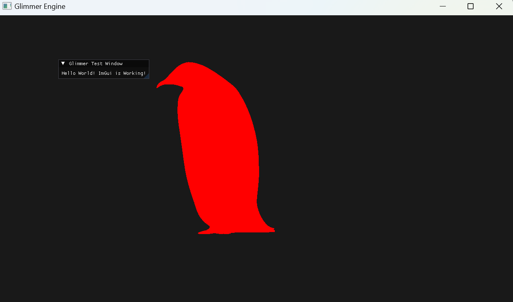

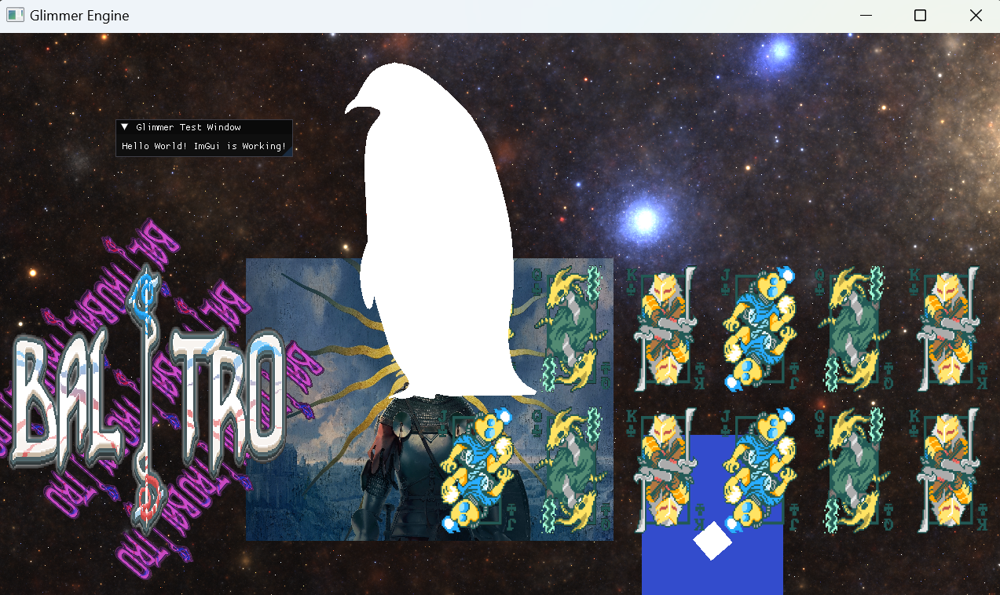

## 3D全局光照

目前 3D 模型虽然能显示，但由于没有光影，它看起来像是一个“扁平的色块”。我们要引入工业界最经典的 **冯氏光照模型 (Phong Lighting Model)**。

这一步的实现分为三个部分：**Shader 逻辑升级**、**C++ 数据上传**、以及**架构优化**。

**第一步：编写 3D 光照着色器 (assets/shaders/Model3D.glsl)**

光照计算主要发生在 **Fragment Shader** 中。我们需要利用顶点传来的 **法线 (Normal)** 来计算光线照射的角度。

```
#type vertex
#version 330 core

layout(location = 0) in vec3 a_Position;
layout(location = 1) in vec3 a_Normal; // 之前在 Mesh 里存好的法线
layout(location = 2) in vec2 a_TexCoord;

uniform mat4 u_ViewProjection;
uniform mat4 u_Transform;

out vec2 v_TexCoord;
out vec3 v_Normal;
out vec3 v_WorldPos; // 传出世界坐标，用于计算光线方向

void main()
{
	v_TexCoord = a_TexCoord;

	// 核心：法线也需要旋转。使用“法线矩阵”防止非等比缩放导致法线畸变
	v_Normal = mat3(transpose(inverse(u_Transform))) * a_Normal;

	v_WorldPos = vec3(u_Transform * vec4(a_Position, 1.0));
	gl_Position = u_ViewProjection * vec4(v_WorldPos, 1.0);
}

#type fragment
#version 330 core

layout(location = 0) out vec4 color;

in vec2 v_TexCoord;
in vec3 v_Normal;
in vec3 v_WorldPos;

uniform sampler2D u_Texture;
uniform vec3 u_LightPos;    // 光源位置
uniform vec3 u_LightColor;  // 灯光颜色
uniform vec3 u_ViewPos;     // 摄像机位置（用于高光）

void main()
{
	// 1. 环境光 (Ambient) - 保证没光的地方不是全黑
	float ambientStrength = 0.2;
	vec3 ambient = ambientStrength * u_LightColor;

	// 2. 漫反射 (Diffuse) - 根据物体朝向光的角度决定亮度
	vec3 norm = normalize(v_Normal);
	vec3 lightDir = normalize(u_LightPos - v_WorldPos);
	float diff = max(dot(norm, lightDir), 0.0);
	vec3 diffuse = diff * u_LightColor;

	// 3. 高光 (Specular) - 金属或光滑表面的反光
	float specularStrength = 0.5;
	vec3 viewDir = normalize(u_ViewPos - v_WorldPos);
	vec3 reflectDir = reflect(-lightDir, norm);
	float spec = pow(max(dot(viewDir, reflectDir), 0.0), 32); // 32 是发光反光度
	vec3 specular = specularStrength * spec * u_LightColor;

	// 结合贴图颜色
	vec4 texColor = texture(u_Texture, v_TexCoord);
	vec3 result = (ambient + diffuse + specular) * texColor.rgb;

	color = vec4(result, texColor.a);
}

```

**第二步：在 Sandbox2D 中配置光源**

你需要把灯的位置、颜色和相机位置传给 Shader。

**修改 Sandbox2D::OnUpdate：**

```
void Sandbox2D::OnUpdate(gl::Timestep ts)
{
    // ... 之前的清屏逻辑 ...

    m_3DShader->Bind();

    // 设置灯光参数
    glm::vec3 lightPos(2.0f, 2.0f, 2.0f); // 灯在右上方
    m_3DShader->UploadUniformFloat3("u_LightPos", lightPos);
    m_3DShader->UploadUniformFloat3("u_LightColor", { 1.0f, 1.0f, 1.0f }); // 白光
    
    // 传入摄像机位置（用于高光计算）
    m_3DShader->UploadUniformFloat3("u_ViewPos", m_CameraController.GetCamera().GetPosition());

    // 渲染模型
    glm::mat4 transform = glm::translate(glm::mat4(1.0f), {0, 0, 0})
                        * glm::rotate(glm::mat4(1.0f), (float)gl::Application::Get().GetTime(), {0, 1, 0});
                        
    m_MeshModel->Draw(m_3DShader, transform);
}
```

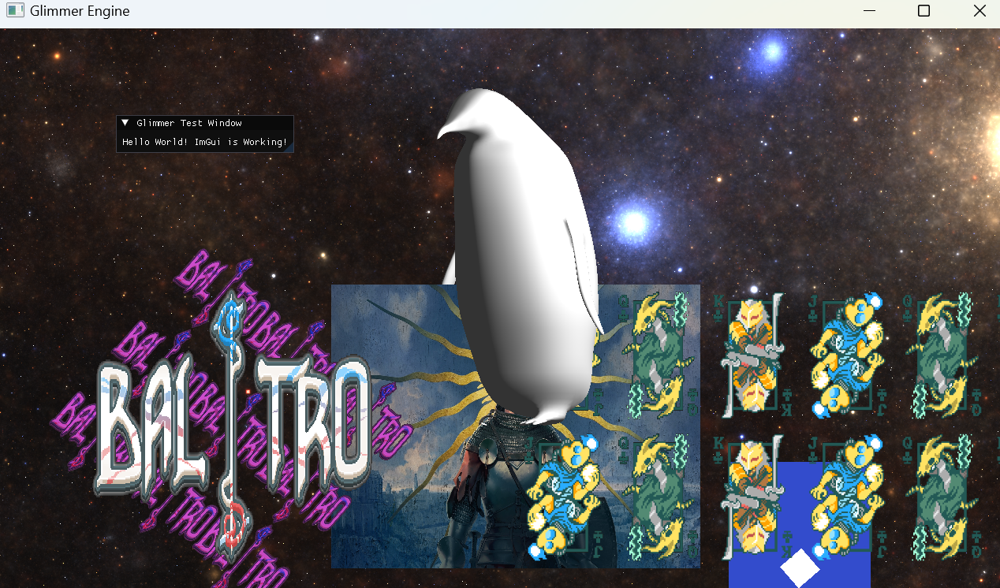

ImGui集成了一个简单光源位置改变

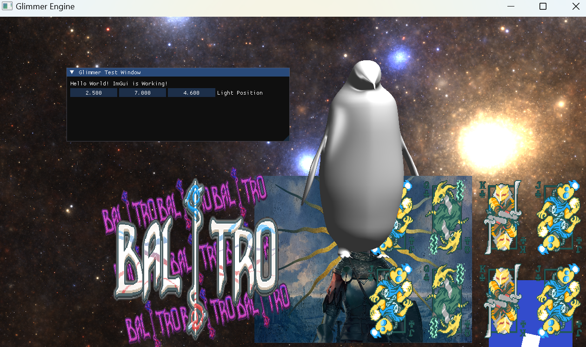

卡通风格shader

```
void main()
{
    vec3 norm = normalize(v_Normal);
    vec3 lightDir = normalize(u_LightPos - v_WorldPos);
    vec3 viewDir = normalize(u_ViewPos - v_WorldPos);

    // 1. 核心：将漫反射强度“阶梯化”
    float diff = dot(norm, lightDir);
    float intensity = smoothstep(0.0, 0.05, diff) * 0.5 + 
                     smoothstep(0.4, 0.45, diff) * 0.5; // 只有两层亮度
    
    vec3 diffuse = intensity * u_LightColor;

    // 2. 边缘光 (Rim Light)：在物体轮廓处产生发光感
    float rim = 1.0 - max(dot(viewDir, norm), 0.0);
    rim = pow(rim, 4.0); // 调整边缘光的细度
    vec3 rimColor = u_LightColor * rim * 0.5;

    vec4 texColor = texture(u_Texture, v_TexCoord);
    // 卡通色块 + 基础环境光 + 边缘光
    vec3 result = (vec3(0.3) + diffuse + rimColor) * texColor.rgb;
    
    color = vec4(result, texColor.a);
}
```

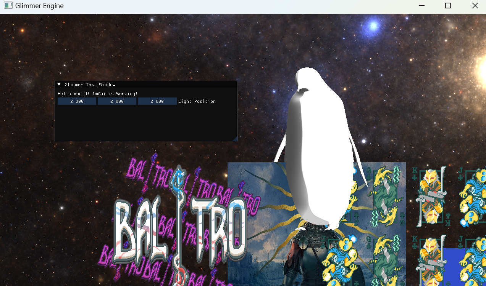

Blinn-Phong

```
void main()
{
    vec3 norm = normalize(v_Normal);
    vec3 lightDir = normalize(u_LightPos - v_WorldPos);
    vec3 viewDir = normalize(u_ViewPos - v_WorldPos);

    // 1. 漫反射
    float diff = max(dot(norm, lightDir), 0.0);
    vec3 diffuse = diff * u_LightColor;

    // 2. ✨ Blinn-Phong 核心：计算半角向量
    vec3 halfwayDir = normalize(lightDir + viewDir);
    float spec = pow(max(dot(norm, halfwayDir), 0.0), 64.0); // 64 是反光锐度
    vec3 specular = 0.5 * spec * u_LightColor;

    vec4 texColor = texture(u_Texture, v_TexCoord);
    color = vec4((vec3(0.1) + diffuse + specular) * texColor.rgb, texColor.a);
}
```

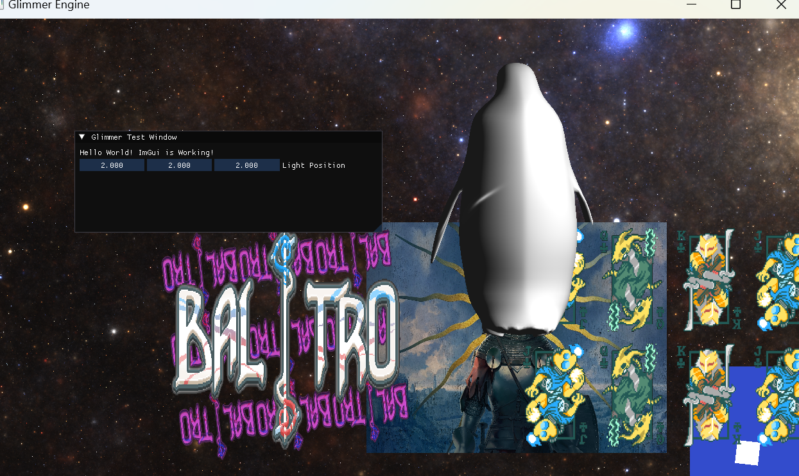

## 为3D对象绑定贴图

核心是**让** **Mesh** **类持有纹理引用，并在** **Model** **绘制时进行绑定。**

```
// ✨ 构造函数增加纹理参数
Mesh(const std::vector<Vertex>& vertices, const std::vector<uint32_t>& indices, Ref<Texture2D> texture);
// ✨ 获取纹理的接口
const Ref<Texture2D>& GetTexture() const { return m_Texture; }
```

**修改 Model 的加载与绘制逻辑**

这里有两种方式：

1. **手动指定**：在 Sandbox 里加载模型后，手动塞给它一张图。
2. **自动加载**：读取 .obj 时，自动去读它配套的 .mtl 文件里写的图片路径。

**实现“自动加载”模式**

**修改** **Glimmer/src/Glimmer/Renderer/Model.cpp**：

在 `Model::Model` 里，首先根据模型路径提取出所在目录，并把它设置给 tinyobj，这样在解析 `.obj` 的同时就能正确找到 `.mtl` 和贴图文件；然后调用 tinyobj 读取模型数据，拿到顶点（attrib）、几何（shapes）和材质（materials）。接着遍历每个 shape，一边构建顶点/索引数据，一边根据该 shape 关联的材质 ID 查找对应的漫反射贴图（diffuse texture），如果存在就加载成 `Texture2D`，最后把“顶点数据 + 索引 + 贴图”封装成一个 Mesh 存进 `m_Meshes`。

而在 `Model::Draw` 里，则是逐个 Mesh 渲染：先绑定 shader、上传矩阵（VP 和 transform），然后**在绘制前绑定这个 Mesh 自己的贴图**，最后绑定 VAO 并调用 `DrawIndexed` 送到 GPU。这样每个 Mesh 都能用自己的材质/贴图正确渲染出来。

绑定纹理并测试

```
		m_TestTexture->Bind(0);
		m_MeshModel->Draw(m_3DShader, transform);
```

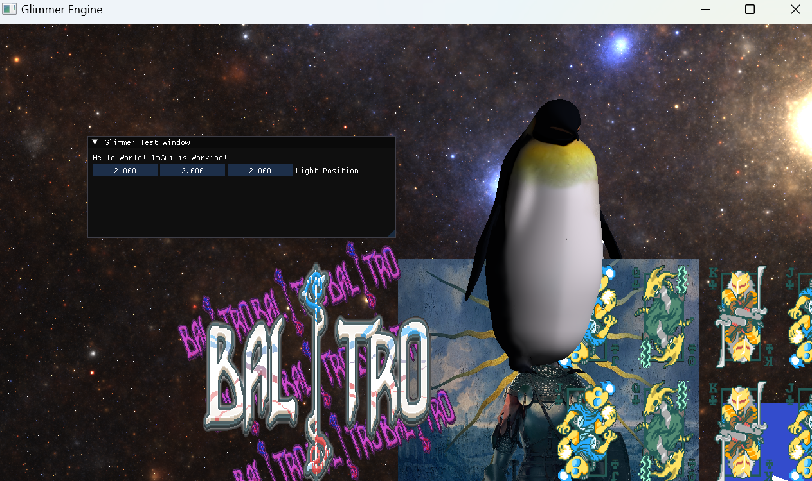

## 帧缓冲 (Framebuffers)

**为什么要这一步？**

目前的游戏画面是直接绘制到显卡提供的“默认画布”上的，这会导致两个限制：

- **无法做后期处理**：你没法给整个屏幕加模糊、调色或泛光（Bloom），因为画面一画完就显示了，你抓不住它。
- **无法做“Unity 式”的编辑器**：在 Unity 里，你会发现游戏画面是在一个名为 **Viewport** 的窗口里的。要实现这个，我们需要把游戏渲染到一张**贴图**上，然后把这张图贴进 ImGui 的窗口里。

**这一步的工作内容**

我们要实现一套 Framebuffer 类，它允许我们：

1. 创建一个离屏渲染目标（Off-screen Render Target）。
2. 让渲染器（Renderer2D/3D）把东西画在这个目标上。
3. 实时调整这个目标的大小（以适配窗口缩放）。

---

**第一步：定义帧缓冲接口 (`Framebuffer.h`)**

在 `Glimmer/src/Glimmer/Renderer` 下创建。

**Glimmer/src/Glimmer/Renderer/Framebuffer.h**
```cpp
#pragma once
#include <memory>

namespace gl {

	struct FramebufferSpecification
	{
		uint32_t Width, Height;
		uint32_t Samples = 1; // 用于多重采样抗锯齿

		bool SwapChainTarget = false; // 是否直接渲染到屏幕
	};

	class Framebuffer
	{
	public:
		virtual ~Framebuffer() = default;

		virtual void Bind() = 0;
		virtual void Unbind() = 0;

		virtual void Resize(uint32_t width, uint32_t height) = 0;

		// 获取渲染出来的那个“图片”ID
		virtual uint32_t GetColorAttachmentRendererID() const = 0;

		virtual const FramebufferSpecification& GetSpecification() const = 0;

		static Ref<Framebuffer> Create(const FramebufferSpecification& spec);
	};

}
```

Glimmer/src/Glimmer/Renderer/Framebuffer.cpp

```
#include "glpch.h"
#include "Framebuffer.h"

#include "Glimmer/Renderer/Renderer.h"
#include "Platform/OpenGL/OpenGLFramebuffer.h"

namespace gl {

	Ref<Framebuffer> Framebuffer::Create(const FramebufferSpecification& spec)
	{
		switch (Renderer::GetAPI())
		{
			case RendererAPI::API::None:    GL_CORE_ASSERT(false, "RendererAPI::None is currently not supported!"); return nullptr;
			case RendererAPI::API::OpenGL:  return CreateRef<OpenGLFramebuffer>(spec);
		}

		GL_CORE_ASSERT(false, "Unknown RendererAPI!");
		return nullptr;
	}

}
```

---

**第二步：实现 OpenGL 帧缓冲 (`OpenGLFramebuffer.cpp`)**

这一步最核心的工作是：**向显卡申请一块内存画布，并挂载一个“颜色附件”和“深度附件”。**

**Glimmer/src/Platform/OpenGL/OpenGLFramebuffer.cpp (核心片段)**
```cpp
#include "glpch.h"
#include "OpenGLFramebuffer.h"

#include <glad/glad.h>

namespace gl {

	OpenGLFramebuffer::OpenGLFramebuffer(const FramebufferSpecification& spec)
		: m_Specification(spec)
	{
		Invalidate();
	}

	OpenGLFramebuffer::~OpenGLFramebuffer()
	{
		glDeleteFramebuffers(1, &m_RendererID);
		glDeleteTextures(1, &m_ColorAttachment);
		glDeleteTextures(1, &m_DepthAttachment);
	}

	void OpenGLFramebuffer::Invalidate()
	{
		if (m_RendererID)
		{
			glDeleteFramebuffers(1, &m_RendererID);
			glDeleteTextures(1, &m_ColorAttachment);
			glDeleteTextures(1, &m_DepthAttachment);
		}

		// 使用 DSA (Direct State Access) 风格创建 Framebuffer
		glCreateFramebuffers(1, &m_RendererID);
		
		// --- 颜色附件 (Color Attachment) ---
		glCreateTextures(GL_TEXTURE_2D, 1, &m_ColorAttachment);
		glBindTexture(GL_TEXTURE_2D, m_ColorAttachment);
		
		// 为颜色附件分配存储空间
		glTexImage2D(GL_TEXTURE_2D, 0, GL_RGBA8, m_Specification.Width, m_Specification.Height, 0, GL_RGBA, GL_UNSIGNED_BYTE, nullptr);
		
		// 设置过滤参数，防止 ImGui 渲染时出现采样问题
		glTexParameteri(GL_TEXTURE_2D, GL_TEXTURE_MIN_FILTER, GL_LINEAR);
		glTexParameteri(GL_TEXTURE_2D, GL_TEXTURE_MAG_FILTER, GL_LINEAR);

		// 将纹理附加到帧缓冲
		glNamedFramebufferTexture(m_RendererID, GL_COLOR_ATTACHMENT0, m_ColorAttachment, 0);

		// --- 深度/模板附件 (Depth/Stencil Attachment) ---
		glCreateTextures(GL_TEXTURE_2D, 1, &m_DepthAttachment);
		glBindTexture(GL_TEXTURE_2D, m_DepthAttachment);
		
		// 使用 glTexStorage2D 分配不可变的深度存储
		glTexStorage2D(GL_TEXTURE_2D, 1, GL_DEPTH24_STENCIL8, m_Specification.Width, m_Specification.Height);
		
		// 将深度纹理附加到帧缓冲
		glNamedFramebufferTexture(m_RendererID, GL_DEPTH_STENCIL_ATTACHMENT, m_DepthAttachment, 0);

		// 完整性检查
		GL_CORE_ASSERT(glCheckNamedFramebufferStatus(m_RendererID, GL_FRAMEBUFFER) == GL_FRAMEBUFFER_COMPLETE, "Framebuffer is incomplete!");
	}

	void OpenGLFramebuffer::Bind()
	{
		glBindFramebuffer(GL_FRAMEBUFFER, m_RendererID);
		// 绑定后需要同步更新视口大小，确保渲染到正确的画布区域
		glViewport(0, 0, m_Specification.Width, m_Specification.Height);
	}

	void OpenGLFramebuffer::Unbind()
	{
		glBindFramebuffer(GL_FRAMEBUFFER, 0);
	}

	void OpenGLFramebuffer::Resize(uint32_t width, uint32_t height)
	{
		// 简单的防零检查
		if (width == 0 || height == 0)
		{
			GL_CORE_WARN("Attempted to resize framebuffer to {0}, {1}", width, height);
			return;
		}

		m_Specification.Width = width;
		m_Specification.Height = height;

		Invalidate();
	}

}
```

---

**第三步：在 Sandbox2D 中实现“画中画”**

当你有了 Framebuffer，你的渲染流程会发生翻天覆地的变化：

```cpp
void Sandbox2D::OnUpdate(gl::Timestep ts) {
    // 1. ✨ 核心改变：绑定自己的画布，而不是屏幕
    m_Framebuffer->Bind();

    // 2. 执行你所有的 2D/3D 渲染指令
    gl::RenderCommand::Clear();
    gl::Renderer::BeginScene(...);
    m_Model->Draw(...);
    gl::Renderer::EndScene();

    // 3. 解绑画布，回到默认屏幕
    m_Framebuffer->Unbind();
}

void Sandbox2D::OnImGuiRender() {
    // 4. ✨ 将画布上的图片画在 ImGui 窗口里！
    ImGui::Begin("Viewport");
    
    uint32_t textureID = m_Framebuffer->GetColorAttachmentRendererID();
    // 强制转换为 ImTextureID 并显示
    ImGui::Image((void*)(uintptr_t)textureID, ImVec2{ 1280, 720 }, ImVec2{ 0, 1 }, ImVec2{ 1, 0 });
    
    ImGui::End();
}
```

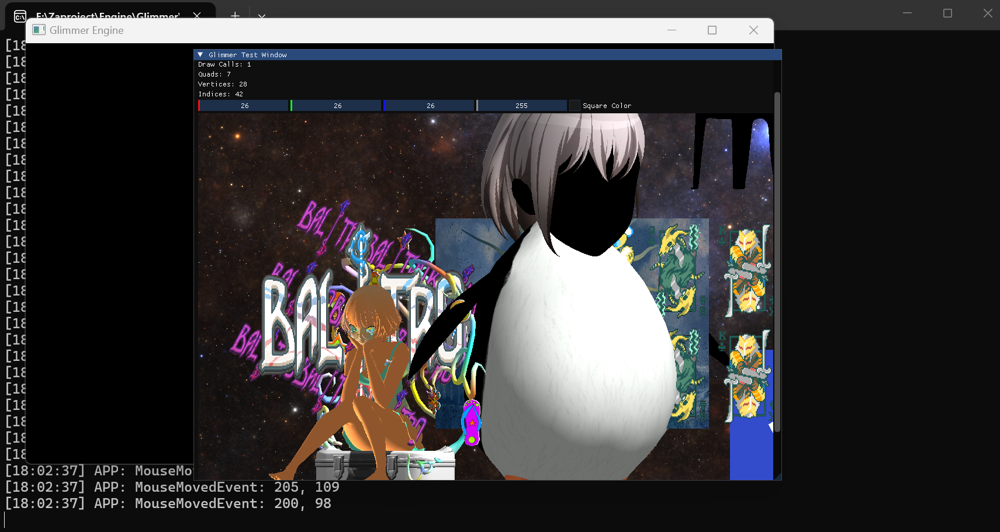

## 建立新项目

打开根目录的 **premake5.lua**，参考 Sandbox 的配置，在文件末尾增加一个新项目块。

```
project "GlimmerEditor"
    location "GlimmerEditor"
    kind "ConsoleApp"
    language "C++"
    cppdialect "C++17"
    staticruntime "on"

    targetdir ("bin/" .. outputdir .. "/%{prj.name}")
    objdir ("bin-int/" .. outputdir .. "/%{prj.name}")

    files {
        "%{prj.name}/src/**.h",
        "%{prj.name}/src/**.cpp",
    }

    includedirs {
        "Glimmer/src",
        "Glimmer/vendor/spdlog/include",
        "Glimmer/vendor/imgui",
        "Glimmer/vendor/glm"
    }

    links {
        "Glimmer"
    }

    filter "system:windows"
    buildoptions { "/utf-8" }
    systemversion "latest"
    defines {
        "GL_PLATFORM_WINDOWS"
    }
```

创建EditorApp并设为启动项目，添加对应Layer和assets

```
#include <Glimmer.h>
#include "Glimmer/Core/EntryPoint.h"
#include "EditorLayer.h"

class GlimmerEditor : public gl::Application {
public:
	GlimmerEditor() {
		PushLayer(new EditorLayer());
	}
};

gl::Application* gl::CreateApplication() {
	return new GlimmerEditor();
}

```

正常运行

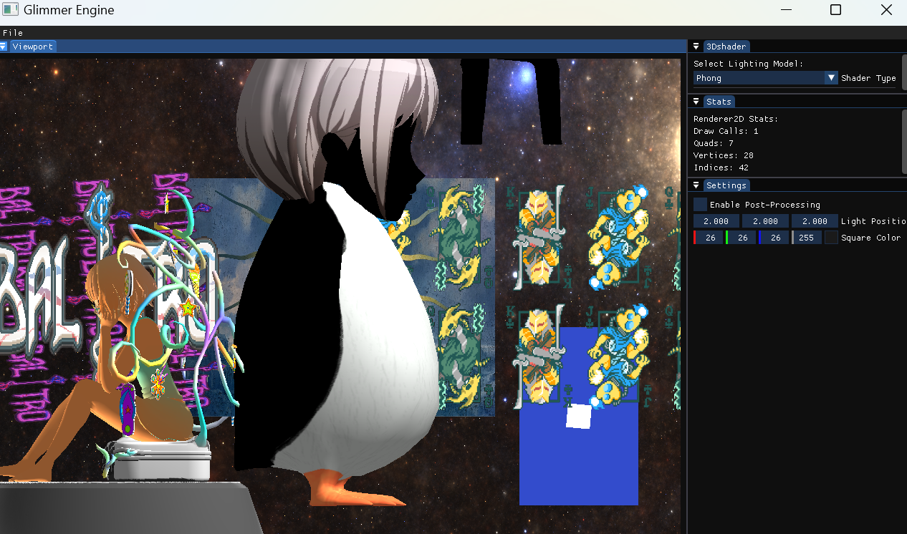

另外为了区分App，重写Application函数

```
Application::Application(const std::string& name)
m_Window = Window::Create(WindowProps(name));
```

在App引用

```
#include <Glimmer.h>
#include "Glimmer/Core/EntryPoint.h"
#include "EditorLayer.h"

class GlimmerEditor : public gl::Application {
public:
	GlimmerEditor():Application("Glimmer Editor") {
		PushLayer(new EditorLayer());
	}
};

gl::Application* gl::CreateApplication() {
	return new GlimmerEditor();
}

```

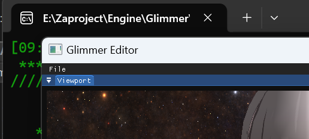

## ECS

在之前的开发中，你的企鹅、方块、椅子都是在 Sandbox2D 里手动创建的变量。如果游戏有 1000 个物体，你的代码会彻底失控。ECS 的出现就是为了解决**海量物体的管理、逻辑解耦以及 CPU 性能优化**。

我们将引入 C++ 业界最顶级的 ECS 库 —— **EnTT**。

**EnTT** 是一个纯头文件（Header-only）的高性能库，集成非常简单。

1. **添加子模块**：
   在根目录运行：

   ```
   git submodule add https://github.com/skypjack/entt.git Glimmer/vendor/entt
   ```

2. **修改 Premake**：
   在 project "Glimmer" 和 project "Sandbox"（以及 Editor）的 includedirs 中加入：
   "%{prj.name}/vendor/entt/include"。

我们需要建立三个核心类：Scene（场景）、Entity（实体）和 Components（组件）。

**ECS 代码说明**：

- **Components.h** —— 定义了所有组件结构体。`TagComponent`（实体名称标签）、`TransformComponent`（4×4 变换矩阵）、`SpriteRendererComponent`（纯色渲染，含四维颜色向量）。组件是纯数据，不含逻辑。
- **Entity.h / Entity.cpp** —— 实体是对 `entt::entity` 的轻量包装。提供 `AddComponent<T>()`、`GetComponent<T>()`、`HasComponent<T>()`、`RemoveComponent<T>()` 四个模板方法，内部调用 `Scene::m_Registry` 完成组件增删查改。通过 `operator bool` 和 `operator entt::entity` 可隐式转换为底层 handle。
- **Scene.h / Scene.cpp** —— 场景持有 `entt::registry`（ECS 世界的核心容器）。`CreateEntity()` 创建实体时自动挂载 `TransformComponent` 和 `TagComponent`；`OnUpdateRuntime()` 通过 `registry.group<TransformComponent>(entt::get<SpriteRendererComponent>)` 遍历所有含渲染组件的实体并提交绘制；`OnComponentAdded<T>()` 采用模板特化模式，为不同组件提供添加时的回调钩子。

**1. 定义组件 (Components.h)**

组件应该是纯粹的数据结构。

**Glimmer/src/Glimmer/Scene/Components.h**:

```
#pragma once
#include <glm/glm.hpp>
#include <string>

namespace gl {

	struct TagComponent
	{
		std::string Tag;

		TagComponent() = default;
		TagComponent(const TagComponent&) = default;
		TagComponent(const std::string& tag) : Tag(tag) {}
	};

	struct TransformComponent
	{
		glm::mat4 Transform{ 1.0f };

		TransformComponent() = default;
		TransformComponent(const TransformComponent&) = default;
		TransformComponent(const glm::mat4& transform) : Transform(transform) {}

		operator glm::mat4& () { return Transform; }
		operator const glm::mat4& () const { return Transform; }
	};

	struct SpriteRendererComponent
	{
		glm::vec4 Color{ 1.0f, 1.0f, 1.0f, 1.0f };

		SpriteRendererComponent() = default;
		SpriteRendererComponent(const SpriteRendererComponent&) = default;
		SpriteRendererComponent(const glm::vec4& color) : Color(color) {}
	};

}
```

**2. 创建场景类 (Scene.h/cpp)**

场景是 EnTT 注册表（Registry）的容器。

**Glimmer/src/Glimmer/Scene/Scene.h**:

```
#pragma once

#include "entt/entt.hpp"
#include "Glimmer/Core/Timestep.h"

namespace gl {

	class Entity;

	class Scene
	{
	public:
		Scene();
		~Scene();

		Entity CreateEntity(const std::string& name = std::string());
		void DestroyEntity(Entity entity);

		void OnUpdateRuntime(Timestep ts);
		void OnViewportResize(uint32_t width, uint32_t height);

	private:
		template<typename T>
		void OnComponentAdded(Entity entity, T& component);

	private:
		entt::registry m_Registry;
		uint32_t m_ViewportWidth = 0, m_ViewportHeight = 0;

		friend class Entity;
		friend class SceneHierarchyPanel; // 预留给未来的编辑器面板
	};

}
```

cpp

```
#include "glpch.h"
#include "Scene.h"

#include "Components.h"
#include "Glimmer/Renderer/Renderer2D.h"
#include "Entity.h"

#include <glm/glm.hpp>

namespace gl {

	Scene::Scene()
	{
	}

	Scene::~Scene()
	{
	}

	Entity Scene::CreateEntity(const std::string& name)
	{
		Entity entity = { m_Registry.create(), this };
		entity.AddComponent<TransformComponent>();
		auto& tag = entity.AddComponent<TagComponent>();
		tag.Tag = name.empty() ? "Entity" : name;
		return entity;
	}

	void Scene::DestroyEntity(Entity entity)
	{
		m_Registry.destroy(entity);
	}

	void Scene::OnUpdateRuntime(Timestep ts)
	{
		// 渲染 2D Sprites
		// 这里通过 EnTT 的 group 功能，筛选出同时拥有 Transform 和 SpriteRenderer 的实体
		auto group = m_Registry.group<TransformComponent>(entt::get<SpriteRendererComponent>);
		for (auto entity : group)
		{
			auto [transform, sprite] = group.get<TransformComponent, SpriteRendererComponent>(entity);

			// 调用此前封装好的 Renderer2D 进行批量渲染
			// 注意：这里假设 transform 存储的是 glm::mat4。
			// 如果 Renderer2D 接口需要 position/size，此处需从矩阵解算或修改接口
			Renderer2D::DrawQuad(transform.Transform, sprite.Color);
		}
	}

	void Scene::OnViewportResize(uint32_t width, uint32_t height)
	{
		m_ViewportWidth = width;
		m_ViewportHeight = height;
		// 可以在此处更新带有 CameraComponent 的实体的纵横比
	}

	// 各个组件添加时的回调模板特化
	template<typename T>
	void Scene::OnComponentAdded(Entity entity, T& component)
	{
	}

	template<>
	void Scene::OnComponentAdded<TransformComponent>(Entity entity, TransformComponent& component)
	{
	}

	template<>
	void Scene::OnComponentAdded<SpriteRendererComponent>(Entity entity, SpriteRendererComponent& component)
	{
	}

	template<>
	void Scene::OnComponentAdded<TagComponent>(Entity entity, TagComponent& component)
	{
	}

}
```

**3. 创建实体包装类 (Entity.h/cpp)**

在 EnTT 中，实体只是一个 uint32 的 ID。为了方便使用，我们把它包装成一个类，让你能写出 entity.AddComponent<T>() 这种顺手的代码。

**Glimmer/src/Glimmer/Scene/Entity.h**:

```
#pragma once

#include "Scene.h"
#include "entt.hpp"

namespace gl {

	class Entity
	{
	public:
		Entity() = default;
		Entity(entt::entity handle, Scene* scene);
		Entity(const Entity& other) = default;

		template<typename T, typename... Args>
		T& AddComponent(Args&&... args)
		{
			GL_CORE_ASSERT(!HasComponent<T>(), "Entity already has component!");
			T& component = m_Scene->m_Registry.emplace<T>(m_EntityHandle, std::forward<Args>(args)...);
			m_Scene->OnComponentAdded<T>(*this, component);
			return component;
		}

		template<typename T>
		T& GetComponent()
		{
			GL_CORE_ASSERT(HasComponent<T>(), "Entity does not have component!");
			return m_Scene->m_Registry.get<T>(m_EntityHandle);
		}

		template<typename T>
		bool HasComponent()
		{
			return m_Scene->m_Registry.all_of<T>(m_EntityHandle);
		}

		template<typename T>
		void RemoveComponent()
		{
			GL_CORE_ASSERT(HasComponent<T>(), "Entity does not have component!");
			m_Scene->m_Registry.remove<T>(m_EntityHandle);
		}

		operator bool() const { return m_EntityHandle != entt::null; }
		operator entt::entity() const { return m_EntityHandle; }
		operator uint32_t() const { return (uint32_t)m_EntityHandle; }

		bool operator==(const Entity& other) const
		{
			return m_EntityHandle == other.m_EntityHandle && m_Scene == other.m_Scene;
		}

		bool operator!=(const Entity& other) const
		{
			return !(*this == other);
		}

	private:
		entt::entity m_EntityHandle{ entt::null };
		Scene* m_Scene = nullptr;
	};

}
```

cpp

```
#include "glpch.h"
#include "Entity.h"

namespace gl {

	Entity::Entity(entt::entity handle, Scene* scene)
		: m_EntityHandle(handle), m_Scene(scene)
	{
	}

}
```

过程中出现了很多命名空间问题，例如：成功#include "entt.hpp"后一直显示entt::registry m_Registry;，entt::entity handle，entt命名空间没有xxx。 "%{prj.name}/vendor/entt/src/entt"

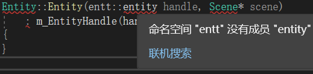

  根因：EnTT v3.16+ 改用了 #include <concepts>、<compare> 和 requires requires { ... } 语法，这些全是 C++20 特性。C++17
  模式下 MSVC 解析不到这些语法，entt 命名空间内的所有声明（registry、entity、view 等）会全部静默失败——#include
  本身不报错（路径正确），但编译到 entt::registry m_Registry; 时发现命名空间里什么也没有。

premake改动后正常

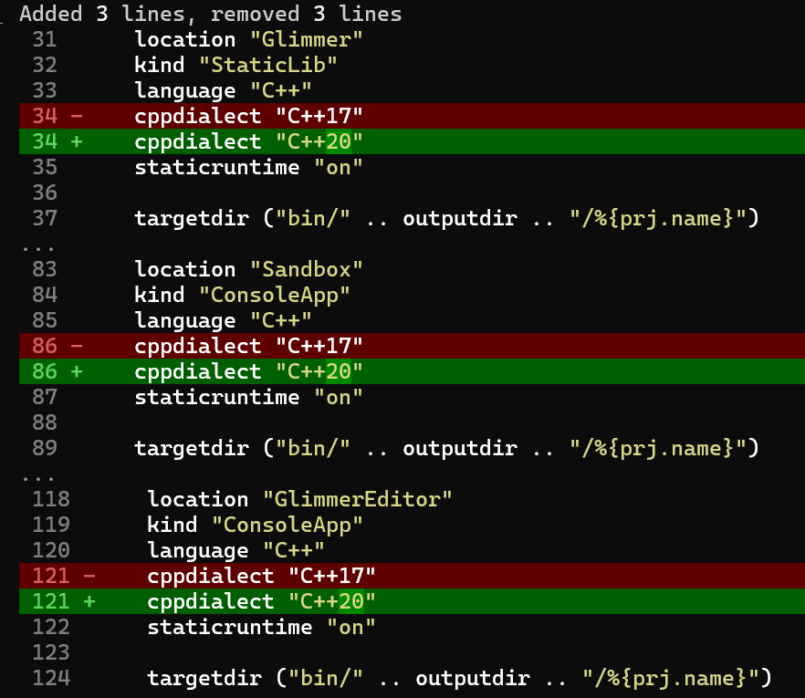

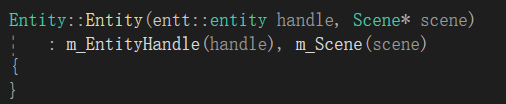

新增Renderer2D Draw接口

```
static void DrawQuad(const glm::mat4& transform, const glm::vec4& color);
static void DrawQuad(const glm::mat4& transform, const Ref<Texture2D>& texture, float tilingFactor = 1.0f, const glm::vec4& tintColor = glm::vec4(1.0f));
```

现在的主要绘图在transform为参数的接口内，详见Renderer2D.cpp

EditorLayer加入组件

```
	m_ActiveScene = gl::CreateRef<gl::Scene>();

	auto square = m_ActiveScene->CreateEntity("Green Square");
	square.AddComponent<gl::SpriteRendererComponent>(glm::vec4{ 0.0f, 1.0f, 0.0f, 1.0f });
	//。。。
		if (m_SquareEntity)
	{
		ImGui::Separator();
		auto& tag = m_SquareEntity.GetComponent<gl::TagComponent>().Tag;
		ImGui::Text("%s", tag.c_str());

		auto& squareColor = m_SquareEntity.GetComponent<gl::SpriteRendererComponent>().Color;
		ImGui::ColorEdit4("Square Color", glm::value_ptr(squareColor));
		ImGui::Separator();
	}
```

EnTT库依然出现很多隐式报错

  根因：EnTT 子模块追踪的是 master 分支（v4.0.0-dev），meta 反射系统在 MSVC 上存在 concept 兼容性 bug，导致 meta_traits
  的 operator&/operator| 无法解析。

  已执行修复：将 Glimmer/vendor/entt 切到稳定标签 v3.16.0：
  git checkout v3.16.0  (HEAD detached at b4e58bdd3)

但这样一来又导致，C++20 后，tiny_obj_loader.h 内的 fast_float 库通过
  __cpp_lib_constexpr_algorithms >= 201806L 检测到 C++20 constexpr 算法支持，把函数标记为 constexpr。但 MSVC 14.37 的
  std::distance 并非 constexpr，导致 error C3615

所以再次将premake改为C++17，重新构建后成功运行

现在可在ImGui中实时操控场景面板

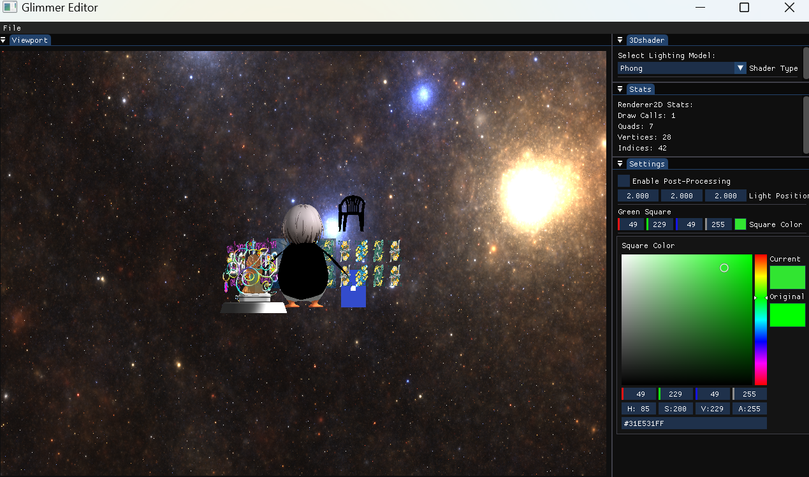

## 相机组件

在 ECS 架构中，相机不应该只是一个全局变量，而应该是一个可以挂载到任何实体上的组件。

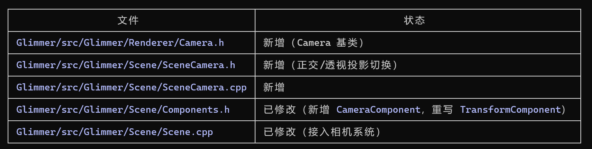

【文件】Glimmer/src/Glimmer/Renderer/Camera.h

```
#pragma once
#include <glm/glm.hpp>

namespace gl {

	class Camera
	{
	public:
		Camera() = default;
		Camera(const glm::mat4& projection)
			: m_Projection(projection) {}

		virtual ~Camera() = default;

		const glm::mat4& GetProjection() const { return m_Projection; }
	protected:
		glm::mat4 m_Projection = glm::mat4(1.0f);
	};

}
```

【文件】Glimmer/src/Glimmer/Scene/SceneCamera.h

```
#pragma once
#include "Glimmer/Renderer/Camera.h"

namespace gl {

	class SceneCamera : public Camera
	{
	public:
		enum class ProjectionType { Perspective = 0, Orthographic = 1 };
	public:
		SceneCamera();
		virtual ~SceneCamera() = default;

		void SetOrthographic(float size, float nearClip, float farClip);
		void SetPerspective(float verticalFOV, float nearClip, float farClip);

		void SetViewportSize(uint32_t width, uint32_t height);

		float GetOrthographicSize() const { return m_OrthographicSize; }
		void SetOrthographicSize(float size) { m_OrthographicSize = size; RecalculateProjection(); }

		ProjectionType GetProjectionType() const { return m_ProjectionType; }
		void SetProjectionType(ProjectionType type) { m_ProjectionType = type; RecalculateProjection(); }
	private:
		void RecalculateProjection();
	private:
		ProjectionType m_ProjectionType = ProjectionType::Orthographic;

		float m_OrthographicSize = 10.0f;
		float m_OrthographicNear = -1.0f, m_OrthographicFar = 1.0f;

		float m_PerspectiveFOV = glm::radians(45.0f);
		float m_PerspectiveNear = 0.01f, m_PerspectiveFar = 1000.0f;

		float m_AspectRatio = 0.0f;
	};

}
```

【文件】Glimmer/src/Glimmer/Scene/SceneCamera.cpp

```
#include "glpch.h"
#include "SceneCamera.h"
#include <glm/gtc/matrix_transform.hpp>

namespace gl {

	SceneCamera::SceneCamera()
	{
		RecalculateProjection();
	}

	void SceneCamera::SetOrthographic(float size, float nearClip, float farClip)
	{
		m_ProjectionType = ProjectionType::Orthographic;
		m_OrthographicSize = size;
		m_OrthographicNear = nearClip;
		m_OrthographicFar = farClip;
		RecalculateProjection();
	}

	void SceneCamera::SetPerspective(float verticalFOV, float nearClip, float farClip)
	{
		m_ProjectionType = ProjectionType::Perspective;
		m_PerspectiveFOV = verticalFOV;
		m_PerspectiveNear = nearClip;
		m_PerspectiveFar = farClip;
		RecalculateProjection();
	}

	void SceneCamera::SetViewportSize(uint32_t width, uint32_t height)
	{
		m_AspectRatio = (float)width / (float)height;
		RecalculateProjection();
	}

	void SceneCamera::RecalculateProjection()
	{
		if (m_ProjectionType == ProjectionType::Perspective)
		{
			m_Projection = glm::perspective(m_PerspectiveFOV, m_AspectRatio, m_PerspectiveNear, m_PerspectiveFar);
		}
		else
		{
			float orthoLeft = -m_OrthographicSize * m_AspectRatio * 0.5f;
			float orthoRight = m_OrthographicSize * m_AspectRatio * 0.5f;
			float orthoBottom = -m_OrthographicSize * 0.5f;
			float orthoTop = m_OrthographicSize * 0.5f;

			m_Projection = glm::ortho(orthoLeft, orthoRight,
				orthoBottom, orthoTop, m_OrthographicNear, m_OrthographicFar);
		}
	}

}
```

修改Components.h，添加

```
	struct CameraComponent
	{
		gl::SceneCamera Camera;
		bool Primary = true; // 是否为当前主相机
		bool FixedAspectRatio = false; // 是否固定纵横比

		CameraComponent() = default;
		CameraComponent(const CameraComponent&) = default;
	};
```

同时为Renderer2D::BeginScene添加重载

```
	void Renderer2D::BeginScene(const Camera& camera, const glm::mat4& transform)
	{
		GL_PROFILE_FUNCTION();

		s_Data.SceneTime = gl::Application::Get().GetTime();
		glm::mat4 viewProj = camera.GetProjection() * glm::inverse(transform);

		s_Data.TextureShader->Bind();
		s_Data.TextureShader->UploadUniformFloat("u_Time", s_Data.SceneTime);
		s_Data.TextureShader->UploadUniformMat4("u_ViewProjection", viewProj);

		s_Data.QuadIndexCount = 0;
		s_Data.QuadVertexBufferPtr = s_Data.QuadVertexBufferBase;

		s_Data.TextureSlotIndex = 1;
	}
```

实体加载具体流程：

  m_ActiveScene ────────────► gl::Scene 实例（持有 entt::registry）
    │
    ├─ m_SquareEntity ──────► "Green Square" 实体
    │     ├─ TransformComponent ──► Translation=(0,0,0), Scale=(1,1,1)
    │     ├─ SpriteRendererComponent ──► Color=绿色 rgba(0,1,0,1)
    │     └─ TagComponent ──► Tag="Green Square"
    │
    ├─ m_CameraEntity ──────► "Camera Entity" 实体
    │     ├─ TransformComponent ──► 默认原点
    │     ├─ CameraComponent ──► Primary=true, Camera=SceneCamera(ortho size=10)
    │     └─ TagComponent
    │
    └─ m_SecondCamera ──────► "Clip-Space Entity" 实体
          ├─ TransformComponent
          └─ CameraComponent ──► Primary=false

  关键点：绿色方块是 ECS 实体，存在 m_ActiveScene 的 entt::registry 里。它不是直接绘制的——必须通过
  Scene::OnUpdateRuntime() 遍历 ECS 才能被提交到 GPU。

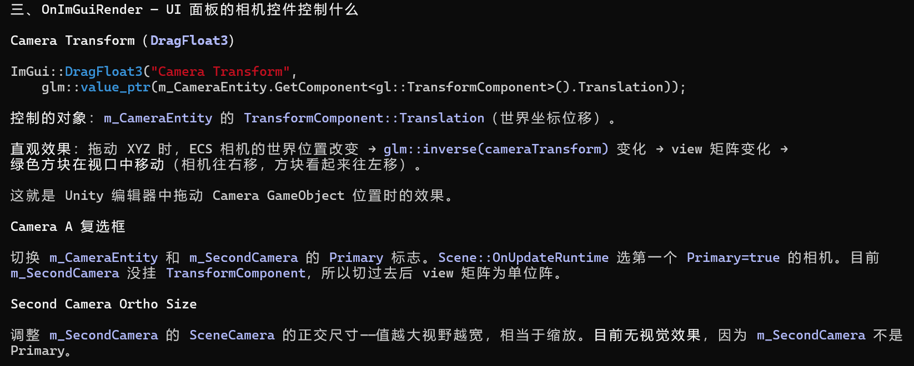

为什么有两个绿色方块，一个由wasd控制，一个由ECS控制？

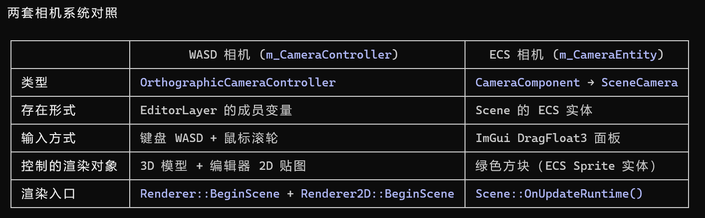

  历史原因：m_CameraController 是早期硬编码渲染阶段的产物，直接驱动 3D 模型和调试贴图。后来引入 ECS 架构时，新增了
  m_CameraEntity 作为场景相机，但没有替换掉旧的。

  根本差异：
  - 旧相机是 C++ 对象，直接被 BeginScene(OrthographicCamera&) 消费
  - ECS 相机是 Entity + Component，被 Scene::OnUpdateRuntime 遍历取出投影矩阵和 view 矩阵后传给 BeginScene(mat4, mat4)

### 相机组件架构总览

**类层次**

```
Camera (抽象基类, Renderer/Camera.h)
  └─ GetProjection() → 返回投影矩阵 (glm::mat4)
       │
       └─ SceneCamera (Scene/SceneCamera.h)
            ├─ ProjectionType: Perspective / Orthographic
            ├─ SetOrthographic(size, near, far)
            ├─ SetPerspective(fov, near, far)
            ├─ SetViewportSize(width, height) → 更新宽高比
            └─ RecalculateProjection() → 重新计算 m_Projection
```

**ECS 组件挂载**

```
CameraComponent (Components.h)
  ├─ SceneCamera Camera        ← 投影计算（正交/透视）
  ├─ bool Primary              ← 是否为主相机（Scene 选第一个 Primary=true 的）
  └─ bool FixedAspectRatio     ← 视口大小变化时是否保持固定纵横比
```

任何 Entity 挂上 `TransformComponent` + `CameraComponent` 即成为场景相机。

**Renderer2D 桥接**

`BeginScene(const Camera&, const glm::mat4& transform)` 重载是 ECS 相机与渲染器的唯一连接点：

```
viewProj = camera.GetProjection() * glm::inverse(transform)
上传 u_ViewProjection uniform
```

参数语义：`camera` 提供投影，`transform` 是相机实体的世界矩阵，其逆矩阵即为 view 矩阵。

**Scene::OnUpdateRuntime 渲染流程**

```
1. 遍历 Registry 中所有含 TransformComponent + CameraComponent 的实体
2. 挑选第一个 Primary == true 的相机
3. 取出 SceneCamera::GetProjection() + TransformComponent::GetTransform()
4. 调用 Renderer2D::BeginScene(projection, inverse(cameraTransform))
5. 遍历所有含 TransformComponent + SpriteRendererComponent 的实体
6. 对每个 Sprite 调用 Renderer2D::DrawQuad(transform, color)
7. 调用 Renderer2D::EndScene() → Flush() 提交 GPU 绘制
```

**Scene::OnViewportResize 响应**

视口大小变化时，遍历所有 `CameraComponent`，对 `FixedAspectRatio == false` 的相机调用 `SetViewportSize(width, height)`，自动重算投影矩阵。

**Scene::OnComponentAdded<CameraComponent> 初始化**

新挂载的相机如果当前已记录视口尺寸，立刻同步一次 `SetViewportSize`，避免首帧投影矩阵宽高为零。

**EditorLayer 中的双相机架构**

| 相机 | 类型 | 控制方式 | 渲染目标 |
|---|---|---|---|
| `m_CameraController` | `OrthographicCameraController` | 键盘 WASD + 滚轮 | 3D 模型（企鹅/椅子/女孩）+ 编辑器调试贴图 |
| `m_CameraEntity` (ECS) | `CameraComponent` | ImGui 面板 | 场景中所有 SpriteRendererComponent 实体 |

两套相机各自独立工作，渲染到同一个 Framebuffer。WASD 相机通过 `Renderer::BeginScene` 和 `Renderer2D::BeginScene(OrthographicCamera&)` 驱动；ECS 相机通过 `Scene::OnUpdateRuntime` 内部调用 `BeginScene(Camera&, mat4)` 驱动。

**ImGui 相机面板控件含义**

| 控件 | 操作对象 | 直观效果 |
|---|---|---|
| `DragFloat3("Camera Transform")` | `m_CameraEntity.TransformComponent.Translation` | 拖拽 XYZ 改变相机世界位置，view 矩阵随之变化，视口中所有 ECS Sprite 反向移动 |
| `Checkbox("Camera A")` | 切换 `m_CameraEntity` 与 `m_SecondCamera` 的 `Primary` | 切换主相机——当前仅影响绿色方块的视角来源 |
| `DragFloat("Second Camera Ortho Size")` | `m_SecondCamera.CameraComponent.Camera` 的正交尺寸 | 数值越大视野越宽（等效缩小），仅在 SecondCamera 为 Primary 时有可见效果 |

渲染层级总览（EditorLayer 每帧绘制顺序）

```
① Framebuffer Clear (深灰底色)
② StarNest 全屏 Shader 背景
③ 3D 模型层 ──────────── 相机 = m_CameraController (WASD)
    企鹅 + 椅子 + 女孩
④ ECS Sprite 层 ──────── 相机 = m_CameraEntity (ImGui)
    绿色方块 (m_SquareEntity)
    ← 此处由 m_ActiveScene->OnUpdateRuntime(ts) 驱动
⑤ 编辑器 2D 调试层 ───── 相机 = m_CameraController (WASD)
    Balatro / STS / Henry 贴图
⑥ 后处理 (可选)
```

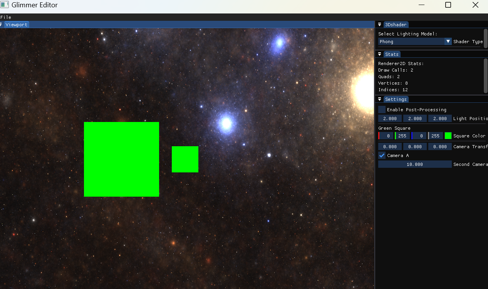

## 原生脚本系统

其核心原理是：定义一个 ScriptableEntity 基类，用户通过继承它来编写逻辑。引擎通过 NativeScriptComponent 组件持有脚本实例，并在场景更新时调用其生命周期函数。

**ScriptableEntity.h**（新增）  
定义 C++ 原生脚本的抽象基类。将 OnCreate、OnUpdate、OnDestroy 设为 protected 虚函数供派生类重写；提供模板方法 GetComponent\<T\>() 便捷访问同实体上的其他组件。内部持有一个 Entity 引用并通过 friend Scene 允许场景在实例化时注入。

**Components.h**（修改）  
新增 NativeScriptComponent 组件，作为连接 ECS 与脚本逻辑的桥梁。采用函数指针工厂模式实现类型擦除：InstantiateScript 负责延迟构造脚本实例，DestroyScript 管理回收；Bind\<T\>() 模板方法通过无捕获 lambda 生成工厂函数指针，使用 static_cast 实现派生类到基类的安全转换。

**Scene.cpp**（修改）  
在 OnUpdateRuntime 中集成脚本系统的完整生命周期。执行顺序为：先遍历所有 NativeScriptComponent——若脚本尚未实例化则通过工厂函数延迟创建、利用 Entity 构造回注实体引用、调用 OnCreate 初始化，随后每帧执行 OnUpdate；完成脚本更新后再执行主相机查找与精灵渲染管线。新增 OnComponentAdded\<NativeScriptComponent\> 显式特化。

**CameraController.h**（新增）  
基于脚本系统实现的 WASD 键盘控制示例。继承 ScriptableEntity 后重写 OnUpdate，直接调用 gl::Input::IsKeyPressed 读取键盘状态并修改自身的 TransformComponent 位移量，验证了脚本层与输入子系统、ECS 组件的互操作能力。

**EditorLayer.cpp**（修改）  
引入 CameraController 脚本头文件，在 OnAttach 中通过 m_CameraEntity.AddComponent\<gl::NativeScriptComponent\>().Bind\<CameraController\>() 将键盘控制脚本挂载到 ECS 主相机实体上，使视口内的绿色方块可随键盘 WASD 拖拽相机视图。

**Glimmer.h**（修改）  
ECS 部分新增 ScriptableEntity.h 包含，使下游客户端（Sandbox、EditorLayer）通过统一聚合头即可使用脚本基类。

两个方块通过不同方式控制，中心对称移动

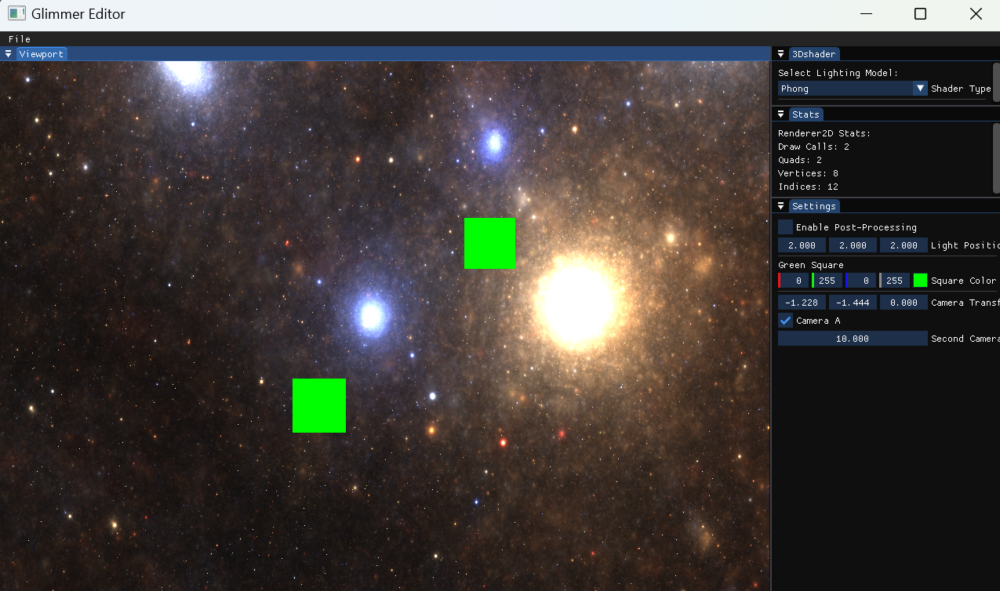

## 代码审查+RenderDoc

为便于后续调试，做出如下改动：

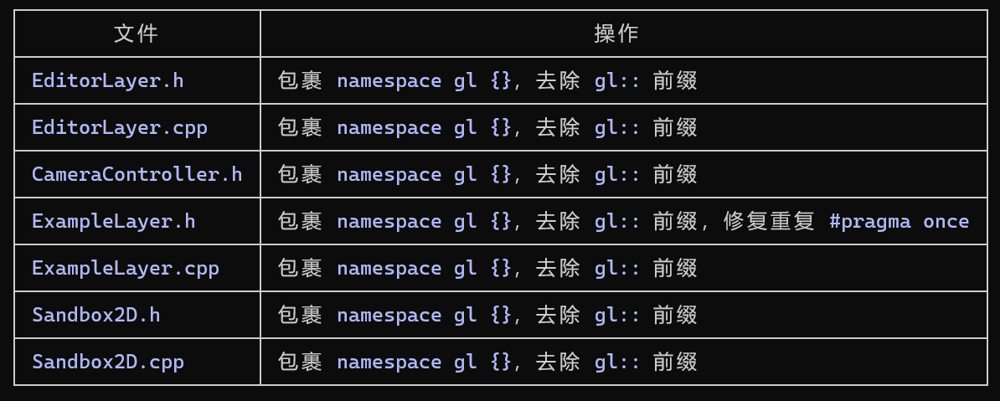


**RenderDoc**

RenderDoc 是调试 3D 渲染的利器——它能拦截所有 OpenGL 指令，让你逐帧、逐像素地拆解渲染过程。在 Glimmer Engine 里加载模型、调 Batch Renderer、排查 Shader 传参问题，基本上都靠它。

**连接与捕获**

打开 RenderDoc，在 Executable Path 填入 Sandbox.exe 的路径。Working Directory 必须设为包含 assets 的目录（一般是工程根目录），不然 Shader 加载会直接失败。点 Launch 运行游戏，到了想分析的那一帧按 F12（或 PrintScreen）捕获。双击捕获到的缩略图，RenderDoc 会还原那一帧的全部显卡状态。

**四个核心面板**

Event Browser 按顺序列出了这一帧里所有的 glClear、glDrawElements 调用。用它来验证 Batch Renderer 是否真的把几千个方块合并成了一个 DrawCall——如果这里 Draw 指令铺满屏幕，说明批处理在某个环节断开了。

Pipeline State 显示当前 DrawCall 发生时显卡的全部配置。Input Assembler 里看 BufferLayout 是否正确、Offset 有没有错位。Rasterizer 里看 Cull Mode——模型转个身就消失，大概率是背面剔除的锅。Blend State 里确认 Alpha 混合是否开启。

Mesh View 是排查"模型不显示"最常用的面板。VS Input 显示 CPU 传给显卡的原始顶点，如果这里是 0，说明 Model.cpp 读文件那一步就挂了。VS Output 显示经过 u_ViewProjection * u_Transform 变换后的坐标。Input 有数据但 Output 全变成 0 或无穷大——矩阵乘法算错了。Output 正常但预览窗没东西——物体在相机裁剪面外面。

Texture Viewer 的 Inputs 标签可以看到当前 DrawCall 绑定的所有纹理。确认 0 号位是不是那张 1x1 白贴图，确认你的贴图是否真的传进了对应的采样器插槽。

**排查"模型黑色或不显示"的思路**

按渲染管线顺序倒着查。先看 Mesh View 的 VS Input，顶点数据是否正确解包上传——如果全是 0，回去查 tinyobjloader 的解析。再看 VS Output，坐标正常说明几何阶段没问题，顶点被拉伸到极远说明 u_ViewProjection 矩阵上传有问题。然后进 Pipeline State：确认 u_Texture 采样器指向了正确的纹理单元，确认 Depth Test 没有因为之前画 2D 背景时忘记清理缓存而导致 3D 模型被错误剔除。

RenderDoc 不光是修 Bug 用的，验证优化假设也很好使。比如调 Batch Renderer 的时候，对比开启和关闭批处理前后的 Draw Call 数量和显存带宽占用，比对着代码瞎猜直观得多。

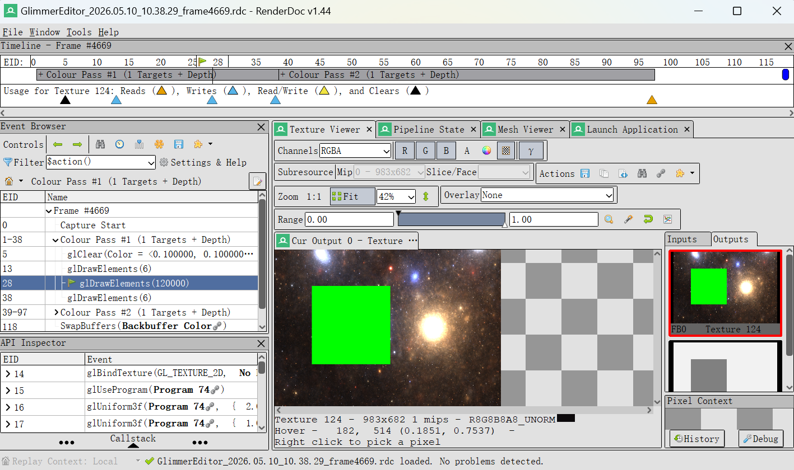

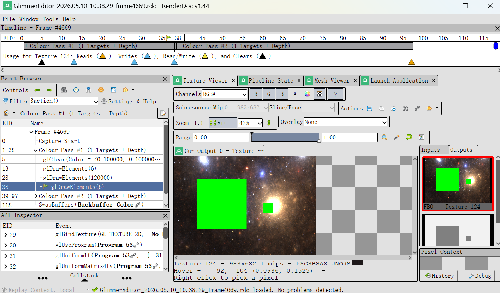

发现了大正方形是120000，一眼我之前写的Renderer2D批处理

```
		static const uint32_t MaxQuads = 20000;
		static const uint32_t MaxVertices = MaxQuads * 4;
		static const uint32_t MaxIndices = MaxQuads * 6;
		static const uint32_t MaxTextureSlots = 32;
```

于是检查Layer源代码发现：由于遮挡关系，部分注释掉了之前的一些资产绘制

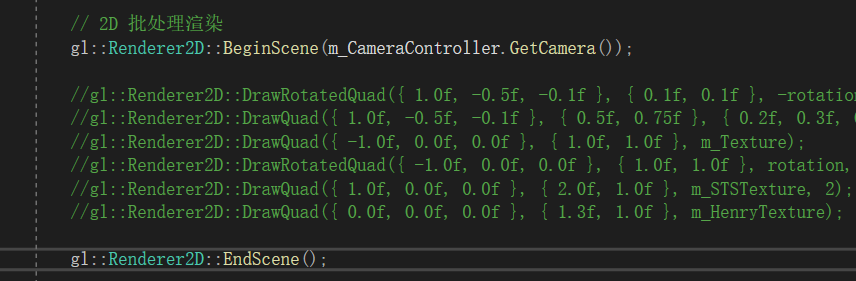

但是一旦使用BeginScene，场景就会进行一次批量提交，结果导致了这次DC

此时任意解除一个Draw的注释或完全注释该块，幽灵方块都会瞬间消失

至此，双绿色方块之谜已告破

**为着色器库添加卸载功能**

```
	void ShaderLibrary::Remove(const std::string& name)
	{
		GL_CORE_ASSERT(Exists(name), "Shader not found for removal!");
		m_Shaders.erase(name);
        // 从 Map 中移除这个 key。
        // 这会使该 Shader 对象的引用计数（Ref Count）减 1。
        // ✨ 这里的魔法在于：
        // 如果没有任何 Layer 或物体还在持有这个 Shader 的 Ref 指针，
        // C++ 会自动调用 Shader 的析构函数 (~OpenGLShader)，
        // 进而触发 glDeleteProgram(m_RendererID)，
        // 从而真正释放了 GPU 显存！
	}
}
```

**如果我 Unload 了某个 Shader，但某个图层还在使用它，会发生什么？程序会崩吗？**
“这就是使用 **std::shared_ptr (Ref)** 的优势所在。

1. **安全性**：调用 ShaderLibrary::Unload 只是切断了库对该资源的引用。如果某个 Layer 内部还存着这个 Shader 的 Ref，那么对象**不会被销毁**，程序依然能正常运行，不会崩溃。
2. **延迟释放**：只有当最后一个持有该资源的人也释放了指针（比如图层被 Detach），资源才会真正从显存中抹除。这实现了一种**‘逻辑上的卸载，物理上的安全释放’**。
   这种设计避免了传统引擎中因手动 delete 导致的‘悬空指针（Dangling Pointer）’和‘野指针访问’问题。”

理解 erase 为什么减小引用计数，得先看清 shared_ptr（引擎里叫 Ref）的工作方式。

**引用计数的增加**

把一个 Shader 存入 unordered_map 时：

```cpp
Ref<Shader> myShader = Shader::Create(...);
// 此时引用计数 = 1，由 myShader 持有

m_Shaders["Texture"] = myShader;
// 发生拷贝赋值，Map 内部也持有一份指向该 Shader 的 Ref
// 引用计数变为 2
```

**引用计数的减少**

执行 m_Shaders.erase("Texture") 时，unordered_map 做了两件事：从哈希表中移除键值对，然后销毁 Value 对象。Value 是 shared_ptr，销毁它时会调 shared_ptr 的析构函数——析构函数的工作就是去控制块里把引用计数减 1。

**两种可能的后续**

如果没有任何其他地方持有这个 Shader 的引用，erase 之后计数从 1 变 0，触发 Shader 对象的 delete，显存释放，资源彻底消失。

如果 ExampleLayer 还在用这个 Shader（手里还攥着一份 Ref），erase 之后计数从 2 变 1。Map 里找不到了，但 Shader 对象还在内存里——直到 ExampleLayer 也销毁、计数变为 0，才真正释放。

这正是用智能指针而不是原始指针的意义：库不知道外部是否还在使用这个资源，如果直接 delete 原始指针，外部拿着野指针下次渲染必崩。erase 只是库放弃了所有权，物理释放什么时候发生取决于所有持有者什么时候释放，逻辑删除和物理释放是分开的。这样做资产管理比手动管理稳得多，不用担心过河拆桥导致的崩溃。

## 透视相机


## 场景层级面板 (Scene Hierarchy Panel)

### 设计目标

在编辑器中实现一个低耦合的层级面板，能列出场景中所有实体、展示其组件类型、支持选中和删除操作。核心设计原则：**面板只依赖引擎公共接口，通过回调与编辑器通信，可独立实例化测试**。

### 架构设计

```
SceneHierarchyPanel (独立类, SceneHierarchyPanel.h/.cpp)
  │
  │ 依赖: Scene, Entity (引擎公共接口)
  │ 不依赖: EditorLayer, Application, 任何具体编辑器逻辑
  │
  ├─ SetContext(Ref<Scene>)     ← 绑定要展示的场景
  ├─ OnImGuiRender()             ← 每帧在 ImGui 中绘制
  ├─ GetSelectedEntity()         ← 获取当前选中的实体
  │
  └─ 回调 (std::function):
      ├─ OnEntitySelected(Entity)  ← 选中变化时通知外部
      └─ OnEntityDeleted(Entity)   ← 删除操作完成时通知外部
```

与编辑器层的通信完全通过回调完成，不使用继承、不持有编辑器引用。这意味着你可以在任何地方（Sandbox、单元测试、独立窗口）实例化该面板，只需给它一个 Scene。

### 实现要点

**实体列表遍历**

利用 Scene 对 `SceneHierarchyPanel` 的 friend 声明，直接访问 `entt::registry` 遍历所有带 `TagComponent` 的实体：

```cpp
m_Context->m_Registry.view<entt::entity>().each([&](entt::entity handle) {
    Entity entity{ handle, m_Context.get() };
    if (entity.HasComponent<TagComponent>()) {
        DrawEntityNode(entity, idCounter);
    }
});
```

**组件徽章系统**

每个实体节点后附加其拥有的组件缩写，一目了然：

```
Entity Node Label + [Cam] [Spr] [Scr]
                     │     │     │
                     │     │     └─ NativeScriptComponent
                     │     └─ SpriteRendererComponent
                     └─ CameraComponent
```

```cpp
std::string badges;
if (entity.HasComponent<CameraComponent>())          badges += " [Cam]";
if (entity.HasComponent<SpriteRendererComponent>())  badges += " [Spr]";
if (entity.HasComponent<NativeScriptComponent>())    badges += " [Scr]";
```

**ImGui 节点渲染**

使用 `ImGui::TreeNodeEx` 配合 `ImGuiTreeNodeFlags_Leaf` 和 `SpanAvailWidth` 实现实体列表项。选中状态通过 `ImGuiTreeNodeFlags_Selected` 高亮，利用 `ImGui::IsItemClicked()` 检测左键点击：

```cpp
ImGuiTreeNodeFlags flags = ImGuiTreeNodeFlags_Leaf
    | ImGuiTreeNodeFlags_SpanAvailWidth
    | ImGuiTreeNodeFlags_NoTreePushOnOpen;

if (m_SelectionContext == entity)
    flags |= ImGuiTreeNodeFlags_Selected;

ImGui::TreeNodeEx((void*)(uint64_t)(uint32_t)entity, flags, "%s", label.c_str());

if (ImGui::IsItemClicked()) {
    m_SelectionContext = entity;
    if (OnEntitySelected) OnEntitySelected(entity);
}
```

**右键删除 (带确认弹窗)**

右键弹出上下文菜单 → 点击 Delete → 弹出 Modal 确认框 → 确认后删除实体：

```cpp
if (ImGui::BeginPopupContextItem()) {
    if (ImGui::MenuItem("Delete")) {
        m_RightClickedEntity = entity;
        m_ShowDeletePopup = true;    // 下一帧弹出 Modal
    }
    ImGui::EndPopup();
}
```

删除前通过 `OnEntityDeleted` 回调通知外部，如果被删除的实体恰好是当前选中项则清空选中状态，防止悬空引用。

**与旧版 EnTT 的兼容**

项目使用的 EnTT 版本较老，没有 `registry.alive()` 公开方法。原本计划在工具栏显示实体计数（如 `"(5 entities)"`），因 API 不存在而移除。这是引擎开发中常见的依赖版本适配问题——公共 API 在不同版本间可能完全不同。

### 集成测试 (GlimmerEditor-CyouBranch)

在 `EditorLayer::OnAttach` 中创建 5 个测试实体覆盖所有验证场景：

| 实体 | 组件 | 验证目的 |
|------|------|---------|
| Main Camera | Tag + Transform + Camera | [Cam] 徽章 + Primary 相机 + Properties 面板 Camera 参数 |
| Red Square | Tag + Transform + SpriteRenderer(红) | [Spr] 徽章 + 颜色属性编辑 |
| Green Square | Tag + Transform + SpriteRenderer(绿) | ECS 场景渲染可见性 |
| Blue Square | Tag + Transform + SpriteRenderer(蓝) | 多实体选择切换 |
| Logic Controller | Tag + Transform (仅此两项) | 无特殊徽章，验证纯逻辑实体也能正确显示 |

实例化并注册回调：

```cpp
m_HierarchyPanel.SetContext(m_ActiveScene);
m_HierarchyPanel.OnEntitySelected = [&](Entity e) {
    GL_CORE_TRACE("Hierarchy selected: {0}", e.GetComponent<TagComponent>().Tag);
};
m_HierarchyPanel.OnEntityDeleted = [&](Entity e) {
    GL_CORE_TRACE("Hierarchy deleted: {0}", e.GetComponent<TagComponent>().Tag);
};
```

`OnImGuiRender` 中只需一行调用即可渲染面板：

```cpp
m_HierarchyPanel.OnImGuiRender();
```

配合 Properties 面板，通过 `m_HierarchyPanel.GetSelectedEntity()` 获取选中实体，按需展示其 Tag/Transform/SpriteRenderer/Camera 组件属性。这样 Hierarchy 和 Properties 之间没有直接耦合——它们只通过 EditorLayer 持有的选中状态间接通信。

![[README.assets/Pasted image 20260716151430.png]]

## ImGUI自定义风格

```
ImGuiStyle& style = ImGui::GetStyle();
		if (io.ConfigFlags & ImGuiConfigFlags_ViewportsEnable) {
			ImGui::StyleColorsLight();
			style.ScaleAllSizes(1.2f);
			style.WindowPadding = { 16.0f, 16.0f };
			style.FramePadding = { 8.0f, 5.0f };

			style.WindowTitleAlign = { 0.5f, 0.5f };

			style.MouseCursorScale = 0.5f;

			style.WindowRounding = 16.0f;
			style.ChildRounding = 12.0f;
			style.PopupRounding = 16.0f;
			style.FrameRounding = 16.0f;
			style.GrabRounding = 12.0f;

			style.FrameBorderSize = 1;
			style.PopupBorderSize = 1;
		}
```

![[README.assets/Pasted image 20260717133307.png]]

添加字体
```
//io.Fonts->AddFontFromFileTTF("assets/fonts/Montenegrin_Gothic_One/MontenegrinGothicOne-Regular.ttf", 16.0f);
		io.Fonts->AddFontFromFileTTF("assets/fonts/Josefin_Sans/static/JosefinSans-Regular.ttf", 16.0f);
		//io.Fonts->AddFontFromFileTTF("assets/fonts/Caveat/static/Caveat-Regular.ttf", 20.0f);
		//io.Fonts->AddFontFromFileTTF("assets/fonts/Open_Sans/static/OpenSans_SemiCondensed-LightItalic.ttf", 20.0f);
```

![[README.assets/Pasted image 20260717141005.png]]

![[README.assets/Pasted image 20260717141100.png]]


## 场景层级面板完善：内联组件检查器

上一步实现了层级面板的实体列表、选中、删除功能，但组件属性编辑在另一个独立的 Properties 窗口中。参照 Hazel 上游设计，将 `DrawComponents` 方法整合进 `SceneHierarchyPanel`，使层级面板成为一个自包含的实体管理工具——选中实体后直接在面板底部展开组件检查器，无需跳转到其他窗口。

### SceneCamera API 补全

组件检查器需要运行时独立读写每个投影参数，但引擎 `SceneCamera` 的透视/正交近远面参数全为 `private` 且无公开访问器，只能通过 `SetOrthographic(size, near, far)` 一次性设置。为此在 `SceneCamera` 中新增 10 个 getter/setter：

```cpp
// 透视参数
float GetPerspectiveVerticalFOV() const;
void SetPerspectiveVerticalFOV(float fov);    // 弧度制，UI 层用 glm::degrees 转换
float GetPerspectiveNearClip() const;
void SetPerspectiveNearClip(float nearClip);
float GetPerspectiveFarClip() const;
void SetPerspectiveFarClip(float farClip);

// 正交参数
float GetOrthographicNearClip() const;
void SetOrthographicNearClip(float nearClip);
float GetOrthographicFarClip() const;
void SetOrthographicFarClip(float farClip);
```

每个 setter 调用后自动触发 `RecalculateProjection()`，确保投影矩阵立即生效。

### DrawComponents 实现

触发时机：`OnImGuiRender` 中，实体列表下方，检测到 `m_SelectionContext` 有效时调用 `DrawComponents(m_SelectionContext)`。

**Tag 组件**

```
Tag: [Main Camera________]  ← ImGui::InputText，实时修改实体名称
```

**Transform 组件**

```
▼ Transform                       ← ImGui::TreeNodeEx，默认展开
  Position  [ -0.00] [  1.00] [  0.00]   ← DragFloat3
  Rotation  [  0.0 ] [  0.0 ] [  0.0 ]
  Scale     [  1.00] [  1.00] [  1.00]   ← 限幅 0.01 ~ 10.0
```

适配本引擎的 `TransformComponent` 结构（`Translation / Rotation / Scale`），而非 tmp 参考代码中的 `Transform` 矩阵形式。

**Camera 组件**

```
▼ Camera                          ← 默认展开
  [✓] Primary
  Projection: [Perspective ▼]     ← ImGui::BeginCombo 下拉切换

  透视模式:
    Vertical FOV: [45.0]°         ← DragFloat (1° ~ 179°)
    Near:  [0.01]
    Far:   [1000.0]

  正交模式:
    Size: [10.0]
    Near: [-1.0]
    Far:  [ 1.0]
    [ ] Fixed Aspect Ratio
```

**SpriteRenderer 组件**

```
▼ Sprite Renderer                 ← 默认展开
  Color: [■] [1.00, 0.20, 0.20, 1.00]  ← ImGui::ColorEdit4
```

## 修复：无贴图 3D 模型全黑 Bug

### 问题现象

在 GlimmerEditor-CyouBranch 中，将 2D 批处理渲染注释掉后，OBJ 模型（bunny / dragon / suzanne 等无贴图模型）渲染结果变为全黑，而非预期的光照着色效果。

### 根因定位

`OpenGLRendererAPI::DrawIndexed` 每次绘制结束后调用 `glBindTexture(GL_TEXTURE_2D, 0)` 从当前活跃纹理单元解绑纹理。此调用不知道哪个 slot 是活跃的——它只解绑最后一条 `glActiveTexture` 指向的 slot。

**2D 批处理启用时**：`Flush` 依次绑定白贴图 → slot 0、balatro.png → slot 1、STS.png → slot 2、henry.jpg → slot 3，最后活跃的是 slot 3。`DrawIndexed` 解绑 slot 3，**slot 0 的白贴图完好无损**。

**2D 批处理注释后**：ECS 场景的 `EndScene → Flush` 仅绑定白贴图到 slot 0，`DrawIndexed` 随后将其解绑。下一帧 3D 模型采样 slot 0 时获取到空纹理，片段着色器中：

```
vec4 texColor = texture(u_Texture, v_TexCoord);  // (0,0,0,0)
vec3 result = (ambient + diffuse + specular) * texColor.rgb;  // = (0,0,0)
```

光照计算结果乘以 0，整个模型变黑。

### 修复方案

在 `EditorLayer::OnAttach` 中创建 1×1 白像素纹理 `m_WhiteTexture`，每次 3D 模型渲染前显式调用 `m_WhiteTexture->Bind(0)`，保障 slot 0 始终有有效的白色纹理，不再依赖 2D 批处理的副作用。


## 场景序列化 (Scene Serialization)

### 设计目标

将编辑器中的场景（Entity + Component 集合）持久化为 YAML 文件，支持随时保存和恢复。选型优先人类可读性，便于调试和手动编辑。

### 依赖引入：yaml-cpp

引擎的 vendor 目录现有库均为 header-only 或小体积静态库。yaml-cpp 需要编译为独立的静态库再链接入 Glimmer。

**目录结构**

```
Glimmer/vendor/yaml-cpp/
├── include/yaml-cpp/     ← 头文件
├── src/                  ← 31 个 .cpp 源文件
└── premake5.lua          ← 静态库编译配置
```

**premake5.lua 关键配置**

```lua
project "yaml-cpp"
    kind "StaticLib"
    language "C++"
    cppdialect "C++17"

    filter "system:windows"
        defines { "YAML_CPP_STATIC_DEFINE" }  -- 强制静态链接模式
```

`YAML_CPP_STATIC_DEFINE` 必须同时在 yaml-cpp 自身和所有链接方（Glimmer）中定义，否则 Windows 下头文件会插入 `__declspec(dllimport)`，导致链接器寻找 DLL 符号而失败。这是最常见的集成坑——默认行为是导出 DLL 符号，但项目选择静态链接。

**根 premake 集成**

```lua
IncludeDir["yaml-cpp"] = "Glimmer/vendor/yaml-cpp/include"
group "Dependencies"
    include "Glimmer/vendor/yaml-cpp"
```

```lua
-- Glimmer/premake5.lua
includedirs { "vendor/yaml-cpp/include" }
links { "yaml-cpp" }
defines { "YAML_CPP_STATIC_DEFINE" }
```

### 序列化架构

```
SceneSerializer (Scene/SceneSerializer.h)
    │
    ├─ Serialize(path)    → 遍历 Registry → YAML::Emitter → 写入 .glimmer 文件
    └─ Deserialize(path)  → YAML::LoadFile → 逐实体创建 → 重建 Registry
```

`SceneSerializer` 持有 `Ref<Scene>`，通过 `Scene` 的 `friend class SceneSerializer` 声明访问私有 `m_Registry`，直接遍历 entt 实体和组件。

### 组件序列化策略

每个组件类型一对静态函数，通过重载 + YAML key 匹配实现类型分发：

```cpp
// 序列化：YAML::Emitter 写入
static void SerializeComponent(YAML::Emitter& out, const TagComponent& comp);
static void SerializeComponent(YAML::Emitter& out, const CameraComponent& comp);
// ...

// 反序列化：YAML::Node 读取
static void DeserializeComponent(const YAML::Node& node, TagComponent& comp);
static void DeserializeComponent(const YAML::Node& node, CameraComponent& comp);
// ...
```

新增组件类型只需加一对函数，无需修改 SceneSerializer 主流程。

### 各组件序列化格式

**TagComponent**

```yaml
TagComponent: "Main Camera"
```

纯字符串，直接 emit / as\<string\>。

**TransformComponent**

```yaml
TransformComponent:
  Translation: [0.0, 0.0, 0.0]
  Rotation: [0.0, 0.0, 0.0]
  Scale: [1.0, 1.0, 1.0]
```

glm::vec3 序列化为 YAML Flow Sequence `[x, y, z]`，通过辅助函数 `SerializeVec3` / `DeserializeVec3` 统一处理。

**SpriteRendererComponent**

```yaml
SpriteRendererComponent:
  Color: [1.0, 0.2, 0.2, 1.0]
```

glm::vec4 同理，`SerializeVec4` / `DeserializeVec4`。

**CameraComponent**

```yaml
CameraComponent:
  Primary: true
  FixedAspectRatio: false
  ProjectionType: 1           # 0=Perspective, 1=Orthographic
  OrthoSize: 10.0
  OrthoNear: -10.0
  OrthoFar: 10.0
  PerspFOV: 0.785398          # 弧度制
  PerspNear: 0.01
  PerspFar: 1000.0
```

所有投影参数独立存储，加载时通过 `SceneCamera` 的 getter/setter 逐个恢复。`ProjectionType` 用 int 值表示枚举。正交和透视的全部参数都写入文件，加载时根据 `ProjectionType` 分别恢复。

**NativeScriptComponent**

暂不序列化。脚本组件持有函数指针（`InstantiateScript` / `DestroyScript`），无法持久化为 YAML。这是 ECS 序列化的经典难点——C++ 原生脚本没有反射信息。未来方案：脚本工厂注册表将类型名映射到函数指针，YAML 只存类型名字符串。

### Scene::Serialize 完整流程

```cpp
void SceneSerializer::Serialize(const std::string& filepath)
{
    YAML::Emitter out;
    out << YAML::BeginMap;
    out << YAML::Key << "Scene" << YAML::Value << "Untitled";
    out << YAML::Key << "Version" << YAML::Value << 2;
    out << YAML::Key << "Entities" << YAML::Value << YAML::BeginSeq;

    // 遍历 registry 中所有实体
    m_Scene->m_Registry.view<entt::entity>().each([&](entt::entity handle) {
        Entity entity{ handle, m_Scene.get() };
        if (!entity.HasComponent<TagComponent>()) return;  // 跳过无效实体

        out << YAML::BeginMap;
        out << YAML::Key << "Entity" << YAML::Value
            << static_cast<uint64_t>(entity.GetUUID());
        out << YAML::Key << "Components" << YAML::Value << YAML::BeginMap;

        // 逐组件分发序列化
        if (entity.HasComponent<TagComponent>())
            SerializeComponent(out, entity.GetComponent<TagComponent>());
        if (entity.HasComponent<TransformComponent>())
            SerializeComponent(out, entity.GetComponent<TransformComponent>());
        if (entity.HasComponent<SpriteRendererComponent>())
            SerializeComponent(out, entity.GetComponent<SpriteRendererComponent>());
        if (entity.HasComponent<CameraComponent>())
            SerializeComponent(out, entity.GetComponent<CameraComponent>());

        out << YAML::EndMap;  // Components
        out << YAML::EndMap;  // Entity
    });

    out << YAML::EndSeq;  // Entities
    out << YAML::EndMap;  // Root

    std::ofstream fout(filepath);
    fout << out.c_str();
}
```

遍历 → 检查 TagComponent（过滤无效实体）→ 逐组件调用对应的 `SerializeComponent` 重载 → 每个实体包裹在 `Entity + Components` 键下 → 写入文件。

### Scene::Deserialize 反序列化

```cpp
bool SceneSerializer::Deserialize(const std::string& filepath)
{
    YAML::Node data = YAML::LoadFile(filepath);
    uint32_t version = data["Version"] ? data["Version"].as<uint32_t>() : 1;

    for (auto entityNode : data["Entities"])
    {
        auto& comps = entityNode["Components"];

        // 1. 先读 TagComponent 获取实体名
        std::string name = comps["TagComponent"].as<std::string>();
        Entity entity;
        if (version >= 2)
            entity = m_Scene->CreateEntityWithUUID(
                UUID(entityNode["Entity"].as<uint64_t>()), name);
        else
            entity = m_Scene->CreateEntity(name);

        // 2. 恢复 Tag（覆盖 CreateEntity 的默认值）
        DeserializeComponent(comps["TagComponent"], entity.GetComponent<TagComponent>());

        // 3. 按需恢复其余组件
        //    Transform 每个实体都有（CreateEntity 自动添加）
        if (comps["TransformComponent"])
            DeserializeComponent(comps["TransformComponent"], entity.GetComponent<TransformComponent>());

        //    SpriteRenderer / Camera 按 key 存在与否决定是否添加
        if (comps["SpriteRendererComponent"]) {
            auto& sc = entity.AddComponent<SpriteRendererComponent>();
            DeserializeComponent(comps["SpriteRendererComponent"], sc);
        }
        if (comps["CameraComponent"]) {
            auto& cc = entity.AddComponent<CameraComponent>();
            DeserializeComponent(comps["CameraComponent"], cc);
        }
    }
    return true;
}
```

注意：`CreateEntity` 已自动添加 `TransformComponent` 和 `TagComponent`，反序列化时是对已有组件赋值而非重新添加。`SpriteRenderer` 和 `Camera` 等可选组件通过 YAML key 存在性检测后 `AddComponent`。

### 编辑器集成

CyoutBranch 的 File 菜单中增加了 New / Save / Open 三项：

```
File → New  (Ctrl+N)  → 创建空白 Scene，刷新层级面板
File → Save (Ctrl+S)  → SceneSerializer::Serialize("assets/scenes/demo.glimmer")
File → Open (Ctrl+O)  → SceneSerializer::Deserialize("assets/scenes/demo.glimmer")
                           加载成功后替换当前场景并刷新层级面板
```

当前使用固定路径 `assets/scenes/demo.glimmer` 作为测试入口，后续可接入 Windows 原生文件对话框（`GetOpenFileName` / `GetSaveFileName`）实现任意路径选择。

### 完整的 .glimmer 文件示例

```yaml
Scene: Untitled
Version: 2
Entities:
  - Entity: 13784169322866849271
    Components:
      TagComponent: Main Camera
      TransformComponent:
        Translation: [0, 0, 0]
        Rotation: [0, 0, 0]
        Scale: [1, 1, 1]
      CameraComponent:
        Primary: true
        FixedAspectRatio: false
        ProjectionType: 1
        OrthoSize: 10.0
        OrthoNear: -10.0
        OrthoFar: 10.0
        PerspFOV: 0.785398
        PerspNear: 0.01
        PerspFar: 1000.0
  - Entity: 8216397519218463350
    Components:
      TagComponent: Green Square
      TransformComponent:
        Translation: [0, 0, 0]
        Rotation: [0, 0, 0]
        Scale: [1, 1, 1]
      SpriteRendererComponent:
        Color: [0.2, 1.0, 0.2, 1.0]
```

### 已知限制

| 限制 | 说明 |
|------|------|
| NativeScript 不可序列化 | 函数指针无法持久化，需要脚本工厂注册表 |
| 运行时 Handle 不保持 | `entt::entity` 仍可能变化；实体身份通过 UUID 稳定恢复 |
| 固定文件路径 | 未接入原生文件对话框，Save/Open 均使用 `assets/scenes/demo.glimmer` |
| 无多场景支持 | 当前仅处理单个 Scene，未来可扩展为 Project 文件（引用多个 Scene） |

可实现单场景的读取
![[README.assets/Pasted image 20260717153228.png]]


## 原生文件对话框 (Windows File Dialog)

### 设计目标

替换场景序列化中的硬编码文件路径，接入 Windows 原生文件对话框，支持用户通过 GUI 浏览和选择文件。

### 架构分层

```
Glimmer/Utils/FileDialog.h                    ← 平台无关接口
    │
    └── Platform/Windows/WindowsFileDialog.cpp ← Windows 实现
            │
            ├── GetOpenFileNameA()   → 打开文件对话框
            ├── GetSaveFileNameA()   → 保存文件对话框
            └── glfwGetWin32Window() → GLFW 窗口 → HWND（模态化父窗口）
```

### 接口设计

```cpp
namespace gl::FileDialog {

    // 返回所选文件路径，取消时返回空字符串
    // filter 格式: "描述1\0*.ext1\0描述2\0*.ext2\0"
    std::string OpenFile(const char* filter);
    std::string SaveFile(const char* filter);

}
```

函数而非类——无状态、无生命周期管理，调用即用完。符合工具函数语义。

### Windows 实现要点

**OPENFILENAME 结构**

```cpp
OPENFILENAMEA ofn = {};
ofn.lStructSize = sizeof(OPENFILENAMEA);
ofn.hwndOwner   = hwnd;                     // 父窗口 HWND，模态化
ofn.lpstrFilter = filter;                   // 双 null 终止的过滤器字符串
ofn.lpstrFile   = filePath;                 // 结果缓冲区
ofn.nMaxFile    = MAX_PATH;                 // 缓冲区大小
ofn.lpstrDefExt = defaultExt;               // 默认扩展名
ofn.Flags = OFN_PATHMUSTEXIST               // 路径必须存在
          | OFN_HIDEREADONLY                 // 隐藏只读复选框
          | OFN_NOCHANGEDIR;                 // 不改变当前工作目录
```

**模态化父窗口**

对话框需要原生 HWND 作为父窗口以保持模态。Glimmer 使用 GLFW，需通过 `glfwGetWin32Window()` 转换：

```cpp
auto* native = static_cast<GLFWwindow*>(Application::Get().GetWindow().GetNativeWindow());
HWND hwnd = glfwGetWin32Window(native);
```

`glfwGetWin32Window` 受 `GLFW_EXPOSE_NATIVE_WIN32` 条件编译保护，必须在 `#include <GLFW/glfw3native.h>` 之前定义。

### 编辑器快捷键集成

菜单快捷键在 DockSpace 架构下不可靠——焦点在子面板时菜单加速器可能不触发。改用 ImGui 全局快捷键：

```cpp
// OnImGuiRender 顶部，独立于任何窗口焦点
if (ImGui::IsKeyChordPressed(ImGuiKey_S | ImGuiMod_Ctrl)) {
    // Save...
}
if (ImGui::IsKeyChordPressed(ImGuiKey_O | ImGuiMod_Ctrl)) {
    // Open...
}
```

**焦点分流**：编辑文本（如 Tag InputText）时 `WantCaptureKeyboard` 阻止相机移动：

```cpp
void EditorLayer::OnEvent(Event& event) {
    if (event.IsInCategory(EventCategoryKeyboard)) {
        if (ImGui::GetIO().WantCaptureKeyboard) return;  // ImGui 占用键盘
    }
    if (event.IsInCategory(EventCategoryMouse)) {
        if (!m_ViewportHovered) return;                   // 鼠标在 UI 面板上
    }
    m_CameraController.OnEvent(event);
}
```

这样在层级面板编辑 Tag 名称时，Ctrl+S 触发保存而非相机移动。点击属性拖拽条时滚轮调整值而非缩放视口。

### 调用示例

```cpp
// 保存
std::string path = FileDialog::SaveFile(
    "Glimmer Scene (*.glimmer)\0*.glimmer\0All Files (*.*)\0*.*\0");
if (!path.empty()) {
    SceneSerializer serializer(m_ActiveScene);
    serializer.Serialize(path);
}

// 打开
std::string path = FileDialog::OpenFile(
    "Glimmer Scene (*.glimmer)\0*.glimmer\0All Files (*.*)\0*.*\0");
if (!path.empty()) {
    SceneSerializer serializer(newScene);
    serializer.Deserialize(path);
}
```

![[README.assets/Pasted image 20260717163457.png]]


## 视口 Gizmos (ImGuizmo 集成)

### 设计目标

在场景视口中实现变换手柄，选中实体后可直接拖拽平移、旋转、缩放。操作方式与 Unity 一致：快捷键切换模式，Ctrl 吸附，手柄跟随实体位置。

### 依赖引入：ImGuizmo

ImGuizmo 是 Dear ImGui 的即时模式 Gizmo 库，通过 `ImGuizmo::Manipulate()` 在视口内绘制变换手柄并处理鼠标交互。

```
Glimmer/vendor/ImGuizmo/        ← git submodule
  ├── src/ImGuizmo.cpp/.h       ← 核心：Manipulate / DecomposeMatrixToComponents
  ├── src/ImCurveEdit.cpp       ← 可选模块
  └── premake5.lua
```

**premake 集成**

```lua
-- 根 premake5.lua
IncludeDir["ImGuizmo"] = "Glimmer/vendor/ImGuizmo/src"
include "Glimmer/vendor/ImGuizmo"

-- Glimmer 链接
includedirs { "vendor/ImGuizmo/src" }
links { "ImGuizmo" }
```

### 帧初始化：BeginFrame

ImGuizmo 必须在每帧 `ImGui::NewFrame()` 之后调用 `BeginFrame()` 初始化内部状态，否则手柄完全不渲染。这是排查"看不见 Gizmo"的第一个检查点。

```cpp
// ImGuiLayer::Begin()
ImGui::NewFrame();
ImGuizmo::BeginFrame();     // ← 必须！重置内部矩阵状态
ImGuizmo::Enable(true);     // 显式启用
```

### 渲染流程

Gizmo 绘制发生在 Viewport 窗口中，位于 `ImGui::Image()`（场景画面）之后，通过 `ImGui::GetWindowDrawList()` 在同一个 ImGui 窗口内叠加绘制：

```
Viewport 窗口
  ├─ ImGui::Image(sceneTexture)     ← 底层：渲染的场景画面
  └─ ImGuizmo::Manipulate(...)      ← 上层：变换手柄叠加
```

**完整调用链**

```cpp
// 1. 设置投影类型
ImGuizmo::SetOrthographic(false);  // 透视投影

// 2. 绑定当前窗口的 ImDrawList
ImGuizmo::SetDrawlist(ImGui::GetWindowDrawList());

// 3. 定义 Gizmo 操作区域（视口矩形）
ImGuizmo::SetRect(bounds.x, bounds.y, width, height);

// 4. 调用 Manipulate 绘制手柄并处理交互
ImGuizmo::Manipulate(view, proj, operation, mode, &matrix, delta, snap);
```

### 相机矩阵选取

场景中存在两套独立的相机：

| 相机 | 用途 | 控制 |
|------|------|------|
| `m_CameraController` (OrthographicCamera) | 编辑器自由视角（WASD） | 保留但当前未用于渲染 |
| ECS "Main Camera" 实体 (SceneCamera) | 场景实体渲染 | 唯一渲染相机，Gizmo 使用它 |

Gizmo 必须使用 ECS 主相机的 view/projection 矩阵，因为它与实际渲染的实体处在同一坐标系：

```cpp
Entity camEntity = m_ActiveScene->GetPrimaryCameraEntity();
auto& ct = camEntity.GetComponent<TransformComponent>();
auto& cc = camEntity.GetComponent<CameraComponent>();
glm::mat4 view = glm::inverse(ct.GetTransform());   // 实体变换矩阵求逆
glm::mat4 proj = cc.Camera.GetProjection();          // 透视投影矩阵
```

### 操作模式与快捷键

| 按键 | 模式 | Gizmo 操作 |
|------|------|-----------|
| `1` | Translate | 平移手柄，拖拽箭头移动 |
| `2` | Rotate | 旋转手柄，拖拽圆环旋转 |
| `3` | Scale | 缩放手柄，拖拽方块缩放 |

**Ctrl 吸附**

```cpp
bool snap = Input::IsKeyPressed(GL_KEY_LEFT_CONTROL);
float snapVal = (m_GizmoType == 1) ? 45.0f : 0.5f;  // 旋转45°，移动/缩放0.5
float snapValues[3] = { snapVal, snapVal, snapVal };
ImGuizmo::Manipulate(..., snap ? snapValues : nullptr);
```

按住 Ctrl 拖拽时，平移和缩放以 0.5 单位步进，旋转以 45° 步进。

### 矩阵分解与抖动修复

这是整个集成中最关键的细节。ImGuizmo 的 `Manipulate()` 返回修改后的完整 4x4 矩阵，需要分解回 TransformComponent 的独立 T/R/S 值。

**失败方案 1：GLM 实验性分解**

```cpp
glm::vec3 skew; glm::vec4 persp; glm::quat rot;
glm::decompose(transform, scale, rot, translation, skew, persp);
tc.Rotation = glm::degrees(glm::eulerAngles(rot));
```

问题：需要 `GLM_ENABLE_EXPERIMENTAL`，且四元数 → 欧拉角转换不稳定。

**失败方案 2：自定义 Math::DecomposeTransform**

使用 YXZ 顺序从矩阵提取欧拉角，但 `GetTransform()` 构建矩阵用的是 XYZ 顺序。构建和提取的欧拉顺序不一致，导致拖拽时旋转值发生不可预测的大跳。

**最终方案：ImGuizmo 内置 + Delta 增量 + 四元数构阵**

```cpp
// Components.h — 四元数构阵（根源性修复）
glm::mat4 GetTransform() const
{
    // 欧拉角 → 四元数 → 矩阵：避免万向节锁
    glm::quat q = glm::angleAxis(glm::radians(Rotation.z), glm::vec3(0,0,1))
                * glm::angleAxis(glm::radians(Rotation.y), glm::vec3(0,1,0))
                * glm::angleAxis(glm::radians(Rotation.x), glm::vec3(1,0,0));
    glm::mat4 rotation = glm::toMat4(q);

    return glm::translate(glm::mat4(1.0f), Translation)
         * rotation
         * glm::scale(glm::mat4(1.0f), Scale);
}
```

```cpp
// EditorLayer.cpp — 单次分解 + 增量叠加
ImGuizmo::Manipulate(...);

if (ImGuizmo::IsUsing())
{
    float t[3], r[3], s[3];
    ImGuizmo::DecomposeMatrixToComponents(value_ptr(transform), t, r, s);

    tc.Translation = { t[0], t[1], t[2] };
    tc.Rotation += glm::vec3(r[0], r[1], r[2]) - tc.Rotation;  // delta
    tc.Scale = { s[0], s[1], s[2] };
}
```

三要素配合：

| 要素 | 作用 |
|------|------|
| 四元数构阵 | 欧拉角只存不用，矩阵本身不会退化或万向节锁 |
| 同源分解 | `DecomposeMatrixToComponents` 始终唯一，不再混用不同算法 |
| Delta 叠加 | `+= new - old` 语义上等价于绝对赋值，但形式明确表达"变化量" |

### 常见问题排查

| 现象 | 原因 | 检查点 |
|------|------|--------|
| Gizmo 完全不出现 | 未调用 `BeginFrame()` | `ImGuiLayer::Begin()` 中是否调用 |
| 选中实体后无 Gizmo | 实体无 `TransformComponent` | 层级面板选择后日志确认 |
| 拖拽时物体疯狂旋转 | 矩阵分解不一致 | `GetTransform()` 是否使用四元数 |
| Gizmo 位置偏移 | 相机矩阵不匹配 | 是否使用 `GetPrimaryCameraEntity()` |
| 透视下 Gizmo 消失 | 近平面裁剪 | 实体 Z 是否在 near/far 之间 |
| 指针为 null 崩溃 | `DecomposeMatrixToComponents` 不接受空指针 | 所有三个参数必须提供有效数组 |

最后通过Gizmos手搓正方体
![[README.assets/Pasted image 20260720104837.png]]


## EditorCamera 编辑器自由相机

### 设计动机

之前编辑器使用两套独立相机混合作业：

| 相机 | 角色 | 问题 |
|------|------|------|
| `m_CameraController` (OrthographicCamera) | WASD 平移、滚轮缩放 | 仅控制正交相机，不影响实际渲染 |
| ECS "Main Camera" 实体 (SceneCamera) | 场景实体渲染、Gizmo 投影 | 静止不动，无法交互操作 |

两套 camera 的 view/projection 不一致，导致 Gizmo 位置偏移。且 ECS 相机实体需手动创建/管理，与编辑器操作逻辑无关。

### 设计目标

将相机控制、渲染投影、Gizmo 投影统一为一个独立类，不依赖 ECS 实体系统，作为引擎核心基础组件放在 `Renderer` 目录下。

### 球形坐标模型

```
相机位置 = 焦点 + 球面偏移

       m_Position = m_FocalPoint
                  + (orientation * (0,0,1)) * m_Distance

       其中 orientation = rotateY(yaw) * rotateX(pitch)
```

```
              m_Position (球面上)
                 ╲
                  ╲ m_Distance
                   ╲
                    ● m_FocalPoint (旋转中心)
```

三个自由度：
- **m_Distance** — 相机到焦点的距离（滚轮 Dolly）
- **m_Yaw** — 水平旋转角（右键左右拖拽）
- **m_Pitch** — 垂直俯仰角（右键上下拖拽，限制 -89°~89° 防止翻转）

### 核心接口

```cpp
class EditorCamera {
public:
    EditorCamera(float fov, float aspectRatio, float nearClip, float farClip);

    void OnUpdate(Timestep ts);       // 每帧检查鼠标按键状态
    void OnEvent(Event& e);           // 滚轮事件

    const glm::mat4& GetViewMatrix() const;       // 给 Gizmo / 渲染
    const glm::mat4& GetProjectionMatrix() const;

    void SetViewportSize(float w, float h);       // 窗口 resize 时更新比例
};
```

### 操作映射

| 操作 | 方法 | 实现 |
|------|------|------|
| **右键拖拽** | Orbit 旋转 | `delta = (mouse - m_InitialRightMouse) * speed`，累加 yaw/pitch → `UpdateView()` |
| **中键拖拽** | Pan 平移 | `delta = (mouse - m_InitialMiddleMouse) * speed * distance`，移动焦点 → `UpdateView()` |
| **滚轮** | Dolly 缩放 | `m_Distance -= offset * distance * 0.1`，clamp(0.5, 500) → `UpdateView()` |

每次操作后调用 `UpdateView()`：
```cpp
void EditorCamera::UpdateView()
{
    m_Position = CalculatePosition();                    // 球坐标 → 世界位置
    m_ViewMatrix = glm::lookAt(m_Position, m_FocalPoint, GetUpDirection());
}
```

### 中键追踪踩踏修复

初版中右键和中键共用一个 `m_InitialMousePosition`。当右键未按下时，`else` 分支每帧重置该变量。中键按下后计算 delta 时，起点已被右键 `else` 覆盖为当前帧位置，delta 始终为零。

修复：拆分为 `m_InitialRightMouse` 和 `m_InitialMiddleMouse`，各自独立追踪。这种两个操作共享同一状态变量导致的交互干扰是输入系统中常见的踩踏 Bug。

### 编辑器集成

```cpp
// EditorLayer — 单一相机，统一驱动

// OnUpdate: 更新相机状态
m_EditorCamera.OnUpdate(ts);

// 场景渲染：直接用 EditorCamera 的 VP
glm::mat4 vp = m_EditorCamera.GetProjectionMatrix() * m_EditorCamera.GetViewMatrix();
m_ActiveScene->OnUpdateEditor(ts, vp);  // 新增的重载，接受外部 VP

// Gizmo：直接用 EditorCamera 的 view/projection
const glm::mat4& view = m_EditorCamera.GetViewMatrix();
const glm::mat4& proj = m_EditorCamera.GetProjectionMatrix();
ImGuizmo::Manipulate(value_ptr(view), value_ptr(proj), ...);
```

ECS 相机实体不再需要——`Scene::OnUpdateEditor` 直接接收外部 VP 矩阵渲染所有 Sprite，绕过了场景内主相机搜索。

### 文件位置

```
Glimmer/src/Glimmer/Renderer/
  ├── Camera.h              ← 抽象基类
  ├── OrthographicCamera.h  ← 正交相机
  ├── EditorCamera.h/cpp    ← 编辑器自由相机（新增）
  ├── Renderer.h
  └── Renderer2D.h
```

作为引擎核心组件与 `Camera`、`Renderer` 同级，任何应用（Sandbox、GlimmerEditor、CyoutBranch）都可以直接使用。

![[README.assets/Pasted image 20260720114008.png]]


## Framebuffer 重构：多附件与优化

### 重构前的问题

| 问题 | 详情 |
|------|------|
| 单颜色附件 | 硬编码 1 个 `GL_RGBA8` 颜色附件，无法支持 MRT（多渲染目标） |
| Resize 暴力重建 | `Resize()` = `glDeleteTextures` × 2 + `Invalidate()`，每次 resize 都销毁 GPU 资源再创建 |
| MSAA 无效 | `Samples` 字段存在但 `Invalidate()` 中无任何多重采样逻辑 |
| 纹理格式硬编码 | 颜色附件固定 `GL_RGBA8`，深度固定 `GL_DEPTH24_STENCIL8`，无法选择 HDR / 整数格式 |
| 深度不可读 | 深度附件绑定后完全无法对外暴露，调试或后处理无法使用深度信息 |
| 仅 OpenGL | `FramebufferSpecification` 中 `SwapChainTarget` 字段预留但未实现 |

### 新接口设计

**纹理格式枚举**

```cpp
enum class FramebufferTextureFormat {
    None = 0,
    RGBA8,              // 标准 8-bit 颜色
    RED_INTEGER,        // 实体 ID 拾取（整数像素）
    RGBA16F,            // HDR 半精度浮点
    Depth24Stencil8,    // 深度/模板
};
```

**附件规格**

```cpp
struct FramebufferAttachmentSpecification {
    FramebufferTextureFormat Format = FramebufferTextureFormat::RGBA8;
};

struct FramebufferSpecification {
    uint32_t Width = 1280, Height = 720;
    std::vector<FramebufferAttachmentSpecification> Attachments;  // 任意数量
    uint32_t Samples = 1;         // MSAA 采样数（1=关闭）
    bool SwapChainTarget = false;

    FramebufferSpecification() = default;
    FramebufferSpecification(uint32_t w, uint32_t h) : Width(w), Height(h) {}
};
```

**Framebuffer 抽象接口**

```cpp
class Framebuffer {
public:
    virtual void Bind() = 0;
    virtual void Unbind() = 0;
    virtual void Resize(uint32_t width, uint32_t height) = 0;

    virtual uint32_t GetColorAttachmentRendererID(uint32_t index = 0) const = 0;
    virtual uint32_t GetDepthAttachmentRendererID() const = 0;          // 新增

    virtual const FramebufferSpecification& GetSpecification() const = 0;

    static Ref<Framebuffer> Create(const FramebufferSpecification& spec);
};
```

### 向后兼容

旧代码无需任何改动，规约中未指定 `Attachments` 时自动补默认值：

```cpp
// 旧用法——完全兼容
FramebufferSpecification fbSpec;
fbSpec.Width  = 1280;
fbSpec.Height = 720;
auto fb = Framebuffer::Create(fbSpec);
// 自动等价于: Attachments = { { RGBA8 } } + 默认 Depth24Stencil8
```

### Resize 优化

之前 `Resize()` 先 `glDeleteTextures` 销毁旧纹理再 `Invalidate()` 重新创建。频繁拖拽视口边缘时，每帧都有 GPU 资源的分配/销毁开销。

```cpp
// 重构后：ResizeAttachments() 原地更新
void OpenGLFramebuffer::ResizeAttachments()
{
    for (auto& att : m_ColorAttachments) {
        glBindTexture(GL_TEXTURE_2D, att.RendererID);
        glTexImage2D(GL_TEXTURE_2D, 0, InternalFormat, w, h, 0, ...);
        // 纹理 ID 不变，ImGui::Image 引用不失效
    }
    // 深度附件：texStorage 不可原地更新，需重建（但仅此一个）
}
```

颜色附件使用 `glTexImage2D` 原地重新分配存储（纹理 ID 不变），ImGui 引用的 `uintptr_t` 全程有效。仅深度附件因使用不可变存储 `glTexStorage2D` 仍需重建，但这是 GL 限制而非设计缺陷。

### 多附件支持

**GL 层面的关键步骤**

多附件 FBO 必须显式设置 `glDrawBuffers`，OpenGL 默认只向 `GL_COLOR_ATTACHMENT0` 写入片段：

```cpp
// Invalidate() 末尾
std::vector<GLenum> drawBuffers;
for (size_t i = 0; i < m_ColorAttachments.size(); i++)
    if (!IsDepthFormat(m_ColorAttachments[i].Format))
        drawBuffers.push_back(GL_COLOR_ATTACHMENT0 + i);
glNamedFramebufferDrawBuffers(m_RendererID, drawBuffers.size(), drawBuffers.data());
```

**使用示例**

```cpp
// 颜色 + 实体 ID 拾取
FramebufferSpecification pickSpec(1280, 720);
pickSpec.Attachments = {
    { FramebufferTextureFormat::RGBA8 },
    { FramebufferTextureFormat::RED_INTEGER }
};
auto pickFB = Framebuffer::Create(pickSpec);

// Shader 端
layout(location = 0) out vec4 color;      // → 附件 0
layout(location = 1) out int  entityID;   // → 附件 1
```

**缺少 `glDrawBuffers` 的排查**

这是实现多附件时最常见的踩坑点。如果 Fragment Shader 有 `layout(location = 1)` 输出但对应附件没有数据显示：
1. 检查 FBO 是否有对应附件绑定
2. 检查 `glDrawBuffers` 是否包含了 `GL_COLOR_ATTACHMENT1`
3. 检查 FBO 完整性状态 `glCheckFramebufferStatus`

### MSAA 支持

当 `Samples > 1` 时，颜色附件使用 `glRenderbufferStorageMultisample` 创建多重采样渲染缓冲，解析到纹理需要在另一个 FBO 上 `glBlitFramebuffer`（当前框架已预留结构，后续可补解析逻辑）。

### 纹理参数规范

| 附件类型 | Min/Mag 过滤 | Wrap |
|---------|-------------|------|
| 颜色 (RGBA8, RGBA16F) | LINEAR | CLAMP_TO_EDGE |
| 整数 (RED_INTEGER) | NEAREST | CLAMP_TO_EDGE |
| 深度 (Depth24Stencil8) | NEAREST | CLAMP_TO_EDGE |

### 文件结构

```
Glimmer/src/Glimmer/Renderer/
  └── FrameBuffer.h          ← 抽象接口 + 规格定义
      │
      └── Platform/OpenGL/
           └── OpenGLFramebuffer.h/cpp  ← OpenGL 实现
```

`FrameBuffer.h` 中定义了全部平台无关的枚举、规格 struct 和抽象接口。`OpenGLFramebuffer` 实现所有 GL 逻辑，包括格式映射层、DrawBuffers 管理、Resize 优化。

Debug验证
![[README.assets/Pasted image 20260720133559.png]]


## 鼠标拾取 (Mouse Picking)

### 设计目标

点击视口中的实体即选中，点击空白取消选中——对齐 Unity/Unreal/Blender 的通用交互模式。基于 GPU 的像素级拾取，不依赖射线检测。

### 原理

利用 FBO 多附件（上一步重构的成果），在正常渲染的同时向第二个附件写入每个实体的唯一 ID：

```
渲染阶段：
  附件 0 (RGBA8)     ← 正常颜色输出（显示用）
  附件 1 (RED_INTEGER) ← 实体 ID 输出（拾取用，不可见）

拾取阶段：
  左键点击视口 → 坐标转换 → glReadPixels(附件1) → 得到实体 ID → 选中
```

### 数据流

```
Scene::OnUpdateEditor:
  for each entity:
    Renderer2D::SetEntityID((int)handle)  ← 当前实体 ID
    Renderer2D::DrawQuad(...)              ← 顶点 EntityID 字段 = handle

        ↓ GPU

Texture.glsl (vertex):
  flat out int v_EntityID = a_EntityID;   ← 每个 Quad 四个顶点 ID 相同，flat 插值

Texture.glsl (fragment):
  layout(location = 1) out int entityID;  ← 附件 1 输出
  entityID = v_EntityID;

        ↓ 每帧最后

EditorLayer::OnImGuiRender:
  左键点击且非 Gizmo 操作:
    m_Framebuffer->ReadPixel(1, fbX, fbY)  ← 封装 GL 调用
    m_ActiveScene->GetEntityByID(id)        ← 反向查找
    m_HierarchyPanel.SetSelectedEntity(...)  ← 层级面板联动
```

### 关键改动点

**1. QuadVertex 新增 EntityID 字段**

```cpp
struct QuadVertex {
    glm::vec3 Position;
    glm::vec4 Color;
    glm::vec2 TexCoord;
    float TexIndex;
    float TilingFactor;
    int   EntityID;      // ← 新增
};
```

顶点布局中对应 `{ ShaderDataType::Int, "a_EntityID" }`。

**2. VAO 整数属性修复**

GLSL 中 `in int` 类型的顶点属性必须用 `glVertexAttribIPointer`（注意中间的 `I`），不能用 `glVertexAttribPointer`。后者将整数数据当作浮点解释，导致拾取 ID 错乱：

```cpp
// OpenGLVertexArray::AddVertexBuffer
if (IsIntType(element.Type))
    glVertexAttribIPointer(index, ...);  // ← 整数类型专用
else
    glVertexAttribPointer(index, ...);   // ← 浮点类型
```

这是实现 GPU 拾取时最常见但最隐蔽的坑——shader 语法正确、FBO 配置正确，唯独顶点属性传错了类型。

**3. FBO 拾取附件清理**

`glClear(GL_COLOR_BUFFER_BIT)` 对整数格式附件行为是实现相关的，不可靠。且 `0` 是合法的 entt entity ID（第一个创建的实体），不能作为"无实体"标记值：

```cpp
// 每帧渲染前
m_Framebuffer->ClearAttachment(1, -1);  // glClearBufferiv → 拾取附件 = -1
```

```cpp
// 点击时，-1 = 无实体 → 取消选中
int id = m_Framebuffer->ReadPixel(1, fbX, fbY);
if (id >= 0)
    m_HierarchyPanel.SetSelectedEntity(m_ActiveScene->GetEntityByID((uint32_t)id));
else
    m_HierarchyPanel.SetSelectedEntity({});  // 点击空白取消选中
```

**4. Scene::GetEntityByID — 反向查找**

```cpp
Entity Scene::GetEntityByID(uint32_t id) {
    entt::entity handle = (entt::entity)id;
    if (m_Registry.valid(handle))       // entt 校验实体存在
        return Entity{ handle, this };
    return {};
}
```

封装了 `entt::entity` 的内部表示，EditorLayer 不直接操作 entt 类型。

**5. Framebuffer::ReadPixel — GL 调用封装**

```cpp
int OpenGLFramebuffer::ReadPixel(uint32_t attachmentIndex, int x, int y) const {
    int pixel = -1;
    glBindFramebuffer(GL_READ_FRAMEBUFFER, m_RendererID);
    glReadBuffer(GL_COLOR_ATTACHMENT0 + attachmentIndex);
    glReadPixels(x, y, 1, 1, GL_RED_INTEGER, GL_INT, &pixel);
    return pixel;
}
```

EditorLayer 只调用 `m_Framebuffer->ReadPixel(1, fbX, fbY)`——一行代码，零 GL 裸调用。

### 坐标转换

ImGui 鼠标坐标为屏幕空间（左上角原点），FBO 坐标为纹理空间（左下角原点），需翻转 Y 轴：

```cpp
int fbX = (int)((mx - vpBounds[0].x) / vpWidth  * fboWidth);
int fbY = (int)((1.0f - (my - vpBounds[0].y) / vpHeight) * fboHeight);
```

### 交互行为

| 操作 | 结果 |
|------|------|
| 左键点击实体 | 层级面板选中该实体，Gizmo 显示 |
| 左键点击空白 | 取消选中，Gizmo 隐藏 |
| Gizmo 拖拽中点击 | 不触发拾取（`!ImGuizmo::IsOver()` 保护） |

### 文件改动总览

```
引擎层:
  FrameBuffer.h          ← 新增 ReadPixel / ClearAttachment 接口
  OpenGLFramebuffer.h/cpp ← 实现
  OpenGLVertexArray.cpp   ← 整数属性用 glVertexAttribIPointer
  Renderer2D.h/cpp        ← QuadVertex 加 EntityID + SetEntityID
  Scene.h/cpp             ← GetEntityByID + OnUpdateEditor 传 EntityID

Shader:
  Texture.glsl            ← layout(location=5) in int a_EntityID
                          ← layout(location=1) out int entityID

编辑器:
  EditorLayer.cpp         ← FBO 双附件 + ClearAttachment(-1) + 拾取逻辑
```

利用picking高效制作cube
![[README.assets/Pasted image 20260720151128.png]]


## 着色器系统优化：Uniform 缓存与 UBO

### 重构前的问题

**1. 每帧每次 Uniform 上传都做 `glGetUniformLocation`**

```cpp
void OpenGLShader::UploadUniformMat4(const std::string& name, const glm::mat4& matrix) {
    GLint location = glGetUniformLocation(m_RendererID, name.c_str()); // ← 每次！
    glUniformMatrix4fv(location, 1, GL_FALSE, glm::value_ptr(matrix));
}
```

每个 `BeginScene` 调用都重新查 `u_ViewProjection` 和 `u_Time` 的 location。`glGetUniformLocation` 涉及 GL 驱动的字符串哈希和遍历，虽然单次开销极小但逐帧累积无意义——shader 链接后 location 不变。

**2. 每个 Shader 独立上传 Camera 数据**

Renderer2D 的三个 `BeginScene` 重载各自调用 `UploadUniformMat4 + UploadUniformFloat`。后续若新增 shader，每个都需要重复上传相同的 camera VP 和时间。

**3. 批处理重置代码重复**

`QuadIndexCount / QuadVertexBufferPtr / TextureSlotIndex` 初始化在 4 处硬编码复制。

### Uniform Location 缓存

**原理**：`glGetUniformLocation` 在 Shader 链接后结果恒定。首次调用存入 `unordered_map`，后续 O(1) 查表。

```cpp
// OpenGLShader 新增
mutable std::unordered_map<std::string, GLint> m_UniformCache;

GLint OpenGLShader::GetUniformLocation(const std::string& name) const
{
    auto it = m_UniformCache.find(name);
    if (it != m_UniformCache.end())
        return it->second;                           // 命中：O(1)

    GLint loc = glGetUniformLocation(m_RendererID, name.c_str());  // 未命中：一次 GL
    m_UniformCache[name] = loc;
    return loc;
}
```

所有 8 个 `UploadUniform*` 方法中的 `glGetUniformLocation` 替换为 `GetUniformLocation`。

`m_UniformCache` 声明为 `mutable`：即使通过 `const Bind()` 调用也能写缓存（逻辑上缓存不影响 Shader 对象的"语义常量性"）。

### Uniform Buffer Object (UBO)

**动机**：Camera 数据（VP 矩阵 + 时间）是全局共享的——所有 Shader 都需要但不是每个 Shader 独有的。传统 uniform 上传需要每个 Shader 绑定后逐一 `UploadUniformMat4`，UBO 将其改为一次写入、所有 Shader 自动可见。

**UniformBuffer 抽象**

```
Renderer/UniformBuffer.h          ← 平台无关接口
Platform/OpenGL/OpenGLUniformBuffer.h/cpp ← GL 实现
```

```cpp
class UniformBuffer {
public:
    virtual void Bind() const = 0;
    virtual void Unbind() const = 0;
    virtual void SetData(const void* data, uint32_t size, uint32_t offset = 0) = 0;

    static Ref<UniformBuffer> Create(uint32_t size, uint32_t binding);
};
```

**GL 实现**：`glCreateBuffers` + `glNamedBufferData`（DSA 分配）+ `glBindBufferBase`（绑定到 binding point）+ `glNamedBufferSubData`（增量更新）。

**Renderer2D 中的 CameraData**

```cpp
struct CameraData {
    glm::mat4 ViewProjection;  // offset 0,  size 64
    float     Time;            // offset 64, size 4
    float     _pad[3];         // offset 68, size 12（std140 对齐到 16B 边界）
};
static_assert(sizeof(CameraData) == 80, "std140");

Ref<UniformBuffer> CameraUniformBuffer;  // Init 时创建，binding point 0
CameraData CameraBuffer;                 // 每帧更新
```

**std140 布局规则**：`mat4` 在 UBO 中被当作 4 个 `vec4`（每行 16 字节对齐），`float` 后需 padding 到下一个 `vec4` 边界。`static_assert` 在编译期验证结构体大小，防止对齐错误。

**数据流变化**

```
之前:
  BeginScene → Bind(TextureShader) → UploadUniformMat4("u_ViewProjection", vp) → UploadUniformFloat("u_Time", t)
  问题：每次绑 Shader 都重新上传，多个 Shader 需重复

之后:
  s_Data.CameraBuffer.ViewProjection = vp;
  s_Data.CameraBuffer.Time = GetTime();
  s_Data.CameraUniformBuffer->SetData(&s_Data.CameraBuffer, 80);  // 一次 glBufferSubData
  Bind(TextureShader)  // Shader 通过 layout(std140, binding=0) 自动读取
  效果：所有 Shader 共享，只传一次
```

**Shader 端适配**

```glsl
#version 330 core
#extension GL_ARB_shading_language_420pack : enable  // binding 需要 420 或此扩展

layout(std140, binding = 0) uniform CameraBlock {
    mat4  u_ViewProjection;  // 变量名不变
    float u_Time;
};
// Shader 主体代码一行未改——uniform 名相同，访问方式不变
```

`binding = 0` 对应 C++ 端 `UniformBuffer::Create(size, 0)` 的第二个参数。`std140` 保证 CPU/GPU 内存布局一致。

### StartBatch 重构

消除 `BeginScene × 3 + FlushAndReset` 中的重复批处理重置：

```cpp
void Renderer2D::StartBatch()
{
    s_Data.QuadIndexCount = 0;
    s_Data.QuadVertexBufferPtr = s_Data.QuadVertexBufferBase;
    s_Data.TextureSlotIndex = 1;
}
```

### 文件清单

```
新增:
  Renderer/UniformBuffer.h/cpp         ← 抽象 + 工厂
  Platform/OpenGL/OpenGLUniformBuffer.h/cpp ← GL 实现

修改:
  Platform/OpenGL/OpenGLShader.h/cpp   ← Uniform 缓存
  Renderer/Renderer2D.h/cpp            ← CameraUBO + StartBatch
  assets/shaders/Texture.glsl          ← layout(std140, binding=0)
```


## Vulkan / SPIR-V 接口预埋

### 背景

Vulkan 后端实现是长期目标。当前 OpenGL 渲染层通过抽象接口隔离，切换后端只需实现一套 `Platform/Vulkan/` 类并在工厂中注册。在动手实现之前，先把接口层的缺口补上，避免后续重构时全项目联动修改。

### 已完成的预埋

**1. 后端枚举**

```cpp
// RendererAPI.h
enum class API { None = 0, OpenGL = 1, Vulkan = 2 };
inline static void SetAPI(API api) { s_API = api; }  // 运行时切换
```

**2. 所有工厂占位 Vulkan 分支**

```cpp
// FrameBuffer.cpp / UniformBuffer.cpp / Shader.cpp
case RendererAPI::API::Vulkan:
    GL_CORE_ASSERT(false, "Vulkan backend not yet implemented!");
    return nullptr;
```

编译通过，运行时若误切到 Vulkan 会明确断言提示。后续实现 `Platform/Vulkan/OpenGLFramebuffer.cpp` 等文件后，替换这些 `case` 为 `CreateRef<VulkanFramebuffer>(spec)` 即可。

**3. SPIR-V Shader 加载入口**

```cpp
// Shader.h — 接受 SPIR-V 二进制的工厂方法
static Ref<Shader> CreateFromBinary(
    const std::string& name,
    const std::vector<uint32_t>& vertSPV,
    const std::vector<uint32_t>& fragSPV);
```

OpenGL 实现直接断言不支持——因为 GL 端计划保持 GLSL 源码编译模式。Vulkan 实现中此方法调用 `vkCreateShaderModule` + `vkCreateGraphicsPipeline`。

**4. premake 双路径 Vulkan 包含**

```lua
-- 优先 Vulkan SDK 系统安装，回退 git submodule
local vulkanSDK = os.getenv("VULKAN_SDK")
if vulkanSDK then
    IncludeDir["VulkanSDK"] = vulkanSDK .. "/Include"   -- vulkan.h
    libdirs { vulkanSDK .. "/Lib" }                     -- vulkan-1.lib
else
    IncludeDir["Vulkan-Headers"] = "Glimmer/vendor/Vulkan-Headers/include"
end
```

**5. git submodule 依赖**

| 子模块 | 用途 | 编译方式 |
|--------|------|---------|
| `Vulkan-Headers` | `vulkan.h` + 平台扩展头 | 纯头文件，无编译 |
| `SPIRV-Cross` | SPIR-V 反射/反编译（Shader 调试、Pipeline 自动生成） | StaticLib |

SPIRV-Cross 的 premake 配置排除了 `main.cpp`（CLI 工具），定义 `SPIRV_CROSS_STATIC` 强制静态链接规避 Windows DLL 符号导入。

### SPIR-V 在当前阶段不启用

OpenGL 后端通过 `GL_ARB_gl_spirv` 扩展可以加载 SPIR-V 二进制，但收益微乎其微——15 个 shader 总编译时间 < 50ms，引入 glslc 离线编译步骤反而增加构建复杂度和调试成本。SPIR-V 启用时机对齐 Vulkan 后端实现，届时 GL 保持 GLSL 源码模式不变。

### 后续 Vulkan 实现路径

```
P0: VulkanContext    ← Instance / Device / Surface / SwapChain
P1: ShaderModule     ← SPIR-V 加载 (vkCreateShaderModule)
    Pipeline         ← PSO (vkCreateGraphicsPipeline)
    RenderPass       ← 附件描述
P2: CommandBuffer    ← 录制模式替代即时 GL 调用
    DescriptorSet    ← 替代当前 uniform 上传
P3: Buffer/Texture   ← VkBuffer/VkImage 适配
P4: Renderer2D       ← 应用层适配新渲染流程
```

所有接口已预埋——`RendererAPI::Vulkan` 枚举 + `SetAPI` + 工厂 `case Vulkan` + `CreateFromBinary` + premake 包含路径。实际 Vulkan 后端实现时只需在 `Platform/Vulkan/` 下新增对应类文件。


## 内容浏览器 (Content Browser Panel)

### 设计目标

在编辑器内提供文件系统浏览能力，支持导航 assets 目录、按类型区分文件图标、双击加载场景、拖拽 `.glimmer` 到视口即打开。

### 架构

```
Panels/ContentBrowserPanel.h/cpp  ← 应用层面板，低耦合

依赖：
  std::filesystem       ← C++17 文件系统遍历
  ImGui                 ← UI 渲染
  OnFileDoubleClicked   ← 回调通知 EditorLayer
```

和 `SceneHierarchyPanel` 一样放在 `Panels/` 目录下——属于编辑器上层建筑而非引擎核心。

### 启动优化：延迟初始化

初版在构造函数中调用 `std::filesystem::absolute()` + `directory_iterator` 遍历整个 assets 目录并缓存。这导致 EditorLayer 构造时同步触发磁盘 I/O，出现可感知的启动卡顿。

```cpp
// 之前：构造函数中同步 I/O
ContentBrowserPanel() {
    m_BaseDir = std::filesystem::absolute("assets");  // 磁盘 I/O
    RefreshFiles();  // directory_iterator 遍历
}

// 之后：延迟到首个 OnImGuiRender
ContentBrowserPanel() = default;

void OnImGuiRender() {
    LazyInit(m_BaseDir, m_CurrentDir);  // 仅首次执行路径解析
    // 文件遍历改为每帧即时 directory_iterator（无预缓存）
}
```

移除了 `m_Files` 缓存 vector，改为每帧即时遍历——assets 下不到 50 个文件，OS 文件系统缓存使遍历几乎零开销。

### Font Awesome 图标集成

**字体加载（ImGuiLayer::OnAttach）**

```cpp
// 合并模式：在已有字体上附加图标 glyph
ImFontConfig faConfig;
faConfig.MergeMode = true;
faConfig.GlyphMinAdvanceX = 16.0f;
static const ImWchar faRanges[] = { 0xf000, 0xf2ff, 0 };
io.Fonts->AddFontFromFileTTF("assets/fonts/FontAwesome/fa-solid-900.otf", 16.0f, &faConfig, faRanges);
```

`MergeMode = true` 是关键——不替换已有字体，而是在同一个字体 atlas 中追加图标 glyph。渲染时可以用同一个 `ImGui::Text()` 同时显示文字和图标。

**图标码点**

```cpp
#define ICON_FA_FOLDER  "\xef\x81\xbb"  // 
#define ICON_FA_CODE    "\xef\x87\x89"  // 
#define ICON_FA_CUBE    "\xef\x86\xb2"  // 
#define ICON_FA_IMAGE   "\xef\x80\xbe"  // 
#define ICON_FA_GLOBE   "\xef\x82\xac"  // 
#define ICON_FA_FILE    "\xef\x85\x9b"  // 
```

| 文件类型 | 图标 | 说明 |
|---------|------|------|
| 文件夹 |  | `std::filesystem::is_directory()` |
| .glsl |  | Shader 着色器 |
| .obj |  | 3D 模型 |
| .png/.jpg |  | 贴图 |
| .glimmer |  | 场景文件 |
| 其他 |  | 通用文件 |

### 文件网格布局

```cpp
float cellSize = 80.0f;
int columns = max(1, (int)(panelWidth / cellSize));
ImGui::Columns(columns);

for (auto& entry : directory_iterator(m_CurrentDir)) {
    ImGui::Selectable(icon + " " + name, &selected, AllowDoubleClick, {80, 80});
    ImGui::NextColumn();
}
ImGui::Columns(1);
```

`ImGui::Columns` 实现自适应列数网格——面板宽时列数多，窄时列数少。

### 目录导航与保护

```cpp
// 回退按钮：仅在非根目录时生效
if (ImGui::Button("  ..") && m_CurrentDir != m_BaseDir)
    m_CurrentDir = m_CurrentDir.parent_path();

// 路径显示：相对于 assets 根目录
auto relative = std::filesystem::relative(m_CurrentDir, m_BaseDir);
ImGui::TextDisabled("assets/%s", relative.string().c_str());
```

`m_BaseDir` 作为不可逾越的根——回退到 `assets/` 之后按钮不再有作用，防止浏览到项目外。

### 目录切换时的迭代器保护

双击文件夹进入时，`m_CurrentDir` 被更新，但当前帧的 `for (auto& entry : directory_iterator(...))` 循环仍在运行。虽然后续迭代不会引发 UB（`directory_iterator` 不依赖外部容器），但提前退出可以避免一帧内既渲染旧目录又准备新目录的状态不一致：

```cpp
if (isDir) {
    m_CurrentDir = path;
    ImGui::PopID();
    ImGui::Columns(1);
    ImGui::End();
    return;  // 提前结束当前帧，下帧渲染新目录
}
```

### 拖拽打开场景

**拖拽源（ContentBrowserPanel）**

```cpp
if (!isDir && ImGui::BeginDragDropSource()) {
    ImGui::SetDragDropPayload("SCENE_FILE", path, size);
    ImGui::Text("Open %s", name);  // 光标跟随提示
    ImGui::EndDragDropSource();
}
```

**拖拽目标（EditorLayer Viewport）**

```cpp
if (ImGui::BeginDragDropTarget()) {
    if (auto* payload = ImGui::AcceptDragDropPayload("SCENE_FILE")) {
        SceneSerializer serializer(newScene);
        serializer.Deserialize(payload->Data);
    }
    ImGui::EndDragDropTarget();
}
```

Drop Target 必须放在 `ImGui::Image()` 之后——ImGui 的拖拽目标区域基于当前 item 位置决定。放在 Image 之前只覆盖标题栏区域，放在之后覆盖整个渲染画面。

### 交互操作总览

| 操作 | 效果 |
|------|------|
| 双击文件夹 | 进入该文件夹 |
| 双击 .glimmer | 加载场景 |
| 拖拽文件到视口 | 加载场景（同双击，操作更直觉） |
| `<` 按钮 | 返回上级目录 |
| 单击文件 | 选中高亮 |

### 文件位置

```
GlimmerEditor-CyouBranch/src/Panels/
  ├── ContentBrowserPanel.h
  ├── ContentBrowserPanel.cpp
  ├── SceneHierarchyPanel.h
  └── SceneHierarchyPanel.cpp
```

### 目录树 + 可拖分隔线

在原来的纯文件网格基础上增加了左侧目录树面板：

```
┌─ Content Browser ───────────────────────────────┐
│   ..   assets/shaders                         │
├────────────┬────────────────────────────────────┤
│ 目录树     │ ←拖→│  文件网格                      │
│   assets  │      │   BalatroVortex               │
│    models │      │   Phong                       │
│    shaders│      │  ...                          │
│    textures     │                              │
└────────────┴──────┴──────────────────────────────┘
```

**目录树实现**

```cpp
void DrawDirectoryTree(const std::filesystem::path& dir)
{
    for (auto& entry : directory_iterator(dir))
    {
        if (!entry.is_directory()) continue;

        ImGuiTreeNodeFlags flags = ImGuiTreeNodeFlags_OpenOnArrow
                                  | ImGuiTreeNodeFlags_SpanAvailWidth;
        if (!hasSubDirs)
            flags |= ImGuiTreeNodeFlags_Leaf;  // 无子目录 → 无箭头

        bool opened = ImGui::TreeNodeEx(name, flags);

        // 单击目录名（非箭头）切换右侧视图
        if (ImGui::IsItemClicked() && !ImGui::IsItemToggledOpen())
            m_CurrentDir = path;

        if (hasSubDirs && opened)
        {
            DrawDirectoryTree(path);  // 递归
            ImGui::TreePop();
        }
    }
}
```

关键设计：
- 不设 `DefaultOpen`——每级初始折叠，只有用户点击箭头才展开，避免一次性展开所有子目录
- `IsItemToggledOpen()` 判断点击的是箭头还是名称：点击箭头 → 展开/折叠，点击名称 → 切换右侧视图
- 递归 `DrawDirectoryTree` 实现任意深度目录树

**可拖动分隔线**

```cpp
// 分隔线按钮（4px 宽）
ImGui::Button("##Splitter", ImVec2(4.0f, -1.0f));

if (ImGui::IsItemHovered())
    ImGui::SetMouseCursor(ImGuiMouseCursor_ResizeEW);  // ↔ 光标

if (ImGui::IsItemActive())
    m_SplitPos += ImGui::GetIO().MouseDelta.x;          // 拖拽调整

m_SplitPos = clamp(m_SplitPos, 120.0f, 500.0f);        // 范围限制
```

分隔线本身是一个 `ImGui::Button`。`IsItemActive()` 在按住拖拽时为 true，`MouseDelta.x` 提供每帧水平位移。累加到 `m_SplitPos` 后 clamp 在 120~500px 区间。

**左右面板布局**

```cpp
ImGui::BeginChild("TreePanel",  ImVec2(m_SplitPos, 0), true);  // 左：固定宽度
// ... 树渲染 ...
ImGui::EndChild();

ImGui::SameLine();
// ... 分隔线 ...
ImGui::SameLine();

ImGui::BeginChild("FilePanel",  ImVec2(0, 0), true);           // 右：填充剩余
// ... 网格渲染 ...
ImGui::EndChild();
```

`BeginChild` 将两个面板隔离为独立滚动区域。树的滚动和网格的滚动互不干扰。

**子目录检测优化**

```cpp
// 检查是否有子目录（决定是否显示箭头）
bool hasSubDirs = false;
for (auto& sub : directory_iterator(path))
    if (sub.is_directory()) { hasSubDirs = true; break; }
```

相比直接设置 Leaf 或 DefaultOpen，每级做一次轻量扫描来决定 TreeNode 形态——无子目录的节点不显示展开箭头。

![[README.assets/Pasted image 20260721105118.png]]


## SpriteRenderer 贴图支持

### 组件扩展

```cpp
struct SpriteRendererComponent {
    glm::vec4 Color{ 1.0f, 1.0f, 1.0f, 1.0f };
    Ref<Texture2D> Texture;        // ← 新增：可选贴图
    float TilingFactor = 1.0f;    // ← 新增：贴图重复倍数
};
```

贴图为 `nullptr` 时退化为纯色渲染，行为与之前完全一致。

### DrawSprite 便捷方法

```cpp
// Renderer2D::DrawSprite — 根据组件内容自动选择渲染路径
void DrawSprite(const glm::mat4& transform, SpriteRendererComponent& src, int entityID)
{
    if (src.Texture)
        DrawQuad(transform, src.Texture, src.TilingFactor, src.Color, entityID);
    else
        DrawQuad(transform, src.Color, entityID);
}
```

调用方（`Scene::OnUpdateEditor`）无需区分纯色/贴图，统一一行 `DrawSprite`。

### 创建贴图实体

```cpp
auto entity = m_ActiveScene->CreateEntity("Balatro Card");
auto& sr = entity.AddComponent<SpriteRendererComponent>(color);
sr.Texture = m_Texture;  // 指定贴图
entity.GetComponent<TransformComponent>().Translation = { 2.0f, 1.0f, -3.0f };
```

贴图实体和纯色实体在 ECS 中统一管理，渲染时 `DrawSprite` 自动分流。

### 层级面板拖放贴图

选中实体的 Sprite Renderer 组件面板新增：

- **Tiling 拖拽条** — 调整贴图重复倍数
- **纹理状态** — 显示 "Loaded" 或 "None (drag here)"
- **清除按钮** — 移除贴图，回退到纯色渲染
- **Drop Target** — 从 Content Browser 拖 `.png`/`.jpg` 到面板即赋值 `Texture`

```cpp
if (ImGui::BeginDragDropTarget()) {
    if (auto* payload = ImGui::AcceptDragDropPayload("SCENE_FILE")) {
        auto ext = path.extension().string();
        if (ext == ".png" || ext == ".jpg")
            src.Texture = Texture2D::Create(path);
    }
    ImGui::EndDragDropTarget();
}
```

### 文件清单

```
修改:
  Scene/Components.h          ← SpriteRendererComponent 加 Texture + TilingFactor
  Renderer/Renderer2D.h/cpp    ← DrawSprite + 带 entityID 的 DrawQuad 重载
  Scene/Scene.cpp              ← OnUpdateEditor 改用 DrawSprite
  Panels/SceneHierarchyPanel.cpp ← Texture 属性显示 + 拖放
  EditorLayer.cpp              ← 贴图实体创建
```

![[README.assets/Pasted image 20260721144641.png]]


## 编辑/播放模式 (Edit/Play Mode)

### 设计目标

实现类似 Unity 的 Edit/Play 模式切换：编辑时自由操作场景和 Gizmo，播放时运行业务逻辑且禁止编辑器干预。

### 状态枚举

```cpp
enum class SceneState { Edit = 0, Play = 1 };
SceneState m_SceneState = SceneState::Edit;
```

### UI 按钮

菜单栏右侧，绿色 ▶ Play / 红色 ■ Stop：

```cpp
if (isPlaying) {
    ImGui::PushStyleColor(ImGuiCol_Button, ImVec4(0.6f, 0.1f, 0.1f, 1.0f));
    if (ImGui::Button("Stop"))  m_SceneState = SceneState::Edit;
} else {
    ImGui::PushStyleColor(ImGuiCol_Button, ImVec4(0.1f, 0.5f, 0.1f, 1.0f));
    if (ImGui::Button("Play"))  m_SceneState = SceneState::Play;
}
```

### OnUpdate 分流

```cpp
if (m_SceneState == SceneState::Edit)
{
    m_EditorCamera.OnUpdate(ts);                            // 自由相机：右键/中键/WASD
    glm::mat4 vp = EditorCamera.GetProjection() * EditorCamera.GetViewMatrix();
    m_ActiveScene->OnUpdateEditor(ts, vp);                  // 用 EditorCamera VP 渲染
}
else // Play
{
    m_ActiveScene->OnUpdateRuntime(ts);                     // 脚本更新 + ECS 主相机渲染
    m_ActiveScene->OnViewportResize(...);                   // 主相机投影更新
}
```

两个渲染路径：

| 路径 | 相机来源 | 渲染方式 | 使用场景 |
|------|---------|---------|---------|
| `OnUpdateEditor` | EditorCamera（编辑器自由相机） | 外部传入 VP 矩阵 | Edit 模式 |
| `OnUpdateRuntime` | ECS `GetPrimaryCameraEntity()` | 脚本驱动 + 实体相机 | Play 模式 |

两者都通过 `DrawSprite` 渲染——贴图和纯色统一处理。

### 模式差异

| 维度 | Edit | Play |
|------|------|------|
| 相机控制 | EditorCamera (右键轨道/中键平移/滚轮缩放) | ECS 主相机实体（可被脚本驱动） |
| Gizmo | ✅ 可拖拽移动/旋转/缩放 | ❌ 隐藏 |
| 鼠标拾取 | ✅ 点击选实体 | ❌ 禁用 |
| 相机可视范围 | ✅ 选中相机实体显示锥体线框 | ❌ 不显示 |
| EditorCamera 事件 | ✅ 接收鼠标/键盘 | ❌ 忽略 |

### OnUpdateRuntime 渲染修复

Play 模式最初使用旧的 `DrawQuad(transform, color)` 渲染，完全忽略 `SpriteRendererComponent::Texture`。编辑模式下拖放贴图后切换到 Play 模式看不到变化——原因是两个渲染路径不一致。统一改用 `DrawSprite` 后，贴图实体在两个模式下行为一致。

### 相机实体可视化

ECS 主相机实体挂有 `SpriteRendererComponent`（半透明黄色）作为场景中可见标记，同时支持 Gizmo 交互。选中后视口中绘制相机锥体线框：

```
逆投影 8 个 NDC 角点 → 世界空间 → EditorCamera VP 投影 → ImDrawList 画线
```

编辑模式
![[README.assets/Pasted image 20260721155626.png]]
播放模式
![[README.assets/Pasted image 20260721155635.png]]


## Compute Shader 基础设施

### 设计目标

为 GPU 并行计算提供平台无关的 Compute Shader 支持。Compute Shader 是后续所有 GPU 驱动模拟（水流、蒸发、侵蚀、粒子）的地基——CPU 无法实时计算百万像素的物理迭代。

### 抽象接口

```cpp
enum class ImageAccess { Read = 0, Write = 1, ReadWrite = 2 };
enum class ImageFormat { RGBA8 = 0, RGBA16F = 1, RGBA32F = 2, R32F = 3 };

class ComputeShader {
public:
    virtual void Bind() const = 0;
    virtual void Dispatch(uint32_t x, uint32_t y, uint32_t z) const = 0;

    // 绑定输出纹理为 image2D（for imageStore / imageLoad）
    virtual void BindImageTexture(uint32_t binding, uint32_t textureID,
                                  uint32_t level, ImageAccess access,
                                  ImageFormat format) = 0;

    // GPU 内存屏障：确保 Compute 写入对后续渲染/读取可见
    static void Barrier();

    static Ref<ComputeShader> Create(const std::string& filepath);
};
```

`ImageAccess` 和 `ImageFormat` 枚举隔离 GL 常量——EditorLayer 完全不接触 `GL_WRITE_ONLY` 等裸值。

### OpenGL 实现

```
ComputeShader::Create(filepath)
  → glCreateShader(GL_COMPUTE_SHADER)
  → glShaderSource + glCompileShader
  → glCreateProgram + glAttachShader + glLinkProgram
  → glDetachShader + glDeleteShader  (shader object 可释放)

Bind()             → glUseProgram
Dispatch(x, y, z)  → glDispatchCompute
BindImageTexture() → glBindImageTexture
Barrier()          → glMemoryBarrier
```

编译流程与 Vertex/Fragment Shader 一致——共享 `ReadFile` + 错误日志风格的实现。

### 计算 Shader 示例

```glsl
#version 450 core
layout(local_size_x = 16, local_size_y = 16, local_size_z = 1) in;
layout(rgba8, binding = 0) uniform image2D u_Output;

void main() {
    ivec2 pixel = ivec2(gl_GlobalInvocationID.xy);
    vec4 color = vec4(float(pixel.x)/256.0, float(pixel.y)/256.0, 0.5, 1.0);
    imageStore(u_Output, pixel, color);
}
```

### 调用流程

```cpp
auto cs = ComputeShader::Create("assets/shaders/TestCompute.glsl");

auto tex = Texture2D::Create(256, 256);
cs->Bind();
cs->BindImageTexture(0, tex->GetRendererID(), 0,
                     ImageAccess::Write, ImageFormat::RGBA8);
cs->Dispatch(256/16, 256/16, 1);
ComputeShader::Barrier();

// tex 现在包含 Compute Shader 输出结果
// 可直接用 ImGui::Image((void*)(uintptr_t)tex->GetRendererID(), ...) 显示
```

### 纹理 GPU ID 暴露

为支持 `BindImageTexture` 传递纹理 ID，`Texture` 基类新增 `GetRendererID()` 方法。`OpenGLTexture2D` 返回 `m_RendererID`（`glCreateTextures` 生成的 GL uint）。

### 验证方式

编辑器启动后在 "Compute Output" 面板中看到 256×256 的红→绿渐变图像，即确认 Compute Shader 基础设施工作正常。

### 文件清单

```
新增:
  Renderer/ComputeShader.h/cpp              ← 抽象接口 + 工厂
  Platform/OpenGL/OpenGLComputeShader.h/cpp  ← GL 实现
  assets/shaders/TestCompute.glsl            ← 验证 Shader

修改:
  Renderer/Texture.h                         ← GetRendererID()
  Platform/OpenGL/OpenGLTexture2D.h          ← 实现 GetRendererID()
  EditorLayer.h/cpp                          ← 验证测试 + 预览窗口
```

![[README.assets/Pasted image 20260722150427.png]]


## GPU 数据读回 (GPU Readback)

### 设计目标

Compute Shader 输出存储在 GPU 纹理中，需要读回 CPU 才能更新顶点缓冲、地形网格、或做 ImGui 预览。提供同步/异步两种方式。

### 同步读回 (`Texture::GetImageData`)

```cpp
virtual void GetImageData(void* buffer, uint32_t size) const = 0;
```

GL 实现：`glGetTextureImage(rendererID, 0, format, type, size, buffer)`。阻塞 GPU 管线直到 DMA 完成。适合少量像素（如鼠标拾取的单像素读取）或初始化阶段的一次性读回。

### 异步读回 (`PixelBuffer` — 双缓冲 PBO)

```cpp
class PixelBuffer {
public:
    virtual void BeginRead(uint32_t textureID) = 0;  // 发起异步 DMA
    virtual const void* Map() = 0;                    // 上一帧数据就绪，零拷贝
    virtual void Unmap() = 0;
    virtual bool IsReady() const = 0;

    static Ref<PixelBuffer> Create(uint32_t width, uint32_t height, uint32_t channels);
};
```

**双缓冲原理**

```
Frame 0: BeginRead → glGetTextureImage → PBO[0] DMA 开始（不阻塞）
Frame 1: PBO[0] Ready → Map PBO[0] 可用 | BeginRead → PBO[1]
Frame 2: PBO[1] Ready → Map PBO[1] 可用 | BeginRead → PBO[0]
```

每次 `BeginRead` 将 `glGetTextureImage` 的目标设为当前 PBO，GPU 异步 DMA 到 PBO。同时上一帧的 PBO 已经完成传输，`Map` 直接返回 CPU 可读指针（零拷贝，无需 `memcpy`）。

**使用示例**

```cpp
auto pbo = PixelBuffer::Create(1024, 1024, 4);

// 每帧
pbo->BeginRead(tex->GetRendererID());   // 发起异步
if (pbo->IsReady()) {
    const void* data = pbo->Map();       // 零拷贝
    // 更新地形顶点 / 处理数据...
    pbo->Unmap();
}
```

### 与已有拾取系统的关系

`Framebuffer::ReadPixel` 使用的是同步 `glReadPixels`（单像素），适合鼠标拾取等低频场景。`PixelBuffer::BeginRead` 使用的是 `glGetTextureImage` + PBO，适合全纹理异步读回的高频场景（每帧地形更新）。两者底层都是 GL 像素传输，共享内存屏障语义。

### 文件清单

```
新增:
  Renderer/PixelBuffer.h/cpp              ← 异步 PBO 接口 + 工厂
  Platform/OpenGL/OpenGLPixelBuffer.h/cpp  ← GL 双缓冲实现

修改:
  Renderer/Texture.h                      ← GetImageData()
  Platform/OpenGL/OpenGLTexture2D.h/.cpp   ← 实现
```


## 多 Pass 渲染管线

### 设计目标

将散落在 `OnUpdate` 中的 `Bind→Clear→Draw→Unbind` 调用形式化为声明式 Pass，为后续地形→水面→植被→后处理的多阶段渲染提供可扩展的结构。每个 Pass 是一个独立的渲染步骤，有自己的目标 FBO、清屏配置。

### RenderPass 抽象

```cpp
struct RenderPassSpecification {
    Ref<Framebuffer> Target;             // 渲染目标
    bool ClearColor = true;              // 是否清颜色
    bool ClearDepth = true;              // 是否清深度
    glm::vec4 ClearColorValue = { 0.1f, 0.1f, 0.1f, 1 };
};

class RenderPass {
public:
    static void Begin(const RenderPassSpecification& spec);  // Bind + Clear
    static void End();                                        // Unbind
    static const RenderPassSpecification& GetCurrent();
};
```

`Begin` 绑定目标 FBO 并根据配置清屏，`End` 解绑。全局活跃 Pass 通过 `GetCurrent()` 可查询。

### 使用示例

```cpp
// Pass 1: 场景渲染
RenderPassSpecification scenePass;
scenePass.Target = m_Framebuffer;
scenePass.ClearColorValue = { 0.1f, 0.1f, 0.1f, 1 };
RenderPass::Begin(scenePass);
  m_ActiveScene->OnUpdateEditor(ts, vp);
RenderPass::End();

// Pass 2: 后处理（不清屏，叠加绘制到同一 FBO）
RenderPass::End();

// Pass 3: 后处理
RenderPassSpecification ppPass;
ppPass.Target = m_PostProcessFB;
RenderPass::Begin(ppPass);
  Renderer2D::DrawPostProcess(shader, m_Framebuffer->GetColorAttachmentRendererID());
RenderPass::End();
```


### Pass 间数据传递

Pass N 的输出（FBO 颜色附件）可以作为 Pass N+1 的输入纹理：

```cpp
// Pass 1 输出 → m_Framebuffer 的颜色附件
// Pass 2 读取: m_Framebuffer->GetColorAttachmentRendererID()
DrawPostProcess(shader, m_Framebuffer->GetColorAttachmentRendererID());
```

这是下 Stage 地形→水面→后处理链的基础通信模式。

### 与之前对比

| 维度 | 之前 | 之后 |
|------|------|------|
| 渲染步骤表达 | 散落的 `Bind/Clear/Unbind` 调用 | `RenderPass::Begin/End` 声明式 |
| 新增 Pass | 需要手动写 Bind/Clear/Unbind 三段 | 一行 `Begin(spec)` + `End()` |
| Pass 状态 | 无查询 | `GetCurrent()` 可读当前 Target |

### 文件清单

```
新增:
  Renderer/RenderPass.h/cpp         ← Pass 抽象

修改:
  EditorLayer.cpp                    ← OnUpdate 用 RenderPass 重构
```

新增纯色pass
![[README.assets/Pasted image 20260722160621.png]]

应用之前的全屏动态shader+后处理pass
![[README.assets/Pasted image 20260722162113.png]]


## 高度图地形系统

### 设计目标

高度图地形系统以规则平面网格作为几何载体，由顶点着色器采样高度纹理并改变顶点的 Y 坐标。Shader 根据高度梯度重建法线，再按海拔混合草地、岩石和积雪颜色。

当前实现用于验证完整的 `高度数据 → Texture2D → Terrain Pass → 顶点位移 → 法线重建 → 地形着色` 链路，并作为程序化地形、Compute Shader 噪声生成、水流模拟和侵蚀可视化的基础。

### TerrainMesh 网格生成

```cpp
TerrainMesh(gridSize)
  → 生成 (gridSize+1)² 顶点 (x, y=0, z) + uv
  → 生成 gridSize² × 6 索引（Quad 三角化）
  → 构建 VertexArray + IndexBuffer
```

`TerrainMesh` 只负责拓扑结构，不保存高度。最大高度由 Shader Uniform 控制，因此调整山体高度不需要重新创建网格。构造函数会检查 `gridSize > 0`，避免除零和无效网格。

当前测试使用 `gridSize = 256`：

| 项目 | 数值 |
| --- | ---: |
| 网格单元 | 256 × 256 |
| 顶点数量 | 66,049 |
| 索引数量 | 393,216 |
| 最大有效索引 | 66,048 |

### 高度图输入

系统提供两种可切换输入，两者使用完全相同的地形渲染路径。

#### 文件高度图

```cpp
m_HeightMapTexture =
    Texture2D::Create("assets/textures/heightmap-example.png");
```

当前示例图片尺寸为 `2017 × 2017`，用于验证 PNG 解码、纹理创建、采样和地形位移。

#### GPU 程序化高度图

编辑器启动时创建 `TerrainGenerator` 与 R32F `SimulationGrid`。高度图不再由 CPU 生成并上传，而是由 `GenerateFBM.comp` 写入 GPU 纹理，再作为 Terrain Pass 的高度输入。

生成器由低频大陆轮廓、丘陵、受掩码限制的 Ridged fBm 山脉、沟谷侵蚀近似和高频细节组合而成。具体算法、参数与验证流程见 README 末尾的“拟真程序化地形生成”章节。

Settings 面板提供：

- `Use Procedural Height Map`：在 Compute 生成高度图和 PNG 高度图之间切换；
- `Terrain Max Height`：实时调整最大高度，默认值为 `24.0`。

`Terrain` 面板提供 Seed、噪声参数、侵蚀近似参数和 256/512/1024 分辨率控制；参数变更或 Compute Shader 热重载后会自动重新生成。

### Terrain Pass

地形在场景 Pass 之后绘制，并继续使用场景 Framebuffer：

```cpp
RenderPassSpecification terrainPass;
terrainPass.Target = m_Framebuffer;
terrainPass.ClearColor = false;
terrainPass.ClearDepth = false;
RenderPass::Begin(terrainPass);

activeHeightMap->Bind(0);
m_TerrainShader->UploadUniformInt("u_HeightMap", 0);
RenderCommand::DrawIndexed(
    m_TerrainMesh->GetVertexArray(),
    m_TerrainMesh->GetIndexCount());

RenderPass::End();
```

Terrain Pass 不清除场景颜色和深度，地形与场景实体可以通过同一深度缓冲区建立遮挡关系。

### 地形 Shader（Terrain.glsl）

#### 顶点位移与边缘采样

```glsl
float SampleHeight(vec2 uv)
{
    vec2 sampleUV = clamp(
        uv,
        u_TexelSize * 0.5,
        vec2(1.0) - u_TexelSize * 0.5);

    return texture(u_HeightMap, sampleUV).r;
}

float h = SampleHeight(uv);
vec3 worldPos = a_Position;
worldPos.y = h * u_MaxHeight;
```

采样位置限制在首尾半个 Texel 内，避免纹理使用重复寻址时从高度图另一侧取值并产生边缘接缝。

#### 中心差分法线

```glsl
float hL = SampleHeight(uv - vec2(u_TexelSize.x, 0.0));
float hR = SampleHeight(uv + vec2(u_TexelSize.x, 0.0));
float hD = SampleHeight(uv - vec2(0.0, u_TexelSize.y));
float hU = SampleHeight(uv + vec2(0.0, u_TexelSize.y));

vec3 normal = normalize(vec3(
    (hL - hR) * u_MaxHeight / (2.0 * u_SampleSpacing),
    1.0,
    (hD - hU) * u_MaxHeight / (2.0 * u_SampleSpacing)
));
```

`u_SampleSpacing = terrainGridSize / (heightMapWidth - 1)`，表示相邻高度采样点在地形世界空间中的距离：

| 高度图 | 世界空间采样间距 |
| --- | ---: |
| 256×256 程序化高度图 | 约 1.003922 |
| 2017×2017 PNG 高度图 | 约 0.126984 |

不能将该间距固定为 `1.0`，否则高分辨率高度图的法线坡度会失真。

#### 高度材质和光照

片段着色器按照归一化高度混合草地、岩石和积雪颜色，并叠加环境光、漫反射和高光：

```glsl
float t1 = smoothstep(0.05, 0.35, v_Height);
float t2 = smoothstep(0.55, 0.80, v_Height);

vec3 baseColor = mix(grass, rock, t1);
baseColor = mix(baseColor, snow, t2);
```

当前颜色用于确认高度层级和光照是否正确，还不是完整的 PBR 地形材质。

### 数值模拟与编译验证

CPU 端使用和编辑器相同的高度函数进行了数值检查：

| 测试项 | 结果 |
| --- | ---: |
| 归一化最低高度 | 0.06860 |
| 归一化最高高度 | 0.91418 |
| 平均高度 | 0.29238 |
| `MaxHeight = 24` 时最高点 | 约 21.94 |
| 顶点与索引范围 | 正常 |
| Debug x64 编译 | 通过 |

如果程序化模式正常而 PNG 模式异常，问题通常位于图片加载或纹理格式；如果两种模式都异常，应检查 Terrain Pass、纹理槽位、Uniform 和相机矩阵。

### 已解决问题

- `maxHeight` 传入 `TerrainMesh` 后没有被使用；
- 高度图加载语句曾被乱码注释吞掉；
- 固定法线采样间距无法适配 2017×2017 高度图；
- 纹理重复寻址导致地形边缘接缝；
- Terrain Pass 清除深度后会破坏场景遮挡；
- 只有文件高度图时难以区分资源错误与渲染错误。

### 文件清单

```text
Glimmer/src/Glimmer/
  Scene/TerrainComponent.h
  Renderer/TerrainMesh.h
  Renderer/TerrainMesh.cpp

GlimmerEditor-CyouBranch/
  src/EditorLayer.h
  src/EditorLayer.cpp
  assets/shaders/Terrain.glsl
  assets/textures/heightmap-example.png
```

### 历史限制与当前状态

本节最初记录的是高度图地形仍由 `EditorLayer` 持有的原型阶段。该所有权描述已经被后续实现替代：当前地形以 `Terrain Entity + TransformComponent + TerrainComponent` 进入 Scene，`TerrainRenderer` 负责绘制，`TerrainRuntime` 持有不参与序列化的 GPU 资源，编辑器和运行场景共享同一组件提交路径。

目前仍然有效的限制是：

1. 地形仍是固定网格，尚无 Chunk、LOD、视锥剔除和流送；
2. 尚未建立独立 TerrainMaterial 资产、四层 PBR、Splat/Material Weights 和 Triplanar；
3. 尚未形成完整的 Normal、Slope、Curvature、Flow 派生图缓存；
4. Authoring Erosion 与固定步长 Runtime Erosion 尚未落地；
5. 高度变化后的局部网格、碰撞体和派生资源更新策略仍需明确。

具体实施顺序和验收条件已经统一收录到 `Documents/PROJECT_STATUS.md`，本历史章节不再维护第二份任务列表。

![[README.assets/Pasted image 20260722175227.png]]
![[README.assets/Pasted image 20260723134803.png]]

## Shader 实时热重载

### 设计目标

Shader 热重载允许开发者保存 `.glsl` 文件后直接观察新的渲染结果，不需要重新编译 C++、重新生成解决方案或重启编辑器。

系统必须同时满足：

- 文件修改后自动检测；
- Shader 编译和链接发生在拥有 OpenGL Context 的渲染线程；
- 新 Program 成功前继续使用旧 Program；
- 编译失败不触发断言、不退出编辑器、不产生黑屏；
- 修复 Shader 后能够再次自动恢复；
- Graphics Shader 和 Compute Shader 使用一致的状态接口。

### 整体流程

```text
保存 .glsl 文件
    → FileWatcher 检测 LastWriteTime
    → 等待 200 ms 防抖
    → ShaderLibrary::ReloadChanged()
    → 读取并预处理 Shader 源码
    → 编译临时 Shader Stage
    → 链接临时 Program
        ├─ 失败：删除临时对象，保留旧 Program，记录错误
        └─ 成功：替换 Renderer ID，清除 Uniform 缓存，删除旧 Program
    → Shader Version + 1
```

文件监控只检测磁盘变化，不创建线程调用 OpenGL。实际编译由编辑器更新循环触发，因此不会在错误线程访问图形上下文。

### FileWatcher

通用文件监控位于核心库：

```text
Glimmer/src/Glimmer/Core/FileWatcher.h
Glimmer/src/Glimmer/Core/FileWatcher.cpp
```

核心接口：

```cpp
class FileWatcher
{
public:
    explicit FileWatcher(
        const std::filesystem::path& path,
        std::chrono::milliseconds debounce =
            std::chrono::milliseconds(200));

    bool Poll();
    void Reset();
};
```

`Poll()` 对比 `std::filesystem::last_write_time()`。发现时间变化后不会立即触发，而是等待文件时间稳定 200 ms，避免文本编辑器执行临时写入、重命名或连续保存时反复编译不完整文件。

### 统一重载结果

Graphics Shader 和 Compute Shader 共用：

```cpp
struct ShaderReloadResult
{
    bool Attempted = false;
    bool Success = false;
    std::string Message;
};
```

| 字段 | 说明 |
| --- | --- |
| `Attempted` | 本帧是否真正执行了重载 |
| `Success` | 编译和链接是否全部成功 |
| `Message` | 成功信息或完整编译错误 |

Shader 同时提供：

```cpp
Reload();
ReloadIfChanged();
GetFilePath();
GetVersion();
GetLastReloadResult();
IsFileBacked();
```

由内存字符串创建的 Shader 没有源文件路径，因此不能自动热重载。

### 事务式 OpenGL Program 替换

旧实现直接把新 Program 写入 `m_RendererID`，编译失败还会触发断言，不适合编辑期热重载。

当前流程先构建独立 Program：

```cpp
uint32_t newProgram = 0;
if (!BuildProgram(shaderSources, newProgram, error))
{
    // m_RendererID 保持不变
    return failedResult;
}

uint32_t oldProgram = m_RendererID;
m_RendererID = newProgram;
m_UniformCache.clear();
++m_Version;
glDeleteProgram(oldProgram);
```

只有全部 Stage 编译成功且 Program 链接成功后才交换 ID。失败路径会清理本次创建的 Shader 和 Program，不影响正在渲染的旧版本。

热重载成功后必须清空 Uniform Location 缓存，因为重新链接后的 Uniform Location 可能发生变化。

### ShaderLibrary

`ShaderLibrary` 新增：

```cpp
ReloadChanged();
ReloadAll();
GetAll();
```

编辑器中的以下 Shader 已统一交由 Library 管理：

- BalatroVortex；
- StarNest；
- Model3D；
- Terrain；
- PostProcess；
- Overlay；
- Phong；
- Toon；
- Blinn-Phong；
- Hologram。

`ReloadChanged()` 只返回本帧真正尝试过重载的 Shader，避免每帧产生无意义状态和日志。

### Renderer2D Shader

Renderer2D 的 `Texture.glsl` 是核心渲染器内部持有的 Shader，不属于 EditorLayer 的 ShaderLibrary，因此由 Renderer2D 在 `BeginScene()` 时检测变化。

Program 重新链接后，Sampler Uniform 会恢复为默认值。热重载成功时需要重新上传纹理槽数组：

```cpp
int32_t samplers[Renderer2DData::MaxTextureSlots];
for (uint32_t i = 0; i < Renderer2DData::MaxTextureSlots; ++i)
    samplers[i] = static_cast<int32_t>(i);

textureShader->Bind();
textureShader->UploadUniformIntArray(
    "u_Textures",
    samplers,
    Renderer2DData::MaxTextureSlots);
```

否则可能出现所有实体使用错误纹理槽的问题。

### Compute Shader

Compute Shader 同样支持：

- 文件变化检测；
- 200 ms 防抖；
- 临时 Program 编译；
- 失败保留旧 Program；
- 版本号和错误信息；
- 修复后再次重载。

Compute Shader 的拥有者需要在自己的更新阶段调用 `ReloadIfChanged()`。后续建立 Environment Simulation System 时，应由模拟系统统一管理 Compute Shader，而不是在 EditorLayer 中逐个轮询。

### ShaderPanel

编辑器新增独立面板：

```text
GlimmerEditor-CyouBranch/src/Panels/ShaderPanel.h
GlimmerEditor-CyouBranch/src/Panels/ShaderPanel.cpp
```

功能包括：

- `Auto Reload`：启用或暂停自动检测；
- `Reload All`：手动重新编译全部文件 Shader；
- 单个 Shader 的 `Reload`；
- 显示 Library 名称；
- 显示源文件路径；
- 显示 Shader Version；
- 显示最近一次成功或失败信息；
- 成功状态使用绿色，失败状态使用红色。

ShaderPanel 只调用核心接口，不包含 OpenGL API。

### 使用方法

1. 启动 `GlimmerEditor-CyouBranch`；
2. 打开 `Shaders` 面板；
3. 保持 `Auto Reload` 开启；
4. 修改项目 `assets/shaders` 下已加载的 Shader；
5. 保存文件；
6. 文件稳定约 200 ms 后自动重载。

如果写入语法错误：

- Shaders 面板显示错误；
- 控制台输出 Shader Stage 和编译器日志；
- 视口继续显示上一个有效版本；
- 修复并保存后自动恢复。

### 新增源文件后的工程同步

本机使用 Visual Studio 2026 时，应运行：

```text
scripts/Win-GenerateProject-vs2026.bat
```

该脚本调用：

```bat
vendor\bin\premake\premake5.exe vs2026
```

新增 `.h/.cpp` 后使用该脚本同步 Visual Studio 工程，不应运行 VS2022 脚本后再手动修改 PlatformToolset。

### 文件清单

```text
新增:
  Glimmer/src/Glimmer/Core/FileWatcher.h
  Glimmer/src/Glimmer/Core/FileWatcher.cpp
  Glimmer/src/Glimmer/Renderer/ShaderReload.h

  GlimmerEditor-CyouBranch/src/Panels/ShaderPanel.h
  GlimmerEditor-CyouBranch/src/Panels/ShaderPanel.cpp

修改:
  Glimmer/src/Glimmer/Renderer/Shader.h
  Glimmer/src/Glimmer/Renderer/Shader.cpp
  Glimmer/src/Glimmer/Renderer/ComputeShader.h
  Glimmer/src/Glimmer/Renderer/Renderer2D.cpp

  Glimmer/src/Platform/OpenGL/OpenGLShader.h
  Glimmer/src/Platform/OpenGL/OpenGLShader.cpp
  Glimmer/src/Platform/OpenGL/OpenGLComputeShader.h
  Glimmer/src/Platform/OpenGL/OpenGLComputeShader.cpp

  GlimmerEditor-CyouBranch/src/EditorLayer.h
  GlimmerEditor-CyouBranch/src/EditorLayer.cpp
```

### 验证结果

完成了真实运行测试：

1. 启动编辑器并等待场景加载完成；
2. 临时向 `Terrain.glsl` 写入非法 Token；
3. FileWatcher 检测变化；
4. Fragment Shader 编译失败；
5. 编辑器保持运行，旧 Terrain Program 继续渲染；
6. 恢复原 Shader 文件；
7. Shader 自动重载成功；
8. Terrain Shader Version 从 1 更新为 2；
9. SHA-256 检查确认测试文件完整恢复。

Debug x64 完整编译通过，生成：

```text
bin/Debug-windows-x86_64/
  GlimmerEditor-CyouBranch/
    GlimmerEditor-CyouBranch.exe
```

### 当前限制与下一步

当前热重载监控的是 Shader 主文件，尚未建立 `#include` 依赖图。如果公共 GLSL Include 文件发生变化，依赖它的 Shader 不会自动全部标记为 Dirty。

后续可按以下顺序扩展：

```text
GLSL #include 预处理
    → Include 依赖图
    → 公共文件变化后重载所有依赖 Shader
    → UBO/Sampler Binding 反射
    → Shader 变体与编译缓存
```

这些扩展不是当前程序化地形开发的阻塞项。现阶段已经可以直接用于 fBm Compute Shader、Terrain Shader 和后续 PBR Shader 的快速迭代。
## 拟真程序化地形生成

在已有的高度图 Terrain Pass、Compute Shader 与 Shader 热重载之上，程序化高度图改为由 GPU 直接生成。目标不是只得到随机起伏，而是构建具有“大尺度陆地—丘陵—山脉—沟谷—细节”层次的稳定地貌，同时让全部参数可在编辑器中实时调整。

### 设计目标

旧版生成器将同一组 Value Noise 同时用于基础高度、山脊和大陆掩码。各层彼此高度相关，因此容易出现均匀、重复的噪声丘陵。

新版使用独立频段和不同随机偏移生成以下层级：

```text
低频大陆轮廓
    → 缓坡平原与丘陵
        → 受掩码约束的山脉脊线
            → 沟谷侵蚀近似与高频细节
```

这使高山主要分布于特定区域，而不是在整张地图上等概率出现；低海拔区域保持更大、更连贯的平原空间。

### 噪声与地貌组成

`GenerateFBM.comp` 使用梯度噪声（Gradient Noise）替代 Value Noise。梯度噪声在格点处使用随机方向向量进行插值，配合五次 Fade 曲线，能得到更自然的连续坡面。

每个 fBm octave 还会旋转并偏移输入坐标：

```glsl
position = mat2(0.80, -0.60, 0.60, 0.80) * position
    + vec2(13.17, 7.31);
```

这能削弱常见的横纵轴条带和格子感。

地形高度由五类信号组成：

| 信号 | 用途 | 特征 |
| --- | --- | --- |
| `continentNoise` | 大陆与陆地范围 | 极低频，决定广阔陆块与平原分布 |
| `rollingHills` | 丘陵底形 | 中低频，为陆地提供缓慢起伏 |
| `RidgedFBM` | 山脉脊线 | 将噪声折叠为连续高脊，避免圆润噪声丘 |
| `mountainMask` | 山区掩码 | 约束山脉只在特定大陆区域形成 |
| `channels` | 沟谷近似 | 高次窄化噪声，从高地局部扣除高度 |

域扭曲（Domain Warp）先扰动采样坐标，再生成丘陵、山脉和沟谷，可打破过于平行或规则的地形边界。

最终高度计算保留低地，并对结果施加平滑幂曲线：

```glsl
height = 0.04 + broadLand * 0.20
    + continental * foothills
    + mountains * 0.42;
height -= channels * u_ErosionStrength * continental;
height = pow(clamp(height, 0.0, 1.0), 1.18);
```

这一步不是完整侵蚀模拟，而是视觉层面的沟谷近似：它不会模拟水量、流向、泥沙沉积或质量守恒。

### 参数与编辑器控制

`TerrainNoiseSettings` 是引擎侧的纯数据结构，`TerrainPanel` 只负责展示、编辑和触发重新生成，避免 UI 与 Compute 实现耦合。

| 参数 | 默认值 | 作用 |
| --- | ---: | --- |
| `Seed` | `1` | 决定可复现的随机地貌 |
| `Octaves` | `7` | 噪声层数；过高会增加细碎感与计算量 |
| `Frequency` | `2.2` | 整体地貌尺度；越小则单个大陆/山系越大 |
| `Lacunarity` | `2.0` | 每层频率倍率 |
| `Persistence` | `0.48` | 高频层幅度衰减 |
| `Domain Warp` | `0.65` | 地貌边界的扭曲程度 |
| `Ridge Strength` | `0.58` | 山脊高度权重 |
| `Continent Scale` | `0.32` | 大陆轮廓频率 |
| `Erosion Strength` | `0.18` | 沟谷扣除强度 |
| `Detail Strength` | `0.07` | 地表细节强度 |
| `Offset` | `(0, 0)` | 在同一无限噪声场中平移采样位置 |

Terrain 面板提供 `256×256`、`512×512`、`1024×1024` 三档分辨率。切换时 `SimulationGrid` 会重建内部的 R32F 双缓冲纹理，并在下次生成时写入新的尺寸；地形渲染会从高度图尺寸自动计算采样 texel 和网格间距。

### GPU 生成链路

```text
TerrainPanel 参数变更 / Compute Shader 热重载
    → TerrainGenerator::Generate(settings)
        → UploadUniform(...)
        → BindImageTexture(WriteTexture)
        → Dispatch(ceil(width / 8), ceil(height / 8), 1)
        → ComputeShader::Barrier()
        → SimulationGrid::Swap()
        → Terrain Pass 从 ReadTexture 采样并顶点位移
```

`SimulationGrid` 维护两个同规格纹理。Compute 写入 `WriteTexture()`，内存屏障后交换读写索引；Terrain Pass 始终读取完成写入的 `ReadTexture()`。这样可避免读取正在写入的纹理，并为未来水流、湿度、泥沙等多轮迭代模拟复用同一套 Ping-Pong 结构。

### 文件职责

```text
Glimmer/src/Glimmer/
  Simulation/SimulationGrid.h/.cpp             ← 通用 GPU 双缓冲标量场
  Terrain/TerrainGenerator.h/.cpp               ← 地形参数上传、Dispatch 与高度图所有权

GlimmerEditor-CyouBranch/
  assets/shaders/Terrain/GenerateFBM.comp       ← 梯度噪声、多尺度地貌与沟谷近似
  src/Panels/TerrainPanel.h/.cpp                ← 编辑器参数、预览与重生成控制
  assets/shaders/Terrain.glsl                    ← 高度图顶点位移、法线重建与基础地形着色
```

### 验证方式

1. 运行编辑器并打开 `Terrain` 面板；
2. 保持 `Use Procedural Terrain` 启用；
3. 调整 `Seed` 或任一地貌参数，确认高度图预览和场景地形随之更新；
4. 修改并保存 `GenerateFBM.comp`，确认日志出现 `Compute shader reloaded: GenerateFBM`，且地形自动重新生成；
5. 切换 256/512/1024 分辨率，确认预览和 Terrain Pass 均继续稳定渲染。

### 当前边界与后续方向

当前系统在一张固定尺寸的高度图上生成静态地貌，适合编辑器验证、参数探索和后续模拟的初始地形。它尚不包含：

1. 真实水力侵蚀：降雨、水量、流速、沉积与蒸发；
2. Chunk、LOD、无缝分块与大世界流送；
3. 按坡度、高度、湿度驱动的 PBR 地形材质；
4. 地形参数、生成结果和材质的场景序列化；
5. GPU 统计/直方图，用于自动归一化不同 Seed 的高度范围。

下一阶段若实现环境模拟，应优先在 `SimulationGrid` 上增加显式的多字段 Simulation Set（高度、水量、沉积、湿度）和固定时间步调度器，再接入水力侵蚀 Compute Pass，避免把模拟状态继续堆叠到 `EditorLayer`。

## UUID 与稳定实体标识

为场景实体加入了独立于 `entt::entity` 的 64 位 UUID。`entt::entity` 只用于当前 Registry 内部索引，UUID 用于场景保存、加载、跨场景复制和未来实体引用。

本次完成：

- 新增线程安全的 `UUID` 类型，并排除无效值 `0`；
- 新增 `IDComponent`，所有通过 `Scene` 创建的实体默认获得 UUID；
- `Entity` 提供 `GetUUID()`；
- `Scene` 提供 `CreateEntityWithUUID()` 和 `FindEntityByUUID()`；
- Scene 内部通过 `unordered_map<UUID, entt::entity>` 进行快速查找；
- 销毁实体时同步移除 UUID 映射；
- YAML 场景格式升级为 `Version: 2`，保存并恢复 UUID；
- 无 Version 的旧场景按 Version 1 加载，并为实体生成新 UUID。

```text
CreateEntity()
    → 生成 UUID
    → 添加 IDComponent
    → 写入 UUID → entt::entity 映射

Serialize()
    → 保存 UUID

Deserialize()
    → CreateEntityWithUUID()
    → 恢复稳定实体身份
```

相关文件：

```text
Glimmer/src/Glimmer/Core/UUID.h/.cpp
Glimmer/src/Glimmer/Scene/Components.h
Glimmer/src/Glimmer/Scene/Entity.h/.cpp
Glimmer/src/Glimmer/Scene/Scene.h/.cpp
Glimmer/src/Glimmer/Scene/SceneSerializer.cpp
```

UUID 是下一步实现 `Scene::Copy`、编辑/运行场景隔离、实体引用和组件运行资源缓存的基础。

## AssetHandle 与基础资产管理系统

在实体拥有稳定 UUID 后，下一步是让场景组件不再直接保存运行期资源指针。此前 `SpriteRendererComponent` 保存 `Ref<Texture2D>`，它只在当前进程中有效，无法稳定写入场景，也让组件承担了纹理加载和 GPU 生命周期职责。

本阶段加入轻量级资产管理基础设施，使用稳定的 `AssetHandle` 连接场景数据与运行期资源：

```text
assets 中的资源文件
    → AssetManager::ImportAsset()
    → 生成或复用 AssetHandle
    → 写入 AssetRegistry.yaml
    → 组件只保存 AssetHandle
    → 渲染时由 AssetManager 解析并缓存 Texture2D
```

### 必要性

直接在组件中保存 `Ref<Texture2D>` 存在以下问题：

1. 智能指针不能持久化到 YAML；
2. 场景复制后容易共享不应共享的运行期状态；
3. 同一路径可能被重复加载，浪费内存和显存；
4. 文件移动后，硬编码路径容易失效；
5. Material、Model、Shader 难以使用统一方式管理。

`AssetHandle` 基于 64 位 UUID。场景只记录稳定句柄，资源路径、类型和加载状态由资产系统管理，从而分离“场景引用什么”和“资源当前如何加载”。

### 核心结构

```cpp
using AssetHandle = UUID;

enum class AssetType
{
    None = 0,
    Texture2D,
    Model,
    Shader,
    Material
};

struct AssetMetadata
{
    AssetHandle Handle{ 0 };
    AssetType Type = AssetType::None;
    std::filesystem::path FilePath;
};
```

- `AssetHandle`：资源的稳定身份；
- `AssetType`：统一的资源分类；
- `AssetMetadata`：记录句柄、类型和相对路径，不持有 GPU 对象；
- `AssetManager`：维护注册表、路径索引和运行期纹理缓存。

### 导入与注册表流程

编辑器启动时以项目 `assets` 目录初始化 `AssetManager`，并读取 `assets/AssetRegistry.yaml`：

```text
ImportAsset(path)
    → 规范化绝对路径
    → 检查文件存在且位于 assets 内
    → 根据扩展名推断 AssetType
    → 查询路径是否已有句柄
        → 已存在：复用句柄
        → 不存在：生成新 AssetHandle
    → 更新内存注册表
    → 按稳定顺序写入 AssetRegistry.yaml
```

注册表采用 YAML，并只保存相对 assets 的路径：

```yaml
AssetRegistry:
  - Handle: 9195328290163695800
    Type: Texture2D
    FilePath: textures/balatro.png
```

这样不会把开发机器的绝对路径写入项目。重复启动和重复导入同一资源时会复用原句柄，稳定排序也能减少无意义的版本控制差异。

### SpriteRendererComponent 迁移

组件由直接保存纹理对象：

```cpp
Ref<Texture2D> Texture;
```

改为保存资产句柄：

```cpp
AssetHandle TextureHandle{ 0 };
```

Renderer2D 在 `DrawSprite` 中按需解析：

```text
SpriteRendererComponent::TextureHandle
    → AssetManager::GetTexture2D(handle)
    → 查询运行期缓存
        → 命中：复用 Texture2D
        → 未命中：根据 Metadata 加载并缓存
    → DrawQuad()
```

句柄无效、注册表中不存在或纹理加载失败时，渲染器回退为纯色 Quad，避免资源缺失导致场景崩溃。

### Properties 面板拖放

Sprite Renderer 属性现在支持：

- 显示当前纹理文件名；
- 使用 `X` 清除纹理句柄；
- 接收 Content Browser 文件拖放；
- 支持 PNG、JPG、JPEG、TGA 和 BMP，扩展名不区分大小写；
- 拖放后先导入资产，再把返回句柄写入组件。

属性面板只编辑 `TextureHandle`，不直接创建 OpenGL 纹理，从而保持编辑器 UI、资产管理和渲染后端低耦合。

### 场景序列化

`SpriteRendererComponent` 的 YAML 数据新增：

```yaml
SpriteRendererComponent:
  Color: [1.0, 1.0, 1.0, 1.0]
  Texture: 9195328290163695800
  TilingFactor: 1.0
```

保存时写入纹理句柄和 `TilingFactor`；加载时仅在字段存在时恢复，因此没有纹理字段的旧场景仍可加载。

| 数据位置 | 职责 |
|---|---|
| Scene YAML | 保存实体引用的 AssetHandle |
| AssetRegistry.yaml | 保存句柄到资源路径和类型的映射 |
| AssetManager 运行期缓存 | 保存已加载的 `Ref<Texture2D>` |

### 文件职责

```text
Glimmer/src/Glimmer/Asset/
  Asset.h                         资产句柄、类型与元数据
  AssetManager.h/.cpp             注册表、导入、查询和纹理缓存

Glimmer/src/Glimmer/Scene/
  Components.h                    SpriteRendererComponent 保存 TextureHandle
  SceneSerializer.cpp             纹理句柄与 TilingFactor 序列化

Glimmer/src/Glimmer/Renderer/
  Renderer2D.cpp                  绘制时解析纹理资产

GlimmerEditor-CyouBranch/src/
  EditorLayer.cpp                 初始化与关闭 AssetManager
  Panels/SceneHierarchyPanel.cpp  Sprite 纹理属性和拖放赋值

GlimmerEditor-CyouBranch/assets/
  AssetRegistry.yaml              项目资产注册表
```

资产系统属于引擎核心，因此放在 `Glimmer/src/Glimmer/Asset`；具体项目的注册表和资源文件属于项目数据，因此放在 `GlimmerEditor-CyouBranch/assets`。

### 验证结果

1. 使用 VS2026 重新生成工程；
2. `Debug | x64` 完整编译成功；
3. 连续启动后 `AssetRegistry.yaml` 内容及哈希保持不变；
4. 同一路径重复导入时复用原句柄；
5. `git diff --check` 通过；
6. 无效纹理句柄安全回退为纯色绘制。

### 当前边界与下一步

当前阶段已解决稳定引用、注册表和纹理缓存，但尚未包含：

1. 资源文件新增、删除、移动和重命名监视；
2. `.meta` 文件和资源导入配置；
3. 异步加载、后台导入和主线程 GPU 上传队列；
4. 资源依赖图、卸载和缺失资产修复；
5. Model、Shader、Material 的完整加载器。

基于该资产系统，下一步已经实现 `Material` 与 `MaterialComponent`。实体只引用材质句柄，材质资产再引用 Shader 和纹理句柄：

```text
Entity
    → MaterialComponent
    → Material AssetHandle
    → MaterialAsset
        → Shader AssetHandle
        → Albedo/Normal/Roughness 等 Texture AssetHandle
        → 可序列化材质参数
```

## Material 资产与实体材质组件

在 AssetHandle 基础设施完成后，材质不再是散落在 `EditorLayer` 或 Shader 调用附近的一组临时参数，而是成为可保存、可复用、可被实体稳定引用的项目资产。

本阶段建立以下数据链：

```text
Entity
    → MaterialComponent::MaterialHandle
    → AssetManager::GetMaterial()
    → Material（.glmat）
        → Shader AssetHandle
        → BaseColor Texture AssetHandle
        → BaseColor / Tiling / Metallic / Roughness
    → Renderer2D::DrawSprite()
```

### 设计目标与职责边界

材质系统需要同时处理两类数据：实体当前使用哪个材质，以及多个实体共享的材质参数。两者不应混在一个组件中，因此采用“轻组件、重资产”的结构：

```cpp
struct MaterialComponent
{
    AssetHandle MaterialHandle{ 0 };
    MaterialOverrides Overrides;
};
```

`MaterialComponent` 保存共享材质句柄和该实体的局部覆盖值。基础颜色、纹理和表面参数仍保存在 `.glmat` 文件及运行期 `Material` 对象中；只有显式启用的 Override 才写入场景组件。同一材质可以被多个实体引用，同时允许个别实体调整外观而不修改共享资产。组件仍不直接持有 Shader、Texture 或 OpenGL 对象。

### Material 核心结构

材质核心实现位于引擎 Renderer 模块：

```cpp
struct MaterialProperties
{
    glm::vec4 BaseColor{ 1.0f };
    AssetHandle BaseColorTexture{ 0 };
    float TilingFactor = 1.0f;
    float Metallic = 0.0f;
    float Roughness = 0.5f;
};

class Material
{
public:
    static Ref<Material> Create(const std::filesystem::path& path);

    bool Reload();
    bool Save() const;

    AssetHandle GetShaderHandle() const;
    MaterialProperties& GetProperties();
};
```

| 字段 | 作用 | 当前渲染状态 |
|---|---|---|
| `ShaderHandle` | 预留材质使用的 Shader 资产 | 尚未驱动渲染管线选择 |
| `BaseColor` | 基础颜色或纹理 Tint | Renderer2D 已使用 |
| `BaseColorTexture` | 基础颜色纹理句柄 | Renderer2D 已使用 |
| `TilingFactor` | UV 平铺倍率 | Renderer2D 已使用 |
| `Metallic` | 金属度 | 已保存，尚未参与 2D Shader |
| `Roughness` | 粗糙度 | 已保存，尚未参与 2D Shader |

Metallic 和 Roughness 目前是为后续 PBR 准备的数据结构，不代表 PBR 已完成。它们需要在后续 3D 材质 Shader、光源、HDR 和颜色空间流程中真正参与计算。

### `.glmat` 材质文件

材质使用 YAML 保存，扩展名为 `.glmat`：

```yaml
Material:
  Shader: 0
  BaseColor: [1.0, 0.2, 0.2, 1.0]
  BaseColorTexture: 0
  TilingFactor: 1.0
  Metallic: 0.0
  Roughness: 0.5
```

Shader 和纹理字段保存 AssetHandle，而不是绝对路径或运行期指针。具体路径继续由 `AssetRegistry.yaml` 管理。

加载流程：

```text
AssetManager::GetMaterial(handle)
    → 验证 Metadata 类型为 Material
    → 查询 MaterialCache
        → 已加载：复用缓存
        → 未加载：Material::Create(path)
    → 解析 .glmat
    → 校正参数范围
    → 放入 MaterialCache
```

加载时执行基础约束：

- `TilingFactor >= 0.01`；
- `Metallic` 限制到 `[0, 1]`；
- `Roughness` 限制到 `[0.04, 1]`。

解析失败时返回空材质，并且不会把无效对象放入缓存。

### AssetManager 材质缓存

AssetManager 新增独立的 Material 缓存：

```text
AssetHandle
    → AssetMetadata
    → .glmat 文件
    → Ref<Material>
```

Material 缓存保存材质参数，Texture 缓存保存运行期 Texture2D。Material 的纹理字段仍然只是 Texture AssetHandle，Renderer 使用材质时再解析纹理，因此 Material 不依赖 OpenGL 等具体图形 API。

### Renderer2D 兼容接入

为了不破坏已有 Sprite 场景，Renderer2D 使用兼容式覆盖：

```text
没有有效 Material
    → 使用 SpriteRendererComponent 的 Color、TextureHandle、TilingFactor

存在有效 Material
    → 使用 MaterialProperties 的 BaseColor、BaseColorTexture、TilingFactor
```

最终仍通过已有批处理 `DrawQuad` 提交。无效材质时保留 Sprite 数据，纹理无效时回退为纯色 Quad。

Metallic 和 Roughness 没有强行加入 Texture Shader，因为当前 Renderer2D 没有光照模型。后续应在 3D Material Pass 中通过 Material UBO 或其他跨 API 参数接口上传。

### Properties 面板工作流

选中带有 SpriteRendererComponent 的实体后，可以：

1. 点击 `+ Add Material` 添加 MaterialComponent；
2. 从 Content Browser 拖入 `.glmat`；
3. 查看当前材质文件名；
4. 编辑 Base Color、Tiling、Metallic 和 Roughness；
5. 将图片拖到 Base Color Texture；
6. 使用 `X` 清除材质或材质纹理。

实体 Inspector 编辑的是 `MaterialComponent::Overrides`，不会调用 `Material::Save()`，因此不会修改共享 `.glmat`。只有在 Content Browser 中选中材质资产后，Asset Inspector 才允许编辑基础材质并写回文件。层级面板使用 `[Mat]` 标记拥有 MaterialComponent 的实体。

### 场景复制与序列化

`Scene::Copy()` 已将 MaterialComponent 纳入组件复制列表。进入播放模式时，Runtime Scene 会保留实体 UUID 和 Material AssetHandle：

```text
Editor Scene
    → Scene::Copy()
    → Runtime Scene
    → 保留 UUID
    → 保留 MaterialHandle
```

Material 阶段曾将场景 YAML 升级为 `Version: 3`。后续加入光源组件后，当前场景格式已经升级为 `Version: 4`：

```yaml
MaterialComponent:
  Material: 13777784352782102236
  Overrides:
    Mask: 5
    BaseColor: [0.2, 0.7, 1.0, 1.0]
    BaseColorTexture: 0
    TilingFactor: 1.0
    Metallic: 0.0
    Roughness: 0.5
```

场景始终保存基础材质句柄；只有存在实体覆盖时才额外写出 `Overrides`。`Mask` 标记哪些字段真正覆盖基础材质，其余值不会参与合并。没有 `Overrides` 节点的旧场景仍按纯共享材质加载，因此保持向后兼容。

### 默认验证材质

项目新增：

```text
GlimmerEditor-CyouBranch/assets/materials/DefaultSprite.glmat
```

该材质使用与 Red Square 原始颜色一致的红色，并默认挂载到 Red Square。这样能够验证材质解析、场景组件和 Renderer2D 覆盖路径，同时保持原测试场景的视觉预期。

### 文件职责

```text
Glimmer/src/Glimmer/Renderer/
  Material.h/.cpp                  材质数据、YAML 加载、保存与重载
  Renderer2D.h/.cpp                材质参数解析与 Sprite 兼容绘制

Glimmer/src/Glimmer/Asset/
  AssetManager.h/.cpp              Material 缓存和句柄解析

Glimmer/src/Glimmer/Scene/
  Components.h                     MaterialComponent
  Scene.cpp                        组件复制和编辑/运行渲染传递
  SceneSerializer.cpp              MaterialComponent YAML 序列化

GlimmerEditor-CyouBranch/src/
  EditorLayer.cpp                  默认材质导入和测试实体挂载
  Panels/SceneHierarchyPanel.cpp   材质组件与参数编辑 UI

GlimmerEditor-CyouBranch/assets/
  materials/DefaultSprite.glmat    默认测试材质
  AssetRegistry.yaml               材质 AssetHandle 注册信息
```

### 验证结果

1. 从 `scripts` 目录运行 `Win-GenerateProject-vs2026.bat`，工程生成成功；
2. VS2026 `Debug | x64` 完整编译成功；
3. Material 源文件已进入核心静态库；
4. 编辑器运行期间未在材质解析或渲染路径提前退出；
5. `.glmat` 成功导入 AssetRegistry；
6. 重复启动后 AssetRegistry SHA256 保持一致；
7. `git diff --check` 通过。

### 历史边界与后续进展

本节建立 Material Asset 时，3D Material Pass、基础 PBR、MaterialInstance 和材质事务尚未完成。后续章节已经补齐这些能力：3D Renderer 会使用材质 ShaderHandle、BaseColor、Metallic 和 Roughness；实体 Override 与共享 `.glmat` 已分离；MaterialHandle、Overrides 和共享 Material Asset 编辑均已接入 Undo/Redo 与失败回滚。

当前仍待完成的是 Normal、AO、Emissive、Metallic-Roughness 等完整纹理通道，Material/Shader 参数布局反射，以及更严格的 sRGB/Linear 导入与验证。后续范围和验收条件以 `Documents/PROJECT_STATUS.md` 为准。

## 统一光源组件与 Light UBO

在 Material 资产和 ECS 引用完成后，下一项基础建设是统一光源数据。此前 `EditorLayer` 使用 `m_LightPos` 保存测试灯光位置，它不属于场景实体，无法序列化、无法随播放场景复制，也迫使每个 Shader 单独上传灯光 Uniform。

本阶段建立以下数据流：

```text
Scene Entity + Transform
    → DirectionalLightComponent / PointLightComponent
    → Scene::UploadLightEnvironment()
    → LightEnvironment
    → Renderer::UploadLightEnvironment()
    → binding 1 Light UBO
    → Terrain Shader
```

### 建设目标

统一光源系统需要满足：

1. 光源属于 Scene，而不是 EditorLayer 临时变量；
2. 光源能够保存、加载并复制到 Runtime Scene；
3. Shader 共享同一份光源数据，不逐个散传 Uniform；
4. 核心接口不暴露 OpenGL 调用；
5. CPU 与 GLSL 的 std140 数据布局可验证；
6. 为后续 Vulkan Descriptor Set 和 PBR 光照保留稳定结构。

### ECS 光源组件

新增两个场景组件：

```cpp
struct DirectionalLightComponent
{
    glm::vec3 Color{ 1.0f };
    float Intensity = 1.0f;
    float AmbientIntensity = 0.05f;
    bool Enabled = true;
};

struct PointLightComponent
{
    glm::vec3 Color{ 1.0f };
    float Intensity = 10.0f;
    float Range = 10.0f;
    bool Enabled = true;
};
```

光源空间属性继续由通用 `TransformComponent` 管理：

- 点光源位置来自 Translation；
- 方向光方向来自 Rotation；
- 方向光使用实体局部 `-Z` 轴作为前向方向；
- Scale 不作为灯光强度或范围参数。

这样 Gizmos 可以直接调整点光源位置和方向光朝向，无需重复实现变换系统。

### LightEnvironment

Renderer 模块新增与图形 API 无关的场景光照描述：

```cpp
struct DirectionalLight
{
    glm::vec3 Direction;
    glm::vec3 Color;
    float Intensity;
    float AmbientIntensity;
    bool Enabled;
};

struct PointLight
{
    glm::vec3 Position;
    glm::vec3 Color;
    float Intensity;
    float Range;
};

struct LightEnvironment
{
    static constexpr uint32_t MaxPointLights = 16;

    DirectionalLight Directional;
    std::vector<PointLight> PointLights;
};
```

当前支持一个有效方向光和最多 16 个有效点光源。Scene 每帧遍历组件，将 ECS 数据转换为 LightEnvironment，再交给 Renderer。

### Scene 收集流程

编辑模式和播放模式执行同一套收集逻辑：

```text
Scene::OnUpdateEditor() / Scene::OnUpdateRuntime()
    → UploadLightEnvironment()
    → 查找第一个 Enabled DirectionalLightComponent
    → 从 Transform 计算世界方向
    → 遍历 Enabled PointLightComponent
    → 限制到 MaxPointLights
    → Renderer::UploadLightEnvironment()
```

Scene 只负责把实体组件转换为通用光源数据，不创建 UBO，也不调用 OpenGL。

### std140 GPU 数据布局

Renderer 将 LightEnvironment 打包为固定尺寸 GPU 数据：

```cpp
struct alignas(16) GPUPointLight
{
    glm::vec4 PositionRange;
    glm::vec4 ColorIntensity;
};

struct alignas(16) GPULightEnvironment
{
    glm::vec4 DirectionIntensity;
    glm::vec4 DirectionalColor;
    glm::vec4 AmbientColorIntensity;
    glm::uvec4 LightCounts;
    GPUPointLight PointLights[16];
};
```

使用 vec4 打包可以避免 `vec3` 在 std140 中产生容易误判的填充：

| GPU 字段 | 内容 |
|---|---|
| `DirectionIntensity.xyz` | 方向光照射方向 |
| `DirectionIntensity.w` | 方向光强度 |
| `DirectionalColor.rgb` | 方向光颜色 |
| `AmbientColorIntensity.rgb` | 环境光颜色 |
| `AmbientColorIntensity.w` | 环境光强度 |
| `LightCounts.x` | 有效点光源数量 |
| `PositionRange.xyz` | 点光源世界位置 |
| `PositionRange.w` | 点光源范围 |
| `ColorIntensity.rgb` | 点光源颜色 |
| `ColorIntensity.w` | 点光源强度 |

CPU 端通过静态断言验证布局：

```cpp
static_assert(sizeof(GPUPointLight) == 32);
static_assert(sizeof(GPULightEnvironment) == 576);
```

### UniformBuffer 上传

Renderer 初始化时创建 binding 1 的 UniformBuffer：

```text
Renderer::Init()
    → UniformBuffer::Create(sizeof(GPULightEnvironment), 1)

每帧：
Renderer::UploadLightEnvironment()
    → 清零并打包 GPU 数据
    → 限制强度和范围的最小值
    → UniformBuffer::SetData()
```

binding 0 已由 Renderer2D Camera UBO 使用，因此 Light UBO 使用 binding 1。OpenGL 创建和上传细节仍封装在 `OpenGLUniformBuffer` 中。

如果场景没有有效方向光，系统保留强度为 `0.03` 的低环境光，避免旧场景完全黑屏，同时不会伪造直接光源。

### Terrain Shader 可视接入

当前帧流程中真正参与 3D 绘制的是 Terrain Pass，因此第一轮验证选择 Terrain Shader：

```glsl
layout(std140, binding = 1) uniform LightEnvironment
{
    vec4 u_DirectionalDirectionIntensity;
    vec4 u_DirectionalColor;
    vec4 u_AmbientColorIntensity;
    uvec4 u_LightCounts;
    PointLightData u_PointLights[16];
};
```

Terrain Shader 目前计算：

- 环境光；
- 方向光漫反射；
- Blinn-Phong 高光；
- 最多 16 个点光源；
- 点光源距离衰减；
- 点光源范围平滑衰减。

点光源衰减同时考虑距离平方和范围边界，超过 Range 的片元不再计算该光源。

### Properties 与默认场景

Properties 面板新增：

- `+ Directional Light`；
- `+ Point Light`；
- Enabled；
- Color；
- Intensity；
- Directional Ambient；
- Point Light Range。

层级面板使用 `[Sun]` 和 `[Point]` 标记光源实体。

默认场景新增两个验证实体：

```text
Sun
    Rotation = (-50, 30, 0)
    DirectionalLightComponent

Point Light
    Position = (0, 12, 0)
    Intensity = 80
    Range = 40
```

旧的 `EditorLayer::m_LightPos` 和 Settings 中独立的 Light Position 控件已删除，避免两套灯光数据来源。

### 场景复制与序列化

光源组件已加入 `Scene::Copy()`，进入播放模式时会保留灯光参数和 Transform。

当前场景格式升级为 `Version: 4`：

```yaml
DirectionalLightComponent:
  Color: [1.0, 1.0, 1.0]
  Intensity: 1.0
  AmbientIntensity: 0.05
  Enabled: true

PointLightComponent:
  Color: [1.0, 1.0, 1.0]
  Intensity: 80.0
  Range: 40.0
  Enabled: true
```

光源组件是可选字段，Version 1～3 场景仍可按原有兼容流程加载。

### 文件职责

```text
Glimmer/src/Glimmer/Renderer/
  LightEnvironment.h               跨 API 的方向光、点光源和场景光照数据
  Renderer.h/.cpp                  std140 打包、Light UBO 创建与上传
  UniformBuffer.h/.cpp             跨 API UniformBuffer 接口

Glimmer/src/Glimmer/Scene/
  Components.h                     ECS 光源组件
  Scene.h/.cpp                     光源收集、变换转换和 Runtime 复制
  SceneSerializer.cpp              Version 4 光源组件序列化

GlimmerEditor-CyouBranch/src/
  EditorLayer.cpp                  默认 Sun 和 Point Light 测试实体
  Panels/SceneHierarchyPanel.cpp   光源组件创建与属性编辑

GlimmerEditor-CyouBranch/assets/shaders/
  Terrain.glsl                     binding 1 Light UBO 可视验证
```

### 验证结果

1. 从 `scripts` 目录运行 VS2026 工程生成脚本成功；
2. `Debug | x64` 完整编译成功；
3. CPU 端 std140 尺寸断言通过；
4. Terrain Shader GLSL 450 编译成功；
5. binding 1 Light UBO 未触发版本或链接错误；
6. 编辑器运行 25 秒，Terrain、Compute、后处理及模型 Shader 均完成加载；
7. 没有 Shader assertion、访问异常或 OpenGL 错误；
8. `git diff --check` 通过。

### 当前边界与下一步

当前完成的是场景光源基础和 Terrain 可视验证，仍有以下边界：

1. 只选择第一个 Enabled 方向光；
2. 点光源固定上限为 16，尚未实现光源剔除或 Tiled/Clustered Lighting；
3. Phong、Toon、Blinn-Phong、Hologram Shader 尚未迁移到 Light UBO；
4. 当前帧流程没有实际调用 `Model::Draw()`；
5. 尚未实现 Spot Light、阴影、IBL 和环境贴图；
6. 尚未将 Camera 数据统一到 3D UBO；
7. 光源 Gizmos 目前复用 Transform 操作，尚无专用范围或方向图标。

下一步应建立真正的 3D Material Pass：恢复并规范模型提交路径，让 Material 的 ShaderHandle、BaseColor、Metallic、Roughness 与 LightEnvironment 在同一渲染流程中生效，再开始基础 PBR。

![[README.assets/Pasted image 20260727101225.png]]
![[README.assets/Pasted image 20260727101324.png]]

## 3D Material Pass 与基础 PBR

在统一光源组件和 Light UBO 完成后，本阶段将模型、材质、Shader 与场景实体接入同一条 3D 渲染流程，使 `Material` 中的 `BaseColor`、`Metallic` 和 `Roughness` 真正参与模型表面光照。

### 建设目标与数据流

旧流程由 `EditorLayer` 保存模型数组和全局 Shader 选择，模型无法稳定序列化，材质句柄也没有决定实际渲染管线。本阶段建立以下数据链：

```text
Scene Entity
    → TransformComponent
    → ModelRendererComponent::ModelHandle
    → MaterialComponent::MaterialHandle
    → AssetManager
        → Model
        → Material
            → ShaderHandle
            → BaseColorTexture
            → BaseColor / Metallic / Roughness
    → Renderer3D
    → LightEnvironment UBO
    → PBRModel.glsl
```

`ModelRendererComponent` 只保存 `AssetHandle`，不持有 Model、Mesh 或 OpenGL 对象。它已接入 `Scene::Copy()`、场景序列化、Properties 拖放、Hierarchy 标记以及 Editor/Runtime 更新路径。场景格式升级为 `Version: 5`：

```yaml
ModelRendererComponent:
  Model: 8553044135784550654
```

### Renderer3D

新增的 `Renderer3D` 位于引擎核心 `Glimmer/Renderer`：

```cpp
Renderer3D::BeginScene(viewProjection, cameraPosition);
Renderer3D::DrawModel(transform, modelHandle, materialHandle, entityID);
```

模型提交流程为：

```text
ModelHandle → AssetManager::GetModel()
MaterialHandle → AssetManager::GetMaterial()
ShaderHandle → AssetManager::GetShader()
    → Shader 热重载检查
    → 上传相机、Transform 和材质参数
    → 绑定材质纹理、Mesh 纹理或白纹理
    → 遍历 Mesh
    → RenderCommand::DrawIndexed()
```

`Model` 现在只负责导入和持有 Mesh，不再直接上传 Shader 参数或发出绘制命令，从而分离资源解析与渲染提交职责。

### 基础 Cook–Torrance PBR

新增 `assets/shaders/PBRModel.glsl`，支持：

- GGX 法线分布；
- Schlick-GGX 几何遮蔽；
- Schlick Fresnel；
- Lambert 漫反射；
- Metallic、Roughness 和 BaseColor；
- BaseColor 纹理与 TilingFactor；
- 一个方向光和最多 16 个点光源；
- 点光源距离及 Range 衰减；
- 线性 HDR 输出，Tone Mapping 和 Gamma 编码由独立显示 Pass 负责。

Shader 还会向整数颜色附件输出实体 ID，保证 3D 模型可参与 Mouse Picking：

```glsl
layout(location = 0) out vec4 o_Color;
layout(location = 1) out int o_EntityID;
```

### 默认验证资产

新增项目测试资源：

```text
assets/shaders/PBRModel.glsl
assets/materials/DefaultPBR.glmat
assets/models/suzanne.obj
```

编辑器启动时导入这三类资产，把稳定句柄写入 `AssetRegistry.yaml`，并创建默认 `PBR Suzanne` 实体：

```text
PBR Suzanne
    TransformComponent
    ModelRendererComponent → suzanne.obj
    MaterialComponent      → DefaultPBR.glmat
```

如果默认材质尚未绑定 PBR Shader，初始化流程会设置 ShaderHandle 并写回 `.glmat`。

### EditorLayer 清理

以下旧状态和入口已删除：

- `m_3DShader`；
- `m_Models`、`m_ModelNames` 和模型索引；
- 全局模型与 Shader 下拉框；
- 启动时重复构造五个 Model 对象的逻辑。

现在模型、材质和 Shader 均由实体组件与 Properties 面板驱动，编辑器层不再拥有第二套 3D 资源管理路径。

### 地形位置的当前处理

下列组件化结构已经实现，不再是未来方案：

```text
Terrain Entity
    → TransformComponent
    → TerrainComponent
        → HeightMapHandle
        → Generation Parameters
        → MaterialHandle
    → TerrainRenderer
```

`TransformComponent` 现在统一控制地形位置、旋转和实体缩放；地形覆盖范围与高度倍率继续由 `TerrainSpecification` 描述，最终在 TerrainRenderer 中与实体 Transform 合成。非均匀缩放时法线必须通过逆转置矩阵变换，否则光照会失真。

### 文件职责

```text
Glimmer/src/Glimmer/Asset/
  AssetManager.h/.cpp              Model、Shader 缓存与句柄解析
Glimmer/src/Glimmer/Renderer/
  Renderer3D.h/.cpp                3D 场景状态、材质解析与模型提交
  Model.h/.cpp                     模型导入和 Mesh 集合
  Material.h/.cpp                  可序列化材质资产
  LightEnvironment.h               跨 API 场景灯光数据
Glimmer/src/Glimmer/Scene/
  Components.h                     ModelRendererComponent
  Scene.cpp                        Editor/Runtime 3D 实体提交
  SceneSerializer.cpp              Version 5 模型组件序列化
GlimmerEditor-CyouBranch/assets/
  shaders/PBRModel.glsl            基础 Cook–Torrance PBR
  materials/DefaultPBR.glmat       默认 PBR 材质
  AssetRegistry.yaml               Model、Material、Shader 稳定句柄
```

### 验证结果

1. VS2026 Premake 工程生成成功；
2. `Debug | x64` 核心库编译成功；
3. `Debug | x64` 编辑器编译和链接成功；
4. PBR Shader、材质和 Suzanne 模型成功导入并持久化句柄；
5. `DefaultPBR.glmat` 成功保存 PBR ShaderHandle；
6. 编辑器完成运行初始化；
7. `git diff --check` 通过。

### 当前边界与下一步

当前完成的是基础 Forward PBR 验证链，仍有以下边界：

1. HDR Render Target 已在下一章节完成，场景主颜色附件升级为 RGBA16F；
2. Tone Mapping 已从模型 Shader 迁移到独立显示 Pass；
3. Texture2D 尚未区分 sRGB 颜色纹理与线性数据纹理；
4. 尚未支持 Normal、Metallic、Roughness、AO 纹理；
5. 尚未实现 IBL、环境贴图、阴影和反射探针；
6. Renderer3D 仍为逐 Mesh 即时提交；
7. Terrain 尚未进入统一的实体化 3D Material Pass。

HDR Framebuffer 与独立 Tone Mapping 已在下一章节完成。后续应建立 TextureColorSpace 与 TextureCube 接口，再接入天空盒、PBR 纹理集和 IBL。

![[README.assets/Pasted image 20260727111039.png]]
![[README.assets/Pasted image 20260727111113.png]]

## 线性 HDR 场景缓冲与独立 Tone Mapping

基础 PBR 验证完成后，原有帧图仍把场景直接绘制到 `RGBA8`，并允许在关闭后处理时直接把场景附件交给 ImGui。该流程会在光照计算结束后立即截断超过 `1.0` 的高亮信息，也让每个材质 Shader 被迫各自处理 Tone Mapping 和 Gamma 编码。

本阶段将颜色流程重构为：

```text
线性场景渲染
    → RGBA16F Scene Framebuffer
        → 3D PBR
        → Renderer2D
        → Terrain
        → 未来 Skybox
    → 固定 Tone Mapping Pass
        → Exposure
        → ACES Filmic
        → 可选 Grayscale
        → Gamma Encode
    → RGBA8 Display Framebuffer
    → ImGui Viewport
```

### 为什么需要 HDR 场景目标

`RGBA8` 每个通道只有 8 位归一化范围，写入时只能保存 `[0, 1]`。PBR 中点光源、高光和未来天空太阳区域经常产生大于 `1.0` 的辐射亮度。如果直接写入 RGBA8，这些值会提前被裁剪，后处理阶段无法区分普通白色和极亮区域。

场景主颜色附件现改为半精度浮点：

```cpp
FramebufferSpecification sceneFramebufferSpec;
sceneFramebufferSpec.Attachments = {
    { FramebufferTextureFormat::RGBA16F },
    { FramebufferTextureFormat::RED_INTEGER }
};
```

附件职责保持明确：

| 附件 | 格式 | 用途 |
|---|---|---|
| Scene Color 0 | `RGBA16F` | 保存线性 HDR 场景颜色 |
| Scene Color 1 | `RED_INTEGER` | 保存 Mouse Picking 实体 ID |
| Scene Depth | `Depth24Stencil8` | 深度和模板测试 |

最终显示目标使用独立规格：

```cpp
FramebufferSpecification displayFramebufferSpec;
displayFramebufferSpec.Attachments = {
    { FramebufferTextureFormat::RGBA8 }
};
```

`m_PostProcessFB` 同时承担“任意后处理”和“最终显示目标”两种含义，容易混淆，因此重命名为 `m_DisplayFramebuffer`。

### 固定 Tone Mapping Pass

HDR 场景不能直接显示到普通 RGBA8 Viewport，因此 Tone Mapping 不再是可整体关闭的视觉特效，而是帧图中固定存在的颜色空间转换步骤：

```cpp
RenderPassSpecification toneMappingPass;
toneMappingPass.Target = m_DisplayFramebuffer;
RenderPass::Begin(toneMappingPass);

Renderer2D::DrawPostProcess(
    toneMappingShader,
    m_Framebuffer->GetColorAttachmentRendererID());

RenderPass::End();
m_FinalSceneTexture =
    m_DisplayFramebuffer->GetColorAttachmentRendererID();
```

原来的开关逻辑为：

```text
开启后处理 → PostProcess FBO
关闭后处理 → 直接显示 Scene FBO
```

现在统一为：

```text
Scene RGBA16F
    → ToneMapping.glsl
    → Display RGBA8
    → Viewport
```

这保证所有显示路径都经过相同的曝光、Tone Mapping 和 Gamma 编码，避免切换开关时画面亮度和颜色空间发生突变。

### ToneMapping Shader

新增 `assets/shaders/ToneMapping.glsl`，集中负责 HDR 到显示空间的转换。

核心流程：

```glsl
vec3 hdrColor = max(sceneColor.rgb, vec3(0.0)) * u_Exposure;
vec3 mappedColor = ACESFilm(hdrColor);
vec3 displayColor = pow(mappedColor, vec3(1.0 / 2.2));
```

当前采用 ACES Filmic 近似曲线。相比简单 Reinhard，ACES 能保留更自然的中间调和高光过渡，并为后续天空盒、太阳高亮、Bloom 和曝光控制提供更稳定的显示基础。

Shader 参数：

| Uniform | 作用 |
|---|---|
| `u_SceneTexture` | RGBA16F 场景颜色附件 |
| `u_Exposure` | 进入 Tone Mapping 前的曝光倍率 |
| `u_ApplyGrayscale` | Tone Mapping 后、Gamma 前应用可选灰度效果 |

灰度不再代表整个后处理是否启用，而只是 Tone Mapping Pass 中的一个可选效果。

### 线性输出约定

PBR Shader 已删除内部 Reinhard 和 Gamma 编码：

```glsl
o_Color = vec4(max(result, vec3(0.0)), alpha);
```

它现在只输出线性 HDR 光照结果。Tone Mapping 不属于单个材质，不能分别散落在 PBR、Terrain、Sprite 和未来 Skybox Shader 中。

当前其他场景 Shader 的处理：

- `Texture.glsl`：将颜色纹理和 Tint 的结果近似按 Gamma 2.2 解码到线性空间；
- `Terrain.glsl`：将 Grass、Rock、Snow 调色板颜色转换到线性空间后再参与光照；
- `PBRModel.glsl`：在线性空间执行 BRDF，直接输出 HDR Radiance；
- `ToneMapping.glsl`：唯一负责 Tone Mapping 和 Gamma 编码的显示 Shader。

当前纹理仍使用普通 `RGBA8` GPU 内部格式，因此 Sprite 和 PBR BaseColor 采用 Shader 手工解码。这是可运行的过渡方案，不代表完整的纹理颜色空间资产系统。

### 后端无关的纹理绑定

旧 `Renderer2D::DrawPostProcess()` 使用：

```cpp
std::dynamic_pointer_cast<OpenGLShader>(shader)->BindTexture(...);
```

这让引擎核心 Renderer2D 直接依赖 OpenGL 后端。现在改为：

```cpp
shader->BindTexture("u_SceneTexture", 0, inputTextureID);
```

具体后端通过 `Shader` 虚接口实现纹理绑定。未来 Vulkan 后端可以用 Descriptor Set 实现同一操作，而 Renderer2D 和 Tone Mapping Pass 不需要修改。

### 编辑器控制

Settings 面板新增：

```text
HDR Output
    Exposure   0.01 ～ 10.0
    Grayscale  On / Off
```

`Exposure` 控制进入 ACES 曲线前的线性亮度倍率。它不是灯光强度的替代品：灯光 Intensity 描述场景照明，Exposure 描述观察和显示映射。

### 天空盒与 IBL 后续关系

TextureCube、Cubemap 资产和可见 Skybox Pass 已在后续章节完成；尚未实现的 Diffuse/Specular IBL 与派生缓存已纳入 `Documents/PROJECT_STATUS.md` 的 P10：

```text
HDR + 基础 PBR
    → TextureCube / Cubemap 资源抽象
    → 可见 Skybox Pass
    → Diffuse Irradiance Map
    → Specular Prefilter Map
    → BRDF LUT
    → 完整 IBL
```

这个顺序的必要性：

1. 天空盒通常包含太阳和高亮环境区域，必须写入 RGBA16F；
2. 天空盒应和场景几何统一经过 Tone Mapping；
3. 可见天空盒和 IBL 应复用同一 Cubemap 资产；
4. 先验证 Cubemap 导入与采样，再生成 Irradiance 和 Prefilter，便于分层排错；
5. TextureCube 的创建必须位于跨 API Texture 抽象和平台后端，不能在 `EditorLayer` 直接调用 OpenGL。

计划中的可见 Skybox Pass 将在不清除已有几何的情况下绘制，并使用移除平移的 View 矩阵，使天空盒只随相机旋转、不随相机位置移动。

### 文件职责

```text
Glimmer/src/Glimmer/Renderer/
  FrameBuffer.h                     RGBA16F 跨 API 附件格式
  Renderer2D.cpp                    全屏绘制与跨 API 输入纹理绑定

Glimmer/src/Platform/OpenGL/
  OpenGLFramebuffer.cpp             GL_RGBA16F 创建、调整尺寸和采样

GlimmerEditor-CyouBranch/src/
  EditorLayer.h                     Display FBO、Exposure、Grayscale 状态
  EditorLayer.cpp                   HDR Scene Pass 与固定 Tone Mapping Pass

GlimmerEditor-CyouBranch/assets/shaders/
  PBRModel.glsl                     线性 HDR PBR 输出
  Texture.glsl                      Sprite 颜色线性化
  Terrain.glsl                      地形调色板线性化
  ToneMapping.glsl                  ACES、Exposure、Gamma 与可选灰度

Documents/
  PROJECT_STATUS.md                  IBL 后续顺序与验收条件
```

![[README.assets/Pasted image 20260727115626.png]]

### 验证结果

1. `FramebufferTextureFormat::RGBA16F` 已由 OpenGL 后端映射到 `GL_RGBA16F`；
2. Scene FBO 使用 RGBA16F 与 RED_INTEGER 两个颜色附件；
3. Display FBO 使用 RGBA8；
4. VS2026 Premake 工程生成成功；
5. `Debug | x64` 编辑器编译和链接成功；
6. `ToneMapping.glsl` 运行期编译成功；
7. 编辑器持续运行 45 秒，没有 Framebuffer assertion、Shader assertion 或初始化崩溃；
8. 测试结束后相关编辑器和 MSBuild 进程已清理；
9. `git diff --check` 通过。

### 当前边界与下一步

当前 HDR 显示链已经建立，但颜色空间资产基础仍需继续完善：

1. Texture2D 尚未保存 `sRGB`、`Linear` 等颜色空间元数据；
2. 颜色纹理目前由 Shader 手工 Gamma 解码；
3. Normal、Height、Roughness 等数据纹理必须保持线性，不能套用颜色解码；
4. 尚未提供 TextureCube 跨 API 接口；
5. 尚未实现自动曝光、Bloom 和 HDR 调试视图；
6. Terrain 与 Sprite 的颜色空间仍是过渡实现；
7. Display FBO 目前会创建不必要的默认深度附件，后续可在 Framebuffer 规格中允许显式禁用。

下一步建议先加入 `TextureColorSpace` 和纹理用途元数据，再实现 `TextureCube` 与可见天空盒。完成 Cubemap 资源链后，再进入 Irradiance、Prefilter 和 BRDF LUT，建立完整 IBL。

## 天空盒与 SkyLight 资产化

### 实现结果

天空盒已从 `EditorLayer` 内部测试纹理迁移为正式场景资产链：

1. `TextureCube` 表示后端无关的 GPU 立方体纹理；
2. `.glsky` 描述六个方向的图片；
3. `Cubemap` 解析描述并创建 `TextureCube`；
4. `AssetManager` 为 `.glsky` 分配 `AssetHandle` 并缓存资源；
5. `SkyLightComponent` 将 Cubemap 挂载到场景实体；
6. Sky Light 可随 `.glimmer` 保存、加载并复制到播放场景；
7. `.glsky` 可拖到 Properties 或直接拖入 Viewport；
8. 天空盒写入 HDR Scene Framebuffer，并统一经过 Tone Mapping。

默认新场景只创建 `Sun`、`Point Light` 和 `Sky Light`。之前的彩色方块、Suzanne、逻辑节点与测试实体相机已经移除。

### 文件与职责

```text
Glimmer/src/Glimmer/
├─ Asset/AssetManager.*       .glsky 导入、句柄与 Cubemap 缓存
├─ Renderer/TextureCube.*     通用立方体纹理接口
├─ Renderer/Cubemap.*         .glsky 解析与六面图片导入
├─ Renderer/SkyboxRenderer.*  天空盒绘制
└─ Scene/
   ├─ Components.h            SkyLightComponent
   ├─ Scene.*                 Sky Light 查询与场景复制
   └─ SceneSerializer.cpp     Sky Light 场景序列化

Glimmer/src/Platform/OpenGL/OpenGLTextureCube.*
GlimmerEditor-CyouBranch/assets/skyboxes/*.glsky
GlimmerEditor-CyouBranch/assets/textures/skybox/<name>/*
```

核心库只保存通用资产、渲染和场景能力；示例资源、Shader 与编辑器拖放逻辑保留在编辑器项目。

### `.glsky` 描述格式

推荐目录：

```text
assets/
├─ skyboxes/sunset.glsky
└─ textures/skybox/sunset/
   ├─ right.jpg
   ├─ left.jpg
   ├─ top.jpg
   ├─ bottom.jpg
   ├─ front.jpg
   └─ back.jpg
```

标准描述：

```yaml
Cubemap:
  ColorSpace: SRGB
  Right: ../textures/skybox/sunset/right.jpg
  Left: ../textures/skybox/sunset/left.jpg
  Top: ../textures/skybox/sunset/top.jpg
  Bottom: ../textures/skybox/sunset/bottom.jpg
  Front: ../textures/skybox/sunset/front.jpg
  Back: ../textures/skybox/sunset/back.jpg
  MissingFaceColor: [20, 20, 20, 255]
```

图片路径相对于 `.glsky` 所在目录解析，不依赖可执行文件目录或本机绝对路径。普通 JPG/PNG 天空照片使用 `SRGB`，只有明确存储线性数据的图片才使用 `Linear`。

六面映射：

| 字段 | 方向 | OpenGL 面 |
|---|---|---|
| `Right` | +X | `GL_TEXTURE_CUBE_MAP_POSITIVE_X` |
| `Left` | -X | `GL_TEXTURE_CUBE_MAP_NEGATIVE_X` |
| `Top` | +Y | `GL_TEXTURE_CUBE_MAP_POSITIVE_Y` |
| `Bottom` | -Y | `GL_TEXTURE_CUBE_MAP_NEGATIVE_Y` |
| `Front` | +Z | `GL_TEXTURE_CUBE_MAP_POSITIVE_Z` |
| `Back` | -Z | `GL_TEXTURE_CUBE_MAP_NEGATIVE_Z` |

当前 `desert-evening` 示例只有五面，因此使用：

```yaml
Bottom: ""
MissingFaceColor: [52, 38, 26, 255]
```

加载器会在运行时生成同分辨率的纯色底面，不修改原始图片。

### 六面图片导入流程

```text
.glsky
  → AssetManager::ImportAsset()
  → AssetType::Cubemap + AssetHandle
  → AssetManager::GetCubemap()
  → Cubemap::Reload()
  → 解析路径与颜色空间
  → stb_image 解码为 RGBA
  → 检查正方形和尺寸一致性
  → TextureCube::Create() / SetFaceData()
  → OpenGLTextureCube 上传六面
```

导入规则：

- 至少存在一个有效图片面；
- 每张有效图片必须为正方形；
- 所有有效图片分辨率必须一致；
- 空路径使用 `MissingFaceColor`；
- 错误路径会停止创建并输出日志，不会静默回退；
- 同一 `.glsky` 被多个实体引用时复用 AssetManager 缓存，不重复创建 GPU 纹理。

### `SkyLightComponent`

```cpp
struct SkyLightComponent
{
    AssetHandle CubemapHandle{ 0 };
    float Intensity = 1.0f;
    bool Enabled = true;
};
```

- `CubemapHandle` 指向 `AssetType::Cubemap`；
- `Intensity` 在 HDR Tone Mapping 之前调节天空盒强度；
- `Enabled` 控制组件是否参与天空盒查询与绘制。

`Scene::GetSkyLightEntity()` 返回第一个启用的 Sky Light。当前场景建议只保留一个主 Sky Light，多环境混合尚未实现。`Scene::Copy()` 会复制组件，因此编辑场景与播放场景共享只读 Cubemap 资产，但组件状态相互独立。

### 场景序列化

场景格式已提升到 `Version: 6`：

```yaml
SkyLightComponent:
  Cubemap: 14395647676425568118
  Intensity: 1.0
  Enabled: true
```

场景保存 Asset Handle，而不是绝对路径。实际文件由 `AssetRegistry.yaml` 解析：

```yaml
- Handle: 14395647676425568118
  Type: Cubemap
  FilePath: skyboxes/desert-evening.glsky
```

因此 `.glimmer`、`.glsky` 和 `AssetRegistry.yaml` 必须保持一致，不要随意修改已被场景引用的 Handle。

### 编辑器操作

Properties 工作流：

1. 创建或选中实体；
2. 点击 `+ Sky Light`；
3. 从 Content Browser 将 `.glsky` 拖到 Cubemap 属性；
4. 调整 `Enabled` 和 `Intensity`；
5. 保存 `.glimmer`。

也可以直接将 `.glsky` 拖入 Viewport：

- 有选中实体：为其添加 Sky Light 或替换 Cubemap；
- 无选中实体：自动创建 `Sky Light` 实体；
- 完成后自动选中目标实体。

Content Browser 继续使用统一的 `SCENE_FILE` payload 传递路径；接收端导入后，组件只保存 Asset Handle。

### 渲染流程

```text
EditorCamera / Primary Camera
  → Scene::GetSkyLightEntity()
  → AssetManager::GetCubemap(handle)
  → SkyboxRenderer::Draw()
  → HDR Scene FBO (RGBA16F)
  → ToneMapping.glsl
  → Display FBO (RGBA8)
  → ImGui Viewport
```

天空盒 View 矩阵移除平移，因此只随相机旋转；顶点输出使用 `xyww` 将深度放到远平面；绘制时深度函数临时切换为 `LessEqual`，结束后恢复 `Less`。天空盒进入 RGBA16F，与地形和模型统一经过曝光及 Tone Mapping。

### 当前限制与下一步

当前完成的是可见天空盒与场景资产链，完整 IBL 仍需：

1. HDR/EXR 浮点 Cubemap 导入；
2. Diffuse Irradiance Map；
3. Specular Prefilter Map；
4. BRDF LUT；
5. PBR Shader 接入环境光与反射；
6. 多 Sky Light 混合或空间环境探针；
7. `.glsky` 资产热重载；
8. 等距柱状图自动转换为 Cubemap。

建议顺序：

```text
HDR Cubemap
  → Irradiance Convolution
  → Specular Prefilter
  → BRDF LUT
  → PBR IBL
  → Sky Light 热重载与环境探针
```

### 验证结果

- VS2026 Premake 工程生成成功；
- `Debug | x64` 编译和链接成功；
- `.glsky` 正确注册为 `AssetType::Cubemap`；
- 五面图片加缺失面回退可创建完整 TextureCube；
- 编辑器运行无 Shader、Framebuffer 或 Cubemap 断言；
- 移除测试实体后编辑器仍正常启动；
- `git diff --check` 通过。

![[README.assets/Pasted image 20260727151210.png]]
属性面板整改后
![[README.assets/Pasted image 20260727170815.png]]

## 编辑器基础收口

### 建设目标

随着 Terrain、Material、Light 和环境组件持续增加，实体选择、属性编辑和撤销逻辑如果继续堆积在 `EditorLayer` 或层级面板中，会使面板之间互相依赖，也会让后续组件难以复用统一的编辑行为。本阶段先收口编辑器基础设施，使场景参数继续组件化时不必重复实现选择与命令逻辑。

本轮主要完成：

- `SceneHierarchyPanel` 与 `InspectorPanel` 分离显示职责；
- 使用统一 `SelectionContext` 管理 Entity/Asset 选择；
- 建立 `EditorCommandHistory` 与快捷键入口；
- 为实体生命周期建立基于 UUID 的快照和恢复流程；
- 将实体创建、复制、删除和 Add Component 接入 Undo/Redo；
- 让通用 `DrawComponent<T>` 的 Reset/Remove 操作具备命令化能力；
- 隔离 Edit Scene 与 Runtime Scene 的命令历史。

### SelectionContext

`SelectionContext` 只允许一种有效选择类型：

```text
None
Entity -> 保存当前 Entity，清空 AssetHandle
Asset  -> 保存当前 AssetHandle，清空 Entity
```

层级面板选中实体时调用 `SelectEntity`，内容浏览器选中资源时调用 `SelectAsset`。因此 Entity 与 Asset 不会在 Inspector 中同时残留，Inspector 也不需要读取 `EditorLayer` 的私有选中字段。

Inspector 根据选择类型进行分流：

- Entity：显示实体名称与组件属性；
- Asset：显示资源文件名、Handle、路径和资源类型；
- None：显示未选择提示；
- 已失效对象：显示失效提示，不继续访问组件。

### CommandHistory

编辑器命令统一实现 `IEditorCommand`：

```cpp
class IEditorCommand
{
public:
    virtual void Execute() = 0;
    virtual void Undo() = 0;
    virtual const char* GetName() const = 0;
};
```

`EditorCommandHistory` 维护 Undo Stack 与 Redo Stack：

1. `Execute` 执行新命令，将命令压入 Undo Stack，并清空 Redo Stack；
2. `Undo` 调用命令的反向操作，再将命令移动到 Redo Stack；
3. `Redo` 重新执行命令，再将命令放回 Undo Stack；
4. 打开新场景或替换编辑场景时清空历史，防止旧命令继续持有旧 Scene。

对于 ImGui 拖动控件，属性会在拖动过程中实时更新，因此使用 `PushExecuted` 在控件结束编辑时记录“已发生”的操作，避免每一帧产生一条命令。当前 Transform 已采用该事务边界，后续 Terrain、Light 与 Material 属性将复用相同模式。

快捷键如下：

| 操作 | 快捷键 |
| --- | --- |
| Undo | `Ctrl+Z` |
| Redo | `Ctrl+Y` |
| Redo | `Ctrl+Shift+Z` |

### EntitySnapshot 与 UUID 恢复

不能在 Undo 命令中长期保存 `entt::entity`：实体销毁后 Handle 已失效，而且 Handle 可能被 registry 重新利用。因此实体命令使用 `EntitySnapshot` 保存稳定 UUID 和可序列化组件数据。

当前快照覆盖：

- `TagComponent`、`TransformComponent`；
- Sprite、Model 与 Material 组件；
- `TerrainComponent`；
- Directional Light、Point Light 与 Sky Light；
- `CameraComponent`；
- Native Script 的实例化/销毁函数绑定。

恢复流程为：

```text
Undo/Redo
  -> Scene::FindEntityByUUID
  -> 若不存在则 CreateEntityWithUUID
  -> 恢复基础组件
  -> 恢复可选渲染、地形、光照和相机组件
  -> 重新同步 SelectionContext
```

`TerrainComponent` 的复制构造只复制 `TerrainSpecification`，不会复用旧的 `TerrainRuntime` GPU 对象。地形恢复后由 `TerrainRenderer` 按需重新建立运行时资源。

Native Script 快照只保存脚本工厂绑定，不复制正在运行的 `ScriptableEntity::Instance`，避免两个实体共同持有同一个脚本实例。

### 实体生命周期命令

以下层级面板操作已接入命令历史：

- Create Entity：Undo 销毁新实体，Redo 使用原 UUID 恢复；
- Duplicate Entity：保存复制结果的完整快照，Undo/Redo 不重新随机生成 UUID；
- Delete Entity：删除前捕获快照，Undo 恢复组件和选择状态；
- Add Component：保存组件初始值，Undo 移除，Redo 恢复。

命令内部每次操作前都会通过 UUID 重新查找实体，并检查组件是否存在，避免使用已经失效的 Entity Handle 或重复添加/删除组件。

### 通用组件菜单

`InspectorPanel::DrawComponent<T>` 统一提供组件标题、折叠内容和右键菜单。Reset 与 Remove Component 不再直接修改 registry，而是创建 `LambdaEditorCommand`：

- Reset 保存修改前组件和默认组件，支持双向恢复；
- Remove 在删除前复制组件，Undo 时使用原始数据重新添加；
- Transform 不允许删除，但可以 Reset；
- 组件命令只持有 `Ref<Scene>`、UUID 和值快照，不保存组件引用。

目前 Add Component 已覆盖 Camera、Sprite Renderer、Model Renderer、Material、Terrain、Directional Light、Point Light 和 Sky Light。其余仍使用手写 TreeNode 的属性区域会在下一步迁移到 `DrawComponent<T>`，迁移后即可统一显示 Reset/Remove 菜单。

### Edit/Play 模式边界

进入 Play 模式后，`SceneHierarchyPanel` 和 `InspectorPanel` 会切换到 Runtime Scene。为防止编辑器历史混入临时运行时对象，本轮增加以下约束：

- Play 时暂时向两个面板注入空 CommandHistory；
- Play 时禁用全局 Undo/Redo 快捷键；
- Stop 后重新绑定 Editor Scene 的 CommandHistory；
- 编辑场景原有历史不会捕获或长期持有 Runtime Scene。

这样运行时调试修改仍然是临时状态，停止播放后恢复编辑场景，不会出现 Undo 修改错误 Scene 的情况。

### 文件职责

| 文件 | 职责 |
| --- | --- |
| `src/Editor/EditorCommand.h/.cpp` | 命令接口、双栈历史、实体快照与恢复 |
| `src/Panels/SelectionContext.h` | Entity/Asset 互斥选择状态 |
| `src/Panels/SceneHierarchyPanel.h/.cpp` | 实体列表与实体生命周期命令入口 |
| `src/Panels/InspectorPanel.h/.cpp` | 选择分流、通用组件 UI 与组件命令入口 |
| `src/EditorLayer.cpp` | 面板依赖注入、快捷键和 Edit/Play 状态编排 |

这些文件均位于 `GlimmerEditor-CyouBranch`，属于编辑器工作流，不进入核心 `Glimmer` 运行时库。Scene、Entity、UUID 和组件数据仍由核心库提供。

### 验证结果

- VS2026 `Debug | x64` 编译和链接成功；
- 通过已打开的 Glimmer VS 实例构建，失败项目为 0；
- 连续第二次 VS 热构建耗时约 0.1 秒，增量状态正常；
- `git diff --check` 通过；
- 未运行 Premake，未删除 `bin` 或 `bin-int`；
- Entity/Asset 选择互斥；
- 实体创建、复制、删除与组件添加可进入 Undo/Redo 历史；
- 播放模式不会执行编辑场景 Undo/Redo。

建议交互验证顺序：创建实体 -> 添加 Terrain 或 Light -> `Ctrl+Z` 连续撤销 -> `Ctrl+Y` 连续恢复；随后删除实体并撤销，确认 UUID、组件和 Inspector 选择状态均恢复。

### 当前边界与下一步

当前命令系统已经覆盖实体和组件结构变化，但属性事务尚未全部统一：

- Transform 连续拖动已经只生成一条命令；
- Terrain、Directional Light、Point Light、Sky Light 和普通组件属性仍需统一接入属性事务；
- `.glmat` 修改的是共享 Material Asset，需要建立 Asset Command，而不是错误地当作实体组件值处理；
- Gizmos Transform 操作也应在开始拖动时快照、结束拖动时提交一条命令；
- 后续可增加历史容量限制、命令合并和保存后的 Dirty 标记。

下一步将抽取通用 Inspector 属性编辑事务，先覆盖 Terrain 与 Light，再单独建设 Material Asset 的保存、Undo 和 Redo 流程。

## MaterialInstance 与实体材质 Override

### 建设目的

此前多个实体引用同一个 `.glmat` 时，实体 Inspector 直接修改 `Material::GetProperties()` 并调用 `Material::Save()`。由于 `AssetManager` 会按 `AssetHandle` 缓存并共享同一个 `Material` 对象，对任意实体调整颜色、纹理、金属度或粗糙度都会修改原始材质资产，并同步影响所有引用它的实体。

本阶段将材质数据拆成两层：

```text
Material Asset（.glmat，共享基础值）
    -> MaterialComponent::MaterialHandle
    -> MaterialOverrides（实体局部值）
    -> MaterialInstance（运行时合并结果）
    -> Renderer2D / Renderer3D
```

这样既保留 `.glmat` 的复用能力，也允许实体拥有局部外观差异。`MaterialInstance` 不复制 Shader、Texture 或 GPU 对象，只在提交渲染时解析最终参数。

### 核心数据结构

`MaterialOverride` 使用位掩码标记单个属性是否覆盖基础材质：

```cpp
enum class MaterialOverride : uint32_t
{
    None             = 0,
    BaseColor        = 1 << 0,
    BaseColorTexture = 1 << 1,
    TilingFactor     = 1 << 2,
    Metallic         = 1 << 3,
    Roughness        = 1 << 4
};

struct MaterialOverrides
{
    uint32_t Mask = 0;
    MaterialProperties Values;

    bool IsEnabled(MaterialOverride property) const;
    void SetEnabled(MaterialOverride property, bool enabled);
    void Clear();
    bool Empty() const;
};
```

当前允许实体覆盖：

| 属性 | 用途 |
| --- | --- |
| `BaseColor` | 实体局部基础颜色或 Tint |
| `BaseColorTexture` | 实体局部基础颜色纹理 |
| `TilingFactor` | 实体局部 UV 平铺倍率 |
| `Metallic` | 实体局部金属度 |
| `Roughness` | 实体局部粗糙度 |

Shader 仍由基础 `.glmat` 决定，不允许实体覆盖。Shader 会影响管线、顶点布局和参数布局，把它作为普通实例参数会导致渲染状态难以归类，也不利于后续排序与合批。

`MaterialComponent` 现在同时保存共享材质引用和局部覆盖数据：

```cpp
struct MaterialComponent
{
    AssetHandle MaterialHandle{ 0 };
    MaterialOverrides Overrides;
};
```

### MaterialInstance 合并流程

`MaterialInstance` 位于核心库 `Renderer` 目录。构造时先复制基础 `MaterialProperties`，再只应用 `Mask` 中启用的字段：

```text
AssetManager::GetMaterial(MaterialHandle)
    -> 取得共享 Material
    -> 复制基础 MaterialProperties
    -> 应用启用的 MaterialOverrides
    -> 约束参数范围
    -> 得到本次绘制使用的最终属性
```

合并后继续保持以下约束：

- `TilingFactor >= 0.01`；
- `Metallic` 位于 `[0, 1]`；
- `Roughness` 位于 `[0.04, 1]`。

未启用的字段始终继承基础材质。因此修改 `.glmat` 后，所有未覆盖字段仍会使用最新的共享值；只有明确覆盖的字段保持实体自己的值。

### Inspector 编辑边界

实体和资产采用两条不同的编辑路径：

```text
Hierarchy 选中 Entity
    -> Entity Inspector
    -> 编辑 MaterialComponent::Overrides
    -> 不调用 Material::Save()

Content Browser 选中 .glmat
    -> Asset Inspector
    -> 编辑共享 MaterialProperties
    -> Material::Save()
    -> 所有继承该字段的实体同步更新
```

实体 Material 面板为每个可覆盖属性提供启用开关。第一次启用时会复制当前基础值，避免控件突然跳到 `MaterialProperties` 的默认值。拖入纹理会自动启用 `BaseColorTexture` Override；`Reset Overrides` 会清除全部位标记，使实体重新完整继承基础材质。

更换或移除实体的基础 `.glmat` 时会清空旧 Overrides，防止原材质的局部参数意外套用到结构或语义不同的新材质上。

Asset Inspector 会提示当前操作修改的是共享资源，避免把资产编辑误认为实体局部编辑。

### Renderer2D 与 Renderer3D 接入

`Scene` 在编辑模式和运行模式的 2D、3D 绘制路径中都会把 `MaterialComponent::Overrides` 传给 Renderer。

Renderer2D 解析后的颜色、Tiling 和纹理仍通过现有 Quad 顶点数据与纹理槽提交：

- 不同 `BaseColor` 不会打断合批；
- 不同 `TilingFactor` 不会打断合批；
- 已存在于当前批次的纹理会复用纹理槽；
- 单批超过可用纹理槽或索引容量时才执行 Flush；
- Renderer2D 当前仍固定使用 `TextureShader`，`.glmat` 的 ShaderHandle 尚未参与 2D 管线选择。

Renderer3D 使用合并后的 ShaderHandle 和 PBR 属性上传 Uniform，并解析最终基础颜色纹理。当前 Renderer3D 仍是逐模型、逐 Mesh 提交，本阶段没有新增额外拆批；后续真正建设 3D Instancing 时，应按 Shader、RenderState、Mesh、Material 和纹理组合生成 RenderKey，再把 Transform、EntityID 和可实例化材质参数写入 Instance Buffer 或 Material Buffer。

`MaterialInstance` 本身不创建新的 GPU Material，也不会复制纹理。当前额外 CPU 成本主要是每个实体提交时进行一次属性复制和位掩码合并；实体数量显著增大后，可以增加版本号、Dirty 标记和解析结果缓存。

### 场景复制与序列化

场景 YAML 仅在存在覆盖时写出 `Overrides`：

```yaml
MaterialComponent:
  Material: 13777784352782102236
  Overrides:
    Mask: 21
    BaseColor: [0.2, 0.7, 1.0, 1.0]
    BaseColorTexture: 0
    TilingFactor: 2.0
    Metallic: 0.1
    Roughness: 0.6
```

`Mask` 是实际生效字段的唯一依据。完整写出 `Values` 可以保持格式稳定，也便于以后启用某一字段时恢复已保存的数据。

兼容策略如下：

- 旧场景没有 `Overrides`：覆盖集合保持为空，行为与原先一致；
- 新场景有 `Overrides`：读取 Mask 和所有候选值；
- `Scene::Copy()`、实体复制和 `EntitySnapshot` 按值复制 `MaterialComponent`，Override 会自然进入 Runtime Scene、Duplicate 和 Undo 恢复流程；
- `.glmat` 继续只保存共享基础值，不包含任何实体 UUID 或场景局部数据。

### 其它 Asset 组件审计

本轮同时检查了可以挂载到实体的其它 AssetHandle 组件：

| 组件 | 资源引用 | 实体局部数据 | 是否需要 Instance/Override |
| --- | --- | --- | --- |
| `SpriteRendererComponent` | `TextureHandle` | Color、TilingFactor | 不需要；组件没有反向修改 Texture 资产 |
| `ModelRendererComponent` | `ModelHandle` | 当前无共享模型参数编辑 | 不需要 |
| `SkyLightComponent` | `CubemapHandle` | Enabled、Intensity | 不需要；Cubemap 只读，环境强度已组件化 |
| `TerrainComponent` | HeightMap、Shader 等句柄 | TerrainSpecification | 暂不需要；生成参数属于实体，底层资产未被反向修改 |
| `MaterialComponent` | `MaterialHandle` | MaterialOverrides | 需要；基础材质包含可被多个实体共享的可编辑参数 |

判断是否需要 Asset Instance 的标准不是“组件是否保存 AssetHandle”，而是“实体是否需要修改资产内部数据且不能影响其它引用者”。Texture、Model 和 Cubemap 当前都是只读引用；如果后续为它们增加每实体采样器、子网格可见性或环境旋转等设置，应优先把这些设置放入组件局部数据，而不是修改共享资产对象。

### 文件职责

| 文件 | 职责 |
| --- | --- |
| `Glimmer/src/Glimmer/Renderer/MaterialInstance.h/.cpp` | Override 位掩码、局部值和最终材质属性合并 |
| `Glimmer/src/Glimmer/Scene/Components.h` | 在 MaterialComponent 中保存材质句柄与 Overrides |
| `Glimmer/src/Glimmer/Scene/Scene.cpp` | 编辑/运行场景向 2D、3D Renderer 传递 Overrides |
| `Glimmer/src/Glimmer/Scene/SceneSerializer.cpp` | Material Overrides 的兼容序列化与反序列化 |
| `Glimmer/src/Glimmer/Renderer/Renderer2D.h/.cpp` | 将最终颜色、纹理和 Tiling 接入 Sprite 批处理 |
| `Glimmer/src/Glimmer/Renderer/Renderer3D.h/.cpp` | 将最终 PBR 参数接入模型绘制 |
| `GlimmerEditor-CyouBranch/src/Panels/SceneHierarchyPanel.cpp` | 实体 Material Override 编辑界面 |
| `GlimmerEditor-CyouBranch/src/Panels/InspectorPanel.cpp` | 共享 `.glmat` Asset Inspector 与保存入口 |

核心数据合并与渲染逻辑位于 `Glimmer`；实体/资产编辑交互位于 `GlimmerEditor-CyouBranch`，没有把 ImGui 或编辑器状态引入运行时核心库。

### 验证结果

- 新增核心源文件后重新运行 VS2026 Premake 脚本，工程文件成功包含 `MaterialInstance.h/.cpp`；
- `Debug | x64` 完整编译和链接成功；
- 同一 Visual Studio 实例再次增量构建成功，失败项目为 0，耗时约 0.1 秒；
- `git diff --check` 通过；
- 未删除 `bin` 或 `bin-int`，保留 Visual Studio 增量构建缓存；
- Entity Inspector 不再调用 `Material::Save()`；
- `.glmat` 的共享写入只保留在 Asset Inspector。

建议交互验证：为两个实体挂载同一个 `.glmat`，只给其中一个实体启用 BaseColor 或纹理 Override；另一个实体和原始 `.glmat` 应保持不变。随后保存并重新打开场景，确认 Override 恢复；最后点击 `Reset Overrides`，确认该实体重新继承共享材质。

### 当前边界与后续方向

1. Material Override 的逐属性编辑尚未接入统一 Undo/Redo 属性事务；
2. Renderer2D 暂不支持按 `.glmat` ShaderHandle 切换兼容批次；
3. Renderer3D 尚未建立 RenderQueue、RenderKey、材质排序和 Instanced Draw；
4. MaterialInstance 当前按绘制临时解析，尚无 Dirty/version 缓存；
5. Normal、AO、Emissive 和更多 PBR 纹理加入后，需要扩展 Override Mask 和 Inspector，但应保持同一合并模型；
6. 共享 `.glmat` 的 Asset Inspector 修改后续应进入 Asset Command，而不是组件命令。

下一步建议优先将 Material Override 和 Material Asset 编辑分别接入组件属性命令与 Asset Command，然后再建设 3D RenderQueue。这样 Undo/Redo、共享资产语义和后续合批边界能够保持一致。

## 项目品牌与 Windows 应用图标

### 建设目标

本轮将散落在 `tmp/logo/` 中的 Logo 源图迁移为正式项目资源，并为所有 Windows 可执行项目提供统一的应用图标。目标包括：

- 品牌源图和派生图标具有稳定、可追踪的目录；
- Sandbox 与两个编辑器使用同一个窗口、任务栏和 EXE 图标；
- 图标直接嵌入可执行文件，不依赖运行时工作目录或额外资源复制；
- 后续新增应用时只需复用同一份资源脚本；
- `tmp/` 继续只保存可删除的中间文件，不承担正式资源职责。

### 资源目录

```text
resources/
├── branding/
│   ├── GlimmerAppIcon.png          # 512×512 透明应用图标
│   ├── GlimmerAppIcon-Source.png   # 应用图标高分辨率源图
│   ├── GlimmerLogo-Crystal.png     # 水晶切面品牌方案
│   └── GlimmerLogo-Minimal.png     # 简洁金属品牌方案
└── windows/
    ├── Glimmer.ico                 # Windows 多尺寸图标（16–256 px）
    └── Glimmer.rc                  # 将图标嵌入 EXE 的资源脚本
```

`GlimmerAppIcon.png` 是从方形高分辨率源图确定性裁切和缩放得到的透明 PNG，没有重新生成或改变 Logo 设计。`Glimmer.ico` 包含 16、24、32、48、64、128 和 256 px 图像，兼顾资源管理器、窗口标题栏、任务栏和高 DPI 显示。

### Windows 资源接入

GLFW 的 Win32 后端会在可执行文件中查找名为 `GLFW_ICON` 的图标资源。共享资源脚本定义如下：

```rc
GLFW_ICON ICON "../resources/windows/Glimmer.ico"
```

图标由 Windows Resource Compiler 在构建阶段写入 EXE。运行时不需要调用 `stbi_load()`，也不需要通过相对路径加载 PNG，因此从 Visual Studio、资源管理器或其它工作目录启动程序时行为一致。

### Premake 工程接入

`Sandbox`、`GlimmerEditor` 和 `GlimmerEditor-CyouBranch` 的 `premake5.lua` 均在 `files` 中包含共享资源脚本：

```lua
files {
    "src/**.h",
    "src/**.cpp",
    "../resources/windows/Glimmer.rc"
}
```

新增 Windows `ConsoleApp` 或 `WindowedApp` 项目时应复用这一路径，不要复制并维护项目私有的 `.ico` 或 `.rc`。Premake 会生成对应的 `<ResourceCompile>` 项，Visual Studio 构建时自动调用资源编译器。

修改 Logo、ICO、RC 或 Premake 后，重新生成 VS2026 工程：

```bat
scripts\Win-GenerateProject-vs2026.bat
```

生成后再构建目标配置。不要手动修改 `.vcxproj`，因为生成文件会在下一次运行 Premake 时被覆盖。

### 文件职责

| 文件 | 职责 |
| --- | --- |
| `resources/branding/GlimmerAppIcon-Source.png` | 应用图标的高分辨率原始版本 |
| `resources/branding/GlimmerAppIcon.png` | README、界面或宣传场景使用的标准透明 PNG |
| `resources/branding/GlimmerLogo-Crystal.png` | 水晶切面品牌展示图 |
| `resources/branding/GlimmerLogo-Minimal.png` | 简洁金属品牌展示图 |
| `resources/windows/Glimmer.ico` | Windows EXE、窗口和任务栏使用的多尺寸图标 |
| `resources/windows/Glimmer.rc` | 声明 GLFW 约定资源名并将 ICO 嵌入应用 |
| 各应用的 `premake5.lua` | 将共享 RC 文件加入具体可执行项目 |

### 验证结果

- 重新运行 VS2026 Premake，三个应用工程均生成 `ResourceCompile` 项；
- VS2026 `Debug | x64` 全解决方案编译和链接成功；
- 从 `GlimmerEditor-CyouBranch.exe` 成功提取到关联图标，确认资源已实际嵌入 EXE；
- Sandbox、GlimmerEditor 和 GlimmerEditor-CyouBranch 共用同一图标资源；
- 原 `tmp/logo/` 已在资源迁移完成后清理；
- `git diff --check` 通过。

### 当前边界与维护约定

1. 当前 `.rc/.ico` 接入只负责 Windows；未来接入 Linux 或 macOS 时应分别补充桌面文件图标和应用 Bundle 图标，不应复用 Win32 RC；
2. 更新应用图标时必须同步更新标准 PNG 与多尺寸 ICO，并至少验证 16、32 和 256 px 显示效果；
3. 正式品牌资源统一保存在 `resources/branding/`，不要重新放入 `tmp/`；
4. 所有 Windows 应用共享 `Glimmer.rc`，避免出现资源 ID、图标版本或视觉风格分叉；
5. README 和其它 Markdown 文档引用品牌图片时使用仓库相对路径，保证 GitHub 和本地预览均可显示。

## 材质编辑事务与 Undo/Redo

### 建设目标

MaterialInstance 已经区分共享 `.glmat` 与实体局部 Override，但此前 Inspector 仍直接修改内存：数值拖动会产生大量中间状态，共享材质每帧变化都立即保存，实体 Override 和纹理操作无法撤销，保存失败也没有可靠的历史栈语义。

本次改造建立两类事务边界：

- `MaterialComponent` 事务负责实体的 MaterialHandle 与完整 Overrides；
- `MaterialState` 事务负责共享 Material 的 ShaderHandle 与全部 MaterialProperties，并同步 `.glmat` 文件。

### 失败感知的 CommandHistory

`IEditorCommand::Execute()` 与 `Undo()` 现在返回 `bool`。`EditorCommandHistory` 只有在操作成功后才移动命令：

- 新命令 Execute 失败时不进入 Undo 栈，也不清空现有 Redo 栈；
- Undo 失败时命令仍留在 Undo 栈；
- Redo 失败时命令仍留在 Redo 栈；
- 用户排除文件锁定、权限等问题后，可以再次执行原操作。

`LambdaEditorCommand` 继续服务于不会失败的实体生命周期操作。新增的 `ValueEditorCommand<T>` 保存 Before/After，并通过统一 Apply 回调恢复任一状态；`EditorValueTransaction<T>` 在 ImGui Item 激活时捕获 Before，在 `IsItemDeactivatedAfterEdit` 时结束事务。

### 实体 MaterialComponent 事务

以下 Inspector 操作现在都以完整 `MaterialComponent` 快照进入 Undo/Redo：

- 更换或清除 MaterialHandle；更换材质时一并清理 Overrides，Undo 会同时恢复旧 Handle 和旧 Overrides；
- 启用或禁用 BaseColor、BaseColorTexture、TilingFactor、Metallic、Roughness Override；
- 连续编辑 BaseColor、TilingFactor、Metallic 和 Roughness；
- BaseColorTexture 拖放、清除以及自动启用纹理 Override；
- `Reset Overrides`。

连续拖动期间场景保持实时预览，但只在控件结束编辑时生成一条命令。命令通过实体 UUID 重新查找目标，不依赖可能失效的 EnTT 临时句柄。

### 共享 Material Asset 事务

`MaterialState` 同时保存 ShaderHandle 和 MaterialProperties。共享 Asset Inspector 的 Shader、BaseColorTexture 和所有数值修改都使用完整状态命令。

连续拖动时只改变缓存中的 Material，以便所有继承实体实时更新；控件结束编辑后才保存一次 `.glmat` 并推入历史。Undo/Redo 都执行相同的“设置状态并保存”流程，因此内存缓存与磁盘文件保持一致。

如果保存失败，Inspector 会显示错误，内存恢复到操作前状态，CommandHistory 不移动。进入 Play 后共享 Material Inspector 变为只读，避免 RuntimeScene 操作写回全局资产；实体组件仍只修改 RuntimeScene 副本，Stop 后被丢弃。

### 安全落盘

`Material::Save()` 不再直接截断目标 `.glmat`。新流程为：

1. 将完整 YAML 写入同目录临时文件并检查 Flush 结果；
2. 将原文件改名为备份；
3. 将临时文件改名为正式文件；
4. 替换失败时恢复备份，成功后清理备份。

这保证普通写入失败或文件锁定不会破坏上一份有效材质文件。若备份恢复本身失败，日志会保留明确错误和备份路径供人工恢复。

### 文件职责

| 文件 | 职责 |
| --- | --- |
| `Glimmer/src/Glimmer/Renderer/Material.h` | `MaterialState` 与完整状态捕获/恢复 |
| `Glimmer/src/Glimmer/Renderer/Material.cpp` | `.glmat` 解析与安全替换保存 |
| `GlimmerEditor-CyouBranch/src/Editor/EditorCommand.*` | 失败感知历史、值命令与连续编辑事务 |
| `GlimmerEditor-CyouBranch/src/Panels/InspectorPanel.*` | 共享 Material Asset 事务和保存反馈 |
| `GlimmerEditor-CyouBranch/src/Panels/SceneHierarchyPanel.cpp` | 实体 MaterialComponent/Overrides 事务接入 |

### 验证结果

- VS2026、MSVC v145、`Debug | x64` 全解决方案连续两次构建成功；
- 临时原生 C++ 冒烟测试使用实际 Material 和 EditorCommandHistory，验证 Execute → 文件重载 → Undo → 文件重载 → Redo；
- 测试使用无删除共享权限的 Windows 文件句柄锁定 `.glmat`，Redo 正确失败，内存和磁盘均保持旧状态，命令留在 Redo 栈；解锁后同一 Redo 成功；
- `GlimmerEditor-CyouBranch` 在 Intel Iris Xe、OpenGL 4.6 下完成全部 Shader/Compute Shader 初始化并稳定运行 8 秒；
- `git diff --check` 通过；
- 构建仍包含项目既有的 C4244、C4267 和 `strncpy` C4996 警告，本次未扩大范围处理。

### 当前边界与下一步

1. Terrain、Light、Camera 等组件仍有未事务化的连续控件；后续可复用 `ValueEditorCommand` 和 `EditorValueTransaction` 逐步迁移；
2. Material 以外共享 Asset 尚无统一 Dirty 状态、退出保存提示或 Asset Command；
3. 当前 MaterialInstance 仍在绘制提交时临时合并，缓存与版本管理留给 RenderQueue/Instancing 阶段；
4. 下一主线是 3D RenderQueue 与状态排序，不在本次材质事务中提前实现。

## 3D Opaque RenderQueue 与状态排序

### 建设目标

此前 `Renderer3D::DrawModel()` 在遍历 Scene 时立即解析资产、绑定 Shader、绑定纹理并逐 Mesh 绘制。多个实体共享 Shader、Material 和 Texture 时仍会重复绑定，且没有统一提交边界支持后续 Instancing、透明队列或可见性处理。

本次将模型渲染拆为三个阶段：

1. `BeginScene` 保存 ViewProjection/Camera 并清空本帧队列和统计；
2. `SubmitModel` 解析资产和 MaterialInstance，将每个 Mesh 展开为 RenderItem；
3. `EndScene` 排序 Opaque Queue、缓存 GPU 状态并统一执行。

### RenderItem 与 RenderKey

每个 RenderItem 保存：

- Mesh、Shader 和最终 Texture 的强引用，保证队列执行前资源有效；
- 合并 Overrides 后的 MaterialProperties；
- Transform 和 EntityID；
- 是否使用真实 BaseColorTexture；
- 用于排序的 RenderKey。

RenderKey 采用以下优先级：

```text
ShaderHandle → MaterialHandle → Texture RendererID → Mesh 地址 → EntityID
```

Shader、Material 和 Texture 排在前面以减少昂贵状态切换；Mesh 地址在资源生命周期内稳定；EntityID 提供最终全序，使同一 Scene 中改变 ECS 提交顺序不会改变不透明队列执行顺序。该键只用于运行时帧内排序，不作为持久化 ID。

### 状态缓存与 Uniform 上传

执行阶段只在 Shader 真正变化时调用 Bind，并上传场景级 ViewProjection、CameraPosition 和 BaseColorTexture Slot。每个 Item 继续上传 Transform、EntityID、BaseColor、Metallic、Roughness、TilingFactor 和纹理存在标记，保证不同 Overrides 不会错误复用参数。

Texture2D 只在 GPU RendererID 变化时重新绑定。为使缓存有效，`OpenGLRendererAPI::DrawIndexed` 不再在每次 Draw 后调用 `glBindTexture(GL_TEXTURE_2D, 0)`；资源解绑不再由低层 Draw 命令隐式决定，而由下一位状态所有者覆盖。

无效 Model、Material、Shader、空 Mesh 或零索引 Mesh 不进入队列，并计入 SkippedModels 或直接跳过，不导致渲染崩溃。

### Scene 接入顺序

编辑和运行场景均使用相同流程：

```text
Renderer3D::BeginScene
  → 遍历 ModelRendererComponent
  → Renderer3D::SubmitModel
  → Renderer3D::EndScene
  → TerrainRenderer
  → Renderer2D
```

因此模型相对 Terrain、Sprite、Skybox 和 Tone Mapping 的 Pass 顺序保持不变。EntityID 仍作为逐 Item Uniform 写入整数附件，鼠标拾取协议没有变化。

### 统计面板

Renderer3D Statistics 提供：

- SubmittedModels、SubmittedItems 和 SkippedModels；
- DrawCalls、ShaderBinds、TextureBinds；
- ImmediateModeShaderBinds 和 ImmediateModeTextureBinds 估算；
- SavedShaderBinds 和 SavedTextureBinds。

`GlimmerEditor-CyouBranch` 的 Stats 面板同时显示 Renderer2D 与 Renderer3D 数据。绑定估算使用改造前行为：每个有效 Model 绑定一次 Shader，每个 Mesh 绑定一次 Texture。

### 验证结果

- 临时原生 OpenGL 宿主加载同一个最小模型和 DefaultPBR Material 三次，并以 `30,10,20` 与 `20,30,10` 两种 EntityID 提交顺序执行；两次统计一致；
- 每轮得到 3 个 SubmittedItems、3 个 DrawCalls，ShaderBinds 从立即模式估算 3 降为 1，TextureBinds 从 3 降为 1；
- 同轮提交无效 ModelHandle，SkippedModels 增加 1 且无崩溃；
- Debug 运行时断言验证队列已排序、每个 RenderItem 都被执行、绑定次数不高于旧模式估算；
- VS2026、MSVC v145、`Debug | x64` 全解决方案构建成功；
- 完整编辑器在 Intel Iris Xe/OpenGL 4.6 下完成 Terrain、Skybox、Renderer2D、Tone Mapping 和 Compute Shader 初始化并稳定运行 8 秒；
- `git diff --check` 通过。

### 资产审计发现

当前 `GlimmerEditor-CyouBranch/assets/AssetRegistry.yaml` 包含多个 Model Handle，但新检出中缺少对应的 Wavefront `.obj` 文件。根因是 Visual Studio 通用忽略规则 `*.obj` 同时误伤了模型资源。

`.gitignore` 已增加 `!**/assets/**/*.obj`，今后恢复或新增的模型可以正常进入 Git。当前缺失模型仍需从原设备、远程历史或备份找回；RenderQueue 对这类失效 Handle 会安全跳过并计入统计。

### 当前边界与下一步

1. 当前只处理不透明队列，没有 BlendMode、透明分类或反向距离排序；
2. Opaque Queue 已支持严格兼容的 Instancing Batch，不同最终材质状态不会错误合并；
3. MaterialInstance 已有 version/Dirty 与最终属性缓存；
4. 下一主线是建立 AlphaMode 和独立 Transparent RenderQueue。

## 项目工作文档同步约定

为保证不同设备和不同 Codex 会话读取到一致的项目状态，仓库使用三份职责互补的工作文档：

| 文档 | 负责内容 |
| --- | --- |
| `Documents/PROJECT_STATUS.md` | 当前主线、后续任务、完成里程碑、验收证据与技术债 |
| `ARCHITECTURE.md` | 当前已经落地的模块职责、依赖关系、生命周期、数据流与实现边界 |
| `README.md` | 功能演进、使用和维护方式、实现笔记、验证结果与知识库 |

每次完成代码、资源、构建或工作流任务时，都要同步审查这三份文档：

1. 将任务结果和验证证据写入 `PROJECT_STATUS.md`，并保持“当前主线”只有一个；
2. 如果模块职责、依赖或跨层数据流发生变化，同步修改 `ARCHITECTURE.md`，且只记录已经实现的事实；
3. 如果功能行为、使用方式或维护流程发生变化，在本节上方、`## KB` 之前新增或更新相应 README 功能章节；
4. 没有内容变化的文档无需制造无意义修改，但必须确认它仍与源码和另外两份文档一致；
5. 三份文档发生冲突时，以当前源码为准，并在同一任务中完成修正。

## 生态系统路线整合

原独立的“程序化地形与环境模拟路线图”已经按文档职责拆分并融合：可执行阶段、依赖顺序和验收条件进入 `Documents/PROJECT_STATUS.md`；已经落地的模块职责和长期架构边界进入 `ARCHITECTURE.md`；本 README 继续记录用户可见行为、实现过程和验证方式。后续不再维护并行路线文件，避免 M0/M1 等已完成事项再次被误当作下一步。

当前可作为后续生态建设基础的能力包括：

- TerrainComponent、TerrainRuntime、TerrainRenderer 与外部/程序化 HeightMap；
- Graphics/Compute Shader 热重载、SimulationGrid、GPU Ping-Pong 和数据读回；
- Material/MaterialInstance、基础 Cook–Torrance PBR、Light UBO；
- HDR Scene Buffer、ACES Tone Mapping、TextureCube、SkyLight 与可见天空盒；
- UUID、Scene Copy、场景序列化、Edit/Play 隔离、SelectionContext 和 Undo/Redo 基础。

未来每个阶段除自身验收外，还遵守以下公共验证约束：

1. 使用独立 Lab 场景验证，不向默认编辑场景永久写入测试实体；
2. 程序化生成在相同 Seed 和参数下可复现，只在 Dirty 或显式请求时 Dispatch；
3. Compute Pass 不得无保护地读写同一纹理，结果必须无 NaN/Inf；
4. 水流、侵蚀和气候模拟使用固定时间步，保持状态非负，并记录质量守恒误差；
5. GPU Runtime 和派生缓存不写入场景文件，场景只保存业务参数与 AssetHandle；
6. 根据改动范围验证构建、编辑器首帧、场景保存/重载、Edit → Play → Stop、Undo → Redo 和 `git diff --check`；
7. 构建完成后保留 `bin` 与增量缓存，除非用户明确要求清理。

## 3D Instancing 与 MaterialInstance 缓存

在已有 Opaque RenderQueue 状态排序之上，Renderer3D 现在可以把兼容的重复模型合并为实例化绘制。目标不是盲目按模型名合批，而是保证 Mesh、Shader、纹理和最终材质参数完全一致时才共享一次 DrawCall。

### 实例输入与渲染接口

`BufferElement` 新增 `PerVertex / PerInstance` 输入频率。OpenGL VertexArray 不再让每个 VertexBuffer 从 attribute 0 重新开始，而是持续分配位置；Mat3/Mat4 会拆成多个列属性，实例元素使用 `glVertexAttribDivisor(..., 1)`。

公共 `RendererAPI` / `RenderCommand` 增加 `DrawIndexedInstanced`，OpenGL 后端封装 `glDrawElementsInstanced`。Renderer3D 维护最多 1024 项的动态 Instance Buffer，每项包含：

```cpp
struct InstanceData
{
    glm::mat4 Transform;
    glm::ivec4 EntityData; // x = EntityID
};
```

PBRModel Shader 使用 location 4–7 接收实例矩阵，location 8 接收 EntityID。`u_UseInstancing` 在实例和普通绘制路径间切换，因此单物体、不同材质拆批和鼠标拾取仍共用同一 Shader。Shader 在初次链接及热重载后检查这三个输入；不满足契约的 Shader 不会报错或强行实例化，而是自动逐项 DrawIndexed。

### 严格兼容合批

Opaque Queue 的排序键加入最终 MaterialProperties 的浮点位模式。连续 RenderItem 只有同时满足以下条件才会合批：

- Mesh、Shader 和实际绑定纹理相同；
- BaseColor、BaseColorTexture、TilingFactor、Metallic、Roughness 完全相同；
- 是否使用 BaseColor Texture 的状态相同。

因此两个实体即使引用同一 `.glmat`，只要 Override 的最终结果不同就会拆批；不同 Override 写法若最终状态完全一致则可以安全合并。超过 1024 项的 Batch 自动拆成多个实例 DrawCall。

### MaterialInstance 缓存

Material 和 MaterialOverrides 增加运行期 version/Dirty。Inspector 修改共享材质或实体 Override 时会推进版本。Renderer3D 使用 `(EntityID, MaterialHandle)` 缓存最终 ShaderHandle 和 MaterialProperties，并保存完整 MaterialState、Overrides 和最后使用帧：

- 基础材质和 Overrides 都未变化时直接命中；
- 任一最终输入变化时重新解析 MaterialInstance；
- 每次仍比较完整状态，保证 Undo/Redo 恢复旧版本号或遗漏 Dirty 时不会使用过期缓存；
- 120 帧未使用的项自动回收。

Stats 面板新增 Batch/Instance Count、Instanced/Individual Draws、Saved Draws 和 Material Cache Hit/Miss，可直接观察重复模型带来的收益。

### 验证结果

- 临时真实 OpenGL 场景提交 3 个相同 Cube/DefaultPBR：`3 Items → 1 Instanced Draw`，节省 2 次 DrawCall；
- 第三个实体启用不同 Roughness Override：`3 Items → 2 Draws`，证明差异材质会拆批；
- 再加入 2 个使用不兼容 Phong Shader 的模型：`5 Items → 4 Draws`，其中兼容的两个 Cube 合为 1 Draw，Phong 两项逐个回退；
- PBR 实例 Transform/EntityID Shader 完成真实驱动编译和运行，最终无测试注入编辑器稳定运行 8 秒；
- VS2026、v145、`Debug | x64` 全解决方案构建成功；相同命令二次增量构建约 3 秒且未重新编译源码；重新运行 VS2026 Premake 后，既有 SPIRV-Cross samples/tests 排除规则正确进入工程；
- `git diff --check` 通过；测试实体和日志已移除，`bin` 与 `bin-int` 增量缓存保留。

## KB

### 为什么不用动态库？

如果用动态链接库，将会出现每次生成解决方案都要手动复制一遍dll文件的情况

#### 1. 什么是 StaticLib (静态库 .lib)？

**通俗比喻**：相当于你把 Glimmer 引擎所有的代码（碰撞、渲染、数学库）**打印成了一本厚厚的实体书**。

- **工作原理**：当编译 Sandbox 游戏时，链接器（Linker）会把这本 Glimmer.lib 里的**所有内容**，直接“抄”一份，**死死地缝合（打包）进最终的 Sandbox.exe 文件里**。
- **结果**：你最终只得到一个胖胖的 Sandbox.exe。你只需要把这个 .exe 发给玩家，玩家双击就能直接玩！
- **优点**：**极度省事**：不需要管环境变量，不需要把一堆 .dll 文件和 .exe 放在同一个目录下，玩家绝不会遇到恶心的“找不到 xxxx.dll”报错。**运行极快**：因为所有的代码都在一个 .exe 的内存空间里，函数调用的速度是最快的（编译器甚至能做极致的跨文件内联优化）。
- **为什么目前用它？**：在引擎开发的初期，代码量很少，编译速度极快。用静态库可以让你少踩无数个“DLL 导出宏（__declspec(dllexport)）”的坑。

#### 2. 什么是 SharedLib (动态链接库 .dll)？

**通俗比喻**：相当于你把 Glimmer 引擎做成了一个**在线的云文档**。

- **工作原理**：当编译 Sandbox 游戏时，它只会生成一个极小的 Sandbox.exe 和一个小小的引导文件（通常也叫 .lib，但只是个空壳目录）。真正的核心代码全都在独立生成的 **Glimmer.dll** 里。

- **结果**：你必须把 Sandbox.exe 和 Glimmer.dll 放在同一个文件夹里发给玩家。当玩家双击 .exe 时，程序会在运行时（Run-time）动态地去旁边寻找并加载这个 .dll。

- **优点**：**内存共享**：如果玩家电脑上同时运行了三个用 Glimmer 引擎做的游戏，它们可以共享内存中的同一个 Glimmer.dll，极大地节省了系统内存。**热更新（极度高级）**：你可以只替换掉玩家目录下的 Glimmer.dll 来修复引擎的 Bug，而不需要重新让玩家下载整个几 GB 的 Sandbox.exe 游戏本体！

- **为什么现在不用它？**：
  要写出一个能完美跨平台（Windows 用 .dll，Mac 用 .dylib，Linux 用 .so）的动态库引擎，你需要在所有的类和函数前面加上恶心至极的导出宏：

  ```
  // 如果用 DLL，你的代码得写成这样： 
  #ifdef GLIMMER_BUILD_DLL    
  	#define GLIMMER_API __declspec(dllexport) 
  #else    
  	#define GLIMMER_API __declspec(dllimport) 
  #endif class GLIMMER_API Application { ... };
  ```

  这对于刚起步的引擎来说，纯粹是自找麻烦。

### 什么是“静态链接（Static Link）”下的入口点冲突？

**如果你在引擎的头文件里定义了 int main()，而用户在两个不同的 .cpp 文件里都包含了这个头文件，会发生什么？**

- **标准答案**：会触发**重定义错误（Multiple Definition Error）**。
- **如何规避？**：**约定俗成**：明确告知开发者，EntryPoint.h 只能在一个项目中有且仅有一个 .cpp 文件包含（通常是主程序入口）。**强制唯一性**：通过条件编译或特定的架构设计，确保 main 函数所在的翻译单元是唯一的。

### **为什么我们要自己定义 GL_PLATFORM_WINDOWS，而不是直接用微软自带的 _WIN32？**

- **标准答案（显摆你的架构思维）**：

  **命名空间保护**：\_WIN32 是编译器厂商提供的宏。如果以后我们要支持 Android、iOS，每个平台都有自己乱七八糟的内置宏。使用 GL_ 前缀的宏（如 GL_PLATFORM_WINDOWS、GL_PLATFORM_LINUX），可以统一我们引擎自己的逻辑，**代码更干净，且不依赖于特定编译器。**

  **灵活控制**：有时候我们可能在 Windows 上模拟 Linux 的运行逻辑。如果使用自己的宏，我们可以通过 Premake 脚本随时开启或关闭，而内置宏是没法手动关掉的。

### **为什么在开发跨平台引擎时，我们倾向于强制开启** **/utf-8** **标志？**

- **标准答案**：**一致性**：不同国家的开发者、不同操作系统的默认编码（Windows 的 GBK, Linux 的 UTF-8）各不相同。如果不统一，你的代码里写了一句中文注释，发给国外的合作伙伴，他的电脑打开可能全是乱码，甚至导致编译失败。
- **现代标准**：C++11 之后，像 spdlog、fmt、yaml-cpp 等现代库都遵循 UTF-8 标准。
- **运行环境**：设置 /utf-8 会同时设置**源代码字符集**和**执行字符集**。这意味着你在代码里写的 "你好"，在运行时输出到控制台时，编译器会确保它以 UTF-8 的形式正确呈现，而不是变成 ?? 或 锟斤拷。

### **在 C++ 中，如果你要输出一段包含大量换行、反斜杠（\）或引号的字符串，你该怎么做？**

- **标准答案**：使用 **C++11 引入的原始字符串字面量 (Raw String Literals)**，语法为 R"(字符串内容)"。
- **为什么要用它？**：**无需转义**：在普通字符串里，你需要写 \\ 来代表一个 \，这在画 ASCII 艺术字时简直是噩梦。在 R"(...)" 中，你看到什么，输出就是什么。**支持多行**：它允许直接在代码里换行，非常适合写 Shader 源码、JSON 模板或艺术字 Logo。

### **为什么在事件系统中，EventCategory **要使用 **BIT(x)** **位移操作，而不是简单的 1, 2, 3 数字？**

- **标准答案**：**多重归属（Multiple Categories）**：使用位掩码（Bitmask）可以允许一个事件同时属于多个分类。例如，MouseButtonPressedEvent 的分类标志可以是 EventCategoryMouse | EventCategoryInput（结果是二进制的 1010）。
- **高效查询**：检查一个事件是否属于某个分类只需要一次位运算（&），速度极快，这在每秒产生成千上万个事件的引擎中至关重要。

### **Glimmer 现在的事件系统是“阻塞式（Blocking）”的，这有什么优缺点？**

- **标准答案**：

  **优点**：实现简单，逻辑直观。事件一发生立即处理，不需要额外的内存缓冲区。

  **缺点**：如果处理某个事件（如复杂计算）太耗时，会直接卡住主循环，导致掉帧。

  **未来优化**：后续可以引入“事件队列（Event Queue）”，将不紧急的事件存起来，在下一帧统筹处理。

### **为什么大型 C++ 项目一定要用 PCH？它的原理是什么？**

- **标准答案**：

  **原理**：C++ 的 #include 是简单的文本拷贝。如果你有 1000 个文件都包含了 <Windows.h>（约 10 万行代码），编译器就要处理 1 亿行代码。PCH 的做法是**将这些头文件预先编译成二进制格式**。

  **作用**：后续编译其他源文件时，编译器直接加载二进制缓存，不再重复解析。

  **结果**：可以把数分钟的编译时间缩短到几秒钟，显著提升开发效率。

### **为什么在 Window::Create 中使用静态工厂方法，而不是直接 new WindowsWindow？**

- **标准答案**：
  为了实现**跨平台隐藏**。在 Application.cpp 中，我们只需要包含通用的 Window.h，而不需要知道 WindowsWindow.h 的存在。这样在编译 Linux 版时，Window::Create 会返回 LinuxWindow，而 Application 的逻辑代码一行都不用改。这符合设计模式中的**工厂模式**和**依赖倒置原则**。

### **什么是 VSync（垂直同步）？它的底层原理是什么？**

- **标准答案**：
  VSync 用于将显示器的刷新率（如 60Hz）与 GPU 的渲染帧率同步。
  **原理**：GPU 有两个缓冲区（Front Buffer 和 Back Buffer）。当开启 VSync 时，GPU 会等待显示器的 **垂直空白间隙 (Vertical Blanking Interval)** 信号，才执行 **双缓冲交换 (Buffer Swapping)**。这能有效防止画面撕裂（Screen Tearing），但可能会增加微小的输入延迟。

### **在处理 GLFW 回调时，为什么不能直接在回调里写 Application::OnEvent(...)？**

- **标准答案**：**语法限制**：GLFW 的回调是 C 风格的函数指针，它无法直接调用 C++ 对象的成员函数（因为没有 this 指针）。

  **解耦原则**：底层的窗口模块不应该知道上层的 Application 是谁。

  **解决方案**：使用 glfwSetWindowUserPointer。这是一个极其经典的 C/C++ 混编技巧。它允许我们将一个自定义对象的地址存在 C 库持有的句柄里，在回调触发时再强转回来。这本质上是在为 C 语言的回调函数提供“上下文”。

### **如果我想在引擎里加一个“性能监控面板（FPS计数器）”，我该怎么做？**

- **标准答案**：我会创建一个专门的 **Overlay（覆盖层）**。把它放在 LayerStack 的最顶端（最后面）。在 OnUpdate 中计算 FPS 并使用渲染指令画在屏幕顶端。因为它处于最顶层，所以无论游戏层怎么渲染，性能面板永远不会被遮挡，且它通常不拦截鼠标事件（Handled = false），保证不影响玩家玩游戏。

### **为什么 OpenGL 需要 Glad 或 Glew 这样的加载库？直接调用不行吗？**

- **标准答案**：

  **动态寻址**：OpenGL 函数实现在 GPU 驱动里。驱动版本不同，函数的内存地址也不同。

  **跨平台限制**：Windows 只默认支持 OpenGL 1.1。所有更高版本的函数（如 Shader 相关函数）必须在运行时动态获取地址。

  **Glad 的工作**：它通过调用 OS 提供的接口（如 Windows 上的 wglGetProcAddress）把这些深藏在驱动里的函数地址一个一个抠出来，赋值给 C++ 指针，我们才能正常调用。

### **什么是“双缓冲（Double Buffering）”？为什么要 SwapBuffers？**

- **标准答案**：
  为了防止画面闪烁。

  **后缓冲区（Back Buffer）**：GPU 在后台静静地画图。

  **前缓冲区（Front Buffer）**：显示器当前显示的图。

  **SwapBuffers**：当后缓冲区画好了，瞬间把它和前缓冲区交换。玩家看到的就是完整的画面，而不是 GPU 正在涂色的过程。

### **ImGui 层应该由客户端（Sandbox）手动挂载，还是由引擎自动集成？**

“这取决于引擎的定位。

**手动挂载（Hazel 早期）\**遵循了\**组合优于继承**的原则，具有极高的灵活性。如果应用是一个不需要交互的后台程序或纯性能演示，可以完全剥离 UI 模块，减少内存和渲染开销。

**自动集成（我目前的做法）\**则是将 ImGui 视为\**引擎的基础设施（Infrastructure）**。
首先，它统一了**渲染序列**。由于 ImGui 需要每帧执行 Begin/End 上下文设置，由引擎持有 m_ImGuiLayer 指针可以确保 UI 渲染逻辑始终包裹在所有图层的 OnImGuiRender 之外。
其次，它提升了**开发效率**。开发者在创建新的 Sandbox 游戏或新的 Layer 时，无需关心 UI 环境的初始化，可以直接通过重写 OnImGuiRender 来实现调试工具的快速开发。
这实际上是向**‘编辑器驱动’**的架构演进，因为未来的引擎编辑器本身就是建立在这个自动集成的 ImGui 层之上的。”

### **你是如何处理 UI 事件与游戏场景事件冲突的？**

“在 Glimmer 引擎中，我通过 **ImGuiIO 标志位** 与 **图层事件拦截机制** 的结合来解决这个问题。

首先，事件在引擎中是**倒序分发**的，即位于栈顶的 ImGuiLayer 会最先收到事件。
在 ImGuiLayer::OnEvent 函数中，我会查询 ImGui 内部的两个状态位：io.WantCaptureMouse 和 io.WantCaptureKeyboard。

- 当鼠标悬浮在任何 ImGui 窗口上时，ImGui 会自动将 WantCaptureMouse 设为 true。
- 此时，ImGuiLayer 会在处理完该事件后，将 Event::Handled 属性设为 true。

由于我们在 Application::OnEvent 中实现了拦截逻辑：一旦某个 Layer 处理了事件并标记为 Handled，循环就会立即中断，事件不再传递给下层的 GameLayer。这保证了玩家在点击 UI 按钮时，场景里的角色不会同时发射子弹或移动。”

### 为什么要这么费劲手动映射？

你会发现 ImGui_ImplGlfw_InitForOpenGL(window, true) 的第二个参数如果传 true，ImGui 其实会自动帮你安装 GLFW 回调。

**但是，为什么在写引擎时我们要手动映射（传 false 或者像我们这样自己写 OnEvent）？**

1. **控制权**：作为引擎开发者，我们希望**所有的**系统事件（从 GLFW 来的）都必须先经过我们的 Application::OnEvent 统一调度。如果让 ImGui 直接去钩住 GLFW，我们的事件系统就会被架空。
2. **平台无关性**：如果我们未来支持手机端，手机端没有 GLFW。通过手动映射，我们可以把触摸事件转化为 ImGui 的鼠标点击，而底层的 ImGui 逻辑完全不需要修改。

### **为什么要把 GLFW 的键码重定义一遍？直接在游戏里用 GLFW 的宏不是更快吗？**

- **标准答案**：

  **屏蔽实现细节**：如果明年我想把底层库从 GLFW 换成 SDL，或者要在手机上跑（手机没键盘，只有触摸），如果我用了 GLFW_KEY_A，我得改掉成百上千个游戏逻辑文件。

  **二进制兼容性**：作为引擎开发者，我希望暴露给用户的 API 是**绝对稳定**的。通过重定义，我可以保证 GL_KEY_A 永远代表 A，而不受底层第三方库版本更新（比如宏改名）的影响。

### **GLM 使用的是“行优先 (Row-major)”还是“列优先 (Column-major)”存储？这有什么影响？**

- **标准答案**：

  **GLM 是列优先 (Column-major)**。这与 OpenGL 的标准保持一致。

  **影响**：

  - **内存排列**：一个 4x4 矩阵，在内存里是先存第一列，再存第二列。
  - **乘法顺序**：在代码里我们要写 Matrix * Vector。如果你用的是行优先的库（如 DirectX 数学库），乘法顺序通常是 Vector * Matrix。
  - **传参**：当你使用 glUniformMatrix4fv 把矩阵传给显卡时，不需要进行转置处理，因为内存结构和 OpenGL 驱动预期的完全一致。

### **为什么我们要在引擎初始化阶段编译 Shader，而不是在每一帧渲染时编译？**

- **标准答案**：

  **开销极大**：Shader 编译涉及字符串解析、驱动程序的底层代码优化（JIT），这在 CPU 上非常耗时。

  **管线停顿 (Pipeline Stall)**：如果在 Run 循环里编译，每一帧都会产生巨大的卡顿，帧率会掉到个位数。

  **状态对象**：在 OpenGL 中，编译后的程序是一个数字 ID（Handle），它存在显存中。我们只需要在渲染前通过 glUseProgram(ID) 切换状态，这个动作几乎是瞬时完成的。

### **为什么在类里要把程序句柄起名叫 m_RendererID 而不是 m_ShaderID？**

- **标准答案**：
  这是一种**架构习惯**。在 OpenGL 中，最终起作用的是 **Program（程序对象）**，它是由 Vertex Shader 和 Fragment Shader 链接而成的。对于渲染器来说，它只需要知道这个“渲染程序的 ID”。未来我们在封装 Texture、Buffer 时，也会用 m_RendererID 来代表 GPU 端的资源句柄，保持命名的一致性。

### **glDetachShader 的作用是什么？不写会怎么样？**

- **标准答案**：
  glDetachShader 是将着色器对象从程序对象中“解绑”。
  **原因**：一旦 glLinkProgram 成功，程序对象就已经包含了所需的二进制指令。此时如果不 Detach 就直接 glDeleteShader，着色器对象并不会被真正删除，而是被标记为“待删除”，直到程序对象被销毁。Detach 之后再 Delete，可以更早地释放显存空间，是良好的资源管理习惯。

### **glGetUniformLocation 这个函数有什么性能问题吗？你会如何优化它？**

- **标准答案**：

  **性能损耗**：glGetUniformLocation 是一个相对“昂贵”的操作，因为它涉及到字符串匹配。如果在每一帧中对大量的 Uniform 调用这个函数，会显著降低 CPU 性能。

  **优化方案（Uniform 缓存）**：在 Shader 类中建立一个 **std::unordered_map<std::string, int>**。当第一次上传某个 Uniform 时，查询 Location 并存入 Map。下次上传时，直接从内存里的 Map 读取，避免调用 OpenGL 底层查询指令。

  **高级方案**：在现代 OpenGL（4.3+）中，可以使用 layout(location = x) 直接在 Shader 里给 Uniform 指定位置，彻底省去查询过程。

### **为什么要把 VertexBuffer::Create 定义为静态工厂方法，而不是直接 new OpenGLVertexBuffer？**

- **标准答案**：
  这是**依赖倒置原则（DIP）**的体现。Application 属于高级逻辑层，它应该依赖于抽象接口 VertexBuffer，而不是具体的 OpenGL 实现。通过这种方式，我们可以实现“编译时隔离”：如果你正在开发手机端的 Vulkan 版本，只需让 Create 返回 VulkanVertexBuffer 即可，**业务层的代码一行都不用改**。

### **为什么我们要把 View 和 Projection 矩阵乘在一起传给 Shader，而不是分开传？**

- **标准答案**：

  **减少计算量**：对于一个模型的所有顶点（可能有几万个），它们使用的 `VV` 和 `PP` 矩阵都是一样的。在 CPU 算好乘积 `VPVP` 只需一次 4x4 矩阵乘法；如果传给 Shader，GPU 就要对每个顶点都算一遍乘法。这极大地节省了 GPU 的计算资源。

  **管线优化**：这是标准做法。`P×V×MP×V×M` 构成了物体的最终屏幕位置。将 `PVPV` 视为“场景状态”，`MM` 视为“物体状态”，符合逻辑上的分层。

### **正交投影 (Orthographic) 和 透视投影 (Perspective) 的区别？**

- **标准答案**：

  **正交投影**：物体无论远近，大小看起来都一样。适合 2D 游戏、UI、CAD 软件。

  **透视投影**：近大远小。适合 3D 游戏，因为它模拟了人眼的成像规律。

### **在顶点着色器里，为什么矩阵相乘的顺序是** $P×V×M×pos$

- **标准答案**：

  **数学约定**：OpenGL 和 GLM 默认使用**列优先 (Column-major)** 存储，数学计算上遵循从右向左的变换顺序。

  **物理含义**：

  - `MM` (Model)：将顶点从**局部空间**转到**世界空间**（决定物体在哪）。
  - `VV` (View)：将顶点从**世界空间**转到**观察空间**（决定相机在哪看）。
  - `PP` (Projection)：将顶点从**观察空间**转到**裁剪空间**（决定哪些东西在屏幕内）。
  - **结论**：顶点必须先被物体变换，再被相机变换，最后被投影变换。顺序反了，渲染结果就会彻底错误。

### **你把 Shader 改成了虚基类，每一帧调用 Bind() 都会经过虚函数表（V-Table），这会产生严重的性能损耗吗？**

- **标准答案**：
  “虚函数确实存在一次间接寻址的开销，但在 **Shader 绑定**这种级别的操作中，这种损耗是**微不足道**的。

  **调用频率**：通常我们每一帧只绑定几次或几十次 Shader（取决于材质数量）。相比于 GPU 每秒处理的数百万个顶点，CPU 端这几十次虚函数调用完全不是瓶颈。

  **架构收益**：这种设计换取了极强的**跨平台能力**。在没有引入这个重构前，我们的 Application 被迫了解 OpenGL 的细节。现在，整个 Renderer 子系统完全由接口驱动，我们可以无缝接入 Vulkan 或 Metal，这种架构的健壮性远比节省那几纳秒的性能更重要。”

### **在渲染器抽象中，你如何处理特定 API（如 OpenGL）才有的 Uniform 上传功能？**

“起初我尝试在 Renderer 中使用 dynamic_pointer_cast 将通用的 Shader 指针转为 OpenGLShader。但我意识到这会导致 **‘编译时依赖耦合’**，使得通用的渲染层感知到了具体的图形后端，违背了开闭原则（OCP）。

因此，我采用了 **接口多态化** 的方案。我将常用的 Uniform 上传操作抽象到了 Shader 基类接口中。
对于 OpenGL 后端，它会实现这些虚函数并调用 glUniform。
对于未来可能的其他后端（如 Vulkan），它可以通过推送常量（Push Constants）或描述符集（Descriptor Sets）来实现这些接口。
这样 Renderer 类就实现了完全的 **后端无关性（Backend-Agnostic）**，提升了引擎的可扩展性。”

### **纹理 Slot (或者叫 Texture Unit) 是干什么的？**

- **你的回答**：
  “它是 GPU 上的‘插槽’。现代显卡通常有 16 到 32 个插槽。通过这个机制，我们可以在单次绘制（Draw Call）中同时使用多张贴图（比如：一张反射贴图，一张法线贴图）。我们在 C++ 中通过 glActiveTexture 选择插槽，并在 Shader 中通过 Uniform 变量告诉采样器它该读取哪个插槽。”

### **为什么在引擎里要提供 ShaderLibrary 这种管理器？**

**你的回答：**
“这主要涉及 **资源生命周期管理 (Resource Lifecycle Management)** 和 **降低运行时开销** 两个方面。
第一，**避免重复加载**。通过 unordered_map 的映射机制，我们可以确保同一个 Shader 文件在整个应用程序生命周期内只被编译和链接一次，节省了宝贵的初始化时间和显存。
第二，**解耦逻辑与资源引用**。在复杂的场景中，不同的图层（Layer）可能需要共享同一个 Shader。通过库，我们不再需要在图层之间互相传递脆弱的原始指针，而是通过统一的‘键值（Key）’来获取资源，这极大地增强了代码的模块化和健壮性。
第三，**集中式优化**。有了 Library 这一层，未来我们可以轻松实现‘热重载（Hot Reloading）’。即当开发者在外部修改了 .glsl 文件后，Library 可以自动重新编译对应 Shader，而无需重启游戏，从而提升开发效率。”

### **我看你在纹理上传时使用了 glTextureSubImage2D，为什么不使用传统的 glTexImage2D？**

**你的回答：**
“我选择了 **DSA (Direct State Access)** 模式。
传统的 OpenGL API 强依赖于‘绑定-编辑（Bind-to-Edit）’模型，这在大型引擎开发中会导致两个严重问题：

1. **状态污染**：频繁的 Bind/Unbind 容易导致不可预见的渲染错误。
2. **性能开销**：为了确保操作正确，开发者往往需要不断查询或重置全局绑定状态，增加了驱动程序的开销。

通过使用以 glTexture... 开头的 DSA 函数，我可以绕过上下文绑定点，直接通过 **Object Handle（资源句柄）** 操作 GPU 资源。这不仅使代码更加**线程安全**且逻辑清晰，还减少了驱动层的状态验证次数。这在我的 Glimmer 引擎中是迈向高性能、现代化渲染管线的重要一步。”

### **为什么我们要通过 Framebuffer 进行间接渲染，而不是直接画在窗口上？**

**你的回答：**
“这是为了实现 **‘渲染管线的虚拟化’**。
首先，它解决了**编辑器集成**的问题。通过将渲染结果输出为纹理，我们可以利用 ImGui 等 UI 库在同一个 OS 窗口内组织多个视口（Viewport），实现类似 Unity 的工作流。
其次，它为 **渲染后期（Post-Processing）** 提供了底座。一旦画面存在于纹理中，我们就可以对这块显存执行模糊、调色、抗锯齿（FXAA/MSAA）等计算，而不会影响原始的几何体渲染。
最后，它允许我们实现 **‘分辨率独立渲染’**。游戏逻辑可以运行在 4K 画布上，但最终通过缩放显示在 1080p 的窗口中，这种灵活性是现代高性能引擎的基石。”
